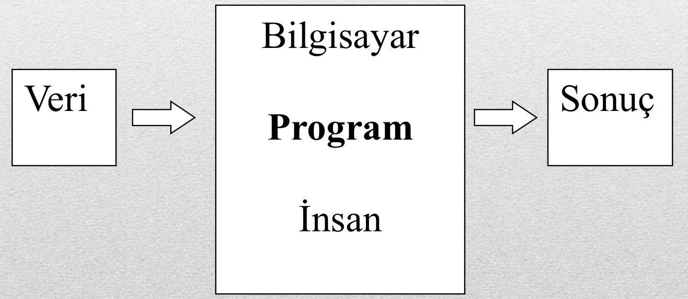
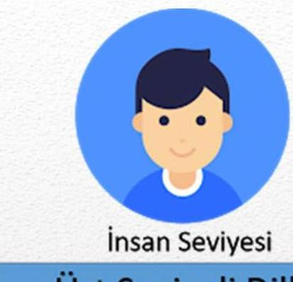
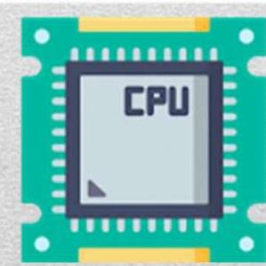
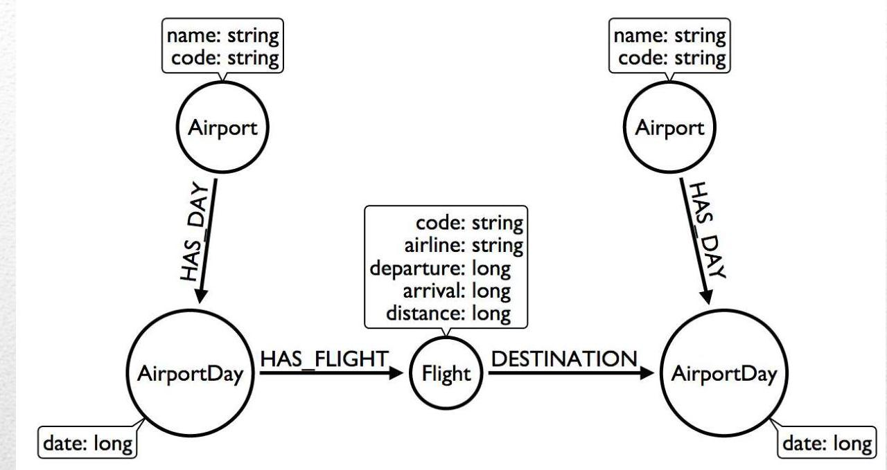
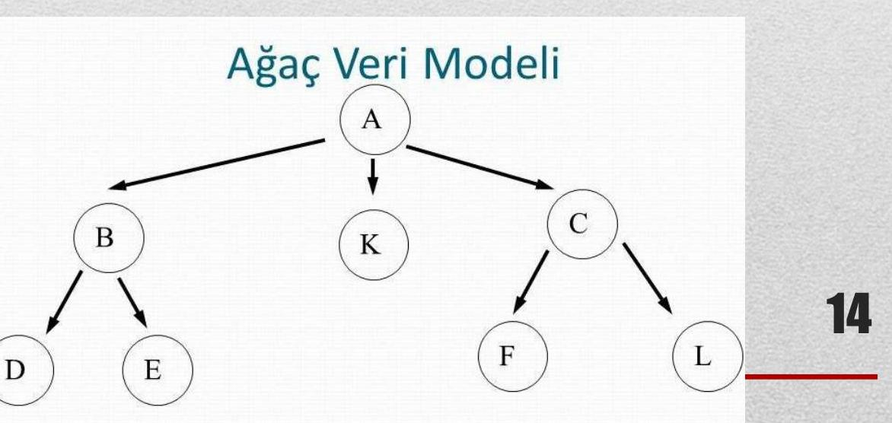

# Bilgisayar Programlamaya Giriş – Ders Notu 1: Genel Giriş ve Programlamanın Temel Kavramları

> **Hazırlayan:** Konya Teknik Üniversitesi – Elektrik-Elektronik Mühendisliği Bölümü  
> **Tarih:** 15.03.2024  
> **Konum:** Konya

---

## İçindekiler

1. [Ders İçeriği](#ders-içeriği)  
2. [Kaynaklar](#kaynaklar)  
3. [Temel Tanımlar](#temel-tanımlar)  
   - [Program](#program)  
   - [Yazılım ve Program Kodu](#yazılım-ve-program-kodu)  
   - [Değişken, Dizi, Operatör](#değişken-dizi-operatör)  
   - [Deyim ve Atama](#deyim-ve-atama)  
   - [Donanım, Bellek, Saklama Birimleri](#donanım-bellek-saklama-birimleri)  
   - [İşlemci ve İşletim Sistemi](#işlemci-ve-i̇şletim-sistemi)  
   - [Dosya](#dosya)  
   - [Programlama Dilleri ve C Dili](#programlama-dilleri-ve-c-dili)  
   - [Karakter Tabloları ve Veri Yapıları](#karakter-tabloları-ve-veri-yapıları)  
   - [Problem Çözme Yaklaşımları](#problem-çözme-yaklaşımları)  
4. [Sayı Sistemleri ve Bilgi İfadeleri](#sayı-sistemleri-ve-bilgi-i̇fadeleri)  
   - [Bit ve Bellek Birimleri](#bit-ve-bellek-birimleri)  
   - [İkili (Binary), Onaltılı (Hexadecimal) Sistemler](#i̇ki̇li̇-bi̇nary-onaltılı̇-hexadeci̇mal-si̇stemler)  
   - [Tümleyenler ve Negatif Sayılar](#tümleyenler-ve-negati̇f-sayılar)  
   - [BCD Kodlama](#bcd-kodlama)  
   - [ASCII ve Genişletilmiş ASCII](#asci̇i̇-ve-geni̇şleti̇lmiş-asci̇i̇)  
   - [UNICODE](#uni̇code)  
5. [Veri Yorumlamasına Bağlı Anlam Değişimi](#veri̇-yorumlamasına-bağlı-anlam-deği̇şi̇mi̇)

---

## Ders İçeriği

1. Genel Giriş ve Programlamanın Temel Kavramları  
2. Algoritma Tasarımı ve Akış Diyagramları  
3. C Fonksiyonlarına Giriş ve Değişkenler  
4. Operatörler  
5. Karşılaştırma İfadeleri  
6. Döngüler  
7. Diziler, Matrisler  
8. Sıralama, Arama  
9. Fonksiyonlar  
10. İşaretçiler  
11. String (Sözce)  
12. Matematiksel Fonksiyonlar ve Uygulamalar  
13. Dosya İşlemleri  
14. Örnek Uygulamalar

---

## Kaynaklar

- **Programlama Sanatı, Algoritmalar, C Dili Uyarlaması** – Dr. Rifat ÇÖLKESEN, Papatya Yayıncılık  
- **Her Yönüyle C** – Tevfik KIZILÖREN, Kodlab  
- **C Programlama Dili** – Dr. Rifat ÇÖLKESEN, Papatya Yayıncılık  
- [http://www.cagataycebi.com/programming/#c](http://www.cagataycebi.com/programming/#c)  
- [http://www1.gantep.edu.tr/~bingul/c/](http://www1.gantep.edu.tr/~bingul/c/)  
- [http://web.itu.edu.tr/uyar/programlama/c.pdf](http://web.itu.edu.tr/uyar/programlama/c.pdf)

---

## Temel Tanımlar

### Program

- Belirli bir görevi yerine getiren **algoritmik bir yapıdır**.  
- Kodlanarak (yazılım) ya da donanımsal olarak (örneğin FPGA) tasarlanabilir.  
- 

### Yazılım ve Program Kodu

- **Yazılım**: Birden fazla program, veri ve dokümanın birleşimiyle oluşan bütündür.
- **Program Kodu**: Belirli bir işi yapmak üzere bir programlama diliyle yazılmış algoritmik ifade.

### Değişken, Dizi, Operatör

- **Değişken**: Verilerin bellekte saklandığı simgesel isim (örn: `sicaklik`, `tekrarSayisi`).
- **Dizi**: Aynı türdeki verilerin tek bir isim altında sıralı saklandığı yapı.  
  - 1 boyutlu → vektör, 2 boyutlu → matris.
- **Operatör**: Veriler üzerinde işlem yapan semboller (örn: `+`, `-`, `sqrt()` gibi).

### Deyim ve Atama

- **Deyim (Statement)**: Tek bir işlemi ifade eder (örn: "Pırasaları doğra" → bir deyim).
- **Atama Deyimi**: Bir değişkene değer verme işlemi.  
  - Gösterim: `N ← 5` (N değişkenine 5 atanır).

### Donanım, Bellek, Saklama Birimleri

- **Donanım**: Fiziksel bileşenler (işlemci, bellek, disk vb.).
- **Bellek (RAM)**: Geçici, hızlı veri saklama birimi.
- **Saklama Birimleri (HDD, SSD, CD)**: Kalıcı, ancak daha yavaş depolama.

### İşlemci ve İşletim Sistemi

- **İşlemci (CPU)**: Komutları işleyen merkez birim (Intel, AMD vb.).
- **İşletim Sistemi (OS)**: Donanımı kullanıcıya/uygulamalara sunan ara katman (Windows, Linux, macOS).

### Dosya

- Disk üzerinde saklanan veri paketidir.  
- Her dosyanın başlangıç ve bitiş adresi vardır.  
- Silme işlemi sadece adresi siler → çok hızlıdır.  
- Uzantılar veri türünü belirtir: `.c`, `.jpeg`, `.doc` vb.

### Programlama Dilleri ve C Dili

- Programlama dilleri, insan-makine iletişimi için **söz dizimi (syntax)** kurallarıyla tanımlanır.
- **C Dili**: Orta seviyeli, 1972’de **Dennis Ritchie** tarafından PDP-11 için geliştirildi.
- C, hem donanıma yakın (işaretçiler, bellek yönetimi) hem de taşınabilir yapıdadır.
  
  

### Karakter Tabloları ve Veri Yapıları

- **Karakter Tablosu**: İnsan dilindeki sembollerin makine diline (binary) dönüşümünü sağlar.
  - Örn: `BABA` → ASCII: `66 65 66 65` (ondalık: 66 = 'B', 65 = 'A')
- **Sözce (String)**: Karakter dizisi; aritmetik işleme **girmez**, ancak sayıya dönüştürülebilir.
- **Veri Yapısı**: Bellekte verinin nasıl saklandığını belirtir:
  - `int` (tamsayı), `float` (gerçel sayı), `char` (karakter) vb.

### Problem Çözme Yaklaşımları

- **Böl ve Yönet**: Büyük problemi küçük alt problemlere ayır.
- **Çevrimli (Iterative)**: `for`, `while` döngüleriyle tekrar.
- **Rekürsif (Recursive)**: Fonksiyonun kendini çağırması.

---

## Sayı Sistemleri ve Bilgi İfadeleri

### Bit ve Bellek Birimleri

- **Bit**: En küçük veri birimi → `0` veya `1`.
- **1 Byte = 8 Bit**
- **1024 Byte = 1 KB**, **1024 KB = 1 MB**, **1024 MB = 1 GB**, **1024 GB = 1 TB**

### İkili (Binary), Onaltılı (Hexadecimal) Sistemler

- **1 Byte → 2⁸ = 256 farklı değer** (0–255)
  - `(11111111)₂ = (255)₁₀`
- **Onaltılık (Hex)**: 4 bit = 1 hex basamak.
  - Tablo ile kolay dönüşüm:
    - `10 → A`, `11 → B`, ..., `15 → F`

| Decimal | Hex | Binary |
|--------|-----|--------|
| 10     | A   | 1010   |
| 15     | F   | 1111   |

- **n bit ile ifade edilebilecek en büyük sayı**: `2ⁿ – 1`
  - Örn: 1 milyon için → `2²⁰ = 1.048.576` → **20 bit yeterli**, ama C’de standart boyutlar kullanılır → **32 bit (4 Byte)** seçilir.

### Tümleyenler ve Negatif Sayılar

- **1’e Göre Tümleyen**: Bitleri tersine çevir (`0 ↔ 1`)
  - `(10110100)₂ → (01001011)₂`
- **2’ye Göre Tümleyen**: 1’e göre tümleyene `1` ekle → C dilinde **negatif sayı** bu şekilde saklanır.
  - `(180)₁₀ → (10110100)₂`  
    → 1’e göre tümleyen: `(01001011)₂ = 75`  
    → 2’ye göre tümleyen: `(01001100)₂ = 76` → yani `-180` olarak saklanır.

> 💡 C ve çoğu dil **2’ye göre tümleyen** kullanır.

### BCD Kodlama

- **Binary Coded Decimal**: Her ondalık basamak 4 bit ile kodlanır.
  - `4859` → `0100 1000 0101 1001`
- **Dezavantaj**: 16 bit ile sadece `0–9999` (normalde `0–65535`) → verimsiz.

### ASCII ve Genişletilmiş ASCII

- **ASCII**: 1963’te standartlaştırılan 7-bit (128 karakter) kod tablosu.
  - Harfler, rakamlar, noktalama işaretleri.
  - `'A' = 65`, `'a' = 97`, `'0' = 48`
- **Genişletilmiş ASCII**: 8-bit → 256 karakter (Türkçe karakterler **yoktur**!)

  

### UNICODE

- **16-bit** veya daha fazla → **65.536+** karakter.
- Türkçe (`Ğ`, `İ`, `Ş`, `ç`), Yunanca, Arapça, Japonca karakterleri destekler.
- **Evrensel standart**: UTF-8, UTF-16 gibi kodlamalarla uygulanır.

---

## Veri Yorumlamasına Bağlı Anlam Değişimi

Aynı bit dizisi, **veri türüne göre farklı anlamlar** taşır:

> **Bit Dizisi:** `0100001001000001`

| Yorum Türü         | Anlamı                                 |
|--------------------|----------------------------------------|
| **String (ASCII)** | `'B' 'A'` → `"BA"`                     |
| **BCD**            | `0100 0010 0100 0001` → `4 2 4 1` → `4241` |
| **16-bit Tamsayı** | `(0100001001000001)₂ = 16961`         |

> 🔍 Aynı veri, nasıl yorumlandığına göre **tamamen farklı sonuçlar** verir!

---

## Özet

Bu ders notu, bilgisayar programlamaya giriş seviyesinde **temel kavramları**, **veri temsillerini** ve **C dilinin yerini** açıklamaktadır. Programlama yalnızca kod yazmak değil, **veriyi doğru anlamak**, **donanım-software ilişkisini kavramak** ve **problemleri yapılandırarak çözmek**tir.

> **Motivasyon:**  
> “Bir program yazmak, bir düşünceyi makineye öğretmektir.”  
> — *Bilinmeyen*

---

## Kaynaklar

- Dr. Rifat ÇÖLKESEN, *Programlama Sanatı*, Papatya Yayıncılık  
- Tevfik KIZILÖREN, *Her Yönüyle C*, Kodlab  
- Çeşitli internet kaynakları (Gantep, İTÜ, Çağatay Çebi)  
- ASCII ve Unicode standart dokümanları

---

> 📌 **Not:** Bu ders notu, Konya Teknik Üniversitesi EEM Bölümü ders içeriğine uygun olarak hazırlanmıştır. Görseller orijinal sunumdan alınmıştır.