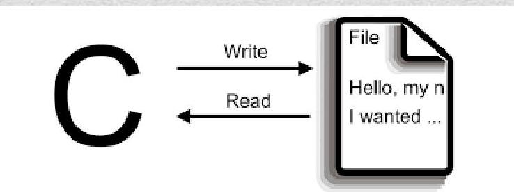

# BILGISAYAR PROGRAMLAMA 1  
## Ders Notu 13 - Dosya İşlemleri  

> [!infobox]  
> **Konya Teknik Üniversitesi**  
> Elektrik - Elektronik Mühendisliği Bölümü  
> 27.05.2024 | Konya  

---

## İçindekiler

- [[#Dosya İşlemleri]]
- [[#Dosya Türleri]]
- [[#FILE Yapısı]]
- [[#fopen Fonksiyonu]]
- [[#fclose Fonksiyonu]]
- [[#Metin Dosyası İşlemleri]]
- [[#EOF ve feof]]
- [[#fprintf ve fscanf]]
- [[#fputs ve fgets]]
- [[#rewind, fseek ve ftell]]
- [[#Ödev]]
- [[#Kaynaklar]]

---

## Dosya İşlemleri  

- **Değişkenler** program çalıştığı sürece bellekte tutulur, ancak **dosyalar** programdan bağımsızdır ve kalıcıdır.  
- Dosyalar sayesinde **farklı programlar arası veri paylaşımı** mümkündür.  
- Dosya boyutu, sabit disk kapasitesi izin verdiği sürece **sınırsızdır**.



---

## Dosya Türleri  

| Tür | Açıklama |
|-----|----------|
| **Metin (Text) Dosyaları** | Sadece **ASCII karakterlerinden** oluşur. Her karakter **1 bayt** yer kaplar. **İleri yönlü** erişimlidir. |
| **İkili (Binary) Dosyalar** | **8 bitlik veri blokları** halinde saklanır. Özel editörlerle okunur. **İleri-geri erişim** mümkündür. Örn: `.doc`, `.exe` |

---

## FILE Yapısı  

- C'de dosya işlemleri **akış (stream)** üzerinden yapılır.
- Akış yönetimi için `FILE` yapısı kullanılır.
- `FILE` yapısı `stdio.h` kütüphanesinde tanımlıdır.
- Örnek tanımlama:
  ```c
  FILE *dosya_gostergesi;
  ```

---

## fopen Fonksiyonu  

Dosya açmak için kullanılır. İki parametre alır:  
1. Dosya adı (yol ile birlikte olabilir)  
2. **Erişim modu**

### Erişim Modları

| Mod | Açıklama |
|-----|----------|
| `r`     | Salt okuma |
| `w`     | Yeni yazma (varsa siler) |
| `a`     | Sona ekleme |
| `r+`    | Okuma + yazma (dosya var olmalı) |
| `w+`    | Okuma + yazma (varsa siler) |
| `a+`    | Okuma + ekleme |
| `rb`    | Binary okuma |
| `r+b`   | Binary okuma + yazma |

> [!note]  
> `fopen` başarılıysa **dosya işaretçisi**, başarısızsa **NULL** döner.

### Örnek Kullanım  
```c
FILE *dosya = fopen("dosya.txt", "w");
if (dosya == NULL) {
    printf("Dosya acilamadi!\n");
    return 1;
}
```

---

## fclose Fonksiyonu  

- Dosya ile işiniz bittiğinde **kapatmalısınız**.
- Bellek sızıntısını ve veri kaybını önler.
- Kullanım:
  ```c
  fclose(dosya);
  ```
- Başarılıysa **0**, başarısızsa **0’dan farklı** değer döner.

---

## Metin Dosyası İşlemleri  

### 1. Karakter Bazlı İşlemler  
- `fputc(char, FILE*)`: Karakter yazar  
- `fgetc(FILE*)`: Karakter okur  

> [!success]  
> `putc` makro, `fputc` fonksiyondur. **`fputc` tercih edilir.**

### Örnek-2: Karakter Yazma  
```c
#include <stdio.h>
int main() {
    FILE *dosya = fopen("Deneme3 Metin Belgesi.txt", "w");
    fputc('A', dosya);
    fclose(dosya);
    return 0;
}
```

---

## EOF ve feof  

- **EOF** (End Of File): Dosya sonu işaretidir (`-1` değerindedir).
- `fgetc` dosya sonuna geldiğinde **EOF** döner.
- Ancak dosya erişim hatasında da EOF döner → **yanıltıcı olabilir**.
- **Çözüm**: `feof(FILE*)` fonksiyonu  
  - Dosya sonuna **gerçekten ulaşıldıysa** `0` **dışında** değer döner.

### Örnek-4a: EOF ile Okuma  
```c
char c;
while ((c = fgetc(dosya)) != EOF) {
    printf("%c", c);
}
```

### Örnek-4b: feof ile Okuma  
```c
do {
    char c = fgetc(dosya);
    if (feof(dosya)) break;
    printf("%c", c);
} while (1);
```

> [!warning]  
> `char c` yerine **`int c`** kullanılması önerilir çünkü EOF negatiftir ve `char`'da hatalı karşılaştırma olabilir.

---

## fprintf ve fscanf  

- `fprintf(FILE*, format, ...)` → `printf` gibi, ama dosyaya yazar  
- `fscanf(FILE*, format, ...)` → `scanf` gibi, ama dosyadan okur

### Örnek-5  
```c
FILE *dosya1 = fopen("Deneme3.txt", "r");
FILE *dosya2 = fopen("Deneme4.txt", "w+");
char ch;
fscanf(dosya1, "%c", &ch);
fprintf(dosya2, "%c", ch);
```

> [!note]  
> `fscanf`'te değişken adresi (`&ch`) alınmalı!

---

## fputs ve fgets  

- `fputs(char*, FILE*)`: Karakter dizisini (satırı) dosyaya yazar  
- `fgets(char*, int, FILE*)`: Dosyadan **en fazla n-1 karakter** okur ve `\0` ekler

### Örnek-6  
```c
char satir[100];
fgets(satir, 100, dosya);  // Dosyadan satır oku
fputs(satir, yeni_dosya);  // Başka dosyaya yaz
```

> [!note]  
> `fgets`, satır sonu karakterini (`\n`) de okur!

---

## rewind, fseek ve ftell  

### rewind(FILE*)  
- Dosya imlecini **başa** alır.  
  ```c
  rewind(dosya);
  ```

### fseek(FILE*, long offset, int origin)  
İmleci belirli bir yere taşır:

| origin       | Açıklama |
|--------------|--------|
| `SEEK_SET`   | Dosya başı |
| `SEEK_CUR`   | Mevcut konum |
| `SEEK_END`   | Dosya sonu |

### Örnekler  
```c
fseek(dosya, 10, SEEK_SET);   // Baştan 10 bayt ileri
fseek(dosya, -5, SEEK_CUR);   // Şu anki yerden 5 geri
fseek(dosya, -100, SEEK_END); // Sondan 100 geri
```

> [!note]  
> **Metin modda** sadece `offset = 0` güvenlidir. Binary modda esnek kullanılır.

### ftell(FILE*)  
- İmlecin **konumunu** (bayt cinsinden) döner.  
  ```c
  long pos = ftell(dosya);
  ```

---

## Ödev  

> [!example]+ Ödev: Matris ve Transpoz  
> 1. Kullanıcıdan **5x5** bir matris alın.  
> 2. Bu matrisi **`matris1.txt`** dosyasına yazın.  
> 3. **`matris1.txt`** dosyasını okuyarak transpozunu alıp **`matris2.txt`** dosyasına yazın.  
> 4. Transpoz işlemi sırasında **dosyadan okuyup hemen yazın**, tüm matrisi belleğe almayın.

💡 **İpucu**:  
- Önce satır satır okuyup sütunlara yazabilirsiniz.  
- `fscanf` ile sayı okuyun, `fprintf` ile yazın.  
- `rewind` veya `fseek` ile dosya başına dönerek tekrar okuyabilirsiniz.

---

## Kaynaklar  

- Her Yönüyle C, Tevfik KIZILÖREN, Kodlab