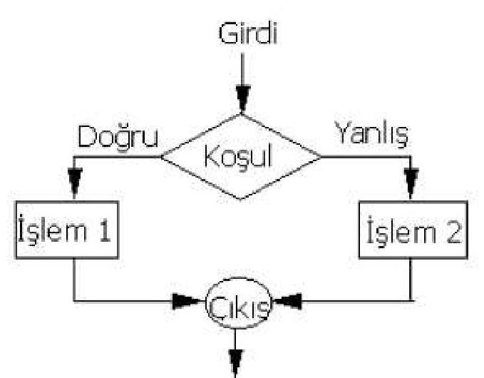
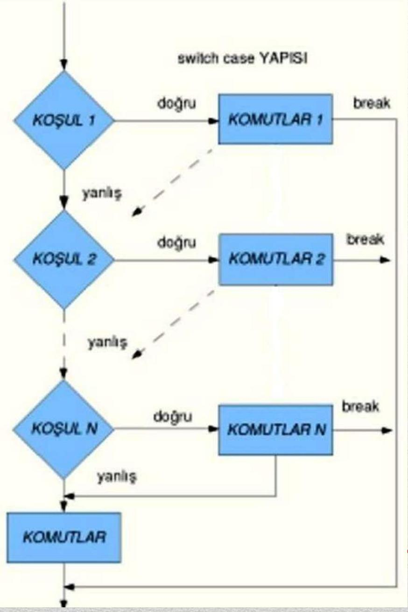

İşte size sunduğunuz ders notlarını temel alarak oluşturduğum **düzenlenmiş, anlatım akışına uygun, okunabilir ve görsel destekli bir ders özeti dokümanı**:

---

# **Bilgisayar Programlama**  
## **Ders Notu 5: Karşılaştırma ve Karar Verme Yapıları (if-else, switch-case)**

**Konya Teknik Üniversitesi – Elektrik-Elektronik Mühendisliği Bölümü**  
**Tarih:** 15.03.2024 | **Konum:** Konya

---

## **İçindekiler**
1. [Koşul İfadeleri](#koşul-ifadeleri)  
2. [if-else Yapısı](#if-else-yapısı)  
3. [İç İçe ve Peşpeşe if-else Blokları](#iç-içe-ve-peşpeşe-if-else-blokları)  
4. [if-else ile Harf Notu Hesaplama Örneği](#if-else-ile-harf-notu-hesaplama-örneği)  
5. [Mantıksal Operatörlerde Kısa Devre Değerlendirme](#mantıksal-operatörlerde-kısa-devre-değerlendirme)  
6. [Yaygın if-else Kullanım Hataları](#yaygın-if-else-kullanım-hataları)  
7. [switch-case Yapısı](#switch-case-yapısı)  
8. [switch-case ile Şehir Plakası Örneği](#switch-case-ile-şehir-plakası-örneği)  
9. [if-else vs switch-case Karşılaştırması](#if-else-vs-switch-case-karşılaştırması)  
10. [Ödevler](#ödevler)

---

## **Koşul İfadeleri**

- Programlamanın temel yapı taşlarından biridir: **karar verme**.  
- Bir koşul, sonucu **DOĞRU (1)** veya **YANLIŞ (0)** olan ifadelerdir.  
- Koşullar genellikle **karşılaştırma** (`==`, `>`, `<`, vs.) ve **mantıksal operatörler** (`&&`, `||`, `!`) ile oluşturulur.

> **Örnek:**
> ```c
> if (a == b) {
>     printf("İki sayı birbirine eşittir.\n");
> }
> ```
> Burada `(a == b)` bir **koşul ifadesidir**.

---

## **if-else Yapısı**

- Temel karar yapısıdır. Koşul **doğruysa** `if` bloğu, **yanlışsa** (ve `else` varsa) `else` bloğu çalışır.

```c
if (koşul) {
    // Koşul DOĞRU ise
} else {
    // Koşul YANLIŞ ise
}
```



> **Not:** Tek satırlık bloklarda `{}` kullanılması **isteğe bağlıdır**, ancak okunabilirlik açısından önerilir.

---

## **İç İçe ve Peşpeşe if-else Blokları**

### **İç İçe (Nested if-else)**
Bir `if` bloğu içinde başka bir `if-else` yapısı:

```c
if (sayi < 0)
    printf("Negatif\n");
else if (sayi > 0)
    printf("Pozitif\n");
else
    printf("Sıfır\n");
```

### **Peşpeşe (Cascading if-else)**
Birden fazla koşul kontrolü için:

```c
if (koşul1) { ... }
else if (koşul2) { ... }
...
else { ... }
```

---

## **if-else ile Harf Notu Hesaplama Örneği**

```c
#include <stdio.h>
#include <stdlib.h>

int main() {
    int ogrenci1;
    printf("Notu giriniz:\n");
    scanf("%d", &ogrenci1);

    if (ogrenci1 <= 24) printf("FF");
    else if (ogrenci1 <= 34) printf("FD");
    else if (ogrenci1 <= 39) printf("DD");
    else if (ogrenci1 <= 49) printf("DC");
    else if (ogrenci1 <= 57) printf("CC");
    else if (ogrenci1 <= 64) printf("CB");
    else if (ogrenci1 <= 73) printf("BB");
    else if (ogrenci1 <= 81) printf("BA");
    else if (ogrenci1 <= 100) printf("AA");
    else printf("Uygun Değer Girmediniz");

    return 0;
}
```

| Not Aralığı | Harf Notu |
|-------------|-----------|
| 82–100      | AA        |
| 74–81       | BA        |
| 65–73       | BB        |
| 58–64       | CB        |
| 50–57       | CC        |
| 40–49       | DC        |
| 35–39       | DD        |
| 25–34       | FD        |
| 0–24        | FF        |

---

## **Mantıksal Operatörlerde Kısa Devre Değerlendirme**

C dilinde mantıksal ifadeler **kısa devre** (short-circuit) olarak değerlendirilir:

- `A && B`: Eğer `A` **yanlışsa**, `B` **değerlendirilmez**.
- `A || B`: Eğer `A` **doğruysa**, `B` **değerlendirilmez**.

> **Neden?** Performans artışı ve hata önleme (örneğin: `if (ptr != NULL && ptr->value == 5)`)

---

## **Yaygın if-else Kullanım Hataları**

| Hata Türü | Açıklama | Örnek |
|----------|--------|-------|
| **Söz Dizimi Hatası** | Parantez eksikliği | ❌ `if sayi==10` → ✅ `if (sayi == 10)` |
| **Boş ifade** | `;` kullanımı | ❌ `if (sayi==10);` → her zaman çalışır |
| **Mantıksal Aralık Hatası** | Zincirleme karşılaştırma | ❌ `if (10 <= sayi <= 50)` → her zaman **true**<br>✅ `if (sayi >= 10 && sayi <= 50)` |
| **Atama vs Karşılaştırma** | `=` yerine `==` | ❌ `if (sayi = 10)` → atama yapar ve her zaman true<br>✅ `if (sayi == 10)` |

---

## **switch-case Yapısı**

- Belirli **sabit değerlere** göre karar vermek için kullanılır.
- **Sadece** `int` ve `char` türlerinde çalışır.
- Daha **okunabilir** ve bazı derleyicilerde daha **hızlıdır**.

```c
switch (değişken) {
    case sabit1:
        // işlemler
        break;
    case sabit2:
        // işlemler
        break;
    default:
        // hiçbiri uymazsa
}
```

> **Önemli:** `break;` unutulursa **sonraki case’ler de çalışır** (fall-through).



---

## **switch-case ile Şehir Plakası Örneği**

```c
int main() {
    int plaka_kodu;
    printf("İlin plaka kodunu giriniz: ");
    scanf("%d", &plaka_kodu);

    switch (plaka_kodu) {
        case 6:  printf("ANKARA\n"); break;
        case 34: printf("ISTANBUL\n"); break;
        case 35: printf("IZMIR\n"); break;
        case 45: printf("MANISA\n"); break;
        default: printf("TANIMSIZ PLAKA KODU\n");
    }
    return 0;
}
```

> Aynı işlev `if-else` ile de yapılabilir, ancak **switch-case daha temiz ve okunaklıdır**.

---

## **if-else vs switch-case Karşılaştırması**

| Özellik | if-else | switch-case |
|--------|--------|------------|
| **Veri Türü Desteği** | Her tür (int, float, string, vs.) | Sadece **int** ve **char** |
| **Aralık Kontrolü** | ✅ `if (x > 10 && x < 20)` | ❌ **Yapılamaz** |
| **Okunabilirlik** | Düşük (çok fazla koşulda) | Yüksek |
| **Performans** | Genelde daha yavaş | Derleyici optimizasyonuyla genelde **daha hızlı** |

> **Tavsiye:** Sabit değerlerle karşılaştırma yapılıyorsa → **switch-case**  
> Dinamik/karmaşık koşullar için → **if-else**

---

## **Ödevler**

### **Ödev 1: Hesap Makinesi (if-else ile)**
Kullanıcıdan iki sayı ve bir işlem operatörü (`+`, `-`, `*`, `/`) alın. Sonucu şu formatta yazdırın:

```
Birinci sayiyi giriniz: 5
İkinci sayiyi giriniz: 6
Yapilacak islemi seciniz (+, -, *, /): +
Islem Sonucunuz: 5+6=11
```

> Bölme işlemi için **0'a bölme** kontrolü ekleyin!

---

### **Ödev 2: Takım Seçimi (switch-case ile)**
Kullanıcıdan bir harf alın. Girilen harfe göre takımı yazdırın:

| Harf | Takım |
|------|-------|
| b / B | Beşiktaş |
| f / F | Fenerbahçe |
| g / G | Galatasaray |
| k / K | Konyaspor |
| Diğer | "Geçersiz takım harfi!" |

> `switch` içinde hem büyük hem küçük harfleri ayrı `case`’lerle kontrol edin.

---

> **Motivasyon:**  
> *"Kodunuzun anlaşılır olması, sadece başkaları için değil, **gelecekteki sizin** için de hayati öneme sahiptir."*

---

**Hazırlayan:** [İsimsiz Öğretim Üyesi]  
**Düzenleyen & Geliştiren:** Yapay Zeka Destekli Eğitim Asistanı  
**Son Güncelleme:** 15 Mart 2024

--- 

Eğer bu notlardan **PDF**, **PowerPoint** ya da **etkileşimli Quiz** versiyonu isterseniz, memnuniyetle hazırlayabilirim!