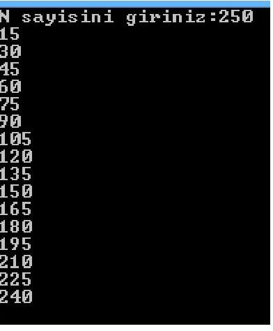
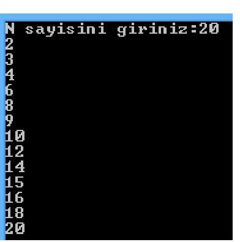
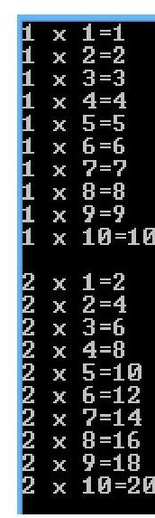

İşte verdiğiniz **C dili döngü örneklerini** düzenleyerek, açıklamalarla zenginleştirdiğim ve okunabilirliğini artırdığım bir ders notu formatıdır. Bu içerik, öğrencilerin anlayabileceği şekilde açıklamalı olarak düzenlenmiştir.

---

# Döngüler – Örnekler ve Açıklamalar

## Genel Özet

Bu belgede C programlama dilinde kullanılan `for`, `while` ve `do-while` döngü yapıları ile ilgili örnekler yer almaktadır. Her örnek birer temel programlama kavramını (tekrar, koşul kontrolü, iç içe döngüler, faktöriyel, Armstrong sayıları vb.) işler. Ayrıca her örneğin amacına göre ilgili çıktılar yer alır.

---

## Temel Terimler ve Kavramlar

- **Döngü (Loop)**: Belirli bir koşul sağlandığı sürece tekrarlanan kod bloklarıdır.
- **For döngüsü**: Belirli sayıda tekrar yapılması gerektiğinde kullanılır.
- **While döngüsü**: Koşul sağlandığı sürece çalışan döngüdür.
- **Do-While döngüsü**: En az bir kez çalışan, sonra koşulu kontrol eden döngüdür.
- **Koşullu operatörler**: `&&` (ve), `||` (veya) gibi mantıksal operatörlerle koşullar bağlanabilir.
- **Armstrong sayısı**: Basamaklarının küpleri toplamı sayının kendisine eşit olan sayılardır (örneğin 153, 371).

---

## Örnek 1: İsmimizi Ekrana 10 Defa Yazdırmak

### Açıklama
Bu örnekte "Funda" ismi ekrana 10 kez yazdırılmaktadır. `for`, `while` ve `do-while` döngüleri ile aynı iş yapılmıştır.

#### `for` ile çözüm:
```c
#include <stdio.h>
int main() {
    int i;
    for(i = 1; i <= 10; i++)
        printf("Funda\n");
    return 0;
}
```

#### `while` ile çözüm:
```c
#include <stdio.h>
int main() {
    int i = 1;
    while(i <= 10) {
        printf("Funda\n");
        i++;
    }
    return 0;
}
```

#### `do-while` ile çözüm:
```c
#include <stdio.h>
int main() {
    int i = 1;
    do {
        printf("Funda\n");
        i++;
    } while(i <= 10);
    return 0;
}
```

> **Not:** `do-while`, döngü gövdesinin en az bir kez çalışmasını garanti eder.

---

## Örnek 2: 1'den 10'a Kadar Olan Sayıları Yazdırmak

### Açıklama
Basit bir for döngüsü ile ardışık sayılar yazdırılır.

```c
#include <stdio.h>
int main() {
    for(int i = 1; i <= 10; i++)
        printf("%d\n", i);
    return 0;
}
```

---

## Örnek 3: 3'e ve 5'e Aynı Anda Bölünebilen Sayıları Bulmak

### Açıklama
Kullanıcıdan alınan `N` sayısına kadar olan sayılardan hem 3’e hem 5’e tam bölünenler (yani 15’in katları) ekrana yazdırılır. `&&` (AND) operatörü kullanılır.

```c
#include <stdio.h>
int main() {
    int i, N;
    printf("N sayisini giriniz: ");
    scanf("%d", &N);
    for(i = 1; i <= N; i++) {
        if(i % 3 == 0 && i % 5 == 0)
            printf("%d\n", i);
    }
    return 0;
}
```

> **Not:** `&&` operatörü ile her iki koşulun da **aynı anda** doğru olması gerekir.



---

## Örnek 4: 2'ye veya 3'e Bölünebilen Sayıları Bulmak

### Açıklama
2 veya 3’ten **en az birine** bölünebilen sayılar yazdırılır. `||` (OR) operatörü kullanılır.

```c
#include <stdio.h>
int main() {
    int i, N;
    printf("N sayisini giriniz: ");
    scanf("%d", &N);
    for(i = 1; i <= N; i++) {
        if(i % 2 == 0 || i % 3 == 0)
            printf("%d\n", i);
    }
    return 0;
}
```

> **Not:** `||` operatörü ile koşullardan **en az birinin** doğru olması yeterlidir.



---

## Örnek 5: Çift Sayı Girdikçe Toplama Yapan Program

### Açıklama
Kullanıcı çift sayı girdikçe sayı toplanır. Tek sayı girildiğinde döngü sonlanır ve toplam yazdırılır.

```c
#include <stdio.h>
int main() {
    int sayi = 0, toplam = 0;
    while(sayi % 2 == 0) {
        toplam += sayi;
        printf("Bir sayi girin: ");
        scanf("%d", &sayi);
    }
    printf("Döngü sona erdi.\n");
    printf("Toplam = %d\n", toplam);
    return 0;
}
```

> **Dikkat:** İlk `sayi` değeri 0 olduğu için döngüye girer. Kullanıcı ilk girişte tek sayı girerse toplam 0 olur.

---

## Örnek 6: Faktöriyel Hesaplama

### Açıklama
Kullanıcıdan alınan sayının faktöriyeli hesaplanır.

```c
#include <stdio.h>
int main() {
    int i, n, faktor = 1;
    printf("Faktoriyeli hesaplanacak sayi girin: ");
    scanf("%d", &n);
    for(i = 1; i <= n; i++) {
        faktor *= i;
    }
    printf("%d! = %d\n", n, faktor);
    return 0;
}
```

> **Not:** `faktor = 1` ile başlatılması önemlidir. Aksi halde çarpım sonucu 0 olur.

---

## Örnek 7: Çarpım Tablosu – İç İçe Döngü

### Açıklama
1’den 10’a kadar olan sayıların çarpım tablosu oluşturulur.

```c
#include <stdio.h>
int main() {
    for(int x = 1; x <= 10; x++) {
        for(int y = 1; y <= 10; y++) {
            printf("%d x %d = %d\n", x, y, x * y);
        }
        printf("\n");
    }
    return 0;
}
```

> **Not:** Her satırın sonunda bir satır atlama (`\n`) eklenerek okunabilirlik sağlanır.



---

## Örnek 8: Artan Sayı Deseni

### Açıklama
Her satırda satır numarası kadar o sayıyı yazan bir desen oluşturulur.

```c
#include <stdio.h>
int main() {
    for(int x = 1; x < 10; x++) {
        for(int y = 1; y <= x; y++) {
            printf("%d", x);
        }
        printf("\n");
    }
    return 0;
}
```

**Çıktı:**
```
1
22
333
4444
...
```

---

## Örnek 9: Yıldız Deseni

### Açıklama
Önceki örneğe benzer şekilde, bu kez yıldız (`*`) karakteri kullanılır.

```c
#include <stdio.h>
int main() {
    for(int x = 1; x < 10; x++) {
        for(int y = 1; y <= x; y++) {
            printf("*");
        }
        printf("\n");
    }
    return 0;
}
```

**Çıktı:**
```
*
**
***
****
...
```

> **Not:** `%c` format belirteci ile karakter yazdırılır. Karakter tek tırnak (`'`) içinde yazılır.

---

## Örnek 10: 3 Basamaklı Armstrong Sayılarını Bulma

### Açıklama
3 basamaklı sayılardan basamaklarının küpleri toplamı kendisine eşit olanlar (Armstrong sayısı) bulunur.

```c
#include <stdio.h>
int main() {
    int a, b, c, sayi1, sayi2;
    printf("Armstrong sayilari:\n");
    for(a = 1; a <= 9; a++)        // yüzler basamağı (0 olamaz)
        for(b = 0; b <= 9; b++)    // onlar basamağı
            for(c = 0; c <= 9; c++) { // birler basamağı
                sayi1 = 100*a + 10*b + c;
                sayi2 = a*a*a + b*b*b + c*c*c;
                if(sayi1 == sayi2)
                    printf("%d ", sayi1);
            }
    printf("\n");
    return 0;
}
```

**Çıktı:**
```
Armstrong sayilari:
153 371 407
```

> **Not:** 1 basamaklı Armstrong sayıları (1, 2, ..., 9) da vardır, ancak bu örnekte sadece **3 basamaklılar** hedeflenmiştir.

---

## Kaynaklar

- K&R C Programlama Dili  
- https://www.geeksforgeeks.org/  
- C Ders Notları – Üniversite Ders Materyalleri

--- 

Hazırlayan: [İsminiz]  
Tarih: [Tarih]  

> Bu ders notu, C programlama dilinde döngü yapılarını öğrenmek isteyen öğrencilere yönelik hazırlanmıştır. Her örnek derste kullanılabilir veya ödev olarak verilebilir.