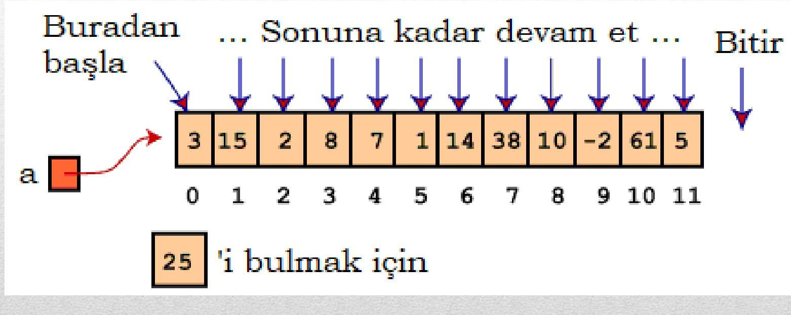
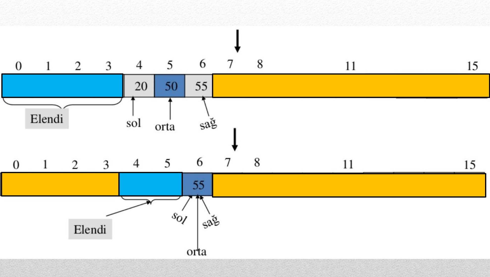

İşte **"Bilgisayar Programlama 1 – Ders Notu 8: Sıralama ve Arama"** konusuna dayalı olarak hazırlanmış, düzenli ve okunabilir bir ders notu örneği:

---

# BİLGİSAYAR PROGRAMLAMA I  
## Ders Notu 8: Sıralama ve Arama

**Yazan:** Konya Teknik Üniversitesi – Elektrik-Elektronik Mühendisliği Bölümü  
**Tarih:** 18 Nisan 2024  
**Yer:** Konya

---

## Genel Giriş

Diziler ve matrisler, sıralama ve arama gibi temel algoritmik işlemleri gerçekleştirmek için oldukça etkili veri yapılarıdır. Bu işlemler, tekil değişkenlerle yapılmaya kalkışıldığında hem karmaşıklaşır hem de pratikte neredeyse imkânsız hale gelir. Bu nedenle diziler, bu tür problemlerin çözümünde vazgeçilmezdir.

Arama ve sıralama algoritmaları, hem akademik hem de endüstriyel uygulamalarda kritik rol oynar. Özellikle büyük veri kümelerinde verimli sonuçlar alabilmek için doğru algoritmanın seçilmesi büyük önem taşır.

---

## Dizilerde Arama

**Arama**, bir dizinin belirli bir elemanının aranması sürecidir. Bu işlem sırasında dizinin herhangi bir elemanının arama değeriyle eşleşip eşleşmediği kontrol edilir.

### Kullanılan Arama Yöntemleri:
1. **Doğrusal Arama (Linear / Sequential Search)**
2. **İkili Arama (Binary Search)**

---

### 1. Doğrusal Arama (Linear Search)

- Dizi **sıralı ya da sırasız** olabilir.
- Dizinin başından sonuna kadar **her eleman** aranan değerle karşılaştırılır.
- Eleman bulunduğunda, **indeks numarası** döndürülür.
- En kötü durumda **n** (dizi uzunluğu) karşılaştırma yapılır. Ortalama **n/2** karşılaştırma yapılır.

#### Örnek Kod (C):

```c
#include <stdio.h>

int main() {
    int aranan, i, bulundu = 0;
    int dizi[12] = {3, 15, 2, 8, 7, 1, 14, 38, 10, -2, 61, 5};

    printf("Dizi içinde aramak istediğiniz sayıyı giriniz:\n");
    scanf("%d", &aranan);

    for(i = 0; i < 12; i++) {
        if(dizi[i] == aranan) {
            bulundu = 1;
            break;
        }
    }

    if(bulundu)
        printf("Aranan sayı, dizinin %d. elemanıdır.\n", i + 1);
    else
        printf("Aranan eleman bu dizide yoktur.\n");

    return 0;
}
```



---

### 2. İkili Arama (Binary Search)

- Dizinin **sıralı** olması zorunludur.
- Her adımda dizinin **ortadaki elemanı** kontrol edilir.
- Aranan değer ortadaki değerden küçükse sol yarısı, büyükse sağ yarısı aranır.
- Her adımda **arama alanının yarısı elenir** → **log₂(n)** karmaşıklık.

#### Örnek Kod (C):

```c
#include <stdio.h>
#include <math.h>

int main() {
    int array[16] = {3, 8, 10, 11, 20, 50, 55, 60, 65, 70, 72, 90, 91, 94, 96, 99};
    int sol = 0;
    int sag = 15;
    int flag = 0;
    int indis;
    int s;

    printf("Dizi içinde aramak istediğiniz sayıyı giriniz:\n");
    scanf("%d", &s);

    while (sol <= sag) {
        indis = (sol + sag) / 2;  // ceil yerine basit ortalama yeterli
        printf("İndis: %d\n", indis);

        if (array[indis] == s) {
            flag = 1;
            printf("Bulundu: %d. indekste\n", indis);
            break;
        } else if (array[indis] < s) {
            sol = indis + 1;
        } else {
            sag = indis - 1;
        }
    }

    if (flag == 0)
        printf("Bulunamadı!\n");

    return 0;
}
```

> **Not:** Kodda `ceil()` kullanımı yerine tamsayı bölme yeterlidir; çünkü `(sol + sag) / 2` zaten orta indeksi verir.



---

## Dizilerde Sıralama

Sıralama işlemi, verilerin belirli bir düzende (genellikle artan ya da azalan) düzenlenmesidir. Bu işlemlerde genellikle **iç içe döngüler** kullanılır.

Ders kapsamında iki temel sıralama algoritması ele alınmıştır:
1. **Kabarcık Sıralama (Bubble Sort)**
2. **Hızlı Sıralama (Quick Sort)**

---

### 1. Kabarcık Sıralama (Bubble Sort)

- **Çalışma Prensibi:** Ardışık elemanlar karşılaştırılır; yanlış sırada iseler yer değiştirilir.
- Her turda en büyük eleman **en sona "kabarcık" gibi çıkar**.
- Zaman karmaşıklığı: **O(n²)**

#### Örnek Kod (C):

```c
#include <stdio.h>
#include <stdlib.h>

int main() {
    int son, gecici;
    int dizi[100];
    int i, j;

    printf("Girilecek sayı adedi: ");
    scanf("%d", &son);

    for(i = 0; i < son; i++) {
        printf("%d. Sayıyı giriniz: ", i + 1);
        scanf("%d", &dizi[i]);
    }

    printf("Girilen dizi: ");
    for(i = 0; i < son; i++)
        printf("%d ", dizi[i]);
    printf("\n\n");

    // Kabarcık sıralama
    for(i = 0; i < son - 1; i++) {
        for(j = 0; j < son - 1 - i; j++) {
            if(dizi[j] > dizi[j + 1]) {
                gecici = dizi[j];
                dizi[j] = dizi[j + 1];
                dizi[j + 1] = gecici;
            }
        }
    }

    printf("Sıralanmış dizi: ");
    for(i = 0; i < son; i++)
        printf("%d ", dizi[i]);
    printf("\n");

    return 0;
}
```

---

### 2. Hızlı Sıralama (Quick Sort)

- **Böl ve Yönet** yaklaşımına dayanır.
- Diziden bir **pivot** seçilir; pivot elemanına göre diğer elemanlar **küçükler sola, büyükler sağa** yerleştirilir.
- Ardından sol ve sağ alt diziler ayrı ayrı sıralanır (rekürsif).
- C standart kütüphanesinde `qsort()` fonksiyonu olarak mevcuttur.
- Ortalama zaman karmaşıklığı: **O(n log n)**

> **Not:** Ders notunda hızlı sıralama adımları görsel olarak verilmemiş; ancak algoritma mantığı anlatılmıştır.

---

## Ödevler

### Ödev 1  
**Görev:** Türkiye’de belirli bir ay boyunca tahmin edilen günlük en yüksek hava sıcaklıklarını bir diziye girerek en düşük sıcaklığın kaçıncı gün gerçekleştiğini bulan bir C programı yazınız.

**İpucu:** Dizide en küçük elemanın indeksini bulmak yeterlidir.

---

### Ödev 2  
**Görev:** Aşağıdaki tabloya göre Konya için 5 günlük hava tahminleri verilmiştir. Tahmini en düşük ve en yüksek sıcaklıklar ile geçmiş yılların mevsimsel ortalamaları arasındaki farkı hesaplayan ve bunu bir matris şeklinde ekrana yazdıran bir C programı yazınız.

| Tarih       | Tahmini En Düşük | Tahmini En Yüksek | Ortalama En Düşük | Ortalama En Yüksek |
|-------------|------------------|-------------------|-------------------|--------------------|
| 20 Nisan    | 13               | 26                | 4.5               | 16.7               |
| 21 Nisan    | 7                | 23                | 4.8               | 16.5               |
| 22 Nisan    | 8                | 23                | 4.8               | 17.0               |
| 23 Nisan    | 9                | 28                | 4.4               | 17.5               |
| 24 Nisan    | 11               | 30                | 5.3               | 18.2               |

**Çıktı Örneği (Fark = Tahmin – Ortalama):**

```
Gün      Fark (En Düşük)    Fark (En Yüksek)
20 Nisan     +8.5                +9.3
21 Nisan     +2.2                +6.5
...
```

**İpucu:** İki boyutlu bir dizi (matris) kullanarak verileri saklayabilir ve farkları hesaplayabilirsiniz.

---

## Kaynaklar

1. **Programlama Sanatı, Algoritmalar, C Dili Uyarlaması** – Dr. Rifat ÇÖLKESEN, Papatya Yayıncılık  
2. **Her Yönüyle C** – Tevfik KIZILÖREN, Kodlab  
3. [MGM Hava Tahminleri – Konya](https://www.mgm.gov.tr/tahmin/il-ve-ilceler.aspx?il=KONYA)

---

> 📌 **Öğrencilere Not:** Arama ve sıralama algoritmaları, sadece sınavlarda değil; yazılım mühendisliğinde de (örneğin veritabanı indeksleme, arama motorları) temel yapı taşlarıdır. Bu algoritmaları kavramak, algoritmik düşünme becerinizi geliştirmenin ilk adımıdır.

--- 

Hazırlayan: [Öğrenci Adı – Öğrenci No]  
Ders: Bilgisayar Programlama I  
Akademik Danışman: [Danışman İsmi]