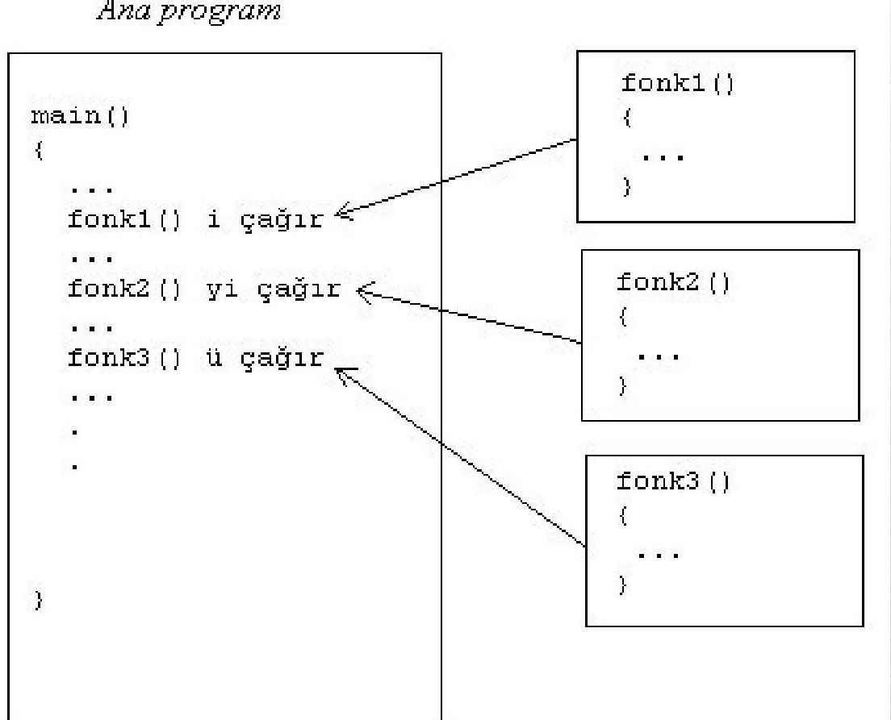
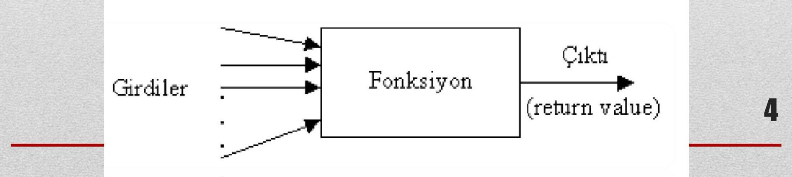
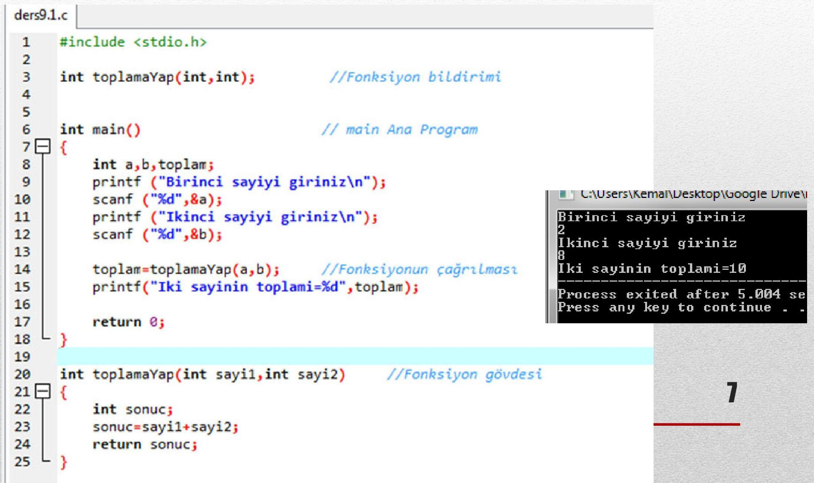
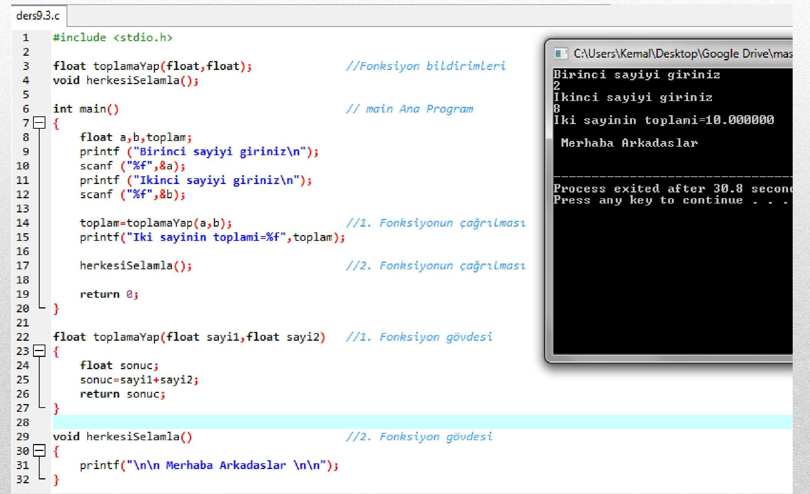
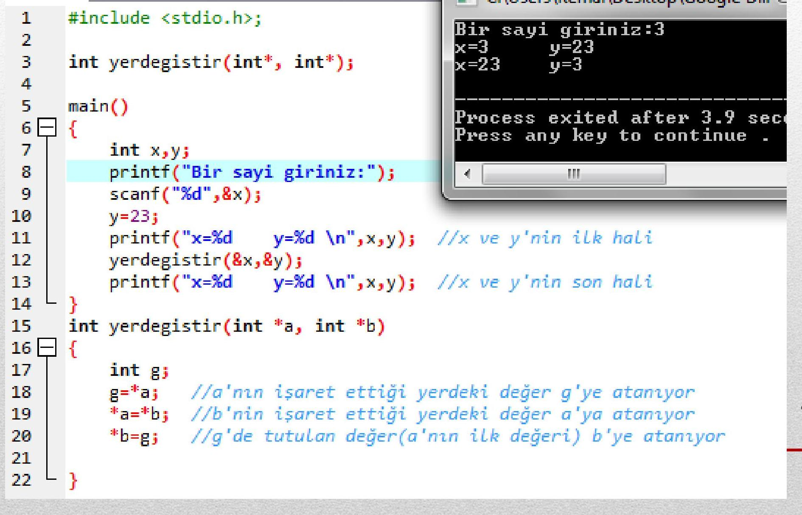
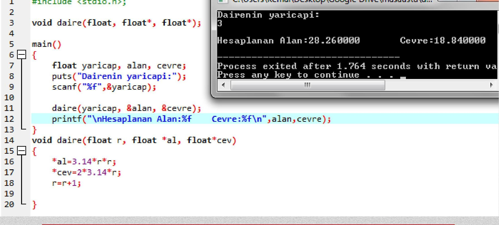
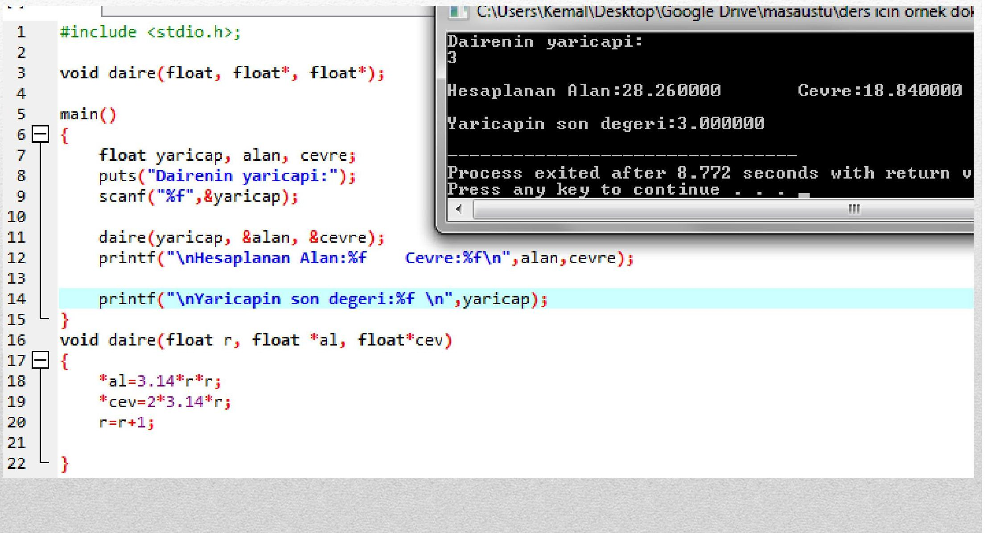
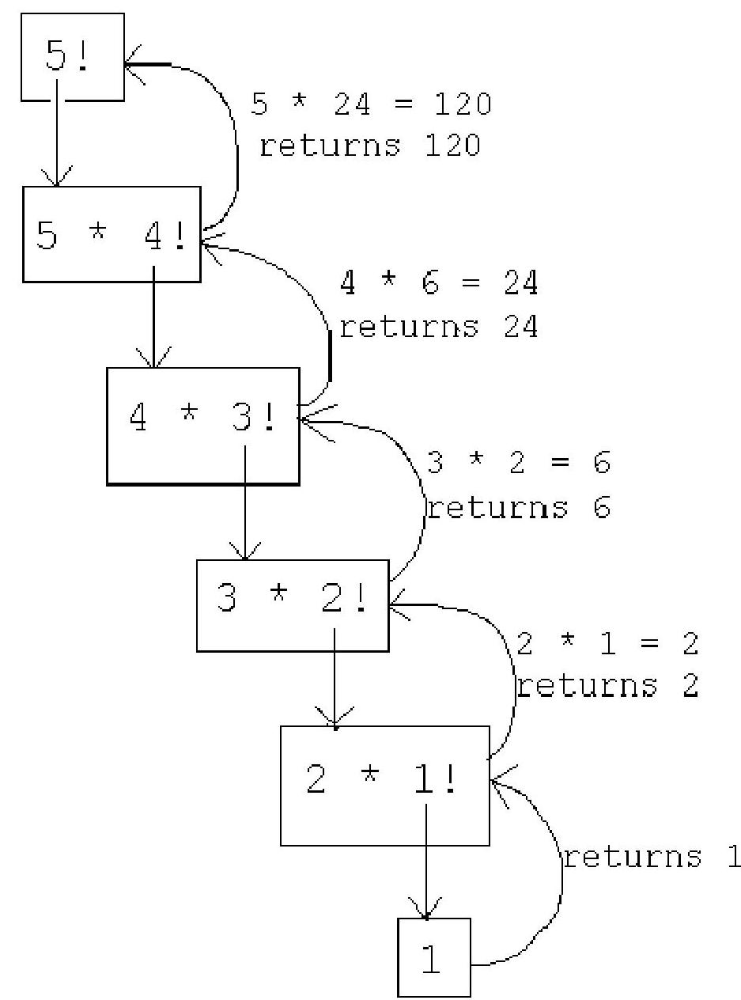

# Ders Notu 9 – Fonksiyonlar  
**Konya Teknik Üniversitesi – Elektrik-Elektronik Mühendisliği Bölümü**  
**Tarih:** 26.04.2024  
**Yer:** Konya  

---

## İçindekiler

- [Genel Özet](#genel-özet)
- [Temel Terimler ve Kavramlar](#temel-terimler-ve-kavramlar)
- [Ana Gövde: Fonksiyonlar](#ana-gövde-fonksiyonlar)
  - [Fonksiyon Tanımı ve Gerekliliği](#fonksiyon-tanımı-ve-gerekliliği)
  - [Fonksiyon Yapısı](#fonksiyon-yapısı)
  - [Geri Dönüş Değeri ve `return`](#geri-dönüş-değeri-ve-return)
  - [Fonksiyon Bildirimi (Prototip)](#fonksiyon-bildirimi-prototip)
  - [`void` Fonksiyonlar](#void-fonksiyonlar)
  - [Parametre Aktarımı Yöntemleri](#parametre-aktarımı-yöntemleri)
    - [Değer ile Çağırma](#değer-ile-çağırma)
    - [Adres ile Çağırma](#adres-ile-çağırma)
    - [Karma Kullanım](#karma-kullanım)
  - [Dizilerin Fonksiyonlarda Kullanımı](#dizilerin-fonksiyonlarda-kullanımı)
  - [Özyinelemeli (Recursive) Fonksiyonlar](#özyinelemeli-recursive-fonksiyonlar)
  - [Yaygın Hatalar ve Tavsiyeler](#yaygın-hatalar-ve-tavsiyeler)
- [Temel Formüller ve Hızlı Bilgiler](#temel-formüller-ve-hızlı-bilgiler)
- [Kaynaklar](#kaynaklar)

---

## Genel Özet

Bu ders notu, **C programlama dilinde fonksiyonların** temel kavramlarını, kullanım amaçlarını ve uygulamalarını kapsamaktadır. Fonksiyonlar, programları **modüler**, **okunabilir** ve **yeniden kullanılabilir** hale getiren yapı taşlarıdır. Fonksiyonlar, girdi alarak belirli işlemleri gerçekleştirir ve isteğe bağlı olarak çıktı üretir. Bu yapı sayesinde **tekrarlayan kodlar önlenir**, **hata ayıklama kolaylaşır** ve **karmaşık problemler küçük parçalara bölünerek çözülür**.

Ders kapsamında **fonksiyon yapısı**, **bildirim (prototip)**, **`void` fonksiyonlar**, **parametre aktarımı (değer ve adres ile)**, **dizi kullanım örnekleri**, **özyinelemeli fonksiyonlar** ve **yaygın hatalar** detaylı şekilde ele alınmıştır.

---

## Temel Terimler ve Kavramlar

- **Fonksiyon**: Belirli bir görevi yerine getirmek üzere tasarlanmış, girdi alabilen ve çıktı üretebilen kod bloğu.  
- **Parametre (Argüman)**: Fonksiyona iletilen veriler.  
- **Geri Dönüş Değeri (`return`)**: Fonksiyonun çağrıldığı yere döndürdüğü değer.  
- **`void`**: Geri değer döndürmeyen fonksiyonlar için kullanılan veri türü.  
- **Değer ile Çağırma**: Fonksiyona değişkenin **kopyası** gönderilir; orijinal değer değişmez.  
- **Adres ile Çağırma**: Fonksiyona değişkenin **bellek adresi** gönderilir; orijinal değer değişebilir.  
- **Özyinelemeli Fonksiyon**: Kendisini çağırarak çalışan fonksiyon; sonlanma koşulu olmalıdır.  
- **Fonksiyon Prototipi**: Fonksiyonun derleyiciye tanıtılması; dönüş tipi, isim ve parametre tiplerini belirtir.  
- **Yerel Değişken**: Sadece tanımlandığı fonksiyon içinde geçerli olan değişken.  
- **Modüler Programlama**: Programın küçük, bağımsız modüllere (fonksiyonlara) bölünmesi.

---

## Ana Gövde: Fonksiyonlar

### Fonksiyon Tanımı ve Gerekliliği

Fonksiyonlar, programların **yönetilebilirliğini** artırır. Standart kütüphane fonksiyonları (`printf`, `scanf`, `sqrt`) gibi, **kullanıcı tanımlı fonksiyonlar** da oluşturulabilir.

> **Neden fonksiyon?**  
> - Tekrarlamayı önler.  
> - Kodu modülerleştirir.  
> - Hata ayıklamayı kolaylaştırır.  
> - Yeniden kullanılabilirliği sağlar.



---

### Fonksiyon Yapısı

Bir C fonksiyonu üç temel kısımdan oluşur:

1. **Fonksiyon Bildirimi (Prototip)**  
   ```c
   dönüşVeriTipi fonksiyonAdı(parametreTipleri);
   ```

2. **Fonksiyon Çağrısı**  
   ```c
   fonksiyonAdı(argümanlar);
   ```

3. **Fonksiyon Gövdesi**  
   ```c
   dönüşVeriTipi fonksiyonAdı(parametreTipleri ve isimleri) {
       // Yerel bildirimler
       // İşlem satırları
       return ifade; // İsteğe bağlı
   }
   ```



#### Örnek: Toplama Fonksiyonu

```c
int toplamaYap(int a, int b) {
    return a + b;
}
```



---

### Geri Dönüş Değeri ve `return`

- Fonksiyon, **`int`, `float`, `char`** gibi değerler döndürebilir; **dizi doğrudan döndürülemez**.
- Dönüş tipi belirtilmezse, **`int`** varsayılır (eski derleyicilerde).
- `return` ifadesi:
  - Fonksiyonu sonlandırır.
  - İfade sonucunu döndürür.
  - Birden fazla `return` olabilir, ancak **ilk karşılaşılan çalışır**.

```c
return a + b;        // Parantez gerekmez
return 10;           // Sabit döndürme
return topla(a,b)/2; // Başka fonksiyon çağrısı
```

---

### Fonksiyon Bildirimi (Prototip)

Fonksiyon **`main()`’den sonra tanımlanırsa**, **prototipin `main()` öncesinde bildirilmesi gerekir**.

#### Örnek 2: `float` Toplama

```c
#include <stdio.h>
float toplamaYap(float, float); // Prototip

int main() {
    float a, b, toplam;
    printf("Birinci sayiyi giriniz\n");
    scanf("%f", &a);
    printf("Ikinci sayiyi giriniz\n");
    scanf("%f", &b);
    toplam = toplamaYap(a, b);
    printf("Toplam = %f", toplam);
    return 0;
}

float toplamaYap(float sayi1, float sayi2) {
    float sonuc = sayi1 + sayi2;
    return sonuc;
}
```

> **Not:** Fonksiyon gövdesi `main()`’den önceyse prototip gerekmez.

---

### `void` Fonksiyonlar

- **Geri değer döndürmeyen** fonksiyonlar için kullanılır.
- Parametre almayan fonksiyonlarda `void` kullanılabilir (isteğe bağlı).

| Fonksiyon Bildirimi         | Açıklama |
|----------------------------|--------|
| `int islem();`             | `int` döner, parametresiz |
| `void islem();`            | Hiçbir şey döndürmez |
| `void islem(int x);`       | `int` parametre alır, değer döndürmez |

#### Örnek 3: `void` Fonksiyon



---

### Parametre Aktarımı Yöntemleri

#### Değer ile Çağırma

- **Kopya gönderilir.** Orijinal değişken etkilenmez.
- **Güvenli**, ancak büyük veri yapılarında **performans kaybı** olabilir.

##### Örnek 4: Ortalama Hesaplama

```c
#include <stdio.h>
float ortalama(int, int, int);

int main() {
    int m, n, p;
    float k;
    scanf("%d %d %d", &m, &n, &p);
    k = ortalama(m, n, p);
    printf("Ortalama: %f", k);
    return 0;
}

float ortalama(int a, int b, int c) {
    return (a + b + c) / 3.0;
}
```

#### Adres ile Çağırma

- **Bellek adresi gönderilir.** Orijinal değer **değiştirilebilir**.
- **Pointer** (`*`) kullanılır.

##### Örnek 5: Değişkenin Değerini Değiştirme



#### Karma Kullanım

- Bazı parametreler **değer**, bazıları **adres** ile gönderilir.
- Örneğin: yarıçap sabit, alan değişken.

##### Örnek 6 ve 7:

  


> **Kural:**  
> - Tek sonuç → **değer ile çağırma + `return`**  
> - Çoklu sonuç → **adres ile çağırma**

---

### Dizilerin Fonksiyonlarda Kullanımı

Diziler **her zaman adres ile** gönderilir (kopya değil).

#### Örnek 8: Dizi Yazdırma

```c
#include <stdio.h>

void dizi_yazdir(float x[], int n);

int main() {
    float dizi[5] = {8.471, 3.683, 9.107, 4.739, 3.918};
    dizi_yazdir(dizi, 5);
    return 0;
}

void dizi_yazdir(float x[], int n) {
    for (int i = 0; i < n; i++)
        printf("%f\n", x[i]);
}
```

> **Not:** `float x[]` yerine `float *x` da yazılabilir.

---

### Özyinelemeli (Recursive) Fonksiyonlar

- **Kendini çağıran** fonksiyonlardır.
- **Sonlanma koşulu** olmalıdır (`if (n <= 1) return 1;`).

#### Örnek: Faktöriyel

```c
int faktoryel_hesapla(int sayi) {
    if (sayi <= 1)
        return 1;
    else
        return sayi * faktoryel_hesapla(sayi - 1);
}
```



#### Özyineleme vs. Döngü

| Özellik | Özyineleme | Döngü |
|--------|-----------|------|
| Hafıza | Her çağrıda yığın (stack) kullanılır → **yüksek bellek** | Sabit bellek |
| Performans | Daha yavaş | Daha hızlı |
| Okunabilirlik | Genelde daha **açıklayıcı** | Algoritmaya bağlı |
| Kullanım | Karmaşık problemler (ağaç, Fibonacci) | Basit yinelemeler |

> **Öneri:** Basit döngüler için **iterasyon**, doğal olarak özyinelemeli problemler için **rekürsiyon** tercih edilmelidir.

---

### Yaygın Hatalar ve Tavsiyeler

#### Fonksiyon Kullanım Hataları

- Geri dönüş tipini unutmak → `int` varsayılır (riskli!).
- `void` fonksiyonda `return değer;` → **hata**.
- Parametre bildiriminde: `double x, y` → `y` **`int`** olur! Doğrusu: `double x, double y`.
- Fonksiyon içinde başka fonksiyon tanımlamak → **C’de yasak**.
- Prototip sonuna `;` koymamak → **sözdizimi hatası**.

#### Tavsiyeler

- `main()` sadece **fonksiyon çağırıcısı** olsun.
- Her fonksiyon **tek bir görev** yapsın.
- Fonksiyon ismi görevini **açıkça belirtsin**.
- Fonksiyon uzunluğu **1 sayfayı geçmesin**.
- Çok parametre → **gereksiz karmaşıklık** → küçük fonksiyonlara böl.
- Başlık satırı **tek satırda** sığmalı.

---

## Temel Formüller ve Hızlı Bilgiler

>[!example]+ Fonksiyon Bildirimi Formatı
>```c
>geriDönüşTipi fonksiyonAdı(parametreListesi);
>```

>[!example]+ `void` Fonksiyon
>```c
>void selamla(void) {
>    printf("Merhaba!\n");
>}
>```

>[!example]+ Adres ile Çağırma
>```c
>void artir(int *p) {
>    (*p)++;
>}
>// Kullanım: artir(&x);
>```

>[!example]+ Özyineleme Sonlanma
>```c
>if (n <= 0) return 1; // Temel durum
>```

>[!note] Dikkat!
>- `int f();` → parametre yok **değil**, parametre **belirsiz** (eski C).
>- Modern C’de `int f(void);` yazın.

---

## Kaynaklar

- Programlama Sanatı, Algoritmalar, C Dili Uyarlaması – Dr. Rifat ÇÖLKESEN, Papatya Yayıncılık  
- Her Yönüyle C – Tevfik KIZILÖREN, Kodlab  
- C Programlama Dili – Dr. Rifat ÇÖLKESEN, Papatya Yayıncılık  
- Celal Bayar Üniversitesi, YZM1105 Ders Notu  
- https://www.bilgigunlugum.net/prog/cprog/c-fonksiyon (Erişim: 13.03.2020)