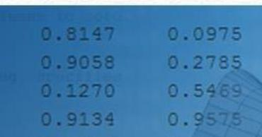
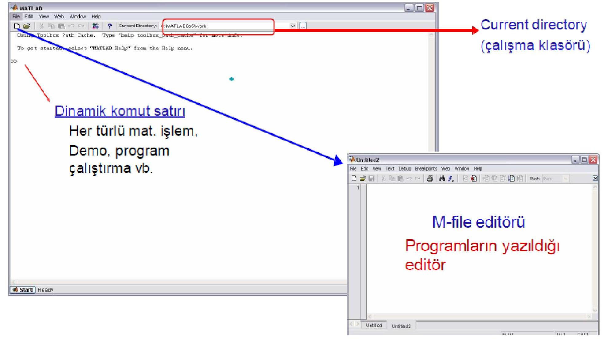
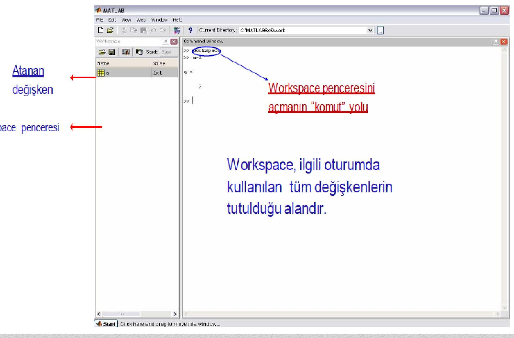
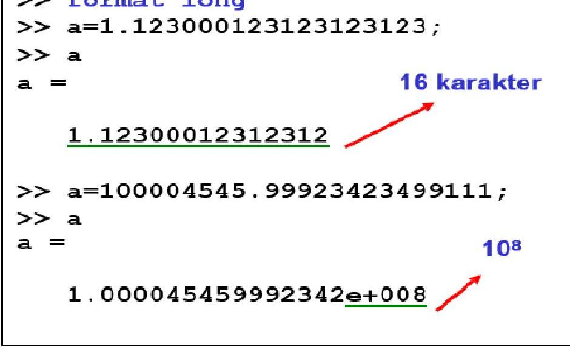
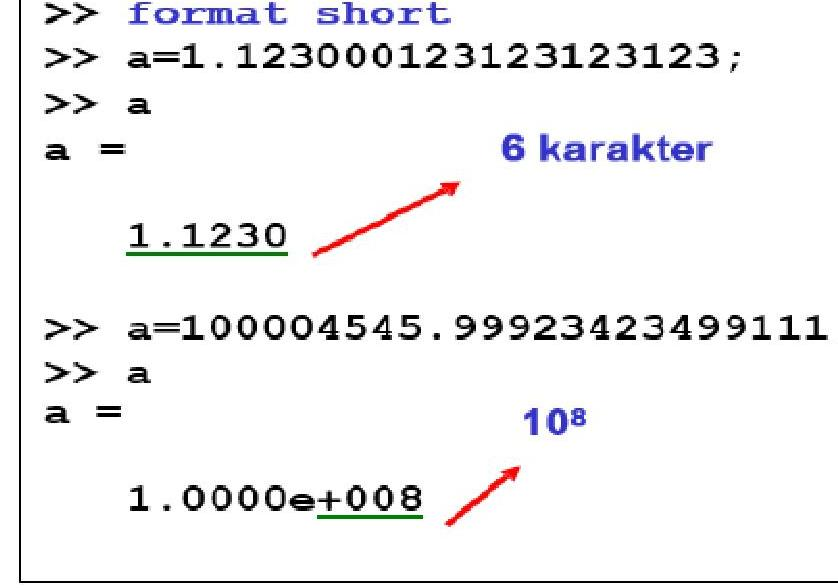

<iframe src="https://drive.google.com/file/d/1cLpfsMKlziDD-ynQG-9uJxQqOMnG9vdV/preview"
		width="100%"
        height="100%"
        allow="autoplay; fullscreen"
        allowfullscreen
        style="border:none; aspect-ratio:16/9;">
</iframe>

---

# İçindekiler  
=================

1. [Genel Özet](#genel-özet)  
2. [Temel Terimler ve Kavramlar](#temel-terimler-ve-kavramlar)  
3. [Ana Gövde: MATLAB’e Giriş](#ana-gövde-matlab-e-giriş)  
   - [MATLAB Nedir?](#matlab-nedir)  
   - [Tarihçe ve Kullanım Alanları](#tarihçe-ve-kullanım-alanları)  
   - [MATLAB Ortamı ve Bileşenleri](#matlab-ortamı-ve-bileşenleri)  
   - [Programlama Süreci](#programlama-süreci)  
   - [Komut Penceresi ve Temel Kurallar](#komut-penceresi-ve-temel-kurallar)  
   - [Değişken Tanımlama Kuralları](#değişken-tanımlama-kuralları)  
   - [İfadeler ve Operatörler](#ifadeler-ve-operatörler)  
   - [Sayı Gösterimi ve Formatlama](#sayı-gösterimi-ve-formatlama)  
   - [Temel Komutlar ve Dosya Türleri](#temel-komutlar-ve-dosya-türleri)  
4. [Temel Formüller ve Hızlı Bilgiler](#temel-formüller-ve-hızlı-bilgiler)  
5. [Kaynaklar](#kaynaklar)  

---

# Genel Özet

Bu ders notu, **Konya Teknik Üniversitesi Elektrik-Elektronik Mühendisliği Bölümü**’nde sunulan *Bilgisayar Programlama 2* dersinin ilk birimi olan **MATLAB’e Giriş** konusunu kapsamaktadır. MATLAB® (*MATrix LABoratory*), **matris temelli sayısal hesaplamalar**, **algoritma geliştirme**, **grafik çizimi**, **simülasyon** ve **veri analizi** gibi mühendislik problemlerinin çözümünde yaygın olarak kullanılan güçlü bir yazılım ortamıdır.

Ders notu, MATLAB’in temel yapısını, **komut penceresi** (*Command Window*), **çalışma alanı** (*Workspace*), **değişken tanımlama kuralları**, **aritmetik operatörler**, **sayı gösterimi biçimleri**, **temel komutlar** (`clc`, `clear`, `help`, `doc`) ve **dosya türleri** (`*.m`, `*.mat`) gibi kritik konuları açıklamaktadır. Ayrıca, **programlama sürecinin adımları** (problem tanımı, algoritma, kodlama, sınama) vurgulanarak, öğrencilerin sistemli düşünme becerilerinin geliştirilmesi amaçlanmıştır.

Bu materyal, özellikle **mühendislik öğrencileri** için MATLAB ile ilk temaslarını kuranlar için temel bir rehber niteliğindedir.

---

# Temel Terimler ve Kavramlar

- **MATLAB**: Matris tabanlı sayısal hesaplama ve programlama ortamı.
- **Command Window**: Komutların girildiği ve sonuçların görüntülendiği temel arayüz.
- **Workspace**: Tanımlı değişkenlerin saklandığı hafıza alanı.
- **Değişken**: Sayısal veya metinsel veriyi saklayan isimlendirilmiş bellek birimi.
- **Fonksiyon**: Belirli bir görevi yerine getiren hazır veya kullanıcı tanımlı işlem bloğu (örneğin `sin(x)`).
- **Operatör**: Matematiksel işlemleri gerçekleştiren semboller (`+`, `-`, `*`, `/`, `^`).
- **İfade (Expression)**: Değişkenler, sayılar, operatörler ve fonksiyonlardan oluşan hesaplanabilir yapı.
- **ans**: Atama yapılmamış ifadelerin sonucunun otomatik olarak saklandığı özel değişken.
- **Formatlama**: Sayıların ekranda nasıl gösterileceğini belirleyen ayarlar (`format short`, `fprintf`).
- **.m dosyası**: MATLAB komutlarının saklandığı betik (script) veya fonksiyon dosyası.

---

# Ana Gövde: MATLAB’e Giriş

## MATLAB Nedir?

MATLAB®, **MathWorks** tarafından geliştirilen, **teknik hesaplamalar** için tasarlanmış yüksek düzeyli bir programlama dilidir. Temel veri yapısı **matristir** ve boyut tanımlamaya gerek duymaz. MATLAB şu yeteneklere sahiptir:

- Matris işlemleri
- Fonksiyon ve veri görselleştirme (2D/3D grafikler)
- Algoritma geliştirme
- Grafiksel kullanıcı arayüzü (GUI) oluşturma
- C/C++, Java, Fortran gibi dillere kod dönüştürme

> [!success]  
> **“The Language of Technical Computing”** sloganıyla bilinir.



---

## Tarihçe ve Kullanım Alanları

- **1970’lerin sonunda** Cleve Moler tarafından geliştirildi.
- Başlangıçta **Fortran**, daha sonra **C** ile yeniden yazıldı.

> [!example]+ Kullanım Alanları  
> - Nümerik ve sembolik hesaplamalar  
> - Lineer cebir, istatistik, Fourier analizi  
> - Optimizasyon ve sayısal integrasyon  
> - 2D/3D grafik çizimi  
> - Modelleme ve simülasyon (Simulink ile)  
> - Gerçek zamanlı sistem geliştirme  

---

## MATLAB Ortamı ve Bileşenleri

- **Command Window**: Kullanıcının doğrudan komut girdiği pencere (`>>` prompt’u ile başlar).  
- **Workspace**: Tanımlı tüm değişkenler burada listelenir.  
- **Command History**: Daha önce girilen komutların kaydı.

  


---

## Programlama Süreci

Her yazılım geliştirme süreci aşağıdaki adımları izler:

1. **Problem Tanımı** (Ne? Neden?)  
2. **Algoritma Oluşturma** (akış şeması veya sahte kod)  
3. **Kodlama** (MATLAB diline çevirme)  
4. **Sınama** (çalıştırma ve hata kontrolü)  
5. **Belgeleme ve Güncelleme**

---

## Komut Penceresi ve Temel Kurallar

- Yardım ve arayüz dili **İngilizce**dir.
- **Küçük-büyük harf duyarlıdır**: `x ≠ X`
- Komutlar `Enter` ile çalıştırılır.
- `;` (noktalı virgül) sonucun ekranda görünmesini engeller.
- Ok tuşları (`↑`, `↓`, `←`, `→`) komut düzenleme imkânı sunar.

> [!note]  
> `>> 4*25+6*52+2*99` → `ans = 610`

---

## Değişken Tanımlama Kuralları

Değişken isimleri şu kurallara uymalıdır:

- **Harfle başlamalı**: `sayi_1` ✅, `1sayi` ❌  
- **Türkçe karakter içeremez**: `öğrenci` ❌  
- **Boşluk veya noktalama içermemeli**: `sayi.1` ❌, `sayi 1` ❌  
- **63 karaktere kadar** desteklenir.  
- **Büyük/küçük harf duyarlıdır**: `x`, `X`, `Xx` birbirinden farklıdır.

> [!CODE]- Hata Örneği  
> ```matlab
> >> 1sayi
> Error: Unexpected MATLAB expression.
> ```

---

## İfadeler ve Operatörler

MATLAB’de her çalıştırılabilir yapıya **ifade** denir. Bir ifade şunları içerir:

- Sayılar (`4`, `3.14`)
- Değişkenler (`x`, `sonuc`)
- Operatörler (`+`, `*`, `^`)
- Fonksiyonlar (`sqrt`, `sin`)

Örnek:
```matlab
>> x = 4 * sqrt(5)
x = 8.9443
```

Atama yapılmazsa, sonuç `ans` değişkeninde saklanır.

Birden fazla ifade aynı satırda `,` veya `;` ile ayrılabilir.

---

## Sayı Gösterimi ve Formatlama

### Sayı Formatları:
- Ondalık ayraç: **nokta** (`3.14`)
- Bilimsel gösterim: `2e4` = 20000
- Karmaşık sayılar: `1+3i` veya `1+3j`

### Sayı Aralığı:
- Yaklaşık **±2×10³⁰⁸** ile **±2×10⁻³⁰⁸** arasında

### Format Komutları:
```matlab
>> format short    % 4 ondalık hane
>> format long     % 15 ondalık hane
>> fprintf('%.10f\n', pi)
3.1415926536
```

  


> [!caption|center]  
> `fprintf`, özel biçimli çıktı için kullanılır.

---

## Temel Komutlar ve Dosya Türleri

### Temel Komutlar:
| Komut        | Açıklama |
|--------------|--------|
| `clc`        | Komut penceresini temizler |
| `clear`      | Tüm değişkenleri siler |
| `clear a`    | Sadece `a` değişkenini siler |
| `help sqrt`  | `sqrt` fonksiyonu hakkında kısa yardım |
| `doc sqrt`   | Detaylı yardım ve örnekler |
| `save dosya a` | `a` değişkenini `dosya.mat` olarak kaydeder |
| `load dosya` | Kaydedilen değişkenleri geri yükler |

### Dosya Türleri:
- `.m` → MATLAB betik/fonksiyon dosyaları  
- `.mat` → Değişken verisi (ikili format)  
- `.fig` → Grafik dosyaları  
- `.p` → Şifrelenmiş fonksiyon dosyaları (görüntülenemez)

---

# Temel Formüller ve Hızlı Bilgiler

> [!example]+ Aritmetik Operatör Öncelikleri  
> 1. Parantez `( )`  
> 2. Üs `^` (sağdan sola: `2^2^3 = 2^(2^3) = 256`)  
> 3. Çarpma/Bölme `* /` (soldan sağa)  
> 4. Toplama/Çıkarma `+ -` (soldan sağa)

> [!example]+ Temel Komutlar  
> - `date` → Tarih bilgisi (`17-Oct-2009`)  
> - `demo` → MATLAB demosunu başlatır  
> - `exit` → MATLAB’ten çıkar  

> [!example]+ Sayı Gösterimi  
> - `0.65` yerine `.65` yazılabilir  
> - `1+3*i`, `1+3i`, `1+i*3` aynıdır; `1+i3` **geçersizdir**

---

# Kaynaklar

- Doğan İbrahim, *A’dan Z’ye MATLAB ile Çalışmak*  
- Dr. Aslan İnan, *MATLAB ve Programlama*  
- Roland Priemer, *MATLAB for ECE Students and Professionals*  
- Dr. Deniz DAL, *MATLAB İle Programlama*  
- Uzunoğlu M. vd., *MATLAB*, Türkmen Kitabevi, 2002  
- Doğan, U., *Temel Bilgisayar Bilimleri Ders Notları*, YTÜ, 2009  
- Demirel, H., *Dengeleme Hesabı*, YTÜ, 2005  
- [MATLAB Central](http://www.mathworks.com/matlabcentral/)  
- [File Exchange](http://www.mathworks.com/matlabcentral/fileexchange/)  
- İstanbul Üniversitesi, *MATLAB Ders Notları* (int2mlab_nummeth.pdf)

---

<iframe src="https://drive.google.com/file/d/1-GaGt_rziwBbqaPalkQkEqo0lhudX02X/preview"
		width="100%"
        height="100%"
        allow="autoplay; fullscreen"
        allowfullscreen
        style="border:none; aspect-ratio:16/9;">
</iframe>