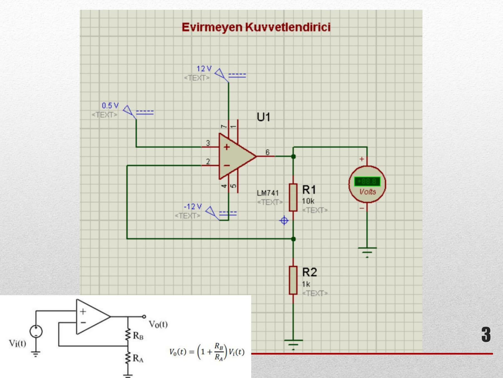
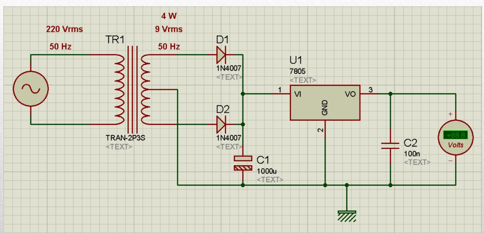
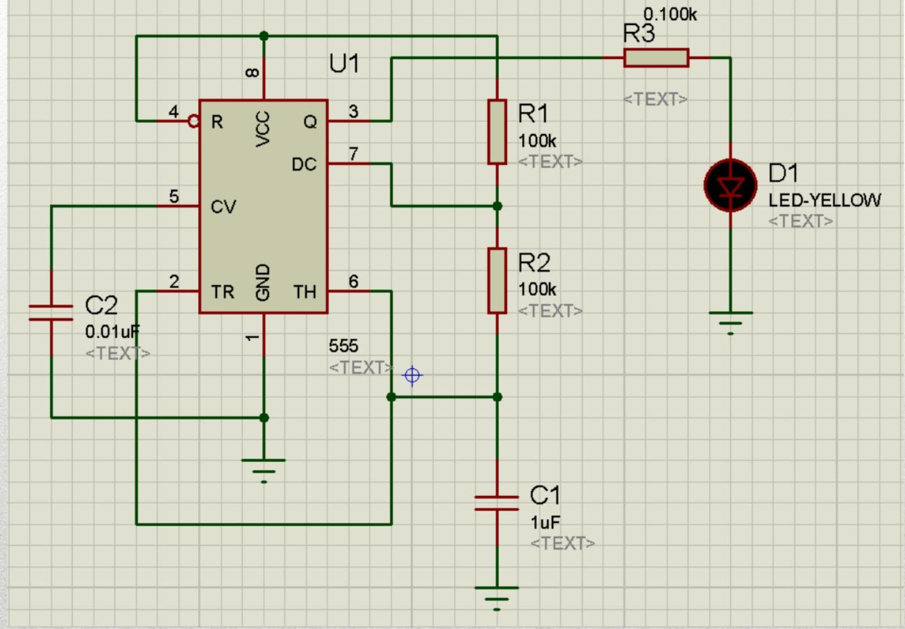
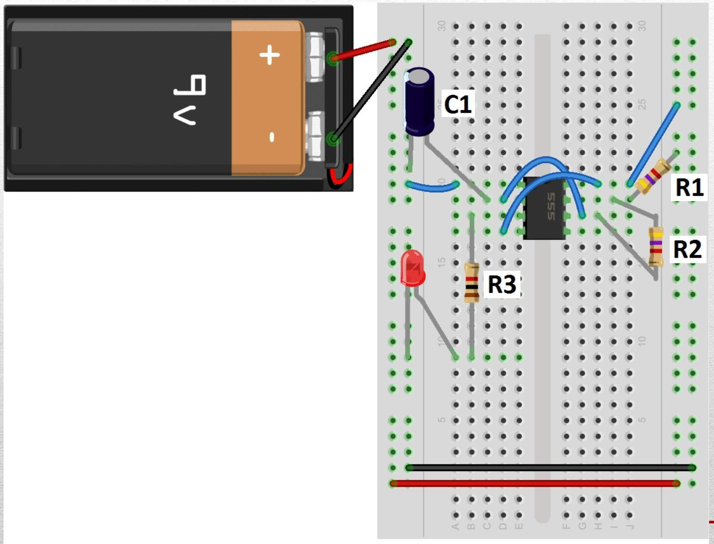
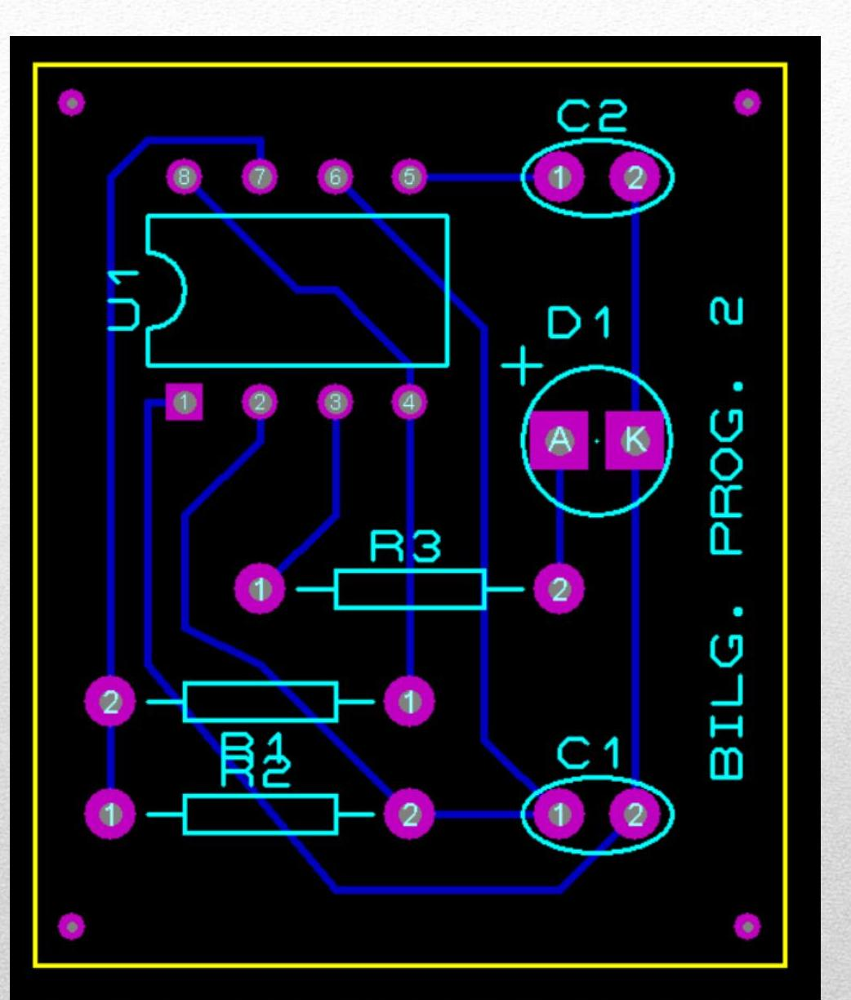

## **İçindekiler**
1. [Kirpici Devresi](#kirpici-devresi)  
2. [Evirmeyen Kuvvetlendirici](#evirmeyen-kuvvetlendirici)  
3. [Anahtarlama Devresi](#anahtarlama-devresi)  
4. [Regülatör Devresi](#regülatör-devresi)  
5. [Kararsız Multivibratör (Kare Dalga Üreteci)](#kararsız-multivibratör-kare-dalga-üreteci)  
6. [Kaynaklar](#kaynaklar)

---

## **Kirpici Devresi**

Bu devre, giriş sinyalinin belirli bir seviyenin üzerine çıkmasını engelleyerek sinyali "kırpma" (clipping) işlemi yapar. Basit bir diyotlu kırpıcı devresidir.

### **Bileşenler:**
- **BAT1**: 5V DC güç kaynağı  
- **D1**: 1N4001 diyotu (silikon diyot, 0.7V eşik gerilimi)  
- **R1**: 1 kΩ direnç  

> **Not:** Giriş sinyali pozitif yönde 0.7V + 5V = 5.7V'u geçerse, diyot iletimde olur ve çıkış 5.7V ile sınırlanır.

---

## **Evirmeyen Kuvvetlendirici**

Operasyonel yükselteç (op-amp) kullanılarak kurulan bu devre, giriş sinyalini evirmeksizin yükseltir. Kazancı direnç oranlarına bağlıdır.

### **Devre Formülü:**

$V_{\text{çıkış}} = \left(1 + \frac{R_2}{R_1}\right) \cdot V_{\text{giriş}}$

### **Bileşenler:**
- **U1**: Operasyonel yükselteç (örneğin LM741)  
- **R1, R2**: Geri besleme dirençleri  
- **Vb(t)**: Giriş sinyali (örneğin sinüs dalgası)

> **Not:** Bu devrede op-amp’ın beslemesi (genellikle ±15V veya tek kaynakta 0–12V gibi) belirtilmemiş; Proteus simülasyonunda uygun şekilde ayarlanmalıdır.

---

## **Anahtarlama Devresi**

Bu devre, transistörlerle kurulmuş bir **anahtarlama (switching) devresidir**. İki LED (yeşil ve kırmızı) kullanılarak sinyal durumu görsel olarak gösterilir.

### **Bileşenler:**
- **BAT1**: 5V DC  
- **Q1, Q2**: BC237 NPN transistörleri  
- **R1, R2**: 330 Ω (LED akım sınırlayıcı dirençler)  
- **R3, R4**: 100 kΩ (transistör beyz dirençleri)  
- **D1**: LED-GREEN  
- **D2**: LED-RED  
- **C1**: 10 µF kondansatör (zaman sabiti elemanı, multivibratör özelliği kazandırabilir)

> **Not:** Bu yapı, **astable (kararsız) veya monostable (tek kararlı)** multivibratör olarak da kullanılabilir. C1 ve R3/R4 kombinasyonu periyodik sinyal üretimi sağlar.

---

## **Regülatör Devresi**

Bu bölümde, **AC’den DC’ye dönüştürme ve regülasyon** yapılan bir güç kaynağı devresi anlatılmaktadır. Ancak tablo biçimindeki veri fazla tekrar içeriyor ve net değil.

### **Düzeltilmiş açıklama:**
- **Giriş**: 220V AC, 50 Hz  
- **Transformatör (TR1)**: AC gerilimi düşürür (örneğin 12V AC)  
- **Doğrultma köprüsü**: 4 adet **1N4007** diyot  
- **Filtreleme**: Elektrolitik kondansatör (örneğin 1000µF)  
- **Regülatör entegresi**: Örneğin **7805** (5V sabit çıkış)

> **Not:** Verilen tabloda yalnızca "TR1, TR2, 1N4007" tekrarlanmış; muhtemelen diyot köprüsü için 4 diyot kastedilmiştir. TR1 ve TR2 yazımı hatalı olabilir (transformatör tek olmalı).

---

## **Kararsız Multivibratör (Kare Dalga Üreteci)**

Bu devre, **iki transistör ve RC zaman sabitleri** kullanılarak sürekli kare dalga üreten bir osilatördür.

### **Özellikler:**
- Kararlı durumu yoktur → sürekli osilasyon yapar  
- Çıkıştan **kare dalga** alınır  
- Frekans, kullanılan **R ve C** değerlerine bağlıdır

### **Frekans Formülü:**
$$
f \approx \frac{1.44}{(R_1 + 2R_2) \cdot C}
$$
(Eğer simetrik RC kullanılıyorsa: \( f \approx \frac{0.7}{R \cdot C} \))

  
  

> **Uygulama Alanları:** Zamanlayıcılar, blink devreleri, saat sinyali üreteçleri.

---

## **Kaynaklar**

- [Circuit Basics – Analog Circuits & Proteus Tutorials](https://www.circuitbasics.com/)  
- Konya Teknik Üniversitesi – EE Bölümü Ders Arşivi

---

Bu notlar, **Proteus ISIS** ortamında analog devrelerin simülasyonunu yaparken temel devre yapılarını anlamak için hazırlanmıştır. Her devre, ders kapsamında simüle edilerek gerçek zamanlı davranışları gözlemlenebilir.

> 📝 **Öğrenci Notu:** Proteus'ta op-amp, transistör ve diyot modellerini doğru seçmek, gerçekçi sonuçlar almak için kritiktir. Özellikle 1N4001/1N4007 gibi diyotlar farklı akım kapasitelerine sahiptir.
