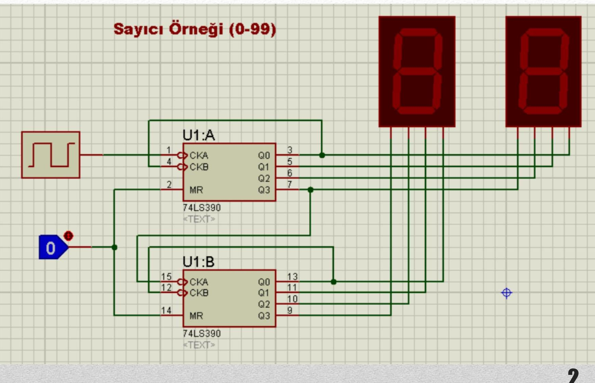
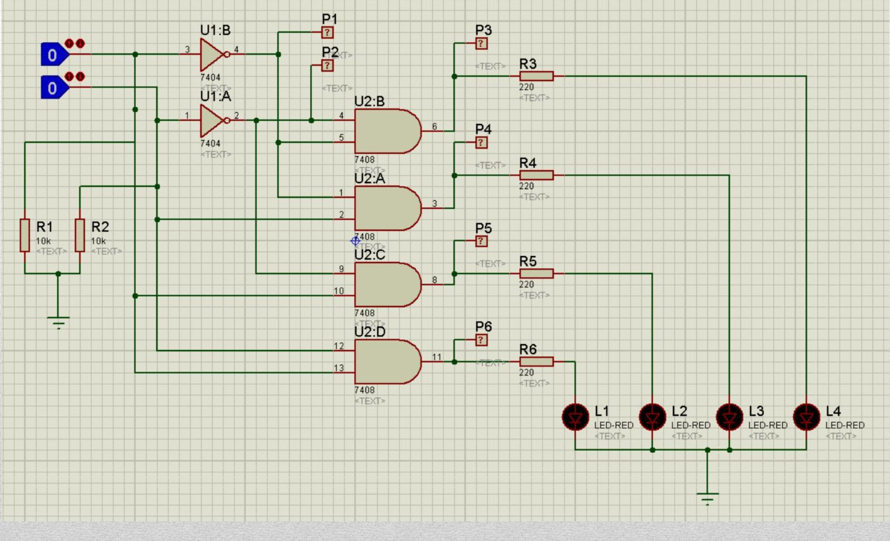
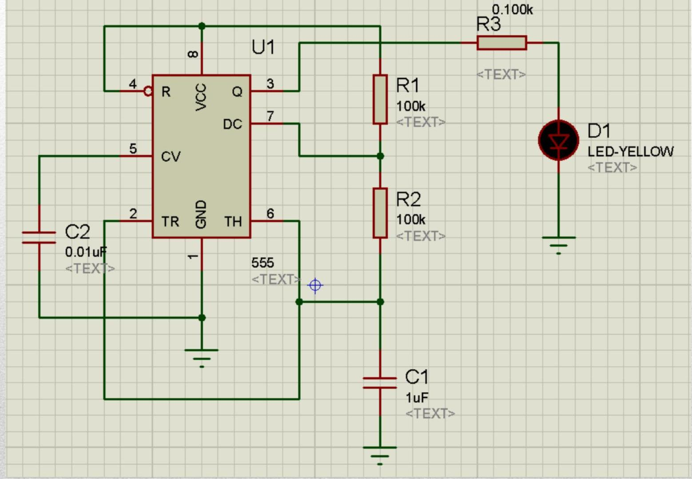
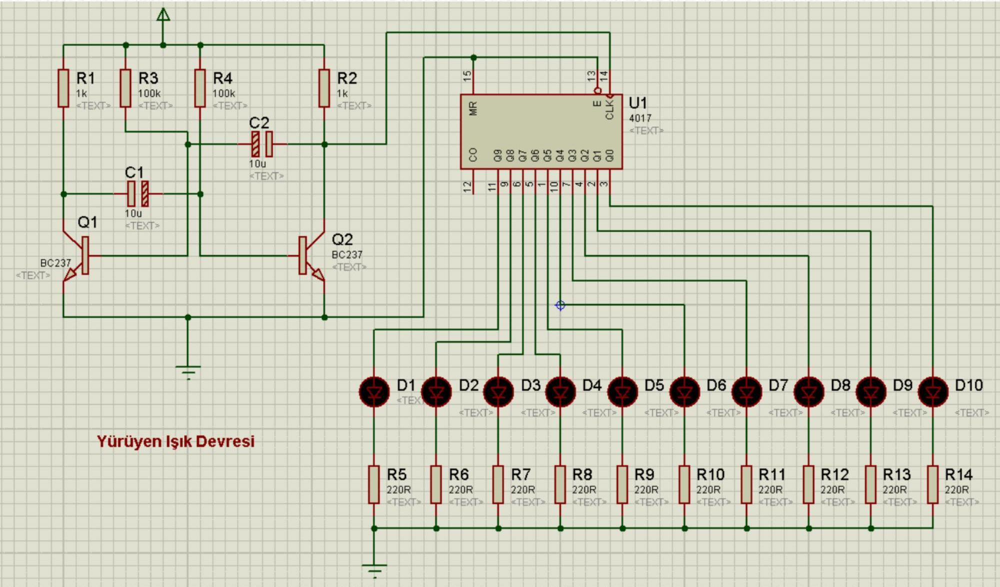

# **İçindekiler**
- [Genel Özet](#genel-özet)
- [Temel Terimler ve Kavramlar](#temel-terimler-ve-kavramlar)
- [Ana Gövde: Kronolojik / Tematik Kayıt](#ana-gövde-kronolojik--tematik-kayıt)
  - [0-99 Sayıcı Devresi](#0-99-sayıcı-devresi)
  - [2’den 4’e Kod Çözücü (Decoder)](#2den-4e-kod-çözücü-decoder)
  - [Kararsız Multivibratör / Kare Dalga Üreteci](#kararsız-multivibratör--kare-dalga-üreteci)
  - [6 Sayısı ile İlgili Devre](#6-sayısı-ile-ilişkili-devre)
  - [Ödev: ARES Çizimi](#ödev-ares-çizimi)
- [Temel Formüller ve Hızlı Bilgiler](#temel-formüller-ve-hızlı-bilgiler)
- [Kaynaklar](#kaynaklar)

---

## Genel Özet

Bu ders notunda, **Proteus** yazılımı kullanılarak temel **sayısal devre tasarımları** ele alınmıştır. Öncelikle **0'dan 99'a kadar sayan bir sayıcı devresi** kurulmuş, ardından **2’den 4’e kod çözücü (decoder)** devresi incelenmiştir. Ayrıca, **kararsız multivibratör** (astable multivibrator) prensibiyle çalışan **kare dalga üreteci** ve bir diğer örnek olarak **6 sayısını gösteren özel bir devre** yer almaktadır. Derste ayrıca **ARES** yazılımıyla PCB çizimi yapılması istenmiştir, bu da teoriden pratiğe geçişin önemini vurgulamaktadır.

**Proteus**, sayısal ve analog devrelerin benzetimini yapmaya yarayan güçlü bir araçtır ve özellikle **74 serisi entegreler** (örneğin 74LS390) ile çalışırken büyük kolaylık sağlar.

---

## Temel Terimler ve Kavramlar

- **Sayıcı (Counter):** Belirli bir sırada sayıları sıralayan ve genellikle saat sinyaliyle senkronize çalışan sayısal devre.
- **74LS390:** İki adet bağımsız sayıcı içeren (ikili ve onlu) entegre. Genellikle 0-9 arası sayma işlemlerinde kullanılır.
- **Kod Çözücü (Decoder):** n-bit girişten 2ⁿ çıkış elde eden devre. Örneğin 2-4 decoder, 2 girişten 4 çıkış üretir.
- **Kararsız Multivibratör:** İki kararlı durumu olmayan, sürekli osilasyon yapan devre. Kare dalga üretmek için kullanılır.
- **ARES:** Proteus’un PCB (Printed Circuit Board) tasarımı modülüdür.

---

## Ana Gövde: Kronolojik / Tematik Kayıt

### 0-99 Sayıcı Devresi

Bu devre, **iki adet 74LS390** entegresi kullanılarak oluşturulmuştur:

- Her bir 74LS390 entegresi, bağımsız iki sayıcı içerir: biri **ikili (mod-2)**, diğeri **onlu (mod-5)** sayıcı.
- Bu entegreler birleştirildiğinde **mod-10** sayıcı elde edilir.
- İlk entegre birler basamağını (0-9), ikinci entegre onlar basamağını (0-9) sayar.
- Böylece toplamda **00’dan 99’a kadar** sayma işlemi gerçekleştirilir.



> [!infobox]  
> **74LS390** entegresi, özellikle dijital saatler ve frekans bölücüler gibi uygulamalarda yaygın olarak kullanılır.

---

### 2’den 4’e Kod Çözücü (Decoder)

Bu bölümde 2 girişli bir **decoder** devresi incelenmiştir. Devre şu özellikleri taşır:

- Girişler: **A** ve **B**
- Çıkışlar: **L1, L2, L3, L4** (LED’ler ile gösterilir)
- Ek olarak, çıkışlar **logic probe**’larla (P1–P6) izlenmiştir.

Aşağıdaki doğruluk tablosu verilmiştir:

| A | B | L1 | L2 | L3 | L4 | P1 | P2 | P3 | P4 | P5 | P6 |
|---|---|----|----|----|----|----|----|----|----|----|----|
| 0 | 0 | 0  | 0  | 0  | 1  | 1  | 1  | 1  | 0  | 0  | 0  |
| 0 | 1 | 0  | 0  | 1  | 0  | 1  | 0  | 0  | 1  | 0  | 0  |
| 1 | 0 | 0  | 1  | 0  | 0  | 0  | 1  | 0  | 0  | 1  | 0  |
| 1 | 1 | 1  | 0  | 0  | 0  | 1  | 1  | 1  | 0  | 0  | 0  |



> [!note]  
> Doğruluk tablosunda **LED’lerin** ve **logic probe’ların** farklı çıkışlar verdiği dikkat çekicidir. Bu, devrenin birden fazla amaçla kullanıldığını gösterebilir.

---

### Kararsız Multivibratör / Kare Dalga Üreteci

Bu devre, **sürekli kare dalga üreten** bir osilatör olarak çalışır. Genellikle bir **555 entegresi** veya transistörlerle kurulur. Kararsız (astable) modda çalışır çünkü sabit bir çıkış durumu yoktur.

  


> [!example]+ Frekans Hesabı (555 ile)
> Frekans formülü (555 entegresi için):
> ```math
> f = \frac{1.44}{(R_1 + 2R_2)C}
> ```

Bu devre, **sayıcıların saat sinyali** olarak kullanılabilir.

---

### 6 Sayısı ile İlgili Devre

Bu bölümde sadece “**6**” yazısı ve ilgili bir görsel yer almaktadır. Muhtemelen bu, 7 segment display ile **“6” sayısının** nasıl gösterildiğini ya da bir devrenin 6’da durduğunu (mod-6 sayıcı) temsil eder.



> [!CODE]- 7 Segment Display için “6” Kodu (Ortak Anot)
> ```c
> // a, b, c, d, e, f = HIGH (0), g = LOW (1)
> // Hex: 0x7D veya Binary: 01111101
> ```

---

### Ödev: ARES Çizimi

> **Ödev:** Yukarıdaki devrenin **ARES çizimini** gerçekleştiriniz.

Bu ödev, öğrencinin Proteus’ta tasarladığı devreyi **gerçek PCB’ye** dönüştürme becerisini ölçmeyi amaçlar. ARES modülüyle şematik devre, PCB düzenine çevrilir ve baskı devre hazırlanabilir.

> [!success]  
> **Motivasyon cümlesi:**  
> “Teoriden pratiğe geçmek, mühendisliğin en heyecan verici aşamasıdır!”

---

## Temel Formüller ve Hızlı Bilgiler

- **74LS390:**  
  - Mod-2 ve Mod-5 içeren bağımsız sayıcılar  
  - Mod-10 oluşturmak için Mod-2 ve Mod-5 çıkışları kaskat bağlanır

- **2-4 Decoder Çıkışları:**  
  - Y0 = A'B'  
  - Y1 = A'B  
  - Y2 = AB'  
  - Y3 = AB  

- **Multivibratör Frekansı (555):**  
  ```math
  f = \frac{1.44}{(R_1 + 2R_2)C}
  ```

- **7 Segment Display (Ortak Anot):**  
  - “6” → `a=0, b=1, c=0, d=0, e=0, f=0, g=0` → `0x7D`

---

## Kaynaklar

- https://www.youtube.com/watch?v=8aqQm1GBYNc  
- https://www.youtube.com/watch?v=g6-TLodQR7A  
- https://www.youtube.com/watch?v=pH3av0GDwBU  
- https://www.youtube.com/watch?v=jXJYBjVFZrs

--- 

Hazırlayan: Konya Teknik Üniversitesi, Elektrik-Elektronik Mühendisliği Bölümü  
Tarih: 07/01/2021
