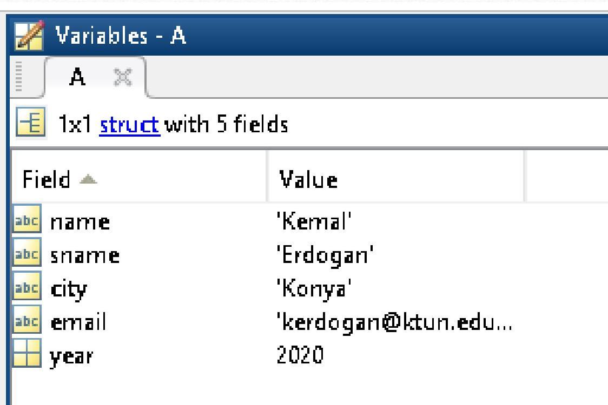

# İçindekiler

- [Genel Özet](#genel-özet)
- [Temel Terimler ve Kavramlar](#temel-terimler-ve-kavramlar)
- [Ana Gövde: Kronolojik veya Tematik Kayıt](#ana-gövde-kronolojik-veya-tematik-kayıt)
  - [MATLAB'e Klavyeden Veri Aktarımı](#matlabe-klavyeden-veri-aktarımı)
  - [input Komutu ile Klavyeden Metinsel Veri Temini](#input-komutu-ile-klavyeden-metinsel-veri-temini)
  - [fprintf Komutu ile Ekrana Bilgi Yazdırma](#fprintf-komutu-ile-ekrana-bilgi-yazdırma)
  - [disp Komutu ile Ekrana Sayısal Değer Yazdırma](#disp-komutu-ile-ekrana-sayısal-değer-yazdırma)
  - [Vektörler](#vektörler)
    - [Köşeli parantez yöntemi](#köşeli-parantez-yöntemi)
    - [Sabit Aralıklı Vektör Oluşturma](#sabit-aralıklı-vektör-oluşturma)
    - [Fonksiyonlar kullanılarak vektör oluşturma](#fonksiyonlar-kullanılarak-vektör-oluşturma)
  - [Vektörlerde Aritmetik İşlemler](#vektörlerde-aritmetik-işlemler)
  - [Vektörler ile Kullanılabilecek Bazı Fonksiyonlar](#vektörler-ile-kullanılabilecek-bazı-fonksiyonlar)
  - [Diziler](#diziler)
  - [Sayı Dizileri](#sayı-dizileri)
  - [Hücre Dizileri (cell)](#hücre-dizileri-cell)
  - [Yapı Dizileri (struct)](#yapı-dizileri-struct)
  - [Dizilerle İlgili Bazı Atama Komutları](#dizilerle-ilgili-bazı-atama-komutları)
  - [If, End Yapısı](#if-end-yapısı)
  - [Switch, Case Yapısı](#switch-case-yapısı)
  - [For, End Döngüsü](#for-end-döngüsü)
  - [While, End Döngüsü](#while-end-döngüsü)
- [Temel Formüller ve Hızlı Bilgiler](#temel-formüller-ve-hızlı-bilgiler)
- [Kaynaklar](#kaynaklar)

# Genel Özet

Bu ders notu, MATLAB programlama ortamında **veri girişi ve çıktısı**, **dizi (array) ve vektör oluşturma**, **aritmetik işlemler** ve **kontrol yapıları** gibi temel konuları kapsamaktadır. Kullanıcıdan klavye aracılığıyla veri almayı (`input` komutu), alınan veya işlenen veriyi ekrana yazdırmayı (`fprintf`, `disp` komutları) ve bu veriler üzerinde temel manipülasyonları gerçekleştirmeyi öğrenmeyi hedefler. Ayrıca, MATLAB'in temel veri yapılarından olan vektörler, sayı dizileri, hücre dizileri ve yapı dizilerinin tanımlanması, kullanılması ve üzerinde yapılabilecek yaygın işlemler detaylandırılmıştır. _if-end_, _switch-case_, _for-end_ ve _while-end_ gibi algoritmik kontrol yapıları da örneklerle açıklanarak, programlama yeteneğini pekiştirmeyi amaçlamaktadır.

# Temel Terimler ve Kavramlar

**input Komutu:** Kullanıcıdan klavye aracılığıyla veri almak için kullanılan MATLAB komutudur.
**fprintf Komutu:** Hem metin hem de sayısal veriyi formatlı bir şekilde ekrana yazdırmak için kullanılan bir MATLAB komutudur.
**disp Komutu:** Genellikle sayısal değerleri veya basit metinleri ekrana yazdırmak için kullanılan, çıktıdan sonra otomatik olarak yeni satıra geçen bir MATLAB komutudur.
**Vektör:** MATLAB'de tek boyutlu, ardışık sayı dizisi olarak tanımlanan bir veri yapısıdır. Satır veya sütun vektörü olabilir.
**Dizi (Array):** Sayısal veya metinsel değerler topluluğunu ifade eden genel bir matematiksel tanımdır; MATLAB'de temel veri elemanı olup, her şey bir dizi olarak işlenir.
**Hücre Dizisi (Cell Array):** Farklı türlerdeki ve boyutlardaki verileri (sayılar, metinler, matrisler vb.) aynı dizi içinde saklamaya yarayan MATLAB veri yapısıdır.
**Yapı Dizisi (Struct Array):** Farklı veri alanlarını (isim, şehir, yıl gibi) bir araya getiren ve bu alanlara etiketlerle erişim sağlayan bir MATLAB veri yapısıdır.
**Kontrol Yapıları:** Programın akışını (örneğin koşullu dallanma veya döngüsel işlemler) kontrol eden `if-end`, `switch-case`, `for-end`, `while-end` gibi programlama öğeleridir.

# Ana Gövde: Kronolojik veya Tematik Kayıt

## MATLAB'e Klavyeden Veri Aktarımı

MATLAB programları çalışırken kullanıcıdan veri almak için `input` komutu kullanılır. Bu komut, kullanıcıdan alınan veriyi belirtilen bir değişkene atar.

```matlab
yas=input('Lutfen Yasinizi Giriniz: ')
Lutfen Yasinizi Giriniz: 27
```

Yukarıdaki örnekte, kullanıcı "27" değerini girmiş ve bu değer `yas` değişkenine atanmıştır.

```
yas =
    27
```

> [!example]+
> Bardak örneği ile `input` kullanımı:
>
> ```matlab
> >> Bardak=input('Bardagın Ne Kadarı Dolsun? ')
> Bardagın Ne Kadarı Dolsun? 90
> Bardak =
>    90
> ```

## input Komutu ile Klavyeden Metinsel Veri Temini

`input` komutunu kullanarak metinsel veri almak için ikinci bir argüman olarak `'s'` (string) belirtilmelidir. Bu belirtilmediği takdirde MATLAB girilen metni değişken veya fonksiyon olarak algılamaya çalışacaktır.

> [!note] Parametre Anlamları
>
> - `%c`: Değerin tek bir karakter olduğunu gösterir.
> - `%s`: Değerin bir karakter dizisi (string) olduğunu gösterir.
> - `%d`: Değerin bir tamsayı olduğunu gösterir.
> - `%f`: Değerin bir ondalıklı sayı olduğunu gösterir.
> - `%e`: Ondalık sayıları üstel biçimde yazdırır.
> - `%g`: (`%f` ile `%e` arasında daha kompakt olanı seçip gösterir.)
> - `\n`: İmleci bir alt satırın başına götürür. (_newline_)
> - `\t`: İmleci bir TAB kadar sağa kaydırır.

Aşağıdaki örneklerde, `input` komutunun `'s'` parametresi olmadan kullanıldığında hata verdiği, ancak `'s'` parametresi ile kullanıldığında metinsel girdiyi doğru şekilde kabul ettiği gösterilmektedir.

```matlab
Command Window
>> isim=input('Lutfen Isminizi Giriniz: ')
Lutfen Isminizi Giriniz: Bora
Error using input
Undefined function or variable 'Bora'.
Lutfen Isminizi Giriniz: 27
isim =
    27
>> isim=input('Lutfen Isminizi Giriniz: ','s')
Lutfen Isminizi Giriniz: Bora
isim =
Bora
```

## fprintf Komutu ile Ekrana Bilgi Yazdırma

`fprintf` komutu, ekrana formatlı açıklama ve veri yazdırmak için kullanılır. `%X` format belirleyicileri sayesinde değişkenlerin türüne göre çıktılar alınabilir. `\n` komutu ile yeni satıra geçilebilir.

```matlab
fprintf('Ekrana Basılacak Açıklama %X \n', değer );
```

> [!example]+ `fprintf` Kullanım Örnekleri
>
> ```matlab
> Command Window
> >> karakter='d';
> >> isim='deniz';
> >> tamsayi=25;
> >> ondalikliSayi=3.1416;
> >> fprintf('Tanimlanan Karakter = %c',karakter);
> Tanimlanan Karakter = d>>
> >> fprintf('Tanimlanan Karakter Dizisi = %s \n', isim);
> Tanimlanan Karakter Dizisi = deniz
> >> fprintf('Tanimlanan Tamsayi = %d \n',tamsayi);
> Tanimlanan Tamsayi = 25
> >> fprintf('Tanimlanan Ondalikli Sayi = %f \n',ondalikliSayi);
> Tanimlanan Ondalikli Sayi = 3.141600
> >> fprintf('Tanimlanan Ondalikli Sayi = %g \n',ondalikliSayi);
> Tanimlanan Ondalikli Sayi = 3.1416
> >> fprintf('Tamsayi = %d ve Ondalikli Sayi = %f \n',tamsayi,ondalikliSayi);
> Tamsayi = 25 ve Ondalikli Sayi = 3.141600
> ```

## disp Komutu ile Ekrana Sayısal Değer Yazdırma

`disp` komutu, mesajları veya değişken içeriklerini ekrana yazdırmak için kullanılır. `fprintf`'den farklı olarak, `disp` otomatik olarak yeni bir satıra atlar ve genellikle daha az formatlama gerektiren durumlar için tercih edilir.

- `disp('Üzgünüm! Sıfıra Bölüm Hatası Var.');`
- `fprintf('Üzgünüm! Sıfıra Bölüm Hatası Var.\n');`
- `disp` komutu ekrana çıktı verdikten sonra bir alt satıra **otomatik olarak** atlar.
- `fprintf` komutunu bir alt satıra götürebilmek için ise `\n` kullanılmalıdır.
- Ayrıca `disp` komutu satır veya sütun vektörleri ile matrisleri ekrana kolayca yazdırabilirken aynı işlemi `fprintf` ile yapabilmek daha çok işlem gerektirmektedir.

> [!example]+ `disp` Kullanım Örneği
>
> ```matlab
> Command Window
> >> skaler=16;
> >> satirVektoru=[12 -4 36 25 47];
> >> matris=[1 2;3 4];
> >> skaler
> skaler =
>    16
> >> disp(skaler);
> 16
> >> disp(satirVektoru);
>    12    -4    36    25    47
> >> disp(matris);
>     1     2
>     3     4
> ```

## Vektörler

MATLAB'de vektör oluşturmanın üç temel yolu vardır:

1. Köşeli parantez kullanarak.
2. Eşit aralıklı elemanlar kullanarak (`:` işareti veya `linspace`, `logspace` komutları).
3. Fonksiyonları kullanarak.

### Köşeli parantez yöntemi

Bu yöntem, standart özelliklere sahip olmayan, küçük boyutlu vektörlerin oluşturulmasında etkilidir.

- **Tek satırlık vektörler:** `V=[e1, e2, e3]` veya `V=[e1 e2 e3]`
- **Tek sütunluk vektörler:** `V=[e1; e2; e3]`
- Örnek: `V=[1 5 6 9]` vektörü `V=[1 5 6 9]` ya da `V=[1,5,6,9]` şeklinde oluşturulabilir.

### Sabit Aralıklı Vektör Oluşturma

Elemanları sabit aralıklarla artan ya da azalan vektörler oluşturmak için `:` (iki nokta üst üste) yazım şekli kullanılır.
`V = İlkDeğer : DeğişimMiktarı : SonDeğer`

> [!example]+ Sabit aralıklı vektör örnekleri
>
> - `V=1:2:10` komutu ile oluşan vektör `V=[1 3 5 7 9]`
> - `V=0:4` komutu ile oluşan vektör `V=[0 1 2 3 4]`. _Değişim miktarı girilmediği için 1 kabul edilmiştir._
> - `V=0:-2:10` komutu yazıldığında hata mesajı alınır. _Çünkü `İlkDeğer` (0) `SonDeğer` (10)'den küçükken azalan bir `DeğişimMiktarı` (-2) tanımlanmıştır._

`linspace` ve `logspace` fonksiyonları da sabit aralıklı vektör oluşturmada kullanılır.

- `linspace(x1, x2, n)`: `x1` ve `x2` arasında `n` adet eşit aralıklı nokta oluşturur (_lineer ölçekte_).
- `logspace(x1, x2, n)`: `x1` ve `x2` arasında `n` adet logaritmik aralıklı nokta oluşturur (_logaritmik ölçekte_).
- `x1`: İlk değer, `x2`: Son değer, `n`: Nokta sayısı.

> [!example]+ linspace kullanımı
> `V=linspace(1,10,4)` komutu ile oluşan vektör `V=[1 4 7 10]`

### Fonksiyonlar kullanılarak vektör oluşturma

`rand`, `ones`, `zeros` gibi fonksiyonlar vektör oluşturmak için kullanılabilir.

- `rand` fonksiyonu kullanarak rastgele değerler üretilebilir:
  `V = a + (b-a) * rand(m, n)`
  _`V` vektörü `a` ile `b` arasında dağılmış rastgele sayılardan oluşur. `m` ve `n` vektörün boyutunu (sırasıyla satır ve sütun sayısını) gösterir._

  > [!example]+
  > `a=1` ile `b=5` arasında rastgele 6 sayı üretmek için komutumuz:
  > `V=1+(5-1)*rand(1,6)`

- `ones` fonksiyonu ile sadece tek bir değerden oluşan vektörler oluşturulabilir:
  `V = x * ones(m, n)`
  _`x` değerin ne olduğunu, `m, n` vektörün boyutunu gösterir._

  > [!example]+
  > `altilar=6*ones(1,3)` komutu sonucu `altilar=[6 6 6]` vektörü oluşur.

- `zeros` fonksiyonu ile sadece `'0'`lardan oluşan vektörler oluşturulabilir:
  `V = zeros(m, n)`

## Vektörlerde Aritmetik İşlemler

Vektörler üzerinde tüm aritmetik işlemler yapılabilir. Ancak, çarpma ve bölme işlemi yapılacak vektörlerin boyutlarının aynı olması gerekmektedir.

> [!example]+ Vektörlerde temel aritmetik işlemler
> `v1=[1 3 5]`, `v2=[9 7 5]`
>
> - `toplam=v1+v2` => `toplam=[10 10 10]` (_Karşılıklı elemanlar toplanır._)
> - `carpim=v1*v2'` => `carpim=[55]` (_Matris çarpımı, `v2'` `v2`'nin transpozesidir._)
> - İki vektörün karşılıklı elemanları arasında yapılacak işlemlerde `.` (nokta) kullanılır.
>   `carpim=v1.*v2` => `carpim=[9 21 25]` (_Karşılıklı elemanlar çarpılır._)

| Aritmetik İşlem Adı | MATLAB Gösterimi | Örnek Uygulama V1=[1 2 3], V2=[-1 2 6] | Açıklama                                                                     |
| :------------------ | :--------------- | :------------------------------------- | :--------------------------------------------------------------------------- |
| Toplama             | `v1+v2`          | `0 4 9`                                | Karşılıklı elemanlar toplanır                                                |
| Çıkarma             | `v1-v2`          | `2 0 -3`                               | Karşılıklı elemanlar çıkartılır                                              |
| Çarpma              | `v1.*v2`         | `-1 4 18`                              | Karşılıklı elemanları çarpılır                                               |
| Sağa bölme          | `v1./v2`         | `-1.00 1.00 0.50`                      | `v1` dizisinin her elemanı, sırasıyla `v2` dizisinin her elemanına bölünür   |
| Sola bölme          | `v1.\v2`         | `-1 1 2`                               | Sağa bölmenin tersi                                                          |
| Üs alma             | `v1.^v2`         | `1 4 729`                              | `v1` dizisindeki her elemanın, sırasıyla `v2` deki elemanlarla üsleri alınır |
| Transpoze           | `v1'`            | `1` <br> `2` <br> `3`                  | Satır vektörünü sütun vektörüne çevirir veya tersini yapar                   |
| İndeksleme          | `v1(n)`          | `v1(1)=1, v2(3)=6`                     | Vektörün n. elemanını (indeksleme 1'den başlar) verir                        |

## Vektörler ile Kullanılabilecek Bazı Fonksiyonlar

MATLAB, vektörler ve diziler üzerinde çeşitli matematiksel ve istatistiksel işlemler yapmak için birçok yerleşik fonksiyon sunar:

- `max`: Verilerin en büyük değerini bulur.
- `min`: Verilerin en küçük değerini bulur.
- `length`: Veri uzunluğunu, kaç tane veri olduğunu bulur.
- `sum`: Verilerin toplamını verir.
- `prod`: Verilerin çarpımını verir.
- `median`: Verilerin ortanca değerini bulur.
- `std`: Verilerin standart sapmasını hesaplar.
- `mean`: Verilerin ortalama değerini hesaplar.
- `geomean`: Verilerin geometrik ortalamasını hesaplar.
- `harmean`: Verilerin harmonik ortalamasını hesaplar.
- `sort`: Verileri azalan sırada sıralar. (Varsayılan olarak artan sırada sıralar, azalan için ek parametre gerekir.)

## Diziler

Dizi, en genel matematiksel tanımı ile nümerik ve metinsel değerler topluluğudur. Sayı dizileri ve karakter dizileri olarak ikiye ayrılır.
MATLAB'de her şey bir dizi olarak işleme konur ve en temel veri elemanıdır.
**Önemli:** Sayısal ve karakter dizileri bir matriste bir arada bulunamaz! Yani, bir matris hem sayı hem de bir kelimeyi aynı anda içeremez!

Diziler, içerdikleri bilgiye göre aşağıdaki gibi de tanımlanabilir:

- **Reel ile karmaşık sayıları ifade eden diziler:** `double array`
- **Sayısal diziler:** `numeric array`
- **Nesne ve Metin ifade eden diziler:** `cell array`
- **Genelleştirme ve çeşitli tipleri ifade edenler:** `n-dimensional array`

> [!example]+ Dizi Tanımlama Örnekleri
>
> - `c=2017` (`numeric array` - skaler)
> - `d='İstanbul Universitesi'` (`character array`)
> - `f=[2017 2018]` (`numeric matrix` - satır vektörü)
> - `g=[d ' mühendislik Fakultesi']` (`character matrix`)

## Sayı Dizileri

Sayı dizileri 3 grupta tanımlanabilir:

- **Skalerler:** 1 x 1 dizidir.
  - ÖRN: `a=3`, `b=12.65`, `c=1+2*i` vb...
- **Vektörler:** `m x 1` veya `1 x n` dizileri.
  - ÖRN: `vektor=[1 2 3]`
- **Matrisler:** `m x n` dizisi (`m` satır, `n` sütun sayısını gösterir).
  - `1 x 1`: sabit matris, `n x 1`: sütun matrisi, `1 x m`: satır matrisi olarak da adlandırılabilir.
  - ÖRN: `matris=[1 2 3;4 5 6]`

> [!example]+ Sayı ve Karakter Dizisi Örnekleri
>
> ```matlab
> >> a=[7 8 9]
> a =
>     7     8     9
> >> b='Konya'
> b =
> Konya
> >> c=[b, 'Teknik Üniversitesi'];
> >> c
> c =
> KonyaTeknik Üniversitesi
> ```

## Hücre Dizileri (cell)

Hücre dizileri, farklı matrisleri veya farklı veri tiplerini aynı isim altında saklamak için kullanılır. Bir hücrenin içine istenen sayıda yeni hücreler eklemek mümkündür.

- `C=cell(n)`: `n x n` boyutlarında boş bir hücre dizisi oluşturur ve `C`'ye atar.
- Hücre oluşturmak için süslü parantez `{ }` kullanılır.

> [!example]+ Hücre Dizisi Oluşturma
>
> ```matlab
> >> C=cell(2)
> C =
>    []    []
>    []    []
> ```
>
> Bu, 2x2 boyutunda boş bir hücre dizisi oluşturur.

> [!example]+ Hücre Dizilerine Veri Atama
>
> ```matlab
> >> d{1}=[1 2 3;4 5 6]
> d =
>  1x1 cell array
>    {[2x3 double]}
> >> d{2}=[1 2];
> >> d{3}=[8 5;4 3];
> >> d
> d =
>  1x3 cell array
>    {[2x3 double]}    {[1x2 double]}    {[2x2 double]}
> ```

Aşağıdaki tablo, önceki hücre dizisi örneğindeki `d` dizisinin içeriğini göstermektedir:


`d` hücre dizisinin Command Window çıktısı:

```
Command Window
New to MATLAB? See resources for Getting Started.
>> d
d =
  1x3 cell array
    {[2x3 double]}    {[1x2 double]}    {[2x2 double]}
```

## Yapı Dizileri (struct)

Yapı dizileri (Structure arrays), birçok farklı diziyi bir arada tutmaya yarayan, veri tabanları için kullanışlı bir dizi türüdür. Her alan (field) farklı bir veri tipini veya değeri tutabilir.

```matlab
>> A.name='Kemal';
A.sname='Erdogan';
A.city='Konya';
A.email='kerdogan@ktun.edu.tr';
A.year=2020;
```

`A` yapı dizisi çağrıldığında:

```matlab
>> A
A =
  struct with fields:

    name: 'Kemal'
   sname: 'Erdogan'
    city: 'Konya'
   email: 'kerdogan@ktun.edu.tr'
    year: 2020
```

Belirli bir alana erişim:

```matlab
>> A.sname
ans =
Erdogan
```

> [!infobox]
> 
> Hücre ve yapı dizileri, `.mat` uzantılı dosyalar olarak `save` komutuyla kaydedilip, `load` komutuyla geri çağrılabilir.

## Dizilerle İlgili Bazı Atama Komutları

Çeşitli veri tipleri arasında dönüşüm yapmak için kullanılan komutlar:

- `num2str(a)`: Bir `a` sayısını bir karakter dizisine atama (sayıdan string'e).
- `str2num(a)`: Karakter olan bir `a` sayısını sayı değerine atama (string'den sayıya).
- `mat2str(a)`: Bir `a` matrisini bir karakter dizisine atama.
- `int2str(a)`: Bir `a` tam sayısını bir karakter dizisine atama.
- `char(a)`: Bir `a` hücresini bir karakter dizisine atama (veya sayısal ASCII değerlerini karaktere dönüştürme).
- `cellstr(a)`: Bir `a` karakter dizisini bir hücre dizisine atama.
- `num2cell(a)`: Bir `a` sayısını bir hücre dizisine atama.

## If, End Yapısı

`if` yapısı, bir koşulun gerçekleşmesi durumunda belirli bir işlemin yapılmasını sağlamak için kullanılır.
Genel biçimi:

```matlab
if koşul
    işlem
end
```

> [!example]+ `if-else` yapısı ile bir sayının doğal logaritması
> Girilen bir sayının negatif olması durumunda, sayıyı doğal logaritmasıyla değiştiren bir kod:
>
> ```matlab
> a=input('bir sayi giriniz=');
> if a<0
>    a=log(a);
> else
>    a=a; % Diğer durumda" anlamındadır: Burada, a>=0 koşulunu temsil eder.
> end
> a
> ```
>
> Else kullanılmasaydı:
>
> ```matlab
> a=input('bir sayi giriniz=');
> if a<0
>    a=log(a);
> end
> if a>=0 % Normalde burada a>0 şeklinde ikinci bir koşul kullanmak daha doğru olurdu (örneğin a=0 için log tanimsizdir).
>    a=a;
> end
> a
> ```

## Switch, Case Yapısı

`switch` yapısı, `if` yapısına benzer ancak daha çok sözel veya belirli durumlara göre yönlendirme işlemi yapar.
Genel kullanım biçimi:

```matlab
switch durum
    case durum1
        işlem1
    case durum2
        işlem2
    otherwise
        işlem3
end
```

> [!example]+ Gün kontrolü için `switch-case`
> Bir gün değişkeninin, iş günü olup olmadığına karar vermek için aşağıdaki kodlar:
>
> ```matlab
> clear,clc
> gun=input('hangi gun=', 's');
> switch lower(gun)
>    case {'pazartesi' , 'sali' ,'carsamba','persembe','cuma'}
>        disp('işgünü')
>    case {'cumartesi','pazar'}
>        disp('TATİL!')
>    otherwise
>        disp('Geçersiz gün girişi!')
> end
> ```

## For, End Döngüsü

`for, end` döngüsü, bir işlemin belirli bir sayıda tekrar ettirilmesi için kullanılır. Kök bulma gibi iterasyon gerektiren problemler için idealdir.
Kullanım biçimi:

```matlab
for i = başlangıç_değeri : adım_miktarı : bitiş_değeri
    işlem
end
```

_(`i` bir tam sayı (integer) döngü değişkenidir.)_

> [!example]+ `for` döngüsü ile sayıların toplamı
> 1'den N'ye kadar olan sayıların toplamını yapan bir program:
>
> ```matlab
> clear, clc
> N=input('bir sayi giriniz=');
> say = 0; % sayac
> for i = 1:N
>    say = say + i; % birikimli (kümülatif toplam)
> end
> disp(say)
> ```

## While, End Döngüsü

`while, end` döngüsü, belirli bir koşul doğru olduğu sürece bir işlemin tekrar ettirilmesi için kullanılır.
Kullanım biçimi:

```matlab
done = 0; % Başlangıç koşulu
while done == 0
    işlem
    % done değişkenini değiştirerek döngünün sonlandırılmasını sağlayın
end
```

_Buradaki `while-end` döngüsü, `done` değişkeni ancak `0` olduğu zaman çalışacaktır. Bir önceki satırda, `done` değişkeni `0` olarak atanmış olduğu için `while-end` döngüsü çalışır. (`while-end` döngüsünü çalıştıran farklı algoritmalara burada değinilmeyecektir.)_

> [!example]+ `while` döngüsü ile sayıların toplamı
> 1'den N'ye kadar olan sayıların toplamını `while-end` döngüsü ile yapan program:
>
> ```matlab
> clear,clc
> N=input('bir sayi giriniz=');
> say = 0; i = 0; done = 0;
> while done == 0
>    i = i + 1; % bir önceki örnekte for,end döngüsündeki "i" ye karşılık gelir.
>    say = say + i;
>    if i == N
>        done = 1;
>    end
> end
> disp(say)
> ```
>
> _`i`, son sayıya (`N`'ye) ulaştığında, `done` değişkenine `0`'dan farklı (`1`) bir sayı atanır. Böylece, `while`'ın olduğu satıra gelindiğinde, `done` "0" olmadığı için `while, end` döngüsü çalışmaz (döngü sonlanır). Program, bu döngünün `end` satırının hemen altındaki satırdan işleme devam eder (burada, `say` değişkeni command window'da yazdırılır.)._

# Temel Formüller ve Hızlı Bilgiler

---

> [!example]+ Format Belirleyiciler (fprintf ve input için)
>
> - `%c`: _Tek karakter_
> - `%s`: _Karakter dizisi (string)_
> - `%d`: _Tamsayı_
> - `%f`: _Ondalıklı sayı_
> - `%e`: _Üstel biçimde ondalıklı sayı_
> - `%g`: _Compact ondalıklı sayı (`%f` veya `%e`)_
> - `\n`: _Yeni satır_
> - `\t`: _Tab boşluğu_

---

> [!example]+ Vektör Oluşturma Yöntemleri
>
> - **Köşeli Parantez:** `V = [1 2 3]`
> - **Sabit Aralık (`:`):** `V = Baş:Adım:Son`, _(Varsayılan adım `1`'dir)_ `V = 1:5`
> - **`linspace`:** `V = linspace(İlkDeğer, SonDeğer, NoktaSayısı)`
> - **`logspace`:** `V = logspace(İlkDeğer, SonDeğer, NoktaSayısı)`
> - **`rand`:** `V = a + (b-a) * rand(m,n)` _(a ile b arasında rastgele sayılar)_
> - **`ones`:** `V = x * ones(m,n)` _(`x` değerinden oluşan matris)_
> - **`zeros`:** `V = zeros(m,n)` _(Sıfırlardan oluşan matris)_

---

> [!example]+ Vektörlerde Nokta Operatörü (. )
>
> - `v1.*v2`: Element-wise çarpma
> - `v1./v2`: Element-wise sağa bölme
> - `v1.\v2`: Element-wise sola bölme
> - `v1.^v2`: Element-wise üs alma

---

> [!example]+ Yaygın Dizi Fonksiyonları
>
> - `max(v)`: Vektördeki en büyük değer
> - `min(v)`: Vektördeki en küçük değer
> - `length(v)`: Vektörün eleman sayısı
> - `sum(v)`: Vektör elemanlarının toplamı
> - `mean(v)`: Vektör elemanlarının ortalaması
> - `sort(v)`: Vektörü sıralar

---

> [!example]+ Veri Tipi Dönüşüm Komutları
>
> - `num2str(sayı)`: Sayıyı string'e dönüştürür.
> - `str2num(string)`: String'i sayıya dönüştürür.
> - `char(hücre/ASCII)`: Hücreyi veya ASCII'yi karaktere dönüştürür.
> - `cellstr(string)`: String'i hücre dizisine dönüştürür.

# Kaynaklar

- Doğan, U., (2009), Temel Bilgisayar Bilimleri Ders Notları, YTÜ, Lisans Ders Notları, İstanbul.
- Demirel, H., (2005), Dengeleme Hesabı, YTÜ, Lisans Ders Notları, İstanbul.
- Uzunoğlu M., vd. (2002), MATLAB, Türkmen Kitabevi, İstanbul.
- <http://www.mathworks.com/matlabcentral/>
- <http://www.mathworks.com/matlabcentral/fileexchange/>
- MATLAB İle Programlama (Dr. Deniz DAL)
- <http://cdn.istanbul.edu.tr/FileHandler2.ashx?f=int2mlab_nummeth.pdf>
- <https://www.youtube.com/watch?v=dJwbGC6pe3w&ab_channel=M%C3%BChendisAkademi>
- <https://slideplayer.biz.tr/slide/2292209/>

