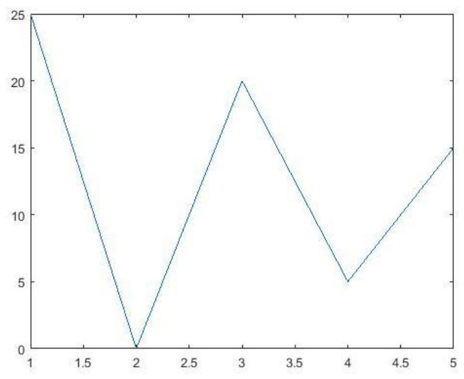
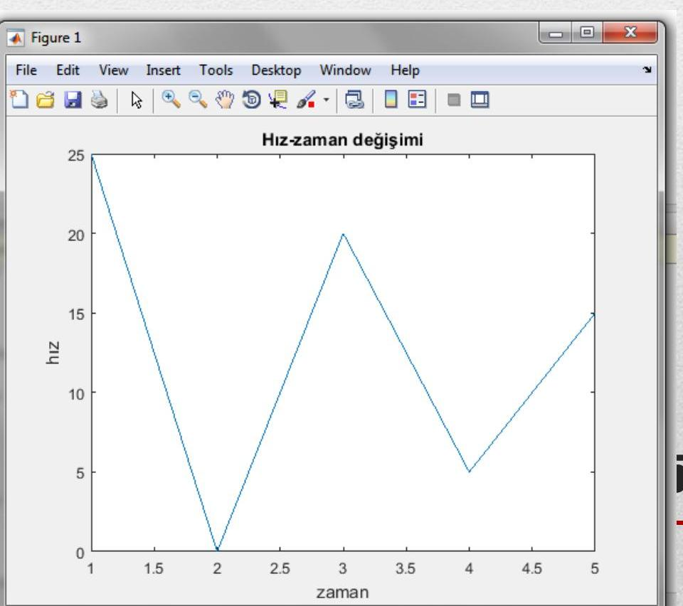
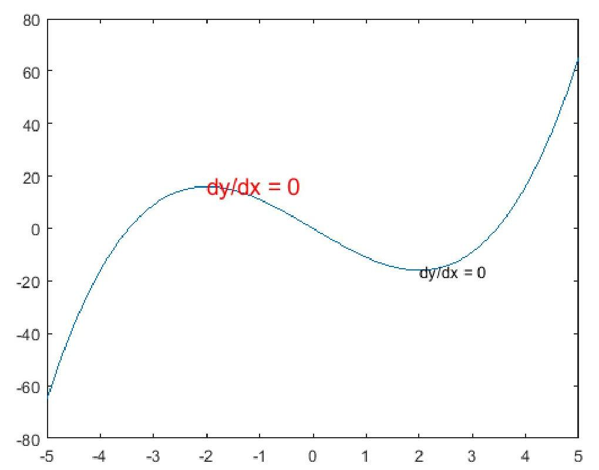
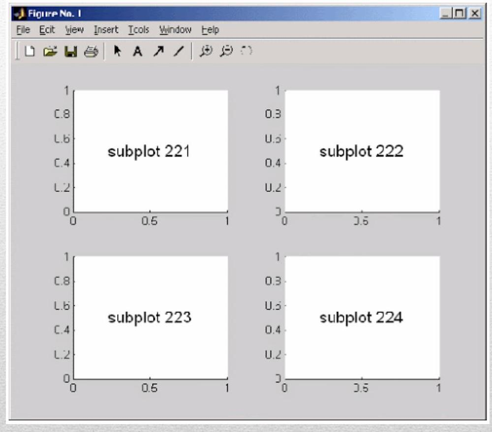
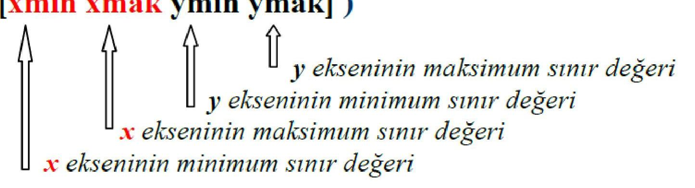
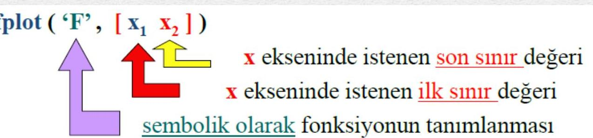
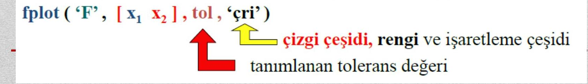
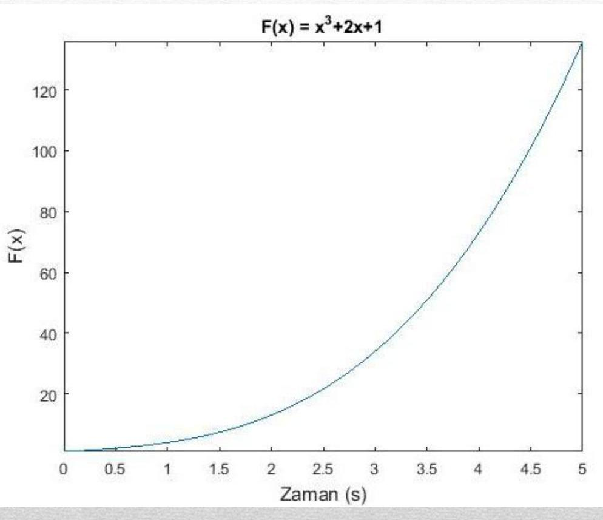
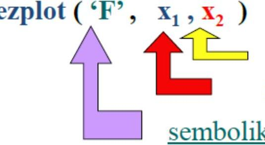
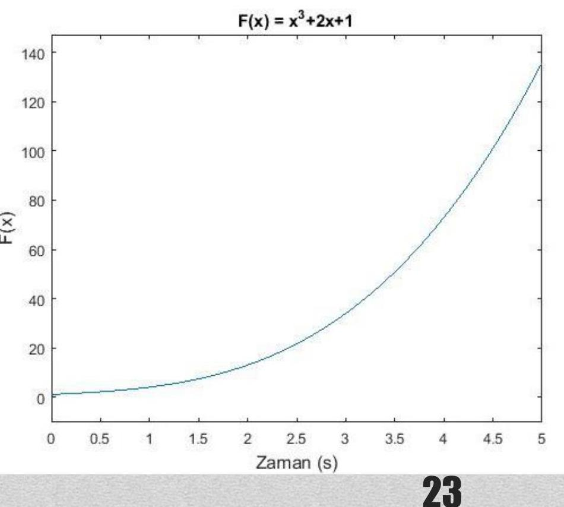

<iframe src="https://drive.google.com/file/d/1GsmaUNrAY8602VZbMwP9HcpxZj3mV6Lz/preview"
		width="100%"
        height="100%"
        allow="autoplay; fullscreen"
        allowfullscreen
        style="border:none; aspect-ratio:16/9;">
</iframe>

---
# BİLGİSAYAR PROGRAMLAMA 2 – DERS NOTU 5: GRAFİKLER-1  
**Konya Teknik Üniversitesi – Elektrik-Elektronik Mühendisliği Bölümü**  
**Tarih:** 12/11/2020  

---

## İçindekiler
- [[#Grafikler]]
- [[#2 Boyutlu Grafikler]]
- [[#2 Boyutlu Doğru ve Veri Grafikleri]]
- [[#Eksenleri Adlandırma ve Grafik Başlığı]]
- [[#Grafiğe Kılavuz Çizgilerinin Eklenmesi]]
- [[#Grafiklerin çözünürlüğü]]
- [[#Örnek3: Sinus Grafiği Çizimi]]
- [[#Grafiklerde Çizgi ve İşaretleme]]
- [[#Çoklu Grafik Çizdirmek]]
- [[#Grafiklere yazı eklemek]]
- [[#figure fonksiyonu]]
- [[#subplot fonksiyonu]]
- [[#axis komutu ile eksen ölçeklendirme]]
- [[#fplot komutu ile grafik çizme]]
- [[#ezplot komutu ile grafik çizme]]
- [[#Kaynaklar]]

---

## Genel Özet

MATLAB, veri analizi ve sayısal hesaplamaların yanı sıra bu verilerin görselleştirilmesine olanak tanıyan güçlü bir grafik ortamı sunar. Bu ders notunda, özellikle **2 boyutlu grafiklerin** nasıl oluşturulacağı, özelleştirileceği, çoklu grafiklerin aynı ya da farklı pencerelerde nasıl gösterileceği, eksenlerin nasıl ayarlanacağı ve özel fonksiyonlarla grafik çiziminin nasıl yapılabileceği anlatılmıştır. Öğrencilerin hem temel `plot` komutunu hem de `fplot`, `ezplot`, `subplot`, `legend`, `text`, `gtext` gibi yardımcı fonksiyonları öğrenmesi hedeflenmiştir.

---

## Temel Terimler ve Kavramlar

- **`plot`**: 2B veri grafiklerini çizmek için kullanılan temel komut.
- **`xlabel`, `ylabel`, `title`**: Grafik eksenlerini ve başlığını etiketlemek için kullanılan komutlar.
- **`grid`**: Grafik arka planına kılavuz çizgileri eklemek/kaldırmak için kullanılır.
- **`hold on/off`**: Aynı grafik üzerine birden fazla çizim yapmaya izin verir veya kapatır.
- **`legend`**: Çoklu grafiklerde her seriyi tanımlamak için açıklama kutusu ekler.
- **`figure`**: Yeni bir grafik penceresi açar.
- **`subplot`**: Tek bir pencerede birden fazla alt grafik oluşturur.
- **`axis`**: Grafik eksen sınırlarını ve görünüm özelliklerini ayarlar.
- **`fplot` / `ezplot`**: Sembolik fonksiyonların grafiklerini doğrudan çizmeye yarayan komutlar.

---

## Ana Gövde: Kronolojik veya Tematik Kayıt

### Grafikler

MATLAB, hesaplamaların görselleştirilmesini sağlayan etkileşimli bir ortam sunar. Çizilebilen başlıca grafik türleri şunlardır:

- **Çizgisel**: `plot`, `plot3`, `polar`
- **Yüzey**: `surf`, `surfc`
- **Ağ (mesh)**: `mesh`, `meshc`, `meshgrid`
- **Halka (contour)**: `contour`, `contourf`
- **Özel grafikler**: `bar`, `bar3`, `pie`, `pie3`, `rose`
- **Animasyonlar**: `moviein`, `movie`

---

### 2 Boyutlu Grafikler

x-y düzleminde çizilen grafiklerdir ve üç ana kategoriye ayrılır:
- Doğru ve veri grafikleri
- Fonksiyon grafikleri
- Özel grafikler (pasta, çubuk vb.)

---

### 2 Boyutlu Doğru ve Veri Grafikleri

Temel `plot` komutu kullanılır:

```matlab
x = [1 2 3 4 5];
y = [25 0 20 5 15];
plot(x, y)
```



Alternatif kullanım:
```matlab
plot([1 2 3 4 5], [25 0 20 5 15])
```

---

### Eksenleri Adlandırma ve Grafik Başlığı

- `xlabel('zaman')`
- `ylabel('hız')`
- `title('Hız-zaman değişimi')`

Bu komutlar `plot`’tan sonra yazılmalıdır.



---

### Grafiğe Kılavuz Çizgilerinin Eklenmesi

- `grid on` → kılavuz çizgilerini açar
- `grid off` → kapatır
- Sadece `grid` yazıldığında mevcut durumu değiştirir (toggle).

**Örnek1b:**
```matlab
x = [1 2 3 4 5];
y = [25 0 20 5 15];
plot(x, y)
xlabel('zaman')
ylabel('hız')
title('Hız-zaman değişimi')
grid
```

---

### Grafiklerin çözünürlüğü

Çözünürlük, x eksenindeki adım aralığına bağlıdır.

**Düşük çözünürlük (5 birim):**
```matlab
x = -10:5:10;
y = x.^2;
plot(x, y)
```

**Yüksek çözünürlük (0.5 birim):**
```matlab
x = -10:0.5:10;
y = x.^2;
plot(x, y)
```

Daha küçük adım → daha akıcı grafik.

---

### Örnek3: Sinus Grafiği Çizimi

```matlab
t = 0:0.01:10;
y = 2 * sin(t);
plot(t, y)
title('2Sin(wt)')
grid
```

1 periyot için:
```matlab
t = 0:0.01:2*pi;
```

---

### Grafiklerde Çizgi ve İşaretleme

`plot(x, y, 'renk_stil_isaret')` formatı kullanılır.

**Renkler:**
- `r`: kırmızı, `g`: yeşil, `b`: mavi, `k`: siyah, `y`: sarı, `m`: magenta, `c`: cyan, `w`: beyaz

**Çizgi stilleri:**
- `-`: düz, `--`: kesikli, `:`: noktalı, `-.`: kesikli-noktalı

**İşaretçiler:**
- `.`: nokta, `o`: daire, `+`: artı, `*`: yıldız, `x`: çarpı, `s`: kare, `d`: baklava, `^`, `v`, `<`, `>`: üçgenler

> [!note]  
> Bu özellikleri `plot` içinde birleştirerek kullanabilirsiniz: `'r--o'` → kırmızı, kesikli çizgi, daire işaretçi.

---

### Çoklu Grafik Çizdirmek

#### Yöntem 1: Tek `plot` içinde
```matlab
plot(t, y1, t, y2, t, y3)
```

#### Yöntem 2: `hold on` ile
```matlab
plot(t, sin(t))
hold on
plot(t, cos(t))
hold off
```

> [!warning]  
> `hold on` kullanılmadan ardışık `plot` komutları bir öncekini siler.

---

### Grafiklere yazı eklemek

#### `legend`
```matlab
legend('sin(t)', 'cos(t)', 'Location', 'northwest')
```
Varsayılan konum: sağ üst (0-4, -1 arası değerlerle ayarlanabilir).

#### `text`
```matlab
text(2, 0.5, 'Maksimum nokta')
```
Belirtilen (x,y) koordinatına metin ekler.



#### `gtext`
```matlab
gtext('Bu bir tepe')
```
Fare ile tıklanan noktaya metin ekler.

---

### figure fonksiyonu

Her grafik ayrı pencerede çizilsin istenirse:
```matlab
figure(1); plot(t, sin(t))
figure(2); plot(t, cos(t))
```

---

### subplot fonksiyonu

Aynı pencerede alt grafikler oluşturur:
```matlab
subplot(2,1,1); plot(t, sin(t))
subplot(2,1,2); plot(t, cos(t))
```



> [!example]  
> `subplot(m,n,p)`: m satır, n sütun, p. grafik (soldan sağa, yukarıdan aşağı)

---

### axis komutu ile eksen ölçeklendirme

Manuel eksen sınırları:
```matlab
axis([0 12 -3 3])
```

Diğer seçenekler:
- `axis auto` → otomatik
- `axis tight` → veriye sıkı uyar
- `axis equal` → eşit ölçek
- `axis square` → kare alan
- `axis off` → eksenleri gizle



---

### fplot komutu ile grafik çizme

Sembolik fonksiyonları doğrudan çizer:
```matlab
fplot('x^3+2*x+1', [0 5])
xlabel('Zaman (s)')
ylabel('F(x)')
title('F(x) = x^3 + 2x + 1')
```

> [!success]  
> `fplot`, otomatik olarak yeterli nokta seçerek akıcı grafik çizer. Adım boyutu belirtmeye gerek yoktur.

  
  


---

### ezplot komutu ile grafik çizme

Benzer işlevi görür:
```matlab
ezplot('x^3+2*x+1', [0 5])
```

Ancak **MathWorks artık `ezplot` yerine `fplot` kullanımını önermektedir**.

  


> [!note]  
> `ezplot`, sembolik değişkenleri `syms` ile tanımlamayı da destekler:
> ```matlab
> syms x
> ezplot(x^3 + 2*x + 1, [0 5])
> ```

---

## Temel Formüller ve Hızlı Bilgiler

> [!example]+ Temel MATLAB Grafik Komutları
> ```matlab
> plot(x, y, 'r--o')        % Kırmızı, kesikli, daire işaretçi
> xlabel('x ekseni')
> ylabel('y ekseni')
> title('Grafik Başlığı')
> grid on
> legend('Veri Seti 1')
> text(1, 2, 'Not')
> hold on
> figure(2)
> subplot(2,2,1)
> axis([xmin xmax ymin ymax])
> fplot('sin(x)', [0 2*pi])
> ```

> [!example]+ axis Modları
> - `axis equal` → x ve y ölçekleri eşit  
> - `axis square` → grafik alanı kare  
> - `axis tight` → veriye göre sıkı sınırlar  
> - `axis off` → eksenleri gizle

---

## Kaynaklar

- MATLAB ve Programlama – Dr. Aslan İNAN  
- Sayısal Analiz Ders Notları – Doç. Dr. Cüneyt Bayılmış, Sakarya Üniversitesi  
- [MathWorks MATLAB Central](http://www.mathworks.com/matlabcentral/)  
- [File Exchange](http://www.mathworks.com/matlabcentral/fileexchange/)