<iframe src="https://drive.google.com/file/d/1IDeLaavvAWYQSlqKJM8ZOHkXVJ4rVa61/preview"
		width="100%"
        height="100%"
        allow="autoplay; fullscreen"
        allowfullscreen
        style="border:none; aspect-ratio:16/9;">
</iframe>

---

- [Genel Özet](#genel-özet)
- [Temel Terimler ve Kavramlar](#temel-terimler-ve-kavramlar)
- [Simulink Nedir?](#simulink-nedir)
- [Simulink’in Avantajları](#simulinke-avantajları)
- [Simulink’i Başlatma ve Yeni Model Oluşturma](#simulinki-başlatma-ve-yeni-model-oluşturma)
- [Simulink Komponent Kütüphanesi](#simulink-komponent-kütüphanesi)
- [Model Oluşturma Adımları](#model-oluşturma-adımları)
- [Örnek-1: Sinyal Üretimi ve İntegral Alma](#örnek-1-sinyal-üretimi-ve-integral-alma)
- [Simülasyon Parametreleri](#simülasyon-parametreleri)
- [Blok Düzenleme ve Görünüm Ayarları](#blok-düzenleme-ve-görünüm-ayarları)
- [Scope ile Sonuçları Kaydetme](#scope-ile-sonuçları-kaydetme)
- [Alt Sistemler (Subsystem)](#alt-sistemler-subsystem)
- [Simscape Nedir ve Nasıl Kullanılır?](#simscape-nedir-ve-nasıl-kullanılır)
- [Örnek-3: RC Devresi ile Kondansatör Şarj Grafiği](#örnek-3-rc-devresi-ile-kondansatör-şarj-grafiği)
- [Ödev](#ödev)
- [Kaynaklar](#kaynaklar)

---

## **Genel Özet**

**Simulink**, MATLAB ortamında entegre çalışan, **blok tabanlı bir modelleme ve simülasyon aracıdır**. Özellikle dinamik sistemlerin, kontrol sistemlerinin ve sinyal işleme uygulamalarının modellenmesinde yaygın olarak kullanılır. Kullanıcılara **grafiksel bir arayüz** sunarak, karmaşık sistemlerin kod yazmadan, "sürükle-bırak" yöntemiyle kurulmasını sağlar. Bu sayede mühendisler, sistem davranışlarını test etmeden önce **sanal ortamda simülasyon yapabilir** ve hataları erken aşamada tespit edebilir.

Bu ders notu, Simulink’in temel bileşenlerini, model oluşturma süreçlerini, alt sistem kavramını ve **Simscape** ile fiziksel sistem modellemesini ele almaktadır. Ayrıca örnek uygulamalar ve bir ödev ile pekiştirme sağlanmıştır.

---

## **Temel Terimler ve Kavramlar**

- **Simulink**: Dinamik sistemlerin grafiksel olarak modellenip simüle edildiği MATLAB entegreli bir araç.
- **Blok Diyagramı**: Sistemin yapı taşlarının (blokların) ve aralarındaki sinyal akışının gösterildiği diyagram.
- **Source (Kaynak)**: Sinyal üreten bloklar (örneğin: Constant, Sine Wave).
- **Sink (Alıcı)**: Sinyali gösteren veya kaydeden bloklar (örneğin: Scope, Display).
- **Subsystem (Alt Sistem)**: Belirli bir işlevi yerine getiren blok grubunun tek bir blok altında toplanması.
- **Simscape**: Fiziksel sistemlerin (elektrik, mekanik, hidrolik vb.) modellenmesine olanak tanıyan Simulink eklentisi.
- **Simulink-PS Converter**: Simulink sinyallerini Simscape fiziksel sinyallerine dönüştüren blok.
- **Solver Configuration**: Simscape modellerinde simülasyon çözücüsünün ayarlandığı zorunlu blok.

---

## **Simulink Nedir?**

Simulink, **dinamik sistemlerin** (zamanla değişen sistemlerin) **grafiksel olarak modellenmesini**, **analiz edilmesini** ve **simüle edilmesini** sağlayan bir yazılımdır. MATLAB ile birlikte kurulur ve MATLAB ortamından doğrudan erişilebilir.

---

## **Simulink’e Avantajları**

- Kod yazma bilgisi gerektirmez (başlangıç seviyesi için).
- **Sürükle-bırak** arayüzü sayesinde hızlı prototipleme sağlar.
- Karmaşık sistemler bile hiyerarşik yapılarla (alt sistemlerle) kolayca yönetilebilir.
- Gerçek zamanlı simülasyon, kod üretimi ve donanımla entegrasyon imkânı sunar.

> [!note]  
> Simulink sürümleri, MATLAB sürümlerine bağlıdır. Örneğin, MATLAB R2016a ile birlikte gelen Simulink sürümü **8.7**’dir.

---

## **Simulink’i Başlatma ve Yeni Model Oluşturma**

1. MATLAB başlangıç ekranında **Simulink** butonuna tıklayın.
2. Açılan pencereden **"Blank Model"** seçeneğine tıklayarak boş bir model oluşturun.
3. **Library Browser** penceresinden gerekli blokları seçip model alanına sürükleyin.

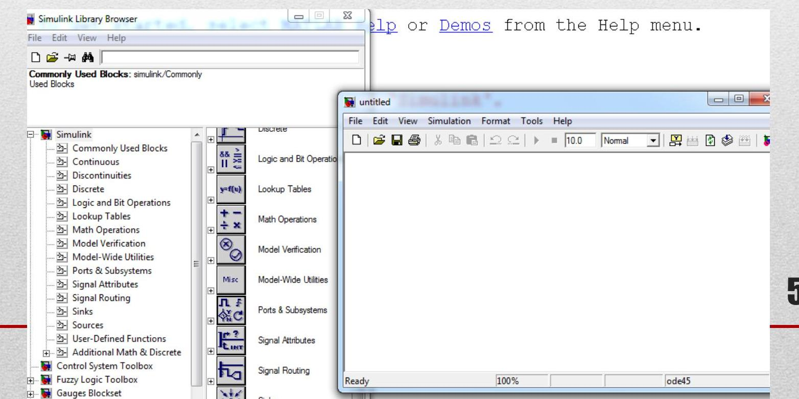

---

## **Simulink Komponent Kütüphanesi**

Simulink kütüphanesi, fonksiyonlarına göre kategorilere ayrılmıştır:

- **Sources**: Sinyal üreten bloklar (Sine Wave, Constant, Step vb.)
- **Sinks**: Çıkış blokları (Scope, Display, To Workspace vb.)
- **Continuous**: Sürekli zaman blokları (Integrator, Transfer Fcn)
- **Discrete**: Ayrık zaman blokları (Unit Delay, Discrete Transfer Fcn)
- **Math Operations**: Matematiksel işlemler (Gain, Sum, Product)
- **Simscape > Electrical**: Fiziksel elektrik devre elemanları (direnç, kondansatör, gerilim kaynağı vb.)

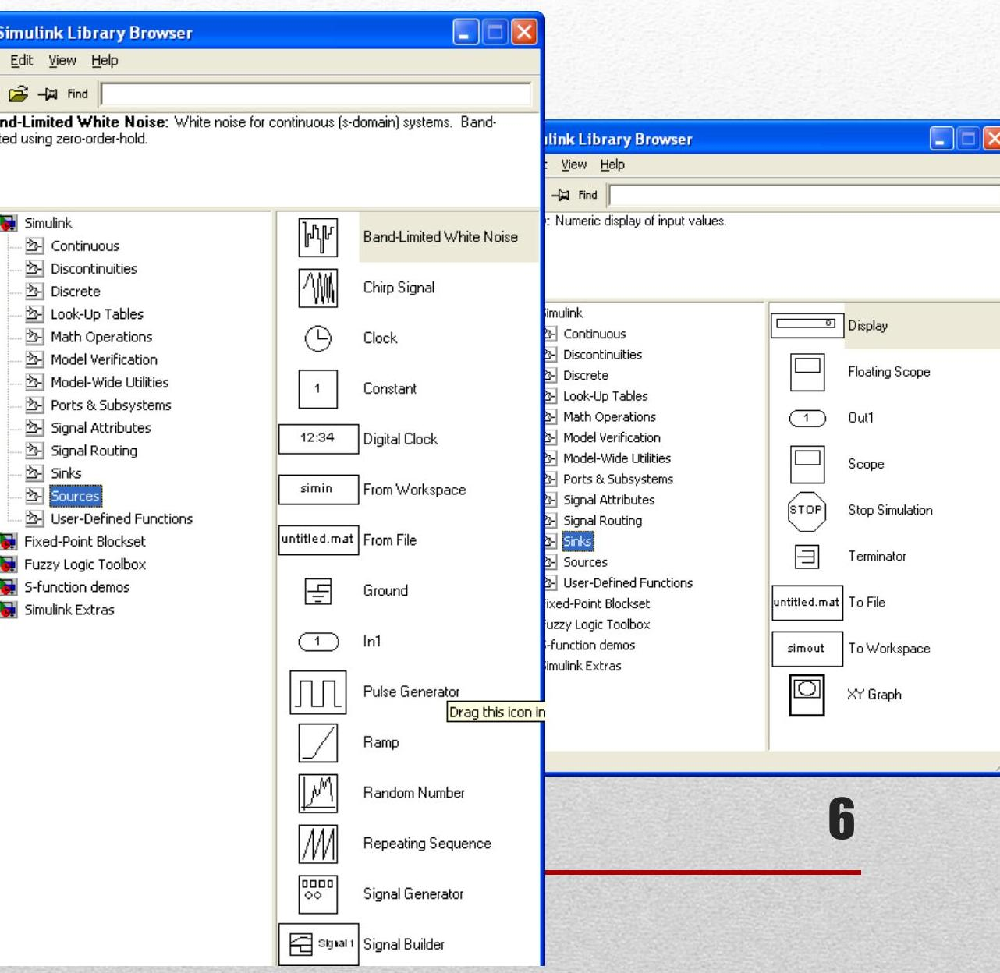

---

## **Model Oluşturma Adımları**

1. Gerekli blokları **Library Browser**’dan sürükleyin.
2. Blokları birbiriyle **bağlantı hatları** ile bağlayın (çıkış → giriş).
3. Her bloğun parametrelerini **çift tıklayarak** düzenleyin.

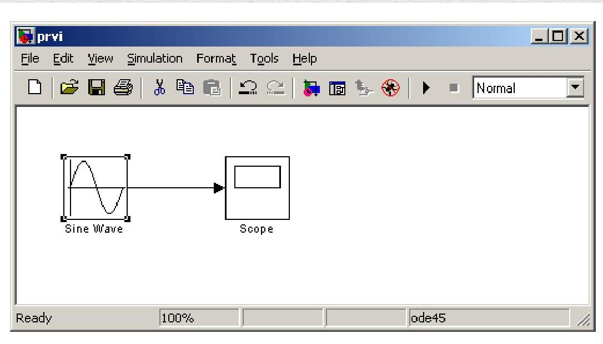

---

## **Örnek-1: Sinyal Üretimi ve İntegral Alma**

**Amaç**: Sabit bir sinyalin (DC) integralini almak ve hem orijinal hem de integral sinyali **Scope** ile görüntülemek.

- **Kullanılan Bloklar**:
  - **Constant** (kaynak)
  - **Integrator** (integral alıcı)
  - **Scope** (gösterge)

> [!infobox]  
> Scope’a birden fazla sinyal girebilmesi için **giriş port sayısını artırmak gerekir** (Scope → Parameters → Number of input ports: 2).  
> 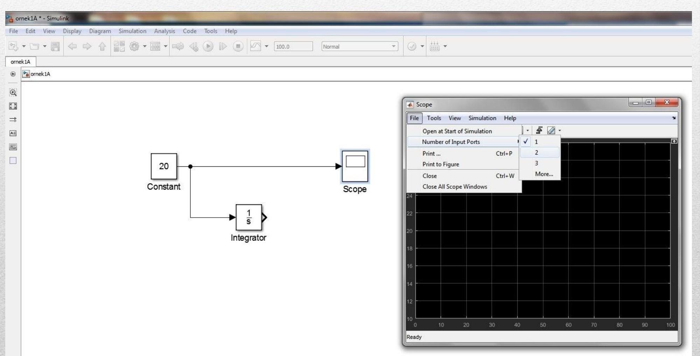

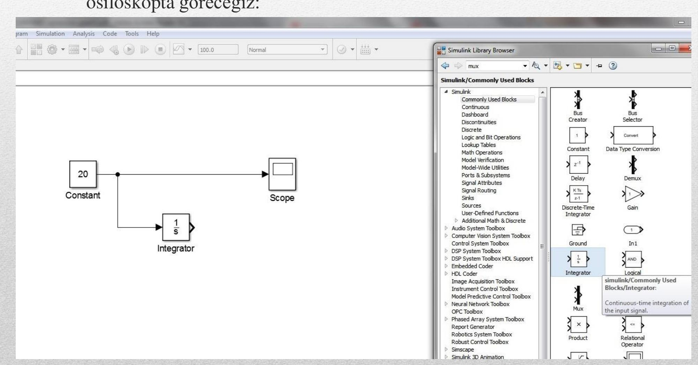

---

## **Simülasyon Parametreleri**

- **Simülasyon süresi** varsayılan olarak **10 saniye**dir.
- Değiştirmek için:
  - Simulink ana sayfasındaki **Stop Time** kutusuna yeni değer yazın **veya**
  - **Simulation → Model Configuration Parameters** menüsünden ayarlayın.
- Sürekli simülasyon için bitiş zamanı olarak `inf` yazılabilir.

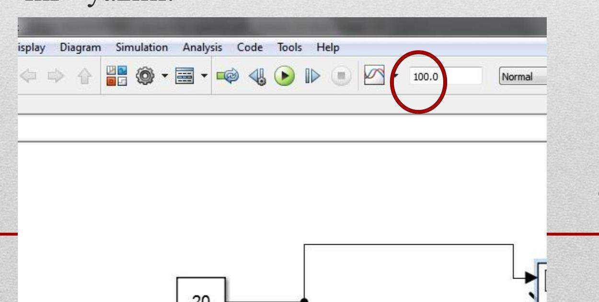

---

## **Blok Düzenleme ve Görünüm Ayarları**

Blok üzerinde sağ tıklanarak aşağıdaki düzenlemeler yapılabilir:

| Özellik | Açıklama |
|--------|--------|
| **Flip Name** | Blok adını ters çevirir |
| **Hide Name** | Blok adını gizler |
| **Rotate / Flip Block** | Bloğu döndürür veya yansıtır |
| **Background Color** | Arka plan rengini değiştirir |
| **Port Labels** | Giriş/çıkış etiketlerini göster/gizle |

> [!tip]  
> Blok ismini değiştirmek için **üzerine tek tıklayıp** yeni ismi yazmanız yeterlidir.

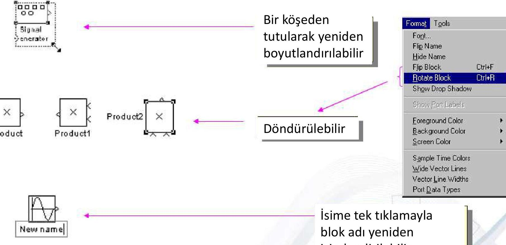

---

## **Scope ile Sonuçları Kaydetme**

1. Scope penceresini açın (çift tıkla).
2. **File → Print to Figure** seçeneğine tıklayın.
3. Grafik artık **MATLAB figure** haline gelir.
4. Buradan **dosya olarak kaydedebilir** veya **yazdırabilirsiniz**.

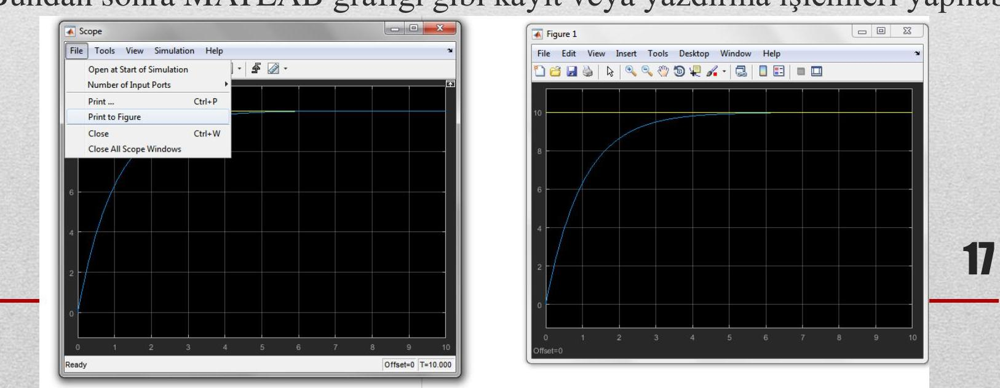

---

## **Alt Sistemler (Subsystem)**

Alt sistemler, karmaşık modelleri **modüler ve düzenli** hale getirir.

### Alt Sistem Oluşturma Yöntemleri:

1. **Boş Subsystem bloğu** ekleyip içini doldurmak.
2. **Mevcut blokları seçip** `Diagram → Create Subsystem from Selection` seçeneğiyle otomatik alt sistem oluşturmak.

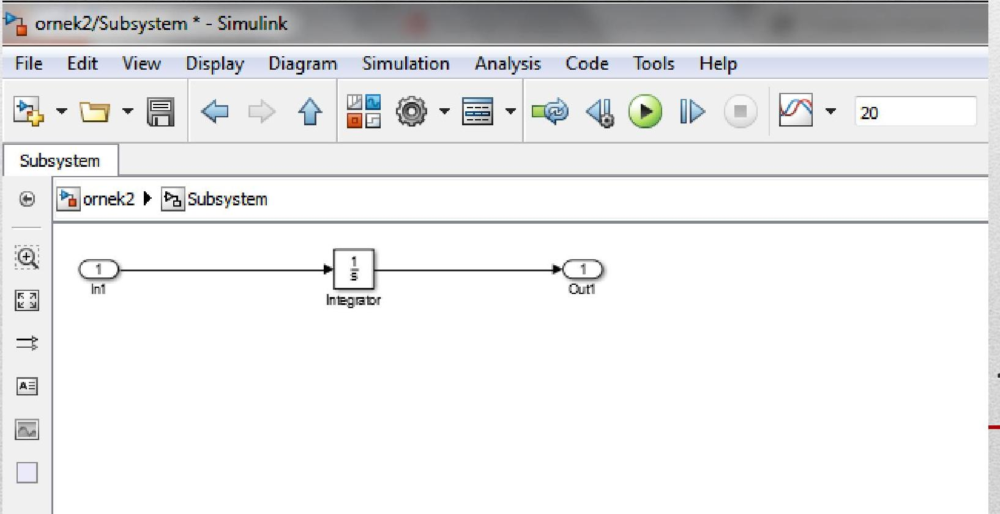

> [!example]+ Örnek-2  
> DC sinyal ile sinüs dalgasını toplayan bir sistem, alt sistem içinde modellenmiştir.  
> 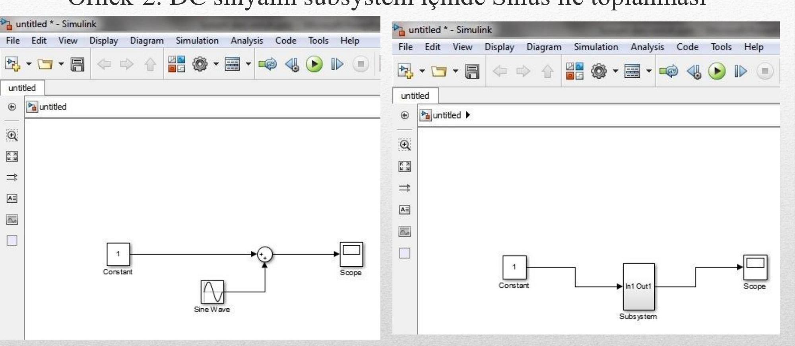

---

## **Simscape Nedir ve Nasıl Kullanılır?**

Yeni MATLAB sürümlerinde **temel elektrik bileşenleri** doğrudan Simulink’te bulunmaz. Bunun yerine **Simscape > Electrical** kütüphanesi kullanılır.

### Temel Simscape Blokları:

- **Physical Signal (PS) Blokları**: Mavi renkli, fiziksel bağlantıları temsil eder.
- **Simulink-PS Converter**: Simulink sinyalini fiziksel sinyale çevirir.
- **PS-Simulink Converter**: Fiziksel sinyali Simulink’e geri çevirir.
- **Solver Configuration**: **Zorunlu** olarak her Simscape modeline eklenmelidir.

> [!warning]  
> Simscape’te devreler **gerçek dünya kurallarına uygun** bağlanmalıdır. Örneğin, **toprak (Electrical Reference)** bağlantısı eksikse simülasyon **hata verir**.

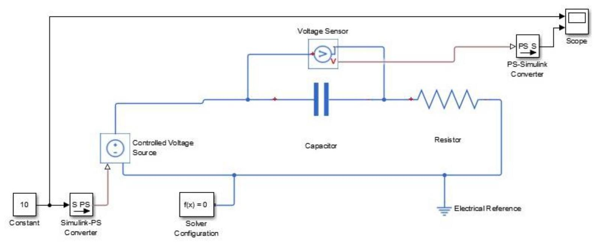

---

## **Örnek-3: RC Devresi ile Kondansatör Şarj Grafiği**

**Devre**: 10 V DC → 1000 kΩ direnç → 1 μF kondansatör → toprak

**Amaç**: Kondansatörün zamanla nasıl şarj olduğunu gözlemlemek.

**Kullanılan Simscape Blokları**:
- **DC Voltage Source**
- **Resistor**, **Capacitor**
- **Electrical Reference** (toprak)
- **PS-Simulink Converter** + **Scope**

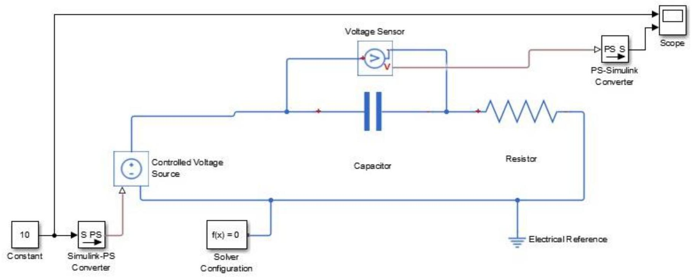

---

## **Ödev**

Aşağıdaki adımları sırayla uygulayın:

1. **20 V**, simülasyon süresi **10 sn**
2. **10 V**, simülasyon süresi **10 sn**
3. **10 V**, simülasyon süresi **3 sn**

Her adımda **kondansatör gerilim grafiğini kaydedin** ve şu soruları cevaplayın:

- Gerilim artışı nasıl bir eğri izler? (Üstel mi, doğrusal mı?)
- Kaynak gerilimi yarıya indiğinde şarj eğrisi nasıl değişir?
- Simülasyon süresi kısaltıldığında ne gözlemlenir?

> [!success]  
> Bu ödev, **RC zaman sabiti** (τ = R·C) kavramını pekiştirmenizi sağlar.

---

## **Kaynaklar**

- Shameer Koya, *Lecture Series-7*
- [MathWorks Simulink Documentation](https://www.mathworks.com)
- [Northwestern University MATLAB Help](http://www.ece.northwestern.edu/local-apps/matlabhelp/toolbox/simulink/ug/basics.html)

> **Not**: Tüm ekran görüntüleri orijinal dersten alınmıştır.  
> Tarih: 17 Aralık 2020  
> Kurum: Konya Teknik Üniversitesi, Elektrik-Elektronik Mühendisliği Bölümü

--- 

Hazırlayan: [Öğrenci / Eğitmen Adı]  
Ders: **Bilgisayar Programlama 2**  
Ders Notu No: **7 – Simulink**
