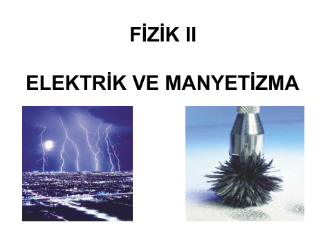
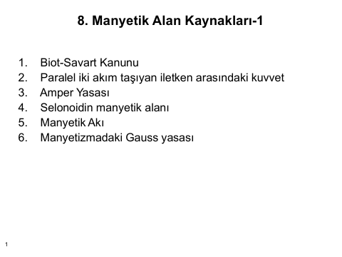
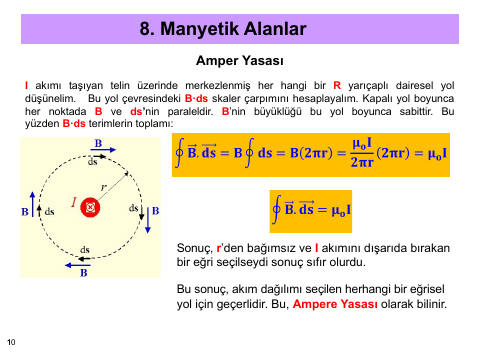
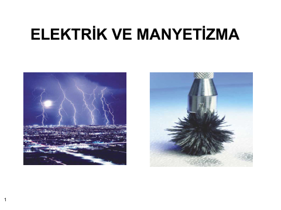
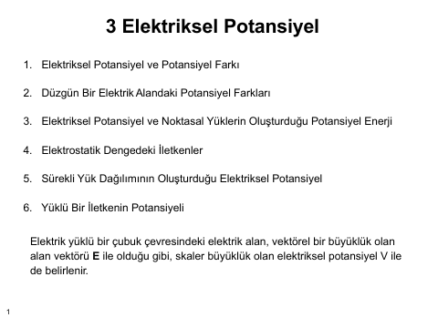
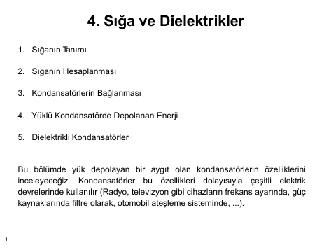
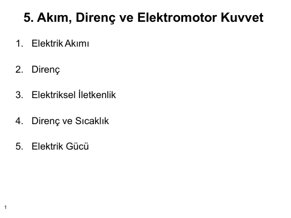
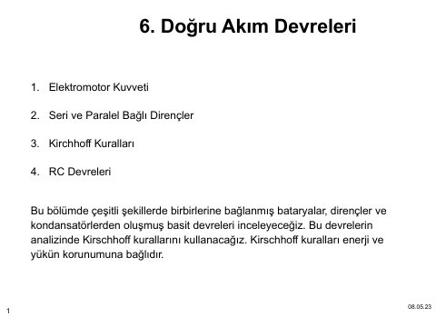
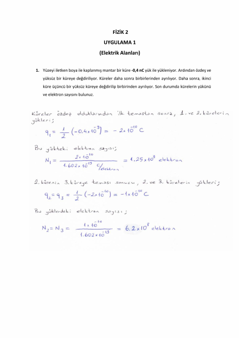

## 📚 Ders Materyalleri

  <a href="https://cdn.jsdelivr.net/gh/c4kar/ktunDepo@main/EEM/EEM-1/fizik-1/fizik%20document.pdf" target="_blank" rel="noopener" class="materyal-thumb-link">
    

      
    

  </a>
  

    
fizik document

    

      PDF
      46.4 KB
    

  

  <a href="https://github.com/c4kar/ktunDepo/raw/main/EEM/EEM-1/fizik-1/fizik%20document.pdf" class="materyal-download" target="_blank" rel="noopener">
    ↓ İndir
  </a>

  <a href="https://cdn.jsdelivr.net/gh/c4kar/ktunDepo@main/EEM/EEM-1/fizik-1/fizik-1/LMS/Ders%20%202-Vektorler.pdf" target="_blank" rel="noopener" class="materyal-thumb-link">
    

      
    

  </a>
  

    
Ders  2-Vektorler

    

      PDF
      1.8 MB
    

  

  <a href="https://github.com/c4kar/ktunDepo/raw/main/EEM/EEM-1/fizik-1/fizik-1/LMS/Ders%20%202-Vektorler.pdf" class="materyal-download" target="_blank" rel="noopener">
    ↓ İndir
  </a>

  <a href="https://cdn.jsdelivr.net/gh/c4kar/ktunDepo@main/EEM/EEM-1/fizik-1/fizik-1/LMS/Ders%201%20-%20F%C4%B0Z%C4%B0K%201%20MEKAN%C4%B0K.pdf" target="_blank" rel="noopener" class="materyal-thumb-link">
    

      
    

  </a>
  

    
Ders 1 - FİZİK 1 MEKANİK

    

      PDF
      2.5 MB
    

  

  <a href="https://github.com/c4kar/ktunDepo/raw/main/EEM/EEM-1/fizik-1/fizik-1/LMS/Ders%201%20-%20F%C4%B0Z%C4%B0K%201%20MEKAN%C4%B0K.pdf" class="materyal-download" target="_blank" rel="noopener">
    ↓ İndir
  </a>

  <a href="https://cdn.jsdelivr.net/gh/c4kar/ktunDepo@main/EEM/EEM-1/fizik-1/fizik-2/LMS/1.5-%201.%20ve%202.%20bolumle%20ilgili%20sorular.pdf" target="_blank" rel="noopener" class="materyal-thumb-link">
    

      
    

  </a>
  

    
1.5- 1. ve 2. bolumle ilgili sorular

    

      PDF
      229.0 KB
    

  

  <a href="https://github.com/c4kar/ktunDepo/raw/main/EEM/EEM-1/fizik-1/fizik-2/LMS/1.5-%201.%20ve%202.%20bolumle%20ilgili%20sorular.pdf" class="materyal-download" target="_blank" rel="noopener">
    ↓ İndir
  </a>

  <a href="https://cdn.jsdelivr.net/gh/c4kar/ktunDepo@main/EEM/EEM-1/fizik-1/fizik-2/LMS/1.hafta-FizikII-v1.pdf" target="_blank" rel="noopener" class="materyal-thumb-link">
    

      
    

  </a>
  

    
1.hafta-FizikII-v1

    

      PDF
      1.6 MB
    

  

  <a href="https://github.com/c4kar/ktunDepo/raw/main/EEM/EEM-1/fizik-1/fizik-2/LMS/1.hafta-FizikII-v1.pdf" class="materyal-download" target="_blank" rel="noopener">
    ↓ İndir
  </a>

  <a href="https://cdn.jsdelivr.net/gh/c4kar/ktunDepo@main/EEM/EEM-1/fizik-1/fizik-2/LMS/11.hafta-FizikII.pdf" target="_blank" rel="noopener" class="materyal-thumb-link">
    

      
    

  </a>
  

    
11.hafta-FizikII

    

      PDF
      314.3 KB
    

  

  <a href="https://github.com/c4kar/ktunDepo/raw/main/EEM/EEM-1/fizik-1/fizik-2/LMS/11.hafta-FizikII.pdf" class="materyal-download" target="_blank" rel="noopener">
    ↓ İndir
  </a>

  <a href="https://cdn.jsdelivr.net/gh/c4kar/ktunDepo@main/EEM/EEM-1/fizik-1/fizik-2/LMS/12.hafta-FizikII.pdf" target="_blank" rel="noopener" class="materyal-thumb-link">
    

      
    

  </a>
  

    
12.hafta-FizikII

    

      PDF
      618.3 KB
    

  

  <a href="https://github.com/c4kar/ktunDepo/raw/main/EEM/EEM-1/fizik-1/fizik-2/LMS/12.hafta-FizikII.pdf" class="materyal-download" target="_blank" rel="noopener">
    ↓ İndir
  </a>

  <a href="https://cdn.jsdelivr.net/gh/c4kar/ktunDepo@main/EEM/EEM-1/fizik-1/fizik-2/LMS/14%20Devre-sorular.pdf" target="_blank" rel="noopener" class="materyal-thumb-link">
    

      
    

  </a>
  

    
14 Devre-sorular

    

      PDF
      675.9 KB
    

  

  <a href="https://github.com/c4kar/ktunDepo/raw/main/EEM/EEM-1/fizik-1/fizik-2/LMS/14%20Devre-sorular.pdf" class="materyal-download" target="_blank" rel="noopener">
    ↓ İndir
  </a>

  <a href="https://cdn.jsdelivr.net/gh/c4kar/ktunDepo@main/EEM/EEM-1/fizik-1/fizik-2/LMS/14%20Manyetik%20Alanla%20ilgili%20sorular%202.pdf" target="_blank" rel="noopener" class="materyal-thumb-link">
    

      
    

  </a>
  

    
14 Manyetik Alanla ilgili sorular 2

    

      PDF
      178.7 KB
    

  

  <a href="https://github.com/c4kar/ktunDepo/raw/main/EEM/EEM-1/fizik-1/fizik-2/LMS/14%20Manyetik%20Alanla%20ilgili%20sorular%202.pdf" class="materyal-download" target="_blank" rel="noopener">
    ↓ İndir
  </a>

  <a href="https://cdn.jsdelivr.net/gh/c4kar/ktunDepo@main/EEM/EEM-1/fizik-1/fizik-2/LMS/2.hafta-FizikII.pdf" target="_blank" rel="noopener" class="materyal-thumb-link">
    

      
    

  </a>
  

    
2.hafta-FizikII

    

      PDF
      519.3 KB
    

  

  <a href="https://github.com/c4kar/ktunDepo/raw/main/EEM/EEM-1/fizik-1/fizik-2/LMS/2.hafta-FizikII.pdf" class="materyal-download" target="_blank" rel="noopener">
    ↓ İndir
  </a>

  <a href="https://cdn.jsdelivr.net/gh/c4kar/ktunDepo@main/EEM/EEM-1/fizik-1/fizik-2/LMS/3.bolumle%20ilgili%20sorular-v1.pdf" target="_blank" rel="noopener" class="materyal-thumb-link">
    

      
    

  </a>
  

    
3.bolumle ilgili sorular-v1

    

      PDF
      191.8 KB
    

  

  <a href="https://github.com/c4kar/ktunDepo/raw/main/EEM/EEM-1/fizik-1/fizik-2/LMS/3.bolumle%20ilgili%20sorular-v1.pdf" class="materyal-download" target="_blank" rel="noopener">
    ↓ İndir
  </a>

  <a href="https://cdn.jsdelivr.net/gh/c4kar/ktunDepo@main/EEM/EEM-1/fizik-1/fizik-2/LMS/4-hafta.pdf" target="_blank" rel="noopener" class="materyal-thumb-link">
    

      
    

  </a>
  

    
4-hafta

    

      PDF
      1.8 MB
    

  

  <a href="https://github.com/c4kar/ktunDepo/raw/main/EEM/EEM-1/fizik-1/fizik-2/LMS/4-hafta.pdf" class="materyal-download" target="_blank" rel="noopener">
    ↓ İndir
  </a>

  <a href="https://cdn.jsdelivr.net/gh/c4kar/ktunDepo@main/EEM/EEM-1/fizik-1/fizik-2/LMS/4.%20bolumle%20ilgili%20sorular.pdf" target="_blank" rel="noopener" class="materyal-thumb-link">
    

      
    

  </a>
  

    
4. bolumle ilgili sorular

    

      PDF
      322.2 KB
    

  

  <a href="https://github.com/c4kar/ktunDepo/raw/main/EEM/EEM-1/fizik-1/fizik-2/LMS/4.%20bolumle%20ilgili%20sorular.pdf" class="materyal-download" target="_blank" rel="noopener">
    ↓ İndir
  </a>

  <a href="https://cdn.jsdelivr.net/gh/c4kar/ktunDepo@main/EEM/EEM-1/fizik-1/fizik-2/LMS/5.hafta-FizikII.pdf" target="_blank" rel="noopener" class="materyal-thumb-link">
    

      
    

  </a>
  

    
5.hafta-FizikII

    

      PDF
      1.5 MB
    

  

  <a href="https://github.com/c4kar/ktunDepo/raw/main/EEM/EEM-1/fizik-1/fizik-2/LMS/5.hafta-FizikII.pdf" class="materyal-download" target="_blank" rel="noopener">
    ↓ İndir
  </a>

  <a href="https://cdn.jsdelivr.net/gh/c4kar/ktunDepo@main/EEM/EEM-1/fizik-1/fizik-2/LMS/6.hafta-FizikII.pdf" target="_blank" rel="noopener" class="materyal-thumb-link">
    

      
    

  </a>
  

    
6.hafta-FizikII

    

      PDF
      3.2 MB
    

  

  <a href="https://github.com/c4kar/ktunDepo/raw/main/EEM/EEM-1/fizik-1/fizik-2/LMS/6.hafta-FizikII.pdf" class="materyal-download" target="_blank" rel="noopener">
    ↓ İndir
  </a>

  <a href="https://cdn.jsdelivr.net/gh/c4kar/ktunDepo@main/EEM/EEM-1/fizik-1/fizik-2/LMS/7.hafta-FizikII.pdf" target="_blank" rel="noopener" class="materyal-thumb-link">
    

      
    

  </a>
  

    
7.hafta-FizikII

    

      PDF
      1.2 MB
    

  

  <a href="https://github.com/c4kar/ktunDepo/raw/main/EEM/EEM-1/fizik-1/fizik-2/LMS/7.hafta-FizikII.pdf" class="materyal-download" target="_blank" rel="noopener">
    ↓ İndir
  </a>

  <a href="https://cdn.jsdelivr.net/gh/c4kar/ktunDepo@main/EEM/EEM-1/fizik-1/fizik-2/LMS/8.%20hafta%20MAnyetik%20alana%20giris.pdf" target="_blank" rel="noopener" class="materyal-thumb-link">
    

      
    

  </a>
  

    
8. hafta MAnyetik alana giris

    

      PDF
      4.0 MB
    

  

  <a href="https://github.com/c4kar/ktunDepo/raw/main/EEM/EEM-1/fizik-1/fizik-2/LMS/8.%20hafta%20MAnyetik%20alana%20giris.pdf" class="materyal-download" target="_blank" rel="noopener">
    ↓ İndir
  </a>

  <a href="https://cdn.jsdelivr.net/gh/c4kar/ktunDepo@main/EEM/EEM-1/fizik-1/fizik-2/LMS/Devre-sorular.pdf" target="_blank" rel="noopener" class="materyal-thumb-link">
    

      
    

  </a>
  

    
Devre-sorular

    

      PDF
      675.9 KB
    

  

  <a href="https://github.com/c4kar/ktunDepo/raw/main/EEM/EEM-1/fizik-1/fizik-2/LMS/Devre-sorular.pdf" class="materyal-download" target="_blank" rel="noopener">
    ↓ İndir
  </a>

  <a href="https://cdn.jsdelivr.net/gh/c4kar/ktunDepo@main/EEM/EEM-1/fizik-1/fizik-2/LMS/Manyetik%20Alanla%20ilgili%20sorular%202.pdf" target="_blank" rel="noopener" class="materyal-thumb-link">
    

      
    

  </a>
  

    
Manyetik Alanla ilgili sorular 2

    

      PDF
      178.7 KB
    

  

  <a href="https://github.com/c4kar/ktunDepo/raw/main/EEM/EEM-1/fizik-1/fizik-2/LMS/Manyetik%20Alanla%20ilgili%20sorular%202.pdf" class="materyal-download" target="_blank" rel="noopener">
    ↓ İndir
  </a>

  <a href="https://cdn.jsdelivr.net/gh/c4kar/ktunDepo@main/EEM/EEM-1/fizik-1/fizik-2/LMS/UYGULAMA-2.pdf" target="_blank" rel="noopener" class="materyal-thumb-link">
    

      
    

  </a>
  

    
UYGULAMA-2

    

      PDF
      3.6 MB
    

  

  <a href="https://github.com/c4kar/ktunDepo/raw/main/EEM/EEM-1/fizik-1/fizik-2/LMS/UYGULAMA-2.pdf" class="materyal-download" target="_blank" rel="noopener">
    ↓ İndir
  </a>

  <a href="https://github.com/c4kar/ktunDepo/blob/main/EEM/EEM-1/fizik-1/fizik-2/Serway/Serway%20Fizik%201%20T%C3%BCrk%C3%A7e%20.pdf" target="_blank" rel="noopener" class="materyal-thumb-link">
    

      
    

  </a>
  

    
Serway Fizik 1 Türkçe 

    

      PDF
      80.3 MB
    

  

  <a href="https://github.com/c4kar/ktunDepo/raw/main/EEM/EEM-1/fizik-1/fizik-2/Serway/Serway%20Fizik%201%20T%C3%BCrk%C3%A7e%20.pdf" class="materyal-download" target="_blank" rel="noopener">
    ↓ İndir
  </a>

  <a href="https://github.com/c4kar/ktunDepo/blob/main/EEM/EEM-1/fizik-1/fizik-2/Serway/Serway%20Fizik%202%20Tu%CC%88rkc%CC%A7e.pdf" target="_blank" rel="noopener" class="materyal-thumb-link">
    

      
    

  </a>
  

    
Serway Fizik 2 Türkçe

    

      PDF
      33.4 MB
    

  

  <a href="https://github.com/c4kar/ktunDepo/raw/main/EEM/EEM-1/fizik-1/fizik-2/Serway/Serway%20Fizik%202%20Tu%CC%88rkc%CC%A7e.pdf" class="materyal-download" target="_blank" rel="noopener">
    ↓ İndir
  </a>

  <a href="https://cdn.jsdelivr.net/gh/c4kar/ktunDepo@main/EEM/EEM-1/fizik-1/fizik-2/kaynakca/MMF_F%20I%CC%87%20Z%20I%CC%87%20K_II_O%CC%88ZET_1.pdf" target="_blank" rel="noopener" class="materyal-thumb-link">
    

      
    

  </a>
  

    
MMF_F İ Z İ K_II_ÖZET_1

    

      PDF
      1.4 MB
    

  

  <a href="https://github.com/c4kar/ktunDepo/raw/main/EEM/EEM-1/fizik-1/fizik-2/kaynakca/MMF_F%20I%CC%87%20Z%20I%CC%87%20K_II_O%CC%88ZET_1.pdf" class="materyal-download" target="_blank" rel="noopener">
    ↓ İndir
  </a>

