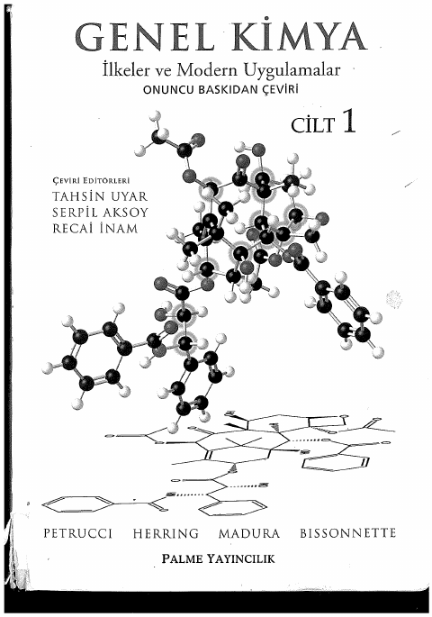

## 📚 Ders Materyalleri

  <a href="https://github.com/c4kar/ktunDepo/blob/main/EEM/EEM-1/kimya/Genel-Kimya-Petrucci-1.pdf" target="_blank" rel="noopener" class="materyal-thumb-link">
    

      
    

  </a>
  

    
Genel-Kimya-Petrucci-1

    

      PDF
      86.6 MB
    

  

  <a href="https://github.com/c4kar/ktunDepo/raw/main/EEM/EEM-1/kimya/Genel-Kimya-Petrucci-1.pdf" class="materyal-download" target="_blank" rel="noopener">
    ↓ İndir
  </a>

  <a href="https://github.com/c4kar/ktunDepo/blob/main/EEM/EEM-1/kimya/General%20Chemistry%2010th%20Edition%20Solution%20Manual.pdf" target="_blank" rel="noopener" class="materyal-thumb-link">
    

      
    

  </a>
  

    
General Chemistry 10th Edition Solution Manual

    

      PDF
      29.7 MB
    

  

  <a href="https://github.com/c4kar/ktunDepo/raw/main/EEM/EEM-1/kimya/General%20Chemistry%2010th%20Edition%20Solution%20Manual.pdf" class="materyal-download" target="_blank" rel="noopener">
    ↓ İndir
  </a>

