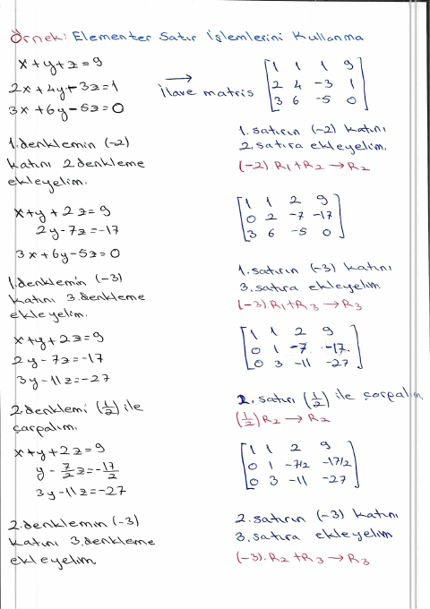
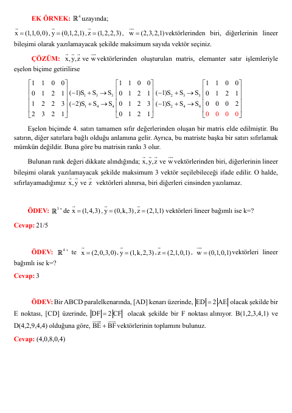

## 📚 Ders Materyalleri

  <a href="https://cdn.jsdelivr.net/gh/c4kar/ktunDepo@main/EEM/EEM-1/lineer-cebir/0%20%C3%96devler.pdf" target="_blank" rel="noopener" class="materyal-thumb-link">
    

      
    

  </a>
  

    
0 Ödevler

    

      PDF
      151.4 KB
    

  

  <a href="https://github.com/c4kar/ktunDepo/raw/main/EEM/EEM-1/lineer-cebir/0%20%C3%96devler.pdf" class="materyal-download" target="_blank" rel="noopener">
    ↓ İndir
  </a>

  <a href="https://cdn.jsdelivr.net/gh/c4kar/ktunDepo@main/EEM/EEM-1/lineer-cebir/1-%2019MartDersNotu-1-Matrisler1.pdf" target="_blank" rel="noopener" class="materyal-thumb-link">
    

      
    

  </a>
  

    
1- 19MartDersNotu-1-Matrisler1

    

      PDF
      319.4 KB
    

  

  <a href="https://github.com/c4kar/ktunDepo/raw/main/EEM/EEM-1/lineer-cebir/1-%2019MartDersNotu-1-Matrisler1.pdf" class="materyal-download" target="_blank" rel="noopener">
    ↓ İndir
  </a>

  <a href="https://cdn.jsdelivr.net/gh/c4kar/ktunDepo@main/EEM/EEM-1/lineer-cebir/2-Vize2024-2025CevapAnahtari.pdf" target="_blank" rel="noopener" class="materyal-thumb-link">
    

      
    

  </a>
  

    
2-Vize2024-2025CevapAnahtari

    

      PDF
      320.1 KB
    

  

  <a href="https://github.com/c4kar/ktunDepo/raw/main/EEM/EEM-1/lineer-cebir/2-Vize2024-2025CevapAnahtari.pdf" class="materyal-download" target="_blank" rel="noopener">
    ↓ İndir
  </a>

  <a href="https://cdn.jsdelivr.net/gh/c4kar/ktunDepo@main/EEM/EEM-1/lineer-cebir/3-%209NisanDersNotu-Matrisler2.pdf" target="_blank" rel="noopener" class="materyal-thumb-link">
    

      
    

  </a>
  

    
3- 9NisanDersNotu-Matrisler2

    

      PDF
      276.5 KB
    

  

  <a href="https://github.com/c4kar/ktunDepo/raw/main/EEM/EEM-1/lineer-cebir/3-%209NisanDersNotu-Matrisler2.pdf" class="materyal-download" target="_blank" rel="noopener">
    ↓ İndir
  </a>

  <a href="https://cdn.jsdelivr.net/gh/c4kar/ktunDepo@main/EEM/EEM-1/lineer-cebir/4-%2016NisanDersNotu-Determinantlar-LMS.pdf" target="_blank" rel="noopener" class="materyal-thumb-link">
    

      
    

  </a>
  

    
4- 16NisanDersNotu-Determinantlar-LMS

    

      PDF
      440.7 KB
    

  

  <a href="https://github.com/c4kar/ktunDepo/raw/main/EEM/EEM-1/lineer-cebir/4-%2016NisanDersNotu-Determinantlar-LMS.pdf" class="materyal-download" target="_blank" rel="noopener">
    ↓ İndir
  </a>

  <a href="https://cdn.jsdelivr.net/gh/c4kar/ktunDepo@main/EEM/EEM-1/lineer-cebir/EkOrnek.pdf" target="_blank" rel="noopener" class="materyal-thumb-link">
    

      
    

  </a>
  

    
EkOrnek

    

      PDF
      732.0 KB
    

  

  <a href="https://github.com/c4kar/ktunDepo/raw/main/EEM/EEM-1/lineer-cebir/EkOrnek.pdf" class="materyal-download" target="_blank" rel="noopener">
    ↓ İndir
  </a>

  <a href="https://cdn.jsdelivr.net/gh/c4kar/ktunDepo@main/EEM/EEM-1/lineer-cebir/Ek%C3%96rnekler-1.pdf" target="_blank" rel="noopener" class="materyal-thumb-link">
    

      
    

  </a>
  

    
EkÖrnekler-1

    

      PDF
      1.2 MB
    

  

  <a href="https://github.com/c4kar/ktunDepo/raw/main/EEM/EEM-1/lineer-cebir/Ek%C3%96rnekler-1.pdf" class="materyal-download" target="_blank" rel="noopener">
    ↓ İndir
  </a>

  <a href="https://cdn.jsdelivr.net/gh/c4kar/ktunDepo@main/EEM/EEM-1/lineer-cebir/Ek%C3%96rnekler-2.pdf.pdf" target="_blank" rel="noopener" class="materyal-thumb-link">
    

      
    

  </a>
  

    
EkÖrnekler-2.pdf

    

      PDF
      125.7 KB
    

  

  <a href="https://github.com/c4kar/ktunDepo/raw/main/EEM/EEM-1/lineer-cebir/Ek%C3%96rnekler-2.pdf.pdf" class="materyal-download" target="_blank" rel="noopener">
    ↓ İndir
  </a>

