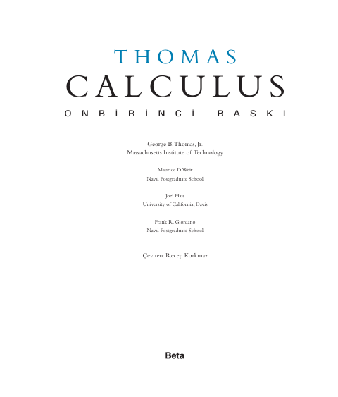
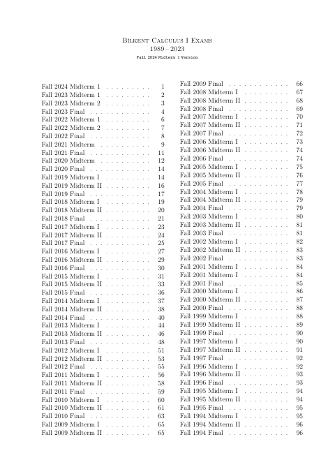

## 📚 Ders Materyalleri

  <a href="https://github.com/c4kar/ktunDepo/blob/main/EEM/EEM-1/matematik-1/1Thomas-Calculus-11EdTr-Single.pdf" target="_blank" rel="noopener" class="materyal-thumb-link">
    

      
    

  </a>
  

    
1Thomas-Calculus-11EdTr-Single

    

      PDF
      34.3 MB
    

  

  <a href="https://github.com/c4kar/ktunDepo/raw/main/EEM/EEM-1/matematik-1/1Thomas-Calculus-11EdTr-Single.pdf" class="materyal-download" target="_blank" rel="noopener">
    ↓ İndir
  </a>

  <a href="https://github.com/c4kar/ktunDepo/blob/main/EEM/EEM-1/matematik-1/GENEL%20MATEMAT%C4%B0K%20MUSTAFA%20BALCI-%20KONU%20ANLATIMLI.pdf" target="_blank" rel="noopener" class="materyal-thumb-link">
    

      
    

  </a>
  

    
GENEL MATEMATİK MUSTAFA BALCI- KONU ANLATIMLI

    

      PDF
      31.2 MB
    

  

  <a href="https://github.com/c4kar/ktunDepo/raw/main/EEM/EEM-1/matematik-1/GENEL%20MATEMAT%C4%B0K%20MUSTAFA%20BALCI-%20KONU%20ANLATIMLI.pdf" class="materyal-download" target="_blank" rel="noopener">
    ↓ İndir
  </a>

  <a href="https://cdn.jsdelivr.net/gh/c4kar/ktunDepo@main/EEM/EEM-1/matematik-1/eng-bilkentcikmissoru.pdf" target="_blank" rel="noopener" class="materyal-thumb-link">
    

      
    

  </a>
  

    
eng-bilkentcikmissoru

    

      PDF
      9.6 MB
    

  

  <a href="https://github.com/c4kar/ktunDepo/raw/main/EEM/EEM-1/matematik-1/eng-bilkentcikmissoru.pdf" class="materyal-download" target="_blank" rel="noopener">
    ↓ İndir
  </a>

  <a href="https://cdn.jsdelivr.net/gh/c4kar/ktunDepo@main/EEM/EEM-1/matematik-1/matematik%20document.pdf" target="_blank" rel="noopener" class="materyal-thumb-link">
    

      
    

  </a>
  

    
matematik document

    

      PDF
      50.0 KB
    

  

  <a href="https://github.com/c4kar/ktunDepo/raw/main/EEM/EEM-1/matematik-1/matematik%20document.pdf" class="materyal-download" target="_blank" rel="noopener">
    ↓ İndir
  </a>

  <a href="https://github.com/c4kar/ktunDepo/blob/main/EEM/EEM-1/matematik-1/%C3%87%C3%96Z%C3%9CML%C3%9C%20GENEL%20MATEMAT%C4%B0K%20PROBLEMLER%C4%B0-1%20MUSTAFA%20BALCI.pdf" target="_blank" rel="noopener" class="materyal-thumb-link">
    

      
    

  </a>
  

    
ÇÖZÜMLÜ GENEL MATEMATİK PROBLEMLERİ-1 MUSTAFA BALCI

    

      PDF
      19.6 MB
    

  

  <a href="https://github.com/c4kar/ktunDepo/raw/main/EEM/EEM-1/matematik-1/%C3%87%C3%96Z%C3%9CML%C3%9C%20GENEL%20MATEMAT%C4%B0K%20PROBLEMLER%C4%B0-1%20MUSTAFA%20BALCI.pdf" class="materyal-download" target="_blank" rel="noopener">
    ↓ İndir
  </a>

  <a href="https://github.com/c4kar/ktunDepo/blob/main/EEM/EEM-1/matematik-1/%C3%96m%C3%BCr%20K%C4%B1van%C3%A7%20K%C3%BCrk%C3%A7%C3%BC%20Mat1%20B%C3%BCt%C3%BCn%20sunumlar.pdf" target="_blank" rel="noopener" class="materyal-thumb-link">
    

      
    

  </a>
  

    
Ömür Kıvanç Kürkçü Mat1 Bütün sunumlar

    

      PDF
      28.2 MB
    

  

  <a href="https://github.com/c4kar/ktunDepo/raw/main/EEM/EEM-1/matematik-1/%C3%96m%C3%BCr%20K%C4%B1van%C3%A7%20K%C3%BCrk%C3%A7%C3%BC%20Mat1%20B%C3%BCt%C3%BCn%20sunumlar.pdf" class="materyal-download" target="_blank" rel="noopener">
    ↓ İndir
  </a>

