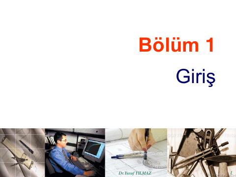
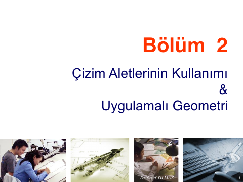
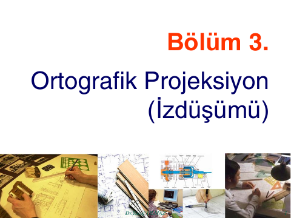
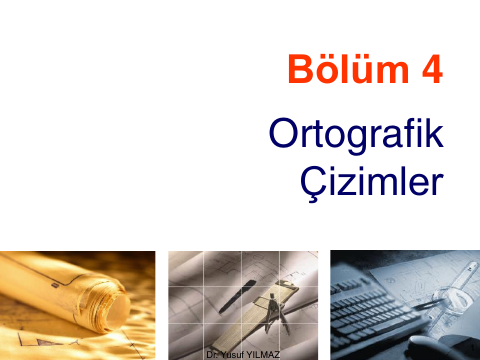
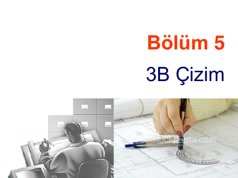
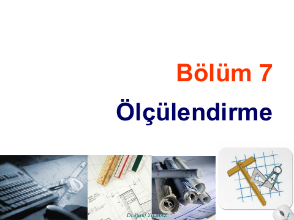
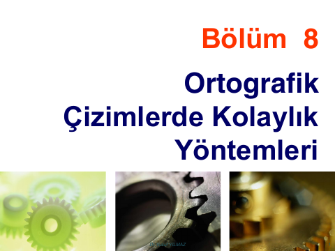
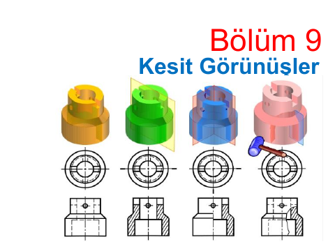

## 📚 Ders Materyalleri

  <a href="https://cdn.jsdelivr.net/gh/c4kar/ktunDepo@main/EEM/EEM-2/bilgisayar-destekli-teknik-resim/lms/01GirisTR.pdf" target="_blank" rel="noopener" class="materyal-thumb-link">
    

      
    

  </a>
  

    
01GirisTR

    

      PDF
      2.0 MB
    

  

  <a href="https://github.com/c4kar/ktunDepo/raw/main/EEM/EEM-2/bilgisayar-destekli-teknik-resim/lms/01GirisTR.pdf" class="materyal-download" target="_blank" rel="noopener">
    ↓ İndir
  </a>

  <a href="https://cdn.jsdelivr.net/gh/c4kar/ktunDepo@main/EEM/EEM-2/bilgisayar-destekli-teknik-resim/lms/02CizimAletlerininKullanimiveUyg.Gem.TR.pdf" target="_blank" rel="noopener" class="materyal-thumb-link">
    

      
    

  </a>
  

    
02CizimAletlerininKullanimiveUyg.Gem.TR

    

      PDF
      2.6 MB
    

  

  <a href="https://github.com/c4kar/ktunDepo/raw/main/EEM/EEM-2/bilgisayar-destekli-teknik-resim/lms/02CizimAletlerininKullanimiveUyg.Gem.TR.pdf" class="materyal-download" target="_blank" rel="noopener">
    ↓ İndir
  </a>

  <a href="https://cdn.jsdelivr.net/gh/c4kar/ktunDepo@main/EEM/EEM-2/bilgisayar-destekli-teknik-resim/lms/03OrtografikProjeksiyonTR.pdf" target="_blank" rel="noopener" class="materyal-thumb-link">
    

      
    

  </a>
  

    
03OrtografikProjeksiyonTR

    

      PDF
      1.4 MB
    

  

  <a href="https://github.com/c4kar/ktunDepo/raw/main/EEM/EEM-2/bilgisayar-destekli-teknik-resim/lms/03OrtografikProjeksiyonTR.pdf" class="materyal-download" target="_blank" rel="noopener">
    ↓ İndir
  </a>

  <a href="https://cdn.jsdelivr.net/gh/c4kar/ktunDepo@main/EEM/EEM-2/bilgisayar-destekli-teknik-resim/lms/04OrtografikCizimlerTR.pdf" target="_blank" rel="noopener" class="materyal-thumb-link">
    

      
    

  </a>
  

    
04OrtografikCizimlerTR

    

      PDF
      2.1 MB
    

  

  <a href="https://github.com/c4kar/ktunDepo/raw/main/EEM/EEM-2/bilgisayar-destekli-teknik-resim/lms/04OrtografikCizimlerTR.pdf" class="materyal-download" target="_blank" rel="noopener">
    ↓ İndir
  </a>

  <a href="https://cdn.jsdelivr.net/gh/c4kar/ktunDepo@main/EEM/EEM-2/bilgisayar-destekli-teknik-resim/lms/053BCizimTR.pdf" target="_blank" rel="noopener" class="materyal-thumb-link">
    

      
    

  </a>
  

    
053BCizimTR

    

      PDF
      899.3 KB
    

  

  <a href="https://github.com/c4kar/ktunDepo/raw/main/EEM/EEM-2/bilgisayar-destekli-teknik-resim/lms/053BCizimTR.pdf" class="materyal-download" target="_blank" rel="noopener">
    ↓ İndir
  </a>

  <a href="https://cdn.jsdelivr.net/gh/c4kar/ktunDepo@main/EEM/EEM-2/bilgisayar-destekli-teknik-resim/lms/06OrtografikResimOkumaTR.pdf" target="_blank" rel="noopener" class="materyal-thumb-link">
    

      
    

  </a>
  

    
06OrtografikResimOkumaTR

    

      PDF
      1.1 MB
    

  

  <a href="https://github.com/c4kar/ktunDepo/raw/main/EEM/EEM-2/bilgisayar-destekli-teknik-resim/lms/06OrtografikResimOkumaTR.pdf" class="materyal-download" target="_blank" rel="noopener">
    ↓ İndir
  </a>

  <a href="https://cdn.jsdelivr.net/gh/c4kar/ktunDepo@main/EEM/EEM-2/bilgisayar-destekli-teknik-resim/lms/07%C3%96lc%C3%BClendirmeTR.pdf" target="_blank" rel="noopener" class="materyal-thumb-link">
    

      
    

  </a>
  

    
07ÖlcülendirmeTR

    

      PDF
      995.4 KB
    

  

  <a href="https://github.com/c4kar/ktunDepo/raw/main/EEM/EEM-2/bilgisayar-destekli-teknik-resim/lms/07%C3%96lc%C3%BClendirmeTR.pdf" class="materyal-download" target="_blank" rel="noopener">
    ↓ İndir
  </a>

  <a href="https://cdn.jsdelivr.net/gh/c4kar/ktunDepo@main/EEM/EEM-2/bilgisayar-destekli-teknik-resim/lms/08Orth.CizimlerdeKolaylikYontemleriTR.pdf" target="_blank" rel="noopener" class="materyal-thumb-link">
    

      
    

  </a>
  

    
08Orth.CizimlerdeKolaylikYontemleriTR

    

      PDF
      1021.8 KB
    

  

  <a href="https://github.com/c4kar/ktunDepo/raw/main/EEM/EEM-2/bilgisayar-destekli-teknik-resim/lms/08Orth.CizimlerdeKolaylikYontemleriTR.pdf" class="materyal-download" target="_blank" rel="noopener">
    ↓ İndir
  </a>

  <a href="https://cdn.jsdelivr.net/gh/c4kar/ktunDepo@main/EEM/EEM-2/bilgisayar-destekli-teknik-resim/lms/09KesitlerTR.pdf" target="_blank" rel="noopener" class="materyal-thumb-link">
    

      
    

  </a>
  

    
09KesitlerTR

    

      PDF
      826.3 KB
    

  

  <a href="https://github.com/c4kar/ktunDepo/raw/main/EEM/EEM-2/bilgisayar-destekli-teknik-resim/lms/09KesitlerTR.pdf" class="materyal-download" target="_blank" rel="noopener">
    ↓ İndir
  </a>

  <a href="https://cdn.jsdelivr.net/gh/c4kar/ktunDepo@main/EEM/EEM-2/bilgisayar-destekli-teknik-resim/ornekler/Elektrik-%20Elektronik%20T.Resim%20Final%20S%C4%B1nav%C4%B1%20Soru%20Cevaplar%C4%B1%202025.pdf" target="_blank" rel="noopener" class="materyal-thumb-link">
    

      
    

  </a>
  

    
Elektrik- Elektronik T.Resim Final Sınavı Soru Cevapları 2025

    

      PDF
      171.6 KB
    

  

  <a href="https://github.com/c4kar/ktunDepo/raw/main/EEM/EEM-2/bilgisayar-destekli-teknik-resim/ornekler/Elektrik-%20Elektronik%20T.Resim%20Final%20S%C4%B1nav%C4%B1%20Soru%20Cevaplar%C4%B1%202025.pdf" class="materyal-download" target="_blank" rel="noopener">
    ↓ İndir
  </a>

  <a href="https://cdn.jsdelivr.net/gh/c4kar/ktunDepo@main/EEM/EEM-2/bilgisayar-destekli-teknik-resim/ornekler/Elektrik-%20Elektronik%20T.Resim%20Vize%20S%C4%B1nav%C4%B1%20%C3%87%C3%B6z%C3%BCmleri%202025.pdf" target="_blank" rel="noopener" class="materyal-thumb-link">
    

      
    

  </a>
  

    
Elektrik- Elektronik T.Resim Vize Sınavı Çözümleri 2025

    

      PDF
      222.5 KB
    

  

  <a href="https://github.com/c4kar/ktunDepo/raw/main/EEM/EEM-2/bilgisayar-destekli-teknik-resim/ornekler/Elektrik-%20Elektronik%20T.Resim%20Vize%20S%C4%B1nav%C4%B1%20%C3%87%C3%B6z%C3%BCmleri%202025.pdf" class="materyal-download" target="_blank" rel="noopener">
    ↓ İndir
  </a>

  <a href="https://cdn.jsdelivr.net/gh/c4kar/ktunDepo@main/EEM/EEM-2/bilgisayar-destekli-teknik-resim/ornekler/SolidWorks%20%C3%87al%C4%B1%C5%9Fma%20Sorular%C4%B1.pptx" target="_blank" rel="noopener" class="materyal-thumb-link">
    

      📽️
    

  </a>
  

    
SolidWorks Çalışma Soruları

    

      PPTX
      5.9 MB
    

  

  <a href="https://github.com/c4kar/ktunDepo/raw/main/EEM/EEM-2/bilgisayar-destekli-teknik-resim/ornekler/SolidWorks%20%C3%87al%C4%B1%C5%9Fma%20Sorular%C4%B1.pptx" class="materyal-download" target="_blank" rel="noopener">
    ↓ İndir
  </a>

  <a href="https://cdn.jsdelivr.net/gh/c4kar/ktunDepo@main/EEM/EEM-2/bilgisayar-destekli-teknik-resim/ornekler/TEKN%C4%B0K%20RES%C4%B0M%20S.%C3%87al%C4%B1%C5%9Fmas%C4%B1%2025%20-%201.docx" target="_blank" rel="noopener" class="materyal-thumb-link">
    

      📝
    

  </a>
  

    
TEKNİK RESİM S.Çalışması 25 - 1

    

      DOCX
      791.7 KB
    

  

  <a href="https://github.com/c4kar/ktunDepo/raw/main/EEM/EEM-2/bilgisayar-destekli-teknik-resim/ornekler/TEKN%C4%B0K%20RES%C4%B0M%20S.%C3%87al%C4%B1%C5%9Fmas%C4%B1%2025%20-%201.docx" class="materyal-download" target="_blank" rel="noopener">
    ↓ İndir
  </a>

  <a href="https://cdn.jsdelivr.net/gh/c4kar/ktunDepo@main/EEM/EEM-2/bilgisayar-destekli-teknik-resim/ornekler/TEKN%C4%B0K%20RES%C4%B0M%20S.%C3%87al%C4%B1%C5%9Fmas%C4%B1%2025%20-%202.docx" target="_blank" rel="noopener" class="materyal-thumb-link">
    

      📝
    

  </a>
  

    
TEKNİK RESİM S.Çalışması 25 - 2

    

      DOCX
      1.2 MB
    

  

  <a href="https://github.com/c4kar/ktunDepo/raw/main/EEM/EEM-2/bilgisayar-destekli-teknik-resim/ornekler/TEKN%C4%B0K%20RES%C4%B0M%20S.%C3%87al%C4%B1%C5%9Fmas%C4%B1%2025%20-%202.docx" class="materyal-download" target="_blank" rel="noopener">
    ↓ İndir
  </a>

