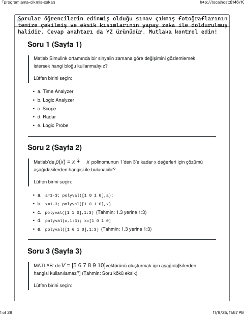
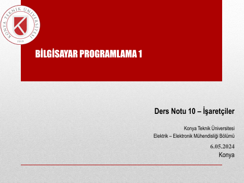
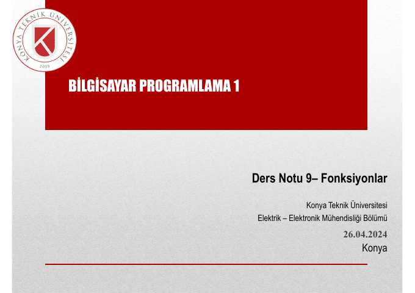
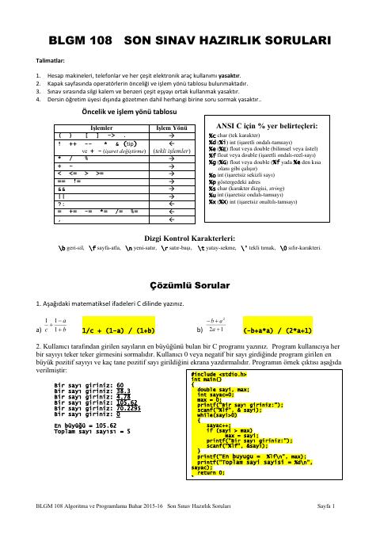

## 📚 Ders Materyalleri

  <a href="https://cdn.jsdelivr.net/gh/c4kar/ktunDepo@main/EEM/EEM-2/bilgisayar-programlama-1/cikmis/programlama-cikmis-cakar.md" target="_blank" rel="noopener" class="materyal-thumb-link">
    

      📎
    

  </a>
  

    
programlama-cikmis-cakar

    

      MD
      28.6 KB
    

  

  <a href="https://github.com/c4kar/ktunDepo/raw/main/EEM/EEM-2/bilgisayar-programlama-1/cikmis/programlama-cikmis-cakar.md" class="materyal-download" target="_blank" rel="noopener">
    ↓ İndir
  </a>

  <a href="https://cdn.jsdelivr.net/gh/c4kar/ktunDepo@main/EEM/EEM-2/bilgisayar-programlama-1/cikmis/programlama-cikmis.pdf" target="_blank" rel="noopener" class="materyal-thumb-link">
    

      
    

  </a>
  

    
programlama-cikmis

    

      PDF
      663.2 KB
    

  

  <a href="https://github.com/c4kar/ktunDepo/raw/main/EEM/EEM-2/bilgisayar-programlama-1/cikmis/programlama-cikmis.pdf" class="materyal-download" target="_blank" rel="noopener">
    ↓ İndir
  </a>

  <a href="https://cdn.jsdelivr.net/gh/c4kar/ktunDepo@main/EEM/EEM-2/bilgisayar-programlama-1/lms/1.%20Hafta.pdf" target="_blank" rel="noopener" class="materyal-thumb-link">
    

      
    

  </a>
  

    
1. Hafta

    

      PDF
      2.0 MB
    

  

  <a href="https://github.com/c4kar/ktunDepo/raw/main/EEM/EEM-2/bilgisayar-programlama-1/lms/1.%20Hafta.pdf" class="materyal-download" target="_blank" rel="noopener">
    ↓ İndir
  </a>

  <a href="https://cdn.jsdelivr.net/gh/c4kar/ktunDepo@main/EEM/EEM-2/bilgisayar-programlama-1/lms/10%28%C4%B0%C5%9Faret%C3%A7iler%29.pdf" target="_blank" rel="noopener" class="materyal-thumb-link">
    

      
    

  </a>
  

    
10(İşaretçiler)

    

      PDF
      1.5 MB
    

  

  <a href="https://github.com/c4kar/ktunDepo/raw/main/EEM/EEM-2/bilgisayar-programlama-1/lms/10%28%C4%B0%C5%9Faret%C3%A7iler%29.pdf" class="materyal-download" target="_blank" rel="noopener">
    ↓ İndir
  </a>

  <a href="https://cdn.jsdelivr.net/gh/c4kar/ktunDepo@main/EEM/EEM-2/bilgisayar-programlama-1/lms/11%28String%29.pdf" target="_blank" rel="noopener" class="materyal-thumb-link">
    

      
    

  </a>
  

    
11(String)

    

      PDF
      2.7 MB
    

  

  <a href="https://github.com/c4kar/ktunDepo/raw/main/EEM/EEM-2/bilgisayar-programlama-1/lms/11%28String%29.pdf" class="materyal-download" target="_blank" rel="noopener">
    ↓ İndir
  </a>

  <a href="https://cdn.jsdelivr.net/gh/c4kar/ktunDepo@main/EEM/EEM-2/bilgisayar-programlama-1/lms/12%28Matematiksel%20Fonksiyonlar%29.pdf" target="_blank" rel="noopener" class="materyal-thumb-link">
    

      
    

  </a>
  

    
12(Matematiksel Fonksiyonlar)

    

      PDF
      648.9 KB
    

  

  <a href="https://github.com/c4kar/ktunDepo/raw/main/EEM/EEM-2/bilgisayar-programlama-1/lms/12%28Matematiksel%20Fonksiyonlar%29.pdf" class="materyal-download" target="_blank" rel="noopener">
    ↓ İndir
  </a>

  <a href="https://cdn.jsdelivr.net/gh/c4kar/ktunDepo@main/EEM/EEM-2/bilgisayar-programlama-1/lms/13%28Dosya%20%C4%B0%C5%9Flemleri%29.pdf" target="_blank" rel="noopener" class="materyal-thumb-link">
    

      
    

  </a>
  

    
13(Dosya İşlemleri)

    

      PDF
      644.4 KB
    

  

  <a href="https://github.com/c4kar/ktunDepo/raw/main/EEM/EEM-2/bilgisayar-programlama-1/lms/13%28Dosya%20%C4%B0%C5%9Flemleri%29.pdf" class="materyal-download" target="_blank" rel="noopener">
    ↓ İndir
  </a>

  <a href="https://cdn.jsdelivr.net/gh/c4kar/ktunDepo@main/EEM/EEM-2/bilgisayar-programlama-1/lms/2.%20Hafta.pdf" target="_blank" rel="noopener" class="materyal-thumb-link">
    

      
    

  </a>
  

    
2. Hafta

    

      PDF
      2.1 MB
    

  

  <a href="https://github.com/c4kar/ktunDepo/raw/main/EEM/EEM-2/bilgisayar-programlama-1/lms/2.%20Hafta.pdf" class="materyal-download" target="_blank" rel="noopener">
    ↓ İndir
  </a>

  <a href="https://cdn.jsdelivr.net/gh/c4kar/ktunDepo@main/EEM/EEM-2/bilgisayar-programlama-1/lms/3.%20Hafta.pdf" target="_blank" rel="noopener" class="materyal-thumb-link">
    

      
    

  </a>
  

    
3. Hafta

    

      PDF
      1.6 MB
    

  

  <a href="https://github.com/c4kar/ktunDepo/raw/main/EEM/EEM-2/bilgisayar-programlama-1/lms/3.%20Hafta.pdf" class="materyal-download" target="_blank" rel="noopener">
    ↓ İndir
  </a>

  <a href="https://cdn.jsdelivr.net/gh/c4kar/ktunDepo@main/EEM/EEM-2/bilgisayar-programlama-1/lms/4.%20Hafta.pdf" target="_blank" rel="noopener" class="materyal-thumb-link">
    

      
    

  </a>
  

    
4. Hafta

    

      PDF
      2.0 MB
    

  

  <a href="https://github.com/c4kar/ktunDepo/raw/main/EEM/EEM-2/bilgisayar-programlama-1/lms/4.%20Hafta.pdf" class="materyal-download" target="_blank" rel="noopener">
    ↓ İndir
  </a>

  <a href="https://cdn.jsdelivr.net/gh/c4kar/ktunDepo@main/EEM/EEM-2/bilgisayar-programlama-1/lms/5.%20Hafta.pdf" target="_blank" rel="noopener" class="materyal-thumb-link">
    

      
    

  </a>
  

    
5. Hafta

    

      PDF
      1.9 MB
    

  

  <a href="https://github.com/c4kar/ktunDepo/raw/main/EEM/EEM-2/bilgisayar-programlama-1/lms/5.%20Hafta.pdf" class="materyal-download" target="_blank" rel="noopener">
    ↓ İndir
  </a>

  <a href="https://cdn.jsdelivr.net/gh/c4kar/ktunDepo@main/EEM/EEM-2/bilgisayar-programlama-1/lms/6.%20Hafta.pdf" target="_blank" rel="noopener" class="materyal-thumb-link">
    

      
    

  </a>
  

    
6. Hafta

    

      PDF
      1.6 MB
    

  

  <a href="https://github.com/c4kar/ktunDepo/raw/main/EEM/EEM-2/bilgisayar-programlama-1/lms/6.%20Hafta.pdf" class="materyal-download" target="_blank" rel="noopener">
    ↓ İndir
  </a>

  <a href="https://cdn.jsdelivr.net/gh/c4kar/ktunDepo@main/EEM/EEM-2/bilgisayar-programlama-1/lms/7.%20Hafta.pdf" target="_blank" rel="noopener" class="materyal-thumb-link">
    

      
    

  </a>
  

    
7. Hafta

    

      PDF
      763.6 KB
    

  

  <a href="https://github.com/c4kar/ktunDepo/raw/main/EEM/EEM-2/bilgisayar-programlama-1/lms/7.%20Hafta.pdf" class="materyal-download" target="_blank" rel="noopener">
    ↓ İndir
  </a>

  <a href="https://cdn.jsdelivr.net/gh/c4kar/ktunDepo@main/EEM/EEM-2/bilgisayar-programlama-1/lms/7.5%20c-dongu-ornek.pdf" target="_blank" rel="noopener" class="materyal-thumb-link">
    

      
    

  </a>
  

    
7.5 c-dongu-ornek

    

      PDF
      473.4 KB
    

  

  <a href="https://github.com/c4kar/ktunDepo/raw/main/EEM/EEM-2/bilgisayar-programlama-1/lms/7.5%20c-dongu-ornek.pdf" class="materyal-download" target="_blank" rel="noopener">
    ↓ İndir
  </a>

  <a href="https://cdn.jsdelivr.net/gh/c4kar/ktunDepo@main/EEM/EEM-2/bilgisayar-programlama-1/lms/8%28S%C4%B1ralama%20ve%20Arama%29.pdf" target="_blank" rel="noopener" class="materyal-thumb-link">
    

      
    

  </a>
  

    
8(Sıralama ve Arama)

    

      PDF
      1.0 MB
    

  

  <a href="https://github.com/c4kar/ktunDepo/raw/main/EEM/EEM-2/bilgisayar-programlama-1/lms/8%28S%C4%B1ralama%20ve%20Arama%29.pdf" class="materyal-download" target="_blank" rel="noopener">
    ↓ İndir
  </a>

  <a href="https://cdn.jsdelivr.net/gh/c4kar/ktunDepo@main/EEM/EEM-2/bilgisayar-programlama-1/lms/9%28Fonksiyonlar%29.pdf" target="_blank" rel="noopener" class="materyal-thumb-link">
    

      
    

  </a>
  

    
9(Fonksiyonlar)

    

      PDF
      2.9 MB
    

  

  <a href="https://github.com/c4kar/ktunDepo/raw/main/EEM/EEM-2/bilgisayar-programlama-1/lms/9%28Fonksiyonlar%29.pdf" class="materyal-download" target="_blank" rel="noopener">
    ↓ İndir
  </a>

  <a href="https://cdn.jsdelivr.net/gh/c4kar/ktunDepo@main/EEM/EEM-2/bilgisayar-programlama-1/sorular/FinalCalisma.pdf" target="_blank" rel="noopener" class="materyal-thumb-link">
    

      
    

  </a>
  

    
FinalCalisma

    

      PDF
      372.7 KB
    

  

  <a href="https://github.com/c4kar/ktunDepo/raw/main/EEM/EEM-2/bilgisayar-programlama-1/sorular/FinalCalisma.pdf" class="materyal-download" target="_blank" rel="noopener">
    ↓ İndir
  </a>

  <a href="https://cdn.jsdelivr.net/gh/c4kar/ktunDepo@main/EEM/EEM-2/bilgisayar-programlama-1/sorular/%C3%A7%C4%B1km%C4%B1%C5%9F%20%281%29.png" target="_blank" rel="noopener" class="materyal-thumb-link">
    

      
    

  </a>
  

    
çıkmış (1)

    

      PNG
      139.1 KB
    

  

  <a href="https://github.com/c4kar/ktunDepo/raw/main/EEM/EEM-2/bilgisayar-programlama-1/sorular/%C3%A7%C4%B1km%C4%B1%C5%9F%20%281%29.png" class="materyal-download" target="_blank" rel="noopener">
    ↓ İndir
  </a>

  <a href="https://cdn.jsdelivr.net/gh/c4kar/ktunDepo@main/EEM/EEM-2/bilgisayar-programlama-1/sorular/%C3%A7%C4%B1km%C4%B1%C5%9F%20%282%29.png" target="_blank" rel="noopener" class="materyal-thumb-link">
    

      
    

  </a>
  

    
çıkmış (2)

    

      PNG
      640.8 KB
    

  

  <a href="https://github.com/c4kar/ktunDepo/raw/main/EEM/EEM-2/bilgisayar-programlama-1/sorular/%C3%A7%C4%B1km%C4%B1%C5%9F%20%282%29.png" class="materyal-download" target="_blank" rel="noopener">
    ↓ İndir
  </a>

  <a href="https://cdn.jsdelivr.net/gh/c4kar/ktunDepo@main/EEM/EEM-2/bilgisayar-programlama-1/sorular/%C3%A7%C4%B1km%C4%B1%C5%9F%20%283%29.png" target="_blank" rel="noopener" class="materyal-thumb-link">
    

      
    

  </a>
  

    
çıkmış (3)

    

      PNG
      469.2 KB
    

  

  <a href="https://github.com/c4kar/ktunDepo/raw/main/EEM/EEM-2/bilgisayar-programlama-1/sorular/%C3%A7%C4%B1km%C4%B1%C5%9F%20%283%29.png" class="materyal-download" target="_blank" rel="noopener">
    ↓ İndir
  </a>

  <a href="https://cdn.jsdelivr.net/gh/c4kar/ktunDepo@main/EEM/EEM-2/bilgisayar-programlama-1/sorular/%C3%A7%C4%B1km%C4%B1%C5%9F%20%284%29.png" target="_blank" rel="noopener" class="materyal-thumb-link">
    

      
    

  </a>
  

    
çıkmış (4)

    

      PNG
      576.8 KB
    

  

  <a href="https://github.com/c4kar/ktunDepo/raw/main/EEM/EEM-2/bilgisayar-programlama-1/sorular/%C3%A7%C4%B1km%C4%B1%C5%9F%20%284%29.png" class="materyal-download" target="_blank" rel="noopener">
    ↓ İndir
  </a>

  <a href="https://cdn.jsdelivr.net/gh/c4kar/ktunDepo@main/EEM/EEM-2/bilgisayar-programlama-1/sorular/%C3%A7%C4%B1km%C4%B1%C5%9F%20%285%29.png" target="_blank" rel="noopener" class="materyal-thumb-link">
    

      
    

  </a>
  

    
çıkmış (5)

    

      PNG
      628.3 KB
    

  

  <a href="https://github.com/c4kar/ktunDepo/raw/main/EEM/EEM-2/bilgisayar-programlama-1/sorular/%C3%A7%C4%B1km%C4%B1%C5%9F%20%285%29.png" class="materyal-download" target="_blank" rel="noopener">
    ↓ İndir
  </a>

  <a href="https://cdn.jsdelivr.net/gh/c4kar/ktunDepo@main/EEM/EEM-2/bilgisayar-programlama-1/sorular/%C3%A7%C4%B1km%C4%B1%C5%9F%20%286%29.png" target="_blank" rel="noopener" class="materyal-thumb-link">
    

      
    

  </a>
  

    
çıkmış (6)

    

      PNG
      497.9 KB
    

  

  <a href="https://github.com/c4kar/ktunDepo/raw/main/EEM/EEM-2/bilgisayar-programlama-1/sorular/%C3%A7%C4%B1km%C4%B1%C5%9F%20%286%29.png" class="materyal-download" target="_blank" rel="noopener">
    ↓ İndir
  </a>

