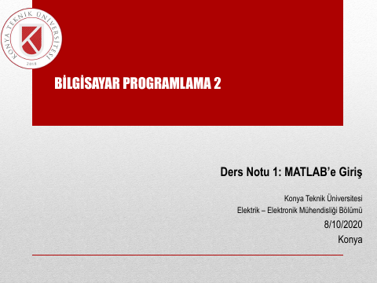
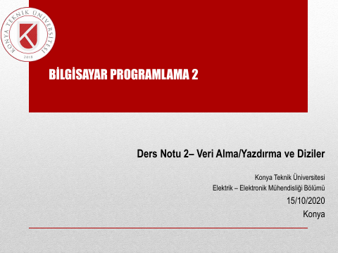

## 📚 Ders Materyalleri

  <a href="https://cdn.jsdelivr.net/gh/c4kar/ktunDepo@main/EEM/EEM-2/bilgisayar-programlama-2/1.pdf" target="_blank" rel="noopener" class="materyal-thumb-link">
    

      
    

  </a>
  

    
1

    

      PDF
      721.4 KB
    

  

  <a href="https://github.com/c4kar/ktunDepo/raw/main/EEM/EEM-2/bilgisayar-programlama-2/1.pdf" class="materyal-download" target="_blank" rel="noopener">
    ↓ İndir
  </a>

  <a href="https://cdn.jsdelivr.net/gh/c4kar/ktunDepo@main/EEM/EEM-2/bilgisayar-programlama-2/2.pdf" target="_blank" rel="noopener" class="materyal-thumb-link">
    

      
    

  </a>
  

    
2

    

      PDF
      1.1 MB
    

  

  <a href="https://github.com/c4kar/ktunDepo/raw/main/EEM/EEM-2/bilgisayar-programlama-2/2.pdf" class="materyal-download" target="_blank" rel="noopener">
    ↓ İndir
  </a>

  <a href="https://cdn.jsdelivr.net/gh/c4kar/ktunDepo@main/EEM/EEM-2/bilgisayar-programlama-2/3.pdf" target="_blank" rel="noopener" class="materyal-thumb-link">
    

      
    

  </a>
  

    
3

    

      PDF
      1.1 MB
    

  

  <a href="https://github.com/c4kar/ktunDepo/raw/main/EEM/EEM-2/bilgisayar-programlama-2/3.pdf" class="materyal-download" target="_blank" rel="noopener">
    ↓ İndir
  </a>

  <a href="https://cdn.jsdelivr.net/gh/c4kar/ktunDepo@main/EEM/EEM-2/bilgisayar-programlama-2/4.pdf" target="_blank" rel="noopener" class="materyal-thumb-link">
    

      
    

  </a>
  

    
4

    

      PDF
      998.6 KB
    

  

  <a href="https://github.com/c4kar/ktunDepo/raw/main/EEM/EEM-2/bilgisayar-programlama-2/4.pdf" class="materyal-download" target="_blank" rel="noopener">
    ↓ İndir
  </a>

  <a href="https://cdn.jsdelivr.net/gh/c4kar/ktunDepo@main/EEM/EEM-2/bilgisayar-programlama-2/Sunum%20ders%20notu10.pdf" target="_blank" rel="noopener" class="materyal-thumb-link">
    

      
    

  </a>
  

    
Sunum ders notu10

    

      PDF
      1.6 MB
    

  

  <a href="https://github.com/c4kar/ktunDepo/raw/main/EEM/EEM-2/bilgisayar-programlama-2/Sunum%20ders%20notu10.pdf" class="materyal-download" target="_blank" rel="noopener">
    ↓ İndir
  </a>

  <a href="https://cdn.jsdelivr.net/gh/c4kar/ktunDepo@main/EEM/EEM-2/bilgisayar-programlama-2/Sunum%20ders%20notu11.pdf" target="_blank" rel="noopener" class="materyal-thumb-link">
    

      
    

  </a>
  

    
Sunum ders notu11

    

      PDF
      896.5 KB
    

  

  <a href="https://github.com/c4kar/ktunDepo/raw/main/EEM/EEM-2/bilgisayar-programlama-2/Sunum%20ders%20notu11.pdf" class="materyal-download" target="_blank" rel="noopener">
    ↓ İndir
  </a>

  <a href="https://cdn.jsdelivr.net/gh/c4kar/ktunDepo@main/EEM/EEM-2/bilgisayar-programlama-2/Sunum%20ders%20notu12.pdf" target="_blank" rel="noopener" class="materyal-thumb-link">
    

      
    

  </a>
  

    
Sunum ders notu12

    

      PDF
      970.5 KB
    

  

  <a href="https://github.com/c4kar/ktunDepo/raw/main/EEM/EEM-2/bilgisayar-programlama-2/Sunum%20ders%20notu12.pdf" class="materyal-download" target="_blank" rel="noopener">
    ↓ İndir
  </a>

  <a href="https://cdn.jsdelivr.net/gh/c4kar/ktunDepo@main/EEM/EEM-2/bilgisayar-programlama-2/Sunum%20ders%20notu13.pdf" target="_blank" rel="noopener" class="materyal-thumb-link">
    

      
    

  </a>
  

    
Sunum ders notu13

    

      PDF
      862.0 KB
    

  

  <a href="https://github.com/c4kar/ktunDepo/raw/main/EEM/EEM-2/bilgisayar-programlama-2/Sunum%20ders%20notu13.pdf" class="materyal-download" target="_blank" rel="noopener">
    ↓ İndir
  </a>

  <a href="https://cdn.jsdelivr.net/gh/c4kar/ktunDepo@main/EEM/EEM-2/bilgisayar-programlama-2/Sunum%20ders%20notu4%20Fonksiyon%20Tan%C4%B1mlama.pdf" target="_blank" rel="noopener" class="materyal-thumb-link">
    

      
    

  </a>
  

    
Sunum ders notu4 Fonksiyon Tanımlama

    

      PDF
      316.3 KB
    

  

  <a href="https://github.com/c4kar/ktunDepo/raw/main/EEM/EEM-2/bilgisayar-programlama-2/Sunum%20ders%20notu4%20Fonksiyon%20Tan%C4%B1mlama.pdf" class="materyal-download" target="_blank" rel="noopener">
    ↓ İndir
  </a>

  <a href="https://cdn.jsdelivr.net/gh/c4kar/ktunDepo@main/EEM/EEM-2/bilgisayar-programlama-2/Sunum%20ders%20notu5.pdf" target="_blank" rel="noopener" class="materyal-thumb-link">
    

      
    

  </a>
  

    
Sunum ders notu5

    

      PDF
      952.1 KB
    

  

  <a href="https://github.com/c4kar/ktunDepo/raw/main/EEM/EEM-2/bilgisayar-programlama-2/Sunum%20ders%20notu5.pdf" class="materyal-download" target="_blank" rel="noopener">
    ↓ İndir
  </a>

  <a href="https://cdn.jsdelivr.net/gh/c4kar/ktunDepo@main/EEM/EEM-2/bilgisayar-programlama-2/Sunum%20ders%20notu6.pdf" target="_blank" rel="noopener" class="materyal-thumb-link">
    

      
    

  </a>
  

    
Sunum ders notu6

    

      PDF
      1.5 MB
    

  

  <a href="https://github.com/c4kar/ktunDepo/raw/main/EEM/EEM-2/bilgisayar-programlama-2/Sunum%20ders%20notu6.pdf" class="materyal-download" target="_blank" rel="noopener">
    ↓ İndir
  </a>

  <a href="https://cdn.jsdelivr.net/gh/c4kar/ktunDepo@main/EEM/EEM-2/bilgisayar-programlama-2/Sunum%20ders%20notu7.pdf" target="_blank" rel="noopener" class="materyal-thumb-link">
    

      
    

  </a>
  

    
Sunum ders notu7

    

      PDF
      1.3 MB
    

  

  <a href="https://github.com/c4kar/ktunDepo/raw/main/EEM/EEM-2/bilgisayar-programlama-2/Sunum%20ders%20notu7.pdf" class="materyal-download" target="_blank" rel="noopener">
    ↓ İndir
  </a>

  <a href="https://cdn.jsdelivr.net/gh/c4kar/ktunDepo@main/EEM/EEM-2/bilgisayar-programlama-2/Sunum%20ders%20notu8.pdf" target="_blank" rel="noopener" class="materyal-thumb-link">
    

      
    

  </a>
  

    
Sunum ders notu8

    

      PDF
      1.3 MB
    

  

  <a href="https://github.com/c4kar/ktunDepo/raw/main/EEM/EEM-2/bilgisayar-programlama-2/Sunum%20ders%20notu8.pdf" class="materyal-download" target="_blank" rel="noopener">
    ↓ İndir
  </a>

  <a href="https://cdn.jsdelivr.net/gh/c4kar/ktunDepo@main/EEM/EEM-2/bilgisayar-programlama-2/Sunum%20ders%20notu9.pdf" target="_blank" rel="noopener" class="materyal-thumb-link">
    

      
    

  </a>
  

    
Sunum ders notu9

    

      PDF
      1.6 MB
    

  

  <a href="https://github.com/c4kar/ktunDepo/raw/main/EEM/EEM-2/bilgisayar-programlama-2/Sunum%20ders%20notu9.pdf" class="materyal-download" target="_blank" rel="noopener">
    ↓ İndir
  </a>

