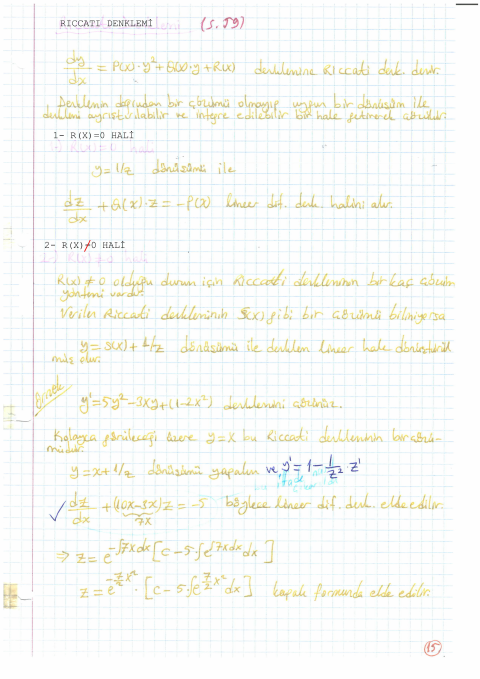

## 📚 Ders Materyalleri

  <a href="https://cdn.jsdelivr.net/gh/c4kar/ktunDepo@main/EEM/EEM-2/diferansiyel-denklemler/DifDenk%2027%20Kas%C4%B1m%20Ders.pdf" target="_blank" rel="noopener" class="materyal-thumb-link">
    

      
    

  </a>
  

    
DifDenk 27 Kasım Ders

    

      PDF
      282.5 KB
    

  

  <a href="https://github.com/c4kar/ktunDepo/raw/main/EEM/EEM-2/diferansiyel-denklemler/DifDenk%2027%20Kas%C4%B1m%20Ders.pdf" class="materyal-download" target="_blank" rel="noopener">
    ↓ İndir
  </a>

  <a href="https://github.com/c4kar/ktunDepo/blob/main/EEM/EEM-2/diferansiyel-denklemler/DifDenk.%20Toplu%20Ders%20Notu.pdf" target="_blank" rel="noopener" class="materyal-thumb-link">
    

      
    

  </a>
  

    
DifDenk. Toplu Ders Notu

    

      PDF
      54.1 MB
    

  

  <a href="https://github.com/c4kar/ktunDepo/raw/main/EEM/EEM-2/diferansiyel-denklemler/DifDenk.%20Toplu%20Ders%20Notu.pdf" class="materyal-download" target="_blank" rel="noopener">
    ↓ İndir
  </a>

  <a href="https://cdn.jsdelivr.net/gh/c4kar/ktunDepo@main/EEM/EEM-2/diferansiyel-denklemler/ders_notu_parca_1.pdf" target="_blank" rel="noopener" class="materyal-thumb-link">
    

      
    

  </a>
  

    
ders_notu_parca_1

    

      PDF
      10.8 MB
    

  

  <a href="https://github.com/c4kar/ktunDepo/raw/main/EEM/EEM-2/diferansiyel-denklemler/ders_notu_parca_1.pdf" class="materyal-download" target="_blank" rel="noopener">
    ↓ İndir
  </a>

  <a href="https://cdn.jsdelivr.net/gh/c4kar/ktunDepo@main/EEM/EEM-2/diferansiyel-denklemler/ders_notu_parca_2.pdf" target="_blank" rel="noopener" class="materyal-thumb-link">
    

      
    

  </a>
  

    
ders_notu_parca_2

    

      PDF
      10.8 MB
    

  

  <a href="https://github.com/c4kar/ktunDepo/raw/main/EEM/EEM-2/diferansiyel-denklemler/ders_notu_parca_2.pdf" class="materyal-download" target="_blank" rel="noopener">
    ↓ İndir
  </a>

  <a href="https://cdn.jsdelivr.net/gh/c4kar/ktunDepo@main/EEM/EEM-2/diferansiyel-denklemler/ders_notu_parca_3.pdf" target="_blank" rel="noopener" class="materyal-thumb-link">
    

      
    

  </a>
  

    
ders_notu_parca_3

    

      PDF
      11.6 MB
    

  

  <a href="https://github.com/c4kar/ktunDepo/raw/main/EEM/EEM-2/diferansiyel-denklemler/ders_notu_parca_3.pdf" class="materyal-download" target="_blank" rel="noopener">
    ↓ İndir
  </a>

  <a href="https://cdn.jsdelivr.net/gh/c4kar/ktunDepo@main/EEM/EEM-2/diferansiyel-denklemler/ders_notu_parca_4.pdf" target="_blank" rel="noopener" class="materyal-thumb-link">
    

      
    

  </a>
  

    
ders_notu_parca_4

    

      PDF
      10.1 MB
    

  

  <a href="https://github.com/c4kar/ktunDepo/raw/main/EEM/EEM-2/diferansiyel-denklemler/ders_notu_parca_4.pdf" class="materyal-download" target="_blank" rel="noopener">
    ↓ İndir
  </a>

  <a href="https://cdn.jsdelivr.net/gh/c4kar/ktunDepo@main/EEM/EEM-2/diferansiyel-denklemler/ders_notu_parca_5.pdf" target="_blank" rel="noopener" class="materyal-thumb-link">
    

      
    

  </a>
  

    
ders_notu_parca_5

    

      PDF
      10.9 MB
    

  

  <a href="https://github.com/c4kar/ktunDepo/raw/main/EEM/EEM-2/diferansiyel-denklemler/ders_notu_parca_5.pdf" class="materyal-download" target="_blank" rel="noopener">
    ↓ İndir
  </a>

