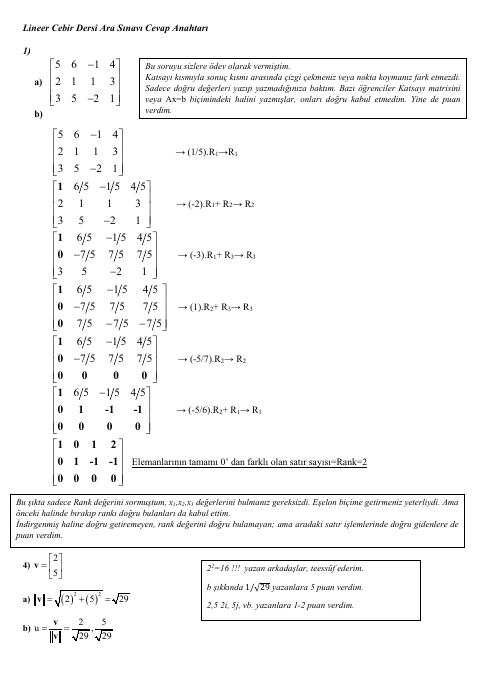
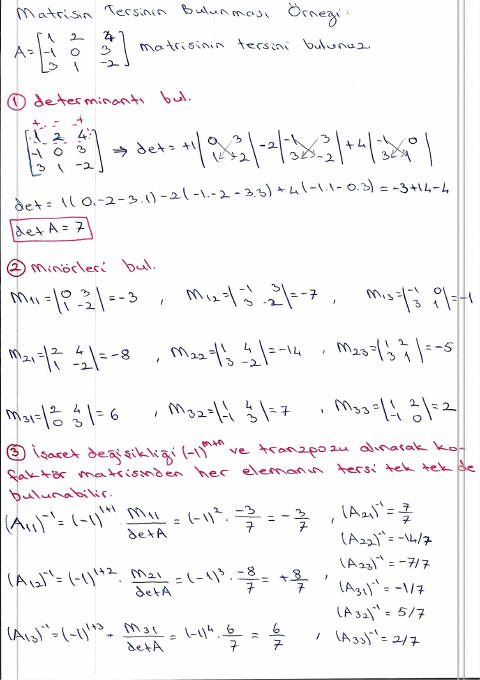

## 📚 Ders Materyalleri

  <a href="https://cdn.jsdelivr.net/gh/c4kar/ktunDepo@main/EEM/EEM-2/lineer-cebir/0%20%C3%96devler.pdf" target="_blank" rel="noopener" class="materyal-thumb-link">
    

      
    

  </a>
  

    
0 Ödevler

    

      PDF
      151.4 KB
    

  

  <a href="https://github.com/c4kar/ktunDepo/raw/main/EEM/EEM-2/lineer-cebir/0%20%C3%96devler.pdf" class="materyal-download" target="_blank" rel="noopener">
    ↓ İndir
  </a>

  <a href="https://cdn.jsdelivr.net/gh/c4kar/ktunDepo@main/EEM/EEM-2/lineer-cebir/1-%2019MartDersNotu-1-Matrisler1.pdf" target="_blank" rel="noopener" class="materyal-thumb-link">
    

      
    

  </a>
  

    
1- 19MartDersNotu-1-Matrisler1

    

      PDF
      319.4 KB
    

  

  <a href="https://github.com/c4kar/ktunDepo/raw/main/EEM/EEM-2/lineer-cebir/1-%2019MartDersNotu-1-Matrisler1.pdf" class="materyal-download" target="_blank" rel="noopener">
    ↓ İndir
  </a>

  <a href="https://cdn.jsdelivr.net/gh/c4kar/ktunDepo@main/EEM/EEM-2/lineer-cebir/2-Vize2024-2025CevapAnahtari.pdf" target="_blank" rel="noopener" class="materyal-thumb-link">
    

      
    

  </a>
  

    
2-Vize2024-2025CevapAnahtari

    

      PDF
      320.1 KB
    

  

  <a href="https://github.com/c4kar/ktunDepo/raw/main/EEM/EEM-2/lineer-cebir/2-Vize2024-2025CevapAnahtari.pdf" class="materyal-download" target="_blank" rel="noopener">
    ↓ İndir
  </a>

  <a href="https://cdn.jsdelivr.net/gh/c4kar/ktunDepo@main/EEM/EEM-2/lineer-cebir/3-%209NisanDersNotu-Matrisler2.pdf" target="_blank" rel="noopener" class="materyal-thumb-link">
    

      
    

  </a>
  

    
3- 9NisanDersNotu-Matrisler2

    

      PDF
      276.5 KB
    

  

  <a href="https://github.com/c4kar/ktunDepo/raw/main/EEM/EEM-2/lineer-cebir/3-%209NisanDersNotu-Matrisler2.pdf" class="materyal-download" target="_blank" rel="noopener">
    ↓ İndir
  </a>

  <a href="https://cdn.jsdelivr.net/gh/c4kar/ktunDepo@main/EEM/EEM-2/lineer-cebir/4-%2016NisanDersNotu-Determinantlar-LMS.pdf" target="_blank" rel="noopener" class="materyal-thumb-link">
    

      
    

  </a>
  

    
4- 16NisanDersNotu-Determinantlar-LMS

    

      PDF
      440.7 KB
    

  

  <a href="https://github.com/c4kar/ktunDepo/raw/main/EEM/EEM-2/lineer-cebir/4-%2016NisanDersNotu-Determinantlar-LMS.pdf" class="materyal-download" target="_blank" rel="noopener">
    ↓ İndir
  </a>

  <a href="https://cdn.jsdelivr.net/gh/c4kar/ktunDepo@main/EEM/EEM-2/lineer-cebir/EkOrnek.pdf" target="_blank" rel="noopener" class="materyal-thumb-link">
    

      
    

  </a>
  

    
EkOrnek

    

      PDF
      732.0 KB
    

  

  <a href="https://github.com/c4kar/ktunDepo/raw/main/EEM/EEM-2/lineer-cebir/EkOrnek.pdf" class="materyal-download" target="_blank" rel="noopener">
    ↓ İndir
  </a>

  <a href="https://cdn.jsdelivr.net/gh/c4kar/ktunDepo@main/EEM/EEM-2/lineer-cebir/Ek%C3%96rnekler-1.pdf" target="_blank" rel="noopener" class="materyal-thumb-link">
    

      
    

  </a>
  

    
EkÖrnekler-1

    

      PDF
      1.2 MB
    

  

  <a href="https://github.com/c4kar/ktunDepo/raw/main/EEM/EEM-2/lineer-cebir/Ek%C3%96rnekler-1.pdf" class="materyal-download" target="_blank" rel="noopener">
    ↓ İndir
  </a>

  <a href="https://cdn.jsdelivr.net/gh/c4kar/ktunDepo@main/EEM/EEM-2/lineer-cebir/Ek%C3%96rnekler-2.pdf.pdf" target="_blank" rel="noopener" class="materyal-thumb-link">
    

      
    

  </a>
  

    
EkÖrnekler-2.pdf

    

      PDF
      125.7 KB
    

  

  <a href="https://github.com/c4kar/ktunDepo/raw/main/EEM/EEM-2/lineer-cebir/Ek%C3%96rnekler-2.pdf.pdf" class="materyal-download" target="_blank" rel="noopener">
    ↓ İndir
  </a>

  <a href="https://cdn.jsdelivr.net/gh/c4kar/ktunDepo@main/EEM/EEM-2/lineer-cebir/ornek-soru/BUders%20Bo%C4%9Fazi%C3%A7iliden%20%C3%96zel%20Ders%20-%20Lineer%20Cebir%20Ek%20Matris%20%28Adjoint%20Matrix%29%20%28www.buders.com%29%20%5BR0NibwbtJJ0%20-%201474x900%20-%206m09s%5D.png" target="_blank" rel="noopener" class="materyal-thumb-link">
    

      
    

  </a>
  

    
BUders Boğaziçiliden Özel Ders - Lineer Cebir Ek Matris (Adjoint Matrix) (www.buders.com) [R0NibwbtJJ0 - 1474x900 - 6m09s]

    

      PNG
      489.7 KB
    

  

  <a href="https://github.com/c4kar/ktunDepo/raw/main/EEM/EEM-2/lineer-cebir/ornek-soru/BUders%20Bo%C4%9Fazi%C3%A7iliden%20%C3%96zel%20Ders%20-%20Lineer%20Cebir%20Ek%20Matris%20%28Adjoint%20Matrix%29%20%28www.buders.com%29%20%5BR0NibwbtJJ0%20-%201474x900%20-%206m09s%5D.png" class="materyal-download" target="_blank" rel="noopener">
    ↓ İndir
  </a>

  <a href="https://cdn.jsdelivr.net/gh/c4kar/ktunDepo@main/EEM/EEM-2/lineer-cebir/ornek-soru/BUders%20Bo%C4%9Fazi%C3%A7iliden%20%C3%96zel%20Ders%20-%20Lineer%20Cebir%20Ek%20Matris%20%28Adjoint%20Matrix%29%20%28www.buders.com%29%20%5BR0NibwbtJJ0%20-%201474x900%20-%206m44s%5D.png" target="_blank" rel="noopener" class="materyal-thumb-link">
    

      
    

  </a>
  

    
BUders Boğaziçiliden Özel Ders - Lineer Cebir Ek Matris (Adjoint Matrix) (www.buders.com) [R0NibwbtJJ0 - 1474x900 - 6m44s]

    

      PNG
      439.4 KB
    

  

  <a href="https://github.com/c4kar/ktunDepo/raw/main/EEM/EEM-2/lineer-cebir/ornek-soru/BUders%20Bo%C4%9Fazi%C3%A7iliden%20%C3%96zel%20Ders%20-%20Lineer%20Cebir%20Ek%20Matris%20%28Adjoint%20Matrix%29%20%28www.buders.com%29%20%5BR0NibwbtJJ0%20-%201474x900%20-%206m44s%5D.png" class="materyal-download" target="_blank" rel="noopener">
    ↓ İndir
  </a>

  <a href="https://cdn.jsdelivr.net/gh/c4kar/ktunDepo@main/EEM/EEM-2/lineer-cebir/ornek-soru/Jeffrey%20Chasnov%20-%20Permutation%20matrices%20Lecture%209%20Matrix%20Algebra%20for%20Engineers%20%5Bd7AovBKeNMI%20-%201216x684%20-%205m55s%5D.png" target="_blank" rel="noopener" class="materyal-thumb-link">
    

      
    

  </a>
  

    
Jeffrey Chasnov - Permutation matrices Lecture 9 Matrix Algebra for Engineers [d7AovBKeNMI - 1216x684 - 5m55s]

    

      PNG
      754.3 KB
    

  

  <a href="https://github.com/c4kar/ktunDepo/raw/main/EEM/EEM-2/lineer-cebir/ornek-soru/Jeffrey%20Chasnov%20-%20Permutation%20matrices%20Lecture%209%20Matrix%20Algebra%20for%20Engineers%20%5Bd7AovBKeNMI%20-%201216x684%20-%205m55s%5D.png" class="materyal-download" target="_blank" rel="noopener">
    ↓ İndir
  </a>

  <a href="https://cdn.jsdelivr.net/gh/c4kar/ktunDepo@main/EEM/EEM-2/lineer-cebir/ornek-soru/Khan%20Academy%20-%20Inverting%203x3%20part%201%20Calculating%20matrix%20of%20minors%20and%20cofactor%20matrix%20Precalculus%20Khan%20Academy%20%5BxZBbfLLfVV4%20-%201600x900%20-%208m43s%5D.png" target="_blank" rel="noopener" class="materyal-thumb-link">
    

      
    

  </a>
  

    
Khan Academy - Inverting 3x3 part 1 Calculating matrix of minors and cofactor matrix Precalculus Khan Academy [xZBbfLLfVV4 - 1600x900 - 8m43s]

    

      PNG
      298.8 KB
    

  

  <a href="https://github.com/c4kar/ktunDepo/raw/main/EEM/EEM-2/lineer-cebir/ornek-soru/Khan%20Academy%20-%20Inverting%203x3%20part%201%20Calculating%20matrix%20of%20minors%20and%20cofactor%20matrix%20Precalculus%20Khan%20Academy%20%5BxZBbfLLfVV4%20-%201600x900%20-%208m43s%5D.png" class="materyal-download" target="_blank" rel="noopener">
    ↓ İndir
  </a>

  <a href="https://cdn.jsdelivr.net/gh/c4kar/ktunDepo@main/EEM/EEM-2/lineer-cebir/ornek-soru/The%20Organic%20Chemistry%20Tutor%20-%20Cramer%27s%20Rule%20-%202x2%20Linear%20System%20%5BvXqlIOX2itM%20-%201920x1080%20-%202m23s%5D.png" target="_blank" rel="noopener" class="materyal-thumb-link">
    

      
    

  </a>
  

    
The Organic Chemistry Tutor - Cramer's Rule - 2x2 Linear System [vXqlIOX2itM - 1920x1080 - 2m23s]

    

      PNG
      339.7 KB
    

  

  <a href="https://github.com/c4kar/ktunDepo/raw/main/EEM/EEM-2/lineer-cebir/ornek-soru/The%20Organic%20Chemistry%20Tutor%20-%20Cramer%27s%20Rule%20-%202x2%20Linear%20System%20%5BvXqlIOX2itM%20-%201920x1080%20-%202m23s%5D.png" class="materyal-download" target="_blank" rel="noopener">
    ↓ İndir
  </a>

  <a href="https://cdn.jsdelivr.net/gh/c4kar/ktunDepo@main/EEM/EEM-2/lineer-cebir/ornek-soru/The%20Organic%20Chemistry%20Tutor%20-%20Cramer%27s%20Rule%20-%202x2%20Linear%20System%20%5BvXqlIOX2itM%20-%201920x1080%20-%203m54s%5D.png" target="_blank" rel="noopener" class="materyal-thumb-link">
    

      
    

  </a>
  

    
The Organic Chemistry Tutor - Cramer's Rule - 2x2 Linear System [vXqlIOX2itM - 1920x1080 - 3m54s]

    

      PNG
      380.3 KB
    

  

  <a href="https://github.com/c4kar/ktunDepo/raw/main/EEM/EEM-2/lineer-cebir/ornek-soru/The%20Organic%20Chemistry%20Tutor%20-%20Cramer%27s%20Rule%20-%202x2%20Linear%20System%20%5BvXqlIOX2itM%20-%201920x1080%20-%203m54s%5D.png" class="materyal-download" target="_blank" rel="noopener">
    ↓ İndir
  </a>

  <a href="https://cdn.jsdelivr.net/gh/c4kar/ktunDepo@main/EEM/EEM-2/lineer-cebir/ornek-soru/The%20Organic%20Chemistry%20Tutor%20-%20Cramer%27s%20Rule%20-%203x3%20Linear%20System%20%5BOt87qLTODdQ%20-%201600x900%20-%2014m35s%5D.png" target="_blank" rel="noopener" class="materyal-thumb-link">
    

      
    

  </a>
  

    
The Organic Chemistry Tutor - Cramer's Rule - 3x3 Linear System [Ot87qLTODdQ - 1600x900 - 14m35s]

    

      PNG
      353.1 KB
    

  

  <a href="https://github.com/c4kar/ktunDepo/raw/main/EEM/EEM-2/lineer-cebir/ornek-soru/The%20Organic%20Chemistry%20Tutor%20-%20Cramer%27s%20Rule%20-%203x3%20Linear%20System%20%5BOt87qLTODdQ%20-%201600x900%20-%2014m35s%5D.png" class="materyal-download" target="_blank" rel="noopener">
    ↓ İndir
  </a>

  <a href="https://cdn.jsdelivr.net/gh/c4kar/ktunDepo@main/EEM/EEM-2/lineer-cebir/ornek-soru/The%20Organic%20Chemistry%20Tutor%20-%20Cramer%27s%20Rule%20-%203x3%20Linear%20System%20%5BOt87qLTODdQ%20-%201920x1080%20-%2010m06s%5D.png" target="_blank" rel="noopener" class="materyal-thumb-link">
    

      
    

  </a>
  

    
The Organic Chemistry Tutor - Cramer's Rule - 3x3 Linear System [Ot87qLTODdQ - 1920x1080 - 10m06s]

    

      PNG
      446.5 KB
    

  

  <a href="https://github.com/c4kar/ktunDepo/raw/main/EEM/EEM-2/lineer-cebir/ornek-soru/The%20Organic%20Chemistry%20Tutor%20-%20Cramer%27s%20Rule%20-%203x3%20Linear%20System%20%5BOt87qLTODdQ%20-%201920x1080%20-%2010m06s%5D.png" class="materyal-download" target="_blank" rel="noopener">
    ↓ İndir
  </a>

  <a href="https://cdn.jsdelivr.net/gh/c4kar/ktunDepo@main/EEM/EEM-2/lineer-cebir/ornek-soru/The%20Organic%20Chemistry%20Tutor%20-%20Cramer%27s%20Rule%20-%203x3%20Linear%20System%20%5BOt87qLTODdQ%20-%201920x1080%20-%2012m24s%5D.png" target="_blank" rel="noopener" class="materyal-thumb-link">
    

      
    

  </a>
  

    
The Organic Chemistry Tutor - Cramer's Rule - 3x3 Linear System [Ot87qLTODdQ - 1920x1080 - 12m24s]

    

      PNG
      474.7 KB
    

  

  <a href="https://github.com/c4kar/ktunDepo/raw/main/EEM/EEM-2/lineer-cebir/ornek-soru/The%20Organic%20Chemistry%20Tutor%20-%20Cramer%27s%20Rule%20-%203x3%20Linear%20System%20%5BOt87qLTODdQ%20-%201920x1080%20-%2012m24s%5D.png" class="materyal-download" target="_blank" rel="noopener">
    ↓ İndir
  </a>

  <a href="https://cdn.jsdelivr.net/gh/c4kar/ktunDepo@main/EEM/EEM-2/lineer-cebir/ornek-soru/The%20Organic%20Chemistry%20Tutor%20-%20Cramer%27s%20Rule%20-%203x3%20Linear%20System%20%5BOt87qLTODdQ%20-%201920x1080%20-%201m33s%5D.png" target="_blank" rel="noopener" class="materyal-thumb-link">
    

      
    

  </a>
  

    
The Organic Chemistry Tutor - Cramer's Rule - 3x3 Linear System [Ot87qLTODdQ - 1920x1080 - 1m33s]

    

      PNG
      255.0 KB
    

  

  <a href="https://github.com/c4kar/ktunDepo/raw/main/EEM/EEM-2/lineer-cebir/ornek-soru/The%20Organic%20Chemistry%20Tutor%20-%20Cramer%27s%20Rule%20-%203x3%20Linear%20System%20%5BOt87qLTODdQ%20-%201920x1080%20-%201m33s%5D.png" class="materyal-download" target="_blank" rel="noopener">
    ↓ İndir
  </a>

  <a href="https://cdn.jsdelivr.net/gh/c4kar/ktunDepo@main/EEM/EEM-2/lineer-cebir/ornek-soru/The%20Organic%20Chemistry%20Tutor%20-%20Cramer%27s%20Rule%20-%203x3%20Linear%20System%20%5BOt87qLTODdQ%20-%201920x1080%20-%203m33s%5D.png" target="_blank" rel="noopener" class="materyal-thumb-link">
    

      
    

  </a>
  

    
The Organic Chemistry Tutor - Cramer's Rule - 3x3 Linear System [Ot87qLTODdQ - 1920x1080 - 3m33s]

    

      PNG
      406.5 KB
    

  

  <a href="https://github.com/c4kar/ktunDepo/raw/main/EEM/EEM-2/lineer-cebir/ornek-soru/The%20Organic%20Chemistry%20Tutor%20-%20Cramer%27s%20Rule%20-%203x3%20Linear%20System%20%5BOt87qLTODdQ%20-%201920x1080%20-%203m33s%5D.png" class="materyal-download" target="_blank" rel="noopener">
    ↓ İndir
  </a>

  <a href="https://cdn.jsdelivr.net/gh/c4kar/ktunDepo@main/EEM/EEM-2/lineer-cebir/ornek-soru/The%20Organic%20Chemistry%20Tutor%20-%20Cramer%27s%20Rule%20-%203x3%20Linear%20System%20%5BOt87qLTODdQ%20-%201920x1080%20-%207m18s%5D.png" target="_blank" rel="noopener" class="materyal-thumb-link">
    

      
    

  </a>
  

    
The Organic Chemistry Tutor - Cramer's Rule - 3x3 Linear System [Ot87qLTODdQ - 1920x1080 - 7m18s]

    

      PNG
      451.8 KB
    

  

  <a href="https://github.com/c4kar/ktunDepo/raw/main/EEM/EEM-2/lineer-cebir/ornek-soru/The%20Organic%20Chemistry%20Tutor%20-%20Cramer%27s%20Rule%20-%203x3%20Linear%20System%20%5BOt87qLTODdQ%20-%201920x1080%20-%207m18s%5D.png" class="materyal-download" target="_blank" rel="noopener">
    ↓ İndir
  </a>

  <a href="https://cdn.jsdelivr.net/gh/c4kar/ktunDepo@main/EEM/EEM-2/lineer-cebir/ornek-soru/The%20Organic%20Chemistry%20Tutor%20-%20How%20To%20Find%20The%20Determinant%20of%20a%203x3%20Matrix%20%5BeYjSu_xXUUQ%20-%201600x900%20-%207m19s%5D.png" target="_blank" rel="noopener" class="materyal-thumb-link">
    

      
    

  </a>
  

    
The Organic Chemistry Tutor - How To Find The Determinant of a 3x3 Matrix [eYjSu_xXUUQ - 1600x900 - 7m19s]

    

      PNG
      408.5 KB
    

  

  <a href="https://github.com/c4kar/ktunDepo/raw/main/EEM/EEM-2/lineer-cebir/ornek-soru/The%20Organic%20Chemistry%20Tutor%20-%20How%20To%20Find%20The%20Determinant%20of%20a%203x3%20Matrix%20%5BeYjSu_xXUUQ%20-%201600x900%20-%207m19s%5D.png" class="materyal-download" target="_blank" rel="noopener">
    ↓ İndir
  </a>

  <a href="https://cdn.jsdelivr.net/gh/c4kar/ktunDepo@main/EEM/EEM-2/lineer-cebir/ornek-soru/The%20Organic%20Chemistry%20Tutor%20-%20How%20To%20Find%20The%20Determinant%20of%20a%204x4%20Matrix%20%5BfWzUwrt1Z0s%20-%201216x684%20-%2010m24s%5D.png" target="_blank" rel="noopener" class="materyal-thumb-link">
    

      
    

  </a>
  

    
The Organic Chemistry Tutor - How To Find The Determinant of a 4x4 Matrix [fWzUwrt1Z0s - 1216x684 - 10m24s]

    

      PNG
      226.9 KB
    

  

  <a href="https://github.com/c4kar/ktunDepo/raw/main/EEM/EEM-2/lineer-cebir/ornek-soru/The%20Organic%20Chemistry%20Tutor%20-%20How%20To%20Find%20The%20Determinant%20of%20a%204x4%20Matrix%20%5BfWzUwrt1Z0s%20-%201216x684%20-%2010m24s%5D.png" class="materyal-download" target="_blank" rel="noopener">
    ↓ İndir
  </a>

  <a href="https://cdn.jsdelivr.net/gh/c4kar/ktunDepo@main/EEM/EEM-2/lineer-cebir/ornek-soru/The%20Organic%20Chemistry%20Tutor%20-%20Intro%20to%20Matrices%20%5ByRwQ7A6jVLk%20-%201520x855%20-%202m28s%5D.png" target="_blank" rel="noopener" class="materyal-thumb-link">
    

      
    

  </a>
  

    
The Organic Chemistry Tutor - Intro to Matrices [yRwQ7A6jVLk - 1520x855 - 2m28s]

    

      PNG
      193.9 KB
    

  

  <a href="https://github.com/c4kar/ktunDepo/raw/main/EEM/EEM-2/lineer-cebir/ornek-soru/The%20Organic%20Chemistry%20Tutor%20-%20Intro%20to%20Matrices%20%5ByRwQ7A6jVLk%20-%201520x855%20-%202m28s%5D.png" class="materyal-download" target="_blank" rel="noopener">
    ↓ İndir
  </a>

  <a href="https://cdn.jsdelivr.net/gh/c4kar/ktunDepo@main/EEM/EEM-2/lineer-cebir/ornek-soru/The%20Organic%20Chemistry%20Tutor%20-%20Intro%20to%20Matrices%20%5ByRwQ7A6jVLk%20-%201920x1080%20-%2010m06s%5D.png" target="_blank" rel="noopener" class="materyal-thumb-link">
    

      
    

  </a>
  

    
The Organic Chemistry Tutor - Intro to Matrices [yRwQ7A6jVLk - 1920x1080 - 10m06s]

    

      PNG
      241.3 KB
    

  

  <a href="https://github.com/c4kar/ktunDepo/raw/main/EEM/EEM-2/lineer-cebir/ornek-soru/The%20Organic%20Chemistry%20Tutor%20-%20Intro%20to%20Matrices%20%5ByRwQ7A6jVLk%20-%201920x1080%20-%2010m06s%5D.png" class="materyal-download" target="_blank" rel="noopener">
    ↓ İndir
  </a>

  <a href="https://cdn.jsdelivr.net/gh/c4kar/ktunDepo@main/EEM/EEM-2/lineer-cebir/ornek-soru/The%20Organic%20Chemistry%20Tutor%20-%20Intro%20to%20Matrices%20%5ByRwQ7A6jVLk%20-%201920x1080%20-%209m29s%5D.png" target="_blank" rel="noopener" class="materyal-thumb-link">
    

      
    

  </a>
  

    
The Organic Chemistry Tutor - Intro to Matrices [yRwQ7A6jVLk - 1920x1080 - 9m29s]

    

      PNG
      256.4 KB
    

  

  <a href="https://github.com/c4kar/ktunDepo/raw/main/EEM/EEM-2/lineer-cebir/ornek-soru/The%20Organic%20Chemistry%20Tutor%20-%20Intro%20to%20Matrices%20%5ByRwQ7A6jVLk%20-%201920x1080%20-%209m29s%5D.png" class="materyal-download" target="_blank" rel="noopener">
    ↓ İndir
  </a>

  <a href="https://cdn.jsdelivr.net/gh/c4kar/ktunDepo@main/EEM/EEM-2/lineer-cebir/ornek-soru/The%20Organic%20Chemistry%20Tutor%20-%20Inverse%20of%20a%202x2%20Matrix%20%5BaiBgjz5xbyg%20-%201520x855%20-%202m01s%5D.png" target="_blank" rel="noopener" class="materyal-thumb-link">
    

      
    

  </a>
  

    
The Organic Chemistry Tutor - Inverse of a 2x2 Matrix [aiBgjz5xbyg - 1520x855 - 2m01s]

    

      PNG
      259.1 KB
    

  

  <a href="https://github.com/c4kar/ktunDepo/raw/main/EEM/EEM-2/lineer-cebir/ornek-soru/The%20Organic%20Chemistry%20Tutor%20-%20Inverse%20of%20a%202x2%20Matrix%20%5BaiBgjz5xbyg%20-%201520x855%20-%202m01s%5D.png" class="materyal-download" target="_blank" rel="noopener">
    ↓ İndir
  </a>

  <a href="https://cdn.jsdelivr.net/gh/c4kar/ktunDepo@main/EEM/EEM-2/lineer-cebir/ornek-soru/The%20Organic%20Chemistry%20Tutor%20-%20Inverse%20of%20a%203x3%20Matrix%20%5BFg7_mv3izR0%20-%201520x855%20-%201m35s%5D.png" target="_blank" rel="noopener" class="materyal-thumb-link">
    

      
    

  </a>
  

    
The Organic Chemistry Tutor - Inverse of a 3x3 Matrix [Fg7_mv3izR0 - 1520x855 - 1m35s]

    

      PNG
      149.8 KB
    

  

  <a href="https://github.com/c4kar/ktunDepo/raw/main/EEM/EEM-2/lineer-cebir/ornek-soru/The%20Organic%20Chemistry%20Tutor%20-%20Inverse%20of%20a%203x3%20Matrix%20%5BFg7_mv3izR0%20-%201520x855%20-%201m35s%5D.png" class="materyal-download" target="_blank" rel="noopener">
    ↓ İndir
  </a>

  <a href="https://cdn.jsdelivr.net/gh/c4kar/ktunDepo@main/EEM/EEM-2/lineer-cebir/ornek-soru/The%20Organic%20Chemistry%20Tutor%20-%20Multiplying%20Matrices%20%5Bvzt9c7iWPxs%20-%201520x855%20-%2010m21s%5D.png" target="_blank" rel="noopener" class="materyal-thumb-link">
    

      
    

  </a>
  

    
The Organic Chemistry Tutor - Multiplying Matrices [vzt9c7iWPxs - 1520x855 - 10m21s]

    

      PNG
      203.5 KB
    

  

  <a href="https://github.com/c4kar/ktunDepo/raw/main/EEM/EEM-2/lineer-cebir/ornek-soru/The%20Organic%20Chemistry%20Tutor%20-%20Multiplying%20Matrices%20%5Bvzt9c7iWPxs%20-%201520x855%20-%2010m21s%5D.png" class="materyal-download" target="_blank" rel="noopener">
    ↓ İndir
  </a>

  <a href="https://cdn.jsdelivr.net/gh/c4kar/ktunDepo@main/EEM/EEM-2/lineer-cebir/ornek-soru/The%20Organic%20Chemistry%20Tutor%20-%20Multiplying%20Matrices%20%5Bvzt9c7iWPxs%20-%201920x1080%20-%2017m11s%5D.png" target="_blank" rel="noopener" class="materyal-thumb-link">
    

      
    

  </a>
  

    
The Organic Chemistry Tutor - Multiplying Matrices [vzt9c7iWPxs - 1920x1080 - 17m11s]

    

      PNG
      391.8 KB
    

  

  <a href="https://github.com/c4kar/ktunDepo/raw/main/EEM/EEM-2/lineer-cebir/ornek-soru/The%20Organic%20Chemistry%20Tutor%20-%20Multiplying%20Matrices%20%5Bvzt9c7iWPxs%20-%201920x1080%20-%2017m11s%5D.png" class="materyal-download" target="_blank" rel="noopener">
    ↓ İndir
  </a>

  <a href="https://cdn.jsdelivr.net/gh/c4kar/ktunDepo@main/EEM/EEM-2/lineer-cebir/ornek-soru/The%20Organic%20Chemistry%20Tutor%20-%20Multiplying%20Matrices%20%5Bvzt9c7iWPxs%20-%201920x1080%20-%202m12s%5D.png" target="_blank" rel="noopener" class="materyal-thumb-link">
    

      
    

  </a>
  

    
The Organic Chemistry Tutor - Multiplying Matrices [vzt9c7iWPxs - 1920x1080 - 2m12s]

    

      PNG
      286.9 KB
    

  

  <a href="https://github.com/c4kar/ktunDepo/raw/main/EEM/EEM-2/lineer-cebir/ornek-soru/The%20Organic%20Chemistry%20Tutor%20-%20Multiplying%20Matrices%20%5Bvzt9c7iWPxs%20-%201920x1080%20-%202m12s%5D.png" class="materyal-download" target="_blank" rel="noopener">
    ↓ İndir
  </a>

  <a href="https://cdn.jsdelivr.net/gh/c4kar/ktunDepo@main/EEM/EEM-2/lineer-cebir/ornek-soru/The%20Organic%20Chemistry%20Tutor%20-%20Multiplying%20Matrices%20%5Bvzt9c7iWPxs%20-%201920x1080%20-%203m16s%5D.png" target="_blank" rel="noopener" class="materyal-thumb-link">
    

      
    

  </a>
  

    
The Organic Chemistry Tutor - Multiplying Matrices [vzt9c7iWPxs - 1920x1080 - 3m16s]

    

      PNG
      284.6 KB
    

  

  <a href="https://github.com/c4kar/ktunDepo/raw/main/EEM/EEM-2/lineer-cebir/ornek-soru/The%20Organic%20Chemistry%20Tutor%20-%20Multiplying%20Matrices%20%5Bvzt9c7iWPxs%20-%201920x1080%20-%203m16s%5D.png" class="materyal-download" target="_blank" rel="noopener">
    ↓ İndir
  </a>

  <a href="https://cdn.jsdelivr.net/gh/c4kar/ktunDepo@main/EEM/EEM-2/lineer-cebir/ornek-soru/The%20Organic%20Chemistry%20Tutor%20-%20Multiplying%20Matrices%20%5Bvzt9c7iWPxs%20-%201920x1080%20-%205m16s%5D.png" target="_blank" rel="noopener" class="materyal-thumb-link">
    

      
    

  </a>
  

    
The Organic Chemistry Tutor - Multiplying Matrices [vzt9c7iWPxs - 1920x1080 - 5m16s]

    

      PNG
      317.1 KB
    

  

  <a href="https://github.com/c4kar/ktunDepo/raw/main/EEM/EEM-2/lineer-cebir/ornek-soru/The%20Organic%20Chemistry%20Tutor%20-%20Multiplying%20Matrices%20%5Bvzt9c7iWPxs%20-%201920x1080%20-%205m16s%5D.png" class="materyal-download" target="_blank" rel="noopener">
    ↓ İndir
  </a>

  <a href="https://cdn.jsdelivr.net/gh/c4kar/ktunDepo@main/EEM/EEM-2/lineer-cebir/ornek-soru/The%20Organic%20Chemistry%20Tutor%20-%20Multiplying%20Matrices%20%5Bvzt9c7iWPxs%20-%201920x1080%20-%207m43s%5D.png" target="_blank" rel="noopener" class="materyal-thumb-link">
    

      
    

  </a>
  

    
The Organic Chemistry Tutor - Multiplying Matrices [vzt9c7iWPxs - 1920x1080 - 7m43s]

    

      PNG
      338.4 KB
    

  

  <a href="https://github.com/c4kar/ktunDepo/raw/main/EEM/EEM-2/lineer-cebir/ornek-soru/The%20Organic%20Chemistry%20Tutor%20-%20Multiplying%20Matrices%20%5Bvzt9c7iWPxs%20-%201920x1080%20-%207m43s%5D.png" class="materyal-download" target="_blank" rel="noopener">
    ↓ İndir
  </a>

  <a href="https://cdn.jsdelivr.net/gh/c4kar/ktunDepo@main/EEM/EEM-2/lineer-cebir/ornek-soru/zen_OBxQHJPVCn.png" target="_blank" rel="noopener" class="materyal-thumb-link">
    

      
    

  </a>
  

    
zen_OBxQHJPVCn

    

      PNG
      37.9 KB
    

  

  <a href="https://github.com/c4kar/ktunDepo/raw/main/EEM/EEM-2/lineer-cebir/ornek-soru/zen_OBxQHJPVCn.png" class="materyal-download" target="_blank" rel="noopener">
    ↓ İndir
  </a>

