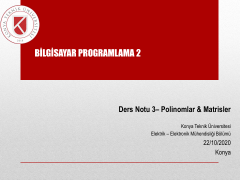
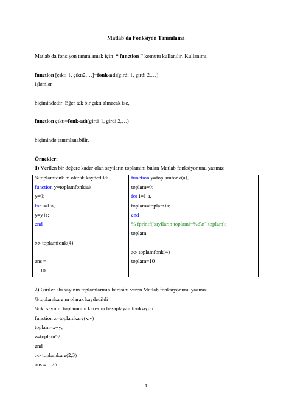
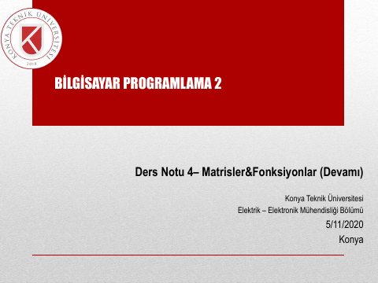
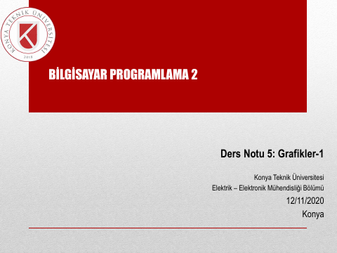
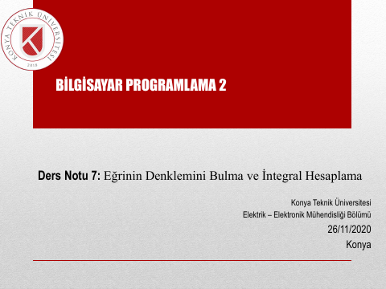
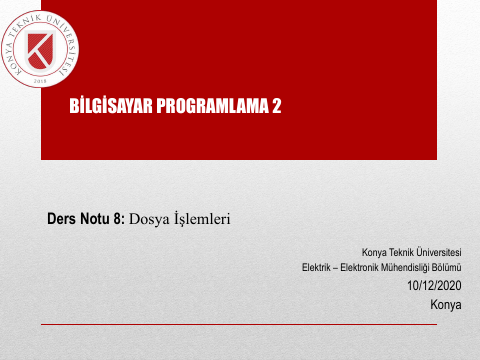
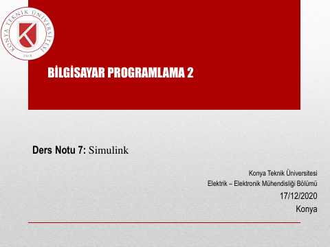
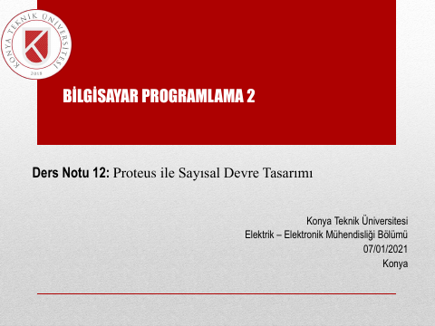
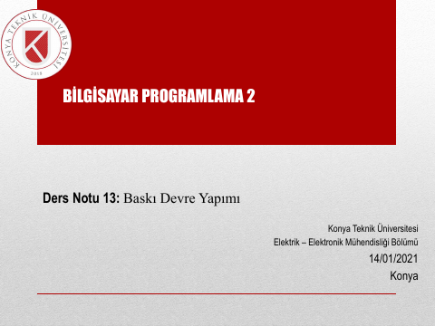

## 📚 Ders Materyalleri

  <a href="https://cdn.jsdelivr.net/gh/c4kar/ktunDepo@main/EEM/EEM-3/bilgisayar-programlama-2/ders-notu-01.pdf" target="_blank" rel="noopener" class="materyal-thumb-link">
    

      
    

  </a>
  

    
ders-notu-01

    

      PDF
      721.4 KB
    

  

  <a href="https://github.com/c4kar/ktunDepo/raw/main/EEM/EEM-3/bilgisayar-programlama-2/ders-notu-01.pdf" class="materyal-download" target="_blank" rel="noopener">
    ↓ İndir
  </a>

  <a href="https://cdn.jsdelivr.net/gh/c4kar/ktunDepo@main/EEM/EEM-3/bilgisayar-programlama-2/ders-notu-02.pdf" target="_blank" rel="noopener" class="materyal-thumb-link">
    

      
    

  </a>
  

    
ders-notu-02

    

      PDF
      1.1 MB
    

  

  <a href="https://github.com/c4kar/ktunDepo/raw/main/EEM/EEM-3/bilgisayar-programlama-2/ders-notu-02.pdf" class="materyal-download" target="_blank" rel="noopener">
    ↓ İndir
  </a>

  <a href="https://cdn.jsdelivr.net/gh/c4kar/ktunDepo@main/EEM/EEM-3/bilgisayar-programlama-2/ders-notu-03.pdf" target="_blank" rel="noopener" class="materyal-thumb-link">
    

      
    

  </a>
  

    
ders-notu-03

    

      PDF
      1.1 MB
    

  

  <a href="https://github.com/c4kar/ktunDepo/raw/main/EEM/EEM-3/bilgisayar-programlama-2/ders-notu-03.pdf" class="materyal-download" target="_blank" rel="noopener">
    ↓ İndir
  </a>

  <a href="https://cdn.jsdelivr.net/gh/c4kar/ktunDepo@main/EEM/EEM-3/bilgisayar-programlama-2/ders-notu-04-fonksiyon-tanimlama.pdf" target="_blank" rel="noopener" class="materyal-thumb-link">
    

      
    

  </a>
  

    
ders-notu-04-fonksiyon-tanimlama

    

      PDF
      316.3 KB
    

  

  <a href="https://github.com/c4kar/ktunDepo/raw/main/EEM/EEM-3/bilgisayar-programlama-2/ders-notu-04-fonksiyon-tanimlama.pdf" class="materyal-download" target="_blank" rel="noopener">
    ↓ İndir
  </a>

  <a href="https://cdn.jsdelivr.net/gh/c4kar/ktunDepo@main/EEM/EEM-3/bilgisayar-programlama-2/ders-notu-04.pdf" target="_blank" rel="noopener" class="materyal-thumb-link">
    

      
    

  </a>
  

    
ders-notu-04

    

      PDF
      998.6 KB
    

  

  <a href="https://github.com/c4kar/ktunDepo/raw/main/EEM/EEM-3/bilgisayar-programlama-2/ders-notu-04.pdf" class="materyal-download" target="_blank" rel="noopener">
    ↓ İndir
  </a>

  <a href="https://cdn.jsdelivr.net/gh/c4kar/ktunDepo@main/EEM/EEM-3/bilgisayar-programlama-2/ders-notu-05.pdf" target="_blank" rel="noopener" class="materyal-thumb-link">
    

      
    

  </a>
  

    
ders-notu-05

    

      PDF
      952.1 KB
    

  

  <a href="https://github.com/c4kar/ktunDepo/raw/main/EEM/EEM-3/bilgisayar-programlama-2/ders-notu-05.pdf" class="materyal-download" target="_blank" rel="noopener">
    ↓ İndir
  </a>

  <a href="https://cdn.jsdelivr.net/gh/c4kar/ktunDepo@main/EEM/EEM-3/bilgisayar-programlama-2/ders-notu-06.pdf" target="_blank" rel="noopener" class="materyal-thumb-link">
    

      
    

  </a>
  

    
ders-notu-06

    

      PDF
      1.5 MB
    

  

  <a href="https://github.com/c4kar/ktunDepo/raw/main/EEM/EEM-3/bilgisayar-programlama-2/ders-notu-06.pdf" class="materyal-download" target="_blank" rel="noopener">
    ↓ İndir
  </a>

  <a href="https://cdn.jsdelivr.net/gh/c4kar/ktunDepo@main/EEM/EEM-3/bilgisayar-programlama-2/ders-notu-07.pdf" target="_blank" rel="noopener" class="materyal-thumb-link">
    

      
    

  </a>
  

    
ders-notu-07

    

      PDF
      1.3 MB
    

  

  <a href="https://github.com/c4kar/ktunDepo/raw/main/EEM/EEM-3/bilgisayar-programlama-2/ders-notu-07.pdf" class="materyal-download" target="_blank" rel="noopener">
    ↓ İndir
  </a>

  <a href="https://cdn.jsdelivr.net/gh/c4kar/ktunDepo@main/EEM/EEM-3/bilgisayar-programlama-2/ders-notu-08.pdf" target="_blank" rel="noopener" class="materyal-thumb-link">
    

      
    

  </a>
  

    
ders-notu-08

    

      PDF
      1.3 MB
    

  

  <a href="https://github.com/c4kar/ktunDepo/raw/main/EEM/EEM-3/bilgisayar-programlama-2/ders-notu-08.pdf" class="materyal-download" target="_blank" rel="noopener">
    ↓ İndir
  </a>

  <a href="https://cdn.jsdelivr.net/gh/c4kar/ktunDepo@main/EEM/EEM-3/bilgisayar-programlama-2/ders-notu-09.pdf" target="_blank" rel="noopener" class="materyal-thumb-link">
    

      
    

  </a>
  

    
ders-notu-09

    

      PDF
      1.6 MB
    

  

  <a href="https://github.com/c4kar/ktunDepo/raw/main/EEM/EEM-3/bilgisayar-programlama-2/ders-notu-09.pdf" class="materyal-download" target="_blank" rel="noopener">
    ↓ İndir
  </a>

  <a href="https://cdn.jsdelivr.net/gh/c4kar/ktunDepo@main/EEM/EEM-3/bilgisayar-programlama-2/ders-notu-10.pdf" target="_blank" rel="noopener" class="materyal-thumb-link">
    

      
    

  </a>
  

    
ders-notu-10

    

      PDF
      1.6 MB
    

  

  <a href="https://github.com/c4kar/ktunDepo/raw/main/EEM/EEM-3/bilgisayar-programlama-2/ders-notu-10.pdf" class="materyal-download" target="_blank" rel="noopener">
    ↓ İndir
  </a>

  <a href="https://cdn.jsdelivr.net/gh/c4kar/ktunDepo@main/EEM/EEM-3/bilgisayar-programlama-2/ders-notu-11.pdf" target="_blank" rel="noopener" class="materyal-thumb-link">
    

      
    

  </a>
  

    
ders-notu-11

    

      PDF
      896.5 KB
    

  

  <a href="https://github.com/c4kar/ktunDepo/raw/main/EEM/EEM-3/bilgisayar-programlama-2/ders-notu-11.pdf" class="materyal-download" target="_blank" rel="noopener">
    ↓ İndir
  </a>

  <a href="https://cdn.jsdelivr.net/gh/c4kar/ktunDepo@main/EEM/EEM-3/bilgisayar-programlama-2/ders-notu-12.pdf" target="_blank" rel="noopener" class="materyal-thumb-link">
    

      
    

  </a>
  

    
ders-notu-12

    

      PDF
      970.5 KB
    

  

  <a href="https://github.com/c4kar/ktunDepo/raw/main/EEM/EEM-3/bilgisayar-programlama-2/ders-notu-12.pdf" class="materyal-download" target="_blank" rel="noopener">
    ↓ İndir
  </a>

  <a href="https://cdn.jsdelivr.net/gh/c4kar/ktunDepo@main/EEM/EEM-3/bilgisayar-programlama-2/ders-notu-13.pdf" target="_blank" rel="noopener" class="materyal-thumb-link">
    

      
    

  </a>
  

    
ders-notu-13

    

      PDF
      862.0 KB
    

  

  <a href="https://github.com/c4kar/ktunDepo/raw/main/EEM/EEM-3/bilgisayar-programlama-2/ders-notu-13.pdf" class="materyal-download" target="_blank" rel="noopener">
    ↓ İndir
  </a>

