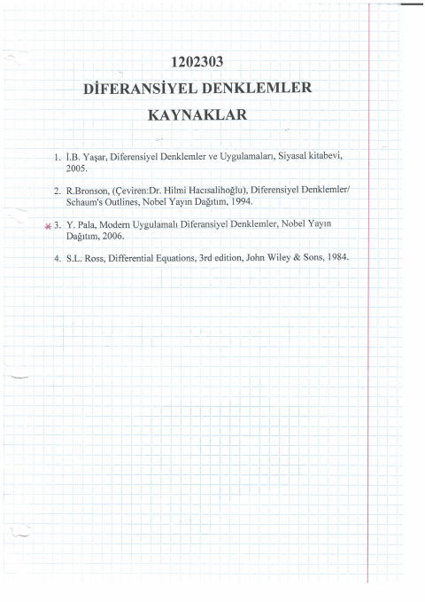
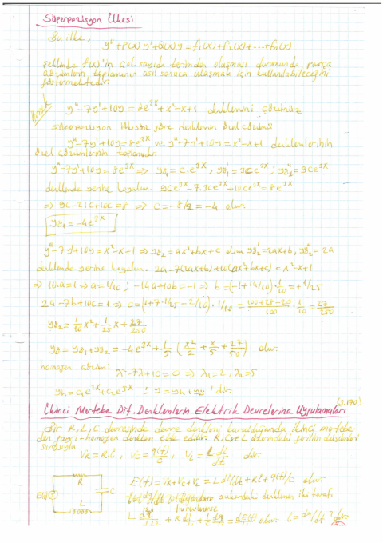
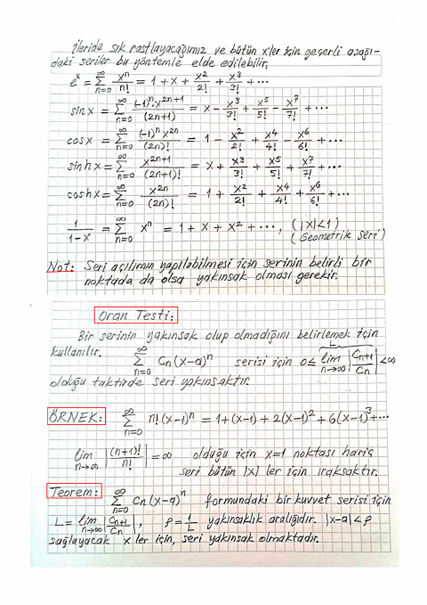
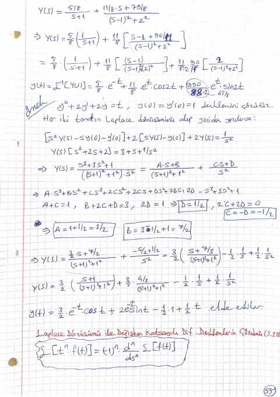
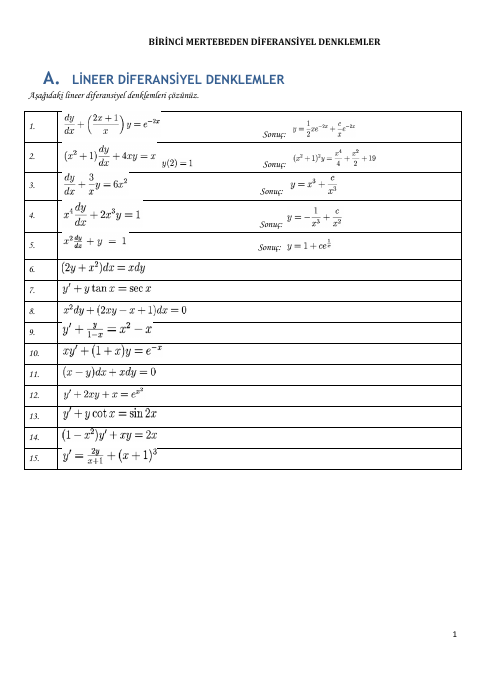
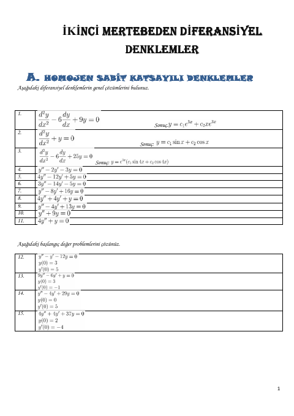
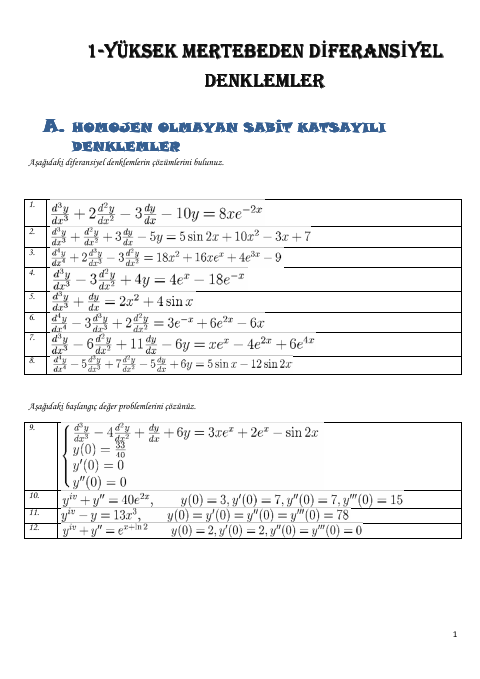

## 📚 Ders Materyalleri

  <a href="https://cdn.jsdelivr.net/gh/c4kar/ktunDepo@main/EEM/EEM-3/diferansiyel-denklemler/DifDenk%2027%20Kas%C4%B1m%20Ders.pdf" target="_blank" rel="noopener" class="materyal-thumb-link">
    

      
    

  </a>
  

    
DifDenk 27 Kasım Ders

    

      PDF
      282.5 KB
    

  

  <a href="https://github.com/c4kar/ktunDepo/raw/main/EEM/EEM-3/diferansiyel-denklemler/DifDenk%2027%20Kas%C4%B1m%20Ders.pdf" class="materyal-download" target="_blank" rel="noopener">
    ↓ İndir
  </a>

  <a href="https://github.com/c4kar/ktunDepo/blob/main/EEM/EEM-3/diferansiyel-denklemler/DifDenk.%20Toplu%20Ders%20Notu.pdf" target="_blank" rel="noopener" class="materyal-thumb-link">
    

      
    

  </a>
  

    
DifDenk. Toplu Ders Notu

    

      PDF
      54.1 MB
    

  

  <a href="https://github.com/c4kar/ktunDepo/raw/main/EEM/EEM-3/diferansiyel-denklemler/DifDenk.%20Toplu%20Ders%20Notu.pdf" class="materyal-download" target="_blank" rel="noopener">
    ↓ İndir
  </a>

  <a href="https://cdn.jsdelivr.net/gh/c4kar/ktunDepo@main/EEM/EEM-3/diferansiyel-denklemler/cikmis/DifDenk%20Vize%202021.pdf" target="_blank" rel="noopener" class="materyal-thumb-link">
    

      
    

  </a>
  

    
DifDenk Vize 2021

    

      PDF
      163.2 KB
    

  

  <a href="https://github.com/c4kar/ktunDepo/raw/main/EEM/EEM-3/diferansiyel-denklemler/cikmis/DifDenk%20Vize%202021.pdf" class="materyal-download" target="_blank" rel="noopener">
    ↓ İndir
  </a>

  <a href="https://cdn.jsdelivr.net/gh/c4kar/ktunDepo@main/EEM/EEM-3/diferansiyel-denklemler/ders_notu_parca_1.pdf" target="_blank" rel="noopener" class="materyal-thumb-link">
    

      
    

  </a>
  

    
ders_notu_parca_1

    

      PDF
      10.8 MB
    

  

  <a href="https://github.com/c4kar/ktunDepo/raw/main/EEM/EEM-3/diferansiyel-denklemler/ders_notu_parca_1.pdf" class="materyal-download" target="_blank" rel="noopener">
    ↓ İndir
  </a>

  <a href="https://cdn.jsdelivr.net/gh/c4kar/ktunDepo@main/EEM/EEM-3/diferansiyel-denklemler/ders_notu_parca_2.pdf" target="_blank" rel="noopener" class="materyal-thumb-link">
    

      
    

  </a>
  

    
ders_notu_parca_2

    

      PDF
      10.8 MB
    

  

  <a href="https://github.com/c4kar/ktunDepo/raw/main/EEM/EEM-3/diferansiyel-denklemler/ders_notu_parca_2.pdf" class="materyal-download" target="_blank" rel="noopener">
    ↓ İndir
  </a>

  <a href="https://cdn.jsdelivr.net/gh/c4kar/ktunDepo@main/EEM/EEM-3/diferansiyel-denklemler/ders_notu_parca_3.pdf" target="_blank" rel="noopener" class="materyal-thumb-link">
    

      
    

  </a>
  

    
ders_notu_parca_3

    

      PDF
      11.6 MB
    

  

  <a href="https://github.com/c4kar/ktunDepo/raw/main/EEM/EEM-3/diferansiyel-denklemler/ders_notu_parca_3.pdf" class="materyal-download" target="_blank" rel="noopener">
    ↓ İndir
  </a>

  <a href="https://cdn.jsdelivr.net/gh/c4kar/ktunDepo@main/EEM/EEM-3/diferansiyel-denklemler/ders_notu_parca_4.pdf" target="_blank" rel="noopener" class="materyal-thumb-link">
    

      
    

  </a>
  

    
ders_notu_parca_4

    

      PDF
      10.1 MB
    

  

  <a href="https://github.com/c4kar/ktunDepo/raw/main/EEM/EEM-3/diferansiyel-denklemler/ders_notu_parca_4.pdf" class="materyal-download" target="_blank" rel="noopener">
    ↓ İndir
  </a>

  <a href="https://cdn.jsdelivr.net/gh/c4kar/ktunDepo@main/EEM/EEM-3/diferansiyel-denklemler/ders_notu_parca_5.pdf" target="_blank" rel="noopener" class="materyal-thumb-link">
    

      
    

  </a>
  

    
ders_notu_parca_5

    

      PDF
      10.9 MB
    

  

  <a href="https://github.com/c4kar/ktunDepo/raw/main/EEM/EEM-3/diferansiyel-denklemler/ders_notu_parca_5.pdf" class="materyal-download" target="_blank" rel="noopener">
    ↓ İndir
  </a>

  <a href="https://cdn.jsdelivr.net/gh/c4kar/ktunDepo@main/EEM/EEM-3/diferansiyel-denklemler/google-grup/1-difdenk_cal_sor.pdf" target="_blank" rel="noopener" class="materyal-thumb-link">
    

      
    

  </a>
  

    
1-difdenk_cal_sor

    

      PDF
      1.2 MB
    

  

  <a href="https://github.com/c4kar/ktunDepo/raw/main/EEM/EEM-3/diferansiyel-denklemler/google-grup/1-difdenk_cal_sor.pdf" class="materyal-download" target="_blank" rel="noopener">
    ↓ İndir
  </a>

  <a href="https://cdn.jsdelivr.net/gh/c4kar/ktunDepo@main/EEM/EEM-3/diferansiyel-denklemler/google-grup/2-difdenk_cal_sor.pdf" target="_blank" rel="noopener" class="materyal-thumb-link">
    

      
    

  </a>
  

    
2-difdenk_cal_sor

    

      PDF
      1.6 MB
    

  

  <a href="https://github.com/c4kar/ktunDepo/raw/main/EEM/EEM-3/diferansiyel-denklemler/google-grup/2-difdenk_cal_sor.pdf" class="materyal-download" target="_blank" rel="noopener">
    ↓ İndir
  </a>

  <a href="https://cdn.jsdelivr.net/gh/c4kar/ktunDepo@main/EEM/EEM-3/diferansiyel-denklemler/google-grup/3-difdenk_cal_sor.pdf" target="_blank" rel="noopener" class="materyal-thumb-link">
    

      
    

  </a>
  

    
3-difdenk_cal_sor

    

      PDF
      2.6 MB
    

  

  <a href="https://github.com/c4kar/ktunDepo/raw/main/EEM/EEM-3/diferansiyel-denklemler/google-grup/3-difdenk_cal_sor.pdf" class="materyal-download" target="_blank" rel="noopener">
    ↓ İndir
  </a>

  <a href="https://cdn.jsdelivr.net/gh/c4kar/ktunDepo@main/EEM/EEM-3/diferansiyel-denklemler/google-grup/A5%20%C3%A7%C3%B6z%C3%BCm%C3%BC.pdf" target="_blank" rel="noopener" class="materyal-thumb-link">
    

      
    

  </a>
  

    
A5 çözümü

    

      PDF
      123.0 KB
    

  

  <a href="https://github.com/c4kar/ktunDepo/raw/main/EEM/EEM-3/diferansiyel-denklemler/google-grup/A5%20%C3%A7%C3%B6z%C3%BCm%C3%BC.pdf" class="materyal-download" target="_blank" rel="noopener">
    ↓ İndir
  </a>

  <a href="https://cdn.jsdelivr.net/gh/c4kar/ktunDepo@main/EEM/EEM-3/diferansiyel-denklemler/google-grup/Adobe%20Scan%2022%20Kas%202023.pdf" target="_blank" rel="noopener" class="materyal-thumb-link">
    

      
    

  </a>
  

    
Adobe Scan 22 Kas 2023

    

      PDF
      236.9 KB
    

  

  <a href="https://github.com/c4kar/ktunDepo/raw/main/EEM/EEM-3/diferansiyel-denklemler/google-grup/Adobe%20Scan%2022%20Kas%202023.pdf" class="materyal-download" target="_blank" rel="noopener">
    ↓ İndir
  </a>

  <a href="https://cdn.jsdelivr.net/gh/c4kar/ktunDepo@main/EEM/EEM-3/diferansiyel-denklemler/google-grup/B1%20%C3%A7%C3%B6z%C3%BCm%C3%BC.pdf" target="_blank" rel="noopener" class="materyal-thumb-link">
    

      
    

  </a>
  

    
B1 çözümü

    

      PDF
      225.1 KB
    

  

  <a href="https://github.com/c4kar/ktunDepo/raw/main/EEM/EEM-3/diferansiyel-denklemler/google-grup/B1%20%C3%A7%C3%B6z%C3%BCm%C3%BC.pdf" class="materyal-download" target="_blank" rel="noopener">
    ↓ İndir
  </a>

  <a href="https://github.com/c4kar/ktunDepo/blob/main/EEM/EEM-3/diferansiyel-denklemler/google-grup/DifDenk.%20Toplu%20Ders%20Notu.pdf" target="_blank" rel="noopener" class="materyal-thumb-link">
    

      
    

  </a>
  

    
DifDenk. Toplu Ders Notu

    

      PDF
      54.1 MB
    

  

  <a href="https://github.com/c4kar/ktunDepo/raw/main/EEM/EEM-3/diferansiyel-denklemler/google-grup/DifDenk.%20Toplu%20Ders%20Notu.pdf" class="materyal-download" target="_blank" rel="noopener">
    ↓ İndir
  </a>

  <a href="https://cdn.jsdelivr.net/gh/c4kar/ktunDepo@main/EEM/EEM-3/diferansiyel-denklemler/google-grup/Lineer%20Denklem%20Sistemlerinin%20Matrisler%20Yard%C4%B1m%C4%B1yla%20%C3%87%C3%B6z%C3%BClmesi.pdf" target="_blank" rel="noopener" class="materyal-thumb-link">
    

      
    

  </a>
  

    
Lineer Denklem Sistemlerinin Matrisler Yardımıyla Çözülmesi

    

      PDF
      433.7 KB
    

  

  <a href="https://github.com/c4kar/ktunDepo/raw/main/EEM/EEM-3/diferansiyel-denklemler/google-grup/Lineer%20Denklem%20Sistemlerinin%20Matrisler%20Yard%C4%B1m%C4%B1yla%20%C3%87%C3%B6z%C3%BClmesi.pdf" class="materyal-download" target="_blank" rel="noopener">
    ↓ İndir
  </a>

