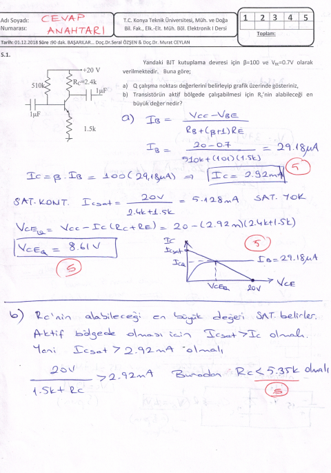
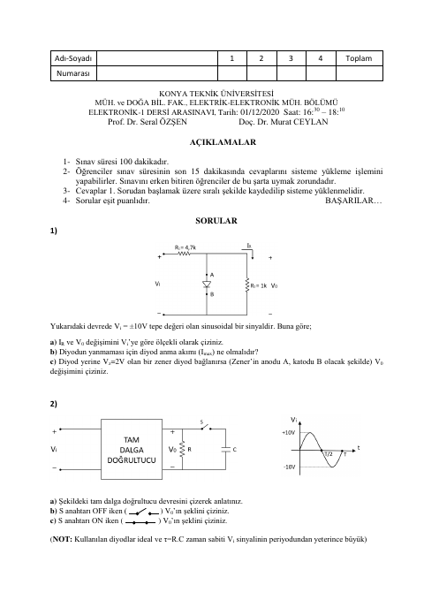
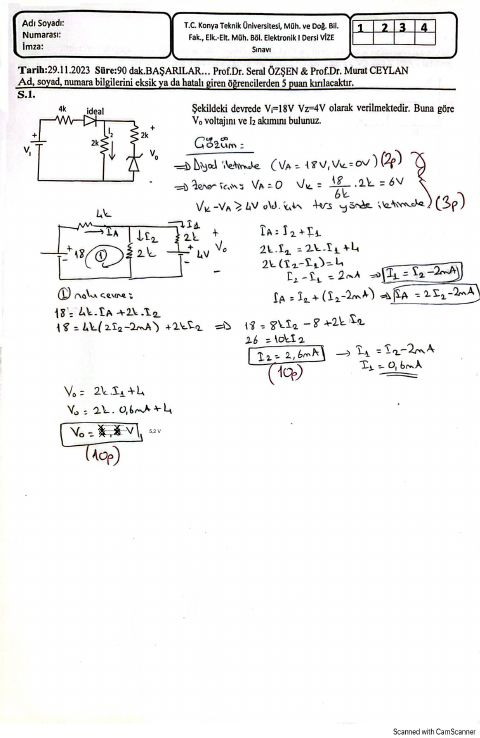

## 📚 Ders Materyalleri

  <a href="https://cdn.jsdelivr.net/gh/c4kar/ktunDepo@main/EEM/EEM-3/elektronik-1/Ders%202%20Diyotlar-1.pdf" target="_blank" rel="noopener" class="materyal-thumb-link">
    

      
    

  </a>
  

    
Ders 2 Diyotlar-1

    

      PDF
      6.4 MB
    

  

  <a href="https://github.com/c4kar/ktunDepo/raw/main/EEM/EEM-3/elektronik-1/Ders%202%20Diyotlar-1.pdf" class="materyal-download" target="_blank" rel="noopener">
    ↓ İndir
  </a>

  <a href="https://cdn.jsdelivr.net/gh/c4kar/ktunDepo@main/EEM/EEM-3/elektronik-1/Ders%203%20Diyotlar-2.pdf" target="_blank" rel="noopener" class="materyal-thumb-link">
    

      
    

  </a>
  

    
Ders 3 Diyotlar-2

    

      PDF
      7.4 MB
    

  

  <a href="https://github.com/c4kar/ktunDepo/raw/main/EEM/EEM-3/elektronik-1/Ders%203%20Diyotlar-2.pdf" class="materyal-download" target="_blank" rel="noopener">
    ↓ İndir
  </a>

  <a href="https://cdn.jsdelivr.net/gh/c4kar/ktunDepo@main/EEM/EEM-3/elektronik-1/Ders%204-5%20Diyotlar-K%C4%B1rp%C4%B1c%C4%B1_Kenetleyici.pdf" target="_blank" rel="noopener" class="materyal-thumb-link">
    

      
    

  </a>
  

    
Ders 4-5 Diyotlar-Kırpıcı_Kenetleyici

    

      PDF
      7.0 MB
    

  

  <a href="https://github.com/c4kar/ktunDepo/raw/main/EEM/EEM-3/elektronik-1/Ders%204-5%20Diyotlar-K%C4%B1rp%C4%B1c%C4%B1_Kenetleyici.pdf" class="materyal-download" target="_blank" rel="noopener">
    ↓ İndir
  </a>

  <a href="https://cdn.jsdelivr.net/gh/c4kar/ktunDepo@main/EEM/EEM-3/elektronik-1/Ders%206%20Zener%20Diyotlar.pdf" target="_blank" rel="noopener" class="materyal-thumb-link">
    

      
    

  </a>
  

    
Ders 6 Zener Diyotlar

    

      PDF
      4.2 MB
    

  

  <a href="https://github.com/c4kar/ktunDepo/raw/main/EEM/EEM-3/elektronik-1/Ders%206%20Zener%20Diyotlar.pdf" class="materyal-download" target="_blank" rel="noopener">
    ↓ İndir
  </a>

  <a href="https://cdn.jsdelivr.net/gh/c4kar/ktunDepo@main/EEM/EEM-3/elektronik-1/Ders%207%20BJT-3.pdf" target="_blank" rel="noopener" class="materyal-thumb-link">
    

      
    

  </a>
  

    
Ders 7 BJT-3

    

      PDF
      10.5 MB
    

  

  <a href="https://github.com/c4kar/ktunDepo/raw/main/EEM/EEM-3/elektronik-1/Ders%207%20BJT-3.pdf" class="materyal-download" target="_blank" rel="noopener">
    ↓ İndir
  </a>

  <a href="https://cdn.jsdelivr.net/gh/c4kar/ktunDepo@main/EEM/EEM-3/elektronik-1/Ders%208%20FET_Ders_Notlar%C4%B1.pdf" target="_blank" rel="noopener" class="materyal-thumb-link">
    

      
    

  </a>
  

    
Ders 8 FET_Ders_Notları

    

      PDF
      11.9 MB
    

  

  <a href="https://github.com/c4kar/ktunDepo/raw/main/EEM/EEM-3/elektronik-1/Ders%208%20FET_Ders_Notlar%C4%B1.pdf" class="materyal-download" target="_blank" rel="noopener">
    ↓ İndir
  </a>

  <a href="https://cdn.jsdelivr.net/gh/c4kar/ktunDepo@main/EEM/EEM-3/elektronik-1/Ders%208%20FET_%C3%96devler.pdf" target="_blank" rel="noopener" class="materyal-thumb-link">
    

      
    

  </a>
  

    
Ders 8 FET_Ödevler

    

      PDF
      1.5 MB
    

  

  <a href="https://github.com/c4kar/ktunDepo/raw/main/EEM/EEM-3/elektronik-1/Ders%208%20FET_%C3%96devler.pdf" class="materyal-download" target="_blank" rel="noopener">
    ↓ İndir
  </a>

  <a href="https://cdn.jsdelivr.net/gh/c4kar/ktunDepo@main/EEM/EEM-3/elektronik-1/cikmis-sorular/2018-2019%20F%C4%B0NAL.pdf" target="_blank" rel="noopener" class="materyal-thumb-link">
    

      
    

  </a>
  

    
2018-2019 FİNAL

    

      PDF
      821.7 KB
    

  

  <a href="https://github.com/c4kar/ktunDepo/raw/main/EEM/EEM-3/elektronik-1/cikmis-sorular/2018-2019%20F%C4%B0NAL.pdf" class="materyal-download" target="_blank" rel="noopener">
    ↓ İndir
  </a>

  <a href="https://cdn.jsdelivr.net/gh/c4kar/ktunDepo@main/EEM/EEM-3/elektronik-1/cikmis-sorular/2018-2019_V%C4%B0ZE.pdf" target="_blank" rel="noopener" class="materyal-thumb-link">
    

      
    

  </a>
  

    
2018-2019_VİZE

    

      PDF
      2.9 MB
    

  

  <a href="https://github.com/c4kar/ktunDepo/raw/main/EEM/EEM-3/elektronik-1/cikmis-sorular/2018-2019_V%C4%B0ZE.pdf" class="materyal-download" target="_blank" rel="noopener">
    ↓ İndir
  </a>

  <a href="https://cdn.jsdelivr.net/gh/c4kar/ktunDepo@main/EEM/EEM-3/elektronik-1/cikmis-sorular/2020-2021_VI%CC%87ZE.pdf" target="_blank" rel="noopener" class="materyal-thumb-link">
    

      
    

  </a>
  

    
2020-2021_VİZE

    

      PDF
      399.5 KB
    

  

  <a href="https://github.com/c4kar/ktunDepo/raw/main/EEM/EEM-3/elektronik-1/cikmis-sorular/2020-2021_VI%CC%87ZE.pdf" class="materyal-download" target="_blank" rel="noopener">
    ↓ İndir
  </a>

  <a href="https://cdn.jsdelivr.net/gh/c4kar/ktunDepo@main/EEM/EEM-3/elektronik-1/cikmis-sorular/2023_2024_VI%CC%87ZE.pdf" target="_blank" rel="noopener" class="materyal-thumb-link">
    

      
    

  </a>
  

    
2023_2024_VİZE

    

      PDF
      1.3 MB
    

  

  <a href="https://github.com/c4kar/ktunDepo/raw/main/EEM/EEM-3/elektronik-1/cikmis-sorular/2023_2024_VI%CC%87ZE.pdf" class="materyal-download" target="_blank" rel="noopener">
    ↓ İndir
  </a>

  <a href="https://github.com/c4kar/ktunDepo/blob/main/EEM/EEM-3/elektronik-1/cikmis-sorular/2024-2025%20V%C4%B0ZE.pdf" target="_blank" rel="noopener" class="materyal-thumb-link">
    

      
    

  </a>
  

    
2024-2025 VİZE

    

      PDF
      23.6 MB
    

  

  <a href="https://github.com/c4kar/ktunDepo/raw/main/EEM/EEM-3/elektronik-1/cikmis-sorular/2024-2025%20V%C4%B0ZE.pdf" class="materyal-download" target="_blank" rel="noopener">
    ↓ İndir
  </a>

