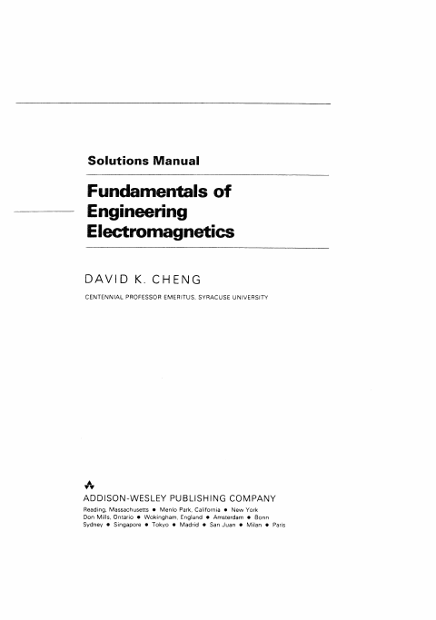
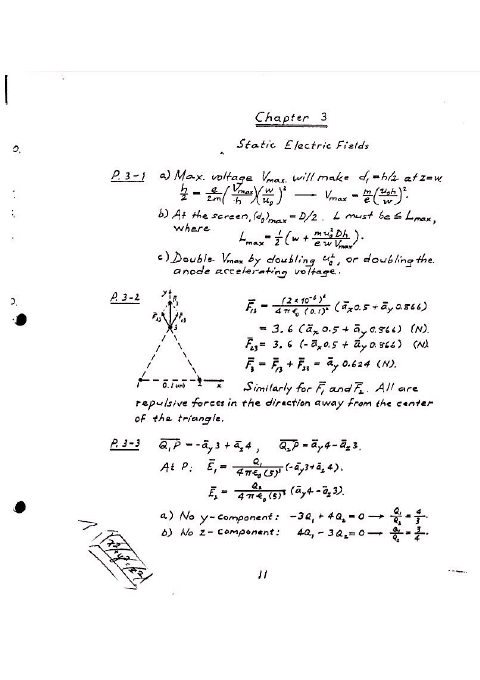
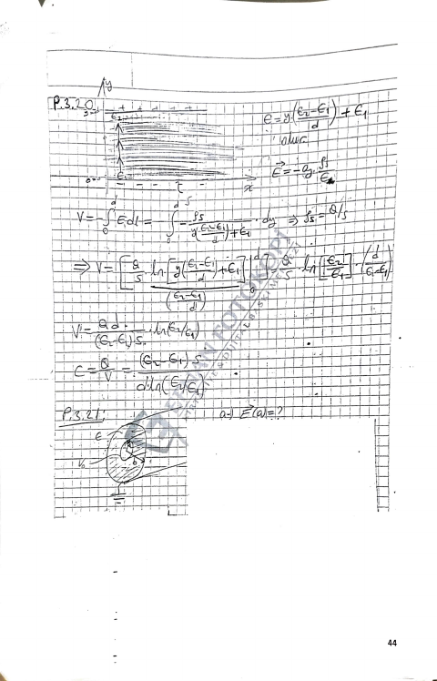
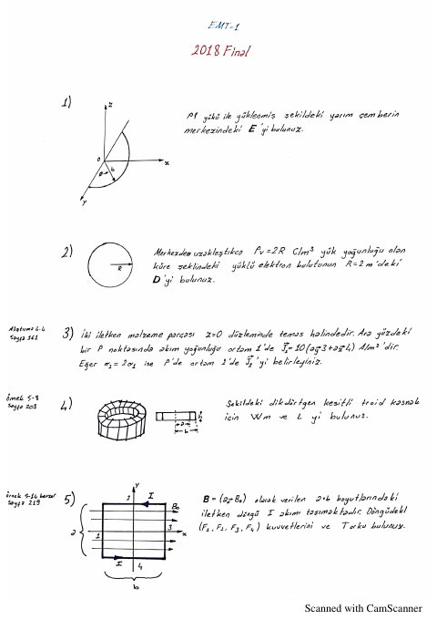
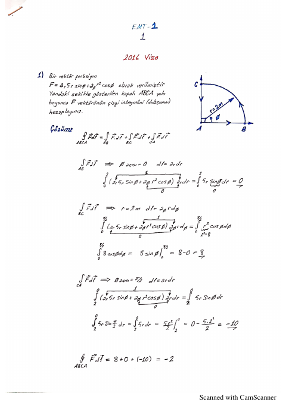
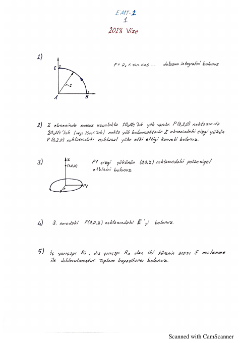
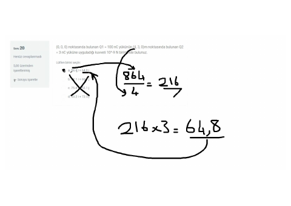

## 📚 Ders Materyalleri

  <a href="https://cdn.jsdelivr.net/gh/c4kar/ktunDepo@main/EEM/EEM-4/elektromanyetik-alan-teorisi-1/cozum_cheng-elektromanyetik-cozumler_tarihsiz_v1.pdf" target="_blank" rel="noopener" class="materyal-thumb-link">
    

      
    

  </a>
  

    
cozum_cheng-elektromanyetik-cozumler_tarihsiz_v1

    

      PDF
      1.6 MB
    

  

  <a href="https://github.com/c4kar/ktunDepo/raw/main/EEM/EEM-4/elektromanyetik-alan-teorisi-1/cozum_cheng-elektromanyetik-cozumler_tarihsiz_v1.pdf" class="materyal-download" target="_blank" rel="noopener">
    ↓ İndir
  </a>

  <a href="https://cdn.jsdelivr.net/gh/c4kar/ktunDepo@main/EEM/EEM-4/elektromanyetik-alan-teorisi-1/cozum_elektrik-alan-cozum_2023_v1.jpg" target="_blank" rel="noopener" class="materyal-thumb-link">
    

      
    

  </a>
  

    
cozum_elektrik-alan-cozum_2023_v1

    

      JPG
      104.6 KB
    

  

  <a href="https://github.com/c4kar/ktunDepo/raw/main/EEM/EEM-4/elektromanyetik-alan-teorisi-1/cozum_elektrik-alan-cozum_2023_v1.jpg" class="materyal-download" target="_blank" rel="noopener">
    ↓ İndir
  </a>

  <a href="https://cdn.jsdelivr.net/gh/c4kar/ktunDepo@main/EEM/EEM-4/elektromanyetik-alan-teorisi-1/cozum_elektromanyetik-cozum-hesap_2023_v1.jpg" target="_blank" rel="noopener" class="materyal-thumb-link">
    

      
    

  </a>
  

    
cozum_elektromanyetik-cozum-hesap_2023_v1

    

      JPG
      68.2 KB
    

  

  <a href="https://github.com/c4kar/ktunDepo/raw/main/EEM/EEM-4/elektromanyetik-alan-teorisi-1/cozum_elektromanyetik-cozum-hesap_2023_v1.jpg" class="materyal-download" target="_blank" rel="noopener">
    ↓ İndir
  </a>

  <a href="https://cdn.jsdelivr.net/gh/c4kar/ktunDepo@main/EEM/EEM-4/elektromanyetik-alan-teorisi-1/cozum_elektromanyetik-hesaplama-cozu_2023_v1.jpg" target="_blank" rel="noopener" class="materyal-thumb-link">
    

      
    

  </a>
  

    
cozum_elektromanyetik-hesaplama-cozu_2023_v1

    

      JPG
      119.0 KB
    

  

  <a href="https://github.com/c4kar/ktunDepo/raw/main/EEM/EEM-4/elektromanyetik-alan-teorisi-1/cozum_elektromanyetik-hesaplama-cozu_2023_v1.jpg" class="materyal-download" target="_blank" rel="noopener">
    ↓ İndir
  </a>

  <a href="https://cdn.jsdelivr.net/gh/c4kar/ktunDepo@main/EEM/EEM-4/elektromanyetik-alan-teorisi-1/cozum_elektromanyetik-soru-cozum_2023_v1.jpg" target="_blank" rel="noopener" class="materyal-thumb-link">
    

      
    

  </a>
  

    
cozum_elektromanyetik-soru-cozum_2023_v1

    

      JPG
      53.9 KB
    

  

  <a href="https://github.com/c4kar/ktunDepo/raw/main/EEM/EEM-4/elektromanyetik-alan-teorisi-1/cozum_elektromanyetik-soru-cozum_2023_v1.jpg" class="materyal-download" target="_blank" rel="noopener">
    ↓ İndir
  </a>

  <a href="https://cdn.jsdelivr.net/gh/c4kar/ktunDepo@main/EEM/EEM-4/elektromanyetik-alan-teorisi-1/cozum_elektromanyetik-soru-cozum_tarihsiz_v1.jpg" target="_blank" rel="noopener" class="materyal-thumb-link">
    

      
    

  </a>
  

    
cozum_elektromanyetik-soru-cozum_tarihsiz_v1

    

      JPG
      73.4 KB
    

  

  <a href="https://github.com/c4kar/ktunDepo/raw/main/EEM/EEM-4/elektromanyetik-alan-teorisi-1/cozum_elektromanyetik-soru-cozum_tarihsiz_v1.jpg" class="materyal-download" target="_blank" rel="noopener">
    ↓ İndir
  </a>

  <a href="https://cdn.jsdelivr.net/gh/c4kar/ktunDepo@main/EEM/EEM-4/elektromanyetik-alan-teorisi-1/cozum_elektromanyetik-soru-cozum_tarihsiz_v2.jpg" target="_blank" rel="noopener" class="materyal-thumb-link">
    

      
    

  </a>
  

    
cozum_elektromanyetik-soru-cozum_tarihsiz_v2

    

      JPG
      71.5 KB
    

  

  <a href="https://github.com/c4kar/ktunDepo/raw/main/EEM/EEM-4/elektromanyetik-alan-teorisi-1/cozum_elektromanyetik-soru-cozum_tarihsiz_v2.jpg" class="materyal-download" target="_blank" rel="noopener">
    ↓ İndir
  </a>

  <a href="https://cdn.jsdelivr.net/gh/c4kar/ktunDepo@main/EEM/EEM-4/elektromanyetik-alan-teorisi-1/cozum_emt1-bolum3-cozumler_tarihsiz_v1.pdf" target="_blank" rel="noopener" class="materyal-thumb-link">
    

      
    

  </a>
  

    
cozum_emt1-bolum3-cozumler_tarihsiz_v1

    

      PDF
      1.1 MB
    

  

  <a href="https://github.com/c4kar/ktunDepo/raw/main/EEM/EEM-4/elektromanyetik-alan-teorisi-1/cozum_emt1-bolum3-cozumler_tarihsiz_v1.pdf" class="materyal-download" target="_blank" rel="noopener">
    ↓ İndir
  </a>

  <a href="https://cdn.jsdelivr.net/gh/c4kar/ktunDepo@main/EEM/EEM-4/elektromanyetik-alan-teorisi-1/cozum_emt1-bolum3-cozumler_tarihsiz_v2.pdf" target="_blank" rel="noopener" class="materyal-thumb-link">
    

      
    

  </a>
  

    
cozum_emt1-bolum3-cozumler_tarihsiz_v2

    

      PDF
      2.2 MB
    

  

  <a href="https://github.com/c4kar/ktunDepo/raw/main/EEM/EEM-4/elektromanyetik-alan-teorisi-1/cozum_emt1-bolum3-cozumler_tarihsiz_v2.pdf" class="materyal-download" target="_blank" rel="noopener">
    ↓ İndir
  </a>

  <a href="https://cdn.jsdelivr.net/gh/c4kar/ktunDepo@main/EEM/EEM-4/elektromanyetik-alan-teorisi-1/cozum_manyetik-alan-cozum_2023_v1.jpg" target="_blank" rel="noopener" class="materyal-thumb-link">
    

      
    

  </a>
  

    
cozum_manyetik-alan-cozum_2023_v1

    

      JPG
      63.2 KB
    

  

  <a href="https://github.com/c4kar/ktunDepo/raw/main/EEM/EEM-4/elektromanyetik-alan-teorisi-1/cozum_manyetik-alan-cozum_2023_v1.jpg" class="materyal-download" target="_blank" rel="noopener">
    ↓ İndir
  </a>

  <a href="https://cdn.jsdelivr.net/gh/c4kar/ktunDepo@main/EEM/EEM-4/elektromanyetik-alan-teorisi-1/cozum_sinav-cozumu-elektrostatik_2023_v1.jpg" target="_blank" rel="noopener" class="materyal-thumb-link">
    

      
    

  </a>
  

    
cozum_sinav-cozumu-elektrostatik_2023_v1

    

      JPG
      86.0 KB
    

  

  <a href="https://github.com/c4kar/ktunDepo/raw/main/EEM/EEM-4/elektromanyetik-alan-teorisi-1/cozum_sinav-cozumu-elektrostatik_2023_v1.jpg" class="materyal-download" target="_blank" rel="noopener">
    ↓ İndir
  </a>

  <a href="https://cdn.jsdelivr.net/gh/c4kar/ktunDepo@main/EEM/EEM-4/elektromanyetik-alan-teorisi-1/not_elektromanyetik-alan-notlari_tarihsiz_v1.jpg" target="_blank" rel="noopener" class="materyal-thumb-link">
    

      
    

  </a>
  

    
not_elektromanyetik-alan-notlari_tarihsiz_v1

    

      JPG
      152.6 KB
    

  

  <a href="https://github.com/c4kar/ktunDepo/raw/main/EEM/EEM-4/elektromanyetik-alan-teorisi-1/not_elektromanyetik-alan-notlari_tarihsiz_v1.jpg" class="materyal-download" target="_blank" rel="noopener">
    ↓ İndir
  </a>

  <a href="https://cdn.jsdelivr.net/gh/c4kar/ktunDepo@main/EEM/EEM-4/elektromanyetik-alan-teorisi-1/not_elektromanyetik-ders-notu_tarihsiz_v1.jpg" target="_blank" rel="noopener" class="materyal-thumb-link">
    

      
    

  </a>
  

    
not_elektromanyetik-ders-notu_tarihsiz_v1

    

      JPG
      210.8 KB
    

  

  <a href="https://github.com/c4kar/ktunDepo/raw/main/EEM/EEM-4/elektromanyetik-alan-teorisi-1/not_elektromanyetik-ders-notu_tarihsiz_v1.jpg" class="materyal-download" target="_blank" rel="noopener">
    ↓ İndir
  </a>

  <a href="https://cdn.jsdelivr.net/gh/c4kar/ktunDepo@main/EEM/EEM-4/elektromanyetik-alan-teorisi-1/not_elektromanyetik-devre-notu_2021_v1.jpg" target="_blank" rel="noopener" class="materyal-thumb-link">
    

      
    

  </a>
  

    
not_elektromanyetik-devre-notu_2021_v1

    

      JPG
      133.3 KB
    

  

  <a href="https://github.com/c4kar/ktunDepo/raw/main/EEM/EEM-4/elektromanyetik-alan-teorisi-1/not_elektromanyetik-devre-notu_2021_v1.jpg" class="materyal-download" target="_blank" rel="noopener">
    ↓ İndir
  </a>

  <a href="https://cdn.jsdelivr.net/gh/c4kar/ktunDepo@main/EEM/EEM-4/elektromanyetik-alan-teorisi-1/not_elektromanyetik-formul-notlari_tarihsiz_v1.jpg" target="_blank" rel="noopener" class="materyal-thumb-link">
    

      
    

  </a>
  

    
not_elektromanyetik-formul-notlari_tarihsiz_v1

    

      JPG
      140.9 KB
    

  

  <a href="https://github.com/c4kar/ktunDepo/raw/main/EEM/EEM-4/elektromanyetik-alan-teorisi-1/not_elektromanyetik-formul-notlari_tarihsiz_v1.jpg" class="materyal-download" target="_blank" rel="noopener">
    ↓ İndir
  </a>

  <a href="https://cdn.jsdelivr.net/gh/c4kar/ktunDepo@main/EEM/EEM-4/elektromanyetik-alan-teorisi-1/not_elektromanyetik-formul-notlari_tarihsiz_v2.jpg" target="_blank" rel="noopener" class="materyal-thumb-link">
    

      
    

  </a>
  

    
not_elektromanyetik-formul-notlari_tarihsiz_v2

    

      JPG
      131.1 KB
    

  

  <a href="https://github.com/c4kar/ktunDepo/raw/main/EEM/EEM-4/elektromanyetik-alan-teorisi-1/not_elektromanyetik-formul-notlari_tarihsiz_v2.jpg" class="materyal-download" target="_blank" rel="noopener">
    ↓ İndir
  </a>

  <a href="https://cdn.jsdelivr.net/gh/c4kar/ktunDepo@main/EEM/EEM-4/elektromanyetik-alan-teorisi-1/not_elektromanyetik-vektor-analizi_tarihsiz_v1.jpg" target="_blank" rel="noopener" class="materyal-thumb-link">
    

      
    

  </a>
  

    
not_elektromanyetik-vektor-analizi_tarihsiz_v1

    

      JPG
      137.4 KB
    

  

  <a href="https://github.com/c4kar/ktunDepo/raw/main/EEM/EEM-4/elektromanyetik-alan-teorisi-1/not_elektromanyetik-vektor-analizi_tarihsiz_v1.jpg" class="materyal-download" target="_blank" rel="noopener">
    ↓ İndir
  </a>

  <a href="https://cdn.jsdelivr.net/gh/c4kar/ktunDepo@main/EEM/EEM-4/elektromanyetik-alan-teorisi-1/not_elektromanyetik-yuk-dagilimi_tarihsiz_v1.jpg" target="_blank" rel="noopener" class="materyal-thumb-link">
    

      
    

  </a>
  

    
not_elektromanyetik-yuk-dagilimi_tarihsiz_v1

    

      JPG
      73.8 KB
    

  

  <a href="https://github.com/c4kar/ktunDepo/raw/main/EEM/EEM-4/elektromanyetik-alan-teorisi-1/not_elektromanyetik-yuk-dagilimi_tarihsiz_v1.jpg" class="materyal-download" target="_blank" rel="noopener">
    ↓ İndir
  </a>

  <a href="https://cdn.jsdelivr.net/gh/c4kar/ktunDepo@main/EEM/EEM-4/elektromanyetik-alan-teorisi-1/not_emt1-ders-programi_2025_v1.jpg" target="_blank" rel="noopener" class="materyal-thumb-link">
    

      
    

  </a>
  

    
not_emt1-ders-programi_2025_v1

    

      JPG
      331.3 KB
    

  

  <a href="https://github.com/c4kar/ktunDepo/raw/main/EEM/EEM-4/elektromanyetik-alan-teorisi-1/not_emt1-ders-programi_2025_v1.jpg" class="materyal-download" target="_blank" rel="noopener">
    ↓ İndir
  </a>

  <a href="https://cdn.jsdelivr.net/gh/c4kar/ktunDepo@main/EEM/EEM-4/elektromanyetik-alan-teorisi-1/not_manyetik-alan-hesaplama_tarihsiz_v1.jpg" target="_blank" rel="noopener" class="materyal-thumb-link">
    

      
    

  </a>
  

    
not_manyetik-alan-hesaplama_tarihsiz_v1

    

      JPG
      80.5 KB
    

  

  <a href="https://github.com/c4kar/ktunDepo/raw/main/EEM/EEM-4/elektromanyetik-alan-teorisi-1/not_manyetik-alan-hesaplama_tarihsiz_v1.jpg" class="materyal-download" target="_blank" rel="noopener">
    ↓ İndir
  </a>

  <a href="https://cdn.jsdelivr.net/gh/c4kar/ktunDepo@main/EEM/EEM-4/elektromanyetik-alan-teorisi-1/not_manyetik-kuvvet-hesaplama_tarihsiz_v1.jpg" target="_blank" rel="noopener" class="materyal-thumb-link">
    

      
    

  </a>
  

    
not_manyetik-kuvvet-hesaplama_tarihsiz_v1

    

      JPG
      79.7 KB
    

  

  <a href="https://github.com/c4kar/ktunDepo/raw/main/EEM/EEM-4/elektromanyetik-alan-teorisi-1/not_manyetik-kuvvet-hesaplama_tarihsiz_v1.jpg" class="materyal-download" target="_blank" rel="noopener">
    ↓ İndir
  </a>

  <a href="https://cdn.jsdelivr.net/gh/c4kar/ktunDepo@main/EEM/EEM-4/elektromanyetik-alan-teorisi-1/sinav_2017-final-soru5_2017_v1.jpg" target="_blank" rel="noopener" class="materyal-thumb-link">
    

      
    

  </a>
  

    
sinav_2017-final-soru5_2017_v1

    

      JPG
      59.8 KB
    

  

  <a href="https://github.com/c4kar/ktunDepo/raw/main/EEM/EEM-4/elektromanyetik-alan-teorisi-1/sinav_2017-final-soru5_2017_v1.jpg" class="materyal-download" target="_blank" rel="noopener">
    ↓ İndir
  </a>

  <a href="https://cdn.jsdelivr.net/gh/c4kar/ktunDepo@main/EEM/EEM-4/elektromanyetik-alan-teorisi-1/sinav_cizgi-yuk-potansiyel_2023_v1.jpg" target="_blank" rel="noopener" class="materyal-thumb-link">
    

      
    

  </a>
  

    
sinav_cizgi-yuk-potansiyel_2023_v1

    

      JPG
      26.3 KB
    

  

  <a href="https://github.com/c4kar/ktunDepo/raw/main/EEM/EEM-4/elektromanyetik-alan-teorisi-1/sinav_cizgi-yuk-potansiyel_2023_v1.jpg" class="materyal-download" target="_blank" rel="noopener">
    ↓ İndir
  </a>

  <a href="https://cdn.jsdelivr.net/gh/c4kar/ktunDepo@main/EEM/EEM-4/elektromanyetik-alan-teorisi-1/sinav_elektrik-aku-kure-sorusu_2023_v1.jpg" target="_blank" rel="noopener" class="materyal-thumb-link">
    

      
    

  </a>
  

    
sinav_elektrik-aku-kure-sorusu_2023_v1

    

      JPG
      19.2 KB
    

  

  <a href="https://github.com/c4kar/ktunDepo/raw/main/EEM/EEM-4/elektromanyetik-alan-teorisi-1/sinav_elektrik-aku-kure-sorusu_2023_v1.jpg" class="materyal-download" target="_blank" rel="noopener">
    ↓ İndir
  </a>

  <a href="https://cdn.jsdelivr.net/gh/c4kar/ktunDepo@main/EEM/EEM-4/elektromanyetik-alan-teorisi-1/sinav_elektrik-aku-soru_2023_v1.jpg" target="_blank" rel="noopener" class="materyal-thumb-link">
    

      
    

  </a>
  

    
sinav_elektrik-aku-soru_2023_v1

    

      JPG
      24.8 KB
    

  

  <a href="https://github.com/c4kar/ktunDepo/raw/main/EEM/EEM-4/elektromanyetik-alan-teorisi-1/sinav_elektrik-aku-soru_2023_v1.jpg" class="materyal-download" target="_blank" rel="noopener">
    ↓ İndir
  </a>

  <a href="https://cdn.jsdelivr.net/gh/c4kar/ktunDepo@main/EEM/EEM-4/elektromanyetik-alan-teorisi-1/sinav_elektrik-aku-yogunlugu-soru_2023_v1.jpg" target="_blank" rel="noopener" class="materyal-thumb-link">
    

      
    

  </a>
  

    
sinav_elektrik-aku-yogunlugu-soru_2023_v1

    

      JPG
      20.5 KB
    

  

  <a href="https://github.com/c4kar/ktunDepo/raw/main/EEM/EEM-4/elektromanyetik-alan-teorisi-1/sinav_elektrik-aku-yogunlugu-soru_2023_v1.jpg" class="materyal-download" target="_blank" rel="noopener">
    ↓ İndir
  </a>

  <a href="https://cdn.jsdelivr.net/gh/c4kar/ktunDepo@main/EEM/EEM-4/elektromanyetik-alan-teorisi-1/sinav_elektrik-alan-soru_2021_v1.jpg" target="_blank" rel="noopener" class="materyal-thumb-link">
    

      
    

  </a>
  

    
sinav_elektrik-alan-soru_2021_v1

    

      JPG
      71.3 KB
    

  

  <a href="https://github.com/c4kar/ktunDepo/raw/main/EEM/EEM-4/elektromanyetik-alan-teorisi-1/sinav_elektrik-alan-soru_2021_v1.jpg" class="materyal-download" target="_blank" rel="noopener">
    ↓ İndir
  </a>

  <a href="https://cdn.jsdelivr.net/gh/c4kar/ktunDepo@main/EEM/EEM-4/elektromanyetik-alan-teorisi-1/sinav_elektrik-alan-soru_2023_v1.jpg" target="_blank" rel="noopener" class="materyal-thumb-link">
    

      
    

  </a>
  

    
sinav_elektrik-alan-soru_2023_v1

    

      JPG
      93.5 KB
    

  

  <a href="https://github.com/c4kar/ktunDepo/raw/main/EEM/EEM-4/elektromanyetik-alan-teorisi-1/sinav_elektrik-alan-soru_2023_v1.jpg" class="materyal-download" target="_blank" rel="noopener">
    ↓ İndir
  </a>

  <a href="https://cdn.jsdelivr.net/gh/c4kar/ktunDepo@main/EEM/EEM-4/elektromanyetik-alan-teorisi-1/sinav_elektrik-alan-soru_2023_v2.jpg" target="_blank" rel="noopener" class="materyal-thumb-link">
    

      
    

  </a>
  

    
sinav_elektrik-alan-soru_2023_v2

    

      JPG
      22.2 KB
    

  

  <a href="https://github.com/c4kar/ktunDepo/raw/main/EEM/EEM-4/elektromanyetik-alan-teorisi-1/sinav_elektrik-alan-soru_2023_v2.jpg" class="materyal-download" target="_blank" rel="noopener">
    ↓ İndir
  </a>

  <a href="https://cdn.jsdelivr.net/gh/c4kar/ktunDepo@main/EEM/EEM-4/elektromanyetik-alan-teorisi-1/sinav_elektrik-alan-soru_2023_v3.jpg" target="_blank" rel="noopener" class="materyal-thumb-link">
    

      
    

  </a>
  

    
sinav_elektrik-alan-soru_2023_v3

    

      JPG
      22.5 KB
    

  

  <a href="https://github.com/c4kar/ktunDepo/raw/main/EEM/EEM-4/elektromanyetik-alan-teorisi-1/sinav_elektrik-alan-soru_2023_v3.jpg" class="materyal-download" target="_blank" rel="noopener">
    ↓ İndir
  </a>

  <a href="https://cdn.jsdelivr.net/gh/c4kar/ktunDepo@main/EEM/EEM-4/elektromanyetik-alan-teorisi-1/sinav_elektrik-alan-soru_2023_v4.jpg" target="_blank" rel="noopener" class="materyal-thumb-link">
    

      
    

  </a>
  

    
sinav_elektrik-alan-soru_2023_v4

    

      JPG
      14.3 KB
    

  

  <a href="https://github.com/c4kar/ktunDepo/raw/main/EEM/EEM-4/elektromanyetik-alan-teorisi-1/sinav_elektrik-alan-soru_2023_v4.jpg" class="materyal-download" target="_blank" rel="noopener">
    ↓ İndir
  </a>

  <a href="https://cdn.jsdelivr.net/gh/c4kar/ktunDepo@main/EEM/EEM-4/elektromanyetik-alan-teorisi-1/sinav_elektrik-alan-sorulari_2023_v1.jpg" target="_blank" rel="noopener" class="materyal-thumb-link">
    

      
    

  </a>
  

    
sinav_elektrik-alan-sorulari_2023_v1

    

      JPG
      76.2 KB
    

  

  <a href="https://github.com/c4kar/ktunDepo/raw/main/EEM/EEM-4/elektromanyetik-alan-teorisi-1/sinav_elektrik-alan-sorulari_2023_v1.jpg" class="materyal-download" target="_blank" rel="noopener">
    ↓ İndir
  </a>

  <a href="https://cdn.jsdelivr.net/gh/c4kar/ktunDepo@main/EEM/EEM-4/elektromanyetik-alan-teorisi-1/sinav_elektromanyetik-aku-teoremi_2023_v1.jpg" target="_blank" rel="noopener" class="materyal-thumb-link">
    

      
    

  </a>
  

    
sinav_elektromanyetik-aku-teoremi_2023_v1

    

      JPG
      90.0 KB
    

  

  <a href="https://github.com/c4kar/ktunDepo/raw/main/EEM/EEM-4/elektromanyetik-alan-teorisi-1/sinav_elektromanyetik-aku-teoremi_2023_v1.jpg" class="materyal-download" target="_blank" rel="noopener">
    ↓ İndir
  </a>

  <a href="https://cdn.jsdelivr.net/gh/c4kar/ktunDepo@main/EEM/EEM-4/elektromanyetik-alan-teorisi-1/sinav_elektromanyetik-coktan-secmeli_2023_v1.jpg" target="_blank" rel="noopener" class="materyal-thumb-link">
    

      
    

  </a>
  

    
sinav_elektromanyetik-coktan-secmeli_2023_v1

    

      JPG
      34.8 KB
    

  

  <a href="https://github.com/c4kar/ktunDepo/raw/main/EEM/EEM-4/elektromanyetik-alan-teorisi-1/sinav_elektromanyetik-coktan-secmeli_2023_v1.jpg" class="materyal-download" target="_blank" rel="noopener">
    ↓ İndir
  </a>

  <a href="https://cdn.jsdelivr.net/gh/c4kar/ktunDepo@main/EEM/EEM-4/elektromanyetik-alan-teorisi-1/sinav_elektromanyetik-direnc-soru_2023_v1.jpg" target="_blank" rel="noopener" class="materyal-thumb-link">
    

      
    

  </a>
  

    
sinav_elektromanyetik-direnc-soru_2023_v1

    

      JPG
      29.8 KB
    

  

  <a href="https://github.com/c4kar/ktunDepo/raw/main/EEM/EEM-4/elektromanyetik-alan-teorisi-1/sinav_elektromanyetik-direnc-soru_2023_v1.jpg" class="materyal-download" target="_blank" rel="noopener">
    ↓ İndir
  </a>

  <a href="https://cdn.jsdelivr.net/gh/c4kar/ktunDepo@main/EEM/EEM-4/elektromanyetik-alan-teorisi-1/sinav_elektromanyetik-direnc-sorusu_2023_v1.jpg" target="_blank" rel="noopener" class="materyal-thumb-link">
    

      
    

  </a>
  

    
sinav_elektromanyetik-direnc-sorusu_2023_v1

    

      JPG
      31.4 KB
    

  

  <a href="https://github.com/c4kar/ktunDepo/raw/main/EEM/EEM-4/elektromanyetik-alan-teorisi-1/sinav_elektromanyetik-direnc-sorusu_2023_v1.jpg" class="materyal-download" target="_blank" rel="noopener">
    ↓ İndir
  </a>

  <a href="https://cdn.jsdelivr.net/gh/c4kar/ktunDepo@main/EEM/EEM-4/elektromanyetik-alan-teorisi-1/sinav_elektromanyetik-final-duyuru_2021_v1.jpg" target="_blank" rel="noopener" class="materyal-thumb-link">
    

      
    

  </a>
  

    
sinav_elektromanyetik-final-duyuru_2021_v1

    

      JPG
      151.2 KB
    

  

  <a href="https://github.com/c4kar/ktunDepo/raw/main/EEM/EEM-4/elektromanyetik-alan-teorisi-1/sinav_elektromanyetik-final-duyuru_2021_v1.jpg" class="materyal-download" target="_blank" rel="noopener">
    ↓ İndir
  </a>

  <a href="https://cdn.jsdelivr.net/gh/c4kar/ktunDepo@main/EEM/EEM-4/elektromanyetik-alan-teorisi-1/sinav_elektromanyetik-sinav-2012_2012_v1.jpg" target="_blank" rel="noopener" class="materyal-thumb-link">
    

      
    

  </a>
  

    
sinav_elektromanyetik-sinav-2012_2012_v1

    

      JPG
      55.1 KB
    

  

  <a href="https://github.com/c4kar/ktunDepo/raw/main/EEM/EEM-4/elektromanyetik-alan-teorisi-1/sinav_elektromanyetik-sinav-2012_2012_v1.jpg" class="materyal-download" target="_blank" rel="noopener">
    ↓ İndir
  </a>

  <a href="https://cdn.jsdelivr.net/gh/c4kar/ktunDepo@main/EEM/EEM-4/elektromanyetik-alan-teorisi-1/sinav_elektromanyetik-sinav-2012_2012_v2.jpg" target="_blank" rel="noopener" class="materyal-thumb-link">
    

      
    

  </a>
  

    
sinav_elektromanyetik-sinav-2012_2012_v2

    

      JPG
      91.0 KB
    

  

  <a href="https://github.com/c4kar/ktunDepo/raw/main/EEM/EEM-4/elektromanyetik-alan-teorisi-1/sinav_elektromanyetik-sinav-2012_2012_v2.jpg" class="materyal-download" target="_blank" rel="noopener">
    ↓ İndir
  </a>

  <a href="https://cdn.jsdelivr.net/gh/c4kar/ktunDepo@main/EEM/EEM-4/elektromanyetik-alan-teorisi-1/sinav_elektromanyetik-sinav-2024_2024_v1.jpg" target="_blank" rel="noopener" class="materyal-thumb-link">
    

      
    

  </a>
  

    
sinav_elektromanyetik-sinav-2024_2024_v1

    

      JPG
      76.0 KB
    

  

  <a href="https://github.com/c4kar/ktunDepo/raw/main/EEM/EEM-4/elektromanyetik-alan-teorisi-1/sinav_elektromanyetik-sinav-2024_2024_v1.jpg" class="materyal-download" target="_blank" rel="noopener">
    ↓ İndir
  </a>

  <a href="https://cdn.jsdelivr.net/gh/c4kar/ktunDepo@main/EEM/EEM-4/elektromanyetik-alan-teorisi-1/sinav_elektromanyetik-sinav-kuresel_2023_v1.jpg" target="_blank" rel="noopener" class="materyal-thumb-link">
    

      
    

  </a>
  

    
sinav_elektromanyetik-sinav-kuresel_2023_v1

    

      JPG
      99.3 KB
    

  

  <a href="https://github.com/c4kar/ktunDepo/raw/main/EEM/EEM-4/elektromanyetik-alan-teorisi-1/sinav_elektromanyetik-sinav-kuresel_2023_v1.jpg" class="materyal-download" target="_blank" rel="noopener">
    ↓ İndir
  </a>

  <a href="https://cdn.jsdelivr.net/gh/c4kar/ktunDepo@main/EEM/EEM-4/elektromanyetik-alan-teorisi-1/sinav_elektromanyetik-sinav-soru_2023_v1.jpg" target="_blank" rel="noopener" class="materyal-thumb-link">
    

      
    

  </a>
  

    
sinav_elektromanyetik-sinav-soru_2023_v1

    

      JPG
      63.4 KB
    

  

  <a href="https://github.com/c4kar/ktunDepo/raw/main/EEM/EEM-4/elektromanyetik-alan-teorisi-1/sinav_elektromanyetik-sinav-soru_2023_v1.jpg" class="materyal-download" target="_blank" rel="noopener">
    ↓ İndir
  </a>

  <a href="https://cdn.jsdelivr.net/gh/c4kar/ktunDepo@main/EEM/EEM-4/elektromanyetik-alan-teorisi-1/sinav_elektromanyetik-sinav-soru_2023_v10.jpg" target="_blank" rel="noopener" class="materyal-thumb-link">
    

      
    

  </a>
  

    
sinav_elektromanyetik-sinav-soru_2023_v10

    

      JPG
      74.8 KB
    

  

  <a href="https://github.com/c4kar/ktunDepo/raw/main/EEM/EEM-4/elektromanyetik-alan-teorisi-1/sinav_elektromanyetik-sinav-soru_2023_v10.jpg" class="materyal-download" target="_blank" rel="noopener">
    ↓ İndir
  </a>

  <a href="https://cdn.jsdelivr.net/gh/c4kar/ktunDepo@main/EEM/EEM-4/elektromanyetik-alan-teorisi-1/sinav_elektromanyetik-sinav-soru_2023_v11.jpg" target="_blank" rel="noopener" class="materyal-thumb-link">
    

      
    

  </a>
  

    
sinav_elektromanyetik-sinav-soru_2023_v11

    

      JPG
      98.5 KB
    

  

  <a href="https://github.com/c4kar/ktunDepo/raw/main/EEM/EEM-4/elektromanyetik-alan-teorisi-1/sinav_elektromanyetik-sinav-soru_2023_v11.jpg" class="materyal-download" target="_blank" rel="noopener">
    ↓ İndir
  </a>

  <a href="https://cdn.jsdelivr.net/gh/c4kar/ktunDepo@main/EEM/EEM-4/elektromanyetik-alan-teorisi-1/sinav_elektromanyetik-sinav-soru_2023_v12.jpg" target="_blank" rel="noopener" class="materyal-thumb-link">
    

      
    

  </a>
  

    
sinav_elektromanyetik-sinav-soru_2023_v12

    

      JPG
      24.7 KB
    

  

  <a href="https://github.com/c4kar/ktunDepo/raw/main/EEM/EEM-4/elektromanyetik-alan-teorisi-1/sinav_elektromanyetik-sinav-soru_2023_v12.jpg" class="materyal-download" target="_blank" rel="noopener">
    ↓ İndir
  </a>

  <a href="https://cdn.jsdelivr.net/gh/c4kar/ktunDepo@main/EEM/EEM-4/elektromanyetik-alan-teorisi-1/sinav_elektromanyetik-sinav-soru_2023_v13.jpg" target="_blank" rel="noopener" class="materyal-thumb-link">
    

      
    

  </a>
  

    
sinav_elektromanyetik-sinav-soru_2023_v13

    

      JPG
      23.0 KB
    

  

  <a href="https://github.com/c4kar/ktunDepo/raw/main/EEM/EEM-4/elektromanyetik-alan-teorisi-1/sinav_elektromanyetik-sinav-soru_2023_v13.jpg" class="materyal-download" target="_blank" rel="noopener">
    ↓ İndir
  </a>

  <a href="https://cdn.jsdelivr.net/gh/c4kar/ktunDepo@main/EEM/EEM-4/elektromanyetik-alan-teorisi-1/sinav_elektromanyetik-sinav-soru_2023_v14.jpg" target="_blank" rel="noopener" class="materyal-thumb-link">
    

      
    

  </a>
  

    
sinav_elektromanyetik-sinav-soru_2023_v14

    

      JPG
      19.6 KB
    

  

  <a href="https://github.com/c4kar/ktunDepo/raw/main/EEM/EEM-4/elektromanyetik-alan-teorisi-1/sinav_elektromanyetik-sinav-soru_2023_v14.jpg" class="materyal-download" target="_blank" rel="noopener">
    ↓ İndir
  </a>

  <a href="https://cdn.jsdelivr.net/gh/c4kar/ktunDepo@main/EEM/EEM-4/elektromanyetik-alan-teorisi-1/sinav_elektromanyetik-sinav-soru_2023_v2.jpg" target="_blank" rel="noopener" class="materyal-thumb-link">
    

      
    

  </a>
  

    
sinav_elektromanyetik-sinav-soru_2023_v2

    

      JPG
      95.6 KB
    

  

  <a href="https://github.com/c4kar/ktunDepo/raw/main/EEM/EEM-4/elektromanyetik-alan-teorisi-1/sinav_elektromanyetik-sinav-soru_2023_v2.jpg" class="materyal-download" target="_blank" rel="noopener">
    ↓ İndir
  </a>

  <a href="https://cdn.jsdelivr.net/gh/c4kar/ktunDepo@main/EEM/EEM-4/elektromanyetik-alan-teorisi-1/sinav_elektromanyetik-sinav-soru_2023_v3.jpg" target="_blank" rel="noopener" class="materyal-thumb-link">
    

      
    

  </a>
  

    
sinav_elektromanyetik-sinav-soru_2023_v3

    

      JPG
      89.1 KB
    

  

  <a href="https://github.com/c4kar/ktunDepo/raw/main/EEM/EEM-4/elektromanyetik-alan-teorisi-1/sinav_elektromanyetik-sinav-soru_2023_v3.jpg" class="materyal-download" target="_blank" rel="noopener">
    ↓ İndir
  </a>

  <a href="https://cdn.jsdelivr.net/gh/c4kar/ktunDepo@main/EEM/EEM-4/elektromanyetik-alan-teorisi-1/sinav_elektromanyetik-sinav-soru_2023_v4.jpg" target="_blank" rel="noopener" class="materyal-thumb-link">
    

      
    

  </a>
  

    
sinav_elektromanyetik-sinav-soru_2023_v4

    

      JPG
      62.2 KB
    

  

  <a href="https://github.com/c4kar/ktunDepo/raw/main/EEM/EEM-4/elektromanyetik-alan-teorisi-1/sinav_elektromanyetik-sinav-soru_2023_v4.jpg" class="materyal-download" target="_blank" rel="noopener">
    ↓ İndir
  </a>

  <a href="https://cdn.jsdelivr.net/gh/c4kar/ktunDepo@main/EEM/EEM-4/elektromanyetik-alan-teorisi-1/sinav_elektromanyetik-sinav-soru_2023_v5.jpg" target="_blank" rel="noopener" class="materyal-thumb-link">
    

      
    

  </a>
  

    
sinav_elektromanyetik-sinav-soru_2023_v5

    

      JPG
      92.4 KB
    

  

  <a href="https://github.com/c4kar/ktunDepo/raw/main/EEM/EEM-4/elektromanyetik-alan-teorisi-1/sinav_elektromanyetik-sinav-soru_2023_v5.jpg" class="materyal-download" target="_blank" rel="noopener">
    ↓ İndir
  </a>

  <a href="https://cdn.jsdelivr.net/gh/c4kar/ktunDepo@main/EEM/EEM-4/elektromanyetik-alan-teorisi-1/sinav_elektromanyetik-sinav-soru_2023_v6.jpg" target="_blank" rel="noopener" class="materyal-thumb-link">
    

      
    

  </a>
  

    
sinav_elektromanyetik-sinav-soru_2023_v6

    

      JPG
      101.6 KB
    

  

  <a href="https://github.com/c4kar/ktunDepo/raw/main/EEM/EEM-4/elektromanyetik-alan-teorisi-1/sinav_elektromanyetik-sinav-soru_2023_v6.jpg" class="materyal-download" target="_blank" rel="noopener">
    ↓ İndir
  </a>

  <a href="https://cdn.jsdelivr.net/gh/c4kar/ktunDepo@main/EEM/EEM-4/elektromanyetik-alan-teorisi-1/sinav_elektromanyetik-sinav-soru_2023_v7.jpg" target="_blank" rel="noopener" class="materyal-thumb-link">
    

      
    

  </a>
  

    
sinav_elektromanyetik-sinav-soru_2023_v7

    

      JPG
      157.7 KB
    

  

  <a href="https://github.com/c4kar/ktunDepo/raw/main/EEM/EEM-4/elektromanyetik-alan-teorisi-1/sinav_elektromanyetik-sinav-soru_2023_v7.jpg" class="materyal-download" target="_blank" rel="noopener">
    ↓ İndir
  </a>

  <a href="https://cdn.jsdelivr.net/gh/c4kar/ktunDepo@main/EEM/EEM-4/elektromanyetik-alan-teorisi-1/sinav_elektromanyetik-sinav-soru_2023_v8.jpg" target="_blank" rel="noopener" class="materyal-thumb-link">
    

      
    

  </a>
  

    
sinav_elektromanyetik-sinav-soru_2023_v8

    

      JPG
      77.6 KB
    

  

  <a href="https://github.com/c4kar/ktunDepo/raw/main/EEM/EEM-4/elektromanyetik-alan-teorisi-1/sinav_elektromanyetik-sinav-soru_2023_v8.jpg" class="materyal-download" target="_blank" rel="noopener">
    ↓ İndir
  </a>

  <a href="https://cdn.jsdelivr.net/gh/c4kar/ktunDepo@main/EEM/EEM-4/elektromanyetik-alan-teorisi-1/sinav_elektromanyetik-sinav-soru_2023_v9.jpg" target="_blank" rel="noopener" class="materyal-thumb-link">
    

      
    

  </a>
  

    
sinav_elektromanyetik-sinav-soru_2023_v9

    

      JPG
      28.5 KB
    

  

  <a href="https://github.com/c4kar/ktunDepo/raw/main/EEM/EEM-4/elektromanyetik-alan-teorisi-1/sinav_elektromanyetik-sinav-soru_2023_v9.jpg" class="materyal-download" target="_blank" rel="noopener">
    ↓ İndir
  </a>

  <a href="https://cdn.jsdelivr.net/gh/c4kar/ktunDepo@main/EEM/EEM-4/elektromanyetik-alan-teorisi-1/sinav_elektromanyetik-sinav-sorulari_2024_v1.jpg" target="_blank" rel="noopener" class="materyal-thumb-link">
    

      
    

  </a>
  

    
sinav_elektromanyetik-sinav-sorulari_2024_v1

    

      JPG
      59.6 KB
    

  

  <a href="https://github.com/c4kar/ktunDepo/raw/main/EEM/EEM-4/elektromanyetik-alan-teorisi-1/sinav_elektromanyetik-sinav-sorulari_2024_v1.jpg" class="materyal-download" target="_blank" rel="noopener">
    ↓ İndir
  </a>

  <a href="https://cdn.jsdelivr.net/gh/c4kar/ktunDepo@main/EEM/EEM-4/elektromanyetik-alan-teorisi-1/sinav_elektromanyetik-sinav-sorulari_2024_v2.jpg" target="_blank" rel="noopener" class="materyal-thumb-link">
    

      
    

  </a>
  

    
sinav_elektromanyetik-sinav-sorulari_2024_v2

    

      JPG
      38.1 KB
    

  

  <a href="https://github.com/c4kar/ktunDepo/raw/main/EEM/EEM-4/elektromanyetik-alan-teorisi-1/sinav_elektromanyetik-sinav-sorulari_2024_v2.jpg" class="materyal-download" target="_blank" rel="noopener">
    ↓ İndir
  </a>

  <a href="https://cdn.jsdelivr.net/gh/c4kar/ktunDepo@main/EEM/EEM-4/elektromanyetik-alan-teorisi-1/sinav_elektromanyetik-sinav-sorulari_tarihsiz_v1.jpg" target="_blank" rel="noopener" class="materyal-thumb-link">
    

      
    

  </a>
  

    
sinav_elektromanyetik-sinav-sorulari_tarihsiz_v1

    

      JPG
      97.5 KB
    

  

  <a href="https://github.com/c4kar/ktunDepo/raw/main/EEM/EEM-4/elektromanyetik-alan-teorisi-1/sinav_elektromanyetik-sinav-sorulari_tarihsiz_v1.jpg" class="materyal-download" target="_blank" rel="noopener">
    ↓ İndir
  </a>

  <a href="https://cdn.jsdelivr.net/gh/c4kar/ktunDepo@main/EEM/EEM-4/elektromanyetik-alan-teorisi-1/sinav_elektromanyetik-sinav-sorulari_tarihsiz_v2.jpg" target="_blank" rel="noopener" class="materyal-thumb-link">
    

      
    

  </a>
  

    
sinav_elektromanyetik-sinav-sorulari_tarihsiz_v2

    

      JPG
      99.3 KB
    

  

  <a href="https://github.com/c4kar/ktunDepo/raw/main/EEM/EEM-4/elektromanyetik-alan-teorisi-1/sinav_elektromanyetik-sinav-sorulari_tarihsiz_v2.jpg" class="materyal-download" target="_blank" rel="noopener">
    ↓ İndir
  </a>

  <a href="https://cdn.jsdelivr.net/gh/c4kar/ktunDepo@main/EEM/EEM-4/elektromanyetik-alan-teorisi-1/sinav_elektromanyetik-sinav-sorulari_tarihsiz_v3.jpg" target="_blank" rel="noopener" class="materyal-thumb-link">
    

      
    

  </a>
  

    
sinav_elektromanyetik-sinav-sorulari_tarihsiz_v3

    

      JPG
      94.8 KB
    

  

  <a href="https://github.com/c4kar/ktunDepo/raw/main/EEM/EEM-4/elektromanyetik-alan-teorisi-1/sinav_elektromanyetik-sinav-sorulari_tarihsiz_v3.jpg" class="materyal-download" target="_blank" rel="noopener">
    ↓ İndir
  </a>

  <a href="https://cdn.jsdelivr.net/gh/c4kar/ktunDepo@main/EEM/EEM-4/elektromanyetik-alan-teorisi-1/sinav_elektromanyetik-sinav-sorusu_2023_v1.jpg" target="_blank" rel="noopener" class="materyal-thumb-link">
    

      
    

  </a>
  

    
sinav_elektromanyetik-sinav-sorusu_2023_v1

    

      JPG
      95.5 KB
    

  

  <a href="https://github.com/c4kar/ktunDepo/raw/main/EEM/EEM-4/elektromanyetik-alan-teorisi-1/sinav_elektromanyetik-sinav-sorusu_2023_v1.jpg" class="materyal-download" target="_blank" rel="noopener">
    ↓ İndir
  </a>

  <a href="https://cdn.jsdelivr.net/gh/c4kar/ktunDepo@main/EEM/EEM-4/elektromanyetik-alan-teorisi-1/sinav_elektromanyetik-sinav-sorusu_2023_v1.png" target="_blank" rel="noopener" class="materyal-thumb-link">
    

      
    

  </a>
  

    
sinav_elektromanyetik-sinav-sorusu_2023_v1

    

      PNG
      49.8 KB
    

  

  <a href="https://github.com/c4kar/ktunDepo/raw/main/EEM/EEM-4/elektromanyetik-alan-teorisi-1/sinav_elektromanyetik-sinav-sorusu_2023_v1.png" class="materyal-download" target="_blank" rel="noopener">
    ↓ İndir
  </a>

  <a href="https://cdn.jsdelivr.net/gh/c4kar/ktunDepo@main/EEM/EEM-4/elektromanyetik-alan-teorisi-1/sinav_elektromanyetik-sinav-sorusu_2023_v2.jpg" target="_blank" rel="noopener" class="materyal-thumb-link">
    

      
    

  </a>
  

    
sinav_elektromanyetik-sinav-sorusu_2023_v2

    

      JPG
      85.1 KB
    

  

  <a href="https://github.com/c4kar/ktunDepo/raw/main/EEM/EEM-4/elektromanyetik-alan-teorisi-1/sinav_elektromanyetik-sinav-sorusu_2023_v2.jpg" class="materyal-download" target="_blank" rel="noopener">
    ↓ İndir
  </a>

  <a href="https://cdn.jsdelivr.net/gh/c4kar/ktunDepo@main/EEM/EEM-4/elektromanyetik-alan-teorisi-1/sinav_elektromanyetik-sinav-sorusu_2023_v3.jpg" target="_blank" rel="noopener" class="materyal-thumb-link">
    

      
    

  </a>
  

    
sinav_elektromanyetik-sinav-sorusu_2023_v3

    

      JPG
      22.1 KB
    

  

  <a href="https://github.com/c4kar/ktunDepo/raw/main/EEM/EEM-4/elektromanyetik-alan-teorisi-1/sinav_elektromanyetik-sinav-sorusu_2023_v3.jpg" class="materyal-download" target="_blank" rel="noopener">
    ↓ İndir
  </a>

  <a href="https://cdn.jsdelivr.net/gh/c4kar/ktunDepo@main/EEM/EEM-4/elektromanyetik-alan-teorisi-1/sinav_elektromanyetik-sinav-sorusu_2023_v4.jpg" target="_blank" rel="noopener" class="materyal-thumb-link">
    

      
    

  </a>
  

    
sinav_elektromanyetik-sinav-sorusu_2023_v4

    

      JPG
      113.1 KB
    

  

  <a href="https://github.com/c4kar/ktunDepo/raw/main/EEM/EEM-4/elektromanyetik-alan-teorisi-1/sinav_elektromanyetik-sinav-sorusu_2023_v4.jpg" class="materyal-download" target="_blank" rel="noopener">
    ↓ İndir
  </a>

  <a href="https://cdn.jsdelivr.net/gh/c4kar/ktunDepo@main/EEM/EEM-4/elektromanyetik-alan-teorisi-1/sinav_elektromanyetik-sinav-sorusu_2023_v5.jpg" target="_blank" rel="noopener" class="materyal-thumb-link">
    

      
    

  </a>
  

    
sinav_elektromanyetik-sinav-sorusu_2023_v5

    

      JPG
      87.6 KB
    

  

  <a href="https://github.com/c4kar/ktunDepo/raw/main/EEM/EEM-4/elektromanyetik-alan-teorisi-1/sinav_elektromanyetik-sinav-sorusu_2023_v5.jpg" class="materyal-download" target="_blank" rel="noopener">
    ↓ İndir
  </a>

  <a href="https://cdn.jsdelivr.net/gh/c4kar/ktunDepo@main/EEM/EEM-4/elektromanyetik-alan-teorisi-1/sinav_elektromanyetik-sinav-sorusu_2023_v6.jpg" target="_blank" rel="noopener" class="materyal-thumb-link">
    

      
    

  </a>
  

    
sinav_elektromanyetik-sinav-sorusu_2023_v6

    

      JPG
      29.1 KB
    

  

  <a href="https://github.com/c4kar/ktunDepo/raw/main/EEM/EEM-4/elektromanyetik-alan-teorisi-1/sinav_elektromanyetik-sinav-sorusu_2023_v6.jpg" class="materyal-download" target="_blank" rel="noopener">
    ↓ İndir
  </a>

  <a href="https://cdn.jsdelivr.net/gh/c4kar/ktunDepo@main/EEM/EEM-4/elektromanyetik-alan-teorisi-1/sinav_elektromanyetik-sinav-sorusu_tarihsiz_v1.jpg" target="_blank" rel="noopener" class="materyal-thumb-link">
    

      
    

  </a>
  

    
sinav_elektromanyetik-sinav-sorusu_tarihsiz_v1

    

      JPG
      103.5 KB
    

  

  <a href="https://github.com/c4kar/ktunDepo/raw/main/EEM/EEM-4/elektromanyetik-alan-teorisi-1/sinav_elektromanyetik-sinav-sorusu_tarihsiz_v1.jpg" class="materyal-download" target="_blank" rel="noopener">
    ↓ İndir
  </a>

  <a href="https://cdn.jsdelivr.net/gh/c4kar/ktunDepo@main/EEM/EEM-4/elektromanyetik-alan-teorisi-1/sinav_elektromanyetik-soru-1_2023_v1.jpg" target="_blank" rel="noopener" class="materyal-thumb-link">
    

      
    

  </a>
  

    
sinav_elektromanyetik-soru-1_2023_v1

    

      JPG
      74.2 KB
    

  

  <a href="https://github.com/c4kar/ktunDepo/raw/main/EEM/EEM-4/elektromanyetik-alan-teorisi-1/sinav_elektromanyetik-soru-1_2023_v1.jpg" class="materyal-download" target="_blank" rel="noopener">
    ↓ İndir
  </a>

  <a href="https://cdn.jsdelivr.net/gh/c4kar/ktunDepo@main/EEM/EEM-4/elektromanyetik-alan-teorisi-1/sinav_elektromanyetik-soru-2023_2023_v1.jpg" target="_blank" rel="noopener" class="materyal-thumb-link">
    

      
    

  </a>
  

    
sinav_elektromanyetik-soru-2023_2023_v1

    

      JPG
      24.5 KB
    

  

  <a href="https://github.com/c4kar/ktunDepo/raw/main/EEM/EEM-4/elektromanyetik-alan-teorisi-1/sinav_elektromanyetik-soru-2023_2023_v1.jpg" class="materyal-download" target="_blank" rel="noopener">
    ↓ İndir
  </a>

  <a href="https://cdn.jsdelivr.net/gh/c4kar/ktunDepo@main/EEM/EEM-4/elektromanyetik-alan-teorisi-1/sinav_elektromanyetik-soru-iletkenli_2023_v1.jpg" target="_blank" rel="noopener" class="materyal-thumb-link">
    

      
    

  </a>
  

    
sinav_elektromanyetik-soru-iletkenli_2023_v1

    

      JPG
      20.9 KB
    

  

  <a href="https://github.com/c4kar/ktunDepo/raw/main/EEM/EEM-4/elektromanyetik-alan-teorisi-1/sinav_elektromanyetik-soru-iletkenli_2023_v1.jpg" class="materyal-download" target="_blank" rel="noopener">
    ↓ İndir
  </a>

  <a href="https://cdn.jsdelivr.net/gh/c4kar/ktunDepo@main/EEM/EEM-4/elektromanyetik-alan-teorisi-1/sinav_elektromanyetik-soru-ozilletke_2023_v1.jpg" target="_blank" rel="noopener" class="materyal-thumb-link">
    

      
    

  </a>
  

    
sinav_elektromanyetik-soru-ozilletke_2023_v1

    

      JPG
      24.2 KB
    

  

  <a href="https://github.com/c4kar/ktunDepo/raw/main/EEM/EEM-4/elektromanyetik-alan-teorisi-1/sinav_elektromanyetik-soru-ozilletke_2023_v1.jpg" class="materyal-download" target="_blank" rel="noopener">
    ↓ İndir
  </a>

  <a href="https://cdn.jsdelivr.net/gh/c4kar/ktunDepo@main/EEM/EEM-4/elektromanyetik-alan-teorisi-1/sinav_elektromanyetik-soru-paralel-p_2023_v1.jpg" target="_blank" rel="noopener" class="materyal-thumb-link">
    

      
    

  </a>
  

    
sinav_elektromanyetik-soru-paralel-p_2023_v1

    

      JPG
      132.5 KB
    

  

  <a href="https://github.com/c4kar/ktunDepo/raw/main/EEM/EEM-4/elektromanyetik-alan-teorisi-1/sinav_elektromanyetik-soru-paralel-p_2023_v1.jpg" class="materyal-download" target="_blank" rel="noopener">
    ↓ İndir
  </a>

  <a href="https://cdn.jsdelivr.net/gh/c4kar/ktunDepo@main/EEM/EEM-4/elektromanyetik-alan-teorisi-1/sinav_elektromanyetik-temel-kanunlar_2021_v1.jpg" target="_blank" rel="noopener" class="materyal-thumb-link">
    

      
    

  </a>
  

    
sinav_elektromanyetik-temel-kanunlar_2021_v1

    

      JPG
      10.2 KB
    

  

  <a href="https://github.com/c4kar/ktunDepo/raw/main/EEM/EEM-4/elektromanyetik-alan-teorisi-1/sinav_elektromanyetik-temel-kanunlar_2021_v1.jpg" class="materyal-download" target="_blank" rel="noopener">
    ↓ İndir
  </a>

  <a href="https://cdn.jsdelivr.net/gh/c4kar/ktunDepo@main/EEM/EEM-4/elektromanyetik-alan-teorisi-1/sinav_elektromanyetik-vektor-aci_2023_v1.jpg" target="_blank" rel="noopener" class="materyal-thumb-link">
    

      
    

  </a>
  

    
sinav_elektromanyetik-vektor-aci_2023_v1

    

      JPG
      29.6 KB
    

  

  <a href="https://github.com/c4kar/ktunDepo/raw/main/EEM/EEM-4/elektromanyetik-alan-teorisi-1/sinav_elektromanyetik-vektor-aci_2023_v1.jpg" class="materyal-download" target="_blank" rel="noopener">
    ↓ İndir
  </a>

  <a href="https://cdn.jsdelivr.net/gh/c4kar/ktunDepo@main/EEM/EEM-4/elektromanyetik-alan-teorisi-1/sinav_elektrostatik-potansiyel-soru_2023_v1.jpg" target="_blank" rel="noopener" class="materyal-thumb-link">
    

      
    

  </a>
  

    
sinav_elektrostatik-potansiyel-soru_2023_v1

    

      JPG
      56.7 KB
    

  

  <a href="https://github.com/c4kar/ktunDepo/raw/main/EEM/EEM-4/elektromanyetik-alan-teorisi-1/sinav_elektrostatik-potansiyel-soru_2023_v1.jpg" class="materyal-download" target="_blank" rel="noopener">
    ↓ İndir
  </a>

  <a href="https://cdn.jsdelivr.net/gh/c4kar/ktunDepo@main/EEM/EEM-4/elektromanyetik-alan-teorisi-1/sinav_elektrostatik-sinav-sorulari_tarihsiz_v1.jpg" target="_blank" rel="noopener" class="materyal-thumb-link">
    

      
    

  </a>
  

    
sinav_elektrostatik-sinav-sorulari_tarihsiz_v1

    

      JPG
      74.1 KB
    

  

  <a href="https://github.com/c4kar/ktunDepo/raw/main/EEM/EEM-4/elektromanyetik-alan-teorisi-1/sinav_elektrostatik-sinav-sorulari_tarihsiz_v1.jpg" class="materyal-download" target="_blank" rel="noopener">
    ↓ İndir
  </a>

  <a href="https://cdn.jsdelivr.net/gh/c4kar/ktunDepo@main/EEM/EEM-4/elektromanyetik-alan-teorisi-1/sinav_emt1-final-2018_2018_v1.pdf" target="_blank" rel="noopener" class="materyal-thumb-link">
    

      
    

  </a>
  

    
sinav_emt1-final-2018_2018_v1

    

      PDF
      152.9 KB
    

  

  <a href="https://github.com/c4kar/ktunDepo/raw/main/EEM/EEM-4/elektromanyetik-alan-teorisi-1/sinav_emt1-final-2018_2018_v1.pdf" class="materyal-download" target="_blank" rel="noopener">
    ↓ İndir
  </a>

  <a href="https://cdn.jsdelivr.net/gh/c4kar/ktunDepo@main/EEM/EEM-4/elektromanyetik-alan-teorisi-1/sinav_emt1-vize-2016_2016_v1.pdf" target="_blank" rel="noopener" class="materyal-thumb-link">
    

      
    

  </a>
  

    
sinav_emt1-vize-2016_2016_v1

    

      PDF
      708.5 KB
    

  

  <a href="https://github.com/c4kar/ktunDepo/raw/main/EEM/EEM-4/elektromanyetik-alan-teorisi-1/sinav_emt1-vize-2016_2016_v1.pdf" class="materyal-download" target="_blank" rel="noopener">
    ↓ İndir
  </a>

  <a href="https://cdn.jsdelivr.net/gh/c4kar/ktunDepo@main/EEM/EEM-4/elektromanyetik-alan-teorisi-1/sinav_emt1-vize-2018_2018_v1.pdf" target="_blank" rel="noopener" class="materyal-thumb-link">
    

      
    

  </a>
  

    
sinav_emt1-vize-2018_2018_v1

    

      PDF
      116.6 KB
    

  

  <a href="https://github.com/c4kar/ktunDepo/raw/main/EEM/EEM-4/elektromanyetik-alan-teorisi-1/sinav_emt1-vize-2018_2018_v1.pdf" class="materyal-download" target="_blank" rel="noopener">
    ↓ İndir
  </a>

  <a href="https://cdn.jsdelivr.net/gh/c4kar/ktunDepo@main/EEM/EEM-4/elektromanyetik-alan-teorisi-1/sinav_emt1-vize-2020_2020_v1.pdf" target="_blank" rel="noopener" class="materyal-thumb-link">
    

      
    

  </a>
  

    
sinav_emt1-vize-2020_2020_v1

    

      PDF
      671.9 KB
    

  

  <a href="https://github.com/c4kar/ktunDepo/raw/main/EEM/EEM-4/elektromanyetik-alan-teorisi-1/sinav_emt1-vize-2020_2020_v1.pdf" class="materyal-download" target="_blank" rel="noopener">
    ↓ İndir
  </a>

  <a href="https://cdn.jsdelivr.net/gh/c4kar/ktunDepo@main/EEM/EEM-4/elektromanyetik-alan-teorisi-1/sinav_enerji-yogunlugu-soru_tarihsiz_v1.jpg" target="_blank" rel="noopener" class="materyal-thumb-link">
    

      
    

  </a>
  

    
sinav_enerji-yogunlugu-soru_tarihsiz_v1

    

      JPG
      120.7 KB
    

  

  <a href="https://github.com/c4kar/ktunDepo/raw/main/EEM/EEM-4/elektromanyetik-alan-teorisi-1/sinav_enerji-yogunlugu-soru_tarihsiz_v1.jpg" class="materyal-download" target="_blank" rel="noopener">
    ↓ İndir
  </a>

  <a href="https://cdn.jsdelivr.net/gh/c4kar/ktunDepo@main/EEM/EEM-4/elektromanyetik-alan-teorisi-1/sinav_koaksiyel-kablo-soru_2023_v1.jpg" target="_blank" rel="noopener" class="materyal-thumb-link">
    

      
    

  </a>
  

    
sinav_koaksiyel-kablo-soru_2023_v1

    

      JPG
      18.9 KB
    

  

  <a href="https://github.com/c4kar/ktunDepo/raw/main/EEM/EEM-4/elektromanyetik-alan-teorisi-1/sinav_koaksiyel-kablo-soru_2023_v1.jpg" class="materyal-download" target="_blank" rel="noopener">
    ↓ İndir
  </a>

  <a href="https://cdn.jsdelivr.net/gh/c4kar/ktunDepo@main/EEM/EEM-4/elektromanyetik-alan-teorisi-1/sinav_kuresel-koordinat-integral_2023_v1.jpg" target="_blank" rel="noopener" class="materyal-thumb-link">
    

      
    

  </a>
  

    
sinav_kuresel-koordinat-integral_2023_v1

    

      JPG
      17.5 KB
    

  

  <a href="https://github.com/c4kar/ktunDepo/raw/main/EEM/EEM-4/elektromanyetik-alan-teorisi-1/sinav_kuresel-koordinat-integral_2023_v1.jpg" class="materyal-download" target="_blank" rel="noopener">
    ↓ İndir
  </a>

  <a href="https://cdn.jsdelivr.net/gh/c4kar/ktunDepo@main/EEM/EEM-4/elektromanyetik-alan-teorisi-1/sinav_kuresel-koordinat-soru_2023_v1.jpg" target="_blank" rel="noopener" class="materyal-thumb-link">
    

      
    

  </a>
  

    
sinav_kuresel-koordinat-soru_2023_v1

    

      JPG
      18.2 KB
    

  

  <a href="https://github.com/c4kar/ktunDepo/raw/main/EEM/EEM-4/elektromanyetik-alan-teorisi-1/sinav_kuresel-koordinat-soru_2023_v1.jpg" class="materyal-download" target="_blank" rel="noopener">
    ↓ İndir
  </a>

  <a href="https://cdn.jsdelivr.net/gh/c4kar/ktunDepo@main/EEM/EEM-4/elektromanyetik-alan-teorisi-1/sinav_manyetik-aki-soru_2023_v1.jpg" target="_blank" rel="noopener" class="materyal-thumb-link">
    

      
    

  </a>
  

    
sinav_manyetik-aki-soru_2023_v1

    

      JPG
      45.6 KB
    

  

  <a href="https://github.com/c4kar/ktunDepo/raw/main/EEM/EEM-4/elektromanyetik-alan-teorisi-1/sinav_manyetik-aki-soru_2023_v1.jpg" class="materyal-download" target="_blank" rel="noopener">
    ↓ İndir
  </a>

  <a href="https://cdn.jsdelivr.net/gh/c4kar/ktunDepo@main/EEM/EEM-4/elektromanyetik-alan-teorisi-1/sinav_manyetik-aki-soru_2023_v2.jpg" target="_blank" rel="noopener" class="materyal-thumb-link">
    

      
    

  </a>
  

    
sinav_manyetik-aki-soru_2023_v2

    

      JPG
      27.0 KB
    

  

  <a href="https://github.com/c4kar/ktunDepo/raw/main/EEM/EEM-4/elektromanyetik-alan-teorisi-1/sinav_manyetik-aki-soru_2023_v2.jpg" class="materyal-download" target="_blank" rel="noopener">
    ↓ İndir
  </a>

  <a href="https://cdn.jsdelivr.net/gh/c4kar/ktunDepo@main/EEM/EEM-4/elektromanyetik-alan-teorisi-1/sinav_manyetik-aki-soru_2023_v3.jpg" target="_blank" rel="noopener" class="materyal-thumb-link">
    

      
    

  </a>
  

    
sinav_manyetik-aki-soru_2023_v3

    

      JPG
      22.7 KB
    

  

  <a href="https://github.com/c4kar/ktunDepo/raw/main/EEM/EEM-4/elektromanyetik-alan-teorisi-1/sinav_manyetik-aki-soru_2023_v3.jpg" class="materyal-download" target="_blank" rel="noopener">
    ↓ İndir
  </a>

  <a href="https://cdn.jsdelivr.net/gh/c4kar/ktunDepo@main/EEM/EEM-4/elektromanyetik-alan-teorisi-1/sinav_manyetik-aki-soru_2023_v4.jpg" target="_blank" rel="noopener" class="materyal-thumb-link">
    

      
    

  </a>
  

    
sinav_manyetik-aki-soru_2023_v4

    

      JPG
      43.0 KB
    

  

  <a href="https://github.com/c4kar/ktunDepo/raw/main/EEM/EEM-4/elektromanyetik-alan-teorisi-1/sinav_manyetik-aki-soru_2023_v4.jpg" class="materyal-download" target="_blank" rel="noopener">
    ↓ İndir
  </a>

  <a href="https://cdn.jsdelivr.net/gh/c4kar/ktunDepo@main/EEM/EEM-4/elektromanyetik-alan-teorisi-1/sinav_manyetik-aki-soru_2023_v5.jpg" target="_blank" rel="noopener" class="materyal-thumb-link">
    

      
    

  </a>
  

    
sinav_manyetik-aki-soru_2023_v5

    

      JPG
      96.6 KB
    

  

  <a href="https://github.com/c4kar/ktunDepo/raw/main/EEM/EEM-4/elektromanyetik-alan-teorisi-1/sinav_manyetik-aki-soru_2023_v5.jpg" class="materyal-download" target="_blank" rel="noopener">
    ↓ İndir
  </a>

  <a href="https://cdn.jsdelivr.net/gh/c4kar/ktunDepo@main/EEM/EEM-4/elektromanyetik-alan-teorisi-1/sinav_manyetik-alan-soru_2023_v1.jpg" target="_blank" rel="noopener" class="materyal-thumb-link">
    

      
    

  </a>
  

    
sinav_manyetik-alan-soru_2023_v1

    

      JPG
      22.0 KB
    

  

  <a href="https://github.com/c4kar/ktunDepo/raw/main/EEM/EEM-4/elektromanyetik-alan-teorisi-1/sinav_manyetik-alan-soru_2023_v1.jpg" class="materyal-download" target="_blank" rel="noopener">
    ↓ İndir
  </a>

  <a href="https://cdn.jsdelivr.net/gh/c4kar/ktunDepo@main/EEM/EEM-4/elektromanyetik-alan-teorisi-1/sinav_manyetik-alan-soru_2023_v2.jpg" target="_blank" rel="noopener" class="materyal-thumb-link">
    

      
    

  </a>
  

    
sinav_manyetik-alan-soru_2023_v2

    

      JPG
      22.5 KB
    

  

  <a href="https://github.com/c4kar/ktunDepo/raw/main/EEM/EEM-4/elektromanyetik-alan-teorisi-1/sinav_manyetik-alan-soru_2023_v2.jpg" class="materyal-download" target="_blank" rel="noopener">
    ↓ İndir
  </a>

  <a href="https://cdn.jsdelivr.net/gh/c4kar/ktunDepo@main/EEM/EEM-4/elektromanyetik-alan-teorisi-1/sinav_manyetik-alan-soru_2023_v3.jpg" target="_blank" rel="noopener" class="materyal-thumb-link">
    

      
    

  </a>
  

    
sinav_manyetik-alan-soru_2023_v3

    

      JPG
      166.1 KB
    

  

  <a href="https://github.com/c4kar/ktunDepo/raw/main/EEM/EEM-4/elektromanyetik-alan-teorisi-1/sinav_manyetik-alan-soru_2023_v3.jpg" class="materyal-download" target="_blank" rel="noopener">
    ↓ İndir
  </a>

  <a href="https://cdn.jsdelivr.net/gh/c4kar/ktunDepo@main/EEM/EEM-4/elektromanyetik-alan-teorisi-1/sinav_manyetik-alan-soru_2023_v4.jpg" target="_blank" rel="noopener" class="materyal-thumb-link">
    

      
    

  </a>
  

    
sinav_manyetik-alan-soru_2023_v4

    

      JPG
      22.7 KB
    

  

  <a href="https://github.com/c4kar/ktunDepo/raw/main/EEM/EEM-4/elektromanyetik-alan-teorisi-1/sinav_manyetik-alan-soru_2023_v4.jpg" class="materyal-download" target="_blank" rel="noopener">
    ↓ İndir
  </a>

  <a href="https://cdn.jsdelivr.net/gh/c4kar/ktunDepo@main/EEM/EEM-4/elektromanyetik-alan-teorisi-1/sinav_manyetik-alan-soru_2023_v5.jpg" target="_blank" rel="noopener" class="materyal-thumb-link">
    

      
    

  </a>
  

    
sinav_manyetik-alan-soru_2023_v5

    

      JPG
      24.5 KB
    

  

  <a href="https://github.com/c4kar/ktunDepo/raw/main/EEM/EEM-4/elektromanyetik-alan-teorisi-1/sinav_manyetik-alan-soru_2023_v5.jpg" class="materyal-download" target="_blank" rel="noopener">
    ↓ İndir
  </a>

  <a href="https://cdn.jsdelivr.net/gh/c4kar/ktunDepo@main/EEM/EEM-4/elektromanyetik-alan-teorisi-1/sinav_manyetik-alan-soru_tarihsiz_v1.jpg" target="_blank" rel="noopener" class="materyal-thumb-link">
    

      
    

  </a>
  

    
sinav_manyetik-alan-soru_tarihsiz_v1

    

      JPG
      20.4 KB
    

  

  <a href="https://github.com/c4kar/ktunDepo/raw/main/EEM/EEM-4/elektromanyetik-alan-teorisi-1/sinav_manyetik-alan-soru_tarihsiz_v1.jpg" class="materyal-download" target="_blank" rel="noopener">
    ↓ İndir
  </a>

  <a href="https://cdn.jsdelivr.net/gh/c4kar/ktunDepo@main/EEM/EEM-4/elektromanyetik-alan-teorisi-1/sinav_manyetik-alan-tork-sorusu_2023_v1.jpg" target="_blank" rel="noopener" class="materyal-thumb-link">
    

      
    

  </a>
  

    
sinav_manyetik-alan-tork-sorusu_2023_v1

    

      JPG
      37.1 KB
    

  

  <a href="https://github.com/c4kar/ktunDepo/raw/main/EEM/EEM-4/elektromanyetik-alan-teorisi-1/sinav_manyetik-alan-tork-sorusu_2023_v1.jpg" class="materyal-download" target="_blank" rel="noopener">
    ↓ İndir
  </a>

  <a href="https://cdn.jsdelivr.net/gh/c4kar/ktunDepo@main/EEM/EEM-4/elektromanyetik-alan-teorisi-1/sinav_manyetik-gecirgenlik-soru_2023_v1.jpg" target="_blank" rel="noopener" class="materyal-thumb-link">
    

      
    

  </a>
  

    
sinav_manyetik-gecirgenlik-soru_2023_v1

    

      JPG
      21.7 KB
    

  

  <a href="https://github.com/c4kar/ktunDepo/raw/main/EEM/EEM-4/elektromanyetik-alan-teorisi-1/sinav_manyetik-gecirgenlik-soru_2023_v1.jpg" class="materyal-download" target="_blank" rel="noopener">
    ↓ İndir
  </a>

  <a href="https://cdn.jsdelivr.net/gh/c4kar/ktunDepo@main/EEM/EEM-4/elektromanyetik-alan-teorisi-1/sinav_manyetik-torku-soru_2023_v1.jpg" target="_blank" rel="noopener" class="materyal-thumb-link">
    

      
    

  </a>
  

    
sinav_manyetik-torku-soru_2023_v1

    

      JPG
      35.8 KB
    

  

  <a href="https://github.com/c4kar/ktunDepo/raw/main/EEM/EEM-4/elektromanyetik-alan-teorisi-1/sinav_manyetik-torku-soru_2023_v1.jpg" class="materyal-download" target="_blank" rel="noopener">
    ↓ İndir
  </a>

  <a href="https://cdn.jsdelivr.net/gh/c4kar/ktunDepo@main/EEM/EEM-4/elektromanyetik-alan-teorisi-1/sinav_opamp-devre-sorusu_2021_v1.jpg" target="_blank" rel="noopener" class="materyal-thumb-link">
    

      
    

  </a>
  

    
sinav_opamp-devre-sorusu_2021_v1

    

      JPG
      98.3 KB
    

  

  <a href="https://github.com/c4kar/ktunDepo/raw/main/EEM/EEM-4/elektromanyetik-alan-teorisi-1/sinav_opamp-devre-sorusu_2021_v1.jpg" class="materyal-download" target="_blank" rel="noopener">
    ↓ İndir
  </a>

  <a href="https://cdn.jsdelivr.net/gh/c4kar/ktunDepo@main/EEM/EEM-4/elektromanyetik-alan-teorisi-1/sinav_paralel-plaka-elektron-ivme_2023_v1.jpg" target="_blank" rel="noopener" class="materyal-thumb-link">
    

      
    

  </a>
  

    
sinav_paralel-plaka-elektron-ivme_2023_v1

    

      JPG
      22.0 KB
    

  

  <a href="https://github.com/c4kar/ktunDepo/raw/main/EEM/EEM-4/elektromanyetik-alan-teorisi-1/sinav_paralel-plaka-elektron-ivme_2023_v1.jpg" class="materyal-download" target="_blank" rel="noopener">
    ↓ İndir
  </a>

  <a href="https://cdn.jsdelivr.net/gh/c4kar/ktunDepo@main/EEM/EEM-4/elektromanyetik-alan-teorisi-1/sinav_potansiyel-hesaplama-soru_2023_v1.png" target="_blank" rel="noopener" class="materyal-thumb-link">
    

      
    

  </a>
  

    
sinav_potansiyel-hesaplama-soru_2023_v1

    

      PNG
      23.3 KB
    

  

  <a href="https://github.com/c4kar/ktunDepo/raw/main/EEM/EEM-4/elektromanyetik-alan-teorisi-1/sinav_potansiyel-hesaplama-soru_2023_v1.png" class="materyal-download" target="_blank" rel="noopener">
    ↓ İndir
  </a>

  <a href="https://cdn.jsdelivr.net/gh/c4kar/ktunDepo@main/EEM/EEM-4/elektromanyetik-alan-teorisi-1/sinav_silindirik-koordinat-soru_2023_v1.jpg" target="_blank" rel="noopener" class="materyal-thumb-link">
    

      
    

  </a>
  

    
sinav_silindirik-koordinat-soru_2023_v1

    

      JPG
      32.8 KB
    

  

  <a href="https://github.com/c4kar/ktunDepo/raw/main/EEM/EEM-4/elektromanyetik-alan-teorisi-1/sinav_silindirik-koordinat-soru_2023_v1.jpg" class="materyal-download" target="_blank" rel="noopener">
    ↓ İndir
  </a>

  <a href="https://cdn.jsdelivr.net/gh/c4kar/ktunDepo@main/EEM/EEM-4/elektromanyetik-alan-teorisi-1/sinav_sinav-manyetik-akim_2023_v1.jpg" target="_blank" rel="noopener" class="materyal-thumb-link">
    

      
    

  </a>
  

    
sinav_sinav-manyetik-akim_2023_v1

    

      JPG
      112.7 KB
    

  

  <a href="https://github.com/c4kar/ktunDepo/raw/main/EEM/EEM-4/elektromanyetik-alan-teorisi-1/sinav_sinav-manyetik-akim_2023_v1.jpg" class="materyal-download" target="_blank" rel="noopener">
    ↓ İndir
  </a>

  <a href="https://cdn.jsdelivr.net/gh/c4kar/ktunDepo@main/EEM/EEM-4/elektromanyetik-alan-teorisi-1/sinav_soru-5-opamp_2021_v1.jpg" target="_blank" rel="noopener" class="materyal-thumb-link">
    

      
    

  </a>
  

    
sinav_soru-5-opamp_2021_v1

    

      JPG
      64.9 KB
    

  

  <a href="https://github.com/c4kar/ktunDepo/raw/main/EEM/EEM-4/elektromanyetik-alan-teorisi-1/sinav_soru-5-opamp_2021_v1.jpg" class="materyal-download" target="_blank" rel="noopener">
    ↓ İndir
  </a>

  <a href="https://cdn.jsdelivr.net/gh/c4kar/ktunDepo@main/EEM/EEM-4/elektromanyetik-alan-teorisi-1/sinav_toroidal-enduktans-soru_2023_v1.jpg" target="_blank" rel="noopener" class="materyal-thumb-link">
    

      
    

  </a>
  

    
sinav_toroidal-enduktans-soru_2023_v1

    

      JPG
      23.5 KB
    

  

  <a href="https://github.com/c4kar/ktunDepo/raw/main/EEM/EEM-4/elektromanyetik-alan-teorisi-1/sinav_toroidal-enduktans-soru_2023_v1.jpg" class="materyal-download" target="_blank" rel="noopener">
    ↓ İndir
  </a>

  <a href="https://cdn.jsdelivr.net/gh/c4kar/ktunDepo@main/EEM/EEM-4/elektromanyetik-alan-teorisi-1/sinav_toroidal-enduktans-soru_2023_v2.jpg" target="_blank" rel="noopener" class="materyal-thumb-link">
    

      
    

  </a>
  

    
sinav_toroidal-enduktans-soru_2023_v2

    

      JPG
      108.6 KB
    

  

  <a href="https://github.com/c4kar/ktunDepo/raw/main/EEM/EEM-4/elektromanyetik-alan-teorisi-1/sinav_toroidal-enduktans-soru_2023_v2.jpg" class="materyal-download" target="_blank" rel="noopener">
    ↓ İndir
  </a>

  <a href="https://cdn.jsdelivr.net/gh/c4kar/ktunDepo@main/EEM/EEM-4/elektromanyetik-alan-teorisi-1/sinav_toroidal-enduktans-soru_2023_v3.jpg" target="_blank" rel="noopener" class="materyal-thumb-link">
    

      
    

  </a>
  

    
sinav_toroidal-enduktans-soru_2023_v3

    

      JPG
      24.4 KB
    

  

  <a href="https://github.com/c4kar/ktunDepo/raw/main/EEM/EEM-4/elektromanyetik-alan-teorisi-1/sinav_toroidal-enduktans-soru_2023_v3.jpg" class="materyal-download" target="_blank" rel="noopener">
    ↓ İndir
  </a>

  <a href="https://cdn.jsdelivr.net/gh/c4kar/ktunDepo@main/EEM/EEM-4/elektromanyetik-alan-teorisi-1/sinav_vektor-aci-soru_2023_v1.jpg" target="_blank" rel="noopener" class="materyal-thumb-link">
    

      
    

  </a>
  

    
sinav_vektor-aci-soru_2023_v1

    

      JPG
      21.6 KB
    

  

  <a href="https://github.com/c4kar/ktunDepo/raw/main/EEM/EEM-4/elektromanyetik-alan-teorisi-1/sinav_vektor-aci-soru_2023_v1.jpg" class="materyal-download" target="_blank" rel="noopener">
    ↓ İndir
  </a>

  <a href="https://cdn.jsdelivr.net/gh/c4kar/ktunDepo@main/EEM/EEM-4/elektromanyetik-alan-teorisi-1/sinav_vektor-aci-soru_2023_v2.jpg" target="_blank" rel="noopener" class="materyal-thumb-link">
    

      
    

  </a>
  

    
sinav_vektor-aci-soru_2023_v2

    

      JPG
      67.1 KB
    

  

  <a href="https://github.com/c4kar/ktunDepo/raw/main/EEM/EEM-4/elektromanyetik-alan-teorisi-1/sinav_vektor-aci-soru_2023_v2.jpg" class="materyal-download" target="_blank" rel="noopener">
    ↓ İndir
  </a>

  <a href="https://cdn.jsdelivr.net/gh/c4kar/ktunDepo@main/EEM/EEM-4/elektromanyetik-alan-teorisi-1/sinav_vektor-analizi-test_2023_v1.jpg" target="_blank" rel="noopener" class="materyal-thumb-link">
    

      
    

  </a>
  

    
sinav_vektor-analizi-test_2023_v1

    

      JPG
      25.8 KB
    

  

  <a href="https://github.com/c4kar/ktunDepo/raw/main/EEM/EEM-4/elektromanyetik-alan-teorisi-1/sinav_vektor-analizi-test_2023_v1.jpg" class="materyal-download" target="_blank" rel="noopener">
    ↓ İndir
  </a>

  <a href="https://cdn.jsdelivr.net/gh/c4kar/ktunDepo@main/EEM/EEM-4/elektromanyetik-alan-teorisi-1/sinav_vektor-koordinat-soru_2023_v1.jpg" target="_blank" rel="noopener" class="materyal-thumb-link">
    

      
    

  </a>
  

    
sinav_vektor-koordinat-soru_2023_v1

    

      JPG
      20.7 KB
    

  

  <a href="https://github.com/c4kar/ktunDepo/raw/main/EEM/EEM-4/elektromanyetik-alan-teorisi-1/sinav_vektor-koordinat-soru_2023_v1.jpg" class="materyal-download" target="_blank" rel="noopener">
    ↓ İndir
  </a>

  <a href="https://cdn.jsdelivr.net/gh/c4kar/ktunDepo@main/EEM/EEM-4/elektromanyetik-alan-teorisi-1/sinav_vektor-koordinat-sorusu_2023_v1.jpg" target="_blank" rel="noopener" class="materyal-thumb-link">
    

      
    

  </a>
  

    
sinav_vektor-koordinat-sorusu_2023_v1

    

      JPG
      29.8 KB
    

  

  <a href="https://github.com/c4kar/ktunDepo/raw/main/EEM/EEM-4/elektromanyetik-alan-teorisi-1/sinav_vektor-koordinat-sorusu_2023_v1.jpg" class="materyal-download" target="_blank" rel="noopener">
    ↓ İndir
  </a>

