<iframe src="https://drive.google.com/file/d/17skxK7QeHLL2FsaS3qqdXovc_DzAT7nV/preview"
  width="100%"
        height="100%"
        allow="autoplay; fullscreen"
        allowfullscreen
        style="border:none; aspect-ratio:16/9;">
</iframe>

---

## 2. DİYOT UYGULAMALARI

### 2.1. Yük Doğrusu Analizi

Diyot konfigürasyonunun en basit seri gösterimi aşağıdaki şekilde yer almaktadır. (Şekil 2.1) (a)'da diyot konfigürasyonuna ait devre, (b)'de ise karakteristiği verilmiştir.

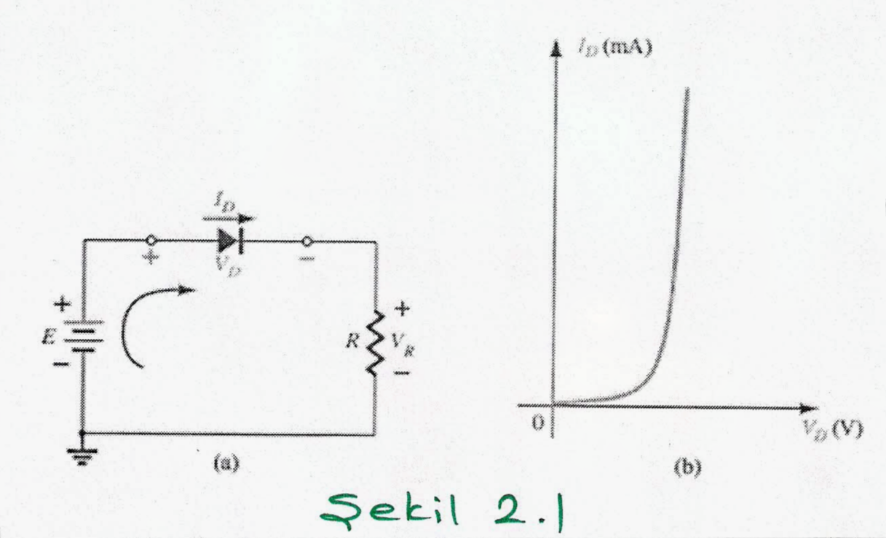

Yukarıdaki devrenin (a) çözülmesiyle akım ve gerilim seviyelerinin bulunması mümkün olacaktır.

Şekil 2.2'de ise diyot karakteristikleri, eksenler üzerinde yer almıştır. Şekildeki düz çizgi, **yük doğrusu** olarak adlandırılmıştır. Düşey eksen ile kesişimi uygulanan R yükü tarafından belirlendiği için bu ismi almıştır. Dolayısıyla bu analiz **YÜK DOĞRUSU ANALİZİ** adını alır.

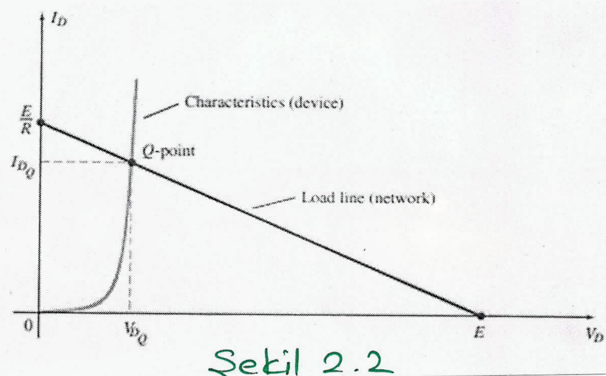

İki eğrinin kesişimi (karakteristik eğrisi ile yük doğrusunun kesişimi) devrenin çözülmesi ve devrenin akım-gerilim seviyelerinin belirlenmesi için önemlidir.

Şekil 2.1 (a)'da verilen devrenin gerilim ve akım ifadeleri yazılırsa;
Kirchhoff'un gerilim kanunundan;

$E - V_{D} - V_{R} = 0$
$E = V_{D} + V_{R}$
$E = V_{D} + I_{D} \cdot R$  (2.1)

Buradaki $V_D$ ve $I_D$ Şekil 2.2 eksen değişkenleridir.

Karakteristik üzerinde yük doğrusunun kesişim noktasını belirlemek için iki basit yaklaşım yeterli olacaktır:

* Yatay eksende $I_{D}=0~A$ noktası
* Düşey eksende $V_{D}=0~V$ noktası

Eşitlik (2.1)'de $V_{D}=0~V$ alınarak $I_D$ için çözüm yapılırsa;

$E = V_{D} + I_{D} \cdot R$
$E = 0 + I_{D} \cdot R$
$I_{D} = \frac{E}{R}|_{V_{D}=0~V}$ (2.2)

Benzer şekilde $I_{D}=0~A$ alınırsa,

$E = V_{D} + I_{D} \cdot R$
$E = V_{D} + (0~A) \cdot R$
$V_{D} = E|_{I_{D}=0~A}$ (2.3)

İki eğrinin kesiştiği nokta ise **ÇALIŞMA NOKTASI (quiescent point - Q noktası)** olarak adlandırılır.

$V_{DQ}$ diyot gerilimidir.

İki eğrinin kesişiminde elde edilen çözüm aşağıdaki gibi ifade edilebilir;

$I_{D} = \frac{E}{R} - \frac{V_{D}}{R}$
$I_{D} = I_{S}(e^{V_{D}/nV_{T}} - 1)$

---

#### ÖRNEK 2.1.

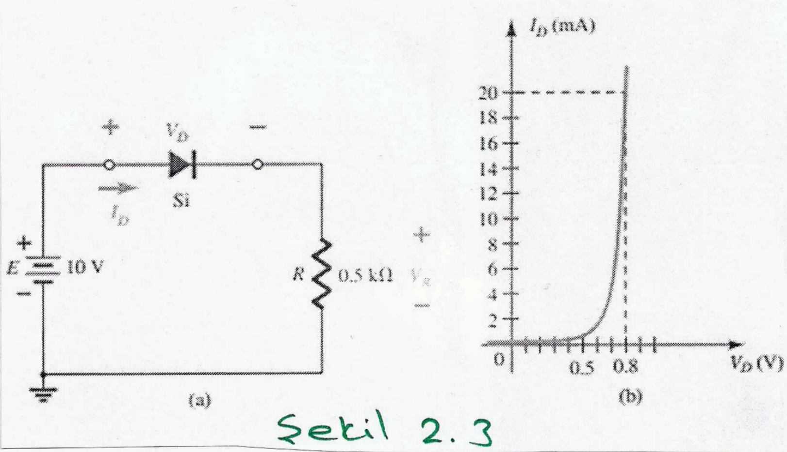

DİYOT, Non-lineer karakteristiğe sahip

a) $V_{DQ}$ ve $I_{DQ}$
b) $V_R$
değerlerini belirleyin.

Eşitlik 2.2'den
$I_{D} = \frac{E}{R}|_{V_{D}=0~V} = \frac{10~V}{0.5k~\Omega} = 20mA$

Eşitlik 2.3'ten
$V_{D} = E|_{I_{D}=0A} = 10~V$

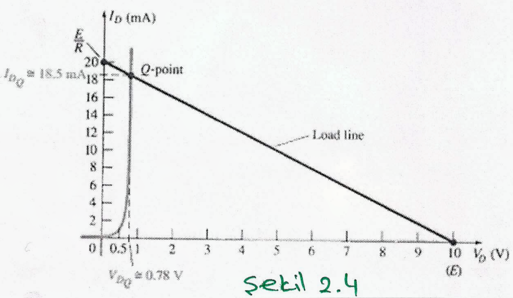

Elde edilen değerlere göre yük-doğrusu çizilirse Karakteristik eğri ile kesişim noktalarından (Q);

$V_{DQ} \cong 0.78~V$
$I_{DQ} \cong 18.5mA$

b) $V_{R} = E - V_{D} = 10V - 0.78V = 9.22~V$

Örnekte verilen devrenin DC direnci, 1. bölümde $R_{DC} = V_{D} / I_{D}$ olarak tanımlanmıştı.
Q çalışma noktası için DC direnci;

$R_{D} = \frac{V_{DQ}}{I_{DQ}} = \frac{0.78V}{18.5mA} = 42.16~\Omega$

Bu çalışma şartları için eşdeğer devre;

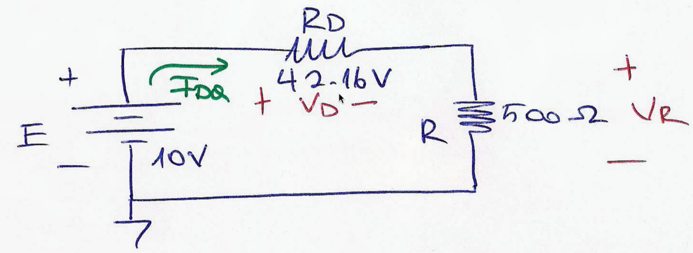
Akım; $I_{D} = \frac{E}{R_{D}+R} = \frac{10~V}{42.16~\Omega+500~\Omega} = \frac{10~V}{542.16~\Omega} = 18.5mA$

$V_{R} = E \cdot \frac{R}{R_{D}+R} = 10~V \cdot (\frac{500~\Omega}{542.16~\Omega}) = 9.22V$

Sonuçlar Örnek 2.1'de elde edilen sonuçlar ile eşleşmiştir. DC çalışma noktası bir kez belirlendikten sonra, DC direnç eşdeğeri ile yer değiştirilebilir. Bu eşdeğer model ile yer değiştirme konsepti önemlidir, özellikle AC giriş ve tranzistörlerin eşdeğer modelleri göz önünde bulundurulduğunda kullanılacaktır.

---

#### Örnek 2.2

Örnek 2.1'i Silikon yarı-iletken diyot için basitleştirilmiş eşdeğer devre kullanarak yeniden çözünüz.
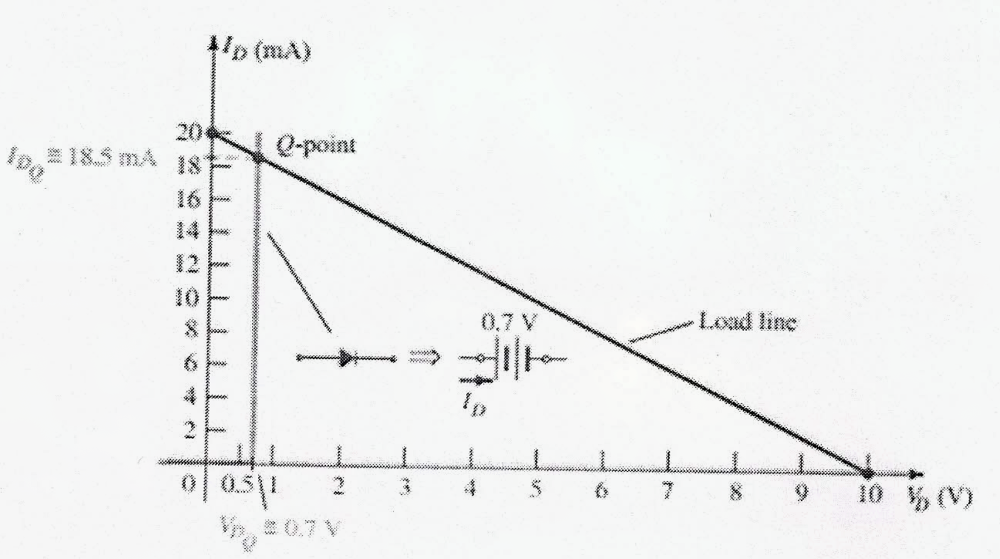

Yük doğrusu önceki örnekle aynıdır. Basitleştirilmiş eşdeğer devre karakteristiği ile kesiştiği Q noktasında;

$V_{DQ} = 0.7V$
$I_{DQ} = 18.5mA$

Örnek 2.1 ve Örnek 2.2 sonuçları incelenirse $I_{DQ}$ akımları tam olarak aynıdır. $V_{D}=0.7~V$ değeri ise Örnek 2.1'de $V_{D}=0.78V$ olarak elde edilmişti. Aradaki fark sadece yüzde bir kadar farklıdır.

AVANTAJ: Basitleştirilmiş eşdeğer devre çizmek daha kolay.

Q noktasının DC rezistansı;

$R_{D} = \frac{V_{DQ}}{I_{DQ}} = \frac{0.7V}{18.5mA} = 37.81~\Omega$

Bu sonuçta parçalı-lineer eşdeğer devre (full-tam karakteristik) ile elde edilen sonuca oldukça yakındır.

---

#### Örnek 2.3

Örnek 2.1'i ideal diyot modelini kullanarak yeniden çözünüz.
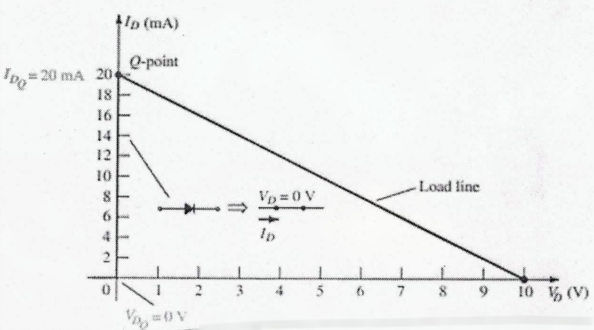
Yük doğrusu aynıdır. İdeal karakteristik ile yük doğrusu düşey eksende kesişirler.

$V_{DQ} = 0V$
$I_{DQ} = 20mA$

Elde edilen sonuçlar örnek 2.1'den oldukça farklıdır.

$R_{D} = \frac{V_{DQ}}{I_{DQ}} = \frac{0~V}{20mA} = 0~\Omega$ (kısa-devre)

---

### 2.2. SERİ DİYOT UYGULAMALARI

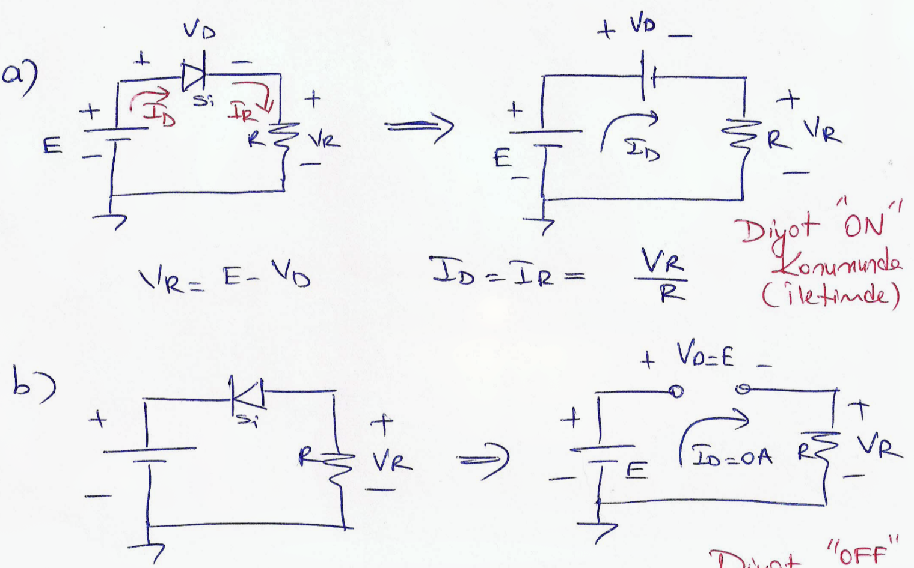
**Diyot "ON" Konumunda (İletimde)**
$V_{R} = E - V_{D}$
$I_{D} = I_{R} = \frac{V_R}{R}$

**Diyot "OFF" Konumunda (Tıkamada)**
$I_{D} = I_{R} = 0~A$
$V_{R} = 0~V$
$V_{D} = E$ (Açık devre olduğu için $V_O = V_D = E$)

---

#### ÖRNEK 2.4.

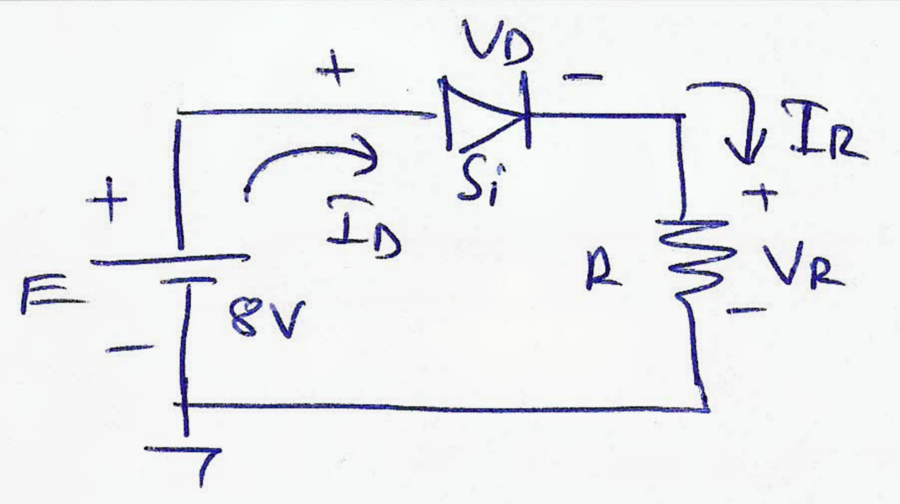

$V_D, V_R$ ve $I_D = ?$

$V_{D} = 0.7~V$ (Silisyum olduğu için)
$V_{R} = E - V_{D} = 8V - 0.7V = 7.3~V$
$I_{D} = I_{R} = \frac{7.3V}{2.2~k\Omega} \cong 3.3~mA$

* Bu soruda diyot ters çevrilseydi;
    $I_{D} = I_{R} = 0A$
    $V_{R} = I_{R} \cdot R = 0V$
    $E - V_{D} - V_{R} = 0$
    $V_{D} = E - V_{R} = E - 0 = 8~V$

---
#### ÖRNEK 2.5.

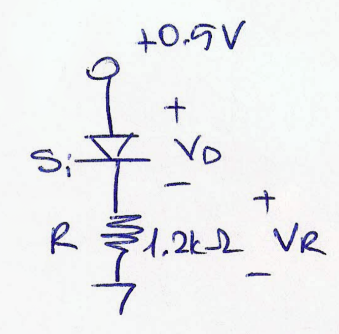
$V_D, V_R$ ve $I_D = ?$

Uygulanan voltaj (gerilim) Silisyum diyodu iletime geçirmeye yeterli olmadığı için ($E = 0.5V < 0.7V$) diyot üzerinden akım geçmeyecek.
$I_{D} = 0~A$
$I_{D} = I_{R} = 0~A$
$V_{R} = I_{R} \cdot R = 0~V$
$V_{D} = E = 0.5~V$

$E=0.5~V$ için çalışma noktasının gösterimi
$V_D=0.5V$ (Bu noktada $I_D=0~A$)

---

#### ÖRNEK 2.6
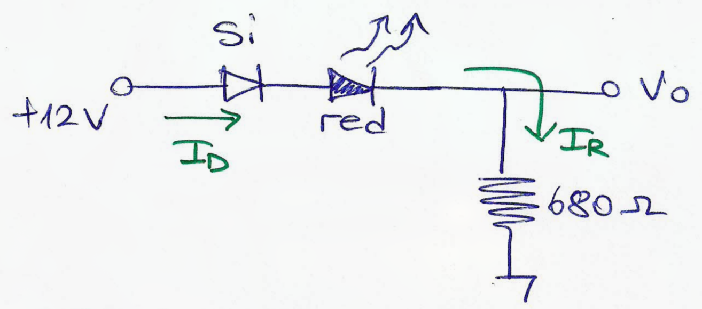
$V_o, I_D = ?$

EK BİLGİ: LED için (Light-Emitting Diodes)

| RENK | Tipik Gerilim (V) |
| :--- | :--- |
| Mavi | 5.0 |
| Yeşil | 2.2 |
| Kırmızı | 1.8 |
| Beyaz | 4.1 |
| Sarı | 2.1 |

Uygulanan E gerilimi (12V), iki diyodun eşik gerilimlerinin toplamından $(0.7V + 1.8V = 2.5V)$ büyük olduğu için diyotlar iletime geçer.

$V_{o} = E - V_{D1} - V_{D2}$
$V_{o} = 12V - 2.5V = 9.5V$
$I_{D} = I_{R} = \frac{V_{R}}{R} = \frac{V_{o}}{R} = \frac{9.5~V}{680~\Omega} = 13.97~mA$

---

#### ÖRNEK 2.7
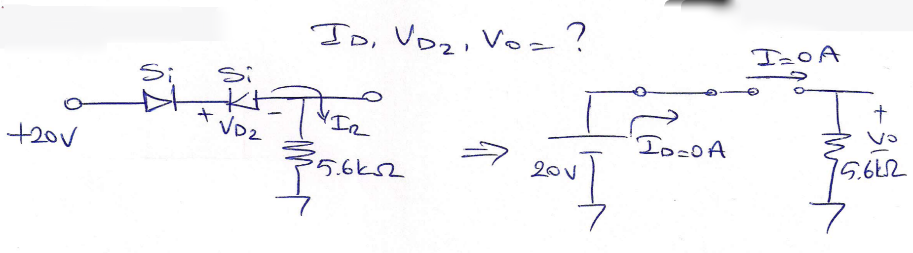
$I_D, V_{D2}, V_o = ?$

Diyot $D_1$ (Si) iletimde, $D_2$ (Si) ters polarmalı ve tıkamada. Bu nedenle devreden akım geçmez.

$I = 0~A$
$I_D = 0~A$
$V_{D1} = 0~V$ (İdeal olarak, akım akmadığı için $V_R$ = 0, Si diyot iletime geçemez)
$V_o = I_D \cdot R = 0V$
$V_{D2} = V_{açık~devre} = E = 20~V$

---

#### ÖRNEK 2.8
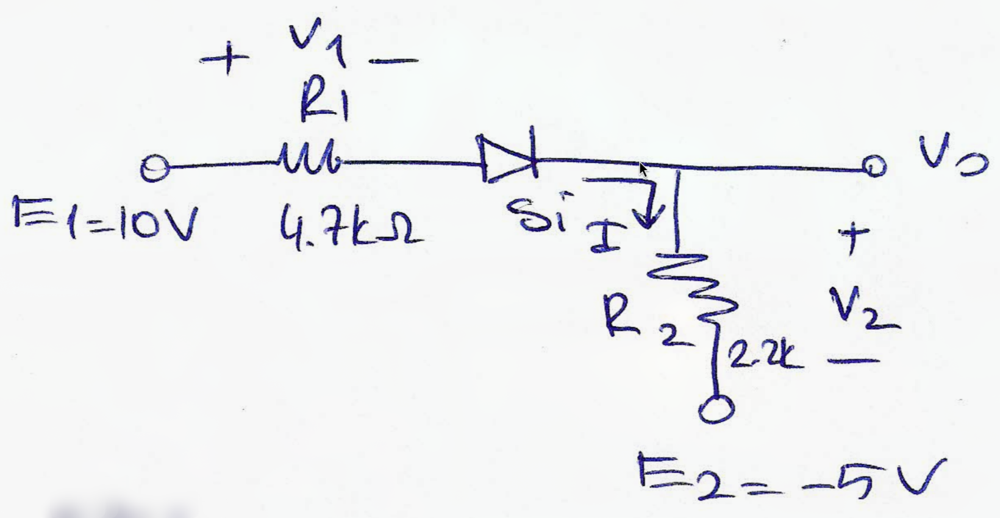
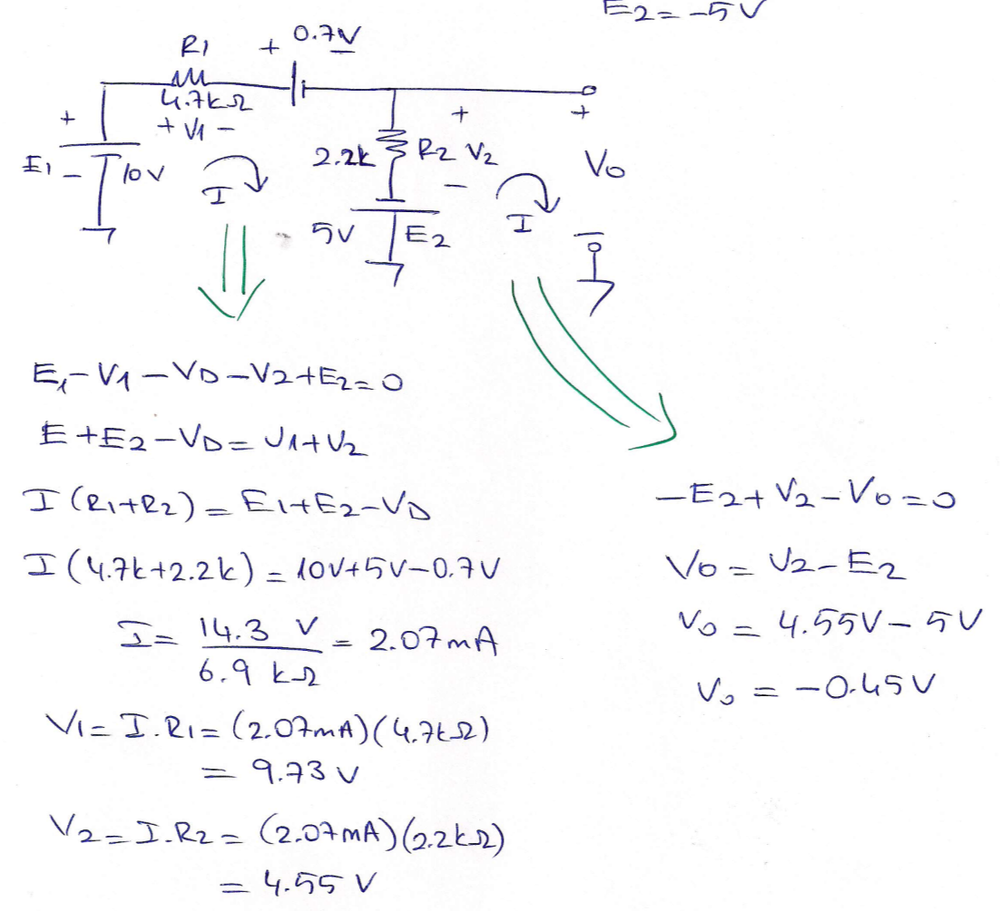

---

#### ÖRNEK 2.9
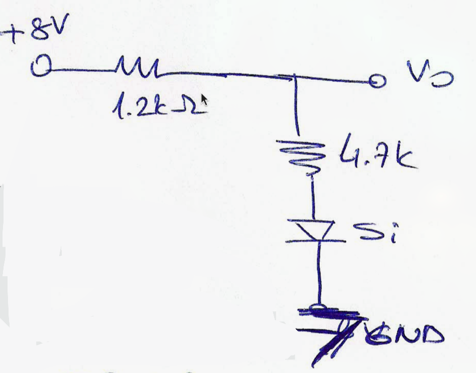
$V_o, I_D = ?$

$I_D = \frac{(8 - 0.7)V}{(1.2 + 4.7)k\Omega} = \frac{7.3V}{5.9k\Omega} = 1.24mA$
$V_{o} = V_{4.7k\Omega} + V_{D} = (1.24mA \times 4.7k\Omega) + 0.7V = 5.83V + 0.7V = 6.53 V$

---

#### ÖRNEK 2.10
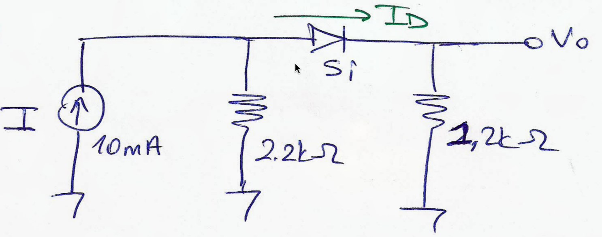
$I_D, V_o = ?$

10mA'lik akım kaynağı ve 2.2kΩ'luk direncin Thevenin eşdeğerinden;
$V_{TH} = 10mA \cdot 2.2k\Omega = 22V$
$R_{TH} = 2.2k\Omega$
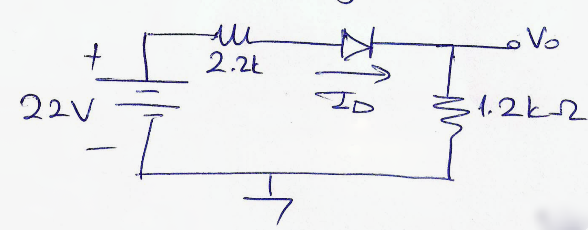
$I_{D} = \frac{V_{TH} - V_D}{R_{TH} + R_L} = \frac{22~V - 0.7~V}{2.2k\Omega + 1.2~k\Omega} = \frac{21.3V}{3.4k\Omega}$
$I_{D} = 6.26mA$

$V_{0} = I_{D} \cdot (1.2k\Omega)$
$V_{0} = (6.26mA)(1.2~k\Omega)$
$V_{0} = 7.51~V$

---

### 2.3 PARALEL DİYOT UYGULAMALARI

#### ÖRNEK 2.11
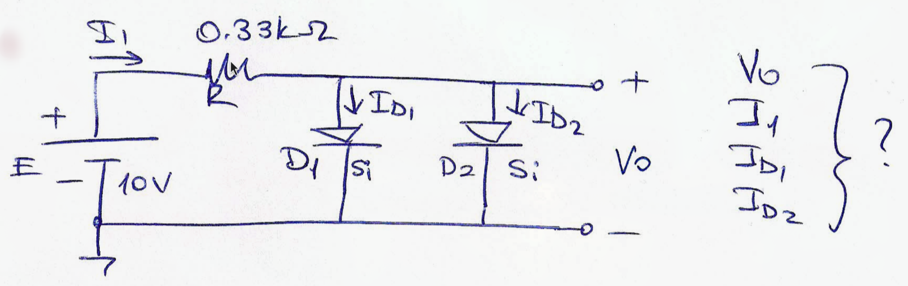
$V_o, I_1, I_{D1}, I_{D2} = ?$

$V_o$ gerilimi diyotlara paralel ucun gerilimi olduğu için (iki diyot da Si ve iletimde):
$V_{0} = V_{D2} = V_{D1} = 0.7~V$

$I_{1} = \frac{V_{R}}{R} = \frac{E - V_{D}}{R} = \frac{10V - 0.7V}{0.33k\Omega} = 28.18mA$

Diyotlar özdeş olduğu için akım paylaşılır:
$I_{D1} = I_{D2} = I_1 / 2 = 28.18mA / 2 = 14.09mA$

(DIYOTLARIN ANMA AKIMI 20mA OLSAYDI, DİYOT [TEK OLSAYDI] YANACAKTI. PARALEL BAĞLAYARAK AKIMLARINI KÜÇÜLTTÜK.)

---

#### ÖRNEK 2.12.
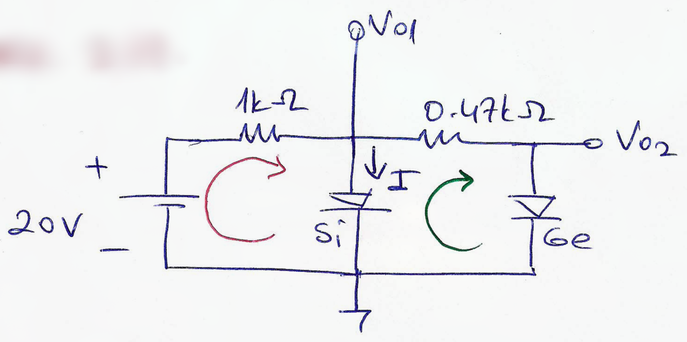
$V_{o1}, V_{o2}, I = ?$

Devrede hem Si (0.7V) hem de Ge (0.3V) diyot paralel. Düşük eşik gerilimine sahip olan Ge diyodu $0.3V$ ile iletime geçer ve paralel kolun gerilimini $0.3V$'a kilitler. Bu gerilim ($0.3V$), Si diyodunu (0.7V) iletime geçirmek için yetersizdir. Bu nedenle Si diyodu TIKAMADA kalır, Ge diyodu İLETİMDE olur.

*Ancak, belgedeki çözüm her iki diyodun da iletimde olduğunu varsaymış.* Belgedeki çözüme göre:
(Bu, $V_{o1}$ ve $V_{o2}$'nin farklı düğüm gerilimleri olduğu varsayımına dayanır - Şekil 2.12'deki devre şeması.)

$V_{o1} = 0.7V$ (Si diyodun düğüm gerilimi)
$V_{o2} = 0.3V$ (Ge diyodun düğüm gerilimi)

$I_{1k\Omega} = \frac{20V - V_{o1}}{1k\Omega} = \frac{20V - 0.7V}{1k\Omega} = 19.3~mA$
$I_{0.47k\Omega} = \frac{V_{o1} - V_{o2}}{0.47k\Omega} = \frac{0.7V - 0.3V}{0.47k\Omega} = 0.851mA$

$I$ akımı silisyum diyot (akımı $I_{1k\Omega}$) ile $0.47k\Omega$ direnç (akımı $I_{0.47k\Omega}$) üzerindeki akımların farkıdır (Kirchhoff Akım Kanunu).
$I = I_{1k\Omega} - I_{0.47k\Omega} = 19.3~mA - 0.851~mA$
$I = 18.45mA$

---

#### ÖRNEK 2.13
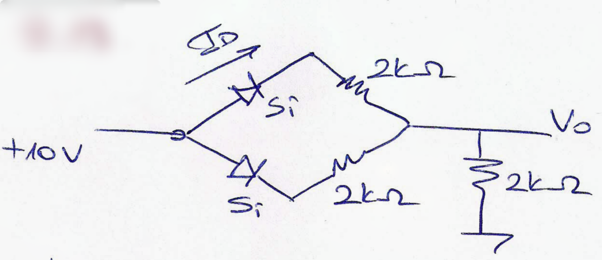
$I_D, V_o = ?$

Sol koldaki 10V, 2kΩ ve 2kΩ'luk kısmın $V_o$ noktasındaki Thevenin eşdeğeri:
$V_{TH} = 10V \cdot \frac{2k\Omega}{2k\Omega + 2k\Omega} = 5V$
$R_{TH} = \frac{2k\Omega \cdot 2k\Omega}{2k\Omega + 2k\Omega} = 1k\Omega$

Bu eşdeğer devre, Si diyot ve $V_o$ çıkışındaki 2kΩ'luk yüke bağlanır.
Oluşan devrede:
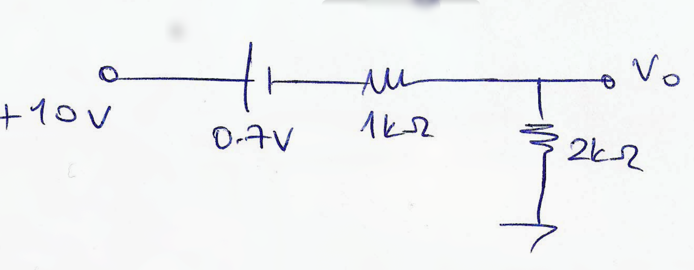
$I_D$ (diyot ve yük kolundan akan toplam akım) = $\frac{V_{TH} - V_D}{R_{TH}} = \frac{5V - 0.7V}{1k\Omega} = 4.3mA$

 *Belgedeki çözüm farklı bir yol izlemiş (Gerilim Bölücü):*
$V_o$ gerilimi; gerilim bölücü yaklaşımından;
(Burada $V_{TH} = (10V - 0.7V)$ alınmış gibi görünüyor, bu hatalı bir yaklaşım. Ancak belgedeki hesabı takip ediyoruz)
$V_o = (10V - 0.7V) \cdot \frac{2k\Omega}{1k\Omega + 2k\Omega} = 9.3V \cdot \frac{2}{3}$
$V_o = 6.2V$

$I_{2k\Omega} = \frac{V_o}{2k\Omega} = \frac{6.2V}{2k\Omega} = 3.1mA$
(Paralel koldaki $I_D$, diğer 2kΩ'luk koldaki akıma eşit varsayılmış)
$I_D = 1.55mA$ (Belgede 1.59mA olarak yazılmış)

---

## 2.3 PARALEL DİYOT UYGULAMALARI

### ÖRNEK 2.11
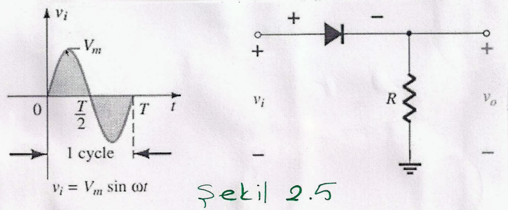
Devre: $E = 10 \text{ V}$, $R = 0.33 \text{ k}\Omega$, paralel bağlı iki Si Diyot ($D_1$ ve $D_2$).
$V_O, I_{D1}, I_{D2} = ?$

Çözüm:
$V_O$ gerilimi diyotlara paralel ucun gerilimi olduğu için (Si diyotlar):
$$V_O = V_{D1} = V_{D2} = 0.7 \text{ V}$$

Direnç üzerindeki gerilim:
$$V_R = E - V_O = 10 \text{ V} - 0.7 \text{ V} = 9.3 \text{ V}$$
Toplam akım ($I_1$):
$$I_1 = \frac{V_R}{R} = \frac{9.3 \text{ V}}{0.33 \text{ k}\Omega} = 28.18 \text{ mA}$$

Diyotlar özdeş olduğu varsayılarak akım paylaşılır:
$$I_{D1} = I_{D2} = \frac{I_1}{2} = \frac{28.18 \text{ mA}}{2} = 14.09 \text{ mA}$$

(NOT: DIYOTLARIN ANMA AKIMI 20mA OLSAYDI, (tek diyot olsaydı $I_D=28.18 \text{ mA}$ olurdu) DİYOT YANACAKTI. PARALEL BAĞLAYARAK AKIMLARINI KÜÇÜLTTÜK.)

---

### ÖRNEK 2.12

Devre: $E = 20 \text{ V}$, $R_1 = 1 \text{ k}\Omega$, $D_1$ (Si)
$D_1$'in katodundan $R_2 = 0.47 \text{ k}\Omega$ ve $D_2$ (Ge) seri olarak toprağa bağlı.
$V_{o1}$ (Si diyotun katodundaki voltaj), $V_{o2}$ (Ge diyotun anodundaki voltaj) = ?
$I$ ( $D_1$ (Si) üzerinden geçen akım) = ?

Çözüm:
(Metindeki $V_{o1}$ ve $V_{o2}$ diyotlar üzerindeki gerilimler olarak varsayılmış, ancak diyagramda düğüm voltajlarıdır. Hesaplamalar $V_{D1} = 0.7 \text{ V}$ ve $V_{D2} = 0.3 \text{ V}$ kabulüne göredir.)

İki diyot da iletimde olduğu için:
$V_{D1} = 0.7 \text{ V}$ (Si)
$V_{D2} = 0.3 \text{ V}$ (Ge)

$R_1$ üzerindeki akım ($I_{1k\Omega}$):
(Si diyotun anodu ile $R_1$ arasındaki düğümün voltajı $V_{o1}$ olsun)
$V_{o1}$ (Si diyotun katodundaki voltaj) = $V_{o2}$ (Ge diyotun anodundaki voltaj)
$V_{o1} = V_{D2} = 0.3 \text{ V}$
Bu varsayım metindeki hesaplamayla çelişiyor. Metindeki hesaplamayı takip edersek:
Metin $V_{o1}$ (Si diyotun katodundaki düğüm voltajı) = $0.7 \text{ V}$ ve $V_{o2}$ (Ge diyotun anodundaki düğüm voltajı) = $0.3 \text{ V}$ kabul etmiş görünüyor. Bu fiziksel olarak tutarsız.

Metindeki hesabı olduğu gibi alırsak:
(Varsayım: $V_{o1}$ (düğüm) = $0.7 \text{ V}$ ve $V_{o2}$ (düğüm) = $0.3 \text{ V}$)
$$I_{1k\Omega} = \frac{20 \text{ V} - V_{o1}}{1 \text{ k}\Omega} = \frac{20 \text{ V} - 0.7 \text{ V}}{1 \text{ k}\Omega} = 19.3 \text{ mA}$$
$$I_{0.47k\Omega} = \frac{V_{o1} - V_{o2}}{0.47 \text{ k}\Omega} = \frac{0.7 \text{ V} - 0.3 \text{ V}}{0.47 \text{ k}\Omega} = 0.851 \text{ mA}$$
$I$ akımı silisyum diyot üzerindeki akımdır (KCL @ $V_{o1}$):
$$I = I_{1k\Omega} - I_{0.47k\Omega} = 19.3 \text{ mA} - 0.851 \text{ mA} = 18.45 \text{ mA}$$

---

### ÖRNEK 2.13

Devre: $E = 10 \text{ V}$, $R_1 = 1 \text{ k}\Omega$.
Çıkış düğümü $V_O$'dan paralel iki kol:
1) $D_1$ (Si)
2) $R_2 = 2 \text{ k}\Omega$
$I_D, V_O = ?$

(Not: Metindeki çözüm elektronik prensiplerine göre hatalı görünmektedir. Diyot $V_O$'ı $0.7 \text{ V}$'a kenetler. Ancak metindeki çözüm aşağıdadır.)

Metin Çözümü:
$V_O$ gerilimi; gerilim bölücü yaklaşımından;
$$V_O = (10 \text{ V} - 0.7 \text{ V}) \cdot \frac{2 \text{ k}\Omega}{2 \text{ k}\Omega + 1 \text{ k}\Omega}$$
$$V_O = (9.3 \text{ V}) \cdot \left(\frac{2}{3}\right) = 6.2 \text{ V}$$

$$I_{2k\Omega} = \frac{V_O}{2 \text{ k}\Omega} = \frac{6.2 \text{ V}}{2 \text{ k}\Omega} = 3.1 \text{ mA}$$
(Metin $I_D$'yi $I_{2k\Omega}$'un yarısı olarak almış, bu da hatalı bir varsayımdır.)
$$I_D = \frac{I_{2k\Omega}}{2} = \frac{3.1}{2} = 1.55 \text{ mA}$$

---
### 2.4. AC GİRİŞLİ DİYOT UYGULAMALARI

#### 2.4.1. YARIM DALGA DOĞRULTUCU

(Giriş sinyali: $v_i = V_m \sin(\omega t)$)

(Şekil 2.5)

İdeal diyot modeli için Şekil 2.5'te yer alan devreye $v_i$ sinyalinin uygulanması sonucunda $0 - T/2$ ve $T/2 - T$ periyotları için Şekil 2.6 elde edilir.

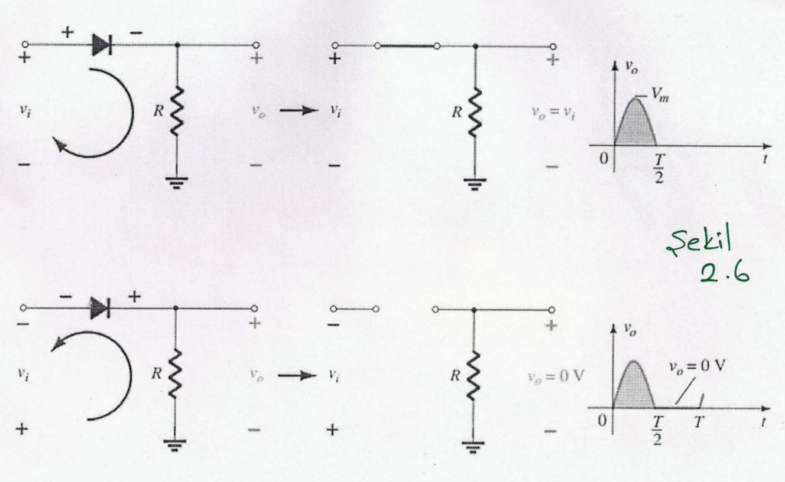

* **$0 - T/2$ periyodu (Pozitif alternans):** Diyot "ON" (ilet
imde). Devre kısa devre gibi davranır.
    $v_o = v_i$
* **$T/2 - T$ periyodu (Negatif alternans):** Diyot "OFF" (tıkamada). Devre açık devre gibi davranır.
    $v_o = 0V$
---
özet: Gemini-2.5 Pro
editör: — ÇAKAR
kontrol: 
