# KONYA TEKNIK ÜNIVERSITESI MÜHENDISLIK VE DOĞA BILIMLERI FAKÜLTESI ELEKTRIK-ELEKTRONIK MÜHENDISLIG̈I BÖLÜMÜ

1202311 TEMEL ELEKTRIK VE ÖLCME LABORATUVARI DENEY FÖYÜ

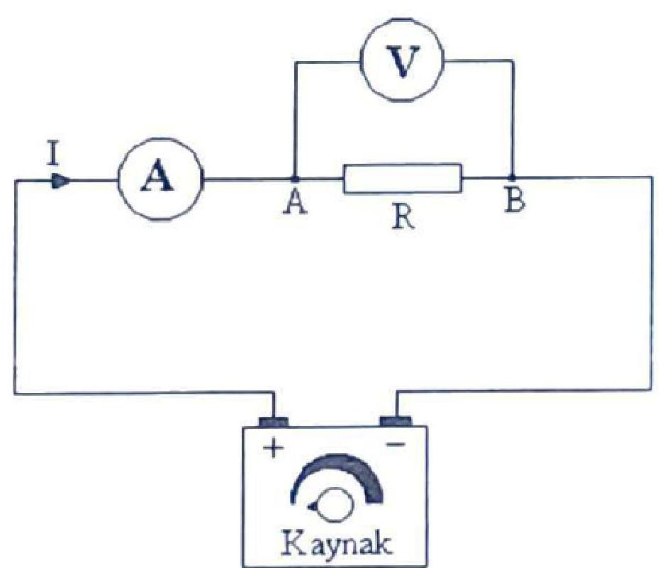

Hazirlayan:
Öğr. Gör. Dr. Yalçın EZGINCI
Dr. Öğr. Üyesi Dilek UZER

# LABORATUVAR ÇALIŞMA KURALLARI

1. Deneylere 5 dakikadan fazla geç gelen öğrenci yok yazılacaktır.
2. Deney fọyu olmayan öğrenciler kesinlikle deneye alınmayacak ve o hafta devamsız sayılacaklardır.
3. Her öğrenci deneye gelmeden önce föye çalışacaktır. Deney öncesinde veya deney sırasında öğrencinin deneyle ilgili bilgisi ölçülecektir.
4. Deneye normal zamanında gelmeyen öğrenci diğer gruplar ile deney yapamaz. İki defa deneye katılmayan öğrenci devamsızlıktan kalır.
5. Öğrencinin deney tarihinden önce sorumlu öğretim elemanı ile irtibat kurarak, uygun mazeret göstermesi koşuluyla, başka bir grupta deney yapma isteği değerlendirilir. Mazereti uygun görülürse deney tarihi değişikliği yapılır. Öğrenci vaat ettiği tarihte gelmez ise devamsiz sayılır.
6. Dersin devamını almış, dersi alttan alan öğrencilerin de derse katılmaları zorunludur.

# IÇiNDEKILER

1. "Temel Elektrik Devrelerinin Kurulumu" ..... 1
2. "Devre Doğrudan ve Dolaylı Ölçümler Yoluyla Akım, Voltaj, Direnç ve Güç ..... 9
Değerlerinin Ölçülmesi ve Hata Hesabı"
3. "Alternatif Akımda Akım, Gerilim, Güç, Cosф ve Enerji Ölçümü" ..... 14
4. "Osiloskop ve Alternatif Akım Dalga Şekillerinin İncelenmesi. Genlik, Frekans ve ..... 20
Faz Farkı Ölçümleri, Ortalama ve Etkin Değerler"
5. "Direnç Renk Kodları, Deney Tahtası, CADET Deney Seti ve Multimetre Kullanımı" ..... 26
6. "Elektromıknatısın Demiri Çekmesi ve Çekme Kuvvetinin Hesabı" / ..... 32
"Elektromanyetik İndüksiyon"

# Deney 1. Temel Elektrik Devrelerinin Kurulumu

Deneyin Amacı: Elektrik devresinin bileşenlerini tanımak, elektrik devresi kurmak ve Analog ölçü aletleri ile direnç, akım ve gerilim ölçmek

Öğrenme Çıktıları: Elektrik devresinin bileşenlerini seçebilme, Elektrik devresini kapalı çevrimini anlama, Elektrik devresi kurabilme, Akım ve Gerilim Ölçme

## Teorik Bilgi: Elektrik Devresi

Bir elektrik devresi, iletken teller (kablolar) kullanılarak alıcıların ısı, ışık veya mekanik güç sağlamak üzere kullanılır. Aydınlatmadan haberleşmeye ve endüstride iş ve kuvvet üretmeye kadar hayatın her alanında kullandığımız elektrik, elektronik ve bilgisayar sistemlerinin temelinde elektrik devreleri vardır. Temel bir elektrik devresi güç kaynağı, anahtar, direnç bileşenlerine sahip alıcılar (yükler) ve bunları birbirine belli bir düzende birleştiren iletken tellerden meydana gelir. Elektrik akımı, bir elektrik devresinde bileşenler tam bir çevrim oluşturduğunda akabilir. Akımın akması ve işe yaraması için bileşenlerin doğru bir şekilde belirli bir bilgi ve mantığa göre birbirine bağlanması gerekir. Bir el fenerine enerji küçük bir pil ile sağlanırken, evde veya iş yerinde cihazlar elektrik santralinin sağladığı elektriğe ihtiyaç duyar. Bakır ve alüminyum teller iletken görevini görür. Güç kaynağı Bir devrede kabloların hem pozitif ( + ) hem de negatif (-) uçlara bağlı olduğu, pil gibi bir güç kaynağına ihtiyacı vardır. Günlük hayatta kullandığımız elektrik, etkisi ile hayati riskler taşır. Bu nedenle iletim hatları insanlardan uzak ve yüksek enerji hatları, direkleri ile taşınır. Ev veya iş ortamında ise insanlara ve diğer nesnelere zarar vermeyecek şekilde plastikle kaplanmıştır.
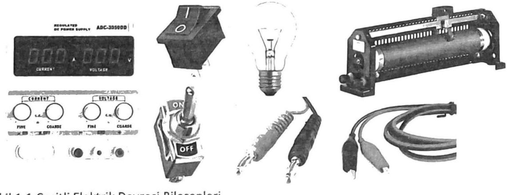

Şekil 1.1 Çeşitli Elektrik Devresi Bileşenleri
Güç Kaynağı: Herhangi bir enerjiyi elektrik enerjisine dönüştüren sistemlere elektrik enerji kaynağı denir. Doğru akım kaynakları, Akümülatör, pil, dinamo. Alternatif akım kaynakları şehir şebekesi, jeneratör, alternatör ve sinyal kaynağı.

Anahtarlar, Elektrik devrelerinde elektrik akımının kontrolü anahtarlar ile sağlanır. Anahtar devreye seri bağlı olarak yerleştirilir. Anahtar aç ve kapa konumlarına sahiptir. Kapa konumunda devreden akım akar ve iş üretilir. Aç konumunda ise devrenin çevrimi açılır, devre diğer bileşenlerinden ayrilır. Bu durumda devreden akım akmaz.

Sigorta: Elektrik devrelerinden geçen akım şiddeti, bazen istenilmeyen değerlere yükselebilir. Bu gibi durumlarda devre elemanları hasar görebilir. Akım şiddetinin belli bir değerin üstüne çıkmasını önlemek için devreye sigorta bağlanır.

Alıcı ya da Yük: Elektrik enerjisini başka bir enerjiye dönüştüren cihazlara alıcı ya da yük denir. Ütü, lamba, elektrik sobası, radyo, elektrik motoru v.s. olabilir.

İletkenler: İletkenler, geçirgenliği yüksek olan bakır, alüminyum gibi metallerden genellikle yuvarlak, kare ya da dikdörtgen kesitli olarak yapılırlar. Bunlar, elektrik devresindeki elemanları birbirine bağlamak amacıyla kullanılırlar. Iletkenlerin çeşitli şartlar altında hangi özelliklere sahip olması gerektiği standartlarla belirlenmiştir. Bunlardan birisi, iletkenin akım taşıma kapasitesidir. Sıcaklığa dayalı bu değer, iletkenin bileşenlerinin bozulmadan sağlıklı bir şekilde işlevini yerine getirmesi için üzerinden geçebilecek azami akımı ifade eder. Sürgülü Reosta, Ayarlı Direnç: Devredeki akım ve voltaj değişikliklerini kontrol etmek için kullanılabilir (Şekil 1.2.a). Reostanın direnç teli genellikle yüksek erime noktasına ve yüksek dirence sahip nikel-krom alaşımıdır. Sürgülü reosta direnç telinin yalıtımlı porselen silindir üzerine sarılmasıyla elde edilmiştir. Genellikle 100-5000 ve birkaç ampere göre hazırlanmıştır. Etiketinde bu durum belirtilir. Ayar sürgüsü direnç telinin uzunluğunu değiştirerek devredeki direnci değiştirir, böylece devredeki akımı kademeli olarak değiştirir.
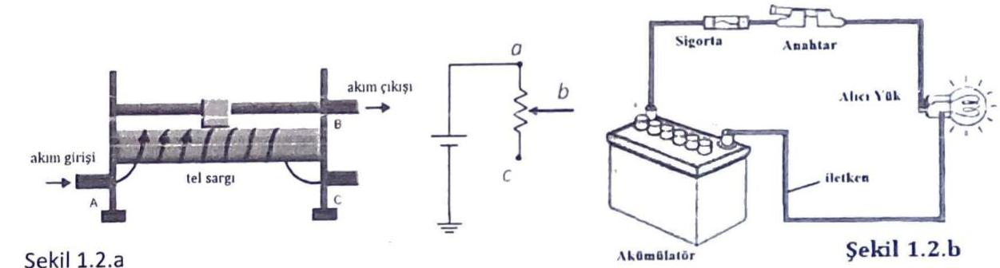

Elektrik devreleri, motor ve lamba gibi çalıştırdıkları alıcılara, uygulanan gerilimin büyüklüğüne göre alçak gerilim devresi, orta gerilim devresi ve yüksek gerilim devresi veya devreden geçen akımın şiddetine göre hafif akım devresi ve kuvvetli akım devresi gibi çeşitlere ayrılabilir. Ayrıca bu devreler, devreden akımın geçip geçmemesine göre de açık devre, kapalı devre ve kısa devre olarak adlandırılabilirler. Kapalı devre, Bu devre alıcının içinden normal bir akım geçtiği ve alıcının normal olarak çalıştığı devredir. Böyle bir devre şekil 1.2.b' te verilmiştir. Temel bir elektrik devresi Şekil 1.2.b'de temsili resmi gösterilen temel elektrik devresi güç (Voltaj) kaynağı (pil), anahtar ve alıcı (ampul)'dan meydana gelir. Devreden akımın akması ve devrenin doğru çalışması için devre kapalı bir çevrim oluşturmalıdır. Devrede ampul flamanından ışık için voltaj değeri belirli bir değere gelmesi ulaşması gerekir. Devreden akım akmaya başlayıp artırıldığında, ampulün flamanı ısınması ile birlikte ışık vermeye başlayacaktır. Akım artırıldığında ışık miktarı artar. Lambanın kullanım voltajında en parlak ışık elde edilir, voltaj aşılırsa parlaklık gittikçe artar ve flaman yanarak devre kopar.

Şekil 1.3.a'da görüldüğü gibi akımın geçtiği yolun bir parçası açık, diğer bileşenlerden ayrılmışsa ve akım devresini tamamlamıyor ise bu gibi devrelere açık devre denir. Başka bir tanımla, akımın geçeceği yolun direnci sonsuz ise o devre açık devredir. Direnci sonsuz olan devre, açık devre

olduğuna göre bu gibi devrelerden geçecek akım da sıfır olur. Açık devre hali, ya bir iletken yardımıyla ya da bir yük (lamba gibi) bağlamak suretiyle giderilebilir.
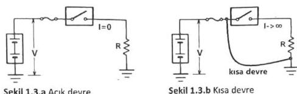

Şekil 1.3.b'de ise gerilim kaynağı terminallerinin ya doğrudan ya da iletkenler vasıtasıyla bir birine temas etmesi durumuna kısa devre denir. Başka bir deyişle kısa devre, devredeki yük ile bir iletkenin paralel bağlanmış halidir. Teorik olarak, kısa devre durumundaki direnç değeri yaklaşık sıfır olduğundan devreden geçecek akım da sonsuz olacaktır.

Pratik çalışma 1: Doğru akım devresi kurmak
DENEYIN YAPILIŞI:
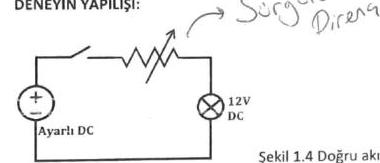

Şekil 1.4 Doğru akım deney devresi

1. Deney devresi Şekil 1.4'de verilmiştir. Uygun devre elemanları şeçilir. Verilen bileşenlerin uygunluğu incelenir. Uygun kablolar kullanılarak devre bağlantısı gerçekleştirilir. Güç kaynağını devreye bağlamadan önce (boşta iken) çalışmasını kontrol ediniz. Reostayı yüksek değere getiriniz.
2. Deney bağlantılarınızı, sorumlu öğretim elemanına kontrol ettiriniz.
3. Sorumlu öğretim elemanı gözetiminde elektrik devresine enerji veriniz. Direnç değerini yavaş yavaş azaltarak, sıfıra gelinceye kadar lamba ışığının artmasını gözleyiniz.
4. Güç kaynağının Voltaj değerini yükselterek gözleminize devam ediniz. 12 V olduğunda bu defa direnç değerini tekrar yavaş yavaş artırınız.
5. Güç kaynağını kapatarak deneyi sonlandırın.

Pratik çalışma 2: iletkenin cinsi ve boyutlarına göre direncinin değişimini incelemek
Elektrik direnci, elektrik akımının geçişine karşı koyan etkidir ve ohm kanunu ile ifade edilir. Ohm, uçlarına 1 voltluk bir gerilim uygulandığı zaman 1 amperlik akım geçiren bir iletkenin direncidir. $R=\frac{V}{I}$

Akımın bir devreden geçme kolaylığının bir ölçümü olan (1/R)'ye ise iletkenlik denir. Iletkenlik G ile gösterilir. Iletkenlik birimi ise siemens (S) dir. Bir iletkenin $R$ ile göstermekte olduğumuz direncinin, sabit bir sıcaklıkta direnç değeri öz direnç ve boyut değerlerine bağlıdır.

| $R=\rho \frac{l}{S}$ | $l$, uzunluk ( $m$ )   $\rho\left(\Omega \mathrm{mm}^{2} / \mathrm{m}\right)$ cinsinde malzemenin cinsine bağlı olan özdireng katsayısı |
| :-- | :-- |

Tablo1'de verilmiştir.
Tablo 1. Bazı metal malzemelerin özdireng ( $\rho$ ) değerleri

| Madde | Özdirenç   ( $\Omega \cdot \mathrm{m}) 20^{\circ} \mathrm{C}$ | Sıcaklik   katsayis $\left(\mathrm{K}^{-1}\right)$ |
| :-- | :-- | :-- |
| Gümüş | $1.59 \cdot 10^{-8}$ | 0.0038 |
| Bakır | $1.72 \cdot 10^{-8}$ | 0.0039 |
| Altin | $2.44 \cdot 10^{-8}$ | 0.0034 |
| Alüminyum | $2.82 \cdot 10^{-8}$ | 0.0039 |

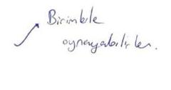

Elektrik sistemi, kullanılan yere göre çeşitli kesit ve gerilim seviyelerine sahip iletken kablolar ile birleştirilir. Kablo tipleri kullanılacağı ortam ve şartlara göre, kesiti ise üzerinden geçecek akım değerine göre hesaplanır. Bir iletkenin boyutlandırıması için akım taşıma kapasitesi bilinmelidir. Bu değer, iletkenin içi direnci nedeniyle geçecek akımın oluşturacağı ısı ( $I^{2} R$ kayıpları) nedeniyle belli bir sıcaklık artışını aşmayacak şekilde hesaplanır.
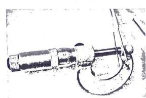

Kablo Kesiti Hesabı:
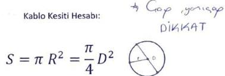

Şekil 1.5: Mikrometre ile tel çapı ölçmek

| Iletken kesiti hesaplanırken   $n-P_{1}$ sayis1   $R$-iletken çapı   $n=$ Kullanilan iletken sayis1   $\left(n, R^{2}, n\right) / 4$ formulu ile hesaplanır. | Örnek: 3 mm çapında 7 telin bukumu ile oluşturulan iletkenın kesiti nedir?   $n, R^{2}, n / 4$   $\left(3,14,3^{2}, 7\right) / 4$   $-197,82 / 4$   $-49,45 \mathrm{~mm}^{2}=50 \mathrm{~mm}^{2}$ |
| :-- | :-- |

lletken telin kesiti bakır, alüminyum veya çelik olmasına göre akım taşıma kapasitesi veya diğer şartlara göre standartlarla belirlenmiştir. Örnek olarak; $25^{\circ} \mathrm{C}^{\prime}$ de bakır tel için

Tablo 1.2 Bakır tel Akım Taşıma Kapasiteleri

| Iletken kesiti (mm2) | 1 | 1.5 | 2.5 | 4 | 6 | 10 | 16 | 25 | 50 | 70 | 120 | 150 |
| :-- | :-- | :-- | :-- | :-- | :-- | :-- | :-- | :-- | :-- | :-- | :-- | :-- |
| Akım Taşıma kapasitesi (Amper) | 15 | 18 | 26 | 38 | 44 | 68 | 80 | 109 | 163 | 202 | 285 | 320 |

Deneyin Yapılışı: Verilen farklı boyutlardaki tellerin direncini hesaplama

1. Tel kesitini hesaplamak için verilecek telin çapını kumpas veya mikrometre (mekanik veya elektronik olabilir) ölçmesini yapınız. (Şekil 1.5)
2. Aşağıda verilen formüle göre tel kesitini hesaplayınız.
3. Seçtiğiniz tellerin en fazla ne kadar akım taşıyabileceğine Tablo 2'ye bakarak karar veriniz.

# Pratik çalışma 3: Galvanometre yapısı ve Direnç Ölçmek

Elektrik devrelerine bir önceki deneyde belirtilen devre elemanlarından başka, çeşitli devre büyüklüklerinin ölçülmesi amacıyla ölçü aletleri de bağlanabilir. Bunlar Ampermetre, Voltmetre veya Ohmmetre olabilir. Bu ölçü aletlerinin temeli analog galvanometre ye dayanmaktadır. Bu aşamada Galvanometre kullanarak Ampermetre, Voltmetre veya Ohmmetre ölçü aletlerinin nasıl meydana geldiğine bakacağız. Şekil 1.4 Galvanometre ve Paralel tipte Ohmmetrenin açık şeması, Ohmmetre olarak konumlanmış bir analog Multimetreyi göstermektedir.
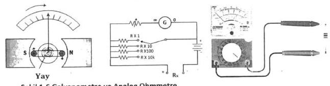

## DENEYIN YAPILIŞI

1. Farklı özellik ve farklı boyutlardaki tel veya kablolar alınız. Her birinin özelliklerini ve boyutlarını not ediniz.
2. Her bir tel ve kablonun direnç değerlerini Şekil 1.6'de gösterildiği gibi ohmmetre ile ölçerek not ediniz. 3. Ölçtüğünüz değerler ve iletken teller için yorum yapınız. Sonucu özetle ifade ediniz.

## Pratik çalışma 4: Analog Ampermetre ve Voltmetre Yapısı, DC Akım ve Gerilimin ölçülmesi

Akım, elektrik devresinde birim zamanda geçen elektron yükü miktarına denir, I harfi ile gösterilir ve birimi Amper (A)'dir. Devre akımı, akım yoluna seri bağlanan Ampermetre ile ölçülür. Ampermetrenin devre akımına etkisi az olması için iç direncinin çok küçük olması gerekir. Bunun için galvanometreye az sarımlı kalın tellerden yapılmış şönt (paralel) direnç bağlanır (Şekil 1.7.a). Ampermetre devreye paralel bağlanırsa kısa devre etkisi yaparak devreden çok yüksek akım geçişine ve ölçü aletinin yanmasına sebep olabilir.

Potansiyel farkı, elektrik yüklerinin bir noktadan başka bir noktaya hareket edebilmesi için gerekli olan elektriksel kuvvet olarak tanımlanır, V harfi ile gösterilir ve birimi Volt (V)'tur. Gerilim, direncin iki ucu arasındaki potansiyel farktır. Bir bileşenin potansiyel farkı veya gerilimi, ona paralel bağlanan voltmetre ile ölçülür. Voltmetrenin devreyi kısa devre etmemesi için ise iç direncini çok büyük olması gerekir. Bunun için Galvanometreye çok sarımlı ince tellerden yapılan

seri direnç bağlanır (Şekil 1.7.b). Voltmetre devreye seri bağlanırsa iç direnci çok büyük olduğu için devreden akım geçirmez ve açık devreye dönüştürür.
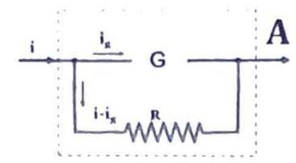

Şekil 1.7.a Ampermetre Teşkili
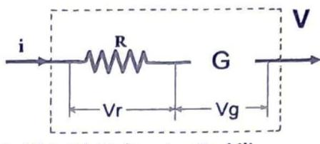

Şekil 1.7.b Voltmetre Teşkili

# Deneyin Yapılışı

1. Şekil 1.8.a'daki devre için $0-12 \mathrm{~V}$ DC. kaynak ve $0,6-1,2$ A değerlerini ölçebilecek Ampermetre Yük olarak bu değerlere uygun, wattlı dirençleri direnç kutusundan seçilecektir.
2. Şekil 1.8.a'daki devreyi kurunuz. Devreye güç vermeden önce aşağıdaki uyarıları dikkate alınız. Elektrik devrelerinde akım ampermetre kullanılarak ölçülür.

Ampermetreler devreye yanlışlıkla paralel bağlanırsa alet yanabilir. Ampermetrenin iç direnci çok küçük olduğundan böyle bir bağlantıda kısa devre etkisi görülür. Devreden büyük bir akım geçeceğinden devre sigortası atar veya alet yanabilir. Dijital ampermetreler içinde aynı durum geçerlidir. Özel hallerde ölçme alanı büyük ampermetreler ile, kuru pillerin kısa devre akımları ölçülebilir. Ölçme kısa zamanda yapılmazsa pil boşalır.
3. Şekil 1.8.b'daki devre için kademeli bir voltmetre seçiniz. Yine direnç kutusundan direnç seçiniz.
4. Şekil 1.8.b'daki devreyi kurunuz. Devreye güç vermeden önce aşağıdaki uyarıları dikkate alınız. Elektrik devrelerinde gerilim voltmetre kullanılarak ölçülür.

Voltmetreler yanlışlıkla devreye seri bağlanırsa iç dirençleri çok büyük olduğundan devrenin toplam direncini artırırlar. Alıcı gerilimi düşer, akımı çok azalır ve çalışamaz. Fakat voltmetre bundan zarar görmez. Voltmetreler devreye kesinlikle seri bağlanmazlar.
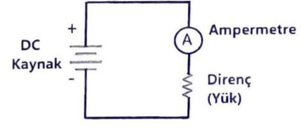

Şekil 1.8.a Ampermetre ile akım ölçme
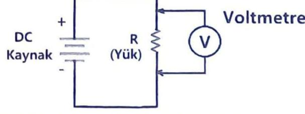

Şekil 1.8.b Voltmetre ile gerilim ölçme

## Pratik çalışma 5: Alternatif Akımda (AC) AKIM VE GERILIMIN ÖLÇÜLMESi

Bu bölümde AC gerilim kaynağı olarak Varyak kullanılacaktır. Varyak 220 V şebeke voltajını genellikle daha küçük istenilen bir AC voltaja çeviren bir çeşit nevi ayarlı transformatördür (Şekil 1.9.a). Değişken AC gerilim değerleri elde etmek için kullanılır ve genellikle tek sargılı bakır telin toroidal bir sac nüvesine sarılmasıyla elde edilir. Bu sayede tek sargısından primer ve sekonder davranışı elde edilir.

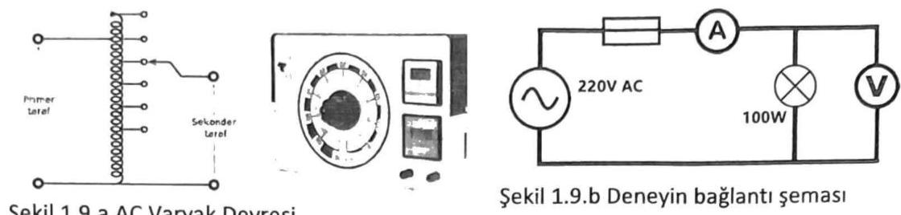

Şekil 1.9.a AC Varyak Devresi

# DENEYIN YAPILIŞI

1. Şekil 1.6 ile verilen deney bağlantı şemasını uygun elemanlar ile kurunuz.
2. Devreye uygulanacak gerilim ve yükün gücü belli olduğuna göre, devreden geçecek akımı ve yük uçlarındaki gerilimi yaklaşık olarak hesaplayınız.
3. Kullanacağınız aletler, hesapladığınız değerlere uygun mu? Kontrol ediniz.
4. Bağlantı doğru ve aletlerin ölçme alanları uygun ise, bağlantınızı bir de sorumlu öğretim elemanına kontrol ettiriniz.
5. Devrenize enerji veriniz. Aletlerden okuduğunuz değerleri, önceden hazırladığınız tabloya yazınız.
6. Kaynak olarak çıkış gerilimi ayarlanabilir bir kaynak, yük olarak da bir reosta kullanarak deneyi tekrarlayınız. Küçükten büyüğe doğru aldığınız değerleri tablo şeklinde kaydediniz.

## Pratik çalışma 5: Sigorta telinin incelenmesi

Tesisattaki iletkenlerin kullanım akımları ve ince bir iletken telin akım geçirilerek kopması deneyi (ergime akımı ) Elektrik tesislerinde kullanılan iletkenler, belli bir akıma kadar dayanırlar. Daha yüksek değerli akımlarda ise ısınır, kızarır ve ergirler. Bu ergime akım şiddetinin değerine göre çabuk veya yavaş yavaş olur. Buşonlu sigortalar bu özellikten faydalanılarak yapılırlar.

Elektrik sigortası, üzerinden aşırı akım geçtiğinde devreyi açan elemanlardır. Bunun yanında elektrik sistemlerinde aşırı sıcaklıklar, kısa devre ve güç dalgalanmaları gibi potansiyel tehlikeleri ortadan kaldıran, besleme hatlarını ve aynı zamanda sigortayı kullanan kişileri olası kazalara karşı koruyan birimdir. Devrelerin giriş bölümünde yer alır. Amper olarak sınıflandırılır. (6A, 10A, 16A, 25A,63A gibi)

Sigortalar, devre akımının belirli bir değeri aşması ile eriyen tel (veya şerit), yada üzerinde akım geçen bir bimetalin akım fazla olduğunda bir kontağı açması ile bir rölenin elektromıknatıs ile çekmesi (otomatik sigorta) suretiyle bağlantıyı kesmesi esasına göre çalışır. Buna sigorta attı tabiri kullanılır. Eriyen tel değiştirilmekle, otomat şalteri kaldırılmak suretiyle sigorta tekrar hazır hale getirilir. Çeşitli şerit tipleri Şekil 1'de görülmektedir. Sigortalar yapıları ve kullanıldıkları yerlere göre çok çeşitlidir. Sigortalar kullanım yerlerine göre

1. Cam Tipi Sigortalar,
2. Buşon Tipi Sigortalar,
3. Otomatik Sigortalar,
4. Bıçaklı Tip Sigortalar,
5. Yüksek Gerilim Sigortaları.

Cam Tipi Sigortalar : Bu sigorta Elektrik cihazları ve elektronik devrelerde kullanılır. Cam içerisinde dayanacağı akım şiddetine göre bir tel veya metal şerit bulunmaktadır.

Buşon Tipi Sigortalar : Bu sigorta tipi ise elektrik tesisatlarının korunması amacıyla alçak gerilimli şebekelerde kullanılır. Porselen ile yalıtılmış Buşon, akım değerine göre seçilmiş Viskontak, gövde ve kapaktan oluşur. Buşon maksimum akım değerine göre seçilecek ve eridiği zaman yenisiyle değiştirilecektir. Porselen izolatör içinde arkı önlemek için ince kuvars kum tanecikleri kullanılmaktadır.

Otomatik Sigortalar: Bu tip sigortalarda üzerinden geçen akım sınır değeri aştığında içerideki bimetal bükülmesini tamamlayarak sigortayı attırır.

Bıçaklı Tip Sigortalar: Bu tip sigortalar büyük akımlarda kullanılırlar. Sanayide motorları ve büyük güçlü alıcıları korumak için kullanılırlar. Bıçak sigortanın çalışma prensibi eriyen telli sigortalar.
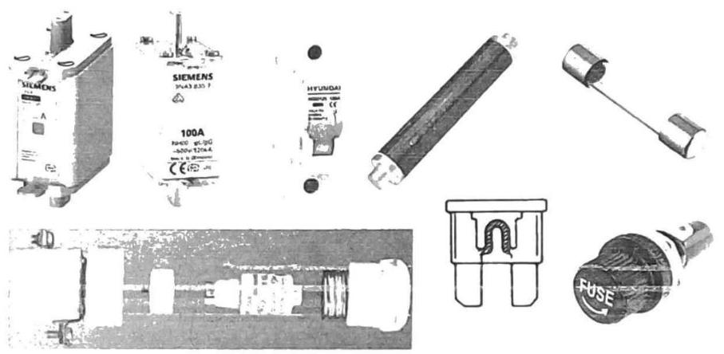

Şekil 1.10 Çeşitli sigorta tipleri
Devreyi açma zamanlarına göre sigortalar: Normal, Gecikmeli, Hızlı ve çok hızlı özellikli olabilir.
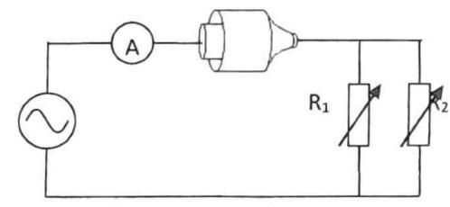

Şekil 1.11. Deneyin bağlantı şeması

# Deneyin Yapılışı

1. Şekil 1.11'deki devre bağlantısını kurunuz.
2. Devrede kullanılan reosta (ayarlı direnç) taşıyabileceği maksimum akıma göre direnç değerlerini seçin.
3. Damarlı bir kablonun bir damarını keserek deney noktasına monte edin.
4. Ayarlı gerilim kaynağından (Varyak), gerilimi sıfırdan itibaren yavaş yavaş artırırken akımın akmasını takip edin, telin kızarmaya başladığında daha da yavaş hareket ettirerek erime anına kadar akım ve gerilim değerlerini kaydedin.
5. Aynı işlemi iki tel damarı kullanarak tekrarlayın. Sonucu yorumlayın.

Deney 2. Devre doğrudan ve dolaylı ölçümler yoluyla Akım, Voltaj, Direnç ve Güç değerlerinin Ölçülmesi ve hata hesabı

Deneyin Amacı: Temel elektrik devrelerinde Ampermetre ve Voltmetre ile Akım ve Gerilimin ölçülmesi, Direnç ve Güç değerlerinin hesaplama yoluyla bulunması, yapılan ölçümlerdeki hata miktarlarının hesaplanması

# Ön Bilgi

Ölçme, bilinmeyen bir büyüklüğün aynı türden olan, ancak bilinen bir büyüklükle kıyaslanması ile elde edilen sayısal miktardır. Duruma ve kişiye göre değişmez. Aynı şartlarda tekrarlandığında aynı sonuçlar elde edilmelidir. Bu nedenle bilimsel bir anlamı vardır ve bu onu güvenilir yapar. Ölçme çeşitli yöntemlere yapılmış olabilir. Ölçülen özelliğin gerçek değeri ile ölçme sonuçlarında elde edilen değer arasındaki bir fark meydana gelir ki buna ölçmede hata denir. Hiçbir ölçüm hatasız yapılamaz. Aynı zamanda ölçüm mutlaka devreyi etkileyecek ve bir gecikme ile sonuç elde edilebilecektir. Bu nedenlerle ölçmede hedef, gerçek değere en yakın sonucu elde etmektir. Bunu sağlamak için Ölçü Aletinin doğru ve uygun seçilmesi gerekir. Ölçü aletleri 0,1-0,2-0,5-1- 1,5-2,5 yüzdelik doğruluk derecelerine sahip olabilir. Bir ölçümün sonucu hatası ile birlikte verilir. Bununla birlikte anlamlı rakamlarla ifade edilmesi gerekir.

Örnek olarak, 0,5 sınıfı bir voltmetrenin son skala taksimatı 400 volt ise bu ölçü aletinin yapabileceği en büyük ölçüm hatası; $\% 0,5 \times 400=0,005 \times 400=2$ volt olacaktır. Bu ölçü aleti bir gerilimi değerini örneğin 221 V gösteriyorsa ölçüm sonucu $\mathrm{V}=221 \pm 2 \mathrm{~V}$ olacaktır.

Bağıl hata; Ölçülen büyüklüğün gerçek değerinden yüzde kaçı kadar hatalı olduğunu verir. O halde bağıl hatayı azaltmak için ne yapılmalıdır?
$\% \varepsilon=\frac{\Delta V}{V} \times 100=\frac{4}{221} \times 100=\% 0,9$
Ölçüm aletlerinin duyarlılık sınırı olması, istatistik hatalar nedeniyle ve her ölçüm için sonuçta belirli sayıdaki rakamın sonuçta yer alması söz konusudur. Kesinliği bilinen rakamlar anlamlı rakamlar olarak adlandırılır. Şu örnekler dikkat edin (anlamlı rakamlar altı çizili olanlar)
$(0,055 ; 7,08)(10,00 ; 0,09340)(470000 ; 1000)$
Rakamları anlamlı hale dönüştürmede indirgeme yaparken ölçme değeri üzerinde kesme ve yuvarlama işlemleri yapilır.
$\zeta=2 . \pi . r=2 \times 3.141526 \ldots \times 12,4$ işlem yapıldıktan sonra sonuç, virgülden sonra tek rakamda kesilir. Yuvarlanacak sayı 5'ten büyük 1 artırılır, küçükse aynı kalır. Örnek: $1,26=1,3$ veya $5,5486=5,5$

## Hataların bileşkesi

Bir sonuç çok sayıda değişkene bağlı ise bu durumda hataların bileşkesi hesaplanır.
Genel ifadesi $\Delta Q=\sqrt{\left(\frac{d Q}{d x} \Delta x\right)^{2}+\left(\frac{d Q}{d y} \Delta y\right)^{2}+\left(\frac{d Q}{d z} \Delta z\right)^{*} \ldots}$ şeklindedir. Basit işlemler için;
Toplama - Çıkarmada; $\Delta Q \cong \Delta x+\Delta y$
Çarpma - Bölmede;
$\Delta Q \cong Q\left(\frac{\Delta x}{x}+\frac{\Delta y}{y}\right)$

# Akım Ve Gerilim Ölçme

DC Gerilim Kaynağı, Analog Ampermetre ve Voltmetreler \%05 ve \%2 sınıfı
Dirençler $10 \Omega, 20 \Omega$ vb. taş dirençler veya Reostalar
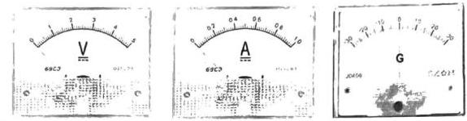

Şekil 1. Tablo tipi ölçü aletleri

## Deneyin Yapılışı (1. Bölüm)

1. Şekil 2'de verilen devre için gerekli malzemeleri hazırlayın, özelliklerini belirleyin.
2. Voltmetrelerin voltaj kademesi seçimini yapın.
3. Devrenin kurulumunu yapın, kontrol ettikten sonra Güç kaynağını 12 V oluncaya kadar artırın. Dirençlerin uçlarında gördüğünüz voltaj değerlerini kaydedin.
4. Ölçtüğünüz değerleri voltmetrelerin sınıfını göz önüne alarak hata değeri de olacak şekilde ölçüm sonucunu yazınız.
5. İki voltmetre ile ölçtüğünüz değerin toplamını hata hesabı ile birlikte yapınız.
6. Elde ettiğiniz sonucu, Güç kaynağının gösterdiği voltaj değeri ile karşılaştırın ve yorumlayın.
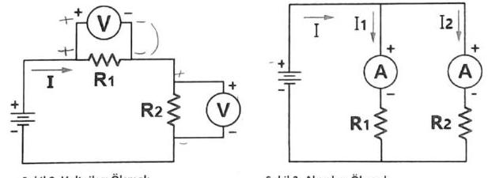

Şekil 3. Akımları Ölçmek
7. Şekil 3'de verilen devre için gerekli malzemeleri hazırlayın, özelliklerini belirleyin.
8. Ampermetreler için uygun kademe seçin.
9. Devrenin kurulumunu yapın, kontrol ettikten sonra Güç kaynağını 12 V oluncaya kadar artırın.
10. Devre kollarından geçen akım değerlerini kaydedin. Ölçtüğünüz değerleri Ampermetrelerin sınıfını göz önüne alarak hata değeri de olacak şekilde ölçüm sonucunu yazınız.
11. İi Ampermetre ile ölçtüğünüz değerin toplamını hata hesabı ile birlikte yapınız.
12. Elde ettiğiniz sonucu, Güç kaynağının gösterdiği akım değeri ile karşılaştırın ve yorumlayın.

# Güç Ölçme (Ampermetre ve Voltmetre ile)

DC Gerilim Kaynağı, Analog Ampermetre ve Voltmetreler \%05 ve \%2 sinıfı
Dirençler $10 \Omega, 20 \Omega$ vb. taş dirençler veya Reostalar

## Deneyin Yapılışı (2. Bölüm)

1. Şekil 4'de verilen devre için gerekli malzemeleri hazırlayın, özelliklerini belirleyin.
2. Devrenin kurulumunu yapın, kontrol ettikten sonra Güç kaynağının değerini devre akımı en az 1A ve tam okunabilecek bir değere kadar artırın. Bu anda Ampermetre ve Voltmetreden okuduğunuz değerleri kaydedin.
3. Ölçtüğünüz değerleri Ampermetre ve Voltmetrelerin sınıfını göz önüne alarak hata değeri de olacak şekilde ölçüm sonucunu yazınız.
4. Iki ölçü aleti ile ölçtüğünüz değeri kullanarak dirençte harcanan elektrik gücünü ve birleşik hata hesabını yaparak güç değerini ifade edin.
5. Elde ettiğiniz sonucu, Güç kaynağının gösterdiği değerler ile karşılaştırın ve yorumlayın.
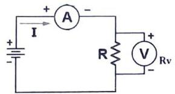

Şekil 4. Akım ve Gerilim yolluyla Direnç ve/veya Güç Ölçmek

## Direnç Ölçme

Direnci ölçmek için farklı yöntemler mevcuttur. Bileşen değerlerinin hassas ölçümleri köprü benzeri yapılar ile yapılabilmektedir. Direnç değerlerinin büyüklüğüne göre farklı yöntemler veya aletler kullanılmaktadır.

Değere bağlı olarak dirençler aşağıdaki üç kategoriye ayrılabilir:

1. Düşük direnç. Değeri $1 \Omega$ 'a eşit veya daha küçük olan dirençler düşük direnç olarak kabul edilirler. Makinelerin armatür sargıları, ampermetre şöntleri, kablolar, kontaklar vb. hepsi düşük direnç değerine sahiptir.
2. Orta direnç. Değerleri $1 \Omega$ ile $100 \mathrm{k} \Omega$ arasında değişen dirençler orta dirençler olarak kabul edilirler. Elektronik devrelerde kullanılan dirençler genellikle orta dirençli tiptedir.
3. Yüksek direnç. $100 \mathrm{k} \Omega$ 'ın üzerindeki değerlere sahip dirençler yüksek dirençlerdir.

Direnç ölçümünde kullanılan çeşitli yöntemler vardır. Bunlardan bazıları;
Düşük direnç: Ampermetre-Voltmetre Yöntemi
Orta Direnç: Wheatstone Köprü Yöntemi
Yüksek direnç: Megger

# Ampermetre-Voltmetre Yöntemi ile Direnç Ölçmek

Bu yöntem, \%1 düzeyindeki doğruluğun yeterli olduğu durumlarda düşük direnç değerini ölçmek için kullanılır. Ampermetre-voltmetre yöntemi, bilinmeyen bir direncin değerini belirlemek için basit ohm yasasını kullanır. Şekil 4 ampermetre-voltmetre yönteminin devre düzenini göstermektedir. Bilinmeyen dirençten (RX) geçen akım ve bunun üzerindeki potansiyel düşüş aynı anda ölçülür. Okumalar sırasıyla ampermetre ve voltmetre ile elde edilir. Voltmetre yalnızca direncin karşısına doğrudan bağlanır Voltmetre direncin üzerine doğrudan bağlandığında, ampermetre bilinmeyen direnç $R X$ ve voltmetreden geçen akımı ölçer. $R$ değeri ölçülen değerlerden hesaplanır. (R=V/I) Direncin gerçek değeri Rx, , hesaplanan $R$ değerinden daha küçüktür. (Rv, voltmetrenin iç direnci)
$R_{x}=\frac{R}{1-\frac{R}{R_{v}}}$

## Deneyin Yapılışı (3. Bölüm)

1. Şekil 4'de verilen devre için gerêkli malzemeleri hazırlayın, özelliklerini belirleyin.
2. Devrenin kurulumunu yapın, kontrol ettikten sonra Güç kaynağının değerini devre akımı en az 1A ve tam okunabilecek bir değere kadar artırın. Bu anda Ampermetre ve Voltmetreden okuduğunuz değerleri kaydedin.
3. Ölçtüğünüz değerleri Ampermetre ve Voltmetrelerin sınıfını göz önüne alarak hata değeri de olacak şekilde ölçüm sonucunu yazınız.
4. İki ölçü aleti ile ölçtüğünüz değeri kullanarak ve ohm kanununa uygun olarak direnç değerini bulun, hata hesabını yapınız. Sonucu ifade ediniz.
5. Elde ettiğiniz sonucu, Güç kaynağının gösterdiği değerler ile karşılaştırın ve yorumlayın.

## Wheatstone Köprü Devresi ile Direnç Ölçmek

Şekil 5.a, temel Wheatstone köprü devresini göstermektedir. Köprünün bir emf kaynağı ve bir sıfır dedektörüyle birlikte dört dirençli kolu vardır.
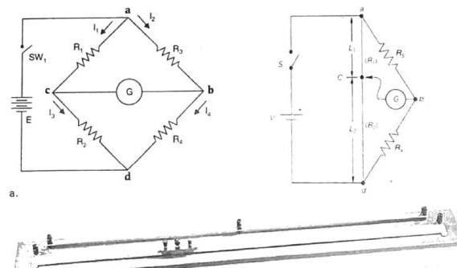

## Şekil 5

Şekil 5.b'de gösterildiği gibi Direnç ölçümü için R1 ve R2 dirençleri, C kontağının tel boyunca kaydırılmasıyla değiştirilir. Değişken direnç, galvanometre sıfırı okuyana kadar ayarlanır. Bu durumda değişken direnç ile komşusu arasındaki oran, bilinmeyen direnç ile komşusu arasındaki orana eşit olur ve bu, bilinmeyen direncin değerinin hesaplanmasını sağlar. Wheatstone köprü devresi, bilinmeyen bir direnci bilinen bir dirençle karşılaştırmak için kullanılır. Galvanometreden akım geçmediğinde köprünün dengeli olduğu söylenir. Denge kurulduğunda C'nin her iki tarafındaki L1 ve L2 uzunlukları kolaylikla okunur.

# Analiz

Sifır galvanometre sapması durumunda Vab=Vac benzer şekilde, Vbd=Vcd olacaktır. (Neden?)
Şu halde $I_{1} \cdot R_{x}=I_{2} \cdot R_{2}$ ve $I_{1} \cdot R_{x}=I_{2} \cdot R_{1} \quad$ yazılabilir. Akımlar çekilirse, bilinmeyen direnç değeri elde edilir.
$R_{x}=\frac{R_{2}}{R_{1}} \cdot R_{s}$
Direnç telinin uzunluğu direnç değeri ile orantılı olduğu için direnç oranı uzunlukların oranı ile eşdeğer kabul edilebilir. Dolayısıyla direnç oranı, uzunluk oranı cinsinden ifade edilebilir:
$\frac{R_{s}}{R_{1}}=\frac{L_{s}}{L_{1}}$ Bu durumda bilinmeyen direnç değeri;
$R_{x}=\frac{L_{s}}{L_{1}} \cdot R_{s}$ elde edilir.
Böylece köprünün bir tarafı olarak telin kullanılmasıyla L uzunluklarını ölçebildiğimiz oranda Rx değerini bulmamız mümkün olur.

## Deneyin Yapılışı (4. Bölüm)

Galvanometre (50-100 $\mu$ Ametre),
Değeri bilinen bir Direnç - Rs ( $100 \Omega-1 \mathrm{k} \Omega$ ), Tel direnç (Krom-Nikel)

1. Şekil 5.b'da verilen devre için gerekli malzemeleri hazırlayın, özelliklerini belirleyin.
2. Devrenin kurulumunu yapın, kontrol ettikten sonra Güç kaynağının değerini en az 10 V seviyesine kadar artırın.
3. Köprü üzerindeki hareketli kayan sürgü ucunu hareket ettirerek Galvanometrenin sapmalarını izleyin. Sapmanın sıfır olduğu noktada akımı kesin ve bu noktayı işaretleyin.
4. Şerit metre ile L1 Ve L2 uzunluklarını ölçünüz.
5. Ölçtüğünüz değerleri verilen formülde yerine koyarak bilinmeyen direnç değerini hesaplayın. Şerit metrede hata miktarını $0,5 \mathrm{~mm}$ alarak direncin toplam hatasını hesaplayın. Direnç ölçümünün sonucunu ifade edin.

# Deney 3: Alternatif akımda Akım, Gerilim, Güç, Cosф ve Enerji Ölçümü

Deneyin Amacı: Alternatif akım devrelerinde Analog Ampermetre, Voltmetre, wattmetre, Cosфmetre ve Enerji sayacının bağlantılarını ve ölçmelerini öğrenmek.

## ÖNBiLGi

Çok sayıdaki avantajları nedeniyle elektrik sistemlerinde Alternatif akım (AC)kullanılır. Alternatif akım, santraldeki alternatörün dairesel dönme hareketi sonucu 50 Hz frekansında ve sinüs dalga şeklinde elde edilir. Üretilen elektrik enerjisinin uzak yerlere iletimi ve dağıtımında transformatörler kullanılır. Ev ve iş yerlerinde kullandığımız elektrik enerjisinin genliği 220 volt tur.

## Alternatif Akımda Ani, Ortalama, Maksimum ve Etkin Değerler

AC devrelerinde akım ve gerilim zamana bağlı olarak (anlık) değişmektedir. Alternatif akımın, zamanın herhangi ir anındaki değerini ani değer denir. Akım veya Gerilimin ani değeri $V(t)=V_{m} * S i n \theta$ şeklinde verilir.
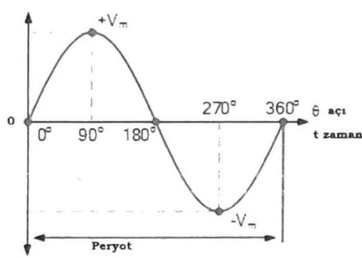

$$
\begin{aligned}
& V(t)=V_{m} * S i n \theta \\
& I(t)=I_{m} * S i n \theta \\
& V_{\text {art }}=\frac{1}{T} \int_{0}^{T} V(t) d t \\
& V_{\text {et }}=\sqrt{\frac{1}{T} \int_{0}^{T} V(t)^{2} d t}=\frac{V_{m}}{\sqrt{2}}
\end{aligned}
$$

Şekil 1. Alternatif akımın sinüsoydal değişimi, ani, ortalama ve etkin değerler
Ortalama değer, herhangi bir $u(t)$ fonksiyonun bir periyottaki ani değerlerinin ortalamasıdır. Alternatif akımın bir periyottaki pozitif ani değerlerin sayısı, negatif ani değerlerin sayısına eşit ve aynı büyüklükte olduğundan alternatif akımda ortalama değer sıfırdır.

Etkin (Efektif) Değer, Alternatif gerilimin en büyük değeri veya genliği, sinüs sinyalinin yukarıda tanımlanmış periyot süresi içerisinde aldığı en büyük değeri belirtir. Bu değer, 220 V'luk şebeke gerilimi için yaklaşık 311 volt'dur. Fakat bu genlik değeri, anma değeri olarak kullanılmaz. Bunun yerine alternatif akımın sinüs fonksiyonunun etkin değeri (rms) kullanılır. Alternatif akım devresinde endüktif yükler fazla olduğunda devre akımı toplam karmaşık direncin belirlediği bir açıda geri kalarak faz farkı oluşturacaktır. Faz farkı, iki ya da daha çok sinyalin birbirinden ileride ya da geride olduğu belirtilen ve bu farkın açı (radyan) veya zaman birimi olarak ifade edildiği durumdur. Devrede kapasitif dirençler ağırlıklı olduğunda ise bu defa akım belirli bir açıda gerilimden önde olacaktır. (Şekil 2)
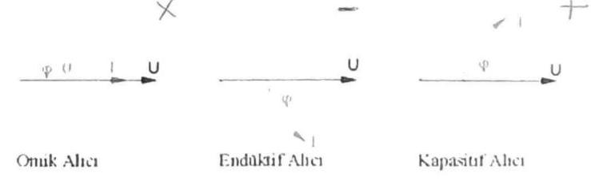

Şekil 2. Alternatif akımda alıcıların akım ve gerilim vektörleri ile faz farkı

Alternatif akımda saf bobinin oluşturduğu dirence Endüktif reaktans denir, XL ile ifade edilir ve birimi D'dur. Bobinin direnci alternatif gerilimin frekansına bağlı olarak değişmektedir. Tamamen endüktif bir yük, AC da sinüzoidal peryodun ilk çeyreğinde kaynak akımı manyetik alan oluşturmakta kullanması nedeniyle, bu dönüşümde devre gerilimi ile akımı arasında $90^{\circ}$ fark meydana gelir. (Şekil 3)
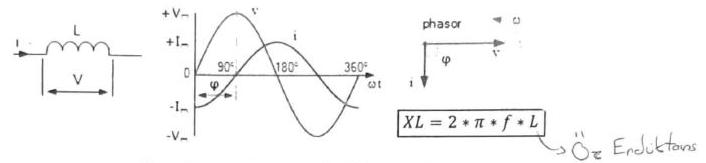

Şekil 3. Saf Bobinin oluşturduğu faz farkı ve direnci
Pratikte ise bobini iç omik direnci olması nedeniyle karmaşık yük olarak kendini gösterir. Karmaşık yüklerde RL ve C yük bileşenleri bulunabilir. Örnek olarak asenkron motorlar, elektromiknatıslar, bobinler, reaktörler, transformatörler, doğrultucular, tristör dönüştürücüler Endüktif yük bileşeni olan alıcılardır. İçerisinde kondansatör bulunan cihazlar pc, fax, printer, Tv gibi yükler de Kapasitif bileşenli alıcılardır. Pratikte bobinin iç direnci olmasından seri bir direnç endüktif dirence eklenir ve karmaşık bir direnç ortaya çıkarır. R-L devrede I akımı, V geriliminden $\phi\left(>90^{\circ}\right)$ faz açısı kadar geridedir. Uygulanan bir alternatif gerilim altında bu $R L$-devresinde akım dolaşmasına neden olan toplam direnç, endüktans ve omik direncin belirlediği toplam direnç vektörel olarak elde edilir ve endüktif empedans veya " $Z$ " empedansı olarak adlandırılır. Alternatif gerilim devrelerinde ohm kanunu için bu empedans değeri kullanilır. (Sckil 4)
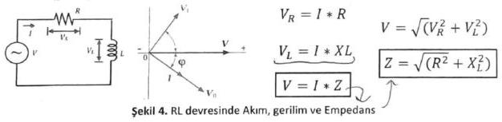

$$
\begin{aligned}
& V_{R}=I * R \\
& V=\sqrt{\left(V_{R}^{2}+V_{L}^{2}\right)} \\
& \frac{V_{L}=I * X L}{V=I * Z} \quad \frac{Z=\sqrt{\left(R^{2}+X_{L}^{2}\right)}}{}
\end{aligned}
$$

Şekil 4. RL devresinde Akım, gerilim ve Empedans

# Alternatif akımda Güç Ve Enerji

AC devrelerinde akım ve gerilim zamana bağlı olarak (anlık) değişmektedir. Dolayısıyla bunların çarpımı olan güç de zamanın bir fonksiyonu olarak pozitif ve negatif değerler alabilir. Buna ani güç denir. (Şekil 5) Pozitif güç değerleri kaynaktan devreye bir güç akışı olduğunu, negatif güç değerleri ise devreden kaynağa bir güç akışını ifade eder. AC devrede ani güç: $P(t)=V(t) x I(t)$
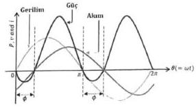

Şekil 5. AC de RL devresinde Akım, Gerilim ve Güç Değişimi

Dirençli (omik) devrelerde faz farkı sıfır ( $\varphi=0$ ) olduğu için akım ve gerilim birlikte pozitif ve negatif değerler almaktadır. Dolayısıyla akım ile gerilimin çarpımı olan anlık güç büyüklüğü de her zaman pozitiftir. Bunun anlamı dirençli devrelerde güç akışı sürekli kaynaktan yüke doğrudur. Direnç enerjiyi depolayamaz, sürekli olarak ısı ve ışık şeklinde harcar.
$R-L-C$ devre elemanlarından oluşmuş bir AC devresi sinüzoidal sürekli halde $Z$ empedansı ile ifade edilir. Devre empedansının iki bileşeni ( $R, X$ ) olduğu için buna bağlı olarak toplam gücünde iki bileşeni bulunur. Direnç elemanına ait olan ve toplam gücün reel bileşenini oluşturan kısma Aktif güç (P), bobin/kondansatör elemanlarına ait olan ve toplam gücün sanal bileşenini oluşturan kısma Reaktif güç (Q), her iki gücün toplamı olan devrenin gücüne de Görünür güç (S) denir. (Güç Üçgeni)

Bir AC devresinde; Aktif (ortalama) güç (P), kaynaktan çekilen toplam gücün devredeki direnç elemanları tarafindan harcanan kısmını ifade eder. Reaktif güç (Q), kondansatör ve bobin elemanları tarafından çekilmekte olup sadece depo edilir ve tekrar kaynağa gönderilir. Bu işlem bir peryotta iki kez yapılır. Dolayısıyla, kaynakla yük arasında sürekli olarak reaktif güç alışverişi yapılır. Görünür güç (S), kaynak gerilimi ile toplam devre akımının etkin değerlerinin çarpımına denir. AC devrede aktif güç Wattmetre ile reaktif güç ise Var metre ile ölçülür.
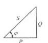

$$
\begin{aligned}
& P=V * I * \operatorname{Cos} \varphi \\
& Q=V * I * \operatorname{Sin} \varphi \\
& S=V * I
\end{aligned}
$$

$$
S=\sqrt{\left(P^{2}+Q^{2}\right)}
$$

# Wattmetre ve Cosipmetre

Elektrik devrelerinde alıcının harcadığı aktif gücü ölçmek için Wattmetre, hattaki akım ve gerilim arasındaki faz farkını ölçmek için Cosфmetre kullanılır. Her iki ölçme için Analog olarak genelde Elektrodinamik ölçü aleti kullanılır. Her iki ölçü aleti de benzer şekilde devredeki akım ve gerilimi ölçmekte ve bu değerleri ölçekleyerek sonucu göstermektedirler. Analog wattmetre, şekilde gösterildiği gibi sabit bobinler (devreye seri bağlanan akım bobinleri) diğeri devreye paralel bağlanan hareketli gerilim bobinine sahiptir. Akım bobini az sarımlı kalın kesitli, gerilim bobini ise çok sarımlı ince kesitlidir. Analog wattmetre devreye bağlanırken büyük güçlü
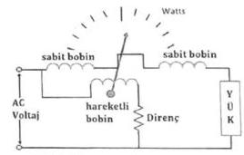

Şekil 6. Elektrodinamik Wattmetre
alıcılarda akım bobini önce, küçük güçlü alıcılarda akım bobini sonra bağlanmalıdır.

Elektrik enerjisi, belirli bir güçteki alıcının belirli bir sürede harcadığı işi ifade eder. Kullanılan elektrik enerjisi, elektrik sayaçları ile ölçülür. Birimi kilowattsaat ( kWh ) olarak ifade edilir.

$$
E=V * I * t=P * t(k W h)
$$

Analog elektrik enerji sayacı genelde indüksiyon yöntemine göre çalışır. Harcanan enerji ile orantılı olarak bir diskin dönmesi ile numaratöre ekleme yapılarak ölçüm sağlanır.

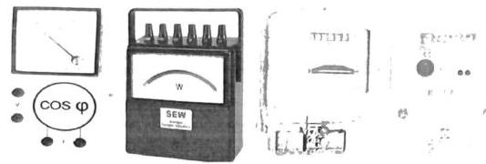

Şekil 7. Deneyde kullanılan Ölçü Aletleri
Blr kwh lik enerji için diskin kaç devir yapması gerektiği sayaçların etiketinde yazılıdır. Bir sayacın etiketinde 1200 devir / kwh yazılı ise diskin her 1200 devri için harcanan elektrik enerjisi 1 kWh olur.

Örnek: Gücü bilinmeyen bir alıcı, etiketinde 1200 devir / kwh yazılı olan sayaca dakikada 6 devir yaptırmaktadır. Alıcının gücü kaç wattir?

1 kw lık alıcı bu sayaca saatte 1200 devir yaptırdığına göre, diskin dakikada yapması gereken devir sayısı $1200 / 60=20$ dir. 1000 watt'lik bir alıcı sayaca 1 dakikada 20 devir yaptırırsa, $X$ watt'lik alıcı aynı sayaca 1 dakikada 6 devir yaptırır.

$$
X=\frac{6 * 1000}{20}=300 \text { watt }
$$

# Elektronik veya Dijital Sayaçlar

Bunlar genel olarak tarifeli elektrik sayaçlarıdır. Kullanılan enerjinin ücretlendirmesinin günün belirli saatlerine göre yapılmasını sağlayan cihazlardır. Fatura tutarının azalmasına katkı sağlayan tarifeli sistemde tüketilen enerji miktarının fiyatlandırılması zaman dilimine göre yapılır.
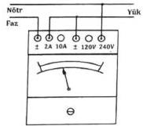

Analog Wattmetre
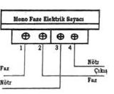

Analog ve Dijital Enerji Sayacı

Şekil 8. Kullanılan Ölçü aletlerine ait bağlantılar

Deney Öncesi çalışma: İç direnci $100 \Omega$ olan bir bobinin öz indüktans katsayısı $L=1 \mathrm{H}$ dir. Bu bobine 50 Hz .100 V uygulandığında devreden geçecek akımı ve oluşacak faz farkını hesaplayın.

Deney Çalışması:
BÖLÜM-1: Alternatif akımda Güç Ölçmeleri
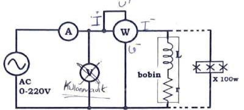

1. Şekil 'deki devre bileşenleri seçilir. Ilk olarak sadece omik yükler (flamanlı lambalar) için devre kurulur. Varyak gerilimi sıfırdan itibaren artırılarak 150 Volt ve 220 Volt değerleri için akım gerilim ve güç değerleri okunarak Tablo 1'e kaydedilir. (Kademelere ait çarpan değerlerine dikkat edin)
2. Ölçülen Güç ile hesaplanan güçler karşılaştırılır, sonuç yorumlanır.

Tablo 1.

| Varyak Gerilimi | Lamba (W) | Gerilim(V) | Akım(A) | Güç (W) | Hesaplanan Güç (W) |
| :-- | :--: | :--: | :--: | :--: | :--: |
| 150 Volt | 100 | 150 V | 0.15 A | 2.0 W | 20.5 W |
| 220 Volt | 100 | 220 V | 0.15 A | 32.5 | 39.6 W |
| 150 Volt | 250 | 250 V | 0.16 A | 35 W | 34 W |
| 220 Volt | 250 | 220 V | 0.16 A | 90 W | 96.8 W |
| YORUM: |  |  |  |  |  |

3. Şekil 'deki devreye göre bu defa belirli bir iç dirence sahip 1 H değeri civarındaki tek bir bobin yük olarak bağlanır ve varyak 220 V iken ölçü aletlerindeki değerler okunarak Tablo 2'ye kaydedilir.
4. Ölçülen değerlerden Cosф değeri hesaplanır.
5. Şekil 'deki devreye göre bu defa 1. Ve 3. Madde için kullanılan bobin ve lambalar bağlanır. Varyak 220 V iken ölçü aletlerindeki değerler okunarak Tablo 2'ye kaydedilir.
6. Ölçülen değerlerden Cosф değerini hesaplayın.
7. Alıcıların görünür ve reaktif güçlerini hesaplayınız.

Tablo 2.

| Varyak Gerilimi | Bobin (L ve r) | Lamba(W) | Gerilim(V) | Akım(A) | Güç (W) | Hesaplanan Cosф (W) |
| :-- | :-- | :-- | :-- | :-- | :-- | :-- |
| 100 Volt | 0.16 H 72 A 0 | 100 V | 0.17 | 8 | 0.216 W |  |
| 220 Volt | 0.16 H 72 A 0 | 216 | 0.179 | 40 | 0.23 |  |
| 220 Volt | 0.16 H 72 A 100-250W | 214 | 0.15 P | 130 W | 0.602 |  |
| YORUM: |  |  |  |  |  |  |

BÖLÜM 2: Alternatif akımda Faz farkı Ölçmeleri
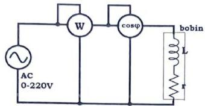

1. Sekil 'deki devre kurulur. Varyak gerilimi sıfirdan itibaren artırılarak 150 Volt ve 220 Volt değerleri için akım gerilim ve güç değerleri okunarak Tablo 3'e kaydedilir.
2. Elde edilen sonuçlar Tablo 2 ile karşılaştırılır ve yorumlanır.

Tablo 3:

| Varyak Gerilimi | Bobin (L ve r) | Lamba(W) | Güç (W) | $\operatorname{Cos} \varphi(\mathrm{W})$ |
| :-- | :-- | :-- | :-- | :-- |
| 100 Volt |  | 0 |  |  |
| 220 Volt |  | 0 |  |  |
| 220 Volt |  | $100-250 \mathrm{~W}$ |  |  |

# BÖLÜM 3: Alternatif akımda Enerji Ölçmeleri

1. Aşağıda verilen Şekil 'deki devre kurulur. Varyak gerilimi sıfırdan itibaren artırılarak 220 Volt değerlerine kadar artırılır. Sayaç dik ve yatık konumlardaki hareketi gözlenir.
2. Sayaç diskinin $t$ dakika süresinde dönme sayısı $n$ olursa sayacın etiketinde yazılı deviradedi/kWh=k değerine göre sayaçtan geçen enerji (is) $\left(\overline{W=P \cdot t=\frac{n}{k} \cdot 60}\right)(\mathrm{kWh})$ olarak hesaplanabilir. Deneyde aldığınız alıcının çalışma süresi ve sayaç diskinin dönme adedi değerleri ele sarf edilen enerjiyi hesaplayınız. Sayacın kaydettiği değerle karşılaştırınız.
3. Sayaç ile güç ölçümü nasıl yapılabilir, tartışınız.
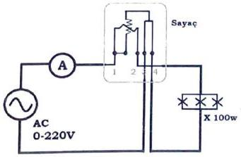

DENEY No 4: Osiloskop ve Alternatif Akım Dalga Şekillerinin incelenmesi. Genlik, Frekans ve faz farkı Ölçümleri, Ortalama ve Etkin Değerler

Genel Bakış:
Osiloskop, bir sinyalin iki boyutlu görsel sunumunu sağlayan elektronik bir ölçüm cihazıdır. Osiloskop ile periyodik sinyaller görüntülenir ve ölçülebilir. Osiloskop, genlik-zaman ve genlikgenlik (Lissajous eğrileri) görüntüleri ile sinyallerin ayrıntılı incelemeleri yapılır. Genelde iki ve daha fazla kanal aynı anda ekrana getirilmek suretiyle sinyallerin birbirlerine karşı durumlan gözlemlenebilir. Tek bir kanalda bir noktadaki voltajın zamana göre değişim grafiği, dikey eksen voltaj ve yatay eksen zaman olmak üzere elde edilir. Osiloskop elektrik devre bileşenlerine voltmetre gibi paralel bağlanır.

- Osiloskop üzerinde genel olarak dört ana kontrol grubu vardır: Ekran Görüntüleme, Dikey grup, Yatay grup ve Tetik grubu.
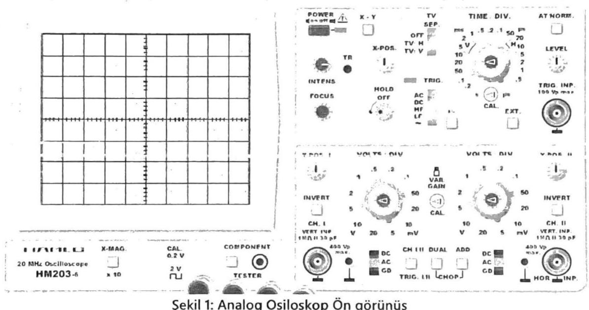

Ekran Görüntüleme Grubu
Sinyali en iyi şekilde görüntüleyen, Görüntüleme ekranı, yoğunluk kontrol düğmesi, ışın bulma düğmesi, odak kontrol düğmesi ve güç anahtarından bölümlerinden oluşur.

- Görüntü ekranı B'e 10 cm'lik bir ızgaraya yerleştirilmiştir. Osiloskop, katot ışını tüpünün (CRT) içindeki fosfor kaplama boyunca bir elektron ışını hareket ettirerek girişine gelen sinyalin grafiğini çizer.
- Yoğunluk kontrol düğmesi izin parlaklığını ayarlamak ve bulanıklığı gidermek için kullanılır.
- Işın bulma düğmesi, elektron demetinin ekran dışında olduğunda, ekrana getirmeyi sağlar.
- Odak kontrol düğmesi, optimum iz çözünürlüğü için elektron ışınııı ayarlar.

Dikey Grup

Bu grup, dikey bileşenleri (Y ekseni) ve sinyalin dikey konumunu ayarlamak için kullanılır. Bu grup, dikey konum düğmeleri, kanal seçme anahtarı, bölüm başına volt seçici düğmeleri, giriş bağlantı anahtarı, kanal modu seçici anahtarı, kanal 2 çevirme anahtarı ve BNC konektörlerinden oluşur. Dikey konum kontrolleri, bir kanalın veya diğerinin izini dikey olarak hareket ettirmek için kullanılır.

- "CH1 / DUAL / CH2" etiketli kanal seçme anahtarı, ekranda hangi kanalların görüntüleneceğini seçer.
- Bölüm başına volt seçici düğmesi, her kanalın izi için dikey ölçeği volt veya milivolt olarak ayarlar. 10X prob kullanıldığından, tüm okumalar düğme üzerindeki okunan değerler 10 katı hesaplanmalıdır.
- "AC / GND / DC" etiketli giriş kuplaj anahtarı, o kanalın ekranının kuplaj modunu seçer. AC, sinyalin yalnızca değişen kısmının görüntülendiği anlamına gelir. DC, sinyalin hem değişen kısmını hem de herhangi bir DC bileşenini gösterecektir. GND, 0 V referans seviyesini gösterir.
- "ADD / ALT / CHOP" etiketli kanal modu seçme anahtarı, yalnızca kanal seçici anahtarında DUAL seçildiğinde etkinleştirilir. ADD, Kanal 1 sinyalini Kanal 2 sinyaline grafik olarak ekler.

Yatay Kontrol Grubu
Yatay Kontrol Grubu, kaba ve ince konum düğmeleri, yatay büyütme anahtarı, bölüm başına saniye seçici düğmesi ve büyütme ölçeği seçici anahtanndan oluşur.

- Kaba ve ince konum düğmeleri, izlerin sırasıyla kaba ve hassas bir şekilde yatay hareketine izin verir. Bunlar, izleri, ölçümü hem daha kolay hem de daha hassas hale getirecek şekilde konumlandırmak için kullanılır.

Yatay büyütme anahtarı ("X1 / ALT / MAG") normal (X1) ve / veya yatay olarak büyütülmüş bir izi seçer.

- Bölme başına saniye düğmesi, zaman tabanı (yatay) ölçeğini ayarlar. Saniye, milisaniye ve mikrosaniye olarak işaretlenir. Not: Her iki kanal için yalnızca bir yatay ölçek vardır.

Tetik Grubu: Bir sinyali görüntülemek için, osiloskop bu sinyale "kilitlenebilmelidir"; tetikleme kontrollerinin işlevi tam da bunu yapmaktır. Tetikleme karmaşık bir konu olabilir ve bu laboratuvarın kapsamı dışındadır.

# Osiloskopta Yapılacak Ölçmeler

Önce sinyalin kanalını (CH1) seçin. Yatay çizginin seviyesini tam ortaya (orjin) getirin.

- Genlik Ölçümü (dikeyde voltaj)

Sinyal olarak 2 V doğru gerilim uygulandığında Şekil 2.a'de gösterilen sinyal görüntüsü elde edilecektir. Sinüsoydal bir sinyal uygulandığında (Şekil 2.b) sıfırdan itibaren dikey olarak kaç çizgi ve kaç ince iz (bu bölümler çentik işaretleriyle $1 / 5$ 'e $(0,2)$ bölünmüştür.) olduğu sayılır. Bu sayı kanalın volt / div çarpanı ile çarpılarak sinyalin tepe değeri elde edilir. Kullanımdaki kanal için volt / div ayarı çarpanı 1'dir. Dolayısıyla sinyalin tepe değeri 2 Volt, tepeden tepeye değeri 4 V . tur.

- Dönem (yatay eksende zaman):

Sinyalin herhangi bir noktasını referans olarak alın, bunun için çoğunlukla sıfır veya tepe noktaları seçilir. Yatay çizgi boyunca aynı yöndeki bir sonraki geçişe kadar olan bölümlerin sayısını sayın. Sec / div ayarıyla tam bölme ve çentik sayısını çarparak sinyalin peryodunu (dönem) hesaplayın. Şekil 2.b'de sinyal 2 tam bölmeden meydana gelmektedir. Timebase çarpanı ise 10 ms dir. Şu halde peryodu 20 ms . dir.

- Sıklık (Frekans):

Sinyalin periyodunu (T) ölçün. $F=1 / T$ kullanarak frekansı (f) hesaplayın. ( $f=1 / 20 \mathrm{~ms}=50 \mathrm{~Hz}$ )
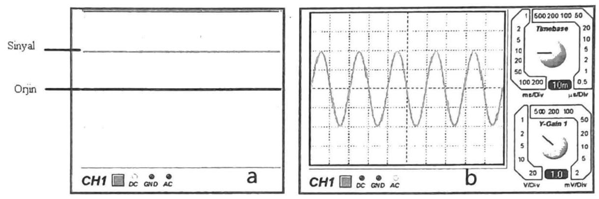

Şekil 2. Osiloskopta Genlik, periyot ve frekans ölçümü

Alternatif akım ve Periyodik Sinyaller
Alternatif akım, zamana göre pozitif ve negatif değerler alan sinyallerdir. Periyodik işaretler belli zaman aralığında aynı değeri alan işaretlerdir. Periyodik sinyal, belirli bir zaman aralığından sonra kendini tekrar eden bir sinyaldir. Sinüzoidal dalga, kosinüs dalgası, üçgen dalga ve kare dalga periyodik sinyale örnektir. Sinüzoidal işaret maksimum genliği, açısal frekansı ( periyod veya frekansı ile de olabilir.) ve sahip olduğu faz kayması ile karakterize edilebilir.
$\mathrm{V}(\mathrm{t})$, Anlık Değer: Alternatif akım ve gerilimin herhangi bir andaki değeridir.
$v_{1}(t)=V m \cdot \operatorname{Sin}(w t+\theta)$
Soru 1 a. 50 Hz .100 V . Tepe gerilimi olan Bir sinüs sinyalinin 5 ms ve 12 ms lerdeki genliğini hesaplayın. b. Grafik üzerinden ölçün ve iki değeri karşılaştırın.

Vm, Maksimum (Tepe) Değer: Alternatif akımın anlık değerleri içindeki en büyük değeridir.
Vort, Ortalama Değer: Bir periyottaki ani değerlerin ortalamasıdır. Ortalama değer, sinyalin doğru akım değeridir. Alternatif akımın ortalama değer sıfırdır. (Pozitif ve negatif kısımları eşit olan alternatif işaretlerde DC bileşen sıfır çıkacaktır.) Bir işaretin bileşenleri bir periyod boyunca toplanıp (integrali alınıp) periyoda bölümüyle elde edilir. Bir sinyalde hem AC sinyal hem de DC sinyal bir arada bulunabilir. Ortalama değer, bir işaretin DC bileşenini ifade etmektedir ve doğru akım ölçü aletleri sinyalin DC bileşenini ölçerler.

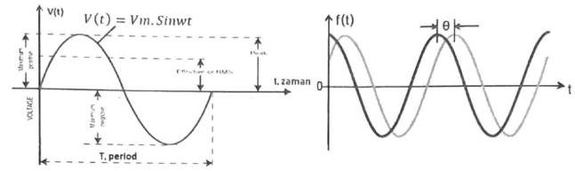

Şekil 3 a. Sinüsoydal sinyalin karakteristik değerleri
b. iki sinyalin faz farkı
$V_{\text {eff. }}$ (V) Etkin (Efektif) Değer (RMS): Alternatif akımın bir dirençte, doğru akımla eş değerde etki yaptığı değerine etkin veya efektif değer denir. Ülkemizdeki elektrik şebekesinin efektif gerilim değeri 220 volttur. AC ampermetre ve voltmetre, akımın ve gerilimin etkin değerini (RMS) gösterirler. Etkin (Efektif) değer, bir işaretin karesinin bir periyot boyunca alınan ortalamasının karekökü olarak tanımlanır.
$V_{\text {ort }}=\frac{1}{T} \int_{-T / 2}^{T / 2} v(t) d t$
$\operatorname{Teff}=\sqrt{\frac{1}{T} \int_{-T / 2}^{T / 2} v(t)^{2} d t}$
Tam sinüs dalga şekli için efektif değer;
$\operatorname{Se}$ il Katsayısı : Etkin değerin ortalama değere oranı şekil katsayısını verir.

$$
S K=\frac{V_{\text {eff }}}{V_{\text {ort. }}}=\frac{\sqrt{\frac{1}{T} \int_{-T / 2}^{T / 2} v(t)^{2} d t}}{\frac{1}{T} \int_{-T / 2}^{T / 2} v(t) d t}
$$

$\operatorname{Veff}=\frac{1}{\sqrt{2}}+V_{m}=0,707 V_{m}$

# DENEYIN YAPILIŞI

- Deneyde Sinyal jeneratörü, DC güç kaynağı, Direnç kutusu, Analog osiloskop, multimetre, kondansatör, bağlantı elemanları kullanılacaktır.

1. Aşağıda verilen devre şemasına göre deneyin bağlantı şemasını gerçekleştiriniz.
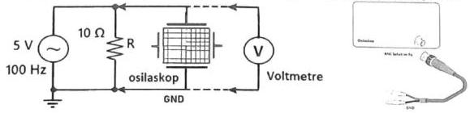

Şekil 5. Deney şeması

- Sinyal jeneratörünü 100 Hz - 1 kHz aralığında sinüs üretecek şekilde ayarlayınız.
- Osiloskop ekranının yardımıyla sinyalin maksimum değerini 5 V olarak ayarlayınız.
- Osiloskopun ayarlarını kullanarak ekrandaki sinyal görüntüsünü sabit ve 1-2 peryot olacak şekilde elde etmeye çalışınız. Sonra, bu işarete ait büyüklükleri (sinyalin maksimum gerilimi,

tepeden tepeye değerini, ortalama değerini, sinyalin periyodunu ölçünüz, frekansını hesaplayınız) osiloskop ekranından ve voltmetreden okuyarak kaydediniz. Osiloskopta elde ettiğiniz görüntüyü (ekte size verilecek) aşağıdaki milimetrik grafik ekran (1. Grafik) üzerine yaklaşık olarak çiziniz. Verilere bakarak her bir kanalın tepe değer ve peryot değerini ölçünüz. Bu değerlerden yaralanarak etkin değer ve frekans değerleri hesaplayın ve kaydedin.
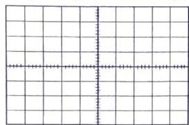

1. Grafik
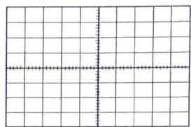
2. Grafik

- Osiloskop ve Multimetre ile ölçülen değerleri ve hesaplanan sonuçları karşılaştırınız.
- Aynı işlemleri üçgen dalga ve kare dalga için tekrar edininiz.

Ölçüm ve hesaplamalar:

| Dalga   şekli | Multimetre ile ölçülen   voltajlar |  | Osiloskopta ölçülen ve hesaplananlar |  |  |  |  |
| :-- | :-- | :-- | :-- | :-- | :-- | :-- | :-- |
| Sinüs | Vort $=$ | Veff $=$ | $\mathrm{Vm}=$ | $\mathrm{Vpp}=$ | Veff $=$ | $\mathrm{T}=$ | $\mathrm{f}=$ |
| Üçgen | Vort $=$ | Veff $=$ | $\mathrm{Vm}=$ | $\mathrm{Vpp}=$ | Veff $=$ | $\mathrm{T}=$ | $\mathrm{f}=$ |
| Kare | Vort $=$ | Veff $=$ | $\mathrm{Vm}=$ | $\mathrm{Vpp}=$ | Veff $=$ | $\mathrm{T}=$ | $\mathrm{f}=$ |

2. Şekil 6'da verilen devre şemasına göre deneyin bağlantı şemasını gerçekleştiriniz.

- Sinyal jeneratörünü 100 Hz - 1 kHz aralığında sinüs üretecek şekilde ayarlayınız.
- Osiloskop ekranının yardımıyla sinyalin maksimum değerini 5 V olarak ayarlayınız.
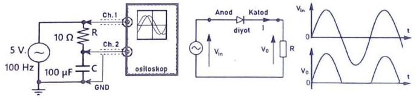

Şekil 6. Deney şeması
Şekil 7. Yarım dalga doğrultucu
Osiloskobun ayarlarını kullanarak ekrandaki sinyal görüntüsünü sabit ve 1-2 peryot olacak şekilde elde etmeye çalışınız. Sonra, her iki işarete ait büyüklükleri (sinyalin tepeden tepeye değerini ve sinyalin periyodunu ölçünüz, frekansını hesaplayınız) osiloskop ekranından okuyarak kaydediniz.
Osiloskopta elde ettiğiniz görüntüyü (ekte size verilecek) aşağıdaki milimetrik grafik ekran (2. Grafik) üzerine yaklaşık olarak çiziniz. Verilere bakarak her bir kanalın tepe değer ve peryot

değerini ölçünüz. Bu değerlerden yaralanarak etkin değer ve frekans değerleri hesaplayın ve kaydedin.

| kanal | Osiloskopta ölçülen ve hesaplananlar? |  |  |  |
| :-- | :-- | :-- | :-- | :-- |
| 1.kanal | Vpp $=$ | Veff $=$ | $\mathrm{T}=$ | $\mathrm{f}=$ |
| 2.kanal | Vpp $=$ | Veff $=$ | $\mathrm{T}=$ | $\mathrm{f}=$ |
| Faz farkı | $\Delta t=$ | $\theta=$ | (derece) |  |

3.a Şekil 7' deki devreyi kurunuz. Benzer şekilde osiloskobun iki kanalını ve voltmetreyi de devreye bağlayınız. Osilatör frekansını $1-10 \mathrm{kHz}$ aralığında ve gerilimini 5 V olacak şekilde ayarlayınız. Osiloskop ekranındaki görüntüyü şekil 7'de verilen şekle benzer olacak şekilde elde ediniz ve kaydediniz. Osiloskoptaki ekran görüntüsünü aşağıda verilen milimetrik kâğıda ölçekli olarak çiziniz. Yarım doğrultulmuş sinyalin ortalama ve efektif değerlerini (düzgün sinüs kabul ederek) hesaplayınız.
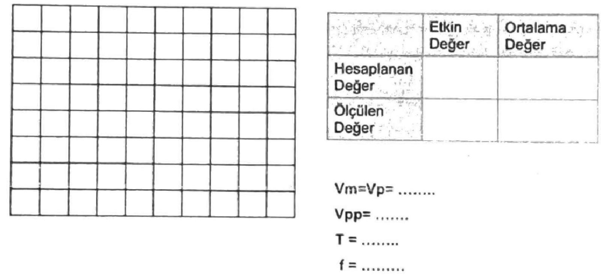

Elde edilen sonuçlara bakarak hesaplanan ve ölçülen değerlerin karşılaştırmasını yapın ve yorumlayın. Sonuçlar uyumlu değilse hata araştırması yapın ve deneyi tekrarlayın. Sonuçlar uyumlu ise bu sinyal için Şekil Katsayısını (ŞK) hesaplayın.

Osiloskop Problan
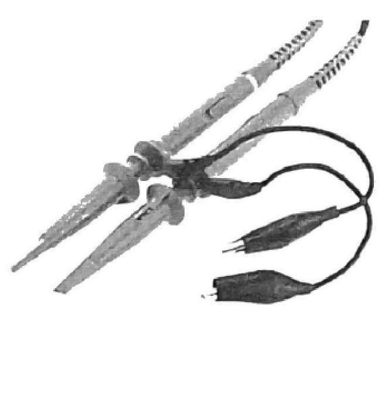

Sinyal Jeneratörü ( Sinüs, üçgen ve kare üreteci)
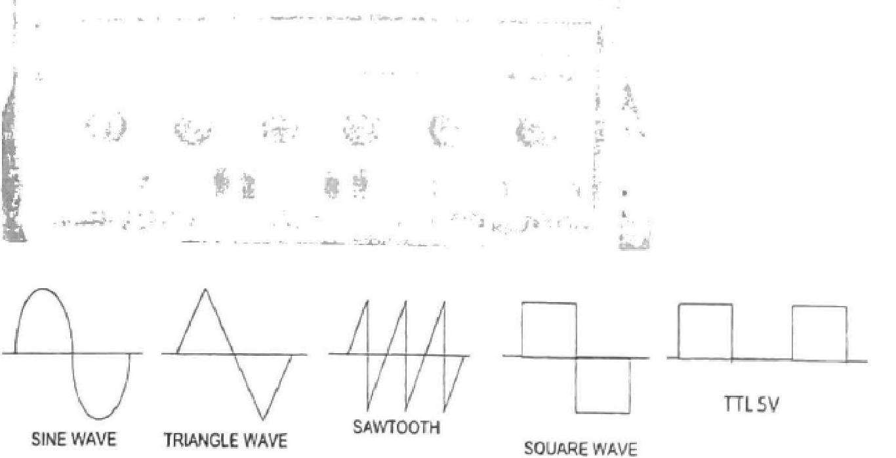

DENEY No 5: Direnç Renk Kodları, Deney Tahtası, CADET Deney Seti ve Multimetre Kullanımı

1. GiRiş

Elektrik devrelerinde kullanılan direnç, kondansatör ve bobin gibi devre bileşenlerinin değerleri renk kodlaması ile belirlenir. Devre bileşenlerinin yüzey alanları küçük olması veya üzerlerindeki yazıların silinebilmesi gibi nedenlerle küçük boyutlu elemanların değerleri ve özellikleri için renk kodlaması yapılır. Dirençlerde genel olarak 4 ve 5 bandlı kodlama kullanılır. Kondansatör ve bobinler içinde kendilerine ait renk kodlaması vardır.
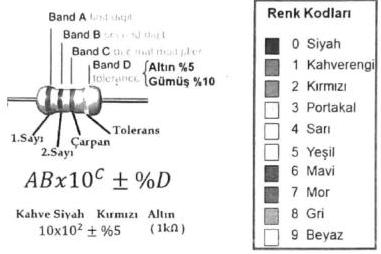

Deney Tahtası (Breadboard)
Bir devreyi devre tahtasında geliştirmek, maliyeti ve süreyi önemli ölçüde azaltabilir. Elektronik bir devreyi tasarlama, geliştirme ve baskılı devre kartı (PCB) ile imalat geçme süreci zaman alıcı ve maliyetli olabilmektedir. Devre tahtası kullanmak, lehimleme ve kart çıkarma işlemlerinden çok daha kolaydır. Bu sayede devrelerin hızlı kurulup denenmesi ve devre elemanlarının değerlerinin kolayca değiştirilebilmesi mümkün olur. Başlangıçta elektronik devreler için geçici olarak oluşturulan ve tekrar tekrar kullanılabilir bir platform olan devre tahtasını (breadboard) kullanmak, tasarımcıya bu noktalarda avantaj sağlar.
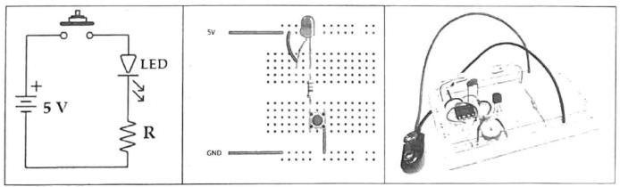

Deney tahtası, üzerinde farklı satır ve sütunlar ızgara şeklinde alttan levhalar halinde birbirine bağlı ve üstten delikler olarak görülen birleşme notalarına sahiptir. Elektrik tel ve devre bileşen uçları bu deliklere yerleştirilerek birleşmeler sağlanır. Besleme ve nötr noktaları deney tahtasının kenarlarında boylu boyunca yerleşiktir. Bağlantılar olabildiğince az ve kısa aktarma kabloları ile tamamlanır. Devreni kurulumu mümkün mertebe şematik yapıya benzer şekilde yerleşimi yapılırsa kontrol etmesi de kolaylaşacaktır.

CADET Analog-Dijital Devre Eğitim Seti
CADET Eğitim Seti, Fonksiyon Jeneratörü, DC gerilim kaynakları ile birçok yardımcı ekipmanı ve deney tahtasını birlikte sunan güvenli ve kolay kullanım imkanı sağlayan bir tasarım aracıdır. CADET ile temel seviye analog elektrik ve elektronik deneyleri büyük ölçüde sağlanmaktadır. Genliği ve frekansı ayarlanabilen sinüs, üçgen ve kare dalga sinyal jeneratörü, buton kontrollü 5V TTL kare sinyali, +5 V sabit, $\pm 0-12 \mathrm{~V}$ ayarlı DC gerilim kaynağı, bağımsız 12 V ac trafo çıkışı, ayarlı dirençler (pot), BNC soketi ile osiloskop bağlantısı, anahtarlar ve gösterge ledler vb. yardımcı ekipmanın bir araya getirilmesiyle oluşmuştur.
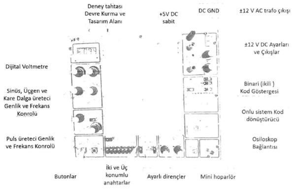

Dijital Multimetre
Multimetre, voltmetre, ampermetre ve ohmmetre gibi ölçü aletlerinin bir araya getirilmesi ve çeşitli fonksiyonların eklenmesiyle oluşturulmuş komple bir ölçü aletidir. Türkçe ifade ile multimetreyi "çoklu ölçer" diye isimlendirebiliriz. Ayrı ayrı ölçü aletleri yerine tek bir Multimetre ile devredeki çok farklı ölçümler ve testler yapılabilir, problemlerin tespiti kolayca çözümlenebilir. Bu nedenle sahada çok faydalı ve olmazsa olmaz bir cihazdır. LCD ekran ara yüzü üzerinde değerler, kolayca okunur ve ekranındaki işaretler ile yapılan

ölçümleri anlamaya destek olur. Ek olarak bazı multimetrelerle frekansı, transistör kazancını, sıcaklığı ölçmek ve diyot, transistör kontrolünü yapmak mümkündür. Multimetrenin ortasındaki konum komütatörü ile akım, gerilim, direnç, AC-DC vb. bölmeler ile ölçüm modları seçilir.
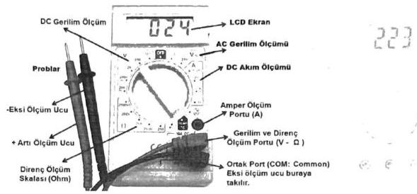

Multimetre ile direnç ölçmek

Multimetre ile direnç ölçümünde, devrede enerji yokken veya devre elemanını bağımsız olarak ele aldığımızda ölçüm yapılır ( Direnç uçlarına elle temas edilmemelidir). Problar şekilde verildiği gibi yerleştirilir ve komütatör Ohm moduna getirilir. Sonra şekilde gösterildiği gibi direncin iki ucuna
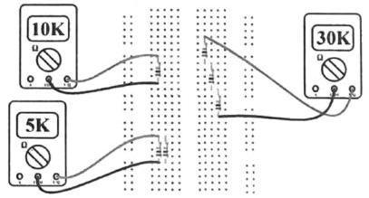
prob uçlarına temas ettirilerek sonuç ekrandan okunur.

Multimetre ile voltaj ölçümü

Problar şekildeki gibi yerleştirildikten sonra komutatör ile multimetre üzerindeki "V" (voltaj) yazan bölüm AC veya DC voltajı durumuna göre seçilir. Devrede enerji varken, problar direnç veya voltaj kaynağına paralel bağlanarak ölçülen değer ekrandan okunur.

Voltaj kademesi yüksekten aşağıya doğru kademeli olarak indirilerek ölçmedeki bağıl hata oranı azaltılmalıdır.

Multimetre ile akım ölçmek

Multimetrede akım ölçümü özel bir dikkat gerektirir. Zira akım ölçme modunda iken düzenleme yapılmadan gerilim ölçme girişiminde, akım kademesi zarar görebilir. Akım ölçümü için probların yerleşimi önemlidir. mA ve A seviyelerine göre problar multimetreye bağlanır ve komütatörde "A" (amper) modu seçilir. Şekilde gösterildiği gibi multimetre, seri bir devre elemanı olarak devreye bağlanır. Bundan sonra Multimetre açık (ON) hale getirilir (açık olmazsa devreden akım geçmeyecektir).

# Deney öncesi çalışma

Her grup bir multimetre araştırması yapsın ve Laboratuvara gelirken seçtikleri bir multimetreye ait teknik özellikleri gösteren bir yazıcı çıktısı getirsin. (her grubun farklı getirmesi beklenir)
2. Deney Çalışmaları :

1. Size verilen direnç kutusundan renk kodlarına bakarak Şekilde verilen dirençleri seçiniz veya onların yerine rasgele dirençler seçiniz. Rab değerini hesaplayınız. Her birisini ölçerek tolerans bölgelerinde olduğunu kontrol ediniz. Devreyi breadboard üzerine kurunuz ve a-b arasındaki eşdeğer direnci ölçünüz. Ölçtüğünüz ve hesapladığınız değerleri tabloya yazınız. Dirençlerin renk kodu ile verilen toleransı ile ölçtüğünüz değerlerin toleransını karşılaştırınız. Sonuçları yorumlayınız.

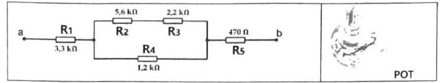

| R anma   değeri | R1 | R2 | R3 | R4 | R5 | Rab $=$ |
| :-- | :-- | :-- | :-- | :-- | :-- | :-- |
| Ölçülen   değer-R |  |  |  |  |  |  |

2. Size verilen bir potansiyometrenin uçlarındaki dirençlerin değişimini görün ve ölçerek orta noktasını bulun.
3. Şekildeki devreye (a-b uçları arasına) +12 V dc gerilim verilerek, devrenin toplam akımı ve her bir dirençteki gerilim değerleri ölçülecektir. Devre şemasını çizin. Ölçüm için size verilen multimetreyi her defasında bir ölçme yapacak şekilde ölçümleri yapın ve ölçüm sonuçlarını tablo halinde kaydedin.

| R değeri | R1 | R2 | R3 | R4 | R5 | Ölçülen $l_{\text {ab }}$ | Hesaplanan $l_{\text {ab }}$ |
| :-- | :-- | :-- | :-- | :-- | :-- | :-- | :-- |
| Ölçülen   Voltaj |  |  |  |  |  |  |  |

4. Her bir dirençten geçen akımı hesaplayın ve toplam akımı bulun. Ölçtüğünüz devre akımı ile hesap yoluyla bulduğunuz devre akımını karşılaştırın. Sonucu yorumlayın.
5. Her bir direnç üzerindeki voltajı okuyun ve toplam voltajı bulun. Devreye uygulanan voltajla karşılaştırın. Sonucu yorumlayın.
6. Şekildeki devrenin a ucuna +12 V ve b ucuna -5 V uygulayarak 3., 4. ve 5. maddelerdeki işlemleri tekrarlayın, sonuçlarını kaydedin.

| R değeri | R1 | R2 | R3 | R4 | R5 | Ölçülen   $I_{\text {ab }}$ | Hesaplanan   $I_{\text {ab }}$ |
| :-- | :-- | :-- | :-- | :-- | :-- | :-- | :-- |
| Ölçülen   Voltaj |  |  |  |  |  |  |  |

7. CADET'in sinüs sinyal noktası osiloskobun 1. kanalına ve potansiyometrenin bir ucuna; potansiyometrenin orta ucu osiloskobun 2. kanalına ve potansiyometrenin diğer ucu CADET'in GND noktasına bir bağlanacaktır. Tam devresini çiziniz. Devreyi kurup kontrol ettirdikten sonra enerji verin. Osiloskopta her iki kanaldaki sinyalleri inceleyin. Pot değerini değiştirerek sinyal değişimini gözlemleyin. Ekrandaki görüntüyü (her iki kanalı) kaydedin ve yaklaşık olarak elle çizin.
8. Potun son durumu için 2. Kanaldaki genlik değerinden yola çıkarak potun çıkış direncini hesaplayın. Devrenin enerjisini kesin ve multimetre ile potun çıkış direncini ölçün ve sonuçları karşılaştırın ve buraya kaydedin.
9. CADET üzerindeki mini hoparlör, trafo çıkışları (AC $12 \mathrm{v}-50 \mathrm{~Hz}$ ), anahtar ve ikili kod led göstergelerin nasıl kullanılabileceğini aranızda konuşun. CADET'in üzerindeki bileşenler kullanarak denemeler yapın.

# DENEY NO: 6.1

DENEY ADI: Elektromıknatısın demiri çekmesi ve çekme kuvvetinin hesabı
DENEYIN AMACI: Elektrik akımının manyetik tesirinin deneyle gösterilmesi. Elektromıknatısla manyetik malzemelere uygulanan çekme kuvvetinin deneyle belirlenmesi.

### 6.1. DENEY HAKKINDA TEORIK BILGI

Içinden akım geçen iletkenin etrafında manyetik alan meydana gelir (Şekil 6.1.a). Bu iletken, bobin şeklinde sarılacak olursa manyetik alanın şekli Şekil 6.1.b'deki gibi olur.
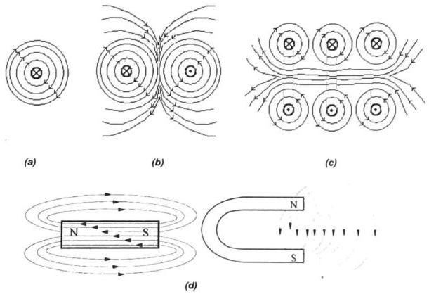

Şekil 6.1. (a) Düzgün, içinden akım geçen bir iletkenin etrafındaki manyetik alan ve akımın yönüne göre Sağ El Kuralına göre alan yönü, (b) bir sarımlı ve (c) üç sarımlı bir bobinin manyetik alanı (d) çeşitli mıknatıslanın etrafında meydana gelen manyetik alan çizgileri

Manyetik alan şiddeti (6.1) bağıntısı ile hesaplanabilir:

$$
B=\mu \cdot H=\mu_{0} \cdot \mu_{r} \cdot \frac{N \cdot I}{l}
$$

Burada;
B: Manyetik akı yoğunluğu [ $\mathrm{Wb} / \mathrm{m}^{2}$ veya Tesla],

# TEMEL ELEKTRIK VE ÖLÇME LABORATUVARI 6. DENEY

$\mu$ : Manyetik geçirgenlik (permabilite)
$\mu_{0}$ : Boşluğun manyetik geçirgenliği $\left(12,56.10^{-7} \mathrm{H} / \mathrm{m}\right)$
$\mu_{r}$ : Bağıl manyetik geçirgenlik
$H$ : Manyetik alan şiddeti
$N$ : Bobinin sarım sayısı
$l:$ Akım $[A]$
$l$ : Bobinin sarıldığı telin uzunluğu [m]
Bu bağıntıya göre manyetik alan şiddetinin artırılabilmesi için, önceden hazırlanmış bir bobinde $\mu_{r}$ değerinin veya / akım şiddetinin artırılması gerekir. Burada; $\mu_{r}$ değerini artırmak için bobinin içine yüksek geçirgenliğe sahip demir bir nüve konmuştur. İçinden akım geçen demir nüveli bir bobine "Elektromıknatıs" denir. Elektromıknatısın karşısında bulunan manyetik bir cismi çekme kuvveti, aşağıdaki formül ile hesaplanır;

$$
F=S\left(\frac{B}{5000}\right)^{2} \quad \text { veya } \quad F=S \cdot \frac{B^{2}}{2 \cdot \mu_{0}}
$$

F: Çekme kuvveti
$[k g]$
veya [Newton],
S: Elektromıknatısın çekme yüzeyi
$\left[\mathrm{cm}^{2}\right]$
veya $\left[\mathrm{m}^{2}\right]$
B: Akı yoğunluğu ya da Manyetik indüksiyon [Gauss] veya [Tesla]=\left[\mathrm{V.s} / \mathrm{m}^{2}\right]$

### 6.1.1. Deneyin Bağlantı Şeması

Şekil 6.2. Deneyin temel bağlantı şeması
Bu deneyde çeşitli tiplerdeki mıknatısların etrafına serpilen demir tozlarının manyetik alan çizgileriyle uyumlu biçimde şekil aldığı gözlenecektir. Ayrıca içinden doğru akım geçirilen bir telin etrafında zayıf da olsa bir manyetik alan oluştuğu, yine demir tozları yardımıyla görülebilir. Alanı kuvvetlendirmek için telin sarım sayısını arttırmak ya da daha pratik bir biçimde tel yerine çok sarımlı bir bobin bağlamak faydalı olacaktır. Şekil

6.3' te bu bağlantı şekli görülmektedir. Bu bağlantıda oluşacak manyetik alan yönünün nasıl belirlendiğini açıklayınız.

Şekil 6.3 Çok sanmlı bir bobin etrafinda oluşan manyetik alan çizgilerinin demir tozlan ile gösterilmesi

# 6.1.2. Deneyin Yapılışı

1. Farklı tipteki mıknatısları demir tozunun bulunduğu yüzeyin altında hareket ettirerek demir tozlarının hareketini ve oluşturduğu manyetik alan çizgilerini gözlemleyiniz.
2. Şekil 6.2'deki devreyi kurarak telin içinden akım geçiriniz. Akım değerini yavaş yavaş arttırarak manyetik alanın şeklini demir tozları serperek inceleyiniz.
3. Şekil 6.2'deki devrede iletken tel yerine çok sarımlı bir bobini bağlayınız. Akım değerini yavaş yavaş arttırarak manyetik alanın şeklini demir tozları serperek inceleyiniz. Oluşan çizgileri 2. ve 3. Adım için yorumlayınız.
4. Şekil 6.3' teki bağlantıyı kurarak DC gerilim kaynağının değerini yavaş yavaş arttırınız. Bu sırada yayı ve ağırlığı gözlemleyerek elektromıknatısın çekme anındaki gerilim ve akım değerlerini kaydediniz.

Şekil 6.3. Manyetik çekme kuvveti deney bağlantısı

5. Aynı devre kuruluyken gerilim değerini yavaş yavaş azaltarak yayı gözlemleyiniz. Elektromıknatısın ağırlığı bıraktığı gerilim ve akım değerini kaydediniz.

Çekme kuvvetinin hesaplanması için aşağıda verilen değerleri kullanınız. Akım şiddetine göre yaylara uygulanan manyetik alanın çekme kuvveti;

$$
F=\Delta l \times c=S \times \frac{B^{2}}{2 \mu_{0}}
$$

c: yay sabiti $[\mathrm{N} / \mathrm{m}]$
$\Delta /$ : gerilme mesafesi $[\mathrm{m}]$
S: elektromıknatısın yüzey alanı $\left[\mathrm{m}^{2}\right]$
(6.3) formülünden $B$ manyetik indüksiyon değerini farklı akım şiddetleri için bulunuz. Hesapladığınız tüm değerleri Tablo 6.1 'e kaydediniz.

Tablo 6.1

| $\Delta l$ | c | S | B | F | I |
| :--: | :--: | :--: | :--: | :--: | :--: |
| 1 mm |  | $314,16 \mathrm{~mm}^{2}$ |  | 100 gr | 1 A |
| 5 mm |  | $314,16 \mathrm{~mm}^{2}$ |  | 10 gr |  |
| 5 mm |  | $314,16 \mathrm{~mm}^{2}$ |  | 100 gr | 1 A |
| 10 mm |  | $1963,50 \mathrm{~mm}^{2}$ |  | 10 gr | 1 A |
| 10 mm |  | $1963,50 \mathrm{~mm}^{2}$ |  | 100 gr | 2 A |

# 6.1.3. Deney ile İlgili Sorular

1- Düz bir iletkenin etrafında meydana gelen manyetik alan şiddetinin formülünü yazıp, manyetik alan çizgilerini şekil çizerek gösteriniz.

2- Sarım sayınını arttırmak ve bobinin içine demir nüve eklemek manyetik alanı niçin kuvvetlendiriyor, açıklayınız.

3- Sürekli mıknatısiyetin oluşumunu araştırınız. Sürekli mıknatısiyetin zamanla veya başka etkenlerle kaybolması mümkün müdür? Bu etkenler neler olabilir?

4- Elektromıknatısın yapısını ve çalışma prensibini araştırınız.

# DENEY NO: 6.2

DENEY ADI: Elektromanyetik indüksiyon.
DENEYIN AMACI: Bir bobinde gerilim indüklenebilmesi için gerekli deneyi yapıp değerlendirmek.

Deneyden önce Faraday Kanunu ve Lenz Kanunu hakkında bilgi edinip geliniz.

### 6.2. DENEY HAKKINDA TEORIK BILGI

Bobinin uçlarında indüklenen gerilim

$$
E=-N \frac{d \Phi}{d t}
$$

eşitliği ile bulunur. Burada
E: İndüklenen gerilim [V],
$N$ : Bobinin sarım sayısı,
Ф: Manyetik akı (bobinin içinden geçen toplam akı) [Wb],
$t$ : Zaman [s]
Çeşitli gerilim indükleme yöntemlerinde bu çarpanların bazıları sabit tutulur iken bazıları değişken yapılır.

Şekil 6.4' te N sarımlı bobine daimi mıknatısın yaklaştırılması ile bobinin sargılarını kesen manyetik akı değiştiğinden durmakta olan bobinde gerilim indüklenir. Mıknatısın uzaklaştırılması ile bobinden geçen indüksiyon akımının yönü değişir.

Şekil 6.4. Manyetik alanın değişiminin indüksiyon akımı oluşturması.

Şekil 6.5. Iç içe geçmiş bobinlerde indüklenen gerilim.
Herhangi bir hareket olmaksızın, Şekil 6.5' teki gibi iç içe geçirilmiş primer bobine doğru gerilim uygulandığında, ikinci bobinde gerilim indüklenmez; fakat sadece anahtarlama (açma/kapama) anlarında akımın artışı ve azalışı sebebiyle bobindeki manyetik akı artıp azalacaktır. Bu esnada ikinci bobinde geçici bir gerilim indüklenecektir. Açma ve kapama anlarında indüklenen gerilimler ise birbirine ters işarette olacaktır.

Birinci bobine alternatif gerilim uygulandığında ikinci bobinde gerilim indüklenecektir. Ikinci bobindeki gerilimin genliği bobinlerin sarım sayılarının oranlarıyla değişmektedir.

$$
\frac{V_{1}}{V_{2}}=\frac{N_{1}}{N_{2}} ; \quad V=4.44 \cdot f \cdot N \cdot \Phi_{m}
$$

$V_{1}$ : Birinci bobine uygulanan gerilim [V]
$V_{2}$ : Ikinci bobinde indüklenen gerilim [V]
f: Uygulanan gerilimin frekansı $[\mathrm{Hz}]$
$\Phi_{m}$ : Manyetik akının maksimum değeri
$N_{1}$ : Birinci bobinin sarım sayısı
$N_{2}$ : Ikinci bobinin sarım sayısı

# 6.2.1. Deneye Ait Bağlantı Şemaları

Şekil 6.6. Çoklu çıkış sarımlanna sahip transformatör.

# TEMEL ELEKTRIK VE ÖLÇME LABORATUVARI 6. DENEY

### 6.2.2. Deneyin Yapılışı

1. Şekil $6.4^{\prime}$ teki gibi bobinin uçlarını ölçü aletine bağladıktan sonra demir parçasını bobinin içine sokup çıkartarak ölçü aletindeki değerin değişimini gözlemleyiniz.
2. Şekil $6.6^{\prime}$ da gösterilen sargılara sahip transformatörün giriş sargısına doğru gerilim uygulayınız. Çıkış sargılarında gerilim olup olmadığını ölçü aleti yardımıyla gözleyiniz.
3. Girişe doğru gerilim uygulanırken güç kaynağının anahtarını açma ve kapama anında çıkış sargılarını bağladığınız ölçü aletinin ibresinin hareketini gözleyiniz.
4. Tablo 6.2' de verilen değerlerdeki giriş gerilimlerini ve sarım sayılarını kullanarak çıkış uçları arasında oluşacak gerilimleri hesaplayınız ve tabloya kaydediniz.
5. Şekil $6.6^{\prime}$ daki transformatörün giriş uçları arasına Tablo $6.2^{\prime}$ de verilen değerlerdeki alternatif gerilimleri uygulayarak çıkış sargılarındaki gerilimleri kaydediniz. 3. Adımda hesapladığınız gerilim değerleriyle karşılaştırınız. Fark varsa sebebini yorumlayınız.

Tablo 6.2

| $\mathrm{V}_{1}$ | $\mathrm{~V}_{2}$ |  |  |  | $\mathrm{~N}_{1} / \mathrm{N}_{2}$ |
| :--: | :--: | :--: | :--: | :--: | :--: |
| 110 V |  |  |  |  | $6,12,24,48,110$ |
| 100 V |  |  |  |  | $6,12,24,48,110$ |
| 80 V |  |  |  |  | $6,12,24,48,110$ |
| 60 V |  |  |  |  | $6,12,24,48,110$ |
| 50 V |  |  |  |  | $6,12,24,48,110$ |

### 6.2.3. Deney ile İlgili Sorular

1- 1. aşamada gerçekleştirilen deneyde demir parçasının bobine yaklaşırken ve uzaklaşırken ölçü aletinin ibresinin ters yönlerde hareket etmesinin nedenini açıklayınız.

2- Transformatöre doğru gerilim uygulandığında çıkış sargısında herhangi bir gerilim olmayışının nedenini açıklayınız.

3- 3. adımda gözlenen durumu yorumlayınız.
4- Şekil 6.4' te indüklenen gerilimin değeri hangi faktörlere göre artar veya azalır?
5- Transformasyon geriliminden yararlanarak çalışan hangi elektrik makinelerini biliyorsunuz?

6- Primer (birincil) sarım sayısı $\mathrm{N}_{1}=150$ sarım, sekonder (ikincil) sarım sayısı $\mathrm{N}_{2}=300$ sarım, demir nüve kesiti $10 \mathrm{~cm}^{2}$ olan bir transformatörde primer gerilimi 110 V , sekonder akımı 10 A'dır. Frekans 50 Hz için sekonder gerilimini, primer akımını ve demir nüvedeki manyetik indüksiyonu bulunuz (verim \%100 alınacaktır, $\mu_{i}=3$ ).

