# İçindekiler

- [İçindekiler](#i̇çindekiler)
- [Genel Özet](#genel-özet)
- [Temel Terimler ve Kavramlar](#temel-terimler-ve-kavramlar)
- [Ana Gövde: Kronolojik veya Tematik Kayıt](#ana-gövde-kronolojik-veya-tematik-kayıt)
  - [1. Analog ve Sayısal (Dijital) Sistemler](#1-analog-ve-sayısal-dijital-sistemler)
    - [1.1. Analog - Sayısal İşaretler](#11-analog---sayısal-i̇şaretler)
    - [1.2. Sayısal Sistemlerin Avantajları](#12-sayısal-sistemlerin-avantajları)
    - [1.3. Analog/Sayısal Dönüşüm](#13-analogsayısal-dönüşüm)
      - [1.3.1. ADC (Analog-to-Digital Converter)](#131-adc-analog-to-digital-converter)
      - [Örnekleme ve Tutma İşlemleri](#örnekleme-ve-tutma-i̇şlemleri)
      - [Kuantalama](#kuantalama)
      - [Kodlama-1](#kodlama-1)
      - [1.3.2. DAC (Digital-to-Analog Converter)](#132-dac-digital-to-analog-converter)
  - [2. Sayı Sistemleri](#2-sayı-sistemleri)
    - [2.1. `n` tabanından `10` tabanına dönüşüm](#21-n-tabanından-10-tabanına-dönüşüm)
    - [2.2.`m` tabanından `n` tabanına dönüşüm](#22m-tabanından-n-tabanına-dönüşüm)
    - [2.3. Sayı Sistemlerinde Toplama ve Çıkarma](#23-sayı-sistemlerinde-toplama-ve-çıkarma)
      - [2.3.1. İkili sayılarda toplama ve çıkarma](#231-i̇kili-sayılarda-toplama-ve-çıkarma)
      - [2.3.2. 8' li ve 16' l sayılarda toplama ve çıkarma](#232-8-li-ve-16-l-sayılarda-toplama-ve-çıkarma)
      - [2.3.3. İşaretli Sayıların Gösterimi](#233-i̇şaretli-sayıların-gösterimi)
      - [2.3.4. İşaretli sayılarda tabana göre tümleme aritmetiği ile çıkarma işlemi](#234-i̇şaretli-sayılarda-tabana-göre-tümleme-aritmetiği-ile-çıkarma-işlemi)
        - [10 tabanında](#10-tabanında)
        - [İkili tabanda](#i̇kili-tabanda)
  - [3. Sayısal (Dijital) Kodlama](#3-sayısal-dijital-kodlama)
    - [Kodlama](#kodlama)
    - [Sayısal Kodlama](#sayısal-kodlama)
    - [3.1. İkili Kodlanmış Ondalık Gösterim (BCD-Binary Coded Decimal)](#31-i̇kili-kodlanmış-ondalık-gösterim-bcd-binary-coded-decimal)
      - [3.1.1. BCD Toplama](#311-bcd-toplama)
      - [3.1.2. BCD Çıkarma](#312-bcd-çıkarma)
    - [3.2. Üç Fazlalık Kodu (Excess-3)](#32-üç-fazlalık-kodu-excess-3)
      - [3.2.1. Üç fazlalık kodunda aritmetik işlemler](#321-üç-fazlalık-kodunda-aritmetik-işlemler)
    - [3.3. Aiken Kodu](#33-aiken-kodu)
      - [3.3.1. Aiken kodunda aritmetik işlemler](#331-aiken-kodunda-aritmetik-işlemler)
    - [3.4. Bitişik Kodlar ve Gray Kodu](#34-bitişik-kodlar-ve-gray-kodu)
      - [3.4.1. Gray kodu](#341-gray-kodu)
  - [4. Lojik Devre Temelleri](#4-lojik-devre-temelleri)
    - [4.1. AND (VE) Kapısı](#41-and-ve-kapısı)
    - [4.2. OR (VEYA) Kapısı](#42-or-veya-kapısı)
    - [4.3. NOT (DEĞİL) Kapısı](#43-not-deği̇l-kapısı)
    - [4.4. NAND (VE DEĞİL) Kapısı](#44-nand-ve-deği̇l-kapısı)
    - [4.5. NOR (VEYA DEĞİL) Kapısı](#45-nor-veya-deği̇l-kapısı)
    - [4.6. XOR (ÖZEL VEYA) Kapısı](#46-xor-özel-veya-kapısı)
    - [4.7. XNOR (ÖZEL VEYA DEĞİL) Kapısı](#47-xnor-özel-veya-deği̇l-kapısı)
    - [4.8. TAMPON (BUFFER) Elemanı](#48-tampon-buffer-elemanı)
    - [4.9. THREE STATE BUFFER](#49-three-state-buffer)
  - [5. Boolean Cebri Aksiyom ve Teoremleri](#5-boolean-cebri-aksiyom-ve-teoremleri)
    - [5.1. Boole Cebri Aksiyomları](#51-boole-cebri-aksiyomları)
    - [5.2. Boole Cebri Teoremleri](#52-boole-cebri-teoremleri)
    - [5.3. Minimum ve Maksimum Terimler](#53-minimum-ve-maksimum-terimler)
      - [5.3.1. Minimum terimler kanonik biçimi](#531-minimum-terimler-kanonik-biçimi)
      - [5.3.2. Maksimum terimler kanonik biçimi](#532-maksimum-terimler-kanonik-biçimi)
  - [6. Lojik Fonksiyonların Sadeleştirilmesi](#6-lojik-fonksiyonların-sadeleştirilmesi)
    - [6.1. Karnaugh Diyagramı ile Sadeleştirme](#61-karnaugh-diyagramı-ile-sadeleştirme)
  - [7. Dijital Entegre Lojik Aileler](#7-dijital-entegre-lojik-aileler)
    - [7.1. DL (Diyot Lojik)](#71-dl-diyot-lojik)
    - [7.2. TL (Transistör Lojik)----TTL](#72-tl-transistör-lojik----ttl)
  - [8. Lojik Devre Katalog Bilgileri](#8-lojik-devre-katalog-bilgileri)
    - [8.1. Kombinasyonel Devreler](#81-kombinasyonel-devreler)
    - [8.2. Tümleşik Kombinasyonel Devreler](#82-tümleşik-kombinasyonel-devreler)
    - [8.3. Ardışıl Devreler](#83-ardışıl-devreler)
    - [8.4. TTL ve CMOS Tümdevre Özellikleri](#84-ttl-ve-cmos-tümdevre-özellikleri)
  - [9. Kombinasyonel Devreler](#9-kombinasyonel-devreler)
    - [9.1. Toplayıcılar](#91-toplayıcılar)
      - [9.1.1. Yarı toplayıcı (Half Adder)](#911-yarı-toplayıcı-half-adder)
      - [9.1.2. Tam toplayıcı (Full Adder)](#912-tam-toplayıcı-full-adder)
    - [9.2. Çıkarıcılar](#92-çıkarıcılar)
      - [9.2.1. Yarı çıkarıcı (Half Subtactor)](#921-yarı-çıkarıcı-half-subtactor)
      - [9.2.2. Tam çıkarıcı (Full Subtactor)](#922-tam-çıkarıcı-full-subtactor)
    - [9.3. Kod Çeviriciler](#93-kod-çeviriciler)
    - [9.4. Multiplexer (MUX-Seçici)](#94-multiplexer-mux-seçici)
    - [9.5. Demultiplexer (DEMUX-Çoğullayıcı)](#95-demultiplexer-demux-çoğullayıcı)
    - [9.6. Kod Çözücü (Decoder)](#96-kod-çözücü-decoder)
    - [9.7. Kodlayıcı (Encoder)](#97-kodlayıcı-encoder)
    - [9.8. Display (7 parçalı gösterge-7 segment display)](#98-display-7-parçalı-gösterge-7-segment-display)
  - [10. Flip-Floplar](#10-flip-floplar)
    - [10.1. SR Flip-Flop](#101-sr-flip-flop)
    - [10.2. JK Flip-Flop](#102-jk-flip-flop)
    - [10.3. D Flip-Flop](#103-d-flip-flop)
    - [10.4. T Flip-Flop](#104-t-flip-flop)
    - [10.5. Master-Slave (Ana-Uydu) Flip-Flop](#105-master-slave-ana-uydu-flip-flop)
    - [10.6. Flip-Flop Uyarma Tablosu](#106-flip-flop-uyarma-tablosu)
  - [11. Sayıcılar](#11-sayıcılar)
    - [11.1. Binary (İkili) İleri Sayıcı](#111-binary-i̇kili-i̇leri-sayıcı)
    - [11.2. Binary (İkili) Geri Sayıcı](#112-binary-i̇kili-geri-sayıcı)
    - [11.3. Asenkron İleri-Geri Sayıcı](#113-asenkron-i̇leri-geri-sayıcı)
    - [11.4. Senkron Sayıcı](#114-senkron-sayıcı)
    - [11.5. Ring (Halka) Sayıcı](#115-ring-halka-sayıcı)
    - [11.6. Johnson Sayıcı (Dalgalı Halka Sayıcı)](#116-johnson-sayıcı-dalgalı-halka-sayıcı)
    - [11.7. Sayıcıları İstenilen Bir Sayıda Durdurma](#117-sayıcıları-i̇stenilen-bir-sayıda-durdurma)
    - [11.8. Sayıcıların Frekans Bölücü Olarak Kullanılması](#118-sayıcıların-frekans-bölücü-olarak-kullanılması)
    - [11.9. Sayıcılarda Propagasyon (Yayılma) Gecikmesi](#119-sayıcılarda-propagasyon-yayılma-gecikmesi)
    - [11.10. 7493 Entegresi - 4 Bitlik Asenkron Sayıcı](#1110-7493-entegresi---4-bitlik-asenkron-sayıcı)
- [Temel Formüller ve Hızlı Bilgiler](#temel-formüller-ve-hızlı-bilgiler)
- [Kaynaklar](#kaynaklar)

---

# Genel Özet

Bu ders notları, _Selçuk Üniversitesi Elektrik-Elektronik Mühendisliği Bölümü_ öğrencileri için hazırlanmış **Lojik Devreler** eğitim materyalidir. Temel amacı, _analog ve sayısal sistemler arasındaki farklılıkları_ açıklamak, çeşitli sayı tabanları ve kodlama teknikleri hakkında kapsamlı bilgi sunmak ve lojik kapılar ile _Boolean Cebri_ prensiplerini detaylandırmaktır. Ayrıca, lojik fonksiyonların sadeleştirilmesi, dijital entegre lojik aileler, kombinasyonel devreler ve ardışıl devre bileşenleri olan flip-floplar ve sayıcıların çalışma prensipleri ve tasarımları üzerinde durulmaktadır.

Ders materyali, öğrencilere dijital sistemlerin ardındaki temel teoriyi ve pratik uygulamaları anlama yeteneği kazandırmayı hedeflemektedir. Özellikle **sayısal sistemlerin avantajları**, **kodlama yöntemleri** ve **flip-flop çeşitleri** gibi konular, modern elektronik ve bilgisayar mühendisliğinin temel yapı taşlarını oluşturmaktadır. Sunulan örnekler ve problem çözümleri, teorik bilgilerin pekiştirilmesi ve gerçek dünya senaryolarına uygulanması için önemli birer araç niteliğindedir. Bu doküman, sayısal devre tasarımı ve analizi için sağlam bir temel oluşturmaktadır.

---

# Temel Terimler ve Kavramlar

- **Analog İşaretler**: Sürekli bir aralıkta kesintisiz değerler alabilen fiziksel büyüklüklerdir (örn. akım, gerilim, sıcaklık).
- **Sayısal (Dijital) İşaretler**: Belirli bir aralıkta atlamalı değerler alabilen işaretlerdir; genellikle ikili (binary) sistemde 0 ve 1 gibi iki discret değer alırlar.
- **ADC (Analog-to-Digital Converter)**: Analog sinyalleri kuantize edilmiş ve kodlanmış sayısal verilere dönüştüren elektronik bileşen.
- **DAC (Digital-to-Analog Converter)**: Sayısal verileri analog sinyallere dönüştüren elektronik bileşen.
- **Duyarlılık**: Bir dönüştürücünün (ADC/DAC) girişteki en küçük değişiklikte çıkışta anlamlı bir değişiklik oluşturma yeteneği. Genellikle bit çözünürlüğü ile ilişkilidir.
- **Kuantalama**: Sürekli bir büyüklüğü belirli sayıda eşit aralıklı basamaklara ayırma işlemi.
- **Boole Cebri**: Lojik devrelerin temelini oluşturan matematiksel sistem; lojik 0 ve lojik 1 değerleri üzerine tanımlı işlemler (VE, VEYA, DEĞİL) içerir.
- **Karnaugh Diyagramı**: Lojik fonksiyonları görsel olarak sadeleştirmek için kullanılan bir yöntem.
- **Flip-Flop**: Bir bitlik bilgiyi saklayabilen, ardışıl devrelerin temel bellek elemanı.
- **Sayıcı**: Her saat çevriminde tuttuğu değeri belirli bir sıraya göre değiştiren (artıran veya azaltan) ardışıl bir devredir.

---

# Ana Gövde: Kronolojik veya Tematik Kayıt

## 1. Analog ve Sayısal (Dijital) Sistemler

Bu bölüm, günümüz teknolojisinde yaygın olarak kullanılan analog ve sayısal sistemlerin temel özelliklerini ve aralarındaki farkları incelemektedir. Gerçek dünyadan örneklerle kavramlar pekiştirilmiştir.

### 1.1. Analog - Sayısal İşaretler

Gerçek dünyadaki _fiziksel büyüklüklerin_ (akım, gerilim, sıcaklık, ışık şiddeti vb.) değeri sürekli bir aralıkta **kesintisiz** değişebilir. Bu tür işaretlere **analog işaretler** adı verilir.

Sayısal işaretler ise belirli bir aralıkta **atlamalı** değerler alabilen işaretlerdir. En yaygın sayısal işaret ikili (binary) olandır ve sadece iki değer (örn. 1/0, Var/Yok) taşır.

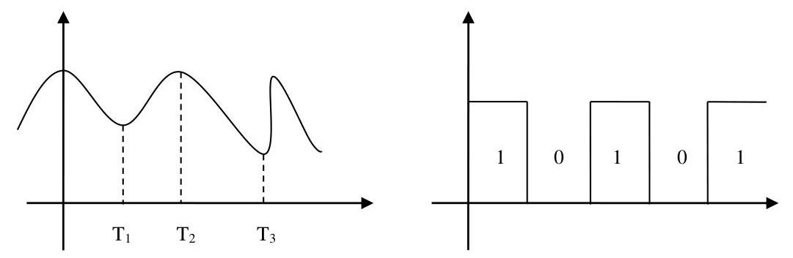

> [!caption|center] Şekil 1.1 Analog ve sayısal işaret örneği

### 1.2. Sayısal Sistemlerin Avantajları

Günümüzde birçok alanda analog sistemlerin yerini sayısal sistemler almıştır. Bunun başlıca nedenleri şunlardır:

1. _Tekrarlanabilirlik_: Sayısal sistemlerde belirli bir giriş kümesi defalarca uygulandığında **aynı çıkış** elde edilir. Analog sistemler çevresel koşullardan daha fazla etkilenir.
2. _Tasarım Kolaylığı_: Sayısal tasarım (Lojik tasarım), matematiksel değerleri nedeniyle **daha kolaydır**. Test etme ve hatalardan arındırma süreçleri de analog sistemlere göre daha basittir.
3. _Esneklik ve Programlanabilirlik_: Sayısal sistemler, değişen gereksinimlere göre **yeniden programlanabilir** yapıdadır.
4. _Bilgi Saklama ve İşleme_: Bilgilerin sayısal ortamda saklanması ve işlenmesi **daha kolaydır**.
5. _Hız_: Sayısal sistemler **daha hızlı çalışır**.
6. _Maliyet ve Boyut_: Sayısal sistemler küçülmekte ve **ucuzlamaktadır**.
7. _İletişim_: Verinin sistemler arası iletişimi **kolay ve esnektir**.
8. _Gelişme Potansiyeli_: Gelişmeye ve **yenilenmeye açıktır**.

**Analog Sistemlerin Avantajları:**

1. _Değer Aralığı_: Analog sinyal, gösterebileceği değer aralığında her değeri alabilir, bu sayede söz konusu değer **tam olarak** gösterilebilir. Sayısal sinyal ise discret değerler gösterir.
2. _Süreklilik_: Sürekli ve **kesintisizdir**.
3. _Algılama ve İşleme Kolaylığı_: Analog sinyalin algılanması kolay olduğu için **işlenmesi de basittir**. Sayısal sinyallerin algılanması daha zor ve işlenmesi karmaşıktır.

### 1.3. Analog/Sayısal Dönüşüm

Analog bir işaretin ikili bir işarete dönüştürülmesi kırpıcı devrelerle yapılabilir. Ancak, _Analog-Sayısal Dönüştürücü_ (ADC) ve _Sayısal-Analog Dönüştürücü_ (DAC) adı verilen özel elemanlar, daha karmaşık kodlanmış sayısal işaretler veya analog işaretler elde etmek için kullanılır.

ADC/DAC için iki önemli parametre vardır: **_bit sayısı_** ve **_dönüştürme hızı_**. Bit sayısı, dönüştürücünün duyarlılığını belirler. Bit sayısı arttıkça duyarlılık artar.

> [!example]+ Duyarlılık Hesaplama Formülü
> Duyarlılık, `a` ile gösterilir:

$$
a = \frac{V_{max} - V_{min}}{2^n} \quad (\text{bazı uygulamalarda } a = \frac{V_{max} - V_{min}}{2^n-1})
$$

> _Burada_ $V_{max}$ _maksimum gerilim, $V_{min}$ minimum gerilim ve $n$ bit sayısıdır.\_

Dönüştürme hızı, dönüştürme işleminin ne kadar sürede tamamlandığını belirtir. En hızlı dönüştürücüler _Flash dönüştürücüler_ olarak bilinir.

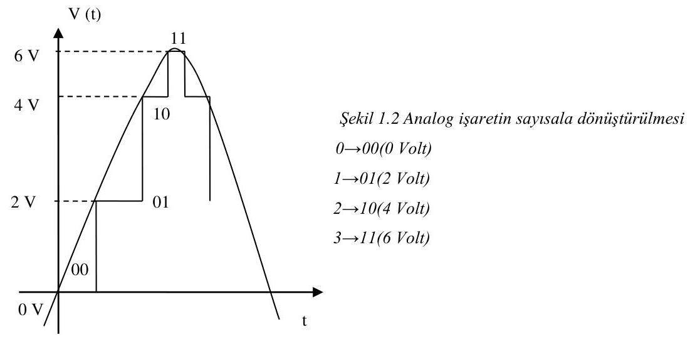

#### 1.3.1. ADC (Analog-to-Digital Converter)

Analog işaretin içerdiği bilginin **kuantalanmış ve kodlanmış** şeklini sayısal bir kod ile ifade etme işlemidir.

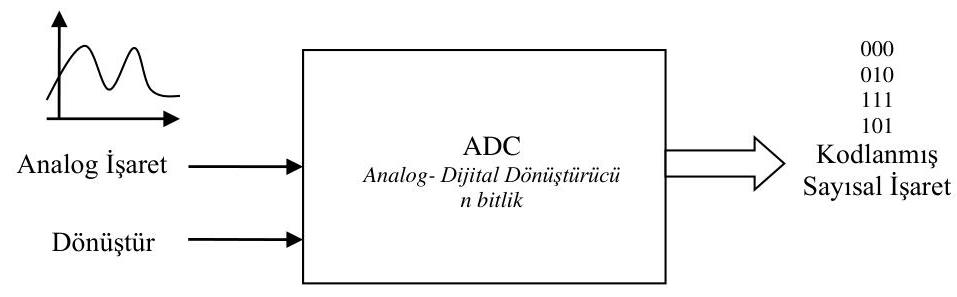

> [!caption|center] Şekil 1.3 Analog-Dijital dönüştürme işlemi

ADC'nin blok diyagramı aşağıdaki şekildedir:
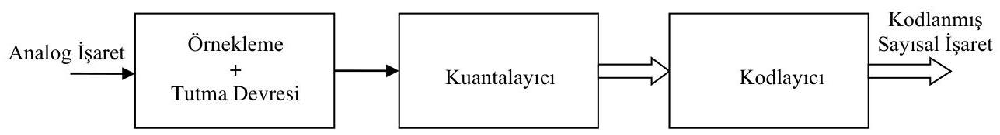

> [!caption|center] Şekil 1.4 ADC'nin blok diyagramı

#### Örnekleme ve Tutma İşlemleri

Örnekleme elemanı, belirli aralıklarla analog işaretten örnekler alır ve bu değerleri belli bir süre tutar. `T` örnekleme zamanını gösterir.

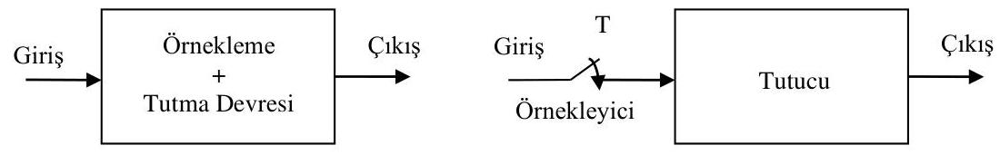

> [!caption|center] Şekil 1.5 Örnekleme ve Tutma Devresi

Örnekleme elemanının çalışma ilkesi **Shannon Teoremi**'ne dayanır:
`$\omega_s \ge 2\omega_c$` _Burada_ `$\omega_s$` _örnekleme frekansı ve_ `$\omega_c$` _işarete ait en yüksek frekanslı bileşenin frekansıdır._

#### Kuantalama

Sürekli bir büyüklüğün belirli sayıda **eşit aralıklı basamaklara** ayrılması işlemidir. Kuantalama kombinasyonundaki eleman sayısı arttıkça [[Duyarlılık]] artar.

> [!example]+ Kuantalama Örnekleri
> **Örnek 1.1:** -3 Volt ile +5 Volt arasında değişen bir analog işaretin 1 Volt duyarlılıkla sayısal olarak ifade etmek için kaç bit kullanmak gerekir?
>
> ```markdown
> a = 1 Volt olduğuna göre 1 = (5 - (-3)) / 2^n => 2^n = 8 => n = 3 bit
> ```
>
> **Örnek 1.2:** Bir analog işaret 0-15 Volt arasında kesintisiz değerler alabilmektedir. Bu işaretin 100 mV duyarlılıkla kodlanmış sayısal işarete dönüştürülmesi için kaç bitlik bir ADC gerekir?
>
> ```markdown
> a = 100 mV olduğuna göre 0.1 = (15 - 0) / 2^n => 2^n = 150 => n = 7.23 bit ≈ 8 bit
> ```

#### Kodlama-1

Kuantalama düzeylerine ikili sayı sisteminde birer kod verme işlemidir.

#### 1.3.2. DAC (Digital-to-Analog Converter)

Sayısal veriden analog işaret üreten elemandır. Girişlere `n` bitlik sayısal işaret uygulanır ve belirli bir gecikmeyle çıkışlarda buna karşılık düşen analog işaret elde edilir. En çok kullanılan yöntemler "ağırlık orantılamalı direnç devresi ve işlemsel kuvvetlendirici"dir.

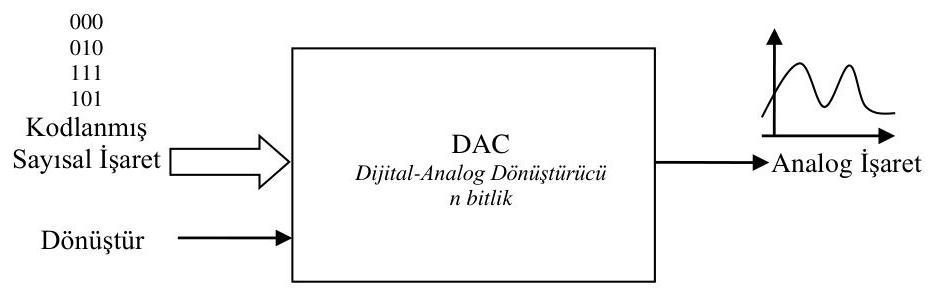

> [!caption|center] Şekil 1.6 Dijital-Analog dönüştürme işlemi

DAC'nin blok diyagramı:
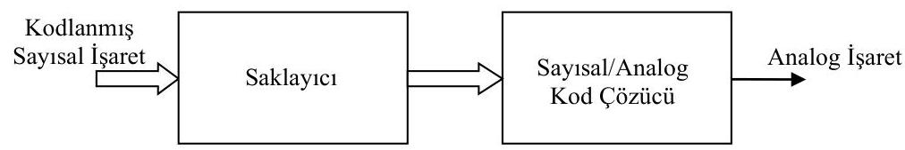

> [!caption|center] Şekil 1.7 DAC'nin blok diyagramı

> [!example]+ DAC Çıkış Tablosu Oluşturma
> **Örnek 1.3:** 4-bitlik bir DAC devresinin çıkış gerilim aralığı 0 V ile 6 V arasında değişmektedir. 0000 sayısal girişi 0 V'a, 1111 sayısal girişi 6 V'a karşılık düşecek biçimde DAC'a ait dönüştürme tablosu oluşturunuz.
>
> ```latex
> a = \frac{V_{max} - V_{min}}{2^n} = \frac{6-0}{2^4} = 0.375 Volt \quad \text{yada} \quad a = \frac{V_{max} - V_{min}}{2^n-1} = \frac{6-0}{2^4-1} = 0.4 Volt
> ```
>
> | Sayısal Girişler | Analog Çıkış $a=\frac{V_{\max }-V_{\min }}{2^{n}}$ | Analog Çıkış $a=\frac{V_{\max }-V_{\min }}{2^{n}-1}$ |
> | :--------------: | :------------------------------------------------: | :--------------------------------------------------: |
> |       0000       |                       0.000                        |                         0.0                          |
> |       0001       |                       0.375                        |                         0.4                          |
> |       0010       |                       0.750                        |                         0.8                          |
> |       0011       |                       1.125                        |                         1.2                          |
> |       0100       |                       1.500                        |                         1.6                          |
> |       0101       |                       1.875                        |                         2.0                          |
> |       0110       |                       2.250                        |                         2.4                          |
> |       0111       |                       2.625                        |                         2.8                          |
> |       1000       |                       3.000                        |                         3.2                          |
> |       1001       |                       3.375                        |                         3.6                          |
> |       1010       |                       3.750                        |                         4.0                          |
> |       1011       |                       4.125                        |                         4.4                          |
> |       1100       |                       4.500                        |                         4.8                          |
> |       1101       |                       4.875                        |                         5.2                          |
> |       1110       |                       5.250                        |                         5.6                          |
> |       1111       |                       5.625                        |                         6.0                          |

---

## 2. Sayı Sistemleri

Sayı sistemleri, sayısal verilerin ifade edilmesinde kullanılan tabanlara göre kategorize edilir. Başlıca sayı sistemleri:
a) Onluk (Decimal) sayı sistemi $\rightarrow$ 10 tabanlı
b) Sekizlik (Octal) sayı sistemi $\rightarrow$ 8 tabanlı
c) İkili (Binary) sayı sistemi $\rightarrow$ 2 tabanlı
d) Onaltılı (Hexadecimal) sayı sistemi $\rightarrow$ 16 tabanlı

Herhangi bir tabandaki sayı, basamak değerlerinin o tabanın kuvvetleri ile çarpılıp toplanmasıyla ifade edilir.

> [!example]+ Sayı Sistemlerinde Gösterim
>
> - $(173,25)_{10} = 1 \cdot 10^2 + 7 \cdot 10^1 + 3 \cdot 10^0 + 2 \cdot 10^{-1} + 5 \cdot 10^{-2}$
> - $(1247,172)_{8} = 1 \cdot 8^3 + 2 \cdot 8^2 + 4 \cdot 8^1 + 7 \cdot 8^0 + 1 \cdot 8^{-1} + 7 \cdot 8^{-2} + 2 \cdot 8^{-3}$
> - $(10111)_{2} = 1 \cdot 2^4 + 0 \cdot 2^3 + 1 \cdot 2^2 + 1 \cdot 2^1 + 1 \cdot 2^0$

| 10 tabanı | 2 tabanı | 8 tabanı | 16 tabanı | BCD  |
| :-------: | :------: | :------: | :-------: | :--: |
|     0     |   0000   |    0     |     0     | 0000 |
|     1     |   0001   |    1     |     1     | 0001 |
|     2     |   0010   |    2     |     2     | 0010 |
|     3     |   0011   |    3     |     3     | 0011 |
|     4     |   0100   |    4     |     4     | 0100 |
|     5     |   0101   |    5     |     5     | 0101 |
|     6     |   0110   |    6     |     6     | 0110 |
|     7     |   0111   |    7     |     7     | 0111 |
|     8     |   1000   |    10    |     8     | 1000 |
|     9     |   1001   |    11    |     9     | 1001 |
|    10     |   1010   |    12    |     A     |      |
|    11     |   1011   |    13    |     B     |      |
|    12     |   1100   |    14    |     C     |      |
|    13     |   1101   |    15    |     D     |      |
|    14     |   1110   |    16    |     E     |      |
|    15     |   1111   |    17    |     F     |      |

### 2.1. `n` tabanından `10` tabanına dönüşüm

`n` tabanındaki bir sayının 10 tabanına dönüştürülmesi, her basamaktaki rakamın, basamak değerine (tabanın kuvveti) göre çarpılıp toplanmasıyla yapılır.

> [!example]+ `n` Tabanından `10` Tabanına Dönüşüm Örnekleri
>
> - $(547,6)_{8} = 5 \cdot 8^2 + 4 \cdot 8^1 + 7 \cdot 8^0 + 6 \cdot 8^{-1}$
> - $(1001,0111)_{2} = 1 \cdot 2^3 + 0 \cdot 2^2 + 0 \cdot 2^1 + 1 \cdot 2^0 + 0 \cdot 2^{-1} + 1 \cdot 2^{-2} + 1 \cdot 2^{-3} + 1 \cdot 2^{-4}$
> - $(3CD8)_{16} = 3 \cdot 16^3 + 12 \cdot 16^2 + 13 \cdot 16^1 + 8 \cdot 16^0$

### 2.2.`m` tabanından `n` tabanına dönüşüm

Bu dönüşüm genellikle ara bir adım olarak 10 tabanına çevirme ve oradan hedef tabana dönüştürme şeklinde yapılır. Ancak kesirli kısımlar için özel yaklaşımlar kullanılır.

> [!example]+ `m` Tabanından `n` Tabanına Dönüşüm Örnekleri
>
> - $(253,263)_{10} = (375,206)_{8}$
>
> ```markdown
> r = 3 _ (ln 10 / ln 8) = 3.32
> 253 / 8 = 31 (kalan = 5) => 375
> 31 / 8 = 3 (kalan = 7)
> 0.263 _ 8 = 2.104
> 0.104 _ 8 = 0.832
> 0.832 _ 8 = 6.656 => 206
> ```
>
> - $(0.37)_{10} = (0.0101111)_{2}$
>
> ```markdown
> r = 2 _ (ln 10 / ln 2) = 6.64
> 0.37 _ 2 = 0.74
> 0.74 _ 2 = 1.48
> 0.48 _ 2 = 0.96 => 0101111
> ```
>
> - $(0.25)_{10} = (0.01)_{2}$
>
> ```markdown
> r = 2 _ (ln 10 / ln 2) = 6.64
> 0.25 _ 2 = 0.5
> 0.5 \* 2 = 1.00 => 01
> ```
>
> - $(0.7304)_{8} = (0.1011...)_{2}$
>
> ```markdown
> r = 4 _ (ln 8 / ln 2) = 12
> 0.7304 _ 2 = 1.4608
> 0.4608 _ 2 = 0.9216
> 0.9216 _ 2 = 1.8432
> 0.8432 \* 2 = 1.6864 => 1011
> ```

### 2.3. Sayı Sistemlerinde Toplama ve Çıkarma

#### 2.3.1. İkili sayılarda toplama ve çıkarma

| `a` | `b` | `a+b` | Elde | `a-b` | Ödünç |
| :-: | :-: | :---: | :--: | :---: | :---: |
|  0  |  0  |   0   |  0   |   0   |   0   |
|  0  |  1  |   1   |  0   |   1   |   1   |
|  1  |  0  |   1   |  0   |   1   |   0   |
|  1  |  1  |   0   |  1   |   0   |   0   |

> [!example]+ İkili Sayı Aritmetik Örnekleri
>
> - $1101_2 + 1111_2 = 11100_2 \quad (13 + 15 = 28)$
> - $1011_2 - 0101_2 = 0110_2 \quad (11 - 5 = 6)$

#### 2.3.2. 8' li ve 16' l sayılarda toplama ve çıkarma

> [!example]+ Oktal ve Onaltılık Sayı Aritmetik Örnekleri
>
> - $(15)_8 + (37)_8 = (54)_8$
> - $(9)_{16} + (8)_{16} = (11)_{16}$
> - $(26)_8 - (17)_8 = (07)_8$
> - $(26)_{16} - (17)_{16} = (0F)_{16}$

#### 2.3.3. İşaretli Sayıların Gösterimi

Binary sayının en solundaki bit (MSB) **işaret biti** olarak kullanılır. `1` ise sayı negatif, `0` ise pozitif olduğu anlaşılır. Ayrıca **1'e tümleme** ve **2'ye tümleme** yöntemleri de kullanılır.

> [!note]
> **ÖNEMLİ:**
>
> - **1'e tümleme**: 1 olan bitler 0, 0 olan bitler 1 yapılır.
> - **2'ye tümleme**: 1'e tümleme ile elde edilen sonuca 1 eklenerek bulunur.

> [!example]+ İşaretli Sayı Gösterimi Örnekleri
>
> - $-5_{10} = 10101_2 \quad (5 = 00101_2 \text{ - İşaret biti kullanılıyor})$
> - $5_{10} = 0101_2 \xrightarrow{1'\text{e tümleme}} 1010_2 \xrightarrow{2'\text{e tümleme}} 1011_2 \Rightarrow -5_{10} = 1011_2 \text{ (İşaret biti kullanılmıyor)}$

#### 2.3.4. İşaretli sayılarda tabana göre tümleme aritmetiği ile çıkarma işlemi

`N` sayısının `r`'ye göre tümleyenini hesaplamak için `$r^n - N$` formülü kullanılır (n: işlemdeki en büyük sayının tamsayı sayısı).

##### 10 tabanında

> [!example]+ 10 tabanında tümleme ile çıkarma
>
> - $(66358)_{10} - (2164)_{10} =$ ?
> - $(2164)_{10}$ sayısının 10'a tümleyeni: $10^5 - (2164)_{10} = (97836)_{10}$
> - $(66358)_{10} + (97836)_{10} = (164194)_{10}$ -> Elde oluştuğu için sonuç pozitiftir ve atılır, sonuç: $+64194$.
> - $(2164)_{10} - (66358)_{10} =$ ?
> - $(66358)_{10}$ sayısının 10'a tümleyeni: $10^5 - (66358)_{10} = (33642)_{10}$
> - $(2164)_{10} + (33642)_{10} = (35806)_{10}$ -> Elde oluşmadığı için sonuç negatiftir, sonucun 10'a tümleyeni alınır: $10^5 - (35806)_{10} = (-64194)_{10}$.

##### İkili tabanda

> [!example]+ İkili tabanda tümleme ile çıkarma
>
> - $(1110011)_2 - (1101010)_2 =$ ?
> - $(1101010)_2$ sayısının 2'ye tümleyeni: 1'e tümleme `0010101` -> 2'ye tümleme `0010101 + 0000001 = 0010110`
> - $(1110011)_2 + (0010110)_2 = (10001001)_2$ -> Taşma (elde) olduğu için sonuç pozitiftir, elde göz ardı edilip sonuç: $+0001001$.
> - $(1101010)_2 - (1110011)_2 =$ ?
> - $(1110011)_2$ sayısının 2'ye tümleyeni: 1'e tümleme `0001100` -> 2'ye tümleme `0001100 + 0000001 = 0001101`
> - $(1101010)_2 + (0001101)_2 = (1110111)_2$ -> Elde yok, sonuç negatiftir, sonucun 2'ye tümleyeni alınır:
>   - $(1110111)_2$ sayısının 2'ye tümleyeni: 1'e tümleme `0001000` -> 2'ye tümleme `0001000 + 0000001 = 0001001`
>   - Sonuç: $-0001001_2$.
> - $X=1010100, Y=1000011$. İkiye tümleyenlerini kullanarak aşağıdaki işlemleri yapınız.
> - a) $X-Y=$ ?
>   - $Y$'nin 2'ye tümleyeni: `0111100` (1'e tümleme) + `0000001` = `0111101`
>   - $X-Y = 1010100 + 0111101 = 10010001$ -> Elde atılır, sonuç pozitiftir: $+0010001$.
> - b) $Y-X=$ ?
>   - $X$'in 2'ye tümleyeni: `0101011` (1'e tümleme) + `0000001` = `0101100`
>   - $Y-X = 1000011 + 0101100 = 1101111$ -> Elde yok, sonuç negatiftir. Sonucun 2'ye tümleyeni alınır: `0010000` (1'e tümleme) + `0000001` = `0010001` -> Sonuç: $-0010001$.

**1'e tümleyenle çıkarma**

> [!example]+ 1'e tümleyenle çıkarma
>
> - $X=1010100, Y=1000011$. 1'e tümleyenlerini kullanarak aşağıdaki işlemleri yapınız.
> - a) $X-Y=$ ?
>   - $Y'$ (Y'nin 1'e tümleyeni) = `0111100`
>   - $X+Y' = 1010100 + 0111100 = 10010000$ (Elde aktarım)
>   - $0010000 + 0000001$ (Elde Aktarım) = $0010001$.
> - b) $Y-X=$ ?
>   - $X'$ (X'in 1'e tümleyeni) = `0101011`
>   - $Y+X' = 1000011 + 0101011 = 1101110$
>   - Elde yok, sonucun 1'e tümleyeni alınır: $(1101110)' = -0010001$.
> - $(1101)_2 - (0111)_2 = (1101)_2 + (1000)_2 = (10101)_2 + (0001)_2 = +0110_2$
> - $(0111)_2 - (1101)_2 = (0111)_2 + (0010)_2 = (1001)_2 \xrightarrow{1'\text{e tümleme}} -0110_2$

---

## 3. Sayısal (Dijital) Kodlama

### Kodlama

Bilginin veya verinin sayısal olarak gösterilmesi için kullanılan yöntemdir. Sonlu elemanlı bir kümenin her bir elemanına birer kod verilmesi olarak tanımlanabilir. Sayısal sistemler ikili (binary) sayı düzenine dayandığı için, bilgi öncelikle kodlanarak sayısal olarak sembolize edilmelidir.

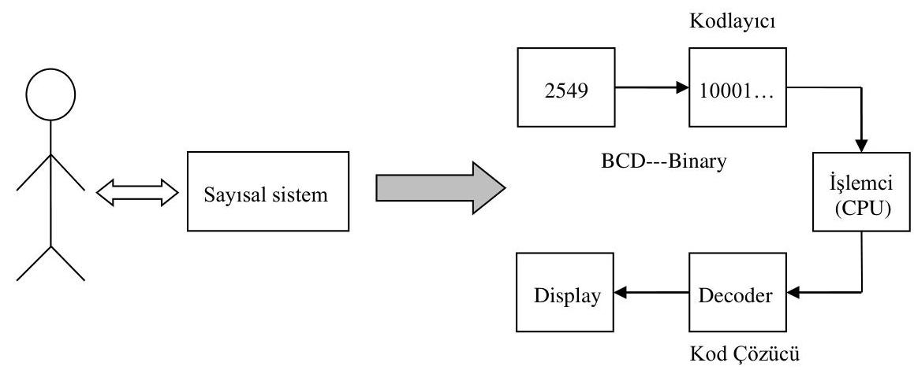

> [!caption|center] Şekil 3.1. Sayısal sistem ile insanın diyalog kurması

> [!example]+ Kodlama Örneği: Eleman Sayısı ve Bit İhtiyacı
> Altı elemanlı bir kümenin ($F = \{ \text{Ali, Veli, Sira, Masa, Ayşe, Tahta} \}$) kodlamasını inceleyelim.
> Bu 6 elemanı kodlamak için `$n$` bite ihtiyaç duyulursa:
> `$2^n = 6 \rightarrow n \cong 3 \text{ bit}$` olarak bulunur.
> 3 bit ile kodlama yapıldığında kullanılmayan 2 durum kalır, bu durum **artıklı kodlama** olarak adlandırılır. Bit sayısı ile oluşan bütün kodlar kullanılırsa **artıksız kodlama** söz konusudur.
>
> Alfabedeki harflerin her biri bir kodla ifade edilecek olsa gereken bit sayısı:
> `$2^n = 29 \rightarrow n \cong 5 \text{ bit}$` olarak bulunur.

### Sayısal Kodlama

Sayısal kodlama, sayıların bellekte tutulma şeklini belirler. Sayılar ya doğrudan ikili karşılıklarıyla ya da sayının her hanesindeki rakama bir kod atanarak temsil edilirler. Örneğin BCD, Excess-3, Aiken ve Gray kodlama şekilleri kullanılır.

### 3.1. İkili Kodlanmış Ondalık Gösterim (BCD-Binary Coded Decimal)

Ondalık sayının her hanesinin ikili olarak kodlanmasıdır. Bu bir taban dönüşümü değildir. BCD kodlamada 0-9 arası sayılar kullanılır; 10-15 arası kullanılmaz (artıklı kodlama).

> [!example]+ BCD Gösterim
>
> - $(24)_{10}$ sayısının normal ikili karşılığı $(11000)_{2}$ iken, BCD karşılığı $(00100100)_{2}$ olarak yazılır.

#### 3.1.1. BCD Toplama

- Hanelerin toplanması sırasında sonuç 9'a eşit veya küçükse sonuç doğrudan BCD'dir.
- Toplama sonucu 10-16 arasında ise sonuç BCD kodunda değildir. Bu durumda, ikili kodlanmış 6 sayısı eklenir ve oluşan elde bir üst kademeye aktarılır.

> [!example]+ BCD Toplama Örnekleri
>
> - $(25)_{10} + (11)_{10} = (36)_{10} \Rightarrow (00100101)_2 + (00010001)_2 = (00110110)_2$
> - $(24)_{10} + (39)_{10} = (63)_{10} \Rightarrow (00100100)_2 + (00111001)_2 = (01011101)_2$
> - $(01011101)_2 + (0110)_2 = (10011)_2$ (Birler basamağının elde biti onlar basamağına eklenir)
> - $(10011)_2 + (01010000)_2 = (01100011)_2$

#### 3.1.2. BCD Çıkarma

BCD'de çıkarma işlemi için çıkarılacak sayının 10'a tümleyeni alınır ve toplama işlemi gerçekleştirilir.

> [!example]+ BCD Çıkarma Örneği
>
> - $(69)_{10} - (32)_{10} = ?$
> - $(32)_{10}$'un 10'a tümleyeni: $(10^2)_{10} - (32)_{10} = (68)_{10}$
> - Toplama işlemi: $(69)_{10} + (68)_{10} = (137)_{10}$
> - İkili tabanda gerçekleştirilmesi:
>   - $(01101001)_2 + (01101000)_2 = (110010001)_2$
>   - $(110010001)_2 + (01100110)_2 = (1001010111)_2$ (Birler basamağının elde biti onlar basamağına eklenir.)
>   - $= (100110111)_2$ (Elde biti sayının pozitif olduğunu gösterir, bu nedenle dikkate alınmaz.)

### 3.2. Üç Fazlalık Kodu (Excess-3)

İkili sistemin üç fazlası alınarak oluşturulan, ağırlığı olmayan **simetrik** bir koddur.

| Sayı | 3-Fazlalık Kodu |
| :--: | :-------------: |
|  0   |      0011       |
|  1   |      0100       |
|  2   |      0101       |
|  3   |      0110       |
|  4   |      0111       |
|  5   |      1000       |
|  6   |      1001       |
|  7   |      1010       |
|  8   |      1011       |
|  9   |      1100       |

#### 3.2.1. Üç fazlalık kodunda aritmetik işlemler

- Toplamada üst haneye geçen bir sayı yoksa sonuca ikili tabanda 3 çıkarmak gerekir.
- Toplamada üst haneye geçen bir sayı oluşursa, ikili tabanda 3 eklenir (bu ekleme işlemi üst haneye geçen sayı için de yapılır).

> [!example]+ Excess-3 Aritmetik Örnekleri
>
> - $(2)_{10} + (3)_{10} = (5)_{10} \Rightarrow (0101)_{Ex-3} + (0110)_{Ex-3} = (1011)_2$ (1. kural)
> - Sonuçtan 3 çıkarılır: $(1011)_2 - (0011)_2 = (1000)_{Ex-3}$ (5'e karşılık gelir)
> - $(5)_{10} + (8)_{10} = (13)_{10} \Rightarrow (1000)_{Ex-3} + (1011)_{Ex-3} = (10011)_2$ (2. kural)
> - Elde oluştuğu için 3 eklenir: $(10011)_2 + (0011)_2 = (00010110)_2$
> - $(00010110)_2 + (00110000)_2 = (01000110)_{Ex-3}$ (13'e karşılık gelir)

### 3.3. Aiken Kodu

0-9 arasındaki sayıların ilk beş ve son beş rakamlarının ikili karşılıklarından oluşan **simetrik** bir koddur. (0-4) arasındaki sayılar bilinen ikili kodlamaya eşdeğerken, (5-9) arasındaki sayılar ilk beş sayının 1'e tümleyenidir.

| Sayı | Aiken Kodu |
| :--: | :--------: |
|  0   |    0000    |
|  1   |    0001    |
|  2   |    0010    |
|  3   |    0011    |
|  4   |    0100    |
|  5   |    1011    |
|  6   |    1100    |
|  7   |    1101    |
|  8   |    1110    |
|  9   |    1111    |

#### 3.3.1. Aiken kodunda aritmetik işlemler

1. Toplama işlemi sonucunda doğru netice ile karşılaşılır ve üst kademeye geçen bir elde yoksa sonuca ikili tabanda 6 eklenir.
2. Toplama işlemi sonucunda üst haneye geçen bir elde oluşursa, sonuçtan ikili tabanda 6 çıkarılır.

> [!example]+ Aiken Kodu Aritmetik Örnekleri
>
> - $(3)_{10} + (6)_{10} = (9)_{10} \Rightarrow (0011)_{Aiken} + (1100)_{Aiken} = (1111)_{Aiken}$ (1. kural)
> - $(2)_{10} + (3)_{10} = (5)_{10} \Rightarrow (0010)_{Aiken} + (0011)_{Aiken} = (0101)_2$ (2. kural)
> - Sonuca 6 eklenir: $(0101)_2 + (0110)_2 = (1011)_{Aiken}$
> - $(8)_{10} + (9)_{10} = (17)_{10} \Rightarrow (1110)_{Aiken} + (1111)_{Aiken} = (11101)_2$ (3. kural)
> - Sonuçtan 6 çıkarılır: $(11101)_2 - (0110)_2 = (10111)_2$ (bu Aiken'de 17'yi ifade etmez)
> - Sonuç Aiken kodunda olmadığı için tekrar 2. kurala dönülür ve 6 eklenir: $(10111)_2 + (0110)_2 = (11101)_{Aiken}$ (Aiken kodunda 17 sayısını ifade eder).

### 3.4. Bitişik Kodlar ve Gray Kodu

Birbirini izleyen sayılara karşılık gelen ikili kod sözcükleri arasındaki uzaklık (Hamming uzaklığı) **1** ise, bu kodlara **Bitişik Kodlar** denir. Kod sözcüklerinin birincisi ile sonuncusu arasındaki uzaklık da 1 ise, **Çevrimli Bitişik Kodlar** adını alırlar.

> [!example]+ Bitişik Kod Örneği
> 0'dan 3'e kadar sayılar için kodlama $00, 01, 11, 10$ şeklinde yapılırsa bitişik kodlama elde edilir.
>
> **Dört bitlik çevrimli bir BCD kodlaması oluşturulması**
> Karnaugh diyagramı benzeri bir tablo kullanılırsa:
>
> | Sayı | Kod Sözcüğü (ABCD) |
> | :--: | :----------------: |
> |  0   |        0000        |
> |  1   |        0001        |
> |  2   |        0011        |
> |  3   |        0010        |
> |  4   |        0110        |
> |  5   |        1110        |
> |  6   |        1010        |
> |  7   |        1000        |
> |  8   |        1100        |
> |  9   |        0100        |
>
> Karnaugh diyagramı ile çevrimli bir BCD kodunun elde edilmesi:
> 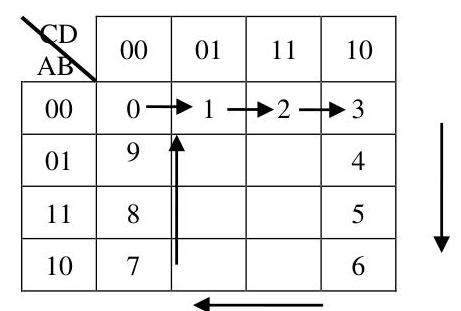

#### 3.4.1. Gray kodu

`$2^n$` elemanlı bir küme için, 2 tabanında **artıksız ve çevrimli** bir kodlama yapılırsa yansımalı bir kod olan **Gray Kodu** elde edilir. Sayma ve sütun tarama işlemlerinde kullanılır. Karnaugh diyagramının geçişlerinde önemli rol oynar.

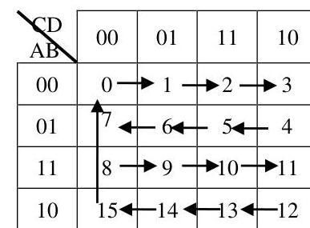

| Sayı | İkili Sayı | Gray Kodu |
| :--: | :--------: | :-------: |
|  0   |    0000    |   0000    |
|  1   |    0001    |   0001    |
|  2   |    0010    |   0011    |
|  3   |    0011    |   0010    |
|  4   |    0100    |   0110    |
|  5   |    0101    |   0111    |
|  6   |    0110    |   0101    |
|  7   |    0111    |   0100    |
|  8   |    1000    |   1100    |
|  9   |    1001    |   1101    |
|  10  |    1010    |   1111    |
|  11  |    1011    |   1110    |
|  12  |    1100    |   1010    |
|  13  |    1101    |   1011    |
|  14  |    1110    |   1001    |
|  15  |    1111    |   1000    |

---

## 4. Lojik Devre Temelleri

Lojik devreler, ikili işaretler (lojik 0 ve lojik 1) veya ikili kodlanmış veriler üzerinde çalışan, **Boole Cebri**ne dayalı düzeneklerdir. Bilgisayarlar da dahil olmak üzere tüm sayısal sistemler, bu iki lojik değerin farklı kombinasyonları kullanılarak tasarlanır.

### 4.1. AND (VE) Kapısı

Birleşik önermenin doğru olması için, birbirine **VE** işlemi ile bağlı her iki önermenin de doğru olması gerekir.

| $A$ | $B$ | $F=A \cdot B$ |
| :-: | :-: | :-----------: |
|  0  |  0  |       0       |
|  0  |  1  |       0       |
|  1  |  0  |       0       |
|  1  |  1  |       1       |

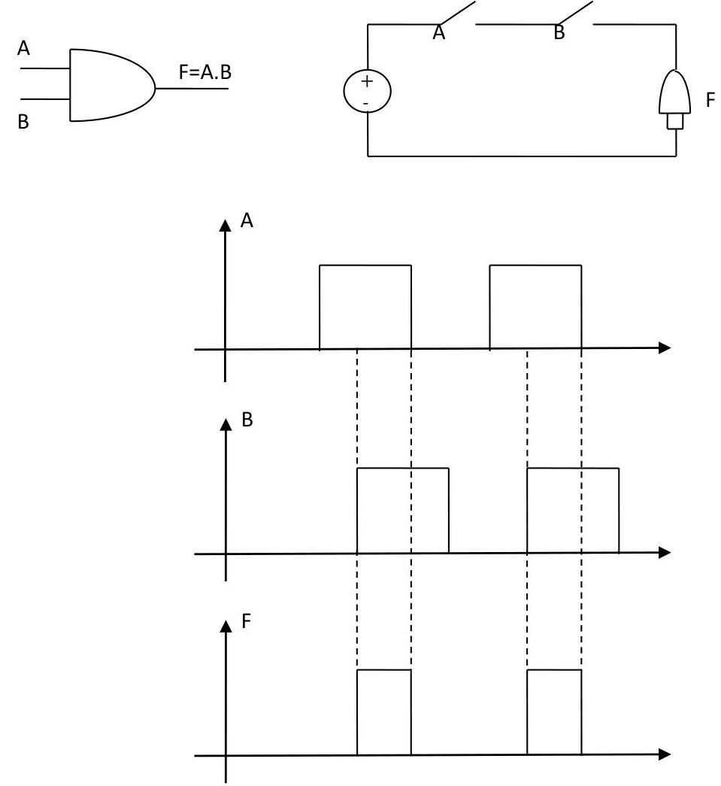

> [!caption|center] Şekil 4.1. AND kapısı, anahtar devrelerindeki karşılığı ve zamanlama diyagramı

### 4.2. OR (VEYA) Kapısı

Birleşik önermenin doğru olması için, birbirine **VEYA** işlemi ile bağlı önermelerden _en az birinin_ doğru olması gerekir.

| $A$ | $B$ | $F=A+B$ |
| :-: | :-: | :-----: |
|  0  |  0  |    0    |
|  0  |  1  |    1    |
|  1  |  0  |    1    |
|  1  |  1  |    1    |

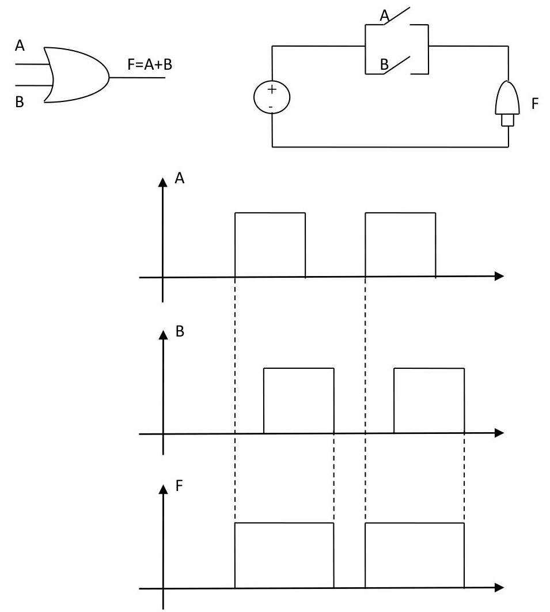

> [!caption|center] Şekil 4.2. OR kapısı, anahtar devrelerindeki karşılığı ve zamanlama diyagramı

### 4.3. NOT (DEĞİL) Kapısı

**NOT** işlemi, önermenin doğruluk değerini tersine çevirir; doğru ise yanlış, yanlış ise doğru yapar.

| $A$ | $F=\bar{A}$ |
| :-: | :---------: |
|  0  |      1      |
|  1  |      0      |

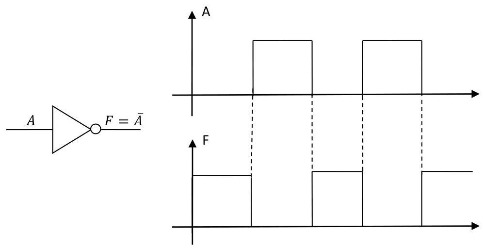

> [!caption|center] Şekil 4.3. NOT kapısı ve zamanlama diyagramı

### 4.4. NAND (VE DEĞİL) Kapısı

Birleşik önermenin yanlış olması için, birbirine **VE DEĞİL** işlemi ile bağlı her iki önermenin de doğru olması gerekir. (AND kapısının tersi)

| $A$ | $B$ | $F=\overline{A \cdot B}$ |
| :-: | :-: | :----------------------: |
|  0  |  0  |            1             |
|  0  |  1  |            1             |
|  1  |  0  |            1             |
|  1  |  1  |            0             |

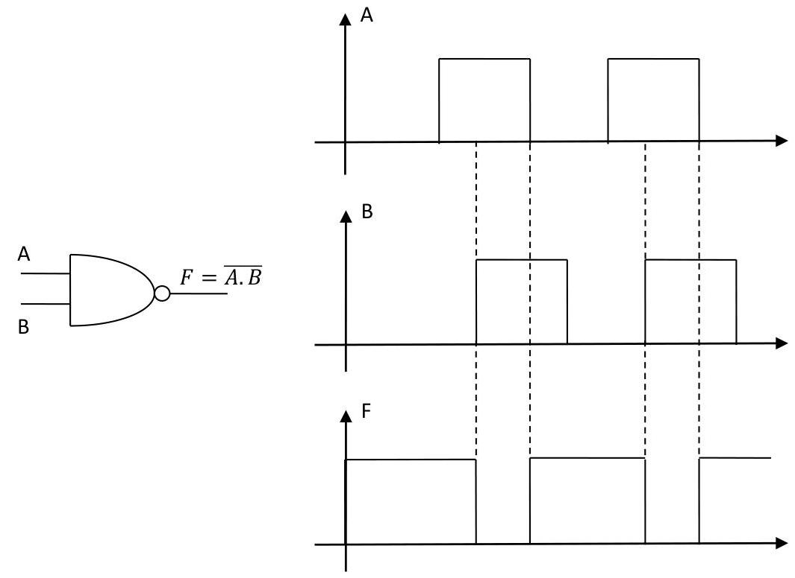

> [!caption|center] Şekil 4.4. NAND kapısı ve zamanlama diyagramı

### 4.5. NOR (VEYA DEĞİL) Kapısı

Birleşik önermenin doğru olması için, birbirine **VEYA DEĞİL** işlemi ile bağlı her iki önermenin de yanlış olması gerekir. (OR kapısının tersi)

| $A$ | $B$ | $F=\overline{A+B}$ |
| :-: | :-: | :----------------: |
|  0  |  0  |         1          |
|  0  |  1  |         0          |
|  1  |  0  |         0          |
|  1  |  1  |         0          |

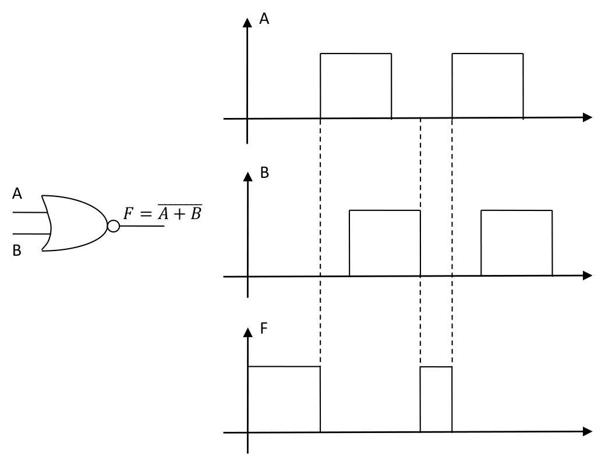

> [!caption|center] Şekil 4.5. NOR kapısı ve zamanlama diyagramı

### 4.6. XOR (ÖZEL VEYA) Kapısı

Birleşik önermenin doğru olması için, birbirine **ÖZEL VEYA** işlemi ile bağlı önermelerden _birinin doğru, diğerinin yanlış_ olması gerekir.

| $A$ | $B$ | $F=A \oplus B$ |
| :-: | :-: | :------------: |
|  0  |  0  |       0        |
|  0  |  1  |       1        |
|  1  |  0  |       1        |
|  1  |  1  |       0        |

$F = A \oplus B = \bar{A}B + A\bar{B}$

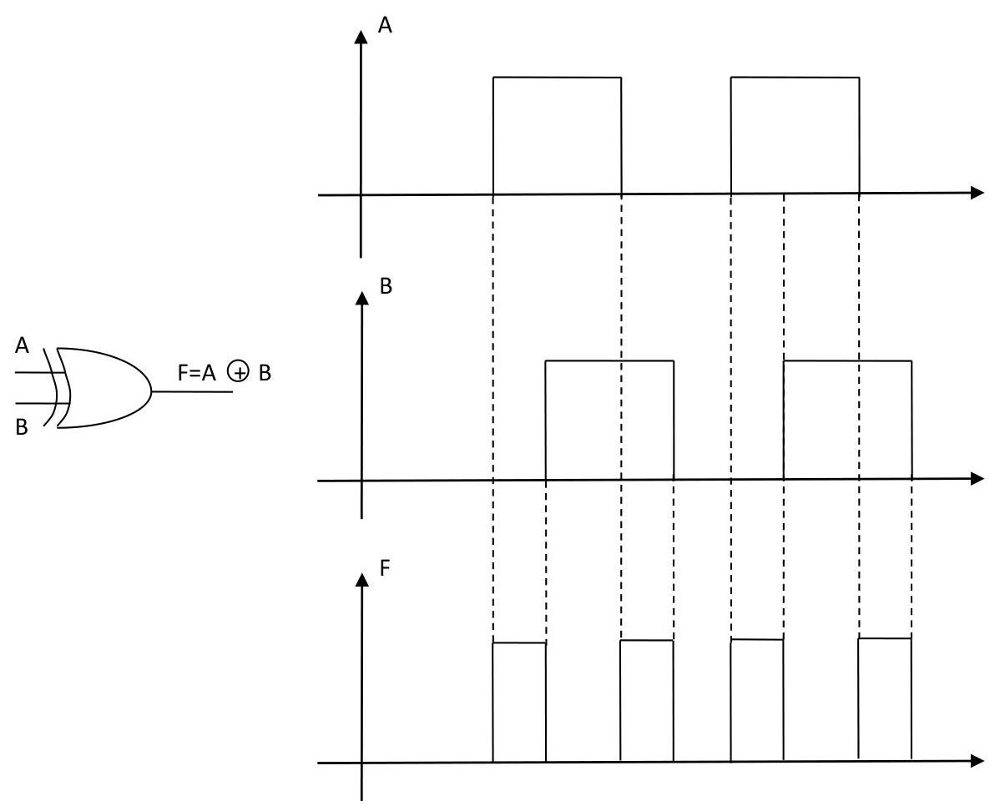

> [!caption|center] Şekil 4.6. XOR kapısı ve zamanlama diyagramı

### 4.7. XNOR (ÖZEL VEYA DEĞİL) Kapısı

Birleşik önermenin doğru olması için, birbirine **ÖZEL VEYA DEĞİL** işlemi ile bağlı her iki önermenin de _aynı doğruluk değerine_ (ikisi de doğru veya ikisi de yanlış) sahip olması gerekir.

| $A$ | $B$ | $F=\overline{A \oplus B}$ |
| :-: | :-: | :-----------------------: |
|  0  |  0  |             1             |
|  0  |  1  |             0             |
|  1  |  0  |             0             |
|  1  |  1  |             1             |

$F = A \odot B = AB + \bar{A}\bar{B}$

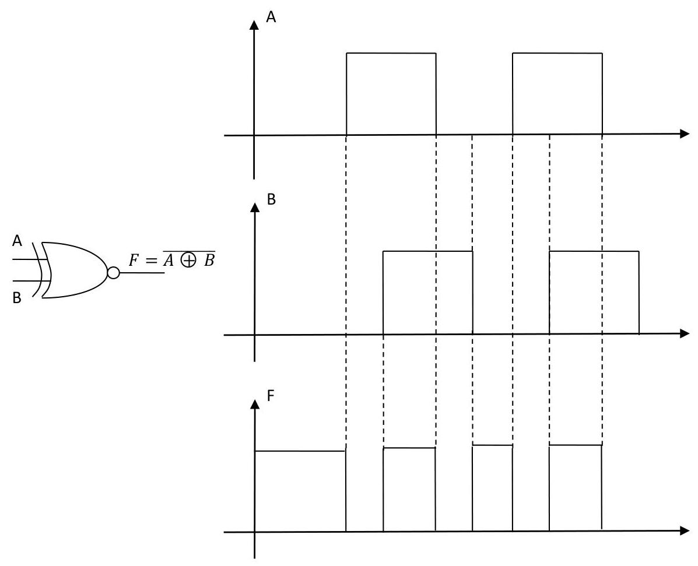

> [!caption|center] Şekil 4.7. XNOR kapısı ve zamanlama diyagramı

### 4.8. TAMPON (BUFFER) Elemanı

Akım kuvvetlendirmek amacıyla entegrenin çıkışına bağlanır. Giriş sinyalini aynen çıkışa aktarır, ancak akım kapasitesini artırır.

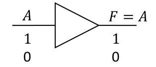

> [!caption|center] Şekil 4.8. TAMPON Elemanı

### 4.9. THREE STATE BUFFER

Üç durumlu Tampon, normal lojik 0 ve 1 durumlarına ek olarak bir de yüksek empedans (Z) durumuna sahiptir. Bu, birden fazla cihazın aynı veri hattını kullanmasına olanak tanır.

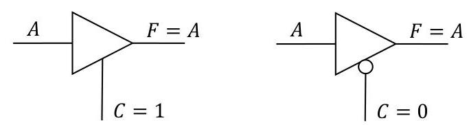

> [!caption|center] Şekil 4.9. THREE-STATE BUFFER

---

## 5. Boolean Cebri Aksiyom ve Teoremleri

Lojik devre tasarımı, **Boole Cebri** kuralları çerçevesinde yapılır. Boole Cebri'nde kabul edilen önermelere "aksiyom", doğruluğu ispatlanabilen önermelere ise "teorem" adı verilir.

### 5.1. Boole Cebri Aksiyomları

`0` ve `1` ikilisinden oluşan bir `B` kümesine `+` (OR) ve `.` (AND) işlemleri uygulanmış olsun:

1. Her bir değişken **0** veya **1** değerinden sadece birini alabilir.
   - `$a \neq 0 \Rightarrow a=1$`
   - `$a \neq 1 \Rightarrow a=0$`
2. a) `$1+1=1$` (_VE/VEYA işlemi: İkisi de doğru ise doğru_)
   b) `$0 \cdot 0=0$` (_VE/VEYA işlemi: İkisi de yanlış ise yanlış_)
3. a) `$0+0=0$` (_VEYA işlemi: İkisi de yanlış ise yanlış_)
   b) `$1 \cdot 1=1$` (_VE işlemi: İkisi de doğru ise doğru_)
4. a) `$1+0=1$` (_VEYA işlemi: Biri doğru ise doğru_)
   b) `$0 \cdot 1=0$` (_VE işlemi: Biri yanlış ise yanlış_)

### 5.2. Boole Cebri Teoremleri

1. **Değişme Özelliği**
   a) `$a+b=b+a$`
   b) `$a \cdot b=b \cdot a$`
2. **Birleşme Özelliği**
   a) `$a+b+c=(a+b)+c=a+(b+c)$`
   b) `$a \cdot b \cdot c=(a \cdot b) \cdot c=a \cdot (b \cdot c)$`
3. **Dağılma Özelliği**
   a) `$a+b \cdot c=(a+b) \cdot (a+c)$`
   b) `$a \cdot (b+c)=(a \cdot b)+(a \cdot c)$`
4. **Değişkende Fazlalık Özelliği**
   a) `$a+a=a$`
   b) `$a \cdot a=a$`
5. **Yutma Özelliği**
   a) `$a+a \cdot b=a$`
   b) `$a \cdot (a+b)=a$`
6. **İşlemde Fazlalık Özelliği**
   a) `$\overline{(a)}=a$` (_Yanlış gösterim, doğrusu $\overline{\bar{a}}=a$_)
   b) `$\overline{(\bar{a})}=a$`
7. **De Morgan Kuralı**
   a) `$\overline{(a+b+c+\dots)}=\bar{a} \cdot \bar{b} \cdot \bar{c} \cdot \dots$`
   b) `$\overline{(a \cdot b \cdot c \cdot \dots)}=\bar{a}+\bar{b}+\bar{c}+\dots$`
8. **Sabit Özelliği**
   a) `$a+\bar{a}=1$`
   b) `$a \cdot \bar{a}=0$`
9. **Etkisizlik Özelliği**
   a) `$0+a=a$`
   b) `$1 \cdot a=a$`
10. **Yutan Sabit Özelliği**
    a) `$1+a=1$`
    b) `$0 \cdot a=0$`
11. a) `$(a+\bar{b}) \cdot b=a \cdot b$` _(Yanlış gösterim, doğrusu $a\bar{b}+b = a+b$ ya da $(a+b)(\bar{a}+b)=b$)_
    b) `$a \cdot \bar{b}+b=a+b$`
12. a) `$(a+b) \cdot (\bar{a}+c) \cdot (b+c)=(a+b) \cdot (\bar{a}+c)$`
    b) `$a \cdot b+\bar{a} \cdot c+b \cdot c=a \cdot b+\bar{a} \cdot c$`
13. a) `$(a+b) \cdot (\bar{a}+c)=a \cdot c+\bar{a} \cdot b$`
    b) `$a \cdot b+\bar{a} \cdot c=(a+c) \cdot (\bar{a}+b)$`
14. **Shannon Teoremi**
    a) `$f(a, b, c, d, \dots)=[a+f(0, b, c, d, \dots)] \cdot [\bar{a}+f(1, b, c, d, \dots)]$`
    b) `$f(a, b, c, d, \dots)=[a \cdot f(1, b, c, d, \dots)]+[\bar{a} \cdot f(0, b, c, d, \dots)]$

> [!example]+ Boole Cebri Uygulama Örnekleri
> **Örnek 5.1:** `$F=A \cdot (\overline{B+C}) + \bar{A} + (\bar{B} \cdot C) \Rightarrow \bar{F}=?$`. Verilen fonksiyona De Morgan Teoremini uygulayınız.
>
> ```markdown
> F = A _ (B+C)' + A' + (B' _ C)
>
> F' = (A _ (B+C)' + A' + (B' _ C))'
> F' = (A _ (B+C)')' _ (A')' _ (B' _ C)' (De Morgan)
> F' = (A' + (B+C)) _ A _ (B + C') (De Morgan ve çift değilleme)
> F' = (A' + B + C) _ (A _ B + A _ C') (Dağılma özelliği)
> F' = (A' + B + C) _ (AB + A C') (Parantez kaldırıldı)
> ```
>
> **Örnek 5.2:** `$F_1=\bar{x}yz+\bar{x}\bar{y}z`$, `$F_2=x(\bar{y}\bar{z}+yz)$`. Verilen fonksiyonların terslerini bulunuz.
>
> ```markdown
> F1' = (x'yz + x'y'z)'
> F1' = (x'yz)' _ (x'y'z)' (De Morgan)
> F1' = (x + y' + z') _ (x + y + z') (De Morgan)
>
> F2' = (x(y'z' + yz))'
> F2' = x' + (y'z' + yz)' (De Morgan)
> F2' = x' + ((y'z')' _ (yz)') (De Morgan)
> F2' = x' + ((y+z) _ (y'+z')) (De Morgan)
> ```

**Dualite Prensibi**: Bir Boole ifadesinin duvali, mantıksal çarpım (`.`) ve toplam (`+`) işlemlerini, ve `0` ile `1`'leri yer değiştirerek bulunur. Değişkenlerin tümleyenleri değişmez.

> [!example]+ Dualite Prensibi Örnekleri
>
> - `$x(y+0)$` ifadesinin duvali `$x+(y \cdot 1)$` olarak bulunur.
> - `$\bar{x} \cdot 1+(\bar{y} \cdot z)$` ifadesinin duvali `$(\bar{x}+0) \cdot (\bar{y}+z)$` olarak bulunur.

### 5.3. Minimum ve Maksimum Terimler

`x` ve `y` gibi iki terim için minimum terimler (minterm) ve maksimum terimler (maksterm) aşağıdaki tabloda verilmiştir:

| $x$ | $y$ |         Minterm         | $m$'ye indis |     Maksterm      | $M$'ye indis |
| :-: | :-: | :---------------------: | :----------: | :---------------: | :----------: |
|  0  |  0  | $\bar{x} \cdot \bar{y}$ |    $m_0$     |       $x+y$       |    $M_0$     |
|  0  |  1  |    $\bar{x} \cdot y$    |    $m_1$     |    $x+\bar{y}$    |    $M_1$     |
|  1  |  0  |    $x \cdot \bar{y}$    |    $m_2$     |    $\bar{x}+y$    |    $M_2$     |
|  1  |  1  |       $x \cdot y$       |    $m_3$     | $\bar{x}+\bar{y}$ |    $M_3$     |

#### 5.3.1. Minimum terimler kanonik biçimi

**Çarpımların Toplamı Kanonik Biçimi (Sum of Products - SOP)** olarak da bilinir. Doğruluk tablosunda çıkışı `1` olan her satır için bir minterm oluşturulur ve bu mintermler toplanır. Bir Boole fonksiyonu, `$\sum m_i$` şeklinde gösterilir. **Kanonik** kelimesi, lojik fonksiyonu oluşturan terimlerin ya kendilerinin ya da tümleyenlerinin çarpım terimlerin içinde mutlaka bulunması anlamına gelir.

> [!example]+ Minimum Terimler Kanonik Biçimi Örnekleri
> **Örnek 5.3:** VEYA işlemine ait minimum terimler kanonik biçimini bulunuz.
>
> | $a$ | $b$ | $F=a+b$ |         Minterm         | $m$'ye indis |
> | :-: | :-: | :-----: | :---------------------: | :----------: |
> |  0  |  0  |    0    | $\bar{a} \cdot \bar{b}$ |    $m_0$     |
> |  0  |  1  |    1    |    $\bar{a} \cdot b$    |    $m_1$     |
> |  1  |  0  |    1    |    $a \cdot \bar{b}$    |    $m_2$     |
> |  1  |  1  |    1    |       $a \cdot b$       |    $m_3$     |
>
> `$F=a+b=\bar{a} \cdot b+a \cdot \bar{b}+a \cdot b=m_1+m_2+m_3=\sum(1,2,3)$`
>
> **Örnek 5.4:** Bir elektrik motorunun akım, gerilim ve gövde sıcaklığı kontrol edilecektir. Bu değişkenlerden herhangi ikisi istenen sınır değerleri aştığında ikaz, her üçü beraber istenen sınır değeri aşarsa devre dışı butonları devreye girecektir. İlgili devrenin kontrol ünitesini minimum terimler kanonik biçimi (çarpımların toplamı çözümü) kullanarak gerçekleştirelim.
>
> |     | $A$ | $V$ | $T$ | $i$ | $DD$ |
> | :-: | :-: | :-: | :-: | :-: | :--: |
> |  0  |  0  |  0  |  0  |  0  |  0   |
> |  1  |  0  |  0  |  1  |  0  |  0   |
> |  2  |  0  |  1  |  0  |  0  |  0   |
> |  3  |  0  |  1  |  1  |  1  |  0   |
> |  4  |  1  |  0  |  0  |  0  |  0   |
> |  5  |  1  |  0  |  1  |  1  |  0   |
> |  6  |  1  |  1  |  0  |  1  |  0   |
> |  7  |  1  |  1  |  1  |  1  |  1   |
>
> `$m_3=\bar{A}VT$`
> `$m_5=A\bar{V}T$`
> `$m_6=AV\bar{T$`
> `$m_7=AVT$`
>
> `$i=\bar{A}VT+A\bar{V}T+AV\bar{T}+AVT=\sum(m_3+m_5+m_6+m_7)$`
> `$i(A,V,T)=\sum(3,5,6,7)$`
> `$DD=AVT$`

#### 5.3.2. Maksimum terimler kanonik biçimi

**Toplamların Çarpımı Kanonik Biçimi (Product of Sums - POS)** olarak da bilinir. Doğruluk tablosunda çıkışı `0` olan her satır için bir maksterm oluşturulur ve bu makstermler çarpılır. Bir Boole fonksiyonu, `$\Pi M_i$` şeklinde gösterilir.

> [!example]+ Maksimum Terimler Kanonik Biçimi Örnekleri
> **Örnek 5.5:** VE işlemine ait maksimum terimler kanonik biçimini bulunuz.
>
> | $a$ | $b$ | $F=a \cdot b$ |     Maksterm      | $M$'ye indis |
> | :-: | :-: | :-----------: | :---------------: | :----------: |
> |  0  |  0  |       0       |       $a+b$       |    $M_0$     |
> |  0  |  1  |       0       |    $a+\bar{b}$    |    $M_1$     |
> |  1  |  0  |       0       |    $\bar{a}+b$    |    $M_2$     |
> |  1  |  1  |       1       | $\bar{a}+\bar{b}$ |    $M_3$     |
>
> `$F=a \cdot b=(a+b) \cdot (a+\bar{b}) \cdot (\bar{a}+b)=M_0 \cdot M_1 \cdot M_2=\Pi(0,1,2)$`
>
> **Örnek 5.6:** Yukarıdaki örnekte verilen motor problemini maksimum terimler kanonik biçimi (toplamların çarpımı çözümü) kullanarak gerçekleştirelim.
>
> |     | $A$ | $V$ | $T$ | $i$ | $i'$ |
> | :-: | :-: | :-: | :-: | :-: | :--: |
> |  0  |  0  |  0  |  0  |  0  |  1   |
> |  1  |  0  |  0  |  1  |  0  |  1   |
> |  2  |  0  |  1  |  0  |  0  |  1   |
> |  3  |  0  |  1  |  1  |  1  |  0   |
> |  4  |  1  |  0  |  0  |  0  |  1   |
> |  5  |  1  |  0  |  1  |  1  |  0   |
> |  6  |  1  |  1  |  0  |  1  |  0   |
> |  7  |  1  |  1  |  1  |  1  |  0   |
>
> `$M_0=A+V+T$`
> `$M_1=A+V+\bar{T$`
> `$M_2=A+\bar{V}+T$`
> `$M_4=\bar{A}+V+T$`
>
> Problemin çözümünde iki yol izlenebilir:
>
> **Birinci yol:** Önce gerçekleştirilecek fonksiyonun tersi alınır.
> `$\bar{\imath}(A,V,T)=\sum(0,1,2,4)$`
> `$\bar{\imath}=\bar{A}\bar{V}\bar{T}+\bar{A}\bar{V}T+\bar{A}V\bar{T}+A\bar{V}\bar{T$`
> `$\overline{(\bar{\imath})}=\overline{(\bar{A}\bar{V}\bar{T}+\bar{A}\bar{V}T+\bar{A}V\bar{T}+A\bar{V}\bar{T})}$`
> `$i=(A+V+T) \cdot (A+V+\bar{T}) \cdot (A+\bar{V}+T) \cdot (\bar{A}+V+T)$`
>
> **İkinci yol:** Doğrudan fonksiyonun sıfır olduğu yerlere bakılır.
> `$i=(A+V+T) \cdot (A+V+\bar{T}) \cdot (A+\bar{V}+T) \cdot (\bar{A}+V+T)$`
> `$i=(M_0 \cdot M_1 \cdot M_2 \cdot M_4)=\prod(M_0, M_1, M_2, M_4)=\prod(0,1,2,4)$`

---

## 6. Lojik Fonksiyonların Sadeleştirilmesi

Lojik fonksiyonların sadeleştirilmesi, aynı lojik ifadeyi daha az terimle ve dolayısıyla daha az maliyetli bir devre ile gerçekleştirmek için yapılır. İki ana yöntem bulunur:

1. **Karnaugh Diyagramı Yöntemi**
2. **Quine-McCluskey Tablo Yöntemi**

### 6.1. Karnaugh Diyagramı ile Sadeleştirme

Karnaugh diyagramları, lojik fonksiyonları grafiksel olarak sadeleştirmek için kullanılır. Değişken sayısına göre diyagramın yapısı değişir.

- **2 değişkenli bir problem için Karnaugh diyagramının gerçekleştirilmesi**

  | $x$ | $y$ | $f(x, y)$ |
  | :-: | :-: | :-------: |
  |  0  |  0  |   $m_0$   |
  |  0  |  1  |   $m_1$   |
  |  1  |  0  |   $m_2$   |
  |  1  |  1  |   $m_3$   |

  | $x \setminus y$ |   0   |   1   |
  | :-------------: | :---: | :---: |
  |        0        | $m_0$ | $m_1$ |
  |        1        | $m_2$ | $m_3$ |

- **3 değişkenli bir problem için Karnaugh diyagramının gerçekleştirilmesi**

  | $x$ | $y$ | $z$ | $f(x, y, z)$ |
  | :-: | :-: | :-: | :----------: |
  |  0  |  0  |  0  |    $m_0$     |
  |  0  |  0  |  1  |    $m_1$     |
  |  0  |  1  |  0  |    $m_2$     |
  |  0  |  1  |  1  |    $m_3$     |
  |  1  |  0  |  0  |    $m_4$     |
  |  1  |  0  |  1  |    $m_5$     |
  |  1  |  1  |  0  |    $m_6$     |
  |  1  |  1  |  1  |    $m_7$     |

  | $x \setminus yz$ |  00   |  01   |  11   |  10   |
  | :--------------: | :---: | :---: | :---: | :---: |
  |        0         | $m_0$ | $m_1$ | $m_3$ | $m_2$ |
  |        1         | $m_4$ | $m_5$ | $m_7$ | $m_6$ |

> [!example]+ Karnaugh Diyagramı ile Sadeleştirme Örnekleri
> **Örnek 6.1:** Örnek 5.4 ile verilen problemde elde edilen fonksiyonun Karnaugh diyagramı kullanılarak sadeleştirilmesi.
>
> |     | $A$ | $V$ | $T$ | $i$ | $DD$ |
> | :-: | :-: | :-: | :-: | :-: | :--: |
> |  0  |  0  |  0  |  0  |  0  |  0   |
> |  1  |  0  |  0  |  1  |  0  |  0   |
> |  2  |  0  |  1  |  0  |  0  |  0   |
> |  3  |  0  |  1  |  1  |  1  |  0   |
> |  4  |  1  |  0  |  0  |  0  |  0   |
> |  5  |  1  |  0  |  1  |  1  |  0   |
> |  6  |  1  |  1  |  0  |  1  |  0   |
> |  7  |  1  |  1  |  1  |  1  |  1   |
>
> `$m_3=\bar{A}VT$`
> `$m_5=A\bar{V}T$`
> `$m_6=AV\bar{T$`
> `$m_7=AVT$`
>
> 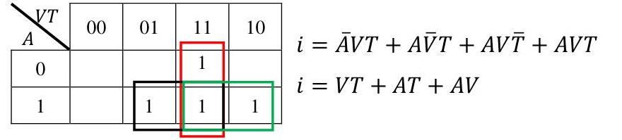
>
> ```latex
> i = \bar{A}VT + A\bar{V}T + AV\bar{T} + AVT
> i = VT + AT + AV
> ```
>
> 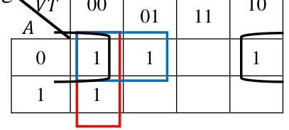
>
> ```latex
> F = \bar{V}\bar{T} + \bar{A}\bar{V} + \bar{A}\bar{T}
> ```
>
> 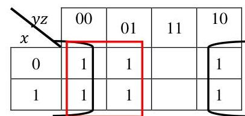
>
> ```latex
> F = \bar{y} + \bar{z}
> ```
>
> 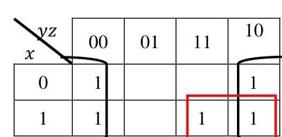
>
> ```latex
> F = \bar{z} + xy
> ```
>
> 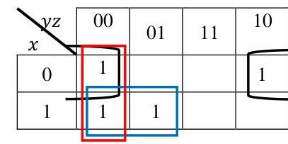
>
> ```latex
> F = \bar{y}\bar{z} + x\bar{y} + \bar{x}\bar{z}
> ```
>
> 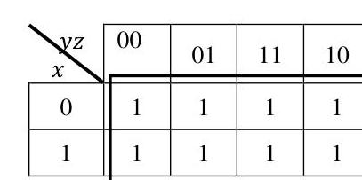
>
> ```latex
> F = 1
> ```
>
> 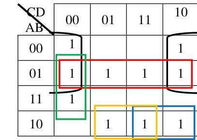
>
> ```latex
> F = \bar{A}B + \bar{A}\bar{D} + AB\bar{D} + A\bar{B}C + B\bar{C}\bar{D}
> ```
>
> 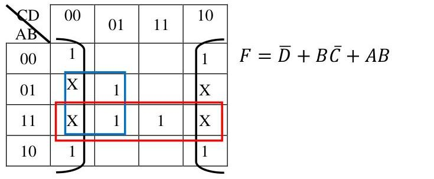
>
> ```latex
> F = \bar{D} + B\bar{C} + AB
> F = C \cdot (\bar{A}+B) \cdot (A+\bar{B})
> F = \bar{C} + \bar{A}
> F = (B+D) \cdot (A+C) \cdot (\bar{A}+B+\bar{C})
> ```
>
> **Karnaugh Diyagramları (Farklı Örnekler)**
>
> 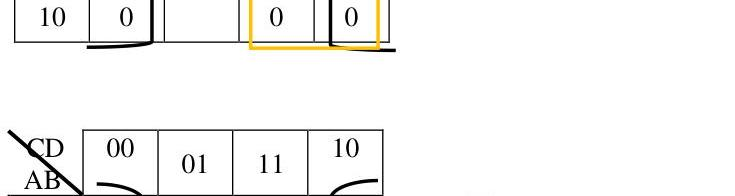
>
> ```latex
> F = \bar{D} + B
> ```
>
> 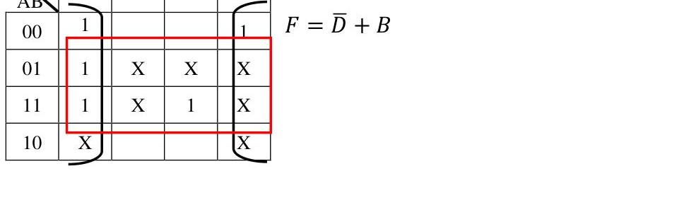
>
> ```latex
> F = A
> ```
>
> 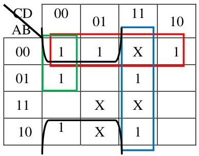
>
> ```latex
> F(A,B,C,D) = \sum(0,1,2,4,7,8,11) + \Phi(3,9,13,15)
> F(A,B,C,D) = \bar{A}\bar{B} + CD + \bar{A}\bar{C}\bar{D} + \bar{B}\bar{C}
> ```
>
> 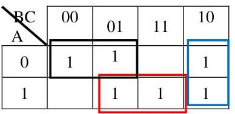
>
> ```latex
> F(A,B,C,D) = \bar{A}\bar{B} + AC + B\bar{C}
> ```
>
> 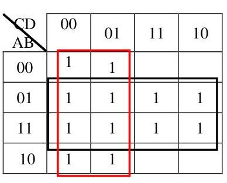
>
> ```latex
> F(A,B,C,D) = \bar{C} + B
> ```
>
> 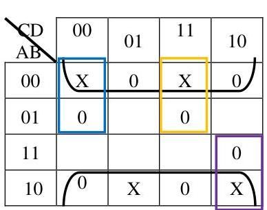
>
> ```latex
> F(A,B,C,D) = \Pi(1,2,4,7,8,11,14) + \Phi(0,3,9,10)
> F = B \cdot (A+C+D) \cdot (A+\bar{C}+\bar{D}) \cdot (\bar{A}+\bar{C}+D)
> F(A,B,C,D) = \sum(1,2,4,7,9) + \Phi(3,8,12,14)
> \bar{A}\bar{B} + \bar{C}\bar{D} + \bar{B}\bar{C} + \bar{A}CD
> ```
>
> 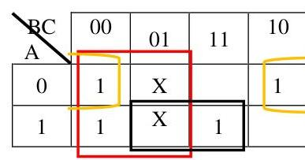
>
> ```latex
> F(A,B,C,D) = \Sigma(0,2,4,7) + \Phi(1,5)
> F = \bar{B} + \bar{A}\bar{C} + AC
> F(A,B,C,D)=\Pi(1,2,4,5)+\Phi(0,3,7)
> F=\bar{B}+\bar{A}
> ```
>
> **Örnek 6.2:** Girişine giren 2 bitlik sayıların karesini alan lojik devreyi doğruluk tablosu çıkararak hesaplayınız.
>
> | $A$ | $B$ | Kare |     |     |
> | :-: | :-: | :--: | :-: | :-: | --- |
> |     |     | $E$  | $F$ | $G$ | $H$ |
> |  0  |  0  |  0   |  0  |  0  | 0   |
> |  0  |  1  |  0   |  0  |  0  | 1   |
> |  1  |  0  |  0   |  1  |  0  | 0   |
> |  1  |  1  |  1   |  0  |  0  | 1   |
>
> Çıkışlar için sadeleştirme:
> `$F = A \cdot \bar{B}$`
> `$H = \bar{A}B + AB = B(\bar{A}+A) = B$`
> `$E = AB$`
> `$G = \text{Lojik } 0$` _(Her zaman 0)_
>
> **Örnek 6.3:** $A=A_1A_0$ ve $B=B_1B_0$ sayıları karşılaştırılacaktır. $A>B$, $A=B$ ve $A<B$ çıkışlarını veren devreyi doğruluk tablosunu çıkartarak Karnaugh diyagramı ile gerçekleştiriniz.
>
> | $A_1$ | $A_0$ | $B_1$ | $B_0$ | $A>B$ | $A=B$ | $A<B$ |
> | :---: | :---: | :---: | :---: | :---: | :---: | :---: |
> |   0   |   0   |   0   |   0   |   0   |   1   |   0   |
> |   0   |   0   |   0   |   1   |   0   |   0   |   1   |
> |   0   |   0   |   1   |   0   |   0   |   0   |   1   |
> |   0   |   0   |   1   |   1   |   0   |   0   |   1   |
> |   0   |   1   |   0   |   0   |   1   |   0   |   0   |
> |   0   |   1   |   0   |   1   |   0   |   1   |   0   |
> |   0   |   1   |   1   |   0   |   0   |   0   |   1   |
> |   0   |   1   |   1   |   1   |   0   |   0   |   1   |
> |   1   |   0   |   0   |   0   |   1   |   0   |   0   |
> |   1   |   0   |   0   |   1   |   1   |   0   |   0   |
> |   1   |   0   |   1   |   0   |   0   |   1   |   0   |
> |   1   |   0   |   1   |   1   |   0   |   0   |   1   |
> |   1   |   1   |   0   |   0   |   1   |   0   |   0   |
> |   1   |   1   |   0   |   1   |   1   |   0   |   0   |
> |   1   |   1   |   1   |   0   |   1   |   0   |   0   |
> |   1   |   1   |   1   |   1   |   0   |   1   |   0   |
>
> `$A>B \Rightarrow F_1 = A_1\overline{B_1} + A_0\overline{B_1}\overline{B_0} + A_1A_0\overline{B_0}$` _(Bu sadeleştirilmiş ifade, Karnaugh haritası çıktıktan sonra elde edilir.)_
> `$A=B \Rightarrow F_2 = \overline{A_1}\overline{A_0}\overline{B_1}\overline{B_0} + \overline{A_1}A_0\overline{B_1}B_0 + A_1\overline{A_0}B_1\overline{B_0} + A_1A_0B_1B_0$` _(Bu ifade Karnaugh haritalarıyla sadeleştirilebilir)_
> `$A<B \Rightarrow F_3 = \overline{A_1}B_1 + \overline{A_0}B_1B_0 + \overline{A_1}\overline{A_0}B_0$` _(Bu ifade Karnaugh haritalarıyla sadeleştirilebilir)_

---

## 7. Dijital Entegre Lojik Aileler

Üretilen entegre lojik aileler, farklı transistör ve diyot teknolojilerini kullanarak belirli performans özelliklerine sahiptirler. Aşağıda yaygın lojik aileler listelenmiştir:

1. **DL (Diyot Lojik)**
   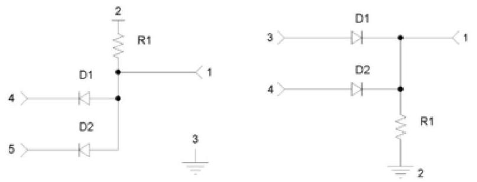
   > [!caption|center] Şekil 7.1. İki girişli AND ve OR kapıları
2. **TTL (Transistör-Transistör Lojik)**: Bipolar teknolojisi ile üretilirler. 74 ve 54 serisi ile ifade edilirler.
3. **DTL (Diyot-Transistör Lojik)**
   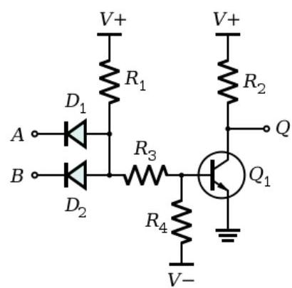
   > [!caption|center] Şekil 7.1. İki girişli DTL NAND kapısı
4. **RTL (Direnç-Transistör Lojik)**: TTL ve DTL'den ucuz ve daha az transistör kullanır.
   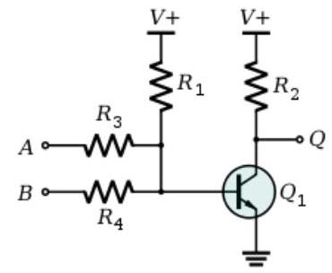
   > [!caption|center] Şekil 7.1. İki girişli RTL NOR kapısı
5. **ECL (Emitör Kuplajlı Lojik - Emitter Coupled Logic)**: Hızlı işlem gereken uygulamalarda kullanılır. En hızlı lojik ailedir.
   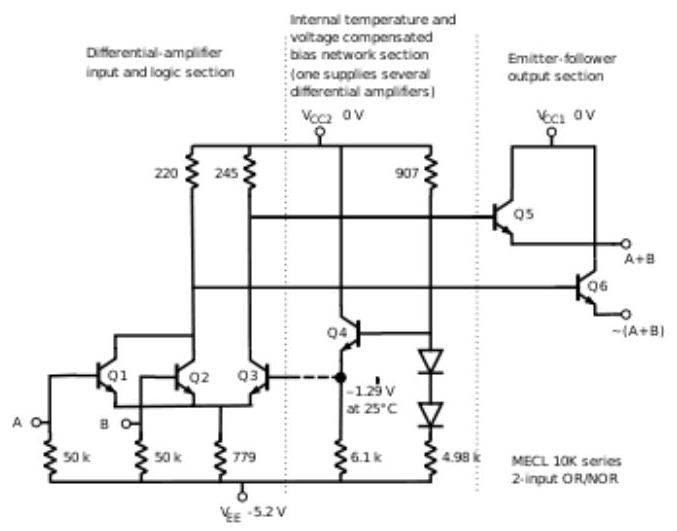
   > [!caption|center] Şekil 7.1. Motorola ECL 10,000 basic gate circuit diagram
6. **I²L (Akım Enjekte Edilmiş Lojik)**: Eleman yoğunluğunun çok olduğu devrelerde kullanılır.
   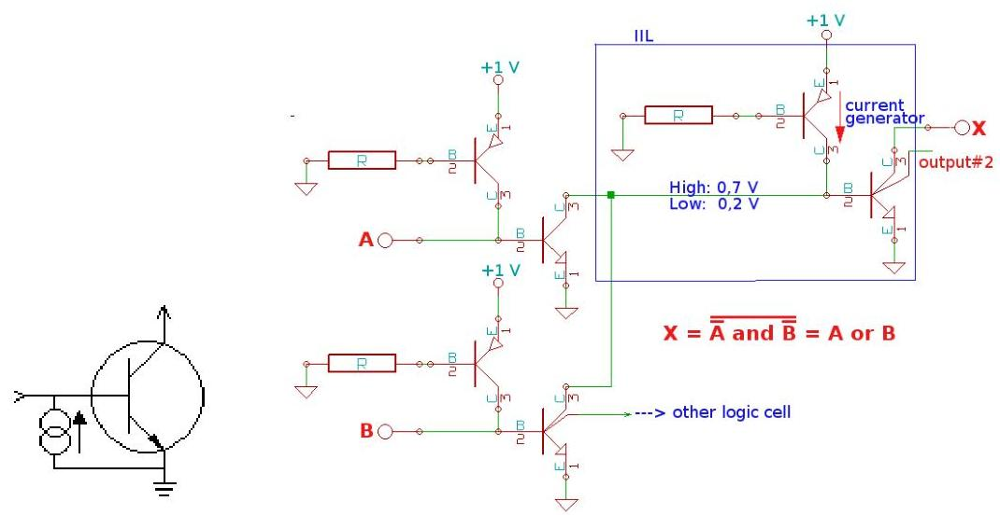
   > [!caption|center] Şekil 7.2. I²L devresi
7. **MOS (Metal Oksit Yarı İletken - Metal Oxide Semiconductor)**: Eleman yoğunluğunun çok olduğu devrelerde kullanılır.
8. **CMOS (Bütünleştirilmiş MOS - Complementary Metal Oxide Semiconductor)**: Az enerji harcar. 40 serisi ile ifade edilirler. MOS teknolojisi ile üretilirler.

### 7.1. DL (Diyot Lojik)

Diyot Lojik devreler basit AND, OR ve NOT kapılarını diyotlarla gerçekleştiren temel lojik ailelerden biridir.

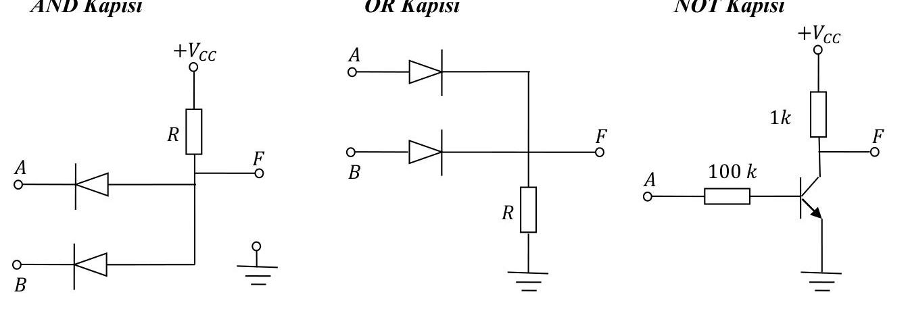

| $A$ | $B$ | $F$ |
| :-: | :-: | :-: |
|  0  |  0  |  0  |
|  0  |  1  |  0  |
|  1  |  0  |  0  |
|  1  |  1  |  1  |

| $A$ | $B$ | $F$ |
| :-: | :-: | :-: |
|  0  |  0  |  0  |
|  0  |  1  |  1  |
|  1  |  0  |  1  |
|  1  |  1  |  1  |

| $A$ | $F$ |
| :-: | :-: |
|  0  |  1  |
|  1  |  0  |

### 7.2. TL (Transistör Lojik)----TTL

Transistör Lojik, bipolar transistörlere dayalı bir lojik aile olup hız ve güç tüketimi arasında iyi bir denge sunar.

**AND Kapısı**
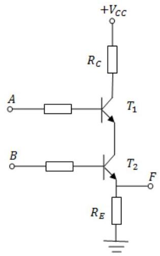

**OR Kapısı**
**NOT Kapısı**
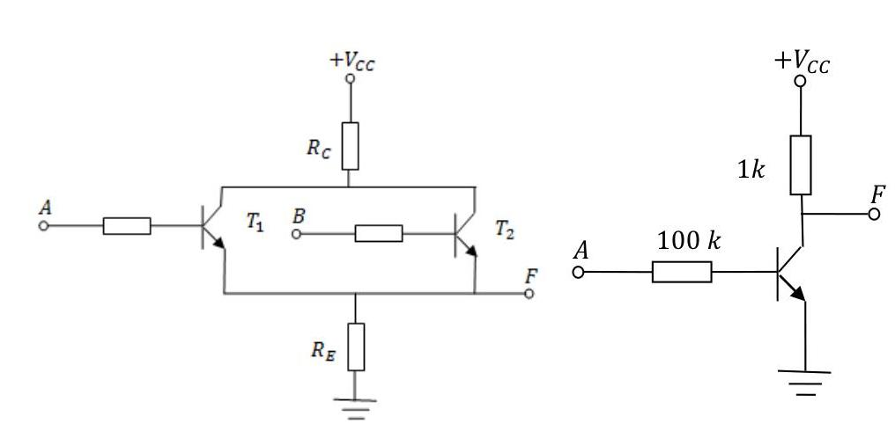

> [!example]+ Lojik Kapı Gerçekleştirme Örnekleri
> **Örnek 7.1:** `$F=A \oplus B=\bar{A}B+A\bar{B}$` fonksiyonunu a) DL ve b) TL ile gerçekleştiriniz.
> a) DL ile:
> 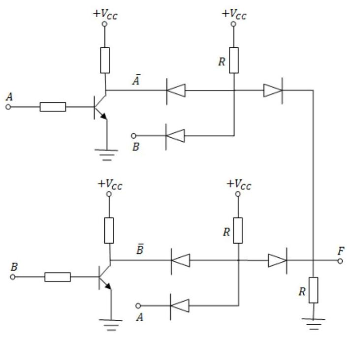
> b) TL ile:
> 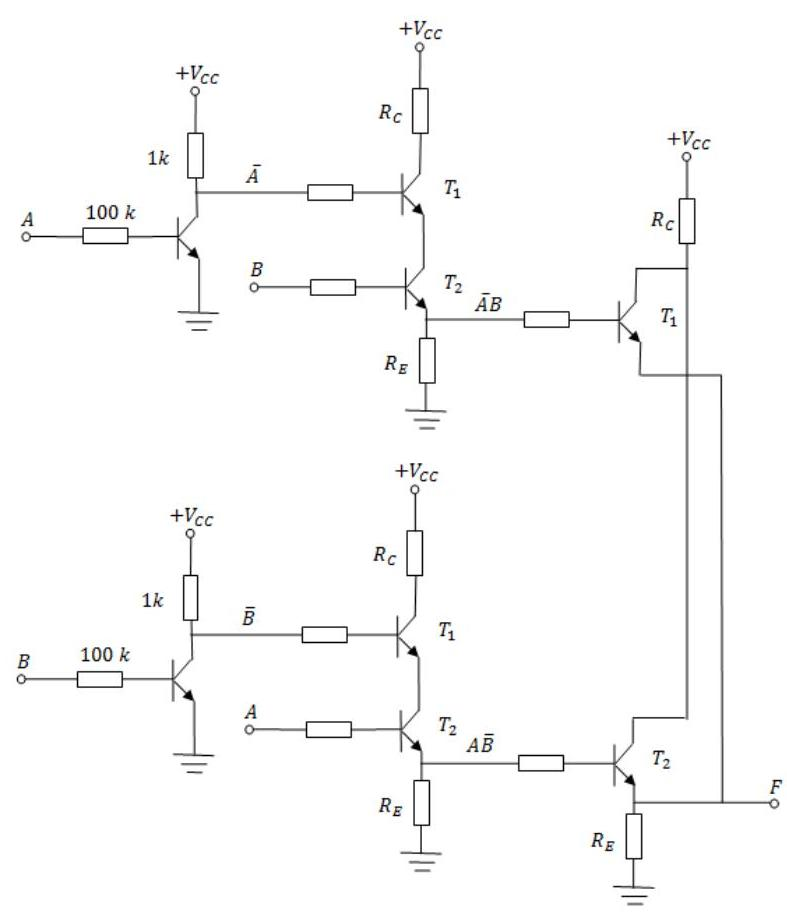
>
> **Örnek 7.2:** `$F=\bar{A}BC+\bar{A}\bar{B}+AB$` fonksiyonunu a) DTL, b) TTL ve c) RTL ile gerçekleştiriniz.
> b) TTL ile:
> 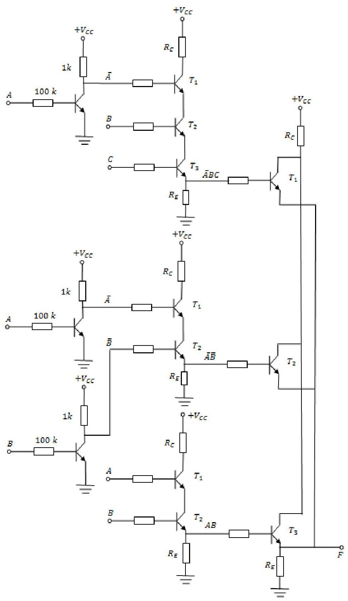
>
> **Örnek 7.3:** `$F=\bar{A}B+A\bar{C}+ABC$` fonksiyonunu DTL ile gerçekleştiriniz.
> 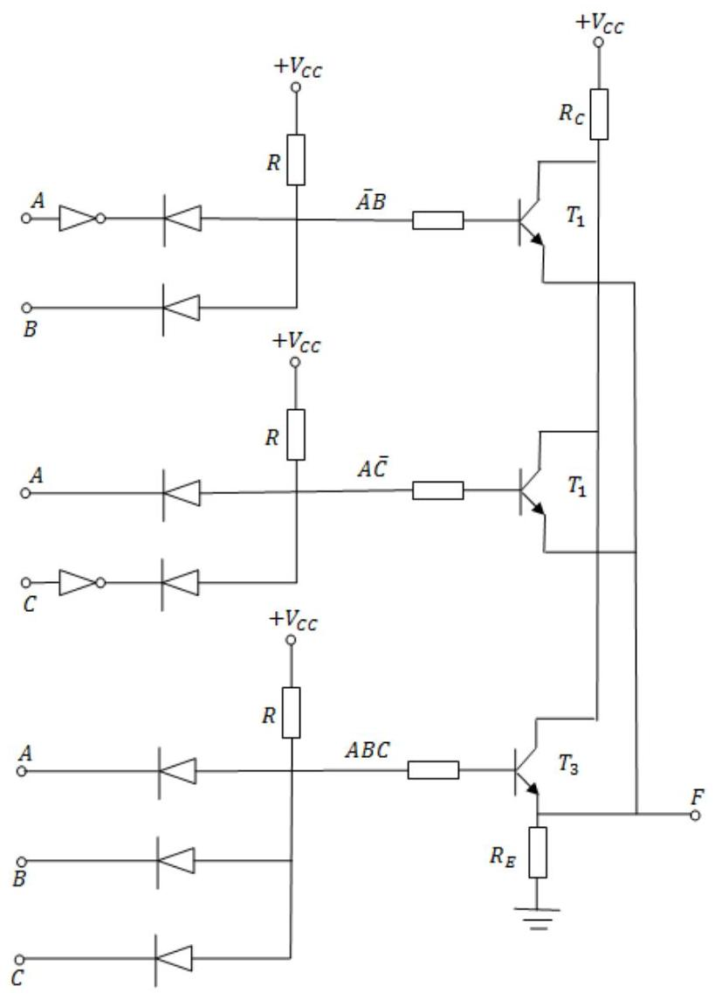

---

## 8. Lojik Devre Katalog Bilgileri

Tümdevreler, direnç, kapasitör, diyot, transistör gibi elektronik elemanların ve bağlantılarının küçük silikon veya yarı iletken parçacıklar üzerine entegre edilmiş halleridir.

1. **Analog Tümdevreler**: Analog işaretleri kullanan devrelerdir (örn. operasyonel yükselticiler, voltaj regülatörleri).
2. **Sayısal Tümdevreler**: Sayısal işaretleri kullanan devrelerdir (örn. lojik kapılar, flip-floplar, sayıcılar, mikroişlemciler).
   Sayısal tümdevreler, içerdikleri kapı yoğunluklarına göre sınıflandırılır:
   - **Küçük Ölçekli Tümdevreler (SSI - Small Scale Integration)**: Kapı sayısı 10'dan az.
   - **Orta Ölçekli Tümdevreler (MSI - Medium Scale Integration)**: Kapı sayısı 10-100 arasında (örn. kod çeviriciler, çoğullayıcılar).
   - **Büyük Ölçekli Tümdevreler (LSI - Large Scale Integration)**: Kapı sayısı 100-birkaç bin arasında (örn. hesaplayıcılar, bellek birimleri).
   - **Çok Büyük Ölçekli Tümdevreler (VLSI - Very Large Scale Integration)**: Kapı sayısı birkaç binden büyük (örn. mikroişlemciler, mikrokontrolörler).

> [!infobox]+ Tablo: Üretim Teknolojisine Göre Tümdevrelerin Lojik Kodları
>
> | Üretim Teknolojisi                          | Kodu   |
> | :------------------------------------------ | :----- |
> | Standart TTL                                | 74     |
> | Yüksek Hızlı TTL                            | 74 H   |
> | Düşük Güç Tüketen TTL                       | 74 L   |
> | Shottky TTL                                 | 74 S   |
> | Düşük Güç Tüketen Shottky TTL               | 74 LS  |
> | İleri Shottky TTL                           | 74 AS  |
> | Düşük Güç Tüketen İleri Shottky TTL         | 74 ALS |
> | CMOS                                        | 40     |
> | TTL ile Bağlantı Uyumlu CMOS                | 74 C   |
> | Yüksek Hızlı ve TTL Bağlantı Uyumlu CMOS    | 74 HC  |
> | Yüksek Hızlı ve TTL Elektriksel Uyumlu CMOS | 74 HCT |

### 8.1. Kombinasyonel Devreler

Kombinasyonel devreler, o anki giriş değerlerine bağlı olarak çıkış üreten lojik devrelerdir. Bazı yaygın kombinasyonel kapı entegreleri:

- **7400**: Dörtlü iki girişli NAND kapısı
- **7402**: Dörtlü iki girişli NOR kapısı
- **7404**: Altılı tümleme (NOT) kapısı
- **7408**: Dörtlü iki girişli AND kapısı

### 8.2. Tümleşik Kombinasyonel Devreler

Belirli bir işlevi yerine getirmek için tasarlanmış devrelerdir (örn. yarı ve tam toplayıcılar, seçiciler, kodlayıcılar, PAL, PLA, çoğullayıcılar).

### 8.3. Ardışıl Devreler

Bellek elemanları (flip-floplar) içeren lojik devrelerdir. Çıkışlar hem mevcut girişlere hem de önceki durumlara bağlıdır (örn. sayıcılar, yazmaçlar, mikroişlemciler).

### 8.4. TTL ve CMOS Tümdevre Özellikleri

**TTL Tümdevre Özellikleri:**
Lojik 0 ve lojik 1 seviyeleri her lojik aile için farklıdır. TTL için besleme gerilimi +5V'tur.

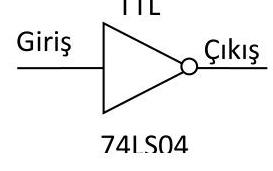
TTL entegrelerinde giriş gerilimi 0V - 0.8V arası Lojik 0, 2.0V - 5.0V arası Lojik 1 seviyesindedir.
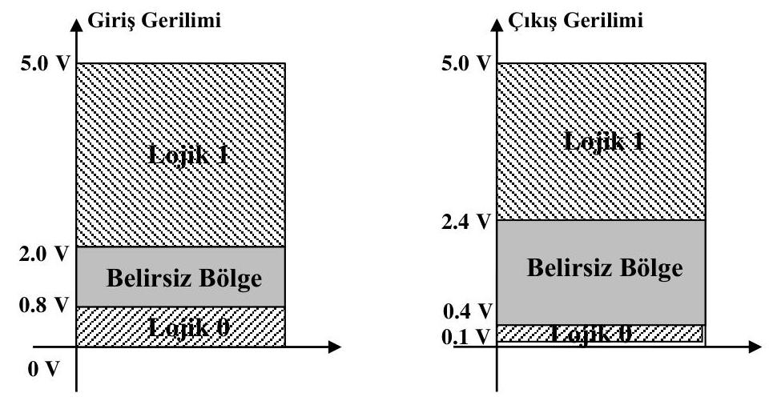

> [!caption|center] Şekil 8.1. TTL tümdevrelerin giriş ve çıkış gerilimlerine ilişkin özellikler

_Propagasyon gecikmesi_: Bir işaret değişiminin girişte oluşmasından çıkışta görülmesine kadar geçen süredir.
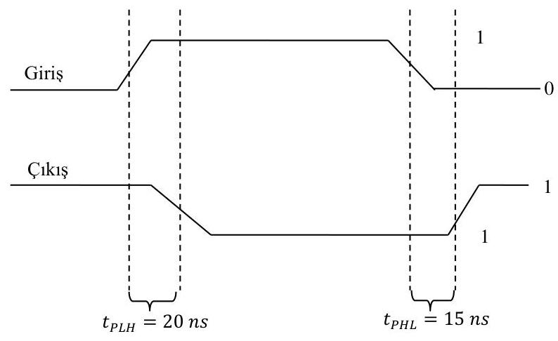

> [!caption|center] Şekil 8.2. TTL tümdevrelerin propagasyon gecikmesi
> TTL elemanlarının güç harcaması yaklaşık 10 mW civarındadır.

**CMOS Tümdevre Özellikleri:**
CMOS tümdevrelerin besleme gerilimi +10V'tur.
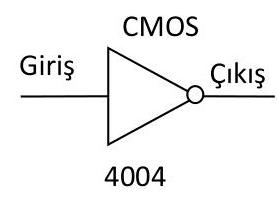
CMOS entegrelerinde giriş gerilimi 0V - 3.0V arası Lojik 0, 7.0V - 10.0V arası Lojik 1 seviyesindedir. Ayrıca gürültü filtreleme konusunda TTL'lerden daha iyi performans gösterirler.
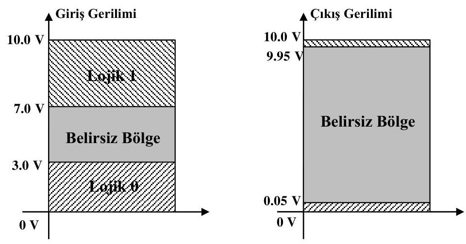

> [!caption|center] Şekil 8.3. CMOS tümdevrelerin giriş ve çıkış gerilimlerine ilişkin özellikler
> Standart CMOS tümdevrelerde propagasyon gecikmesi 25-100 ns arasında değişir, ancak yeni nesil yüksek hızlı (HC serisi) CMOS devrelerde bu 8 ns mertebesine düşer. CMOS güç harcaması 0.01-1 mW mertebesindedir.

---

## 9. Kombinasyonel Devreler

Kombinasyonel devreler, çıkışları yalnızca o anki giriş değerlerine bağlı olan, **belleği olmayan** lojik devrelerdir. Geçmiş bilgiler veya durumlar tutulmaz. Yarı/tam toplayıcı, çıkarıcı, seçici (MUX), dağıtıcı (DEMUX), kod çözücü, kodlayıcı, komparatör ve ALU, kombinasyonel tümleşik devrelere örnek olarak verilebilir.

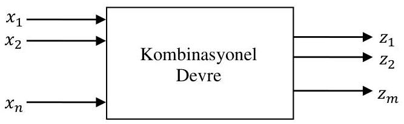

> [!caption|center] Şekil 9.1. Kombinasyonel devrelerin gösterilişi

### 9.1. Toplayıcılar

#### 9.1.1. Yarı toplayıcı (Half Adder)

Elde girişi olmadan 1 bitlik iki sayının toplamını bulan kombinasyonel devredir.

| $\boldsymbol{a}$ | $\boldsymbol{b}$ | Toplam $\boldsymbol{T}$ | Elde $\boldsymbol{E}$ |
| :--------------: | :--------------: | :---------------------: | :-------------------: |
|        0         |        0         |            0            |           0           |
|        0         |        1         |            1            |           0           |
|        1         |        0         |            1            |           0           |
|        1         |        1         |            0            |           1           |

$T = \bar{a}b + a\bar{b}$
$E = ab$

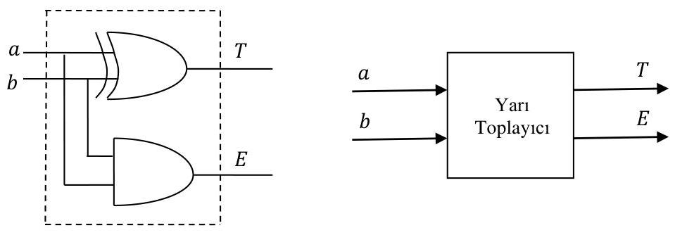

> [!caption|center] Şekil 9.2. Yarı toplayıcı devresi

#### 9.1.2. Tam toplayıcı (Full Adder)

Girişinde elde biti olan ve bir bitlik iki sayıyı elde ile birlikte toplayan kombinasyonel devredir.

| $C_{in}$ | $\boldsymbol{a}$ | $\boldsymbol{b}$ | Toplam $\boldsymbol{S}$ | Elde $\boldsymbol{C_{out}}$ |
| :------: | :--------------: | :--------------: | :---------------------: | :-------------------------: |
|    0     |        0         |        0         |            0            |              0              |
|    0     |        0         |        1         |            1            |              0              |
|    0     |        1         |        0         |            1            |              0              |
|    0     |        1         |        1         |            0            |              1              |
|    1     |        0         |        0         |            1            |              0              |
|    1     |        0         |        1         |            0            |              1              |
|    1     |        1         |        0         |            0            |              1              |
|    1     |        1         |        1         |            1            |              1              |

_Karnaugh Haritası için:_

| $C_{in} \setminus ab$ | 00  | 01  | 11  | 10  |
| :-------------------: | :-: | :-: | :-: | :-: |
|           0           |  0  |  1  |  0  |  1  |
|           1           |  1  |  0  |  1  |  0  |

_Bu `$S$` (Toplam) çıkışıdır._

| $C_{in} \setminus ab$ | 00  | 01  | 11  | 10  |
| :-------------------: | :-: | :-: | :-: | :-: |
|           0           |  0  |  0  |  1  |  0  |
|           1           |  0  |  1  |  1  |  1  |

_Bu `$C_{out}$` (Elde Çıkışı) çıkışıdır.\_

$S = \overline{C_{in}}\bar{a}b + \overline{C_{in}}a\bar{b} + C_{in}ab + C_{in}\bar{a}\bar{b} = C_{in} \oplus a \oplus b$
$C_{out} = C_{in}b + C_{in}a + ab$

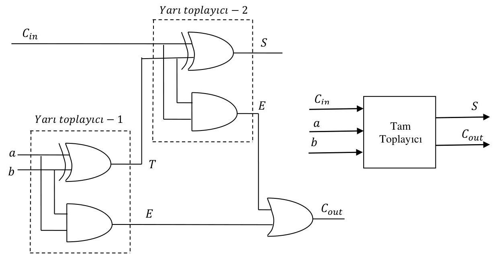

> [!caption|center] Şekil 9.3. Tam toplayıcı devresi

> [!example]+ Paralel Toplayıcı
> **Örnek 9.1:** 4 bitlik iki sayının toplamını bulan paralel toplayıcı devresini full adder (FA) kullanarak gerçekleyiniz.
> 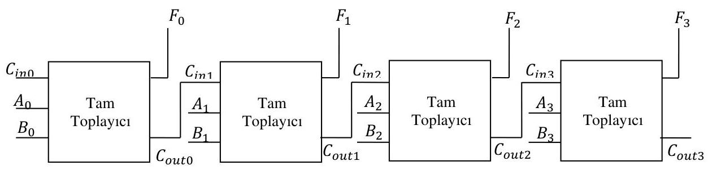

### 9.2. Çıkarıcılar

#### 9.2.1. Yarı çıkarıcı (Half Subtactor)

Borç girişi olmaksızın çıkarma işlemi yapan kombinasyonel devredir.

| $\boldsymbol{a}$ | $\boldsymbol{b}$ | Fark $\boldsymbol{F}$ | Borç $\boldsymbol{B}$ |
| :--------------: | :--------------: | :-------------------: | :-------------------: |
|        0         |        0         |           0           |           0           |
|        0         |        1         |           1           |           1           |
|        1         |        0         |           1           |           0           |
|        1         |        1         |           0           |           0           |

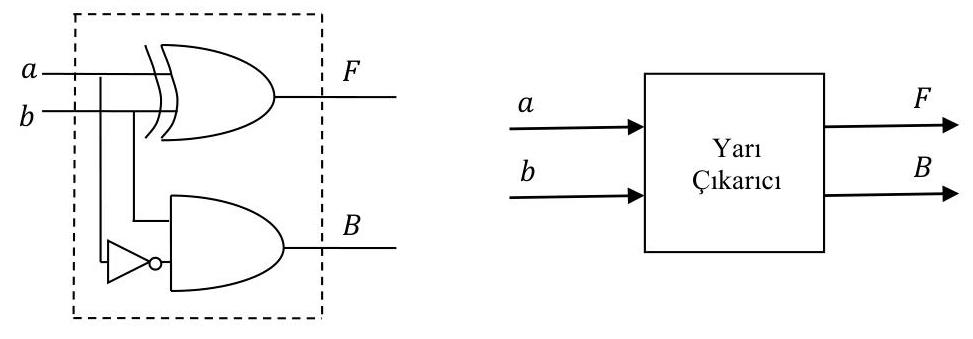

> [!caption|center] Şekil 9.4. Yarı çıkarıcı devresi

Çıkarıcılar, mikroişlemcilerde genellikle 2'ye tümleme yöntemiyle çıkarma işlemini toplama gibi gerçekleştirerek implemente edilir.

#### 9.2.2. Tam çıkarıcı (Full Subtactor)

Bir önceki haneden gelen borç bitini (borrow in) dikkate alarak çıkarma işlemi yapan kombinasyonel devredir.

| $\boldsymbol{a}$ | $\boldsymbol{b}$ | $\boldsymbol{B_{in}}$ | Fark $\boldsymbol{F}$ | Borç $\boldsymbol{B_{out}}$ |
| :--------------: | :--------------: | :-------------------: | :-------------------: | :-------------------------: |
|        0         |        0         |           0           |           0           |              0              |

> | 0 | 0 | 1 | 1 | 1 |
> | 0 | 1 | 0 | 1 | 1 |
> | 0 | 1 | 1 | 0 | 1 |
> | 1 | 0 | 0 | 1 | 0 |
> | 1 | 0 | 1 | 0 | 0 |
> | 1 | 1 | 0 | 0 | 0 |
> | 1 | 1 | 1 | 1 | 1 |

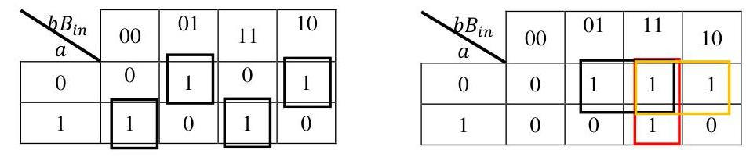
$F = \overline{B_{in}}\bar{a}b + \overline{B_{in}}a\bar{b} + B_{in}ab + B_{in}\bar{a}\bar{b} = a \oplus b \oplus B_{in}$
$B_{out} = \bar{a}B_{in} + \bar{a}b + bB_{in}$

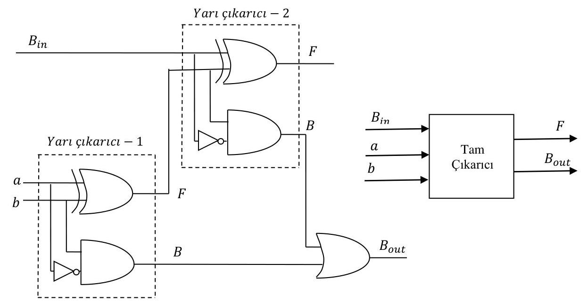

> [!caption|center] Şekil 9.5. Tam çıkarıcı devresi

> [!example]+ Toplama/Çıkarma Devresi
> **Örnek 9.2:** Tam toplayıcı (full adder kullanarak) kullanarak 4 bitlik toplama/çıkarma işlemlerini yapan devreyi gerçekleyiniz.
>
> Bu devre, `M` kontrol girişi ile toplama (`M=0`) veya çıkarma (`M=1`) yapabilen bir seçiciye sahiptir. Çıkarma 2'ye tümleme aritmetiği ile gerçekleştirilir.
>
> 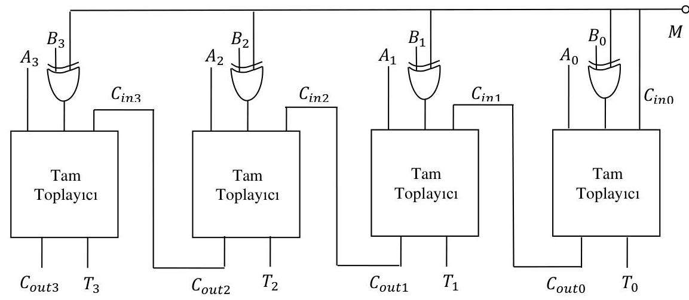
> 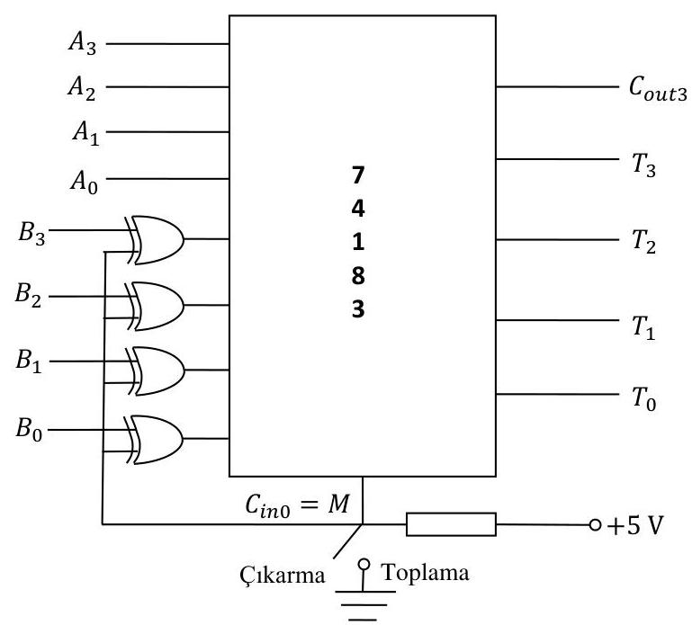

### 9.3. Kod Çeviriciler

Dijital sistemler farklı kodlar kullanabilir. Eğer iki sistem farklı kodlarla çalışıyorsa, aralarında **kod çevirici** (kod çözücü veya kodlayıcı) donanımlar kullanılır.

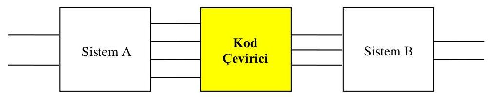

> [!caption|center] Şekil 9.6. Kod çevirici örneği

> [!example]+ BCD'yi 3-Fazlalık Koduna Çeviren Kod Çözücü Tasarımı
> **Örnek 9.3:** BCD'yi 3-Fazlalık koduna dönüştüren devreyi (kod çözücü) tasarlayınız.
>
> | $A$ | $B$ | $C$ | $D$ | $W$ | $X$ | $Y$ | $Z$ |
> | :-: | :-: | :-: | :-: | :-: | :-: | :-: | :-: |
> |  0  |  0  |  0  |  0  |  0  |  0  |  1  |  1  |
> |  0  |  0  |  0  |  1  |  0  |  1  |  0  |  0  |
> |  0  |  0  |  1  |  0  |  0  |  1  |  0  |  1  |
> |  0  |  0  |  1  |  1  |  0  |  1  |  1  |  0  |
> |  0  |  1  |  0  |  0  |  0  |  1  |  1  |  1  |
> |  0  |  1  |  0  |  1  |  1  |  0  |  0  |  0  |
> |  0  |  1  |  1  |  0  |  1  |  0  |  0  |  1  |
> |  0  |  1  |  1  |  1  |  1  |  0  |  1  |  0  |
> |  1  |  0  |  0  |  0  |  1  |  0  |  1  |  1  |
> |  1  |  0  |  0  |  1  |  1  |  1  |  0  |  0  |
>
> Bu tablodaki W, X, Y, Z çıkışları için Karnaugh diyagramı veya Boole cebri kullanarak sadeleştirme yapılır.
>
> $W_{A,B,C,D} = \sum(5,6,7,8,9) + \Phi(10,11,12,13,14,15)$
> $X_{A,B,C,D} = \sum(1,2,3,4,9) + \Phi(10,11,12,13,14,15)$
> $Y_{A,B,C,D} = \sum(0,3,4,7,8) + \Phi(10,11,12,13,14,15)$
> $Z_{A,B,C,D} = \sum(0,2,4,6,8) + \Phi(10,11,12,13,14,15)$
>
> 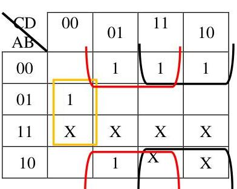
> 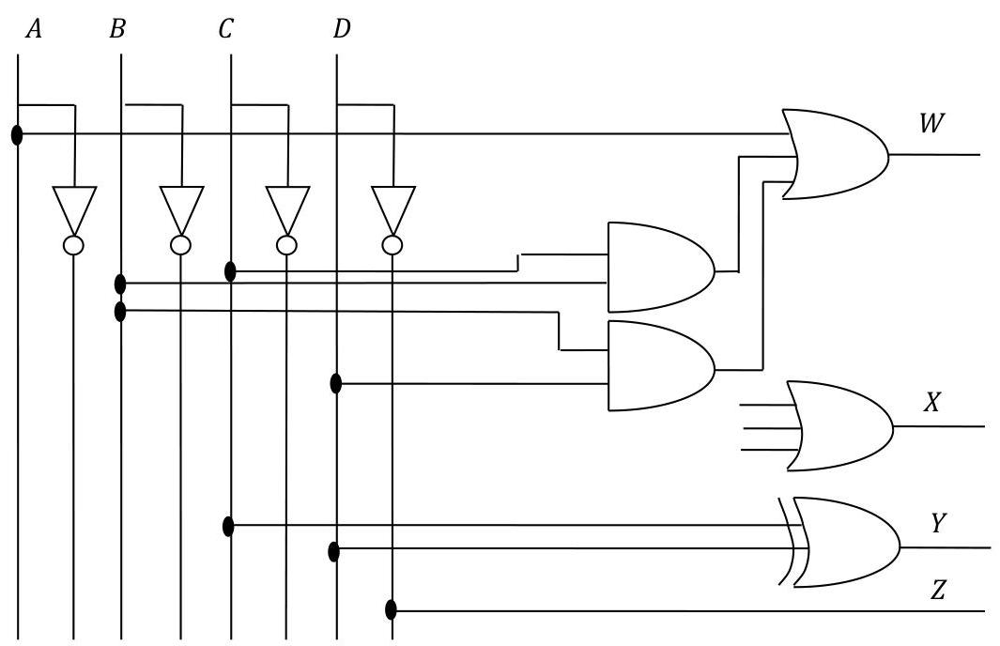
>
> **Örnek 9.4:** 4 bitlik tam toplayıcı kullanarak BCD sayı sistemini 3-fazlalık koduna çeviren kod çeviriciyi tasarlayınız.
>
> BCD sayısının `$B_3B_2B_1B_0$` olarak verildiğini varsayarsak, 3-fazlalık kodundaki değeri `$F_3F_2F_1F_0$` şeklinde olacaktır. Buradaki temel fikir, BCD sayısına 3 eklemektir.
>
> 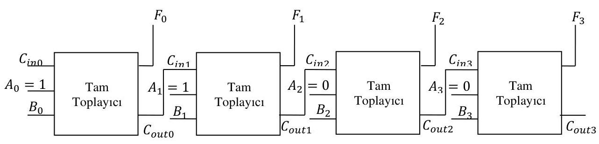

### 9.4. Multiplexer (MUX-Seçici)

Sayısal veri iletiminde, birden fazla olası giriş yolundan birini seçerek bu yolu çıkışa veren kombinasyonel bir devredir. Veri seçici veya veri toplayıcı olarak da bilinir.

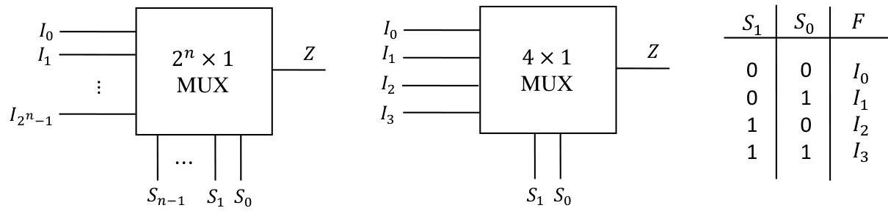

> [!caption|center] Şekil 9.7. Multiplexer

> [!example]+ MUX ile Fonksiyon Gerçekleştirme
> **Örnek 9.5:** Doğruluk tablosu aşağıda verilen kombinasyonel devreyi `$x_3$` ve `$x_4$` seçme girişleri olacak şekilde $4 \times 1$ MUX kullanarak gerçekleştiriniz.
>
> | $x_1$ | $x_2$ | $x_3$ | $x_4$ | $f(x_1, x_2, x_3, x_4)$ |
> | :---: | :---: | :---: | :---: | :---------------------: |
> |   0   |   0   |   0   |   0   |            0            |
> |   0   |   0   |   0   |   1   |            0            |
> |   0   |   0   |   1   |   0   |            1            |
> |   0   |   0   |   1   |   1   |            1            |
> |   0   |   1   |   0   |   0   |            0            |
> |   0   |   1   |   0   |   1   |            1            |
> |   0   |   1   |   1   |   0   |            0            |
> |   1   |   0   |   1   |   1   |            1            |
> |   1   |   0   |   0   |   0   |            1            |
> |   1   |   0   |   0   |   1   |            1            |
> |   1   |   0   |   1   |   0   |            1            |
> |   1   |   0   |   1   |   1   |            1            |
> |   1   |   1   |   0   |   0   |            0            |
> |   1   |   1   |   0   |   1   |            0            |
> |   1   |   1   |   1   |   0   |            0            |
> |   1   |   1   |   1   |   1   |            0            |
>
> Fonksiyonu sadeleştirerek ve seçme girişleri cinsinden gruplayarak MUX girişlerine uygulayacak biçimde dönüştürülür.
>
> ```latex
> f(x_1, x_2, x_3, x_4) = \overline{x_1}\overline{x_2}x_3\overline{x_4} + \overline{x_1}\overline{x_2}x_3x_4 + \overline{x_1}x_2\overline{x_3}x_4 + \overline{x_1}x_2x_3x_4 + x_1\overline{x_2}\overline{x_3}\overline{x_4} + x_1\overline{x_2}\overline{x_3}x_4 + x_1\overline{x_2}x_3\overline{x_4} + x_1\overline{x_2}x_3x_4
> ```
>
> Fonksiyon, seçme girişlerinin aldığı değerlere göre gruplanır:
>
> ```latex
> f(x_1, x_2, x_3, x_4) = x_3 \cdot x_4(\overline{x_1}x_2+\overline{x_1}\overline{x_2}+x_1\overline{x_2}) + x_3 \cdot \overline{x_4}(\overline{x_1}\overline{x_2}+x_1\overline{x_2}) + \overline{x_3} \cdot x_4(\overline{x_1}x_2+x_1\overline{x_2}) + \overline{x_3}\overline{x_4}(x_1\overline{x_2})
> ```
>
> Sadeleştirme ile:
>
> ```latex
> f(x_1, x_2, x_3, x_4) = x_3x_4(\overline{x_1}+\overline{x_2}) + x_3\overline{x_4}(\overline{x_2}) + \overline{x_3}x_4(x_1 \oplus x_2) + \overline{x_3}\overline{x_4}(x_1\overline{x_2})
> ```
>
> | $x_3$ | $x_4$ |               $I$               |
> | :---: | :---: | :-----------------------------: |
> |   0   |   0   |       $x_1\overline{x_2}$       |
> |   0   |   1   |        $x_1 \oplus x_2$         |
> |   1   |   0   |        $\overline{x_2}$         |
> |   1   |   1   | $\overline{x_1}+\overline{x_2}$ |
>
> 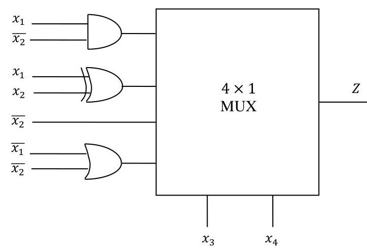

### 9.5. Demultiplexer (DEMUX-Çoğullayıcı)

Sayısal veri iletiminde tek bir giriş işaretini, pek çok olası çıkış yolundan birine yönlendiren kombinasyonel bir devredir. MUX ile DEMUX, ilkel telefon santrallerinde sıklıkla birlikte kullanılır.

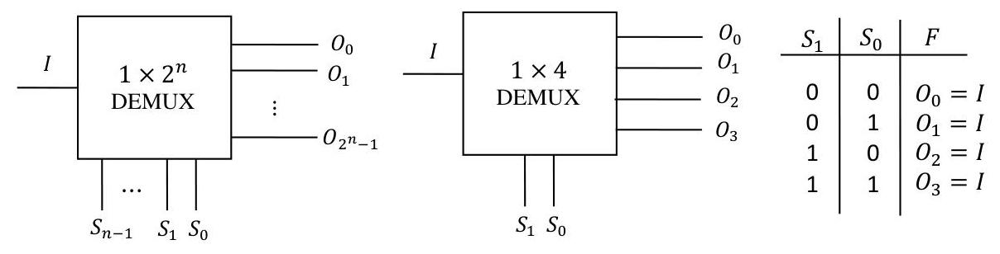

> [!caption|center] Şekil 9.8. Demultiplexer

> [!example]+ DEMUX Kullanarak Veri Aktarımı
> **Örnek 9.6:** 3 bitlik bir ifade dört kullanıcıya aktarılacaktır. Bu işlem her kullanıcının seçilmesi ve bilginin sadece bu kullanıcılara ulaştırılması şeklinde olacaktır. Bu devreyi DEMUX kullanarak gerçekleştiriniz.
>
> Aktarılacak ifade 3 bitlik ve kullanıcı sayısı 4 olduğuna göre her bir bit için bir tane DEMUX kullanılacak ve kullanıcı sayısı kadar çıkışı olması istenecektir. Dolayısıyla 3 adet $1 \times 4$ 'lük DEMUX kullanılacaktır.
> 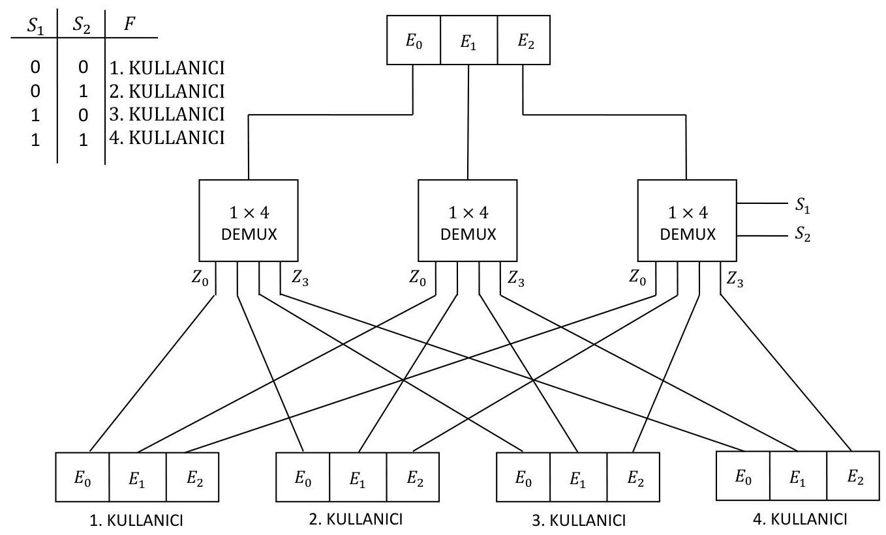
>
> > [!note] ÖDEV
> > 3 kullanıcıdan gelen 3 bitlik veri tek merkezden alınabilecektir. İlgili devreyi MUX kullanarak gerçekleştiriniz.

### 9.6. Kod Çözücü (Decoder)

`n` bitlik bir sözcüğün kodunu çözüp olası en çok `$2^n$` çıkış yolundan sadece birini aktif hale getiren kombinasyonel bir devredir.

| GİRİŞLER |     |     | ÇIKIŞLAR |       |       |       |       |       |       |       |
| :------: | :-: | :-: | :------: | :---: | :---: | :---: | :---: | :---: | :---: | :---: |
|   $x$    | $y$ | $z$ |  $D_0$   | $D_1$ | $D_2$ | $D_3$ | $D_4$ | $D_5$ | $D_6$ | $D_7$ |
|    0     |  0  |  0  |    1     |   0   |   0   |   0   |   0   |   0   |   0   |   0   |
|    0     |  0  |  1  |    0     |   1   |   0   |   0   |   0   |   0   |   0   |   0   |
|    0     |  1  |  0  |    0     |   0   |   1   |   0   |   0   |   0   |   0   |   0   |
|    0     |  1  |  1  |    0     |   0   |   0   |   1   |   0   |   0   |   0   |   0   |
|    1     |  0  |  0  |    0     |   0   |   0   |   0   |   1   |   0   |   0   |   0   |
|    1     |  0  |  1  |    0     |   0   |   0   |   0   |   0   |   1   |   0   |   0   |
|    1     |  1  |  0  |    0     |   0   |   0   |   0   |   0   |   0   |   1   |   0   |
|    1     |  1  |  1  |    0     |   0   |   0   |   0   |   0   |   0   |   0   |   1   |

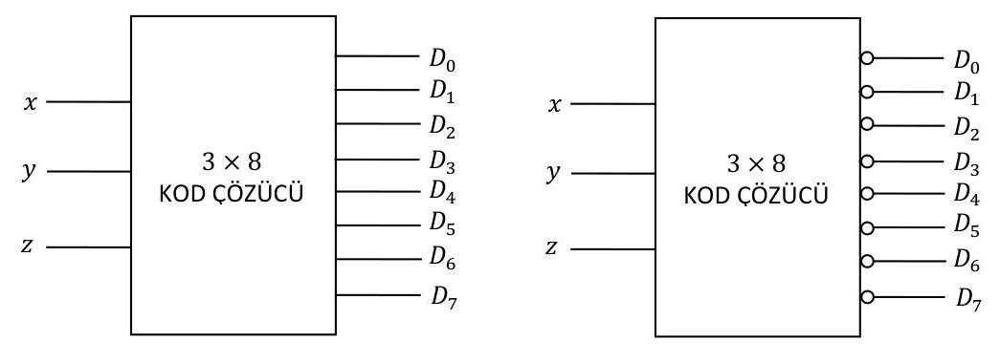

> [!caption|center] Şekil 9.9. $3 \times 8$ Kod çözücü a) Normal çıkışlı b) Tümleyen çıkışlı

> [!note]
> Kod çözücülerde **enable (etkinleştirme)** girişleri bulunur. Örneğin, 74138 entegresinde `$\overline{E_1}$`, `$\overline{E_2}$` ve `$E_3$` olmak üzere 3 tane enable girişi vardır. Bu girişler sırasıyla 001 değerini aldığında entegre çıkış üretir.

> [!example]+ Oylama Sistemi Tasarımı
> **Örnek 9.7:** Bir başkan, bir başkan yardımcısı ve iki üyeden oluşan bir komisyonun alacağı kararları gösteren bir oylama sistemi yapılacaktır. Başkanın oyu 3, başkan yardımcısının oyu 2, üyelerin oyu ise 1 ağırlığındadır. EVET oylarının ağırlık katsayıları fazla ise "EVET", HAYIR oylarının ağırlık katsayıları yüksek ise "HAYIR", eşitlik halinde başkan yardımcısı ve üyelerin verdiği çoğunluk oylarına göre karar alınacaktır. Bütün üyeler oy kullanmak zorundadır. EVET oyu Lojik1'dir. Bu oylama sistemine ait lojik fonksiyonun doğruluk tablosunu çıkararak, fonksiyonu Karnaugh diyagramı ile sadeleştirerek tasarlanan devreyi çiziniz.
>
> | $\boldsymbol{B}$ | $\boldsymbol{BY}$ | $\ddot{U} \mathbf{1}$ | $\ddot{U} \mathbf{2}$ | $\boldsymbol{F}$ |
> | :--------------: | :---------------: | :-------------------: | :-------------------: | :--------------: |
> |        0         |         0         |           0           |           0           |        0         |
> |        0         |         0         |           0           |           1           |        0         |
> |        0         |         0         |           1           |           0           |        0         |
> |        0         |         0         |           1           |           1           |        0         |
> |        0         |         1         |           0           |           0           |        0         |
> |        0         |         1         |           0           |           1           |        0         |
> |        0         |         1         |           1           |           0           |        0         |
> |        0         |         1         |           1           |           1           |        1         |
> |        1         |         0         |           0           |           0           |        0         |
> |        1         |         0         |           0           |           1           |        1         |
> |        1         |         0         |           1           |           0           |        1         |
> |        1         |         0         |           1           |           1           |        1         |
> |        1         |         1         |           0           |           0           |        1         |
> |        1         |         1         |           0           |           1           |        1         |
> |        1         |         1         |           1           |           0           |        1         |
> |        1         |         1         |           1           |           1           |        1         |
>
> 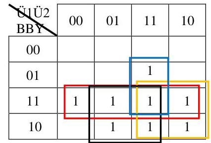
>
> ```latex
> F = B \cdot BY + B \cdot \ddot{U}1 + B \cdot \ddot{U}2 + BY \cdot \ddot{U}1 \cdot \ddot{U}2
> ```

### 9.7. Kodlayıcı (Encoder)

Kod çözücünün tersi işlem yapan bir kombinasyonel devredir. Lojik bir işareti, başka bir lojik devre tarafından işlenebilecek hale getirir.

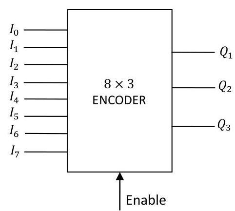

> [!caption|center] Şekil 9.10. $8 \times 3$ Encoder

### 9.8. Display (7 parçalı gösterge-7 segment display)

BCD kodunda verilmiş bir ifadenin sayı biçiminde gösterilmesi amacıyla kullanılan ışıklı kombinasyonel bir devredir. Yedi parçalı göstergenin her parçası a'dan g'ye kadar kodlanmıştır.

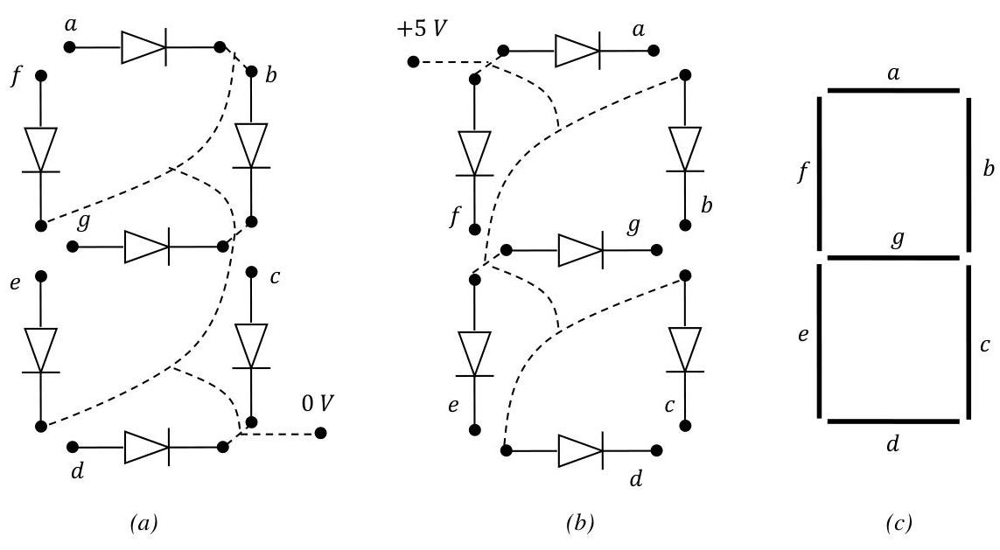

> [!caption|center] Şekil 9.11.(a) Ortak katotlu display, (b) Ortak anotlu display, (c) 7-Parçalı Gösterge

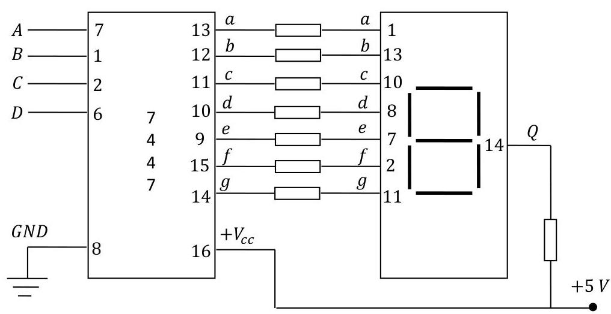

> [!caption|center] Şekil 9.12. 7-segment displayin sürülmesi (7447 BCD/display kod çözücü kullanımı)

> [!example]+ MUX ve OR Kapısı Kullanarak Fonksiyon Tasarımı
> **Örnek 9.8:** (2006-vize) İki tane MUX ve bir VEYA kapısı içeren devreye ilişkin şema aşağıda verilmiştir. Devreye ait Z lojik fonksiyonunu doğruluk tablosu ile oluşturarak Karnough diyagramı yardımıyla elde ediniz.
>
> 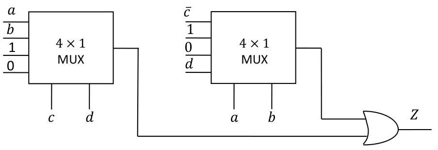
>
> | $\boldsymbol{a}$ | $\boldsymbol{b}$ | $\boldsymbol{c}$ | $\boldsymbol{d}$ | $\boldsymbol{F_1}$ | $\boldsymbol{F_2}$ | $\boldsymbol{Z}$ |
> | :--------------: | :--------------: | :--------------: | :--------------: | :----------------: | :----------------: | :--------------: |
> |        0         |        0         |        0         |        0         |         0          |         1          |        1         |
> |        0         |        0         |        0         |        1         |         0          |         1          |        1         |
> |        0         |        0         |        1         |        0         |         1          |         0          |        1         |
> |        0         |        0         |        1         |        1         |         0          |         0          |        0         |
> |        0         |        1         |        0         |        0         |         0          |         1          |        1         |
> |        0         |        1         |        0         |        1         |         1          |         1          |        1         |
> |        0         |        1         |        1         |        0         |         1          |         1          |        1         |
> |        0         |        1         |        1         |        1         |         0          |         1          |        1         |
> |        1         |        0         |        0         |        0         |         1          |         0          |        1         |
> |        1         |        0         |        0         |        1         |         0          |         0          |        0         |
> |        1         |        0         |        1         |        0         |         1          |         0          |        1         |
> |        1         |        0         |        1         |        1         |         0          |         0          |        0         |
> |        1         |        1         |        0         |        0         |         1          |         0          |        1         |
> |        1         |        1         |        0         |        1         |         1          |         1          |        1         |
> |        1         |        1         |        1         |        0         |         1          |         0          |        1         |
> |        1         |        1         |        1         |        1         |         0          |         1          |        1         |
>
> MUX $F_1$ çıkışı:
>
> | $c$ | $d$ | $F_1$ |
> | :-: | :-: | :---: |
> |  0  |  0  |  $a$  |
> |  0  |  1  |  $b$  |
> |  1  |  0  |   1   |
> |  1  |  1  |   0   |
>
> MUX $F_2$ çıkışı:
>
> | $a$ | $b$ |   $F_2$   |
> | :-: | :-: | :-------: |
> |  0  |  0  | $\bar{c}$ |
> |  0  |  1  |     1     |
> |  1  |  0  |    $1$    |
> |  1  |  1  |    $1$    |
>
> 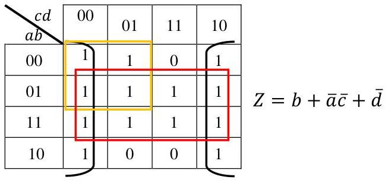
>
> **Örnek 9.9:** (2006-vize) 4 bitlik $A_3A_2A_1A_0$ sayısı, $S$ seçme ucuna bağlı olarak 2 artırılıp/çıkarılacaktır. $S=0$ olduğunda sayının değeri 2 artarken, $S=1$ olduğunda sayının değeri 2 eksilecektir. Örneğin $A$ sayısı 9 ise $S=0$ olduğunda $F=11, S=1$ olduğunda $F=7$ olarak çıkışta görülecektir. Gerekli devreyi birer bitlik tam toplayıcılar kullanarak blok olarak tasarlayınız.
>
> **I. YOL (XOR kapıları ile):**
> Eğer $S=0$ ise, XOR kapısının çıkışı diğer girişin aynısı olacaktır ($B_i$). Dolayısıyla tam toplayıcılar $A+B$ işlemini yapar. $B$ değeri sabit olarak $0010_2$ (2) olarak ayarlanırsa, $A+2$ işlemi gerçekleşir.
> Eğer $S=1$ ise, XOR kapısının çıkışı diğer girişin tümleyeni olacaktır ($\overline{B_i}$). Bu durumda tam toplayıcılar 2'ye tümleme aritmetiği ile $A-B$ işlemini gerçekleştirir.
>
> 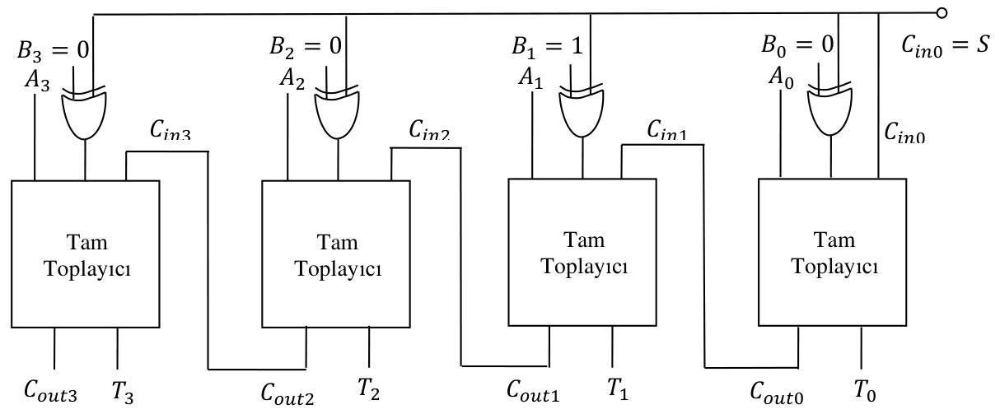
>
> **II. YOL (MUX'lar ile):**
> MUX'lar kullanılarak, $S$ seçme ucuna göre tam toplayıcılara doğrudan $B$ (0010) veya $\overline{B}$ (1101) sinyalleri yönlendirilebilir.
>
> 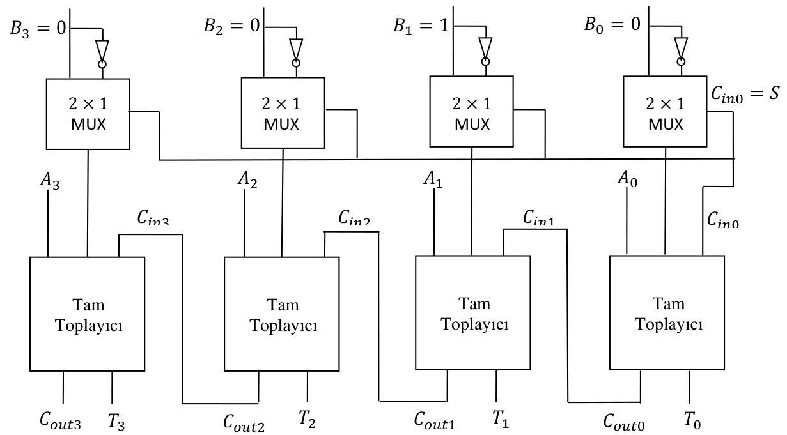
>
> **Örnek 9.10:** Dört yol ağzındaki trafik ışığı kontrol sistemi.
>
> 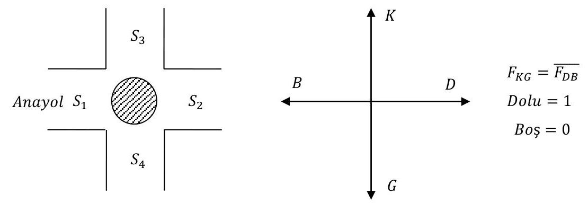
>
> | $\boldsymbol{S_1}$ | $\boldsymbol{S_2}$ | $\boldsymbol{S_3}$ | $\boldsymbol{S_4}$ | $\boldsymbol{F_{DB}}$ | $\boldsymbol{F_{KG}}$ |
> | :----------------: | :----------------: | :----------------: | :----------------: | :-------------------: | :-------------------: |
> |         0          |         0          |         0          |         0          |           1           |           0           |
> |         0          |         0          |         0          |         1          |           0           |           1           |
> |         0          |         0          |         1          |         0          |           0           |           1           |
> |         0          |         0          |         1          |         1          |           0           |           1           |
> |         0          |         1          |         0          |         0          |           0           |           1           |
> |         0          |         1          |         0          |         1          |           1           |           0           |
> |         0          |         1          |         1          |         0          |           1           |           0           |
> |         0          |         1          |         1          |         1          |           0           |           1           |
> |         1          |         0          |         0          |         0          |           0           |           1           |
> |         1          |         0          |         0          |         1          |           1           |           0           |
> |         1          |         0          |         1          |         0          |           1           |           0           |
> |         1          |         0          |         1          |         1          |           0           |           1           |
> |         1          |         1          |         0          |         0          |           1           |           0           |
> |         1          |         1          |         0          |         1          |           1           |           0           |
> |         1          |         1          |         1          |         0          |           1           |           0           |
> |         1          |         1          |         1          |         1          |           1           |           0           |
>
> 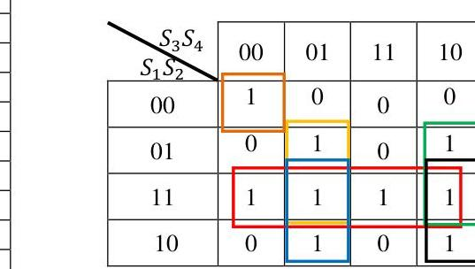
>
> ```latex
> F_{DB} = \overline{S_1}\overline{S_2}\overline{S_3}\overline{S_4} + S_2\overline{S_3}S_4 + S_2S_3\overline{S_4} + S_1\overline{S_3}S_4 + S_1S_3\overline{S_4} + S_1S_2
> ```
>
> **Örnek 9.11:** Su deposu seviye kontrol sistemi.
>
> 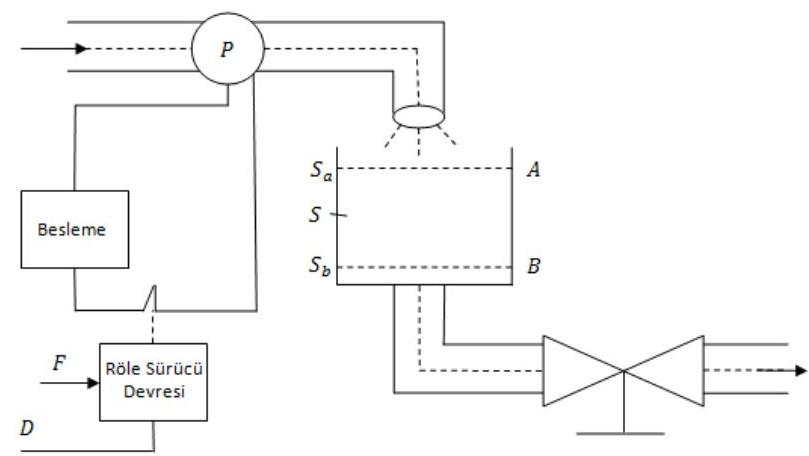
>
> | $\boldsymbol{A}$ | $\boldsymbol{B}$ | $\boldsymbol{D}$ | $\boldsymbol{F}$ |
> | :--------------: | :--------------: | :--------------: | :--------------: |
> |        0         |        0         |        0         |        1         |
> |        0         |        0         |        1         |        1         |
> |        0         |        1         |        0         |        0         |
> |        0         |        1         |        1         |        1         |
> |        1         |        0         |        0         |   Mümkün değil   |
> |        1         |        0         |        1         |   Mümkün değil   |
> |        1         |        1         |        0         |        0         |
> |        1         |        1         |        1         |        0         |
>
>  _(Görseldeki Karnaugh diyagramı yukarıdaki tabloya göre doldurulmuş olmalı. AB=10 durumları mümkün değil olarak işaretlenir.)_
>
> ```latex
> F = \bar{A}\bar{B} + \bar{A}D
> ```
>
> **Örnek 9.12:** 7 parçalı ortak katotlu display için 0'dan 9'a kadar sayıların yanı sıra karakterler de gösterilecektir. Sadece d ve e çıkışlarını gerçekleyiniz.
>
> 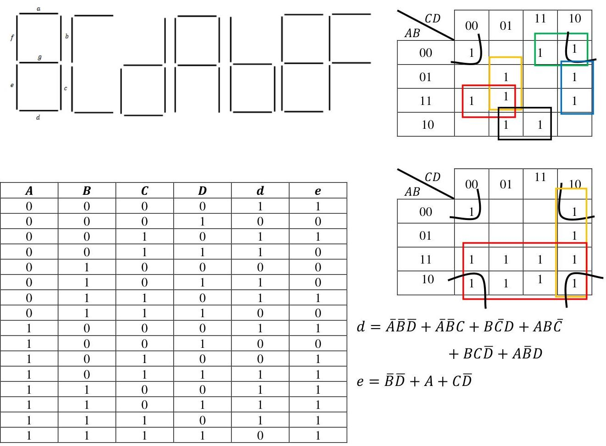
>
> **Örnek 9.13:** Telefon sisteminde konuşma önceliği.
>
> 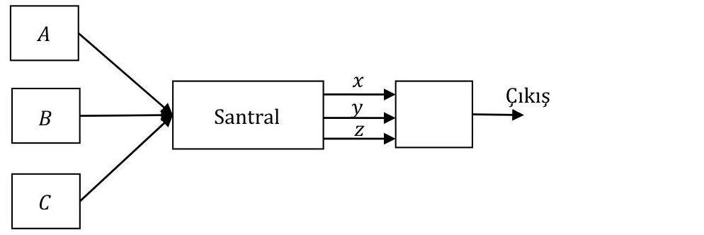
>
> ```latex
> f(x) = A
> f(y) = \bar{A}B\bar{C} + \bar{A}BC = \bar{A}B(\bar{C}+C) = \bar{A}B
> f(z) = \bar{A}\bar{B}C
> ```
>
> **Örnek 9.14:** Kavanoz çapı kontrolü.
>
> 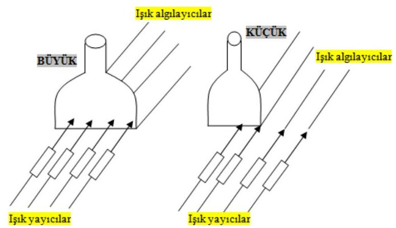
>
> | $\boldsymbol{a}$ | $\boldsymbol{b}$ | $\boldsymbol{c}$ | $\boldsymbol{d}$ | $\boldsymbol{F_{\text{iyi/iskarta}}}$ | $\boldsymbol{F_{\text{küçük}}}$ | $\boldsymbol{F_{\text{iyi}}}$ | $\boldsymbol{F_{\text{büyük}}}$ |
> | :--------------: | :--------------: | :--------------: | :--------------: | :-----------------------------------: | :-----------------------------: | :---------------------------: | :-----------------------------: |
> |        0         |        0         |        0         |        0         |                   0                   |                0                |               0               |                0                |
> |        0         |        0         |        0         |        1         |                   0                   |                1                |               0               |                0                |
> |        0         |        0         |        1         |        0         |                   0                   |                1                |               0               |                0                |
> |        0         |        0         |        1         |        1         |                   0                   |                1                |               0               |                0                |
> |        0         |        1         |        0         |        0         |                   0                   |                1                |               0               |                0                |
> |        0         |        1         |        0         |        1         |                   0                   |                0                |               0               |                0                |
> |        0         |        1         |        1         |        0         |                   0                   |                1                |               0               |                0                |
> |        0         |        1         |        1         |        1         |                   1                   |                0                |               1               |                0                |
> |        1         |        0         |        0         |        0         |                   0                   |                1                |               0               |                0                |
> |        1         |        0         |        0         |        1         |                   0                   |                0                |               0               |                0                |
> |        1         |        0         |        1         |        0         |                   0                   |                0                |               0               |                0                |
> |        1         |        0         |        1         |        1         |                   0                   |                0                |               0               |                0                |
> |        1         |        1         |        0         |        0         |                   0                   |                1                |               0               |                0                |
> |        1         |        1         |        0         |        1         |                   0                   |                0                |               0               |                0                |
> |        1         |        1         |        1         |        0         |                   1                   |                0                |               1               |                0                |
> |        1         |        1         |        1         |        1         |                   0                   |                0                |               0               |                1                |
>
> ```latex
> F_{iyi/iskarta} = \bar{a}bcd + abc\bar{d} = bc(\bar{a}d + a\bar{d}) = bc(a \oplus d)
> ```

---

## 10. Flip-Floplar

Flip-flop'lar, 1 bitlik bilgiyi saklayabilen **bellek birimleridir**. Tek başına kullanılabileceği gibi, birçoğu bir araya getirilerek yazmaç (register), sayıcı (counter) veya daha büyük bellek birimleri oluşturulabilir.

Bir flip-flop'un genellikle iki çıkışı ($Q$ ve $\bar{Q}$), bir saat girişi ve bir veya iki veri giriş ucu bulunur. Çıkış uçları birbirlerinin tümleyenidir.

**Flip-Flop Giriş Türleri:**

1. **Senkron girişler**: Flip-flop'un kontrol girişleri olup (JK, SR, D, T), clock darbeleriyle senkronize olarak çıkışı etkiler.
2. **Asenkron girişler**: Clock sinyalinden bağımsız olarak flip-flop'un çıkışını belirli bir lojik değere (Preset/Clear) ayarlar.

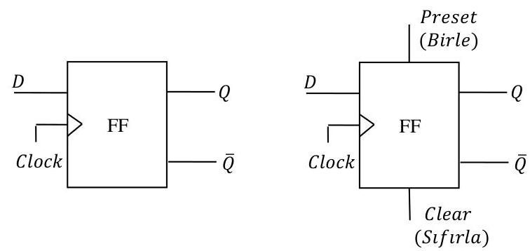

> [!caption|center] Şekil 10.1. Flip-flop'un genel gösterilişi

### 10.1. SR Flip-Flop

**S (Set)** ve **R (Reset)** olmak üzere iki girişe sahiptir. `$Q(t+1)$` değeri, `$t$` anındaki `S` ve `R` girişlerine bağlıdır. `S=1, R=1` durumu geçersizdir (çelişkili).

$Q(t+1) = Q(t)\overline{R(t)} + S(t) \quad (R(t) \cdot S(t) = 0 \text{ durumları için})$

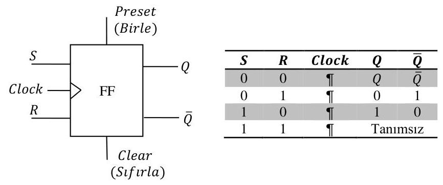

> [!caption|center] Şekil 10.2 SR flip-flop'un genel gösterilişi ve uyarma tablosu

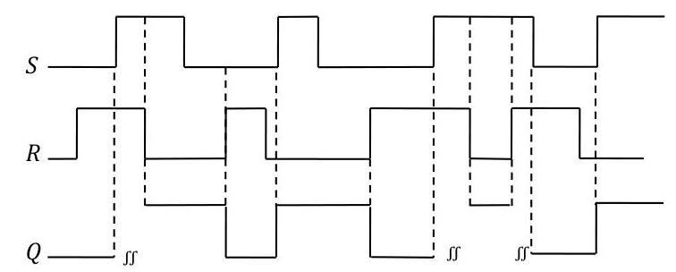

> [!caption|center] Şekil 10.3. SR flip-flop için darbe diyagramı

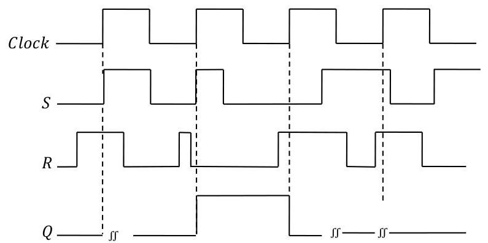

> [!caption|center] Şekil 10.4. Clock girişli SR flip-flop için darbe diyagramı (Yükselen kenar tetiklemeli)

### 10.2. JK Flip-Flop

SR flip-flop'a benzer ancak iki girişin (`J=1, K=1`) olduğu durumda da durum geçişi olur (toggle durumu). Bu durum, SR flip-flop'taki belirsizliği ortadan kaldırır.

$Q(t+1) = Q(t)\overline{K(t)} + \bar{Q}(t)J(t)$

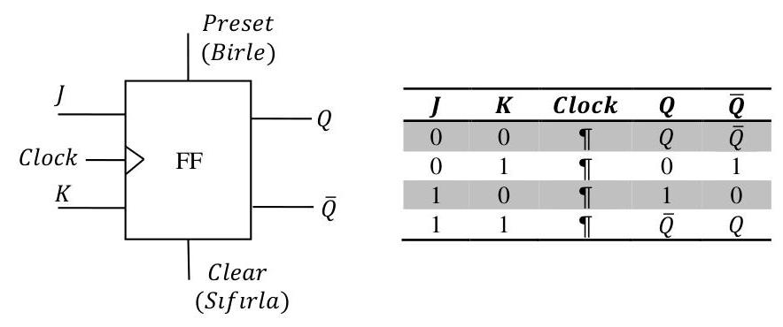

> [!caption|center] Şekil 10.5. JK flip-flop'un genel gösterilişi ve uyarma tablosu

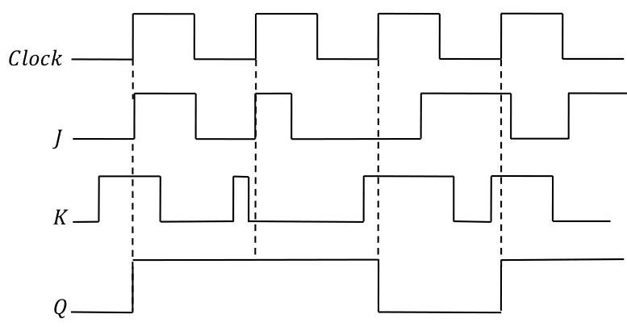

> [!caption|center] Şekil 10.6. JK flip-flop için darbe diyagramı

### 10.3. D Flip-Flop

**D (Data)** olarak adlandırılan tek bir girişi vardır. `D` girişindeki değer, clock darbesi geldiğinde doğrudan `Q` çıkışına aktarılır. Bu nedenle **veri saklayıcı** olarak kullanılır.

$Q(t+1) = D(t)$

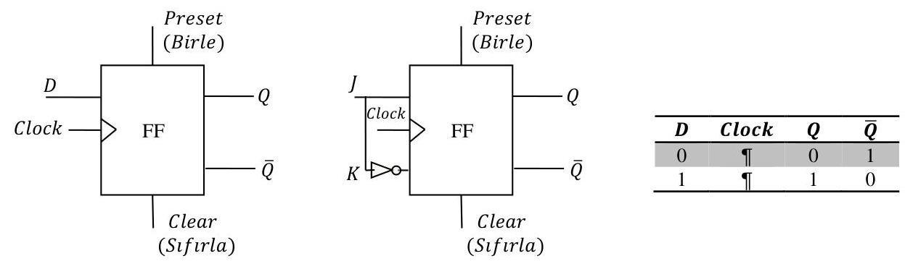

> [!caption|center] Şekil 10.7. D flip-flop'un genel gösterilişi ve uyarma tablosu

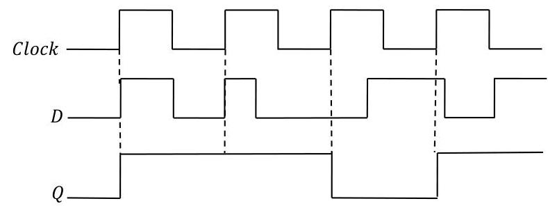

> [!caption|center] Şekil 10.8. D flip-flop için darbe diyagramı

### 10.4. T Flip-Flop

**T (Toggle)** olarak adlandırılan tek bir girişi vardır. Eğer `T=0` ise flip-flop durumunu korur, `T=1` ise durumunu değiştirir (toggle yapar). JK flip-flop'un `J` ve `K` girişleri birleştirilerek elde edilebilir.

$Q(t+1) = Q(t) \oplus T(t)$

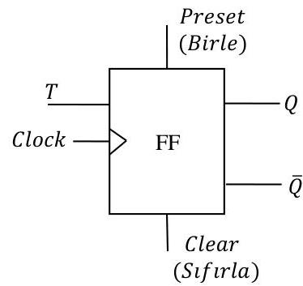

| $\boldsymbol{T}$ |          Clock          | $\boldsymbol{Q}$ | $\overline{\boldsymbol{Q}}$ |
| :--------------: | :---------------------: | :--------------: | :-------------------------: |
|        0         | $\boldsymbol{\uparrow}$ |       $Q$        |          $\bar{Q}$          |
|        1         | $\boldsymbol{\uparrow}$ |    $\bar{Q}$     |             $Q$             |

> [!caption|center] Şekil 10.9. T flip-flop'un genel gösterilişi ve uyarma tablosu

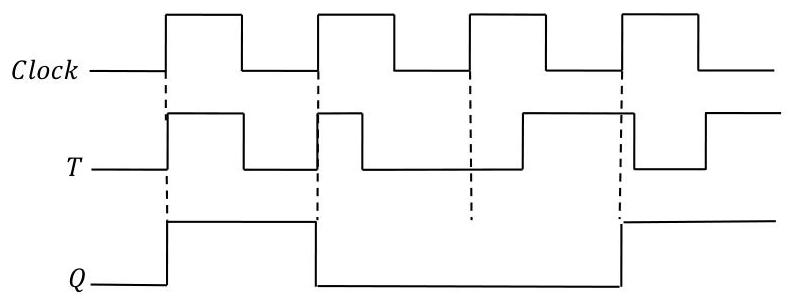

> [!caption|center] Şekil 10.10. T flip-flop için darbe diyagramı

> [!example]+ Flip-Flop Darbe Diyagramı Örnekleri
> **Örnek 10.1:** JK, Clock, preset ve clear girişleri verilen flip-flop'un çıkış darbe diyagramını çiziniz (Yükselen kenar tetiklemeli).
>
> 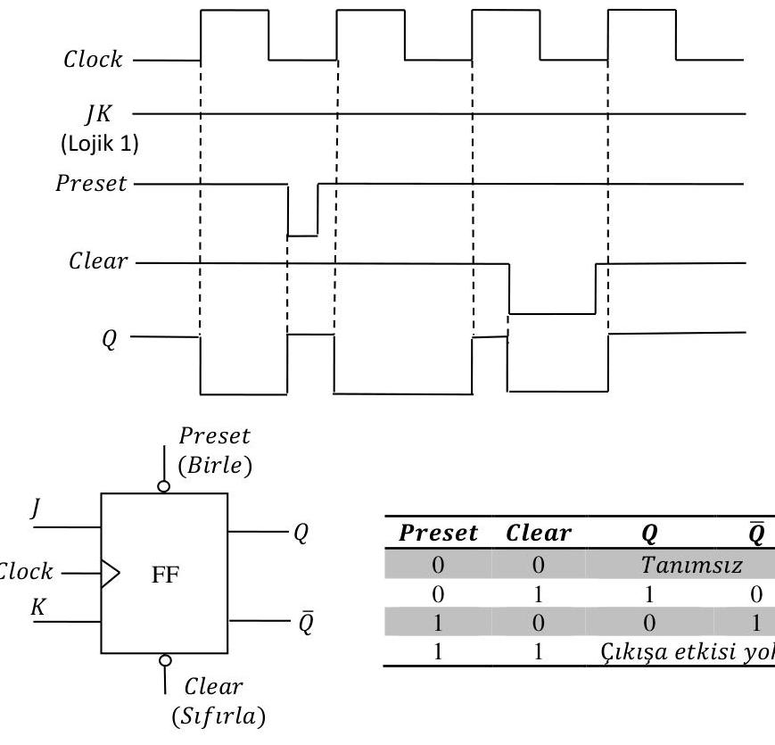
>
> **Örnek 10.2:** JK, Clock, preset ve clear girişleri verilen flip-flop'un çıkış darbe diyagramını çiziniz.
>
> 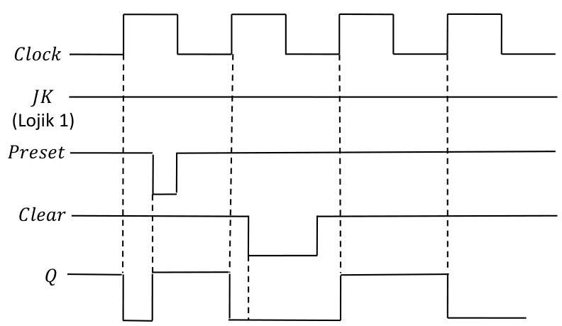

### 10.5. Master-Slave (Ana-Uydu) Flip-Flop

İki flip-flop'un bağlanmasıyla elde edilen, tetikleme periyodu içinde girişindeki yeni değeri alırken çıkışındaki bir önceki değeri bir süre tutan bir yapıdır. Bu mimari, belirli zamanlama sorunlarını çözmek için kullanılır. Ana flip-flop, clock'un bir kenarında (örn. yükselen), uydu flip-flop ise diğer kenarında (örn. düşen) etkinleşir.

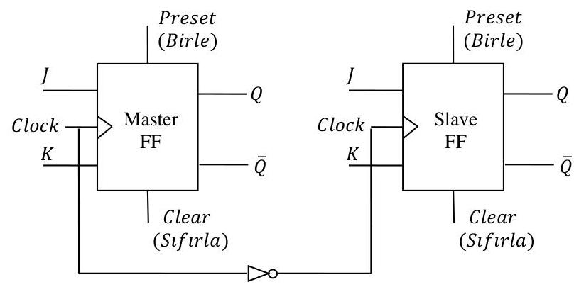

> [!caption|center] Şekil 10.11. Master-Slave flip-flop mimarisi

### 10.6. Flip-Flop Uyarma Tablosu

Flip-flop'un mevcut durumdan (`Q(t)`) bir sonraki duruma (`Q(t+1)`) geçişi için hangi giriş sinyallerinin (`S, R, J, K, D, T`) uygulanması gerektiğini gösteren tablodur.

| $\boldsymbol{Q(t)}$ | $\boldsymbol{Q(t+1)}$ | $\boldsymbol{S}$ | $\boldsymbol{R}$ | $\boldsymbol{J}$ | $\boldsymbol{K}$ | $\boldsymbol{D}$ | $\boldsymbol{T}$ |
| :-----------------: | :-------------------: | :--------------: | :--------------: | :--------------: | :--------------: | :--------------: | :--------------: |
|          0          |           0           |        0         |        X         |        0         |        X         |        0         |        0         |
|          0          |           1           |        1         |        0         |        1         |        X         |        1         |        1         |
|          1          |           0           |        0         |        1         |        X         |        1         |        0         |        1         |
|          1          |           1           |        X         |        0         |        X         |        0         |        1         |        0         |

> [!example]+ Flip-Flop Uygulama Örnekleri
> **Örnek 10.3:** Flip-floplarla paralel veri transferini gerçekleştiriniz.
>
> 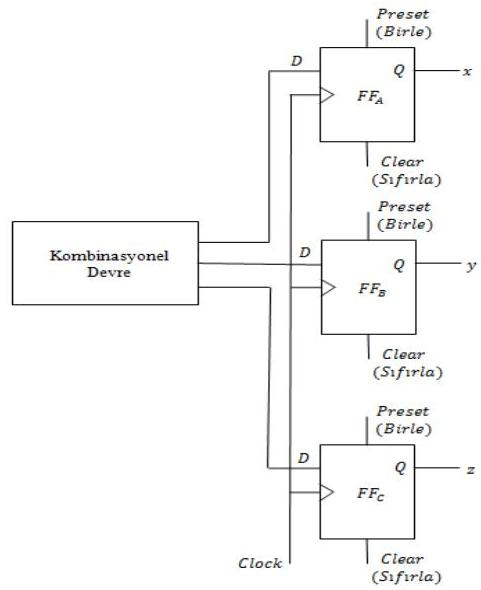
>
> **Örnek 10.4:** Flip-floplarla seri veri transferini gerçekleştiriniz.
>
> 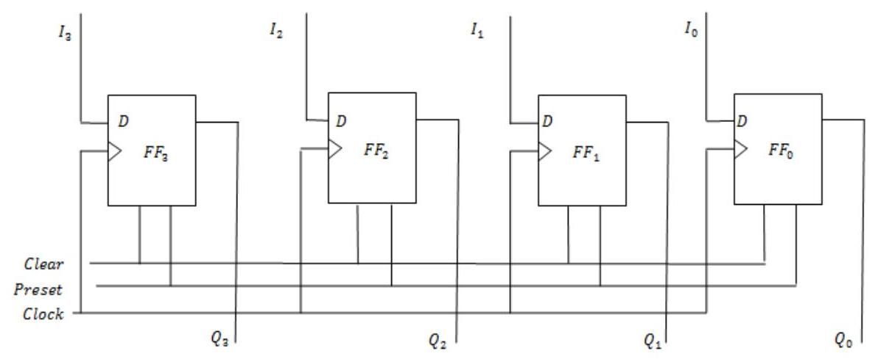
>
> **Örnek 10.5:** D flip-floplarla 4 bitlik ötelemeli (shift) bir register (saklayıcı) gerçekleyiniz.
>
> 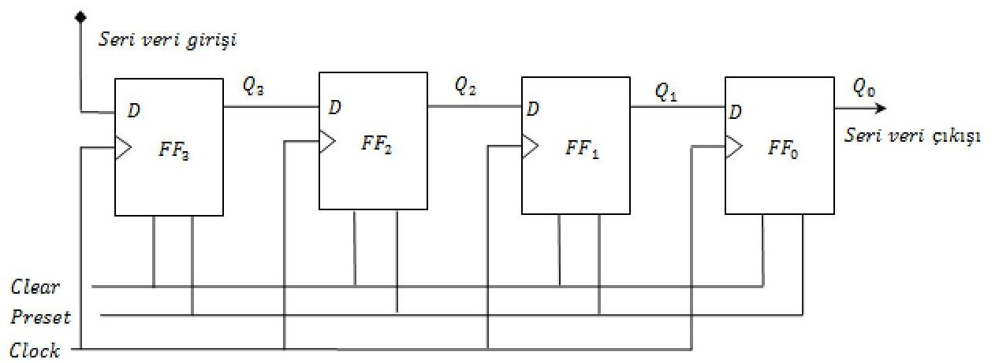
>
> **Örnek 10.6:** İki adet JK flip-flop ve gerektiği kadar kapı kullanarak a) 1'e tümleyici devresi ve b) 2'ye tümleyici devresini tasarlayınız.
>
> | $\boldsymbol{A}$ | $\boldsymbol{B}$ | $\boldsymbol{A^1}$ | $\boldsymbol{B^1}$ | $\boldsymbol{J_{A^1}}$ | $\boldsymbol{K_{A^1}}$ | $\boldsymbol{J_{B^1}}$ | $\boldsymbol{K_{B^1}}$ |
> | :--------------: | :--------------: | :----------------: | :----------------: | :--------------------: | :--------------------: | :--------------------: | :--------------------: |
> |        0         |        0         |         1          |         1          |           1            |           X            |           1            |           X            |
> |        0         |        1         |         1          |         0          |           1            |           X            |           X            |           1            |
> |        1         |        0         |         0          |         1          |           X            |           1            |           1            |           X            |
> |        1         |        1         |         0          |         0          |           X            |           1            |           X            |           1            |
>
> 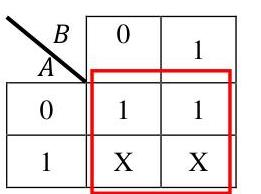 _(Bu görselde `J_A1` ve `K_A1` için Karnaugh diyagramı gösterilmiştir.)_
>
> 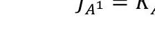 _(Bu görselde `J_A1` ve `K_A1` için sadeleştirilmiş Karnaugh diyagramı gösterilmiştir.)_
>
> ```latex
> J_{A^1}=K_{A^1}=1
> ```
>
> 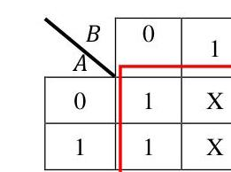 _(Bu görselde `J_B1` ve `K_B1` için Karnaugh diyagramı gösterilmiştir.)_
>
> **Örnek 10.7:** Dört kişilik oylama sistemi tasarımı.
>
> | $\boldsymbol{A}$ | $\boldsymbol{B}$ | $\boldsymbol{C}$ | $\boldsymbol{D}$ | $\boldsymbol{T_{Baş}}$ | $\boldsymbol{T_{Sonra}}$ | $\boldsymbol{J_T}$ | $\boldsymbol{K_T}$ | $\boldsymbol{D_T}$ |
> | :--------------: | :--------------: | :--------------: | :--------------: | :--------------------: | :----------------------: | :----------------: | :----------------: | :----------------: |
> |        0         |        0         |        0         |        0         |           0            |            0             |         0          |         X          |         0          |
> |        0         |        0         |        0         |        1         |           0            |            0             |         0          |         X          |         0          |
> |        0         |        0         |        1         |        0         |           0            |            0             |         0          |         X          |         0          |
> |        0         |        0         |        1         |        1         |           0            |            1             |         1          |         X          |         1          |
> |        0         |        1         |        0         |        0         |           0            |            0             |         0          |         X          |         0          |
> |        0         |        1         |        0         |        1         |           0            |            1             |         1          |         X          |         1          |
> |        0         |        1         |        1         |        0         |           0            |            1             |         1          |         X          |         1          |
> |        0         |        1         |        1         |        1         |           0            |            1             |         1          |         X          |         1          |
> |        1         |        0         |        0         |        0         |           0            |            0             |         0          |         X          |         0          |
> |        1         |        0         |        0         |        1         |           0            |            1             |         1          |         X          |         1          |
> |        1         |        0         |        1         |        0         |           0            |            1             |         1          |         X          |         1          |
> |        1         |        0         |        1         |        1         |           0            |            1             |         1          |         X          |         1          |
> |        1         |        1         |        0         |        0         |           0            |            1             |         1          |         X          |         1          |
> |        1         |        1         |        0         |        1         |           0            |            1             |         1          |         X          |         1          |
> |        1         |        1         |        1         |        0         |           0            |            1             |         1          |         X          |         1          |
> |        1         |        1         |        1         |        1         |           0            |            1             |         1          |         X          |         1          |
>
> 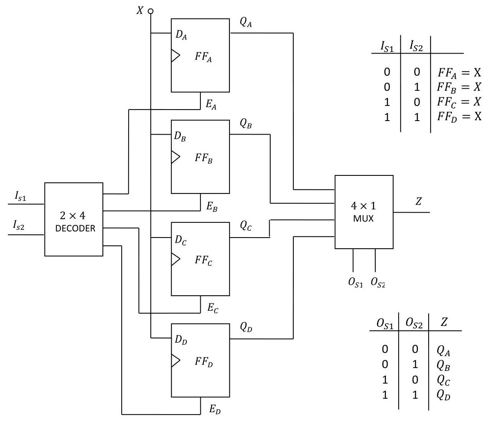 _(Bu görselde Karnaugh diyagramı olarak işaretlenmiştir ancak üzerinde değerler bulunmamaktadır.)_
>
> ```latex
> J_T = AB + CD + BD + AD + BC + AC
> D_T = J_T
> ```
>
> **Örnek 10.8:** D tipi izin girişli flip-floplar ile veri girişi ve çıkışı.
>
> 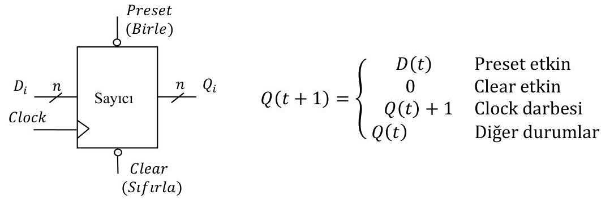 _(Bu görselde `J_T` veya `D_T` çıkışı için Karnaugh diyagramının bir örneği olabilir, ancak üzerinde değerler belirtilmemiştir. İlgili örneğe göre doldurulması gerekir.)_

---

## 11. Sayıcılar

Sayıcılar, `$n$` bitlik bilgi tutmanın yanı sıra her saat çevriminde tuttukları değeri belirli bir sırada (artan veya azalan) değiştiren ardışıl elemanlardır.

**Sayıcı Sınıflandırması:**

- **Bit sayısına göre**: 4 bitlik, 8 bitlik vb.
- **Sayma sırası ve şekline göre**: Yukarı (ileri), aşağı (geri), tek sayılar, özel sayılar vb.
- **Durumların sayısına göre**: Modülo sayıcı, 5 durumlu sayıcı vb.
- **Geçiş fonksiyonlarının zamanlamasına göre**: Senkron, asenkron vb.

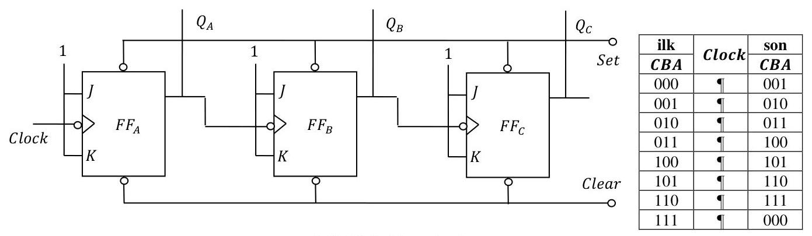

> [!caption|center] Şekil 11.1. Bir sayıcı için blok gösterim

> [!note]
>
> - **Senkron Sayıcı**: Clock darbesi, sayıcıyı oluşturan tüm flip-flop'lara aynı anda verilir.
> - **Asenkron Sayıcı**: Flip-flop'lar ardışık olarak birbirini tetikler. Uygulamalarda daha sık kullanılır (örn. 7490, 7493).

### 11.1. Binary (İkili) İleri Sayıcı

`$n$` bitlik çıkış ucu ve `$2^n$` tane değişik durum vardır. Genellikle 0'dan `$2^n-1$`'e kadar birer artımla sayar.

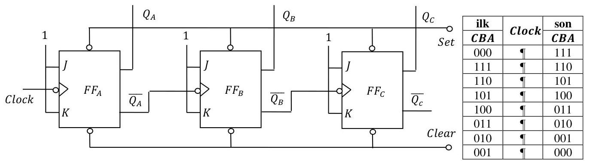

> [!caption|center] Şekil 11.2. Binary ileri sayıcı

### 11.2. Binary (İkili) Geri Sayıcı

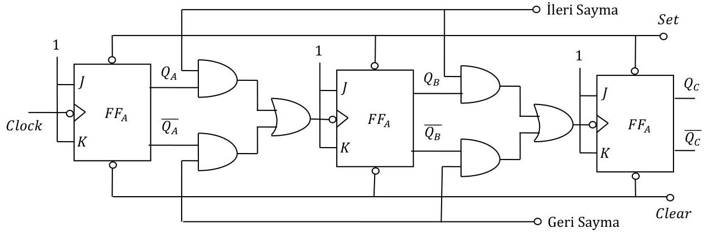

> [!caption|center] Şekil 11.3. Binary geri sayıcı

> [!note] Mod Sayısı
> Mod sayısı `$= 2^{\text{FF sayısı}}$`. Örneğin, Mod 8 sayıcı için `$8 = 2^n \Rightarrow n=3$` adet FF kullanılması gerekir. Sayıcı `$2^n-1 = 8-1 = 7$`'ye kadar sayar.

### 11.3. Asenkron İleri-Geri Sayıcı

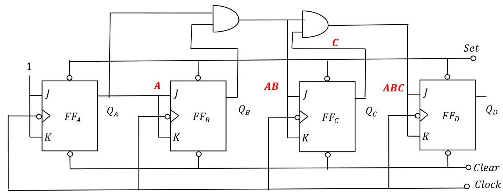

> [!caption|center] Şekil 11.4. Asenkron ileri/geri sayıcı
>
> | İleri sayma | Geri sayma | İşlem       |
> | :---------: | :--------: | :---------- |
> |      0      |     0      | Sayma yok   |
> |      0      |     1      | Geri sayma  |
> |      1      |     0      | İleri sayma |
> |      1      |     1      | Sayma yok   |

### 11.4. Senkron Sayıcı

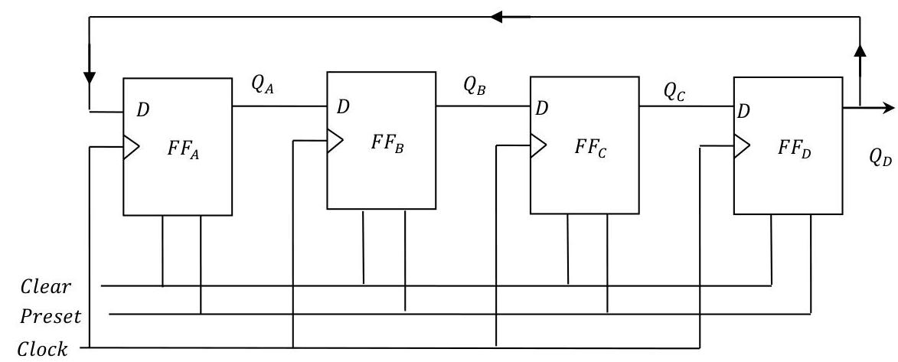

> [!caption|center] Şekil 11.5. Senkron ileri/geri sayıcı

### 11.5. Ring (Halka) Sayıcı

Shift register gibi içerisindeki değeri lojik olarak sağa veya sola öteleyerek çalışır. Bir flip-flop'un içinde başlangıçta lojik 1 depolu olmalıdır.

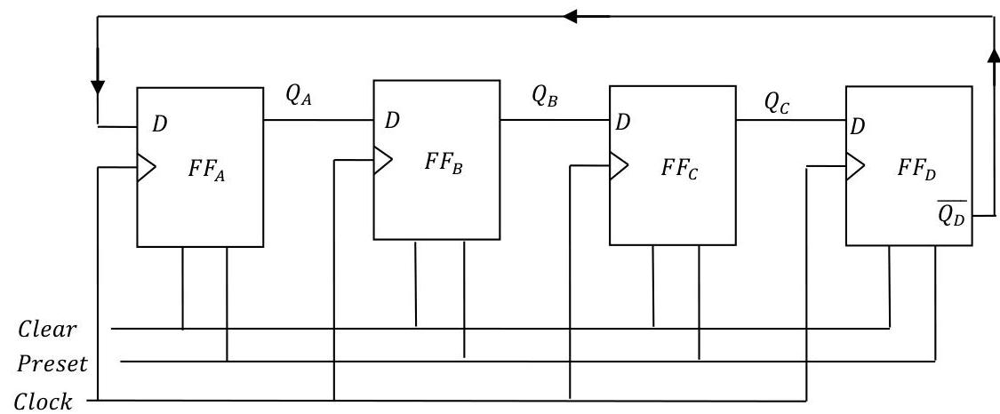

> [!caption|center] Şekil 11.6. Ring (Halka) sayıcı
>
> |  A  |  B  |  C  |  D  |     İşlem      |
> | :-: | :-: | :-: | :-: | :------------: |
> |  1  |  0  |  0  |  0  |   Başlangıç    |
> |  0  |  1  |  0  |  0  | `$\mathbf{1}$` |
> |  0  |  0  |  1  |  0  | `$\mathbf{1}$` |
> |  0  |  0  |  0  |  1  | `$\mathbf{1}$` |
> |  1  |  0  |  0  |  0  | `$\mathbf{1}$` |

### 11.6. Johnson Sayıcı (Dalgalı Halka Sayıcı)

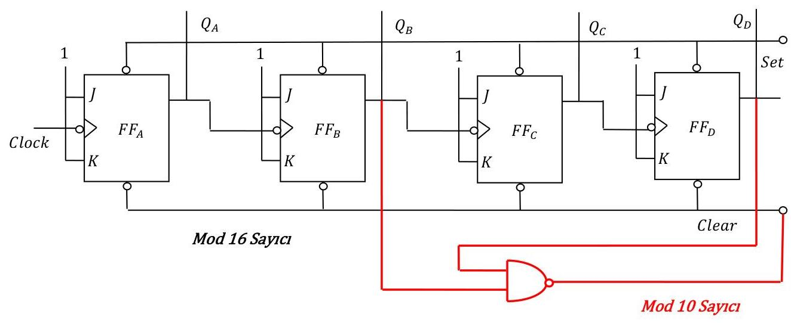

> [!caption|center] Şekil 11.7. Johnson sayıcı
>
> |  A  |  B  |  C  |  D  |     İşlem      |
> | :-: | :-: | :-: | :-: | :------------: |
> |  0  |  0  |  0  |  0  |   Başlangıç    |
> |  1  |  0  |  0  |  0  | `$\mathbf{1}$` |
> |  1  |  1  |  0  |  0  | `$\mathbf{1}$` |
> |  1  |  1  |  1  |  0  | `$\mathbf{1}$` |
> |  1  |  1  |  1  |  1  | `$\mathbf{1}$` |
> |  0  |  1  |  1  |  1  | `$\mathbf{1}$` |
> |  0  |  0  |  1  |  1  | `$\mathbf{1}$` |
> |  0  |  0  |  0  |  1  | `$\mathbf{1}$` |
> |  0  |  0  |  0  |  0  | `$\mathbf{1}$` |

### 11.7. Sayıcıları İstenilen Bir Sayıda Durdurma

Sayıcılar, **Clear (Reset)** uçları kullanılarak istenilen bir sayıda durdurulabilir. 4 bitlik asenkron sayıcılarda genellikle 2 reset girişi mevcuttur.

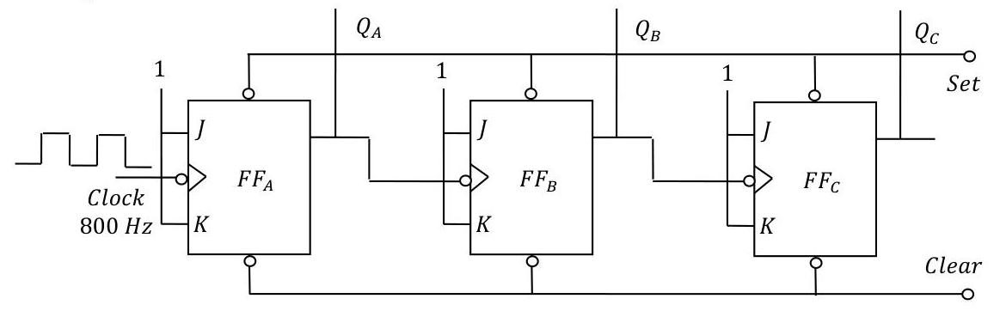

> [!caption|center] Şekil 11.8. Mod 16 ve Mod 10 asenkron sayıcı

### 11.8. Sayıcıların Frekans Bölücü Olarak Kullanılması

Flip-floplar ve dolayısıyla sayıcılar, girişlerine uygulanan clock frekansını bölerek daha düşük frekanslı sinyaller üretmek için kullanılabilir.

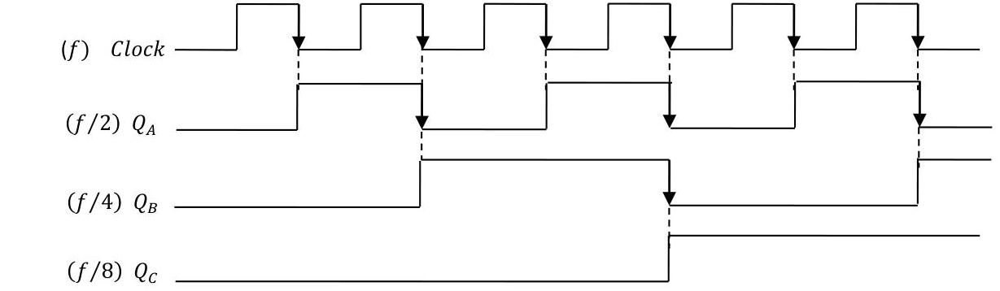

> [!caption|center] Şekil 11.9. Sayıcıların frekans bölücü olarak kullanılması

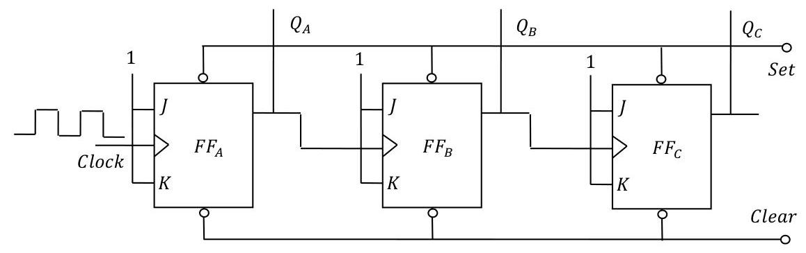

### 11.9. Sayıcılarda Propagasyon (Yayılma) Gecikmesi

Propagasyon gecikmesi, bir sinyalin girişten çıkışa ulaşması için geçen süredir. Sayıcılarda, bu gecikme flip-flop sayısı ve lojik kapıların gecikmeleriyle ilişkilidir.

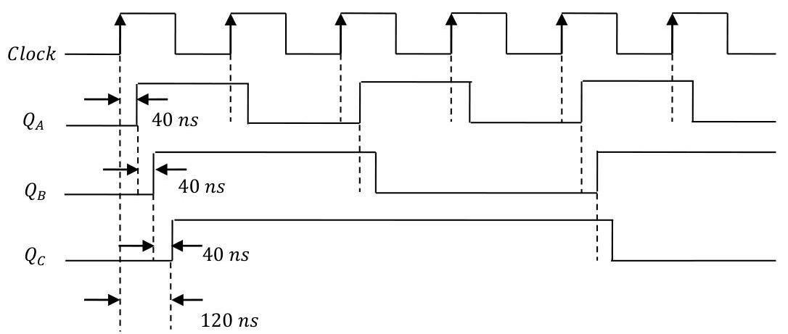

> [!caption|center] Şekil 11.10. Sayıcılarda propagasyon gecikmesi

Clock frekansı, toplam yayılma gecikmesine göre hesaplanır. Bir flip-flop'un yayılma gecikmesi yaklaşık 40 ns, bir lojik kapının ise yaklaşık 20 ns'dir.

> [!example]+ Gecikme Hesaplamaları
> **Asenkron sayıcılarda:**
>
> ```latex
> \text{Toplam yayılma gecikmesi} = \text{FF sayısı} \times \text{Bir FF'nin yayılma gecikmesi} + \text{Sistemdeki lojik kapıların yayılma gecikmesi}
> ```
>
> **Senkron sayıcılarda ise:**
>
> ```latex
> \text{Toplam yayılma gecikmesi} = \text{Bir FF'nin yayılma gecikmesi} + \text{Sistemdeki lojik kapıların yayılma gecikmesi}
> ```

> [!example]+ Sayıcı Uygulama Örnekleri
> **Örnek 11.1:**
> 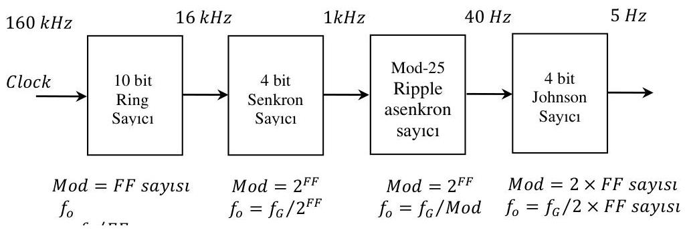
>
> **Örnek 11.2:**
> 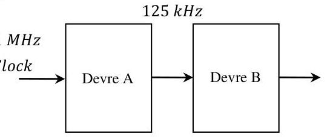
>
> ```latex
> \text{Mod} = 1 \text{ MHz} / 125 \text{ kHz} = 8
> \text{Devre A} \Rightarrow \text{Mod 8 sayıcı}
> ```
>
> **Örnek 11.3:** 17'ye kadar sayan ve 17'de duran asenkron sayıcıyı çiziniz (JK-FF kullanılacak olup, FF'lerin set ve clear uçları inversli değildir). $17 \Rightarrow EDCBA = 10001$.
>
> 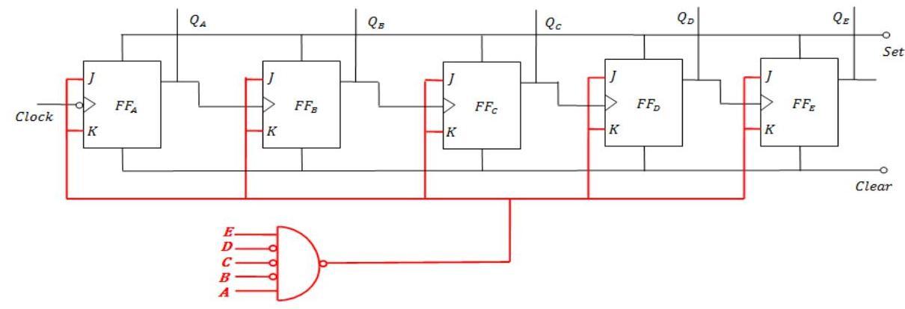
>
> **Örnek 11.4:** Asenkron bir sayıcı tasarlanacaktır. X kontrol ucu sayesinde sayıcı "0" olabilecek ve istenen modda maksimum sayıyı gösterebilecektir ($X=0$'da sayıcı sıfırlanacak, $X=1$ olduğunda maksimum sayıda duracaktır). Böyle bir sisteme uygun Mod 13 asenkron sayıcıyı $X$ kontrol ucuna bağlı olarak gerçekleştiriniz (Set ve clear uçları inversli JK flip-flop kullanılacaktır).
>
> 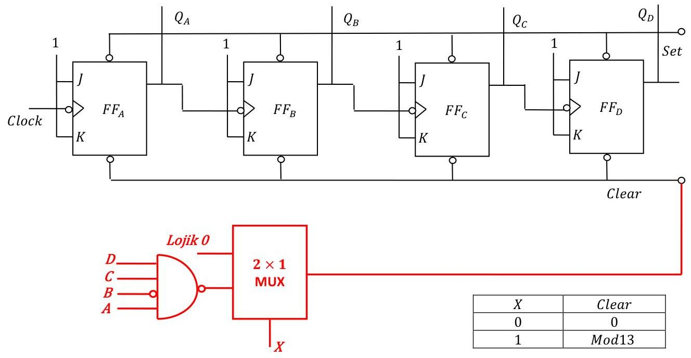
>
> **Örnek 11.5:** 7476 JK flip-flop'u kullanarak bir lojik prob tasarlayıp devre şemasını eksiksiz, çalışır durumda çiziniz.
>
> 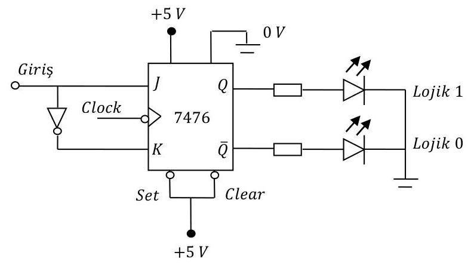
>
> **Örnek 11.6:** B'deki sinyal 10 MHz ise A, C, D ve E noktalarındaki sinyalin frekanslarını bulunuz.
>
> 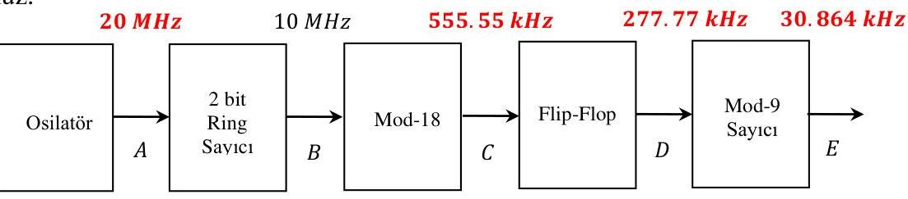
>
> **Örnek 11.7:** 8'e kadar sayan ve 8'de duran asenkron sayıcıyı JK kullanarak tasarlayınız. (Set ve Clear uçları inversli JK flip-flop kullanarak tasarlayınız.)
>
> 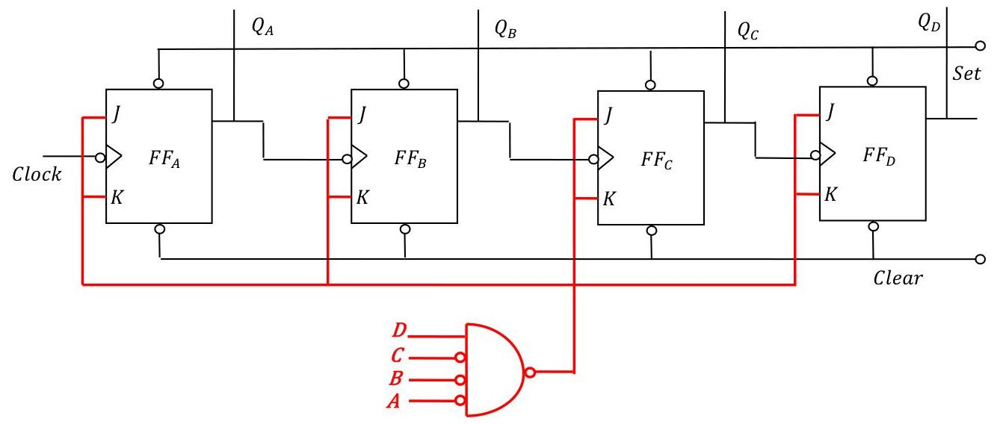
>
> **Örnek 11.8:** (ÖDEV) Üç girişi ve 1 çıkışı olan bir çoğunluk dedektör devresi (kombinasyonel devre) tasarlanacaktır. Girişlerin çoğunda "1" olduğunda çıkış lojik 1, girişlerin çoğunda "0" olduğunda çıkış Lojik 0 olacaktır. Doğruluk tablosunu oluşturarak, Karnaugh diyagramı yardımıyla maksimum terimler kanonik açılımı şeklinde gerekli lojik fonksiyonu elde ediniz. Bu fonksiyonu gerçekleştirecek lojik devreyi çiziniz.
>
> **Örnek 11.9:** (ÖDEV) Girişine verilen 4 bitlik sayıların tek veya çift olduğunu gösteren lojik devreyi tasarlayınız. Gerekli devre şemasını çiziniz.
>
> **Örnek 11.10:**
>
> 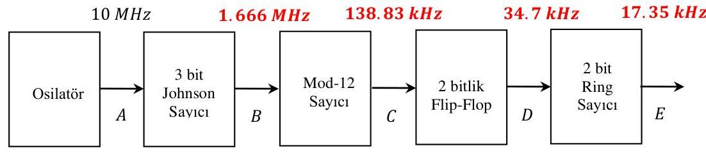
>
> ```latex
> f_B = 10 \text{ MHz} / (2 \times 3) = 1.666 \text{ MHz}
> f_C = 1.666 \text{ MHz} / 12 = 138.83 \text{ kHz}
> f_D = 138.83 \text{ kHz} / 2^2 = 34.7 \text{ kHz}
> f_E = 34.7 \text{ kHz} / 2 = 17.35 \text{ kHz}
> ```
>
> **Örnek 11.11:** $2 \times 1$ MUX kullanarak $4 \times 1$ MUX'u blok olarak tasarlayınız. Tasarladığınız MUX'a ait seçme uçlarına ait tabloyu oluşturunuz.
>
> 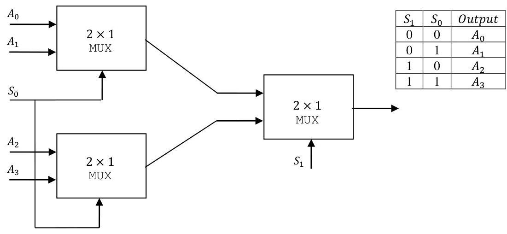
>
> **Örnek 11.12:**
>
> | $X$ | $Y$ |     $F$     |
> | :-: | :-: | :---------: |
> |  0  |  0  |    $A+B$    |
> |  0  |  1  |  $\bar{B}$  |
> |  1  |  0  |  $\bar{A}$  |
> |  1  |  1  | $A \cdot B$ |
>
> 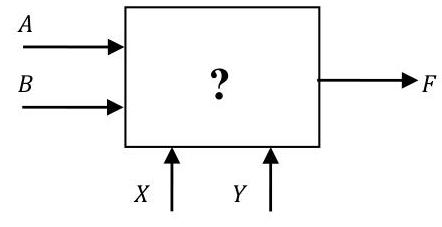
> _$X, Y$ girişlerine bağlı olarak $F$ çıkışının değeri aşağıdaki tabloda verilmiştir. $F$ çıkışına ait fonksiyonu elde ediniz ve devreyi gerçekleyiniz._
>
> | $\boldsymbol{X}$ | $\boldsymbol{Y}$ | $\boldsymbol{A}$ | $\boldsymbol{B}$ | $\boldsymbol{F}$ |
> | :--------------: | :--------------: | :--------------: | :--------------: | :--------------: |
> |        0         |        0         |        0         |        0         |        0         |
> |        0         |        0         |        0         |        1         |        1         |
> |        0         |        0         |        1         |        0         |        1         |
> |        0         |        0         |        1         |        1         |        1         |
> |        0         |        1         |        0         |        0         |        1         |
> |        0         |        1         |        0         |        1         |        0         |
> |        0         |        1         |        1         |        0         |        1         |
> |        0         |        1         |        1         |        1         |        0         |
> |        1         |        0         |        0         |        0         |        1         |
> |        1         |        0         |        0         |        1         |        1         |
> |        1         |        0         |        1         |        0         |        0         |
> |        1         |        0         |        1         |        1         |        0         |
> |        1         |        1         |        0         |        0         |        0         |
> |        1         |        1         |        0         |        1         |        0         |
> |        1         |        1         |        1         |        0         |        0         |
> |        1         |        1         |        1         |        1         |        1         |
>
> 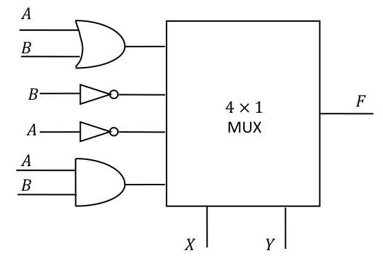
>
> ```latex
> F = \overline{X}\overline{Y}(A+B) + \overline{X}Y\overline{B} + X\overline{Y}\overline{A} + XY(A \cdot B)
> ```

### 11.10. 7493 Entegresi - 4 Bitlik Asenkron Sayıcı

7493, standart bir 4-bitlik asenkron sayıcı entegresidir.

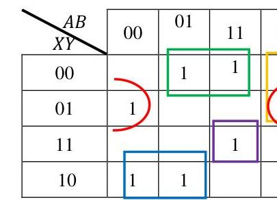

> [!caption|center] Şekil 11.11. 7493 Entegresi - 4 bitlik asenkron sayıcı

Sayıcının resetlenmesi için $R_1$ ve $R_2$ girişlerinin her ikisine birden aynı anda "Lojik 1" verilmesi gerekir.

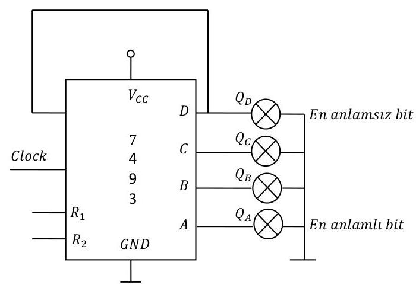

> [!example]+ 7493 Entegresi Kullanımı Örnekleri
> **Örnek 11.13:** Mod 12 sayıcıyı 7493 entegresi kullanarak tasarlayınız.
>
> 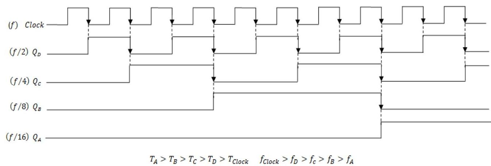
>
> **Örnek 11.14:** Mod 14 sayıcıyı 7493 entegresi kullanarak tasarlayınız.
>
> 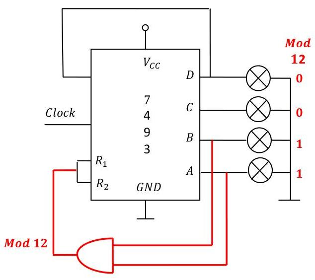
>
> **Örnek 11.15:** Mod 56 sayıcıyı 7493 entegresi kullanarak tasarlayınız.
>
> 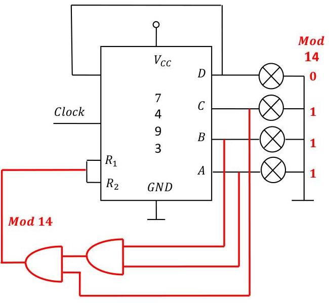
>
> **Örnek 11.16:** Mod 77 sayıcıyı 7493 entegresi kullanarak tasarlayınız.
>
> 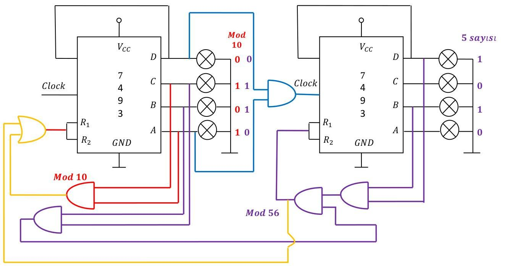
>
> **Örnek 11.17:** Mod 923 sayıcıyı 7493 entegresi kullanarak tasarlayınız.
>
> 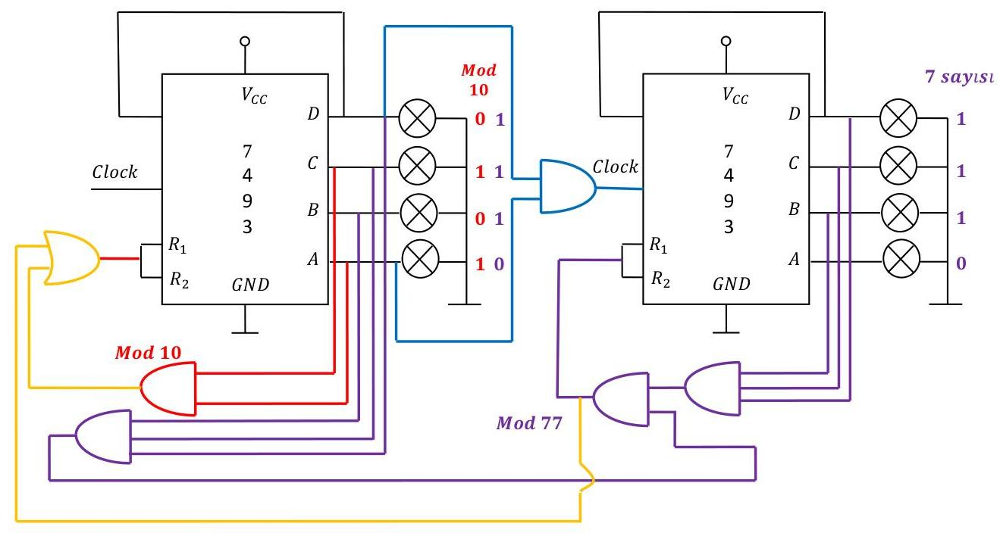
>
> **Örnek 11.18:** Mod 250 sayıcıyı 7493 entegresi kullanarak tasarlayınız.
>
> 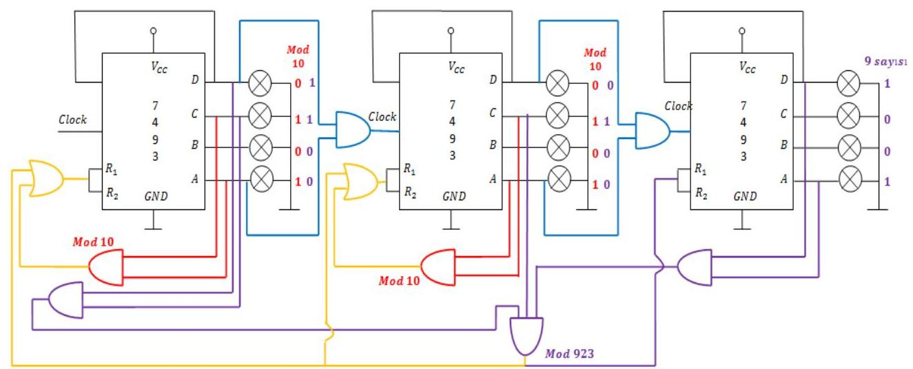

---

# Temel Formüller ve Hızlı Bilgiler

- **Analog/Sayısal Dönüştürücü Duyarlılığı**: `a = (Vmax - Vmin) / 2^n`
- **Örnekleme Teoremi (Nyquist)**: `$\omega_s \ge 2\omega_c$` (_Minimum örnekleme frekansı, sinyalin en yüksek frekansının iki katı olmalıdır._)
- **1'e Tümleme**: Bir ikili sayının her bitini tersine çevirme (`1` -> `0`, `0` -> `1`).
- **2'ye Tümleme**: 1'e tümleme sonucuna `1` ekleme. (_Negatif sayı gösterimi ve çıkarma için kullanılır._)
- **De Morgan Kuralları**:
  - `$\overline{(A+B)} = \bar{A} \cdot \bar{B}$`
  - `$\overline{(A \cdot B)} = \bar{A} + \bar{B}$`
- **XOR Kapısı Çıkışı**: `$A \oplus B = \overline{A}B + A\overline{B}$`
- **XNOR Kapısı Çıkışı**: `$A \odot B = AB + \overline{A}\overline{B}$`
- **Yarı Toplayıcı**: `Toplam = A \oplus B`, `Elde = A \cdot B`
- **Tam Toplayıcı**: `Toplam = A \oplus B \oplus C_{in}`, `Elde = AB + BC_{in} + AC_{in}`
- **Flip-Flop Durum Denklemleri**:
  - **SR FF**: `$Q(t+1) = S + \bar{R}Q(t)$` (_SR=00_)
  - **JK FF**: `$Q(t+1) = J\overline{Q(t)} + \bar{K}Q(t)$`
  - **D FF**: `$Q(t+1) = D$`
  - **T FF**: `$Q(t+1) = T\overline{Q(t)} + \bar{T}Q(t) = T \oplus Q(t)$`
- **Sayıcı Modu**: Asenkron sayıcılar için `Mod = $2^{\text{FF sayısı}}$`.

---

# Kaynaklar

1. Sayısal Tasarım, Morris MANO, MEB Yayınları.
2. Lojik Devre Tasarımı, Dr. Taner ARSAN, Dr. Rıfat ÇÖLKESEN, Papatya Yayınları.
3. Sayısal Elektronik, M.Kaya YAZGAN, Nobel Yayınları.
4. Mantık Devreleri-1, Hasan Selçuk SELEK, Seçkin Yayınları.
5. Lojik Devreler, Prof. Dr. Emin ÜNALAN, İTÜ Yayınları.
6. Lojik Devreler, Prof. Dr. Emre HARMANCI, İTÜ Yayınları.
7. Lojik Devreler, Prof. Dr. Ahmet DERVİŞOĞLU, İTÜ Yayınları.

> [!infobox]  
> Bu döküman, ders slaytlarında sunulan bilgiler sentezlenerek, öğrenciye kolay tekrar ve öğrenme imkânı sunmak amacıyla **Mistral OCR** ve **qwen3-max** LLM modeli kullanılarak hazırlanmıştır. Görseller ders slaytlarından alınmıştır.

**LLM:** qwen3-max
**OCR** Mistral OCR
**Yükleyen:** — ÇAKAR
**Kontrol:**
