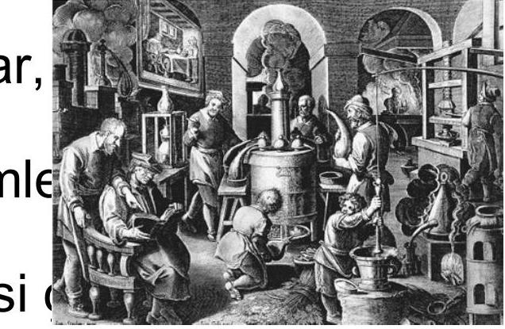

# İçindekiler
- [İş Sağlığı ve Güvenliğinin Kavram ve Kurallarının Gelişimi ve Güvenlik Kültürü](#i̇ş-sağlığı-ve-güvenliğinin-kavram-ve-kurallarının-gelişimi-ve-güvenlik-kültürü)
  - [1. İş Sağlığı ve Güvenliği Nedir?](#1-iş-sağlığı-ve-güvenliği-nedir)
  - [ILO ve WHO'ya Göre İş Sağlığı ve Güvenliği](#ilo-ve-whoya-göre-i̇ş-sağlığı-ve-güvenliği)
  - [İş Sağlığı ve Güvenliği Politikası:](#i̇ş-sağlığı-ve-güvenliği-politikası)
  - [2. İş Sağlığı ve Güvenliğinin Tarihçesi](#2-i̇ş-sağlığı-ve-güvenliğinin-tarihçesi)
    - [Taş Ocakları ve Madenlerde İSG](#taş-ocakları-ve-madenlerde-i̇sg)
    - [Dr. Bernardino Ramazzini (1633-1714)](#dr-bernardino-ramazzini-1633-1714)
  - [Sanayi Devrimi ve Sonrası](#sanayi-devrimi-ve-sonrası)
  - [Dünyada İSG ile İlgili İlk Yasal Düzenlemeler](#dünyada-i̇sg-ile-i̇lgili-ilk-yasal-düzenlemeler)
  - [3. İSG'nin Türkiye'deki Tarihsel Gelişimi](#3-isgnin-türkiyedeki-tarihsel-gelişimi)
    - [Osmanlı Döneminde İSG](#osmanlı-döneminde-i̇sg)
    - [Cumhuriyet Döneminde İSG](#cumhuriyet-döneminde-i̇sg)
  - [Günümüzde İSG ile İlgili Yasal Düzenlemeler:](#günümüzde-i̇sg-ile-i̇lgili-yasal-düzenlemeler)
    - [Ulusal Kuruluşlar:](#ulusal-kuruluşlar)
    - [Uluslararası Kuruluşlar:](#uluslararası-kuruluşlar)
  - [Dünya Sağlık Örgütü (WHO)](#dünya-sağlık-örgütü-who)
  - [Uluslararası Çalışma Örgütü (ILO)](#uluslararası-çalışma-örgütü-ilo)
    - [ILO Anayasası'nın Hedefleri](#ilo-anayasasının-hedefleri)
    - [ILO'nun 7 Temel Güvenlik Unsuru](#ilonun-7-temel-güvenlik-unsuru)
  - [3. Güvenlik Kültürü](#3-güvenlik-kültürü)
  - [Güvenlik Kültürü](#güvenlik-kültürü-1)
    - [Devletin Rolü:](#devletin-rolü)
    - [İşverenin Rolü:](#i̇şverenin-rolü)
    - [Çalışanların/Sendikaların Rolü:](#çalışanlarınsendikaların-rolü)
    - [Üniversitelerin Rolü:](#üniversitelerin-rolü)
    - [Meslek Örgütlerinin Rolü:](#meslek-örgütlerinin-rolü)
- [Temel Formüller ve Hızlı Bilgiler](#temel-formüller-ve-hızlı-bilgiler)
- [Kaynaklar](#kaynaklar)

# Genel Özet

Bu ders materyali, **İş Sağlığı ve Güvenliği (İSG)** disiplininin *temel kavramlarını*, tarihsel gelişimini ve günümüzdeki **güvenlik kültürü**nün önemini kapsamaktadır. Amacı, İSG'nin sadece bir yasal zorunluluk değil, aynı zamanda *insan hakkı* olduğu bilincini vurgulamak ve bu alandaki ulusal ve uluslararası çabaları tanıtmaktır. Materyal, İSG'nin tanımından başlayarak, eski çağlardan sanayi devrimine ve günümüze uzanan tarihsel sürecini, önemli yasal düzenlemeleri ve bu sürecin gelişiminde rol oynayan *kilit kurum ve kişileri* incelemektedir. Ayrıca, **güvenlik kültürünün** ne anlama geldiği ve bu kültürün oluşturulmasında devlet, işveren, çalışanlar, üniversiteler ve meslek örgütleri gibi *paydaşların rolleri* detaylı bir şekilde ele alınmaktadır.

Döküman, iş kazaları ve meslek hastalıkları gibi konuların tanımlanması, İSG politikalarının hedefleri ve başarısı için gerekli stratejileri sunmaktadır. ILO ve WHO gibi uluslararası kuruluşların İSG'ye yönelik katkıları ve **güvenlik kültürünün** temel unsurları üzerinde durulmaktadır. Öğrenci, bu materyal sayesinde İSG'nin *çok yönlü* doğasını, toplumsal ve ekonomik önemini, ayrıca güvenli bir çalışma ortamı sağlamanın *ortak sorumluluk* olduğunu kavrayacaktır.

# Temel Terimler ve Kavramlar

**İş Sağlığı:** Dünya Sağlık Örgütü (WHO) tanımına göre, bireyin bedenen, ruhen ve sosyal yönden tam bir iyilik hali içinde olmasıdır.
**İş Güvenliği:** Çalışanların, işyerindeki teknik özellik taşıyan risklere karşı korunmasını ifade eden kavramdır.
**İş Sağlığı ve Güvenliği (İSG):** İşyerlerinde işin yapılması ve yürütümü ile ilgili tehlikelerden korunmak ve daha iyi bir çalışma ortamı sağlamak için yapılan sistemli çalışmalardır.
**İş Kazası:** Önceden planlanmamış, yaralanmalara, makine ve teçhizat zararlarına veya üretimin durmasına yol açan olaylardır.
**Meslek Hastalığı:** İşin niteliğine veya yürütüm şartlarına göre tekrarlanan bir sebeple uğranılan geçici veya sürekli hastalık, sakatlık veya ruhi arıza halleridir.
**İSG Politikası:** Çalışanın yaşama hakkı ve sağlığını korumak için güvenli bir çalışma ortamı sağlamayı hedefleyen, riskleri tespit edip kontrol eden stratejiler bütünüdür.
**Güvenlik Kültürü:** Güvenliği veya emniyeti tehdit edebilecek davranış ve uygulamaları en aza indirmeyi amaçlayan, algı, inanç, tutum, kural ve sorumluluk hislerinin bütünüdür.
**Ramazzini:** "İş Sağlığının Kurucusu" veya "Babası" olarak bilinen, meslek hastalıklarını sistematik olarak inceleyen ilk bilim insanıdır.

# Ana Gövde: Kronolojik veya Tematik Kayıt

## 1. İş Sağlığı ve Güvenliği Nedir?

İş sağlığı ve güvenliği, çalışma ortamında bireylerin fiziksel, zihinsel ve sosyal refahını korumayı ve geliştirmeyi hedefleyen multidisipliner bir alandır.

**İş Sağlığı**: WHO tarafından sağlık, sadece hastalık ve sakatlığın olmayışı değil, aynı zamanda bedenen, ruhen ve sosyal yönden tam bir huzur ve iyilik halidir şeklinde tanımlanmaktadır.
**İş Güvenliği**: Daha çok işçinin teknik özellik taşıyan risklere karşı korunmasını ifade etmektedir.
**İş Sağlığı ve Güvenliği**: İşyerlerinde işin yapılması ve yürütümü ile ilgili olarak oluşan tehlikelerden ve sağlığa zarar verebilecek koşullardan korunmak ve daha iyi bir çalışma ortamı sağlamak için yapılan sistemli çalışmalardır.

## ILO ve WHO'ya Göre İş Sağlığı ve Güvenliği

*   Bütün mesleklerde çalışanların bedensel, ruhsal ve sosyal iyilik hallerinin korunması, geliştirilmesi ve en üst düzeyde sürdürülmesidir.
*   İşin insana ve işçinin kendi işine uyumunun sağlanmasıdır.

### Birleşmiş Milletlere Göre İş Sağlığı ve Güvenliği

*   İş sağlığı ve güvenliği bir insan hakkıdır.
*   Bu sözleşmenin taraf devletleri, herkesin adil ve elverişli çalışma koşullarında, özellikle güvenli ve sağlıklı ortamlarda çalışma hakkını tanırlar.
*   *B.M. Uluslararası Ekonomik, Sosyal ve Kültürel Haklar Sözleşmesi, 1975 (M. 7)*

İş kazası ve meslek hastalıkları: Kişinin çalıştığı iş dolayısıyla karşılaştığı tehlikelerle ilgili bir durumdur.

**İŞ KAZASI**: Önceden planlanmamış, çoğu zaman yaralanmalara, makine ve teçhizatın zarara uğramasına veya üretimin bir süre durmasına yol açan olaydır.
**MESLEK HASTALIĞI**: İşin niteliğine göre tekrarlanan bir sebeple veya işin yürütüm şartları yüzünden uğranılan geçici veya sürekli hastalık, sakatlık veya ruhi arıza halleri olarak tanımlanır.

## İş Sağlığı ve Güvenliği Politikası:

*   **Hedefi**: Çalışanın en temel hakkı olan, yaşama hakkı ve sağlığını korumak için güvenli bir çalışma ortamı sağlamaktır.
*   **Strateji**: Sağlığı bozucu faktörleri tespit etmek (bireysel özellikler, işyeri ortam faktörleri), bu faktörleri kontrol etmek ve olumsuz faktörleri olumlu hale getirmektir.

### İş Sağlığı ve Güvenliği Politikasının Başarılı Olması için Yapılması Gerekenler:

İSG çalışmalarında, çalışanları iş yerinin olumsuz etkilerinden ve doğabilecek hastalıklardan koruyarak, rahat, güvenli ve huzurlu bir ortamda çalışmalarının sağlanması amaçlanmaktadır.
*   Devlet, işçi ve işverenin üçlü katılımı sağlanmalı.
*   Ulusal kalkınma hedefleri ile uyumlu olmalı.
*   İlgili mevzuat hazırlanmalı.
*   Kurumsal ve mali kaynak olmalı.
*   Taraflar ve toplum bilgilendirilmeli.
*   Gönüllü katılım özendirilmeli ve sürekli gözden geçirilmelidir.

Çalışana yönelik iş güvenliğinin temelini 3 unsur oluşturur:
1.  **Çalışanların korunması**: İSG çalışmalarında asıl amacı oluşturur.
2.  **İletişim Güvenliği**: İşyerinin çalışma şartlarına uygun şekilde düzenlenmiş, yapılan işe göre gerekli güvenlik önlemlerinin alınmış olması halidir.
3.  **Üretim Güvenliği**: İş yerinde üretilen maddelerin satışının devamlı olması, ürünün de çalışana ve topluma zarar vermeyecek şekilde muhafaza edilmesidir.

## 2. İş Sağlığı ve Güvenliğinin Tarihçesi

İlk çağlarda insanlar karınlarını doyurmak, barınmak gibi temel ihtiyaçları için çalışmışlardır. Bu dönemde kaza ve yaralanmalar çalışma hayatının ana tehlikesi olarak gündeme gelmemiştir.

### Taş Ocakları ve Madenlerde İSG

Daha sonraları ihtiyaçlarını temin etmek için topraktan taş ve kıymetli madenleri çıkarttılar.
Madenciliğin başlaması ile İSG konuları arttı. Madencilik eski çağlardan beri tehlikeli bir iş türü olarak bilinmektedir. Eski çağlarda tehlikeli olan işlerde esirler, köleler ve suçlular çalıştırılıyordu. Hastalanan, kaza geçiren ve ölenlerin yerlerine başkaları bulunabiliyordu. Bu nedenle çalışanların hastalanması veya ölmesi toplumun ilgisini çekmiyordu.

*   **Eski Mısır**: Mimar-mühendis olan İmhotep (M.Ö. 2780), piramitlerin yapımı esnasında meydana gelen kazalarda çok sayıda ölüme ve çalışanlarda bel incinmelerine işaret etmiştir.
*   **Hipokrat (M.Ö. 460-370)**: Kurşun zehirlenmesi gibi çevre faktörlerine dikkat çekti.
*   **Platon (Eflatun) (M.Ö. 428-348)**: Çalışma koşullarından kaynaklanan sorunlara değindi.
*   **Aristo (M.Ö. 384-322)**: Koşucularda gözlediği sorunlara ve Gladyatörlerin beslenmelerine dikkat çekti.
*   **Romalı Pliny (M.S. 23-79)**: Tozlu yerlerde çalışmanın risklerini belirtti.
*   **Juvenal (M.S. 60-140)**: Ayakta çalışanlarda varis oluşumuna ve demircilerdeki göz rahatsızlıklarına vurgu yaptı.
*   **Yunan (Pergamon'lu) Dr. Galen (M.S. 130-201)**: Hipokrat tarafından da tanımlanan hastalıklara dikkat çekti.

### Dr. Bernardino Ramazzini (1633-1714)

*   İlk işyeri hekimi oldu.
*   Hastalara mesleğini sorarak ve ayrıntılı çalışma öyküsü alarak iş ve hastalık ilişkisini sorguladı.
*   `De Morbis Artificum Diatriba` (Çalışanların Hastalıkları) adlı kitabında meslek hastalıklarını sistematik olarak ele aldı.
*   **İş Sağlığının Kurucusu – "Babası"** olarak anılır.
*   1986'da Japonya'da açılan İş ve Çevre Sağlığı Üniversitesinin bahçesine heykeli dikildi ve konferans salonuna adı verildi.

---

## Sanayi Devrimi ve Sonrası

1761'de buharın keşfiyle fabrikalar oluştu. Tarımda çalışanlar fabrikalara yöneldi. Göçlerle birlikte aileler parçalandı, sağlıksız koşullarda barınma, yetersiz beslenme, uzun süre çalışma, aşırı yorgunluk ve olumsuz çevre koşulları (salgın hastalıklar, iş kazaları ve meslek hastalıkları) çalışan sağlığının bozulmasına ve ölümlere yol açtı. İSG, toplumsal bir sorun olarak toplumun ilgisini çekmeye başladı.

Bu dönemde kurşun zehirlenmesi, civa zehirlenmesi, akciğer hastalıkları gibi meslek hastalıkları yaygın olarak görüldü.

## Dünyada İSG ile İlgili İlk Yasal Düzenlemeler

*   **1802 İngiltere**: Çıraklara yönelik (Health and Morals of Apprentices Act) ilk yasal düzenleme yapıldı. Çalışma süresi 12 saat/gün, 58 saat/hafta olarak sınırlandı.
*   **1833 İngiltere**: Çıkarılan yasa ile en küçük çalışma yaşı 10 oldu ve doktor raporu (işe giriş muayenesi) getirildi.
*   **1847 İngiltere**: İşyeri denetimi yasalaştı ve iş müfettişliği (fabrika denetçiliği) kuruldu.
*   Sanayinin gelişimiyle paralel olarak, İngiltere dahil pek çok ülkede bu konuda yasal düzenlemeler yapıldı:
    *   1819-1891 İngiltere
    *   1839 Almanya
    *   1840 İsviçre
    *   1841 Fransa
    *   1877 A.B.D.
*   Rusya'daki Bolşevik İhtilali, gelişmiş ülkelerin çalışanların sorunlarına eğilmelerine neden oldu.

## 3. İSG'nin Türkiye'deki Tarihsel Gelişimi

### Osmanlı Döneminde İSG

Osmanlı döneminde sosyal güvenlik, ahilik, loncalar ve vakıflar vasıtasıyla sağlanmaya çalışılmıştır.
*   Gümüşhane, Ergani gibi madenlerdeki çalışmalar ve 1829'da Ereğli'de bulunan kömür madeni ile ilgili **1867'de Dilaver Paşa Nizamnamesi** ve **1869'da Maaddin Nizamnamesi** çalışma koşulları, yatakhane, çalışma süresi, ücret gibi sosyal hayatı düzenleyen ilk belgelerdir.
*   **1871'de kurulan Ameleperver Cemiyeti**: Tekstil, gıda, kağıt işkolu işçilerinin çalışma koşullarının iyileşmesi için çalıştı.
*   **1895'de Osmanlı Amele Yardımlaşma Cemiyeti**: Tophane işçilerinin çalışma koşullarının iyileşmesi için çalışmalar yaptı.

### Cumhuriyet Döneminde İSG

*   İlk önlem 1921 yılında alınmıştır. En önemli enerji kaynağı kömür (Zonguldak ve Ereğli Kömür Havzası) olduğundan, maden işçilerinin ağır çalışma şartlarında sağlık, sosyal ve ekonomik durumları göz önünde bulundurularak yasalar çıkarılmıştır.
*   Hafta Tatili Yasası çıkarılmıştır.
*   Borçlar Yasası
*   Umumi Hıfzısıhha ve Belediyeler Yasası
*   3008 sayılı İş Yasası

## Günümüzde İSG ile İlgili Yasal Düzenlemeler:

*   **4857 sayılı İş Kanunu** (22.05.2003)
*   **5502 sayılı Sosyal Güvenlik Kurumu Kanunu** (16.05.2006)
*   **5510 sayılı Sosyal Sigortalar ve Genel Sağlık Sigortası Kanunu** (31.05.2006)
*   **6331 sayılı İş Sağlığı ve Güvenliği Kanunu** (20.06.2012)

### Ulusal Kuruluşlar:

*   Çalışma ve Sosyal Güvenlik Bakanlığı (ÇSGB)
*   İş Sağlığı ve Güvenliği Genel Müdürlüğü (İSGGM)
*   İş Sağlığı ve Güvenliği Merkezi Müdürlüğü (İSGÜM)
*   İş Teftiş Kurulu Başkanlığı (İTK)
*   Çalışma ve Sosyal Güvenlik Bakanlığı Eğitim Merkezi (ÇASGEM)
*   Sosyal Güvenlik Kurumu (SGK)
*   Sağlık Bakanlığı
*   İşçi ve İşveren Kuruluşları
*   Üniversiteler
*   Mesleki Örgütler

### Uluslararası Kuruluşlar:

*   İSG konusunda Birleşmiş Milletlere (BM) bağlı kuruluşlar
*   Uluslararası Çalışma Örgütü (ILO)
*   Dünya Sağlık Örgütü (WHO)
*   İş Sağlığı ve Güvenliği Ajansı (OSHA-USA ve OSHA-EU)
*   BM Çevre Programı (UNEP)
*   Uluslararası Atom Enerjisi Ajansı
*   BM Kalkınma Programı (UNDP)
*   BM Sanayii Geliştirme Örgütü (UNIDO)

## Dünya Sağlık Örgütü (WHO)

*   Sağlık alanında uluslararası nitelik taşıyan çalışmalarda yönetici ve koordinatör makam sıfatıyla hareket etmek.
*   BM, İhtisas Kuruluşları, sağlık idareleri, meslek grupları ve uygun görülecek diğer örgütlerle fiili bir işbirliği kurmak ve sürdürmek.
*   Devletlere, istek üzerine, sağlık hizmetlerinin güçlendirilmesi için yardım yapmak.
*   Uygun teknik yardım yapmak ve acil durumlarda, devletlerin istekleri ya da kabulleri ile gereken yardımı yapmak.
*   BM'in isteği üzerine, manda altındaki ülkeler halkı gibi özelliği olan topluluklara sağlık hizmetleri götürmek ve acil yardımlar yapmak ya da bunların sağlanmasına yardım etmek.
*   Epidemiyoloji ve istatistik hizmetleri de dahil olmak üzere gerekli görülecek idari ve teknik hizmetleri kurmak ve sürdürmek.
*   Epidemik (bölgesel) ve pandemik (dünya çapında) hastalıkların ortadan kaldırılması yolundaki çalışmaları teşvik etmek ve geliştirmek.
*   Gerektiğinde diğer İhtisas Kuruluşları ile işbirliği yaparak kazalardan doğan zararları önleyebilecek önlemlerin alınmasını teşvik etmek.

## Uluslararası Çalışma Örgütü (ILO)

### ILO Anayasası'nın Hedefleri

*   İstihdam ve işsizliğin önlenmesi
*   Çalışma saatlerinin düzenlenmesi
*   Uygun asgari ücret
*   İş dışındaki hastalık ve kazalardan korunma
*   Çocukların, gençlerin ve kadınların korunması
*   Yaşlılıkta ve maluliyette koruma
*   Göçmen işçilerin haklarının korunması
*   Eşit işe eşit ücret
*   Örgütlenme özgürlüğü
*   Mesleki eğitim ve sürekli eğitim

### ILO'nun 7 Temel Güvenlik Unsuru

1.  **İş piyasası güvencesi**: Devlet güvencesinde, tam istihdam yoluyla uygun istihdam olanakları.
2.  **İstihdam güvencesi**: Keyfi işten çıkarmaya karşı koruma, işe alma ve işten çıkarmayla ilgili düzenlemeler, mali yükün işverence karşılanması.
3.  **İş güvencesi**: Kişinin mesleğinin, beceri alanının veya kariyerinin korunması.
4.  **Beceri geliştirme güvencesi**: Çıraklık ve iş eğitimi yoluyla, yaygın beceri kazanma ve sürdürme olanağı.
5.  **Çalışma güvenliği**: Tüm işçiler için işyerinde sağlık ve güvenlik düzenlemeleri, çalışma saatlerinin sınırlandırılması, uygun olmayan saatlerde çalışma ve gece işinin kısıtlanması yoluyla kaza ve hastalıklardan korunma.
6.  **Temsil güvencesi**: Devletin işlerine ekonomik ve politik olarak katılmış bağımsız sendikalar, işveren örgütleri ile iş piyasasında ortak sesin varlığının korunması.
7.  **Gelir güvencesi**: Asgari ücret, ücret ayarlamaları, kapsamlı sosyal güvence, vergilerin gelire göre ayarlanması ve gelirin korunması.

## 3. Güvenlik Kültürü

Güvenlik, yapılan işin ve/veya çalışma şartlarının zarar ve/veya tehlike içermeme durumudur. Güvenliği sağlamanın üç ana kuralı vardır:
1.  Güvenliği ve sağlığı tehdit eden durumların ortadan kaldırılması.
2.  Güvenliği ve sağlığı tehdit eden gelişmelerin zamanında saptanması.
3.  Önlenemeyen durumların kötü sonuçlarının asgariye indirilmesi (*riskin asgariye indirilmesi*).

Güvenliğin sağlanamaması = İş kazası

## Güvenlik Kültürü

Güvenlik kültürü, güvenliği veya emniyeti tehdit edebilecek davranış veya uygulamalarla, bunların yer aldığı ortak kullanım ya da etki alanında bulunan canlıların veya araç gereç gibi nesnelerin zararını en aza indirmeyi amaçlayan, güvenlik ve emniyete öncelik veren, algı, inanç, tutum, kural, roller, sosyal, teknik ve politik uygulamalarla yetkinlik ve sorumluk hislerinin bütünüdür.

Güvenlik kültürünün oluşturulmasında paydaşlar:
*   Devlet
*   İşveren
*   Çalışanlar/Sendikalar
*   Üniversiteler
*   Meslek örgütleri

### Devletin Rolü:

Daha çok gözlemci, aydınlatıcı, teşvik edici ve arabuluculuk yapmak, gerekli koşul ve standartları mevzuatla düzenlemek, denetimi sağlamak ve devlet politikası olarak benimsenmesini sağlamaktır.
*   Kayıt dışı istihdamın önlenmesi, çocuk işçiliğinin yok edilmesi.
*   Cinsiyet ayrımcılığının yok edilmesi, sosyal güvenliğin desteklenmesi.
*   Gelir dağılımı adaletsizliğinin azaltılması, yaşanabilir bir asgari ücretin saptanması.
*   İşyerinde çalışan işçi sayısına bakılmaksızın, her çalışanın İSG hizmetlerinden yararlanmasının sağlanması.
*   Kamu sağlık hizmetlerinin düzenlenmesi, güvenilir bir kayıt sistemi kurulması.
*   Hekim iş müfettişi istihdamı, iş kazalarının "Bilimsel" analizi.
*   İşçi Sağlığı Enstitülerinin kurulması/yaygınlaştırılması, yasalarda çalışanların korunması.
*   **Toplumda, güvenlik kültürü bilincini oluşturmak ve yaygınlaştırmak.**
*   İş sağlığı ve güvenliği ile ilgili paydaşlar (işveren, çalışanlar vb.) arasında sosyal diyaloğu sağlamak.
*   İş sağlığı ve güvenliği sistemi ile ilgili toplumda ve işletmelerde **eğitim ve danışmanlık hizmetleri vermek**. Eğitim konusunda Milli Eğitim Bakanlığı ve Üniversiteler ile işbirliği yapmak.
*   İş sağlığı ve güvenliği konusunda, araştırmaları teşvik etmek.
*   İş sağlığı ve güvenliği konusunda iş sağlığı hizmetleri ile ilgili sağlık ve güvenlik altyapısını iyileştirmektir.

### İşverenin Rolü:

Öncelikle iş kazaları ve meslek hastalıklarını önlemek için;
*   Üretim süreçlerinde, önce verimlilik yerine, *önce insan* yaklaşımının benimsetilmesi.
*   Risk değerlendirmesi ve risk yönetimi yaklaşımının benimsetilmesi.
*   İşyerinde çalışan işçi sayısına bakılmaksızın, her çalışanın İSG hizmetlerinden yararlanmasının sağlanması.
*   İşyeri sağlık ve güvenlik birimlerinin desteklenmesi.
*   İlk ve acil yardım hizmetlerinin organizasyonu.
*   Çalışanların eğitimi.
*   Veri akışının sağlanması.
*   İş kazalarının "Bilimsel" analizi.
*   İşçilerin kişisel koruyucu donanımları uygun şekilde kullanmaları için her türlü önlemin alınması, teknik gelişimlere uyum sağlanması, toplu ve kişisel korunma önlemlerine öncelik verilmesi, işçilere uygun talimatların verilmesi, işçilerin bilgilendirilmesi ve görüşlerinin alınması işverenin sorumluluğudur.
*   *İşveren veya temsilcileri, iş sağlığı faaliyetlerini sadece yasal yükümlülükten kurtulmak için yaptıklarında iş sağlığı ve güvenliği konusunda başarı sağlanamayacaktır. İş sağlığı ve güvenliği konusunda yapılan çalışmaların kalite için birer yatırım olduğu unutulmamalıdır.*

### Çalışanların/Sendikaların Rolü:

Yasa ve yönetmeliklerde belirlenen, çalışanların sorumlulukları; "işveren tarafından alınan her türlü tedbire riayet etmek ve talimatlara uymaktır" şeklinde belirtilmektedir.
Bu kapsamda çalışanların;
*   Makine, cihaz ve ekipmanları doğru şekilde kullanmaları.
*   İşyerinde İSG ile ilgili her türlü olumsuz durumu işverene bildirmeleri, işveren, sağlık ve güvenlik işçi temsilcisi ve diğer çalışanlarla İSG konusunda işbirliği yapmaları ve güvensiz durumlardan kaçınmaları, sağlıklı ve güvenli bir çalışma ortamının tesisi için, işyerinde düzenlenecek İSG eğitimlerine katılmaları uygundur.
*   İşyeri, iş kolu ve üretim süreci ile ilgili bilgi sahibi olunması.
*   Risk değerlendirmesi ve risk yönetimi süreçlerine katılım.
*   İş kazalarının "Bilimsel" analizi.
*   İş güvenliğinin yaşamın önceliği biçimine getirilmesine yönelik etkinlikler.
*   Kişisel koruyucu ekipmanın kuralına uygun biçimde kullanılması.

### Üniversitelerin Rolü:

*   İSG - Sosyal politikalara bilimsel katkı sağlamak.
*   Güvenilir bir kayıt sistemi kurulmasına bilimsel altyapı sağlamak.
*   İş kazalarının "Bilimsel" analizi.
*   İşçi sağlığı ve iş güvenliği alanında çalışacak insan gücünün temel eğitimi.
*   İşçi sağlığı ve iş güvenliği alanında çalışacak insan gücünün mezuniyet sonrası sürekli eğitimine katkı.
*   İSG ile ilgili araştırmalar, laboratuvarlar ve İSG ile ilgili akademik ortamın oluşturulmasıdır.

### Meslek Örgütlerinin Rolü:

*   İSG - Sosyal politikalara katkı sağlamak.
*   İSG alanında çalışacak insan gücünün yetiştirilmesi ve istihdam edilmesi süreçlerine katkı.
*   İSG alanında çalışacak insan gücünün mezuniyet sonrası sürekli eğitiminin organizasyonu.
*   İş kazalarının "Bilimsel" analizine katkı sağlamaktır.

# Temel Formüller ve Hızlı Bilgiler

>[!example]+ İSG Temel Unsurları
>
>- **Çalışanların Korunması**: *İSG'nin birincil amacıdır.*
>- **İletme Güvenliği**: *Çalışma ortamının uygunluğu ve güvenlik önlemleri.*
>- **Üretim Güvenliği**: *Üretimin ve ürünün çalışan/toplum sağlığına zarar vermemesi.*
>
>---
>
>- **İSG Politika Başarısı için Temel Şart**: *Devlet, işçi ve işveren üçlü katılımı.*
>
>---
>
>- **Güvenliği Sağlamanın Üç Ana Kuralı**:
>  1.  Tehdit edici durumları ortadan kaldırma.
>  2.  Gelişmeleri zamanında saptama.
>  3.  Önlenemeyen durumların kötü sonuçlarını asgariye indirme (*risk azaltma*).

---

>[!note] Anahtar Yasal Düzenlemeler (Türkiye)
>- **6331 sayılı İş Sağlığı ve Güvenliği Kanunu**: *İSG alanındaki en temel ve güncel yasa (2012).*
>
>---
>
>- **Dilaver Paşa Nizamnamesi (1867)**: *Osmanlı'daki ilk organize çalışma hayatı düzenlemelerinden biri, maden işçilerini kapsar.*
>- **Maaddin Nizamnamesi (1869)**: *Madencilikle ilgili ikinci önemli düzenleme.*

---

>[!success] İSG'de "Babalar" ve İlkler
>- **Dr. Bernardino Ramazzini**: *İş Sağlığının Kurucusu/Babası. Meslek hastalıklarını sistematik inceleyen ilk kişi.*
>- **1802 İngiltere**: *İlk yasal İSG düzenlemesi ("Health and Morals of Apprentices Act"). Çırak çalışma sürelerini sınırlandırdı.*

# Kaynaklar
Kaynak bulunamadı.
