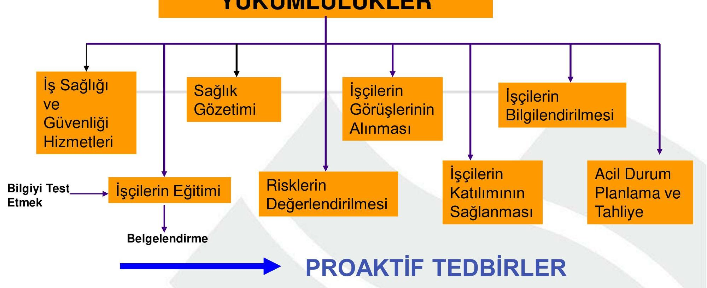

# İçindekiler
- [Genel Özet](#genel-özet)
- [Temel Terimler ve Kavramlar](#temel-terimler-ve-kavramlar)
- [Ana Gövde: Kronolojik veya Tematik Kayıt](#ana-gövde-kronolojik-ve-tematik-kayıt)
  - [Yeni İSG Kanunu](#yeni-isg-kanunu)
  - [İSG Kanunu Neler Getiriyor?](#isg-kanunu-neler-getiriyor)
  - [Yükümlülükler](#yükümlülükler)
  - [AB Direktiflerinde Temel Prensipler](#ab-direktiflerinde-temel-prensipler)
    - [Eski Yaklaşım](#eski-yaklaşım)
    - [Yeni Yaklaşım (Risk Odaklı)](#yeni-yaklaşım-risk-odaklı)
  - [Birinci Bölüm](#birinci-bölüm)
    - [Amaç](#amaç)
    - [Kapsam ve İstisnalar](#kapsam-ve-i̇stisnalar)
  - [Tanımlar](#tanımlar)
  - [İşverenin Yükümlülükleri](#i̇şverenin-yükümlülükleri)
  - [Risklerden Korunma İlkeleri](#risklerden-korunma-i̇lkeleri)
  - [İş Sağlığı ve Güvenliği Hizmetleri](#i̇ş-sağlığı-ve-güvenliği-hizmetleri)
  - [İş Sağlığı ve Güvenliği Hizmetlerinin Desteklenmesi](#i̇ş-sağlığı-ve-güvenliği-hizmetlerinin-desteklenmesi)
  - [İşyeri Hekimleri ve İş Güvenliği Uzmanları](#i̇şyeri-hekimleri-ve-i̇ş-güvenliği-uzmanları)
  - [Tehlike Sınıfının Belirlenmesi](#tehlike-sınıfının-belirlenmesi)
  - [Risk Değerlendirmesi, Kontrol, Ölçüm ve Araştırma](#risk-değerlendirmesi-kontrol-ölçüm-ve-araştırma)
  - [Acil Durum Planları, Yangınla Mücadele ve İlk Yardım](#acil-durum-planları-yangınla-mücadele-ve-i̇lk-yardım)
  - [Tahliye](#tahliye)
  - [Çalışmaktan Kaçınma Hakkı](#çalışmaktan-kaçınma-hakkı)
  - [İş Kazası ve Meslek Hastalıklarının Kayıt ve Bildirimi](#i̇ş-kazası-ve-meslek-hastalıklarının-kayıt-ve-bildirimi)
  - [Sağlık Gözetimi](#sağlık-gözetimi)
  - [Çalışanların Bilgilendirilmesi](#çalışanların-bilgilendirilmesi)
  - [Çalışanların Eğitimi](#çalışanların-eğitimi)
  - [Çalışanların Görüşlerinin Alınması ve Katılımlarının Sağlanması](#çalışanların-görüşlerinin-alınması-ve-katılımlarının-sağlanması)
  - [Çalışanların Yükümlülükleri](#çalışanların-yükümlülükleri)
  - [Çalışan Temsilcisi](#çalışan-temsilcisi)
  - [Üçüncü Bölüm](#üçüncü-bölüm)
    - [Konsey, Kurul ve Koordinasyon](#konsey-kurul-ve-koordinasyon)
    - [Ulusal İş Sağlığı ve Güvenliği Konseyi](#ulusal-i̇ş-sağlığı-ve-güvenliği-konseyi)
  - [İş Sağlığı ve Güvenliği Kurulu](#i̇ş-sağlığı-ve-güvenliği-kurulu)
    - [Kurulun Oluşumu:](#kurulun-oluşumu)
    - [Kurul Üyelerinin Eğitimleri](#kurul-üyelerinin-eğitimleri)
    - [Kurulun Görev ve Yetkileri](#kurulun-görev-ve-yetkileri)
  - [İş Sağlığı ve Güvenliğinin Koordinasyonu](#i̇ş-sağlığı-ve-güvenliğinin-koordinasyonu)
  - [Dördüncü Bölüm](#dördüncü-bölüm)
    - [Teftiş ve İdari Yaptırımlar](#teftiş-ve-i̇dari-yaptırımlar)
    - [Teftiş, İnceleme, Araştırma, Müfettişin Yetki, Yükümlülük ve Sorumluluğu](#teftiş-i̇nceleme-araştırma-müfettişin-yetki-yükümlülük-ve-sorumluluğu)
  - [İşin Durdurulması](#i̇şin-durdurulması)
  - [MADDE 25/A (4/4/2015)](#madde-25a-442015)
  - [İdari Para Cezaları ve Uygulanması](#i̇dari-para-cezaları-ve-uygulanması)
  - [Beşinci Bölüm](#beşinci-bölüm)
    - [Bağımlılık Yapan Maddeleri Kullanma Yasağı](#bağımlılık-yapan-maddeleri-kullanma-yasağı)
    - [Güvenlik Raporu veya Büyük Kaza Önleme Politika Belgesi](#güvenlik-raporu-veya-büyük-kaza-önleme-politika-belgesi)
  - [İş Sağlığı ve Güvenliği ile İlgili Çeşitli Yönetmelikler](#i̇ş-sağlığı-ve-güvenliği-ile-i̇lgili-çeşitli-yönetmelikler)
  - [Yayın Zorunluluğu](#yayın-zorunluluğu)
  - [Geçici Maddeler](#geçici-maddeler)
    - [İş Güvenliği Uzmanı Görevlendirme Yükümlülüğü](#i̇ş-güvenliği-uzmanı-görevlendirme-yükümlülüğü)
  - [Özet](#özet)
- [Temel Formüller ve Hızlı Bilgiler](#temel-formüller-ve-hızlı-bilgiler)
- [Kaynakça](#kaynakça)

# Genel Özet

Bu çalışma, Dr. Öğr. Üyesi Umut Özkaya tarafından hazırlanan 6331 sayılı İş Sağlığı ve Güvenliği Kanunu'nu detaylı bir şekilde incelemektedir. Kanun, *iş kazası ve meslek hastalıklarının meydana gelmeden önlenmesi* felsefesini esas alarak, çalışma hayatında **tazmin kültürü yerine önleme kültürünü** merkezine oturtmayı hedeflemektedir. Tüm çalışanları kapsayıcı bir yaklaşımla, işveren ve çalışanların görev, yetki, sorumluluk, hak ve yükümlülüklerini düzenlemekte, ayrıca **risk değerlendirmesi, acil durum planlaması ve sağlık gözetimi** gibi kritik uygulamaları zorunlu kılmaktadır. Belge, kanunun temel mantığını, getirdiği yenilikleri, işveren ve çalışan yükümlülüklerini, idari yaptırımları ve İSG hizmetlerinin desteklenmesi gibi önemli başlıkları kapsamaktadır.

# Temel Terimler ve Kavramlar

**Bakanlık**: Çalışma ve Sosyal Güvenlik Bakanlığı'nı ifade eder.
**Çalışan**: Kendi özel kanunlarındaki statülerine bakılmaksızın kamu veya özel işyerlerinde istihdam edilen gerçek kişidir.
**Çalışan Temsilcisi**: İş sağlığı ve güvenliği çalışmalarına katılma, izleme, tedbir alınmasını isteme ve tekliflerde bulunma yetkisine sahip çalışandır.
**İş Kazası**: İşyerinde veya işin yürütümü nedeniyle meydana gelen, ölüme veya vücut bütünlüğünde özre yol açan olayı tanımlar.
**İşveren**: Çalışan istihdam eden gerçek veya tüzel kişi yahut tüzel kişiliği olmayan kurum ve kuruluşlarıdır.
**İSG**: İş Sağlığı ve Güvenliği'nin kısaltmasıdır.
**Meslek Hastalığı**: Mesleki risklere maruziyet sonucu ortaya çıkan hastalığı ifade eder.
**Önleme**: İşyerinde iş sağlığı ve güvenliği ile ilgili riskleri ortadan kaldırmak veya azaltmak için planlanan tüm tedbirlerdir.
**Risk**: Tehlikeden kaynaklanacak kayıp, yaralanma ya da başka zararlı sonuç meydana gelme ihtimalidir.
**Risk Değerlendirmesi**: İşyerindeki tehlikelerin belirlenmesi, risklerin analiz edilerek derecelendirilmesi ve kontrol tedbirlerinin kararlaştırılması çalışmalarınıdır.
**Tehlike**: İşyerinde var olan ya da dışarıdan gelebilecek, çalışanı veya işyerini etkileyebilecek zarar veya hasar verme potansiyelidir.
**Ortak Sağlık ve Güvenlik Birimi (OSGB)**: İşyerlerine İSG hizmetlerini sunmak üzere Bakanlıkça yetkilendirilmiş birimdir.

# Ana Gövde: Kronolojik veya Tematik Kayıt

## Yeni İSG Kanunu

6331 sayılı Yeni İş Sağlığı ve Güvenliği (İSG) Kanunu, iş kazası ve meslek hastalığı gibi olumsuz durumlar yaşanmadan *önleyici tedbirlerin* alınmasını esas alır. Temel amaç, **tazmin kültürü yerine önleme kültürünün** çalışma hayatında yerleşmesini sağlamaktır. Bu kanun, tüm çalışanların sağlık ve güvenliklerinin eğitim ve bilgilendirme yükümlülükleri ile güvence altına alınmasını düzenler.

>[!note]
>Kanun koyucu, İSG kültürünün oluşumunda temel etken olan _eğitim ve bilgilendirmenin görsel medya ile de desteklenmesini_ amaçlamış, bu doğrultuda İSG'ye ilişkin öğretici ve eğitici programları zorunlu kılmıştır.

## İSG Kanunu Neler Getiriyor?

Kanunun getirdiği başlıca yenilikler şunlardır:

*   **Amaç**: Sağlıklı ve güvenli işyerleri kurmak.
*   **Kapsam**: Kamu ve özel sektör ayrımı olmaksızın tüm çalışanları İSG şemsiyesi altına almak.
*   **İSG Hizmet Sunumu**: Çalışan sayısı ve tehlike durumuna bakılmaksızın İSG hizmeti sunma zorunluluğu.
*   **Risk Değerlendirmesi**: Her işyerinde risk değerlendirmesi yapma veya yaptırma mecburiyeti.
*   **Ortam Ölçüm ve Analiz**: Çalışma ortamına yönelik ölçüm ve analizlerin yapılmasının zorunlu hale getirilmesi.
*   **Tehlike Sınıfları**: İşyerlerinin az tehlikeli, tehlikeli ve çok tehlikeli olarak sınıflandırılması.
*   **Küçük İşyerlerine Destek**: 1-9 arası çalışana sahip işyerlerine İSG hizmeti için finansal destek sağlanması.
*   **Çalışan Temsilcisi**: Çalışanlar arasından seçim veya atama ile çalışan temsilcisi belirlenmesi.
*   **Çalışan Katılımı**: Çalışanların İSG konularında görüş bildirme ve katılımının sağlanması.
*   **Destek Elemanı**: Çalışanlar arasından İSG ile ilgili önleme, koruma vb. görevler için destek elemanı atanması.
*   **Toplu İşyerlerinde Koordinasyon**: Toplu işyerlerinde İSG yönünden koordinasyonun sağlanması.
*   **Asıl-Alt İşveren Koordinasyonu**: Asıl ve alt işveren arasındaki İSG Kurulu ve koordinasyonunun düzenlenmesi.
*   **İşin Durdurulması**: Hayati tehlike durumlarında işin durdurulması yetkisi.
*   **Güvenlik Raporu**: Büyük endüstriyel tesislere güvenlik raporu hazırlama zorunluluğu.

## Yükümlülükler

İSG Kanunu kapsamında çeşitli tarafların yükümlülükleri detaylı bir şekilde belirlenmiştir.

## AB Direktiflerinde Temel Prensipler

İSG Kanunu, Avrupa Birliği direktiflerindeki temel prensiplere uygun olarak hazırlanmıştır. Bu direktifler, risk odaklı ve önleyici bir yaklaşımı benimsemiştir.

### Eski Yaklaşım

*   Olmuş olan olayla ilgilenir (reaktif).
*   *Tazmin eden yaklaşım* içerir.
*   Güvensiz koşulları ihmal eder.
*   Sadece koruma anlayışı hakimdir.

### Yeni Yaklaşım (Risk Odaklı)

*   Çalışan katılımı ve **risk analizi** yapılmasını şart koşar.
*   Bir organizasyondaki *güvensiz koşulların belirlenmesini* ister.
*   **Önleme ve koruma** odaklıdır.

## Birinci Bölüm

### Amaç
MADDE 1- (1) Bu Kanunun amacı; işyerlerinde iş sağlığı ve güvenliğinin sağlanması ve mevcut sağlık ve güvenlik şartlarının iyileştirilmesi için işveren ve çalışanların görev, yetki, sorumluluk, hak ve yükümlülüklerini düzenlemektir.

### Kapsam ve İstisnalar
MADDE 2- Kamu ve özel sektöre ait bütün işlere ve işyerlerine, bu işyerlerinin işverenleri ile işveren vekillerine, çırak ve stajyerleri de dahil olmak üzere tüm çalışanlarına faaliyet konularına bakılmaksızın uygulanır.

>[!note]+ İstisnalar
>Aşağıda belirtilen faaliyetler ve kişiler hakkında bu Kanun hükümleri uygulanmaz:
>a) Fabrika, bakım merkezi, dikimevi ve benzeri işyerindekiler hariç Türk Silahlı Kuvvetleri, genel kolluk kuvvetleri ve Milli İstihbarat Teşkilatı Müsteşarlığının faaliyetleri.
>b) Afet ve acil durum birimlerinin müdahale faaliyetleri.
>c) Ev hizmetleri.
>d) Çalışan istihdam etmeksizin kendi nam ve hesabına mal ve hizmet üretimi yapanlar.
>e) Hükümlü ve tutuklulara yönelik infaz hizmetleri sırasında, iyileştirme kapsamında yapılan işyurdu, eğitim, güvenlik ve meslek edindirme faaliyetleri.

## Tanımlar
MADDE 3- (1) Bu Kanunun uygulanmasında şu tanımlar geçerlidir:

*   **Bakanlık**: Çalışma ve Sosyal Güvenlik Bakanlığı'nı.
*   **Çalışan**: Kendi özel kanunlarındaki statülerine bakılmaksızın kamu veya özel işyerlerinde istihdam edilen gerçek kişiyi.
*   **Çalışan temsilcisi**: İş sağlığı ve güvenliği ile ilgili çalışmalara katılma, çalışmaları izleme, tedbir alınmasını isteme, tekliflerde bulunma ve benzeri konularda çalışanları temsil etmeye yetkili çalışanı.
*   **Destek elemanı**: Asli görevinin yanında iş sağlığı ve güvenliği ile ilgili önleme, koruma, tahliye, yangınla mücadele, ilk yardım ve benzeri konularda özel olarak görevlendirilmiş uygun donanım ve yeterli eğitime sahip kişiyi.
*   **Eğitim kurumu**: İş güvenliği uzmanı, işyeri hekimi ve diğer sağlık personelinin eğitimlerini vermek üzere Bakanlıkça yetkilendirilen kamu kurum ve kuruluşlarını, üniversiteleri ve Türk Ticaret Kanunu'na göre faaliyet gösteren şirketler tarafından kurulan müesseseleri.
*   **Genç çalışan**: On beş yaşını bitirmiş ancak on sekiz yaşını doldurmamış çalışanı.
*   **İş güvenliği uzmanı**: İş sağlığı ve güvenliği alanında görev yapmak üzere Bakanlıkça yetkilendirilmiş, iş güvenliği uzmanlığı belgesine sahip müfettişler, mühendislik veya mimarlık eğitimi veren fakültelerin mezunları ile teknik elemanı.
*   **İş kazası**: İşyerinde veya işin yürütümü nedeniyle meydana gelen, ölüme sebebiyet veren veya vücut bütünlüğünü ruhen ya da bedenen özre uğratan olayı.
*   **İşveren**: Çalışan istihdam eden gerçek veya tüzel kişi yahut tüzel kişiliği olmayan kurum ve kuruluşları.
*   **İşyeri**: Mal veya hizmet üretmek amacıyla maddi olan ve olmayan unsurlar ile çalışanın birlikte örgütlendiği organizasyonu.
*   **İşyeri hekimi**: İş sağlığı ve güvenliği alanında görev yapmak üzere Bakanlıkça yetkilendirilmiş, işyeri hekimliği belgesine sahip hekimi.
*   **İşyeri sağlık ve güvenlik birimi**: İşyerinde iş sağlığı ve güvenliği hizmetlerini yürütmek üzere kurulan, gerekli donanım ve personele sahip olan birimi.
*   **Konsey**: Ulusal İş Sağlığı ve Güvenliği Konseyini.
*   **Kurul**: İş sağlığı ve güvenliği kurulunu.
*   **Meslek hastalığı**: Mesleki risklere maruziyet sonucu ortaya çıkan hastalığı.
*   **Ortak sağlık ve güvenlik birimi (OSGB)**: İşyerlerine iş sağlığı ve güvenliği hizmetlerini sunmak üzere Bakanlıkça yetkilendirilen birimi.
*   **Önleme**: İşyerinde yürütülen işlerin bütün safhalarında iş sağlığı ve güvenliği ile ilgili riskleri ortadan kaldırmak veya azaltmak için planlanan ve alınan tedbirlerin tümünü.
*   **Risk**: Tehlikeden kaynaklanacak kayıp, yaralanma ya da başka zararlı sonuç meydana gelme ihtimalini.
*   **Risk değerlendirmesi**: İşyerinde var olan ya da dışarıdan gelebilecek tehlikelerin belirlenmesi, risklerin analiz edilerek derecelendirilmesi ve kontrol tedbirlerinin kararlaştırılması amacıyla yapılması gerekli çalışmaları.
*   **Tehlike**: İşyerinde var olan ya da dışarıdan gelebilecek, çalışanı veya işyerini etkileyebilecek zarar veya hasar verme potansiyelini.
*   **Tehlike sınıfı**: İş sağlığı ve güvenliği açısından, yapılan işin özelliği, kullanılan maddeler, iş ekipmanı, üretim yöntem ve şekilleri ile ilgili diğer hususlar dikkate alınarak işyeri için belirlenen tehlike grubunu.
*   **Teknik eleman**: Teknik öğretmen, fizikçi, kimyager ve biyolog unvanına sahip olanlar ile üniversitelerin iş sağlığı ve güvenliği programı mezunlarını.
*   **İşyeri Hemşiresi**: 6283 sayılı Hemşirelik Kanununa göre hemşirelik mesleğini icra etmeye yetkili, iş sağlığı ve güvenliği alanında görev yapmak üzere Bakanlıkça yetkilendirilmiş işyeri hemşireliği belgesine sahip hemşire/sağlık memurunu.
(2) İşveren adına hareket eden, işin ve işyerinin yönetiminde görev alan işveren vekilleri, bu Kanunun uygulanması bakımından işveren sayılır.

## İşverenin Yükümlülükleri
MADDE 4- (1) İşveren, çalışanların işle ilgili sağlık ve güvenliğini sağlamakla yükümlü olup bu çerçevede:

*   **a) Mesleki risklerin önlenmesi, eğitim ve bilgi verilmesi dahil her türlü tedbirin alınması, organizasyonun yapılması, gerekli araç ve gereçlerin sağlanması, sağlık ve güvenlik tedbirlerinin değişen şartlara uygun hale getirilmesi ve mevcut durumun iyileştirilmesi için çalışmalar yapar.**
    >[!failure] İdari Para Cezası
    >Bu maddeye aykırılık durumunda, her bir yükümlülük için ayrı ayrı **iki bin Türk Lirası** idari para cezası verilir.
*   **b) İşyerinde alınan iş sağlığı ve güvenliği tedbirlerine uyulup uyulmadığını izler, denetler ve uygunsuzlukların giderilmesini sağlar.**
    >[!failure] İdari Para Cezası
    >Bu maddeye aykırılık durumunda, her bir yükümlülük için ayrı ayrı **iki bin Türk Lirası** idari para cezası verilir.
*   c) Risk değerlendirmesi yapar veya yaptırır.
*   ç) Çalışana görev verirken, çalışanın sağlık ve güvenlik yönünden işe uygunluğunu göz önüne alır.
*   d) Yeterli bilgi ve talimat verilenler dışındaki çalışanların hayati ve özel tehlike bulunan yerlere girmemesi için gerekli tedbirleri alır.
(2) İşyeri dışındaki uzman kişi ve kuruluşlardan hizmet alınması, **işverenin sorumluluklarını ortadan kaldırmaz.**
(3) Çalışanların iş sağlığı ve güvenliği alanındaki yükümlülükleri, işverenin sorumluluklarını etkilemez.
(4) İşveren, iş sağlığı ve güvenliği tedbirlerinin maliyetini **çalışanlara yansıtamaz.**

## Risklerden Korunma İlkeleri
MADDE 5- (1) İşverenin yükümlülüklerinin yerine getirilmesinde aşağıdaki ilkeler göz önünde bulundurulur:

*   a) Risklerden kaçınmak.
*   b) Kaçınılması mümkün olmayan riskleri analiz etmek.
*   c) Risklerle kaynağında mücadele etmek.
*   ç) İşin kişilere uygun hale getirilmesi için işyerlerinin tasarımı ile iş ekipmanı, çalışma şekli ve üretim metotlarının seçiminde özen göstermek, özellikle tek düze çalışma ve üretim temposunun sağlık ve güvenliğe olumsuz etkilerini önlemek, önlenemiyor ise en aza indirmek.
*   d) Teknik gelişmelere uyum sağlamak.
*   e) Tehlikeli olanı, tehlikesiz veya daha az tehlikeli olanla değiştirmek.
*   f) Teknoloji, iş organizasyonu, çalışma şartları, sosyal ilişkiler ve çalışma ortamı ile ilgili faktörlerin etkilerini kapsayan tutarlı ve genel bir önleme politikası geliştirmek.
*   g) Toplu korunma tedbirlerine, kişisel korunma tedbirlerine göre öncelik vermek.
*   ğ) Çalışanlara uygun talimatlar vermek.

## İş Sağlığı ve Güvenliği Hizmetleri
MADDE 6- Kanun kapsamında olan tüm işyerlerinde **iş güvenliği uzmanı ve işyeri hekimi çalıştırılması zorunluluğu** getirilmiştir. İşveren, mesleki risklerin önlenmesi ve bu risklerden korunulmasına yönelik çalışmaları da kapsayacak iş sağlığı ve güvenliği hizmetlerinin sunulması için:

*   **a) Çalışanları arasından iş güvenliği uzmanı, işyeri hekimi ve diğer sağlık personeli görevlendirir.**
    Çalışanları arasında belirlenen niteliklere sahip personel bulunmaması halinde, bu hizmetin tamamını veya bir kısmını ortak sağlık ve güvenlik birimlerinden hizmet alarak yerine getirebilir.
    Belirlenen niteliklere ve gerekli belgeye sahip olması halinde, tehlike sınıfı ve çalışan sayısı dikkate alınarak, bu hizmetin yerine getirilmesini kendisi üstlenebilir (İşyeri Hekimi ya da uzman ise).
    >[!failure] İdari Para Cezası
    >Belirlenen nitelikte iş güvenliği uzmanı veya işyeri hekimi görevlendirmeyen işverene görevlendirmediği her bir kişi için **beş bin Türk Lirası**, aykırılığın devam ettiği her ay için aynı miktar idari para cezası verilir.
    >Diğer sağlık personeli görevlendirmeyen işverene **iki bin beş yüz Türk Lirası**, aykırılığın devam ettiği her ay için aynı miktar idari para cezası verilir.

*   **b) Görevlendirdikleri kişi veya hizmet aldığı kurum ve kuruluşların görevlerini yerine getirmeleri amacıyla araç, gereç, mekân ve zaman gibi gerekli bütün ihtiyaçlarını karşılar.**
    >[!failure] İdari Para Cezası
    >Karşılamaması durumunda, her bir ihlal için ayrı ayrı **bin beş yüz Türk Lirası** idari para cezası verilir.

*   **c) İşyerinde sağlık ve güvenlik hizmetlerini yürütenler arasında işbirliği ve koordinasyonu sağlar.**
    >[!failure] İdari Para Cezası
    >Sağlamaması durumunda, her bir ihlal için ayrı ayrı **bin Türk Lirası** idari para cezası verilir.

*   **ç) Görevlendirdikleri kişi veya hizmet aldığı kurum ve kuruluşlar tarafından iş sağlığı ve güvenliği ile ilgili mevzuata uygun olan ve yazılı olarak bildirilen tedbirleri yerine getirir.**
    >[!failure] İdari Para Cezası
    >Tedbirleri yerine getirmemesi durumunda, her bir tedbir için ayrı ayrı **bin beş yüz Türk Lirası** idari para cezası verilir.

*   **d) Çalışanların sağlık ve güvenliğini etkilediği bilinen veya etkilemesi muhtemel konular hakkında; görevlendirdikleri kişi veya hizmet aldığı kurum ve kuruluşları, başka işyerlerinden çalışmak üzere kendi işyerine gelen çalışanları ve bunların işverenlerini bilgilendirir.**
    >[!failure] İdari Para Cezası
    >Başka yerden gelen işçileri ve işverenlerini bilgilendirmemesi durumunda, her bir ihlal için ayrı ayrı **bin beş yüz Türk Lirası** idari para cezası verilir.

## İş Sağlığı ve Güvenliği Hizmetlerinin Desteklenmesi
MADDE 7- (1) İş güvenliği uzmanı, işyeri hekimi ve diğer sağlık personeli çalıştırılması konusunda **küçük işyerlerine finansal destek** sağlanabilir:

*   a) Kamu kurum ve kuruluşları hariç, **ondan az çalışanı bulunan**, çok tehlikeli ve tehlikeli sınıfta yer alan işyerleri faydalanabilir. Bakanlar Kurulu, ondan az çalışanı bulunan az tehlikeli sınıfta yer alan işyerlerinin de faydalanmasına karar verebilir.
*   b) Giderler, iş kazası ve meslek hastalığı bakımından kısa vadeli sigorta kolları için toplanan primlerden kaynak aktarılmak suretiyle, **Sosyal Güvenlik Kurumu (SGK) tarafından finanse edilir.**
*   c) Uygulamada, SGK kayıtları esas alınır.
*   ç) Sigortalılık bildiriminde bulunmadığı tespit edilen işverenlerden ödemeler yasal faizi ile tahsil edilir ve bu işverenler üç yıl süreyle destekten faydalanamaz.
*   d) Uygulamaya ilişkin tereddütleri gidermeye ve sorunları çözmeye Bakanlık yetkilidir.

(2) Aşağıdaki konular ile bunlara ilişkin usul ve esaslar, Maliye Bakanlığının uygun görüşü alınarak Bakanlıkça çıkarılan yönetmelikle belirlenir:
*   a) İSG hizmetleri desteğinin uygulanması.
*   b) Destek olunacak işyerlerinin özellikleri, SGK tarafından ödenecek hizmet bedellerinin tespiti ve ödeme şekli.
*   c) Destekten faydalanabilecek işyerlerinin taşıması gereken şartlar.
*   ç) İSG hizmeti verecek kuruluşların özellikleri.

## İşyeri Hekimleri ve İş Güvenliği Uzmanları
### MADDE 8-
*   (1) İşyeri hekimi ve iş güvenliği uzmanlarının hak ve yetkileri, görevlerini yerine getirmeleri nedeniyle **kısıtlanamaz**. Görevlerini mesleğin gerektirdiği etik ilkeler ve mesleki bağımsızlık içerisinde yürütürler.
    >[!failure] İdari Para Cezası
    >Hak ve yetkilerinin kısıtlanması durumunda, her bir ihlal için ayrı ayrı **bin beş yüz Türk Lirası** idari para cezası verilir.
*   (2) İşverene İSG ile ilgili konularda rehberlik ve danışmanlık yapmak üzere görevlendirilen işyeri hekimi ve iş güvenliği uzmanı, görevi ile ilgili mevzuat ve teknik gelişmeleri göz önünde bulundurarak İSG ile ilgili eksiklik ve aksaklıkları, tedbir ve tavsiyeleri belirler ve işverene yazılı olarak bildirir. Eksiklik ve aksaklıkların düzeltilmesi, tedbir ve tavsiyelerin yerine getirilmesi **işverenin sorumluluğundadır.** Bildirilen eksiklik ve aksaklıkların *acil durdurmayı gerektirmesi* veya *hayati tehlike arz etmesi* durumunda, işveren tarafından gerekli tedbirlerin alınmaması halinde bu durum Bakanlığın yetkili birimine, varsa yetkili sendika temsilcisine, yoksa çalışan temsilcisine bildirilir.
    >[!warning] Bildirim Yükümlülüğü
    >Bildirim yapmadığı tespit edilen işyeri hekimi ve iş güvenliği uzmanının belgesi **3 ay, tekrarında ise 6 ay süreyle askıya alınır.** Bu bildirimden dolayı işvereni tarafından iş sözleşmesine son verilemez ve bu kişiler hak kaybına uğratılamaz. Aksi takdirde işveren hakkında **1 yıllık sözleşme ücreti tutarından az olmamak üzere tazminata hükmedilir.**
*   (3) Hizmet sunan kuruluşlar ile işyeri hekimi ve iş güvenliği uzmanları, İSG hizmetlerinin yürütülmesindeki ihmallerinden dolayı, hizmet sundukları işverene karşı sorumludur.
*   (4) Çalışanın ölümü veya maluliyetiyle sonuçlanacak şekilde vücut bütünlüğünün bozulmasına neden olan iş kazası veya meslek hastalığının meydana gelmesinde ihmali tespit edilen işyeri hekimi veya iş güvenliği uzmanının yetki belgesi askıya alınır.
*   (5) İş güvenliği uzmanlarının görev alabilmeleri için:
    *   Çok tehlikeli sınıfta yer alan işyerlerinde **(A) sınıfı**.
    *   Tehlikeli sınıfta yer alan işyerlerinde en az **(B) sınıfı**.
    *   Az tehlikeli sınıfta yer alan işyerlerinde ise en az **(C) sınıfı** iş güvenliği uzmanlığı belgesine sahip olmaları şartı aranır.
    Bakanlık, İSG uzmanlarının ve işyeri hekimlerinin görevlendirilmesi konusunda sektörel alanda özel düzenleme yapabilir.
    Belirlenen çalışma süresi nedeniyle işyeri hekimi ve iş güvenliği uzmanının tam süreli görevlendirilmesi gereken durumlarda; işveren, [[İşyeri Sağlık ve Güvenlik Birimi]] kurar.
    >[!failure] İdari Para Cezası
    >Tam süreli görevlendirilmesi gereken durumlarda İSG birimi kurulmaması ve haftalık çalışma saatinin dikkate alınmamasında, her bir ihlal için ayrı ayrı **bin beş yüz Türk Lirası** idari para cezası verilir.

## Tehlike Sınıfının Belirlenmesi
### MADDE 9-
*   (1) İşyeri tehlike sınıfları; 5510 sayılı Sosyal Sigortalar ve Genel Sağlık Sigortası Kanunu'nun 83'üncü maddesine göre belirlenen kısa vadeli sigorta kolları prim tarifesi de dikkate alınarak, İş Sağlığı ve Güvenliği Genel Müdürünün Başkanlığında ilgili taraflarca oluşturulan komisyonun görüşleri doğrultusunda, Bakanlıkça çıkarılacak tebliğ ile tespit edilir.
*   (2) İşyeri tehlike sınıflarının tespitinde, o işyerinde yapılan **asıl iş** dikkate alınır.

## Risk Değerlendirmesi, Kontrol, Ölçüm ve Araştırma
MADDE 10- (1) İşveren, iş sağlığı ve güvenliği yönünden **risk değerlendirmesi yapmak veya yaptırmakla yükümlüdür.** Risk değerlendirmesi yapılırken, aşağıdaki hususlar dikkate alınır:

*   a) Belirli risklerden etkilenecek çalışanların durumu.
*   b) Kullanılacak iş ekipmanı ile kimyasal madde ve müstahzarların seçimi.
*   c) İşyerinin tertip ve düzeni.
*   ç) Genç, yaşlı, engelli, gebe veya emziren çalışanlar gibi özel politika gerektiren gruplar ile kadın çalışanların durumu.
    >[!failure] İdari Para Cezası
    >Risk değerlendirmesi yapmayan veya yaptırmayan işverene **üç bin Türk Lirası**, aykırılığın devam ettiği her ay için **dört bin beş yüz Türk Lirası** idari para cezası verilir.
*   (2) İşveren, yapılacak risk değerlendirmesi sonucu alınacak iş sağlığı ve güvenliği tedbirleri ile kullanılması gereken koruyucu donanım veya ekipmanı belirler.
*   (3) İşyerinde uygulanacak iş sağlığı ve güvenliği tedbirleri, çalışma şekilleri ve üretim yöntemleri; çalışanların sağlık ve güvenlik yönünden korunma düzeyini yükseltecek ve işyerinin idari yapılanmasının her kademesinde uygulanabilir nitelikte olmalıdır.
*   (4) İşveren, iş sağlığı ve güvenliği yönünden çalışma ortamına ve çalışanların bu ortamda maruz kaldığı risklerin belirlenmesine yönelik gerekli **kontrol, ölçüm, inceleme ve araştırmaların yapılmasını sağlar.**
    >[!failure] İdari Para Cezası
    >Risklerin belirlenmesine yönelik gerekli kontrol, ölçüm, inceleme ve araştırmaların yapılmasını sağlamayan işverene **bin beş yüz Türk Lirası** idari para cezası verilir.

## Acil Durum Planları, Yangınla Mücadele ve İlk Yardım
MADDE 11- (1) İşveren;

*   a) Çalışma ortamı, kullanılan maddeler, iş ekipmanı ile çevre şartlarını dikkate alarak meydana gelebilecek acil durumları önceden değerlendirerek, çalışanları ve çalışma çevresini etkilemesi mümkün ve muhtemel acil durumları belirler ve bunların olumsuz etkilerini önleyici ve sınırlandırıcı tedbirleri alır.
*   b) Acil durumların olumsuz etkilerinden korunmak üzere gerekli ölçüm ve değerlendirmeleri yapar, **acil durum planlarını hazırlar.**
*   c) Acil durumlarla mücadele için işyerinin büyüklüğü ve taşıdığı özel tehlikeler, yapılan işin niteliği, çalışan sayısı ile işyerinde bulunan diğer kişileri dikkate alarak; **önleme, koruma, tahliye, yangınla mücadele, ilk yardım** ve benzeri konularda uygun donanıma sahip ve bu konularda eğitimli yeterli sayıda kişiyi görevlendirir, araç ve gereçleri sağlayarak eğitim ve tatbikatları yaptırır ve ekiplerin her zaman hazır bulunmalarını sağlar.
*   ç) Özellikle ilk yardım, acil tıbbi müdahale, kurtarma ve yangınla mücadele konularında, işyeri dışındaki kuruluşlarla irtibatı sağlayacak gerekli düzenlemeleri yapar.
    >[!failure] İdari Para Cezası
    >Acil durum planı, yangınla mücadele ve ilk yardım hususlarında gerekli tedbirlerin alınmamasında; **bin Türk Lirası**, aykırılığın devam ettiği her ay için aynı miktar idari para cezası verilir.

## Tahliye
### MADDE 12-
*   (1) Ciddi, yakın ve önlenemeyen tehlikenin meydana gelmesi durumunda işveren;
    *   a) Çalışanların işi bırakarak derhal çalışma yerlerinden ayrılıp güvenli bir yere gidebilmeleri için, **önceden gerekli düzenlemeleri yapar ve çalışanlara gerekli talimatları verir.**
    *   b) Durumun devam etmesi halinde, zorunluluk olmadıkça, gerekli donanıma sahip ve özel olarak görevlendirilenler dışındaki çalışanlardan işlerine devam etmelerini isteyemez.
*   (2) İşveren, çalışanların kendileri veya diğer kişilerin güvenliği için ciddi ve yakın bir tehlike ile karşılaştıkları ve amirine hemen haber veremedikleri durumlarda; istenmeyen sonuçların önlenmesi için, bilgileri ve mevcut teknik donanımları çerçevesinde müdahale edebilmelerine imkân sağlar. Böyle bir durumda çalışanlar, ihmal veya dikkatsiz davranışları olmadıkça yaptıkları müdahaleden dolayı sorumlu tutulamaz.
    >[!failure] İdari Para Cezası
    >İşyerinde meydana gelebilecek tehlikeli durumlarda tahliye prosedürlerinin oluşturulmaması durumunda; **bin Türk Lirası**, aykırılığın devam ettiği her ay için aynı miktar idari para cezası verilir.

## Çalışmaktan Kaçınma Hakkı
### MADDE 13-
*   (1) Ciddi ve yakın tehlike ile karşı karşıya kalan çalışanlar, kurula (kurulun bulunmadığı işyerlerinde ise işverene) başvurarak durumun tespit edilmesini ve gerekli tedbirlerin alınmasına karar verilmesini talep edebilir. Kurul acilen toplanarak, işveren ise derhal kararını verir ve durumu tutanakla tespit eder. Karar, çalışana ve çalışan temsilcisine yazılı olarak bildirilir.
*   (2) Kurul veya işverenin çalışanın talebi yönünde karar vermesi halinde çalışan, gerekli tedbirler alınıncaya kadar **çalışmaktan kaçınabilir.** Çalışanların çalışmaktan kaçındığı dönemdeki ücreti ile kanunlardan ve iş sözleşmesinden doğan diğer hakları saklıdır.
*   (3) Çalışanlar ciddi ve yakın tehlikenin önlenemez olduğu durumlarda birinci fıkradaki usule uymak zorunda olmaksızın işyerini veya tehlikeli bölgeyi terk ederek belirlenen güvenli yere gider. Çalışanların bu hareketlerinden dolayı hakları kısıtlanamaz.
*   (4) İş sözleşmesiyle çalışanlar, talep etmelerine rağmen gerekli tedbirlerin alınmadığı durumlarda, tabi oldukları kanun hükümlerine göre iş sözleşmelerini feshedebilir. Toplu sözleşme veya toplu iş sözleşmesi ile çalışan kamu personeli, bu maddeye göre çalışmadığı dönemde fiilen çalışmış sayılır.
*   (5) Bu Kanun’un 25'inci maddesine göre işyerinde işin durdurulması halinde, bu madde hükümleri uygulanmaz.

## İş Kazası ve Meslek Hastalıklarının Kayıt ve Bildirimi
### MADDE 14- (1) İşveren;
*   a) Bütün iş kazalarının ve meslek hastalıklarının **kaydını tutar**, gerekli incelemeleri yaparak bunlar ile ilgili **raporları düzenler.**
*   b) İşyerinde meydana gelen ancak yaralanma veya ölüme neden olmadığı halde işyeri ya da iş ekipmanının zarara uğramasına yol açan veya çalışan, işyeri ya da iş ekipmanını zarara uğratma potansiyeli olan olayları inceleyerek bunlar ile ilgili raporları düzenler.
*   (2) İş kazası ve meslek hastalığı olduktan sonra **3 iş günü içerisinde SGK'ye bildirilir.** Görevli sağlık kurumu ise kendine intikal eden iş kazası veya meslek hastalığını **10 iş günü içerisinde SGK'ye bildirir.**
    >[!failure] İdari Para Cezası
    >İş kazası ve meslek hastalıklarının kaydını ve raporunu düzenlemeyen işverene; her bir yükümlülük için ayrı ayrı **bin beş yüz Türk Lirası** idari para cezası verilir.

## Sağlık Gözetimi
MADDE 15- (1) İşveren;
*   a) Çalışanların işyerinde maruz kalacakları sağlık ve güvenlik risklerini dikkate alarak **sağlık gözetimine tabi tutulmalarını sağlar.**
*   b) Aşağıdaki hallerde çalışanların **sağlık muayenelerinin yapılmasını sağlamak zorundadır:**
    *   1) İşe girişlerinde.
    *   2) İş değişikliğinde.
    *   3) İş kazası, meslek hastalığı veya sağlık nedeniyle tekrarlanan işten uzaklaşmalarından sonra işe dönüşlerinde talep etmeleri halinde.
    *   4) İşin devamı süresince, çalışanın ve işin niteliği ile işyerinin tehlike sınıfına göre Bakanlıkça belirlenen düzenli aralıklarla.
    >[!failure] İdari Para Cezası
    >Yukarıda belirtilen yükümlülükleri yerine getirmeyen işverene, sağlık gözetimine tabi tutulmayan her çalışan için **bin Türk Lirası** idari para cezası verilir.
*   (2) Tehlikeli ve çok tehlikeli sınıfta yer alan işyerlerinde çalışacaklar, **yapacakları işe uygun olduklarını belirten sağlık raporu olmadan işe başlatılamaz.**
    >[!failure] İdari Para Cezası
    >Sağlık raporu almadan çalışan çalıştırılırsa işverene, sağlık raporu alınmayan her çalışan için **bin Türk Lirası** idari para cezası verilir.
*   (3) Bu Kanun kapsamında alınması gereken sağlık raporları işyeri hekiminden alınır. 10'dan az çalışanı bulunan ve az tehlikeli işyerleri kamu hizmet sunucuları veya aile hekimlerinden alınır. Raporlara itirazlar Sağlık Bakanlığı tarafından belirlenen hakem hastanelere yapılır, verilen kararlar kesindir.
*   (4) Sağlık gözetiminden doğan maliyet ve bu gözetimden kaynaklı her türlü ek maliyet **işverence karşılanır, çalışana yansıtılamaz.**

## Çalışanların Bilgilendirilmesi
### MADDE 16-
(1) İşyerinde iş sağlığı ve güvenliğinin sağlanması ve sürdürülebilmesi amacıyla işveren, çalışanları ve çalışan temsilcilerini işyerinin özelliklerini de dikkate alarak aşağıdaki konularda bilgilendirir:

*   a) İşyerinde karşılaşılabilecek sağlık ve güvenlik riskleri, koruyucu ve önleyici tedbirler.
*   b) Kendileri ile ilgili yasal hak ve sorumluluklar.
*   c) İlk yardım, olağan dışı durumlar, afetler ve yangınla mücadele ve tahliye işleri konusunda görevlendirilen kişiler.
    >[!failure] İdari Para Cezası
    >Belirtilen yükümlülükleri yerine getirmeyen işverene, bilgilendirilmeyen her bir çalışan için **bin Türk Lirası** idari para cezası verilir.

*   (2) İşveren;
    *   a) 12'nci maddede belirtilen ciddi ve yakın tehlikeye maruz kalan veya kalma riski olan bütün çalışanları, tehlikeler ile bunlardan doğan risklere karşı alınmış ve alınacak tedbirler hakkında derhal bilgilendirir.
    *   b) Başka işyerlerinden çalışmak üzere kendi işyerine gelen çalışanların birinci fıkrada belirtilen bilgileri almalarını sağlamak üzere, söz konusu çalışanların işverenlerine gerekli bilgileri verir.
    *   c) Risk değerlendirmesi, iş sağlığı ve güvenliği ile ilgili koruyucu ve önleyici tedbirler, ölçüm, analiz, teknik kontrol, kayıtlar, raporlar ve teftişten elde edilen bilgilere, destek elemanları ile çalışan temsilcilerinin ulaşmasını sağlar.

## Çalışanların Eğitimi
### MADDE 17-
*   (1) İşveren, çalışanların **iş sağlığı ve güvenliği eğitimlerini almasını sağlar.** Bu eğitim özellikle; işe başlamadan önce, çalışma yeri veya iş değişikliğinde, iş ekipmanının değişmesi halinde veya yeni teknoloji uygulanması halinde verilir. Eğitimler, değişen ve ortaya çıkan yeni risklere uygun olarak yenilenir, gerektiğinde ve düzenli aralıklarla tekrarlanır.
*   (2) Çalışan temsilcileri özel olarak eğitilir.
*   (3) Mesleki eğitim alma zorunluluğu bulunan tehlikeli ve çok tehlikeli sınıfta yer alan işlerde, yapacağı işle ilgili mesleki eğitim aldığını belgeleyemeyenler çalıştırılamaz.
*   (4) İş kazası geçiren veya meslek hastalığına yakalanan çalışana işe başlamadan önce, söz konusu kazanın veya meslek hastalığının sebepleri, korunma yolları ve güvenli çalışma yöntemleri ile ilgili ilave eğitim verilir. Ayrıca, herhangi bir sebeple altı aydan fazla süreyle işten uzak kalanlara, tekrar işe başlatılmadan önce bilgi yenileme eğitimi verilir.
*   (5) Tehlikeli ve çok tehlikeli sınıfta yer alan işyerlerinde; yapılacak işlerde karşılaşılacak sağlık ve güvenlik riskleri ile ilgili yeterli bilgi ve talimatları içeren eğitimin alındığına dair belge olmaksızın, başka işyerlerinden çalışmak üzere gelen çalışanlar işe başlatılamaz.
*   (6) Geçici iş ilişkisi kurulan işveren, iş sağlığı ve güvenliği risklerine karşı çalışana gerekli eğitimin verilmesini sağlar.
*   (7) Bu madde kapsamında verilecek **eğitimin maliyeti çalışanlara yansıtılamaz.** Eğitimlerde geçen süre çalışma süresinden sayılır. Eğitim sürelerinin haftalık çalışma süresinin üzerinde olması hâlinde, bu süreler fazla sürelerle çalışma veya fazla çalışma olarak değerlendirilir.
    >[!failure] İdari Para Cezası
    >Bu maddelerde belirtilen yükümlülükleri yerine getirmeyen işverene her bir çalışan için **bin Türk Lirası** idari para cezası verilir.

## Çalışanların Görüşlerinin Alınması ve Katılımlarının Sağlanması
### MADDE 18-
(1) İşveren, görüş alma ve katılımın sağlanması konusunda, çalışanlara veya iki ve daha fazla çalışan temsilcisinin bulunduğu işyerlerinde varsa işyeri yetkili sendika temsilcilerine yoksa çalışan temsilcilerine aşağıdaki imkânları sağlar:

*   a) İş sağlığı ve güvenliği ile ilgili konularda görüşlerinin alınması, teklif getirme hakkının tanınması ve bu konulardaki görüşmelerde yer alma ve katılımlarının sağlanması.
*   b) Yeni teknolojilerin uygulanması, seçilecek iş ekipmanı, çalışma ortamı ve şartlarının çalışanların sağlık ve güvenliğine etkisi konularında görüşlerinin alınması.

(2) İşveren, destek elemanları ile çalışan temsilcilerinin aşağıdaki konularda **önceden görüşlerinin alınmasını sağlar:**
*   a) İşyerinden görevlendirilecek veya işyeri dışından hizmet alınacak işyeri hekimi, iş güvenliği uzmanı ve diğer personel ile ilk yardım, yangınla mücadele ve tahliye işleri için kişilerin görevlendirilmesi.
*   b) Risk değerlendirmesi yapılarak, alınması gereken koruyucu ve önleyici tedbirlerin ve kullanılması gereken koruyucu donanım ve ekipmanın belirlenmesi.
*   c) Sağlık ve güvenlik risklerinin önlenmesi ve koruyucu hizmetlerin yürütülmesi.
*   ç) Çalışanların bilgilendirilmesi.
*   d) Çalışanlara verilecek eğitimin planlanması.

*   (3) Çalışanların veya çalışan temsilcilerinin, işyerinde iş sağlığı ve güvenliği için alınan önlemlerin yetersiz olduğu durumlarda veya teftiş sırasında, yetkili makama başvurmalarından dolayı hakları kısıtlanamaz.
    >[!failure] İdari Para Cezası
    >18. maddede belirtilen yükümlülükleri yerine getirmeyen işverene, her bir aykırılık için ayrı ayrı **bin Türk Lirası** idari para cezası verilir.

## Çalışanların Yükümlülükleri
### MADDE 19-
*   (1) Çalışanlar, iş sağlığı ve güvenliği ile ilgili aldıkları eğitim ve işverenin bu konudaki talimatları doğrultusunda, kendilerinin ve hareketlerinden veya yaptıkları işten etkilenen diğer çalışanların **sağlık ve güvenliklerini tehlikeye düşürmemekle yükümlüdür.**
*   (2) Çalışanların, işveren tarafından verilen eğitim ve talimatlar doğrultusunda yükümlülükleri şunlardır:
    *   a) İşyerindeki makine, cihaz, araç, gereç, tehlikeli madde, taşıma ekipmanı ve diğer üretim araçlarını kurallara uygun şekilde kullanmak, bunların güvenlik donanımlarını doğru olarak kullanmak, keyfi olarak çıkarmamak ve değiştirmemek.
    *   b) Kendilerine sağlanan kişisel koruyucu donanımı doğru kullanmak ve korumak.
    *   c) İşyerindeki makine, cihaz, araç, gereç, tesis ve binalarda sağlık ve güvenlik yönünden ciddi ve yakın bir tehlike ile karşılaştıklarında ve koruma tedbirlerinde bir eksiklik gördüklerinde, işverene veya çalışan temsilcisine derhal haber vermek.
    *   ç) Teftişe yetkili makam tarafından işyerinde tespit edilen noksanlık ve mevzuata aykırılıkların giderilmesi konusunda, işveren ve çalışan temsilcisi ile işbirliği yapmak.
    *   d) Kendi görev alanında, iş sağlığı ve güvenliğinin sağlanması için işveren ve çalışan temsilcisi ile işbirliği yapmak.

## Çalışan Temsilcisi
MADDE 20- (1) İşveren; işyerinin değişik bölümlerindeki riskler ve çalışan sayılarını göz önünde bulundurarak dengeli dağılıma özen göstermek kaydıyla, çalışanlar arasında yapılacak seçim veya seçimle belirlenemediği durumda atama yoluyla, aşağıda belirtilen sayılarda **çalışan temsilcisini görevlendirir:**

*   a) İki ile elli arasında çalışanı bulunan işyerlerinde **bir**.
*   b) Elli bir ile yüz arasında çalışanı bulunan işyerlerinde **iki**.
*   c) Yüz bir ile beş yüz arasında çalışanı bulunan işyerlerinde **üç**.
*   ç) Beş yüz bir ile bin arasında çalışanı bulunan işyerlerinde **dört**.
*   d) Bin bir ile iki bin arasında çalışanı bulunan işyerlerinde **beş**.
*   e) İki bin bir ve üzeri çalışanı bulunan işyerlerinde **altı**.
    >[!failure] İdari Para Cezası
    >Belirtilen yükümlülükleri yerine getirmeyen işverene **bin Türk Lirası** idari para cezası verilir.
*   (2) Birden fazla çalışan temsilcisinin bulunması durumunda baş temsilci, çalışan temsilcileri arasında yapılacak seçimle belirlenir.
*   (3) Çalışan temsilcileri, tehlike kaynağının yok edilmesi veya tehlikeden kaynaklanan riskin azaltılması için, işverene öneride bulunma ve işverenden gerekli tedbirlerin alınmasını isteme hakkına sahiptir.
    >[!failure] İdari Para Cezası
    >Bu yükümlülükleri yerine getirmeyen işverene **bin beş yüz Türk Lirası** idari para cezası verilir.
*   (4) Görevlerini yürütmeleri nedeniyle, çalışan temsilcileri ve destek elemanlarının hakları **kısıtlanamaz** ve görevlerini yerine getirebilmeleri için işveren tarafından gerekli imkânlar sağlanır.
    >[!failure] İdari Para Cezası
    >Belirtilen yükümlülükleri yerine getirmeyen işverene **bin Türk Lirası** idari para cezası verilir.
*   (5) İşyerinde yetkili sendika bulunması halinde, işyeri sendika temsilcileri çalışan temsilcisi olarak da görev yapar.

## Üçüncü Bölüm

### Konsey, Kurul ve Koordinasyon

### Ulusal İş Sağlığı ve Güvenliği Konseyi
MADDE 21- (1) Ülke genelinde iş sağlığı ve güvenliği ile ilgili politika ve stratejilerin belirlenmesi için tavsiyelerde bulunmak üzere [[Ulusal İş Sağlığı ve Güvenliği Konseyi]] kurulmuştur.
(2) Konsey, Bakanlık Müsteşarının başkanlığında aşağıda belirtilen üyelerden oluşur:

*   **a) Bakanlık üyeleri:**
    *   İş Sağlığı ve Güvenliği Genel Müdürü
    *   Çalışma Genel Müdürü
    *   İş Teftiş Kurulu Başkanı
    *   Sosyal Güvenlik Kurumu Başkanlığından bir genel müdür
*   **b) İlgili Bakanlıklardan birer genel müdür:**
    *   Bilim, Sanayi ve Teknoloji
    *   Çevre ve Şehircilik
    *   Enerji ve Tabii Kaynaklar
    *   Gıda, Tarım ve Hayvancılık
    *   Kalkınma
    *   Milli Eğitim
    *   Sağlık
*   **c) Diğer kurum temsilcileri:**
    *   YÖK Başkanlığından bir yürütme kurulu üyesi
    *   DPB bir başkan yardımcısı
*   **d) Sosyal ve mesleki kuruluş temsilcileri:**
    *   İşveren, işçi ve kamu görevlileri sendika üst kuruluşlarının en fazla üyeye sahip ilk üçünden.
    *   TOBB
    *   Türkiye Esnaf ve Sanatkarları Konfederasyonu
    *   Türk Tabipleri Birliği
    *   TMMOB
    *   Türkiye Ziraat Odaları Birliği Konu ile ilgili birer yönetim kurulu üyesi.

## İş Sağlığı ve Güvenliği Kurulu
MADDE 22-(1) **Elli ve daha fazla çalışanın bulunduğu** ve altı aydan fazla süren sürekli işlerin yapıldığı işyerlerinde işveren, iş sağlığı ve güvenliği ile ilgili çalışmalarda bulunmak üzere [[İş Sağlığı ve Güvenliği Kurulu]] oluşturur. İşveren, İSG mevzuatına uygun kurul kararlarını uygular.
(2) Altı aydan fazla süren asıl işveren-alt işveren ilişkisinin bulunduğu hallerde;

*   a) Asıl işveren ve alt işveren tarafından ayrı ayrı kurul oluşturulmuş ise, faaliyetlerin yürütülmesi ve kararların uygulanması konusunda işbirliği ve koordinasyon **asıl işverence sağlanır.**
*   b) Asıl işveren tarafından kurul oluşturulmuş ise, kurul oluşturması gerekmeyen alt işveren, koordinasyonu sağlamak üzere vekâleten yetkili bir temsilci atar.
*   c) İşyerinde kurul oluşturması gerekmeyen asıl işveren, alt işverenin oluşturduğu kurula işbirliği ve koordinasyonu sağlamak üzere vekâleten yetkili bir temsilci atar.
*   ç) Kurul oluşturması gerekmeyen asıl işveren ve alt işverenin toplam çalışan sayısı elliden fazla ise, koordinasyonu asıl işverence yapılmak kaydıyla, asıl işveren ve alt işveren tarafından birlikte bir kurul oluşturulur.

*   (3) Aynı çalışma alanında birden fazla işverenin bulunması ve bu işverenlerce birden fazla kurulun oluşturulması halinde işverenler, birbirlerinin çalışmalarını etkileyebilecek kurul kararları hakkında diğer işverenleri bilgilendirir.
    >[!failure] İdari Para Cezası
    >22'nci maddesinde belirtilen yükümlülükleri yerine getirmeyen işverene her bir aykırılık için ayrı ayrı **iki bin Türk Lirası** idari para cezası verilir.

### Kurulun Oluşumu:
*   İşveren veya işveren vekili
*   İş güvenliği uzmanı
*   İşyeri hekimi
*   İnsan kaynakları, personel, sosyal işler veya idari ve mali işleri yürütmekle görevli kişi
*   Bulunması halinde sivil savunma uzmanı
*   Bulunması halinde formen, ustabaşı veya usta
*   Çalışan temsilcisi veya baş temsilci

### Kurul Üyelerinin Eğitimleri
Kurul üyelerinin alması gereken eğitim konuları:

*   Kurulun görev ve yetkileri
*   İş sağlığı ve güvenliği konularında ulusal mevzuat ve standartlar
*   Sıkça rastlanan iş kazaları ve tehlikeli vakaların nedenleri
*   İş hijyeninin temel ilkeleri
*   Acil durum önlemleri
*   Meslek hastalıkları
*   İşyerlerine ait özel riskler
*   Risk değerlendirmesi

### Kurulun Görev ve Yetkileri
*   a) İşyerinin niteliğine uygun bir iş sağlığı ve güvenliği iç yönetmelik taslağı hazırlamak, işverenin veya işveren vekilinin onayına sunmak ve iç yönetmeliğin uygulanmasını izlemek, izleme sonuçlarını rapor haline getirip alınması gereken tedbirleri belirlemek ve kurul gündemine almak.
*   b) İş sağlığı ve güvenliği konularında o işyerinde çalışanlara yol göstermek.
*   c) İşyerinde iş sağlığı ve güvenliğine ilişkin tehlikeleri ve önlemleri değerlendirmek, tedbirleri belirlemek, işveren veya işveren vekiline bildirimde bulunmak.
*   d) İşyerinde meydana gelen her iş kazası ve tehlikeli vaka veya meslek hastalığında yahut iş sağlığı ve güvenliği ile ilgili bir tehlike halinde gerekli araştırma ve incelemeyi yapmak, alınması gereken tedbirleri bir raporla tespit ederek işveren veya işveren vekiline vermek.
*   e) İşyerinde iş sağlığı ve güvenliği eğitim ve öğretimini planlamak, bu konu ve kurallarla ilgili programları hazırlamak, işveren veya işveren vekilinin onayına sunmak ve bu programların uygulanmasını izlemek.
*   f) Tesislerde yapılacak bakım ve onarım çalışmalarında gerekli güvenlik tedbirlerini planlamak ve bu tedbirlerin uygulamalarını kontrol etmek.
*   g) İşyerinde yangınla, doğal afetlerle, sabotaj ve benzeri ile ilgili tedbirlerin yeterliliğini ve ekiplerin çalışmalarını izlemek.
*   h) İşyerinin sağlık ve güvenlik durumuyla ilgili yıllık bir rapor hazırlamak, o yılki çalışmaları değerlendirmek, elde edilen tecrübeye göre ertesi yılın çalışma programında yer alacak hususları ve gündemi tespit etmek, işverene teklifte bulunmak, planlanan gündemin yürütülmesini sağlamak ve uygulanmasını değerlendirmek.
*   i) 6331 sayılı İSG Kanununun 13'üncü maddesinde belirtilen [[Çalışmaktan Kaçınma Hakkı]] talepleri ile ilgili acilen toplanarak karar vermek.
*   h) İşyerinde teknoloji, iş organizasyonu, çalışma şartları, sosyal ilişkiler ve çalışma ortamı ile ilgili faktörlerin etkilerini kapsayan genel bir politika yapmak.

## İş Sağlığı ve Güvenliğinin Koordinasyonu
### MADDE 23-
*   (1) Aynı çalışma alanını birden fazla işverenin paylaşması durumunda işverenler; iş hijyeni ile iş sağlığı ve güvenliği önlemlerinin uygulanmasında **işbirliği yapar**, yapılan işin yapısı göz önüne alınarak mesleki risklerin önlenmesi ve bu risklerden korunulması çalışmalarını **koordinasyon içinde yapar**, birbirlerini ve çalışan temsilcilerini bu riskler konusunda bilgilendirir.
*   (2) Birden fazla işyerinin bulunduğu iş merkezleri, iş hanları, sanayi bölgeleri veya siteleri gibi yerlerde, iş sağlığı ve güvenliği konusundaki koordinasyon **yönetim tarafından sağlanır.** Yönetim, işyerlerinde iş sağlığı ve güvenliği yönünden diğer işyerlerini etkileyecek tehlikeler hususunda gerekli tedbirleri almaları için işverenleri uyarır. Bu uyarılara uymayan işverenleri Bakanlığa bildirir.
    >[!failure] İdari Para Cezası
    >23 (2) fıkrasında belirtilen bildirim yükümlülüklerini yerine getirmeyen yönetimlere **beş bin Türk Lirası** idari para cezası verilir.

## Dördüncü Bölüm

### Teftiş ve İdari Yaptırımlar

### Teftiş, İnceleme, Araştırma, Müfettişin Yetki, Yükümlülük ve Sorumluluğu
MADDE 24- (1) Bu Kanun hükümlerinin uygulanmasının izlenmesi ve teftişi, iş sağlığı ve güvenliği yönünden teftiş yapmaya yetkili Bakanlık iş müfettişlerince yapılır. Bu Kanun kapsamında yapılacak teftiş ve incelemelerde, 4857 sayılı Kanunun 92, 93, 96, 97 ve 107'nci maddeleri uygulanır.

*   2) Bakanlık, işyerlerinde iş sağlığı ve güvenliği konularında ölçüm, inceleme ve araştırma yapmaya, bu amaçla numune almaya ve eğitim kurumları ile ortak sağlık ve güvenlik birimlerinde kontrol ve denetim yapmaya yetkilidir. Bu konularda yetkilendirilenler mümkün olduğu kadar işi aksatmamak, işverenin ve işyerinin meslek sırları ile gördükleri ve öğrendikleri hususları tamamen gizli tutmakla yükümlüdür. Kontrol ve denetimin usul ve esasları Bakanlıkça düzenlenir.
    >[!failure] İdari Para Cezası
    >Bu konularda ölçüm, inceleme ve araştırma yapılmasına, numune alınmasına veya eğitim kurumları ile ortak sağlık ve güvenlik birimlerinin kontrol ve denetiminin yapılmasına engel olan işverene **beş bin Türk Lirası** idari para cezası verilir.

## İşin Durdurulması
MADDE 25- (1) İşyerindeki bina ve eklentilerde, çalışma yöntem ve şekillerinde veya iş ekipmanlarında çalışanlar için **hayati tehlike oluşturan bir husus tespit edildiğinde**; bu tehlike giderilinceye kadar, işyerinin bir bölümünde veya tamamında **iş durdurulur.** Ayrıca çok tehlikeli sınıfta yer alan maden, metal ve yapı işleri ile tehlikeli kimyasallarla çalışılan işlerin yapıldığı veya büyük endüstriyel kazaların olabileceği işyerlerinde, [[Risk Değerlendirmesi]] yapılmamış olması durumunda iş durdurulur.
    >[!failure] İdari Para Cezası
    >İşin durdurulması kararına uymayarak durdurulan işi yönetmelikte belirtilen şartları yerine getirmeden devam ettiren işverene fiil başka bir suç oluştursa dahi **on bin Türk Lirası** idari para cezası verilir.
*   (2) İş sağlığı ve güvenliği bakımından teftişe yetkili üç iş müfettişinden oluşan heyet, iş sağlığı ve güvenliği bakımından teftişe yetkili iş müfettişinin tespiti üzerine gerekli incelemeleri yaparak, tespit tarihinden itibaren **iki gün içerisinde işin durdurulmasına karar verebilir.** Ancak tespit edilen hususun acil müdahaleyi gerektirmesi halinde; tespiti yapan iş müfettişi, heyet tarafından karar alınıncaya kadar geçerli olmak kaydıyla işi durdurur.
*   (3) İşin durdurulması kararı, ilgili [[Mülki İdare Amiri]]ne ve işyeri dosyasının bulunduğu Çalışma ve İş Kurumu il müdürlüğüne bir gün içinde gönderilir. İşin durdurulması kararı, mülki idare amiri tarafından yirmi dört saat içinde yerine getirilir. Ancak, tespit edilen hususun acil müdahaleyi gerektirmesi nedeniyle verilen işin durdurulması kararı, mülki idare amiri tarafından aynı gün yerine getirilir.
*   (4) İşveren, yerine getirildiği tarihten itibaren altı işgünü içinde, yetkili iş mahkemesinde işin durdurulması kararına itiraz edebilir. İtiraz, işin durdurulması kararının uygulanmasını etkilemez. Mahkeme itirazı öncelikle görüşür ve altı işgünü içinde karara bağlar. Mahkeme kararı kesindir.
*   (5) İşverenin işin durdurulmasını gerektiren hususların giderildiğini Bakanlığa yazılı olarak bildirmesi hâlinde, en geç yedi gün içinde işyerinde inceleme yapılarak işverenin talebi sonuçlandırılır.
*   (6) İşveren, işin durdurulması sebebiyle işsiz kalan çalışanlara ücretlerini ödemekle veya ücretlerinde bir düşüklük olmamak üzere meslek veya durumlarına göre başka bir iş vermekle yükümlüdür.
*   (7) Çok tehlikeli sınıfta yer alan ve ihale ile alınan işlerde; teknolojik gelişme, iş gücü kapasitesinin artırılması, üretim metotlarında yenilik gibi bir kısım unsurlar sağlanmadan üretim ve/veya imalat planları iş programlarına aykırı hareket edilerek üretim zorlaması nedeniyle hayati tehlike oluşturacak şekilde çalışma biçimleri işin durdurulma sebebi sayılır.
*   (8) İşyerinde durdurulan işlerde izinsiz çalışma yaptıran işveren veya işveren vekillerine 3 yıldan 5 yıla kadar hapis cezası verilir.

## MADDE 25/A (4/4/2015):
Ölümlü iş kazası meydana gelen maden işyerlerinde kusuru yargı kararı ile tespit edilen işveren mahkeme tarafından **2 yıl süre ile kamu ihalelerine katılmaktan yasaklanır.**

## İdari Para Cezaları ve Uygulanması
*   (2) Bu Kanunda belirtilen idari para cezaları gerekçesi belirtilmek suretiyle Çalışma ve İş Kurumu il müdürünce verilir. Verilen idari para cezaları tebliğinden itibaren **otuz gün içinde ödenir.** İdari para cezaları tüzel kişiliği bulunmayan kamu kurum ve kuruluşları adına da düzenlenebilir.

## Beşinci Bölüm

### Bağımlılık Yapan Maddeleri Kullanma Yasağı
MADDE 28- (1) İşyerine, **sarhoş veya uyuşturucu madde almış olarak gelmek ve işyerinde alkollü içki veya uyuşturucu madde kullanmak yasaktır.**

*   (2) İşveren; işyeri eklentilerinden sayılan kısımlarda, ne gibi hallerde, hangi zamanda ve hangi şartlarla alkollü içki içilebileceğini belirleme yetkisine sahiptir.
*   (3) Aşağıdaki çalışanlar için alkollü içki kullanma yasağı uygulanmaz:
    *   a) Alkollü içki yapılan işyerlerinde çalışan ve işin gereği olarak üretileni denetlemekle görevlendirilenler.
    *   b) Kapalı kaplarda veya açık olarak alkollü içki satılan veya içilen işyerlerinde işin gereği alkollü içki içmek zorunda olanlar.
    *   c) İşinin niteliği gereği müşterilerle birlikte alkollü içki içmek zorunda olanlar.

### Güvenlik Raporu veya Büyük Kaza Önleme Politika Belgesi
MADDE 29- (1) İşletmeye başlanmadan önce, büyük endüstriyel kaza oluşabilecek işyerleri için, işyerlerinin büyüklüğüne göre **büyük kaza önleme politika belgesi veya güvenlik raporu işveren tarafından hazırlanır.**
    >[!failure] İdari Para Cezası
    >Büyük kaza önleme politika belgesi hazırlamayan işverene **elli bin Türk Lirası**, güvenlik raporunu hazırlayıp Bakanlığın değerlendirmesine sunmadan işyerini faaliyete geçiren, işletilmesine Bakanlıkça izin verilmeyen işyerini açan veya durdurulan işyerinde faaliyete devam eden işverene **seksen bin Türk Lirası** idari para cezası verilir.
*   (2) Güvenlik raporu hazırlama yükümlülüğü bulunan işveren, hazırladıkları güvenlik raporlarının içerik ve yeterlilikleri Bakanlıkça incelenmesini müteakip işyerlerini işletmeye açabilir.

## İş Sağlığı ve Güvenliği ile İlgili Çeşitli Yönetmelikler
MADDE 30- Öngörülen yönetmeliklerde belirtilen yükümlülükleri yerine getirmeyen işverene, uyulmayan her hüküm için tespit edildiği tarihten itibaren aylık olarak **bin Türk Lirası** idari para cezası verilir.

*   (1) Aşağıdaki konular ile bunlara ilişkin usul ve esaslar Bakanlıkça çıkarılacak yönetmeliklerle düzenlenir:
    *   a) İlgili bakanlıkların görüşü alınarak, iş sağlığı ve güvenliğinin sağlanması, sürdürülmesi ve mevcut durumun iyileştirilmesi amacıyla;
        *   İşyeri bina ve eklentileri
        *   İş ekipmanı ve benzerleri
        *   Asbestle Çalışmalarda Sağlık ve Güvenlik
        *   Biyolojik Etkenlere Maruziyet Risklerinin Önlenmesi
        *   Çalışanların İş Sağlığı ve Güvenliği Eğitimlerinin Usul ve Esasları
        *   Ekranlı Araçlarla Çalışmalar
        *   Elle Taşıma İşleri
        *   Gürültü Yönetmeliği
        *   Kimyasal Maddelerle Çalışmalarda Sağlık ve Güvenlik Önlemleri
        *   Yapı İşlerinde Sağlık ve Güvenlik

## Yayın Zorunluluğu
EK MADDE 2- Türkiye Radyo-Televizyon Kurumu ile ulusal, bölgesel ve yerel yayın yapan özel televizyon kuruluşları ve radyolar; ayda en az **altmış dakika** iş sağlığı ve güvenliği, çalışma hayatında kayıt dışılığın önlenmesi, sosyal güvenlik, işçi ve işveren ilişkileri konularında uyarıcı ve eğitici mahiyette yayınlar yapmak zorundadır. Bu yayınlar, asgari otuz dakikası 17:00-22:00 saatleri arasında olmak üzere, 08:00-22:00 saatleri arasında yapılır ve yayınların kopyaları her ay düzenli olarak Radyo ve Televizyon Üst Kuruluna teslim edilir. Bu saatler dışında yapılan yayınlar, aylık altmış dakikalık süreye dahil edilmez. Bu programlar, Bakanlık ve bağlı ve ilgili kuruluşları, Radyo ve Televizyon Üst Kurulu ile ilgili diğer kamu kurum ve kuruluşları ile bilimsel kuruluşlar, kamu kurumu niteliğinde meslek kuruluşları veya sivil toplum kuruluşları tarafından hazırlanır veya hazırlatılır. Hazırlanan programların, Bakanlığın olumlu görüşü alındıktan sonra Radyo ve Televizyon Üst Kurulu tarafından radyo ve televizyonlarda yayınlanması sağlanır. Bu madde kapsamında yapılan yayınlar için herhangi bir bedel ödenmez. Bu yayınların ve sürelerinin denetimi Radyo ve Televizyon Üst Kurulunca yapılır.

## Geçici Maddeler

### İş Güvenliği Uzmanı Görevlendirme Yükümlülüğü
GEÇİCİ MADDE 4- Kanunun yayımı tarihinde yürürlüğe giren
*   (1) Bu Kanunun 8'inci maddesinde belirtilen
    *   **Çok tehlikeli sınıfta yer alan işyerlerinde (A) sınıfı** belgeye sahip iş güvenliği uzmanı görevlendirme yükümlülüğü, bu işyerlerinde Kanun'un yürürlüğe girdiği tarihten itibaren **dört yıl süreyle (B) sınıfı** belgeye sahip iş güvenliği uzmanı görevlendirilmesi;
    *   **Tehlikeli sınıfta yer alan işyerlerinde ise (B) sınıfı** belgeye sahip iş güvenliği uzmanı görevlendirme yükümlülüğü, bu işyerlerinde Kanun'un yürürlüğe girdiği tarihten itibaren **üç yıl süreyle (C) sınıfı** belgeye sahip iş güvenliği uzmanı görevlendirilmesi kaydıyla yerine getirilmiş sayılır.

## Özet
6331 sayılı İş Sağlığı ve Güvenliği Kanunu'nun temel özet maddeleri aşağıdaki gibidir:

*   İSG konusu ilk kez *müstakil bir kanunda* ele alındı.
*   **Kamu ve özel sektör ayrımı gözetmeksizin, tüm çalışanlar** kanun kapsamına alındı.
*   Kuralcı bir yaklaşım yerine, **önleyici yaklaşım** esas alındı.
*   İşyerleri, yapılan işin niteliğine göre **tehlike sınıflarına** ayrılıyor.
*   Bütün işyerlerinde [[İş Güvenliği Uzmanı]], [[İşyeri Hekimi]] gibi uzman personel görev yapacak.
*   İşverenler [[Ortak Sağlık ve Güvenlik Birimi]]nden (OSGB) hizmet alabilecek.
*   Devlet, **10'dan az çalışanı olan işletmelerin** İSG hizmetleri giderlerini destekleyecek.
*   İş kazalarını ve meslek hastalıklarını önleme adına **önceden risk değerlendirmesi** yapılacak.
*   Çalışanlar belli aralıklarla **sağlık gözetiminden** geçirilecek.
*   İş kazaları ve meslek hastalıklarının kayıtları daha etkin ve güncel hale getirilecek.
*   **50 ve daha fazla çalışanın bulunduğu** tüm işyerlerinde, [[İş Sağlığı ve Güvenliği Kurulu]] oluşturulacak.
*   İşyerlerinde **acil durum planları** hazırlanacak.
*   İşveren tüm çalışanlarını İSG ile çalışma hayatına dair hak ve sorumlulukları hakkında bilgilendirecek.
*   Çalışanlar işyerlerindeki iş sağlığı ve güvenliği faaliyetlerine aktif katılım sağlayacak.
*   **Hayati tehlike durumunda işyerlerinin tamamında veya bir bölümünde iş durdurulabilecek.**
*   Kanun'un bazı hükümleri aşamalı olarak hayata geçirilerek yeni durumlara uyum kolaylaşacak.
*   Büyük endüstriyel kaza riski taşıyan işyerleri, **güvenlik raporu ve kaza önleme politika belgesi** olmadan işe başlayamayacak.
*   Kanun uygulamasını kolaylaştırmak için, **etkin idari yaptırım** uygulanacak.

# Temel Formüller ve Hızlı Bilgiler

---

>[!example]+ **İdari Para Cezaları Özeti**
>- **Risk Değerlendirmesi Yapmama**: İlk ihlalde `3000 TL`, devamında her ay `4500 TL`.
>- **İSG Tedbirlerini İzlememe/Denetlememe**: Her bir yükümlülük için `2000 TL`.
>- **İSG Hizmeti Sağlamama/Destek Personeli Görevlendirmeme**:
  - İş Güvenliği Uzmanı/İşyeri Hekimi: Her kişi için `5000 TL`, aylık `5000 TL` tekrar.
  - Diğer Sağlık Personeli: `2500 TL`, aylık `2500 TL` tekrar.
>- **İSG Hizmetleri İçin İhtiyaçları Karşılamama**: Her ihlal için `1500 TL`.
>- **İSG Hizmetinde İşbirliği/Koordinasyonu Sağlamama**: Her ihlal için `1000 TL`.
>- **İSG Tedbirlerini Yerine Getirmeme**: Her tedbir için `1500 TL`.
>- **Çalışan Bilgilendirme Yükümlülüğüne Aykırılık**: Her bilgilendirilmeyen çalışan için `1000 TL`.
>- **Sağlık Gözetimi Yükümlülüğüne Aykırılık**: Her çalışan için `1000 TL`.
>- **Sağlık Raporu Olmadan Çalışan Çalıştırma**: Her çalışan için `1000 TL`.
>- **İSG Eğitimi Sağlamama**: Her çalışan için `1000 TL`.
>- **Çalışan Görüşlerini Almama/Katılımı Sağlamama**: Her aykırılık için `1000 TL`.
>- **Çalışan Temsilcisi Görevlendirmeme**: `1000 TL`.
>- **Çalışan Temsilcisi Önerisi Yükümlülüğüne Aykırılık**: `1500 TL`.
>- **İSG Kurulu Oluşturmama**: Her aykırılık için `2000 TL`.
>- **İşin Durdurulması Kararına Uymama**: `10.000 TL`, ek olarak 3-5 yıl hapis cezası.
>- **Güvenlik Raporu Hazırlamama**: `50.000 TL` (politika), `80.000 TL` (faaliyete geçme).
>- **Yönetmelik Yükümlülüklerine Aykırılık**: Her hüküm için aylık `1000 TL`.

---

>[!example]+ **İş Güvenliği Uzmanı Sınıfları ve Görevlendirme**
>- **Çok Tehlikeli Sınıf**: _Normalde_ A sınıfı uzman gereklidir.
>- **Tehlikeli Sınıf**: _Normalde_ B sınıfı uzman gereklidir.
>- **Az Tehlikeli Sınıf**: _Normalde_ C sınıfı uzman gereklidir.

---

>[!example]+ **Bildirim Süreleri**
>- **İş Kazası veya Meslek Hastalığı Bildirimi (İşveren)**: SGK'ye `3 iş günü` içinde.
>- **İş Kazası veya Meslek Hastalığı Bildirimi (Sağlık Kurumu)**: SGK'ye `10 iş günü` içinde.
>- **İşin Durdurulması Kararı Uygulanması (Mülki İdare Amiri)**: `24 saat` içinde (acil durum `aynı gün`).
>- **İşin Durdurulması Kararına İtiraz (İşveren)**: `6 iş günü` içinde.

---

>[!example]+ **Çalışan Sayısına Göre Çalışan Temsilcisi Sayısı**
>- `2-50` çalışan: **1** temsilci
>- `51-100` çalışan: **2** temsilci
>- `101-500` çalışan: **3** temsilci
>- `501-1000` çalışan: **4** temsilci
>- `1001-2000` çalışan: **5** temsilci
>- `2001+` çalışan: **6** temsilci

---

>[!example]+ **İSG Kurulu Oluşturma Şartı**
>- **50**_den fazla_ çalışanın bulunduğu
>- _ve_ **6 ay**_dan fazla süren_ sürekli işlerin yapıldığı işyerlerinde zorunludur.

# Kaynakça

Kaynak bulunamadı.