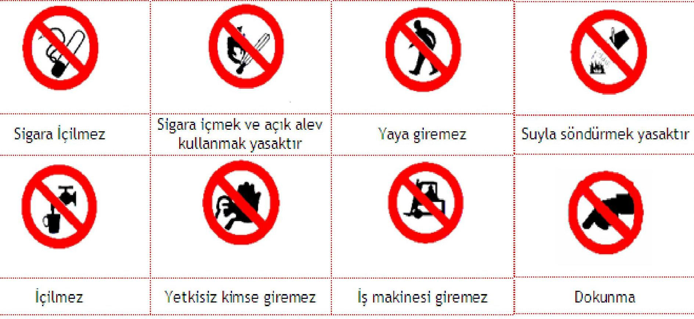
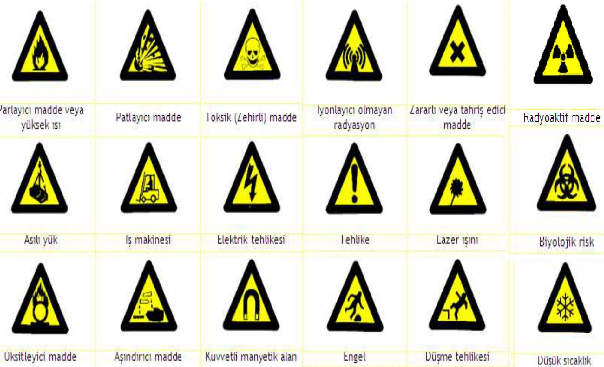
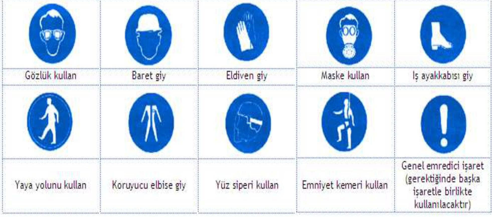
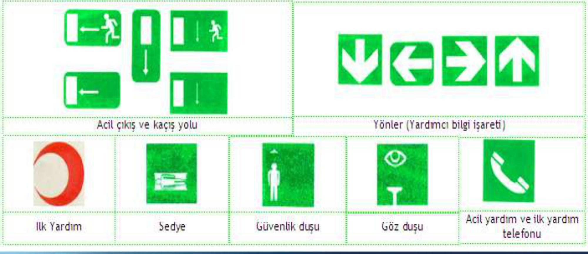
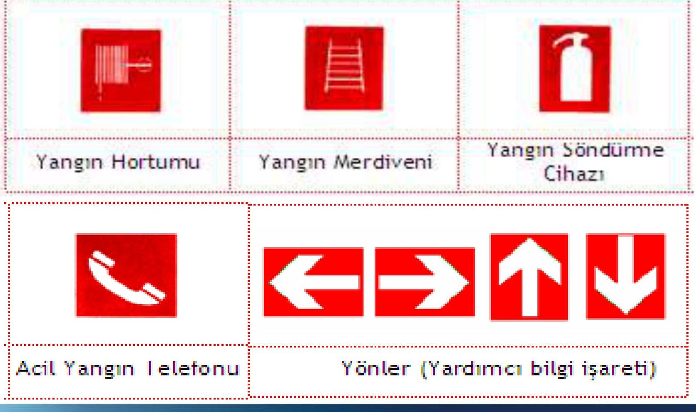

# İçindekiler
- [Genel Özet](#genel-özet)
- [Temel Terimler ve Kavramlar](#temel-terimler-ve-kavramlar)
- [Ana Gövde: Kronolojik veya Tematik Kayıt](#ana-gövde-kronolojik-veya-tematik-kayıt)
  - [İşyerlerinde Kullanılan Sağlık ve Güvenlik İşaretleri](#i̇şyerlerinde-kullanılan-sağlık-ve-güvenlik-i̇şaretleri)
    - [Güvenlik ve Sağlık İşaretleri Yönetmeliği](#güvenlik-ve-sağlık-i̇şaretleri-yönetmeliği)
    - [İşyerlerinde Renkler ve Anlamları](#i̇şyerlerinde-renkler-ve-anlamları)
  - [İşaret Levhaları](#i̇şaret-levhaları)
    - [Temel Nitelikler](#temel-nitelikler)
    - [Kullanım Koşulları](#kullanım-koşulları)
    - [Kullanılacak İşaret Levhaları](#kullanılacak-i̇şaret-levhaları)
      - [1.) Yasaklayıcı İşaretler](#1-yasaklayıcı-i̇şaretler)
      - [2.) Tehlike ve Uyarı İşaretleri](#2-tehlike-ve-uyarı-i̇şaretleri)
      - [3.) Zorunluluk (Emredici) İşaretleri](#3-zorunluluk-emredici-i̇şaretleri)
      - [4.) Acil Çıkış (Kaçış) ve İlk Yardım İşaretleri](#4-acil-çıkış-kaçış-ve-i̇lk-yardım-i̇şaretleri)
      - [5.) Yangınla Mücadele İşaretleri](#5-yangınla-mücadele-i̇şaretleri)
  - [Işıklı İşaretler](#işıklı-işaretler)
    - [Genel Hususlar](#genel-hususlar)
    - [Özel Kullanım Kuralları](#özel-kullanım-kuralları)
  - [Sesli Sinyaller](#sesli-sinyaller)
    - [Genel Hususlar](#genel-hususlar-1)
    - [Kodlama](#kodlama)
  - [El İşaretleri](#el-i̇şaretleri)
    - [Özellikler](#özellikler)
    - [Özel Kullanım Kuralları](#özel-kullanım-kuralları-1)
    - [Kodlanmış İşaretler](#kodlanmış-i̇şaretler)
      - [A. Genel İşaretler](#a-genel-i̇şaretler)
      - [B. Dikey Hareketler](#b-dikey-hareketler)
      - [C. Yatay Hareketler](#c-yatay-hareketler)
      - [D. Tehlike](#d-tehlike)
  - [Boru ve Kaplar Üzerindeki İşaretler ile İlgili Asgari Gerekler ve Boru Tesisatlarındaki Renkler](#boru-ve-kaplar-üzerindeki-i̇şaretler-ile-i̇lgili-asgari-gerekler-ve-boru-tesisatlarındaki-renkler)
    - [Boru Tesisatlarında Kullanılan Renkler](#boru-tesisatlarında-kullanılan-renkler)
    - [Borularda Kullanılabilecek Renkler](#borularda-kullanılabilecek-renkler)
  - [Engeller, Tehlikeli Yerler ve Trafik Yollarını Belirlemek İçin Kullanılan İşaretler ile İlgili Asgari Gerekler](#engeller-tehlikeli-yerler-ve-trafik-yollarını-belirlemek-i̇çin-kullanılan-i̇şaretler-ile-i̇lgili-asgari-gerekler)
    - [Engeller ve Tehlikeli Yerlerde Kullanılan İşaretler](#engeller-ve-tehlikeli-yerlerde-kullanılan-i̇şaretler)
    - [Trafik Yollarının İşaretlenmesi](#trafik-yollarının-i̇şaretlenmesi)
  - [KKD Üzerinde Bulunan Semboller](#kkd-üzerinde-bulunan-semboller)
  - [Tehlikeli Kimyasalların Uluslararası Sembolleri](#tehlikeli-kimyasalların-uluslararası-sembolleri)
  - [İlgili Mevzuat](#i̇lgili-mevzuat)
- [Temel Formüller ve Hızlı Bilgiler](#temel-formüller-ve-hızlı-bilgiler)
- [Kaynaklar](#kaynaklar)

# Genel Özet

Bu belge, *iş sağlığı ve güvenliği kapsamındaki işaretlerin* **tanımlarını, kullanım alanlarını, görünümlerini ve anlamlarını** detaylı bir şekilde ele almaktadır. 23 Aralık 2003 tarihli ve 25325 sayılı Resmi Gazete'de yayımlanan Güvenlik ve Sağlık İşaretleri Yönetmeliği'ne dayanarak, işyerlerinde kullanılan **renklerin anlamları, işaret levhalarının temel nitelikleri ve kullanım koşulları**, ışıklı ve sesli sinyaller ile el işaretlerinin özel uygulama kuralları açıklanmıştır. Ayrıca, boru ve kaplar üzerindeki işaretler, engeller ile tehlikeli yerlerin ve trafik yollarının işaretlenmesi için gerekli asgari gereklilikler vurgulanmaktadır. Son olarak, Kişisel Koruyucu Donanım (KKD) sembolleri ve tehlikeli kimyasalların uluslararası sembolleri gibi özel işaretler de bu dokümanda ele alınarak, işyerlerinde güvenli bir çalışma ortamının sağlanması için kapsamlı bir rehber sunulmaktadır.

# Temel Terimler ve Kavramlar

**Güvenlik ve Sağlık İşaretleri:** Özel bir amaç, faaliyet veya durumu işaret eden levha, renk, sesli ve/veya ışıklı sinyal, sözlü iletişim ya da el-kol işareti yoluyla iş sağlığı ve güvenliği hakkında bilgi veren, tehlikelere karşı uyaran ya da talimat veren işaretlerdir.
**Piktogram:** Bir nesneyi, kavramı veya eylemi temsil eden basit, anlaşılır grafiksel semboldür.
**Yasaklayıcı İşaretler:** Belirli bir davranışın veya eylemin yapılmasını yasaklayan, genellikle daire biçiminde, beyaz zemin üzerine siyah piktogram ve kırmızı çerçeveli işaretlerdir.
**Uyarıcı İşaretler:** Potansiyel bir tehlike hakkında bilgi veren, genellikle üçgen biçiminde, sarı zemin üzerine siyah piktogram ve siyah çerçeveli işaretlerdir.
**Emredici İşaretler:** Belirli bir eylemin yapılmasını zorunlu kılan, genellikle daire biçiminde, mavi zemin üzerine beyaz piktogramlı işaretlerdir.
**Acil Çıkış ve İlk Yardım İşaretleri:** Acil durum kaçış yollarını veya ilk yardım ekipmanlarını gösteren, genellikle dikdörtgen veya kare biçiminde, yeşil zemin üzerine beyaz piktogramlı işaretlerdir.
**Yangınla Mücadele İşaretleri:** Yangın söndürme ekipmanlarının yerini gösteren, genellikle dikdörtgen veya kare biçiminde, kırmızı zemin üzerine beyaz piktogramlı işaretlerdir.
**İşaretçi:** El-kol hareketleriyle manevra talimatlarını veren kişidir.
**Operatör:** İşaretçinin talimatları ile hareket eden kişidir.

# Ana Gövde: Kronolojik veya Tematik Kayıt

## İşyerlerinde Kullanılan Sağlık ve Güvenlik İşaretleri

### Güvenlik ve Sağlık İşaretleri Yönetmeliği
Bu yönetmelik, işyerlerinde kullanılan güvenlik ve sağlık işaretlerinin standartlarını belirler.

>[!note] Yasal Dayanak
>Resmi Gazete Tarihi: 23 Aralık 2003 / Resmi Gazete No: 25325

Güvenlik ve sağlık işaretleri, işyerindeki tehlikeleri ve alınması gereken önlemleri görsel, işitsel veya hareket tabanlı yöntemlerle çalışanlara iletmek için kullanılır. Bu işaretler, olası kazaları önlemek ve iş sağlığı ve güvenliği standartlarını sağlamak amacıyla büyük önem taşır.

### İşyerlerinde Renkler ve Anlamları

Renkler, işyerindeki farklı güvenlik durumlarını anlamak için kritik bir rol oynar. Her rengin belirli bir anlamı ve amacı vardır:

| Renk | Anlamı veya Amacı | Talimat ve Bilgi |
|---|---|---|
| **Kırmızı** | Yasak işareti | Tehlikeli hareket veya davranış |
| | Tehlike alarmı | Dur, kapat, düzeneği acil durdur, tahliye et |
| | Yangınla mücadele ekipmanı | Ekipmanların yerinin gösterilmesi ve ne olduğu |
| **Sarı** | Uyarı işareti | Dikkatli ol, önlem al, kontrol et |
| **Mavi** (1) | Zorunluluk işareti | Özel bir davranış ya da eylem Kişisel koruyucu donanım kullan |
| **Yeşil** | Acil kaçış, ilk yardım işareti | Kapılar, çıkış yerleri ve yolları, ekipman, tesisler |
| | Tehlike yok | Normale dön |

>(1) Mavi: Sadece dairevi bir şekil içinde kullanıldığında emniyet rengi olarak kabul edilir.
>(2) Fluoresan turuncu: Emniyet işaretleri dışında sarı yerine kullanılabilir. Özellikle zayıf doğal görüş şartlarında bu renk çok dikkat çekicidir.

| RENK | ANLAMI | KULLANIMI |
|---|---|---|
| ![[color-red.png]] | YASAK DUR | Durma işaretleri, Acil durum işaretleri, Yangın işaretleri |
| ![[color-yellow.png]] | DİKKAT TEHLİKE | Tehlike işaretleri, Dikkat işaretleri |
| ![[color-blue.png]] | ZORUNLUDUR | Kullanım işaretleri, Uygulama işaretleri |
| ![[color-green.png]] | GÜVENLİDİR | Sağlık işaretleri, Güvenlik işaretleri, Kaçış - Çıkış yolları |

## İşaret Levhaları

### Temel Nitelikler
İşaret levhalarının temel özellikleri şunlardır:
- Kendi özel amaçlarına göre; yasaklama, uyarı, emir, kaçış yolu, acil durumlarda kullanılacak ya da yangınla mücadele amaçlı ekipmanı belirtirler.
- Piktogramlar mümkün olduğunca yalın olacak ve sadece temel ayrıntıları içerecektir.
- Aynı anlamı veriyorsa ve yapılan değişiklik ya da düzenleme anlamını belirsiz hale getirmeyecek piktogramlar ayrıntılı olabilir.
- İşaret levhaları kullanıldıkları ortama uygun, darbeye ve hava koşullarına dayanıklı malzemeden yapılacaktır.
- İşaret levhalarının boyutları ile kolorimetrik ve fotometrik özellikleri, bunların kolayca görülebilir ve anlaşılabilir olmalarını sağlayacaktır.

### Kullanım Koşulları
İşaret levhalarının doğru ve etkili kullanımı için aşağıdaki koşullara uyulmalıdır:
- İşaret levhaları özel bir tehlike olan yerlerin ve tehlikeli cisimlerin hemen yakınına, genel tehlike olan yerlerin girişine, engeller dikkate alınarak, görüş seviyesine uygun yükseklik ve konumda, iyi aydınlatılmış, erişimi kolay ve görünür bir şekilde yerleştirilecektir.
- Doğal ışığın zayıf olduğu yerlerde fluoresan renkler, reflektör malzeme veya yapay aydınlatma kullanılacaktır.
- İşaret levhasının gösterdiği durum ortadan kalktığında, işaret levhası da kaldırılacaktır.

### Kullanılacak İşaret Levhaları
İşyerlerinde farklı amaçlar için beş ana işaret levhası kategorisi bulunur:
1. Yasaklayıcı İşaretler
2. Uyarıcı İşaretler
3. Emredici İşaretler
4. Acil Çıkış ve İlk Yardım İşaretleri
5. Yangınla Mücadele İşaretleri

#### 1.) Yasaklayıcı İşaretler
- Bazı çalışma birimlerinde, bazı işlerin ve eylemlerin yapılması veya bazı maddelerin ve malzemelerin bulundurulması ya da kullanılması yasaktır.
- Daire biçiminde, beyaz zemin üzerine siyah piktogram, kırmızı çerçeve ve diyagonal çizgi (kırmızı kısımlar işaret alanının en az % 35'ini kapsayacaktır).

#### 2.) Tehlike ve Uyarı İşaretleri
- Üçgen biçiminde, sarı zemin üzerine siyah piktogram, siyah çerçeve (sarı kısımlar işaret alanının en az % 50'sini kapsayacaktır).

#### 3.) Zorunluluk (Emredici) İşaretleri
- İşyerlerinde, işin ve risklerin özelliklerine göre uyulması ve uygulanması gereken kurallar ve eylemler olabilir.
- Daire biçiminde, mavi zemin üzerine beyaz piktogram (mavi kısımlar işaret alanının en az % 50'sini kapsayacaktır).

#### 4.) Acil Çıkış (Kaçış) ve İlk Yardım İşaretleri
- Sağlık ve güvenlikle ilgili bilgiler verir.
- Dikdörtgen veya kare biçiminde, yeşil zemin üzerine beyaz piktogram (yeşil kısımlar işaret alanının en az % 50'sini kapsayacaktır).

#### 5.) Yangınla Mücadele İşaretleri
- Dikdörtgen veya kare biçiminde, kırmızı zemin üzerine beyaz piktogram (kırmızı kısımlar işaret alanının en az % 50'sini kapsayacaktır).

## Işıklı İşaretler

### Genel Hususlar
Işıklı işaretlerin etkili olabilmesi için aşağıdaki genel hususlara dikkat edilmelidir:
- Işıklı işaretler, kullanım amacına ve şartlarına uygun olarak, bulunduğu ortama göre iyi görünür ve seçilir olacak, aşırı ışık nedeniyle parlamayacak veya yetersiz ışık nedeniyle görünürlüğü azalmayacaktır.
- Işıklı işaretlerin sinyal gönderen ışıklı alanı, tek renk ya da belirli bir zemin üzerinde piktogramdan ibaret olacaktır.
- Kullanılan tek renk yönetmelikte yer alan renk tablosuna uygun olacaktır.
- İşaret bir piktogram içeriyorsa, bu piktogram yönetmelikte belirtilen ilgili kuralların hepsine uygun olacaktır.

### Özel Kullanım Kuralları
Işıklı işaretlerin özel kullanım kuralları şunlardır:
- Bir aygıt hem sürekli hem de aralıklı işaretler gönderiyorsa, aralıklı gönderilen işaret sürekli işaretin belirttiğinden daha fazla tehlikeli bir durumu ya da daha acil olarak yapılması istenen/emredilen müdahale ya da eylemi ifade eder.
- Mesajın tam olarak anlaşılmasını sağlayacak ve diğer ışıklı işaretlerle veya sürekli yanan ışıklı işaretlerle karışmayacaktır.
- Yanıp sönen ışıklı işaret, sesli sinyal yerine ya da sesli sinyalle birlikte kullanılıyorsa, aynı kodlama kullanılacaktır.
- Ciddi bir tehlikeyi bildiren yanıp sönen ışıklı işaretler, özel olarak gözlem altında tutulacak ve yedek bir lamba bulundurulacaktır.

## Sesli Sinyaller

### Genel Hususlar
Sesli sinyallerin etkili olabilmesi için aşağıdaki genel hususlara dikkat edilmelidir:
- Ortam gürültüsünden hayli yüksek, ancak aşırı derecede yüksek ve zarar verici olmayacak şekilde duyulabilir bir ses düzeyinde olacak ve teknik özellikleri itibarıyla kolaylıkla tanınabilir, diğer sesli sinyaller ile ortamdaki seslerden açıkça ayırt edilebilir olacaktır.
- Eğer bir aygıt sabit ve değişken frekansta sesli sinyal yayıyorsa; aygıtın yaydığı değişken frekanslı sinyal, sabit frekanslı sinyale göre daha tehlikeli bir durumu veya daha acil olarak yapılması istenen/emredilen müdahale ya da eylemi ifade eder.

### Kodlama
- Tahliye işaretleri sürekli olacaktır.

## El İşaretleri

### Özellikler
El işaretlerinin özellikleri şunlardır:
- El işaretleri kesin, yalın, yapılması ve anlaşılması kolay olacak ve benzer işaretlerden belirgin bir şekilde farklı olacaktır.
- Aynı anda iki kol birden kullanılıyorsa, bunlar simetrik olarak hareket ettirilecek ve bir harekette sadece bir işaret verilecektir.

### Özel Kullanım Kuralları
El işaretlerinin özel kullanım kuralları şunlardır:
- **İşaretçi:** El-kol hareketleri ile işaretleri veren kişi.
- **Operatör:** İşaretçinin talimatları ile hareket eden kişi.
- İşaretçi, operatöre manevra talimatlarını vermek için el-kol hareketleri kullanacaktır.
- İşaretçi, kendisi tehlikeye düşmeyecek şekilde, bulunduğu yerden bütün manevraları görsel olarak izleyebilmelidir.
- İşaretçinin esas görevi; manevraları yönlendirmek ve manevra alanındaki işçilerin güvenliğini sağlamaktır.
- Yukarıdaki şart yerine getirilemiyorsa ek olarak bir veya daha fazla işaretçi konuşlandırılacaktır.
- Operatör, almış olduğu emirleri güvenlik içerisinde yerine getiremeyeceği durumlarda yürütmekte olduğu manevrayı durdurarak yeni talimat isteyecektir.

**Yardımcı unsurlar:**
- Operatör, işaretçiyi kolaylıkla fark edebilmelidir.
- İşaretçi, ceket, baret, kolluk veya kol bandı gibi ayırt edici eşyalardan bir veya daha fazlasını giyecek ya da uygun bir işaret aracı taşıyacaktır.
- Ayırt edici eşyalar; parlak renkli, tercihen hepsi aynı renkte ve sadece işaretçilere özel olacaktır.

### Kodlanmış İşaretler
Belirli sektörlerde aynı manevralar için kullanılacak kodlanmış el işaretleri aşağıda verilmiştir.

#### A. Genel İşaretler

| Anlamı | Tarifi |
|---|---|
| **BAŞLAT**   Hazır ol   Başlama komutu | Avuç içleri öne bakacak şekilde her iki kol yere paralel. |
| **DUR**   Kesinti / ara   Hareketi durdur | Avuç içi öne bakacak şekilde sağ kol yukarı kalkık. |
| **TAMAM**   İşlemin sonu | Her iki kol göğüs hizasında eller kenetli. |

#### B. Dikey Hareketler

| Anlamı | Tarifi |
|---|---|
| **KALDIR** | Sağ kol avuç içi öne bakacak şekilde yukarı kalkıkken yavaşça daire çizer. |
| **İNDİR** | Sağ kol avuç içi içeri bakacak şekilde yere doğru indirilmişken yavaşça daire çizer. |
| **DÜŞEY MESAFE** | Mesafe her iki elin arasındaki boşlukla ifade edilir. |

#### C. Yatay Hareketler

| Anlamı | Tarifi |
|---|---|
| **İLERİ** | Her iki kol avuç içleri yukarı bakacak şekilde bel hizasında bükülüyken kollar dirsekten kırılarak yukarı hareket eder. |
| **GERİ** | Her iki kol avuç içleri aşağı bakacak şekilde göğüs önünde bükülüyken kollar dirsekten kırılarak yavaşça gövdeden uzaklaşır. |
| **SAĞ**   Manevracının sağı | Sağ kol avuç içi yere bakacak şekilde yere paralel sağa uzatılmışken sağa doğru yavaşça küçük hareketler. |
| **SOL**   Manevracının solu | Sol kol avuç içi yere bakacak şekilde yere paralel sola uzatılmışken sola doğru yavaşça küçük hareketler. |
| **YATAY MESAFE** | Eller arasındaki boşluk mesafeyi ifade eder. |

#### D. Tehlike

| Anlamı | Tarifi |
|---|---|
| **TEHLİKE**   Acil dur. | Avuç içleri öne bakacak şekilde her iki kol yukarı kalkık. |
| **HIZLI** | Bütün hareketler daha hızlı. |
| **YAVAŞ** | Bütün hareketler daha yavaş. |

## Boru ve Kaplar Üzerindeki İşaretler ile İlgili Asgari Gerekler ve Boru Tesisatlarındaki Renkler

1. İçinde tehlikeli maddelerin bulunduğu veya depolandığı kaplar ile bunları ihtiva eden veya taşıyan, görünür borular; yürürlükteki mevzuata uygun olarak, renkli zemin üzerinde piktogram veya sembol bulunan etiket ile işaretlenecektir. Etikette tehlikeli maddenin adı ve/veya formülü ve tehlikesi hakkında ek bilgiler de yer alabilir.
2. İşaretler; katlanmaz, kendinden yapışkanlı ya da boyama biçiminde olacak ve görünür yüzeylere yerleştirilecektir.

### Boru Tesisatlarında Kullanılan Renkler
Boru tesisatlarındaki renkler, acil durumlarda akışkanların hızlıca tanımlanarak müdahale edilmesini sağlar. Yanlış akışkanın durdurulması veya açılması durumu daha da kötüleştirebilir.

>[!note] Önemi
>Yangın, göçük veya başka bir acil durumda, borulardan geçen akışkanları durdurmak gerekebilir. Borudaki akışkanın bilinmemesi büyük hasar ve can kaybına yol açabilir. Kurtarma ekipleri için de bu işaretler hayati önem taşır.

Borular, doğanın aşındırıcı etkisine karşı koruyucu olması için boyanır. Eğer boruların tamamı boyanamıyorsa, bu renkleri belirten bantlar kullanılır.

### Borularda Kullanılabilecek Renkler

| İçerik | Renk |
|---|---|
| Su | Yeşil |
| Buhar | Gümüş grisi |
| Hava haricindeki gazlar | Sarı |
| Çeşitli yağlar | Kahverengi |
| Asit – Alkali | Mor |
| Hava | Açık mavi |
| Diğer sıvılar | Siyah |
| Yangın söndürme suyu | Kırmızı |
| Yangın suyu | Kırmızı |
| Sulandırılmış nişadır / `NH₄OH` | Sarı |
| Akış Yönü | Ok işareti (genellikle siyah veya beyaz) |
| Asetilen | Sarı |
| Hidrojen `H` | Sarı |
| Doğal gaz | Sarı |
| Oksijen `O₂` | Mavi |
| Motor yağı | Kahverengi |

## Engeller, Tehlikeli Yerler ve Trafik Yollarını Belirlemek İçin Kullanılan İşaretler ile İlgili Asgari Gerekler

### Engeller ve Tehlikeli Yerlerde Kullanılan İşaretler
1. Engellere çarpma, düşme ya da nesnelerin düşme tehlikesinin bulunduğu yerler; işletme tesisleri içinde işçilerin çalışmaları esnasında dolaştıkları bölgelerde, birbirini takip eden **sarı ve siyah** ya da **kırmızı ve beyaz** renk şeritleriyle işaretlenecektir.
2. İşaretlerin boyutu, engelin ya da tehlikeli bölgenin büyüklüğü ile orantılı olacaktır.
3. Sarı-siyah ya da kırmızı-beyaz şeritler yaklaşık olarak 45 derece açıyla ve aynı büyüklükte boyanacaktır.
4. Örnek: ![[danger-tape.png|300]] *Çapraz şeritlerden oluşan görsel bir uyarı örneği.*

### Trafik Yollarının İşaretlenmesi
1. Çalışma yerlerinin kullanım biçimi ve ekipmanlar, işçilerin korunmasını gerektiriyorsa; araç trafiğine açık yollar, zemin rengi de dikkate alınarak, açıkça seçilebilir şekilde, **sarı ya da beyaz** renkli sürekli şeritlerle belirtilecektir.
2. Şeritler; araçlar ile araçlara yakın bulunabilecek nesneler arasında ve araçlarla yayalar arasında, emniyetli bir mesafeyi belirtecek şekilde çizilecektir.
3. Tesislerin açık alanlarındaki sürekli trafiğin olduğu yollar, uygun bariyerler ve kaldırımlar yoksa, uygulanabilir olduğu ölçüde, yukarıda belirtildiği şekilde işaretlenecektir.

## KKD Üzerinde Bulunan Semboller
Kişisel Koruyucu Donanımlar (KKD) üzerinde belirli risklere karşı korumayı gösteren standart semboller bulunur.

>[!infobox]
>![[img-5.jpeg]]
>*KKD sembolleri örneği.*

KKD sembolleri bir veya daha fazla özel koruma yeteneğini temsil eder:

>[!caption|center] Hava kirliliğine karşı koruma
![[img-7.jpeg|150]]

>[!caption|center] Kimyasal risklere karşı koruma
![[img-8.jpeg|150]]

>[!caption|center] Sıvıcılıkla karşı koruma
![[img-9.jpeg|150]]

>[!caption|center] İtfaiyeci kıyafetleri
![[img-10.jpeg|150]]

>[!caption|center] Statik Elektriğe karşı koruma
![[img-11.jpeg|150]]

>[!caption|center] Mekanik risklere karşı koruma
![[img-12.jpeg|150]]

>[!caption|center] Makinelerin hareketli parçalarına karşı koruma
![[img-13.jpeg|150]]

>[!caption|center] Sıcağa karşı koruma
![[img-14.jpeg|150]]

>[!caption|center] Radyasyona karşı koruma
![[img-15.jpeg|150]]

>[!example]+ Görülmeyi ve fark edilmeyi sağlayan giysi
![[img-6.jpeg|200]]

## Tehlikeli Kimyasalların Uluslararası Sembolleri

Tehlikeli kimyasallar, uluslararası standartlara uygun piktogramlar ile işaretlenir. Bu semboller, kimyasalın taşıdığı riski hızlıca tanımlamak için kullanılır.

>[!infobox]
>![[img-16.jpeg]]
>*Kimyasal risk sembolleri.*

1. **Patlayıcı**
2. **Toksik**
3. **Parlayıcı**
4. **Oksitleyici**
5. **İrritan**
6. **Radyoaktif**
7. **Zararlı**
8. **Aşındırıcı**
9. **Çevreye Zararlı**

>[!infobox]
>![[img-17.jpeg]]
>*Örnek tehlikeli kimyasal etiketleri.*

## İlgili Mevzuat

Bu belgedeki bilgiler aşağıdaki yönetmelik ve kanunlara dayanmaktadır:
- 22/5/2003 tarihli ve 4857 sayılı İş Kanunu
- Güvenlik ve Sağlık İşaretleri Yönetmeliği (Resmi Gazete Tarihi: 23 Aralık 2003 Sayısı: 25325)

# Temel Formüller ve Hızlı Bilgiler

---

**Renklerin Anlamları**
- **Kırmızı:** *Yasaklama*, *Tehlike Alarmı*, *Yangınla Mücadele*.
- **Sarı:** *Uyarı*, *Dikkat*, *Önlem Al*.
- **Mavi:** *Zorunluluk*, *Kişisel Koruyucu Donanım Kullanımı*.
- **Yeşil:** *Acil Kaçış*, *İlk Yardım*, *Tehlike Yok*.

---

**İşaret Levhalarının Biçimleri**
- **Yasaklayıcı İşaretler:** `Daire` (*Beyaz zemin, siyah piktogram, kırmızı çerçeve*).
- **Uyarı İşaretleri:** `Üçgen` (*Sarı zemin, siyah piktogram, siyah çerçeve*).
- **Emredici İşaretler:** `Daire` (*Mavi zemin, beyaz piktogram*).
- **Acil Çıkış/İlk Yardım İşaretleri:** `Dikdörtgen/Kare` (*Yeşil zemin, beyaz piktogram*).
- **Yangınla Mücadele İşaretleri:** `Dikdörtgen/Kare` (*Kırmızı zemin, beyaz piktogram*).

---

**El İşaretleri Ana Komutlar**
- **BAŞLAT:** Avuç içleri öne, kollar yere paralel.
- **DUR:** Sağ kol yukarı kalkık, avuç içi öne.
- **TAMAM:** Her iki kol göğüs hizasında, eller kenetli.
- **TEHLİKE / ACİL DUR:** Avuç içleri öne, her iki kol yukarı kalkık.

---

**Boru Renkleri İçerik Eşleşmesi**
- `Yeşil`: *Su*.
- `Gümüş grisi`: *Buhar*.
- `Sarı`: *Hava harici gazlar* (asetilen, hidrojen, doğal gaz).
- `Kahverengi`: *Çeşitli yağlar*, *motor yağı*.
- `Mor`: *Asit – Alkali*.
- `Açık mavi`: *Hava*, *Oksijen*.
- `Siyah`: *Diğer sıvılar*.
- `Kırmızı`: *Yangın söndürme suyu*, *yangın suyu*.

---

**Engeller ve Tehlikeli Yer İşaretleri**
- `Sarı-Siyah` veya `Kırmızı-Beyaz` şeritler, ~45 derece açıyla.
- Boyut engelle orantılı olmalı.

# Kaynaklar

- 22/5/2003 tarihli ve 4857 sayılı İş Kanunu
- Güvenlik ve Sağlık İşaretleri Yönetmeliği (Resmi Gazete Tarihi : 23 Aralık 2003 Sayısı: 25325)