# İçindekiler

- [İçindekiler](#i̇çindekiler)
- [Genel Özet](#genel-özet)
- [Temel Terimler ve Kavramlar](#temel-terimler-ve-kavramlar)
- [Ana Gövde: Kronolojik veya Tematik Kayıt](#ana-gövde-kronolojik-veya-tematik-kayıt)
  - [1. Gürültü](#1-gürültü)
    - [Desibel Ölçü Birimleri, Kullanım Alanları ve Özellikleri](#desibel-ölçü-birimleri-kullanım-alanları-ve-özellikleri)
    - [Gürültü İle İlgili Dikkat Edilecek Hususlar](#gürültü-i̇le-i̇lgili-dikkat-edilecek-hususlar)
    - [Gürültünün Sağlığa Etkileri](#gürültünün-sağlığa-etkileri)
    - [İşitme Kaybına Neden Olan Faktörler](#i̇şitme-kaybına-neden-olan-faktörler)
    - [Meslek Hastalığına Neden Olan Gürültü](#meslek-hastalığına-neden-olan-gürültü)
    - [Gürültüyü Önleme Teknikleri](#gürültüyü-önleme-teknikleri)
  - [2. Aydınlatma](#2-aydınlatma)
    - [Watt, Lümen ve Lüks](#watt-lümen-ve-lüks)
    - [Aydınlatmanın Kalitesi](#aydınlatmanın-kalitesi)
    - [Sağlık Etkileri](#sağlık-etkileri)
    - [Aydınlatmanın Ölçülmesi](#aydınlatmanın-ölçülmesi)
  - [3. Titreşim](#3-titreşim)
    - [Titreşim Şekilleri](#titreşim-şekilleri)
    - [Titreşim Sınır Değerleri](#titreşim-sınır-değerleri)
      - [El-kol titreşimi için:](#el-kol-titreşimi-için)
      - [Bütün Vücut titreşimi için:](#bütün-vücut-titreşimi-için)
    - [Titreşime Bağlı Risklere Maruziyeti En Aza İndirmek İçin Yapılması Gerekenler](#titreşime-bağlı-risklere-maruziyeti-en-aza-i̇ndirmek-i̇çin-yapılması-gerekenler)
    - [Titreşimin İnsan Üzerindeki Etkileri](#titreşimin-i̇nsan-üzerindeki-etkileri)
    - [Beyaz Parmak Hastalığı](#beyaz-parmak-hastalığı)
  - [4. Radyasyon](#4-radyasyon)
    - [Doğal Radyasyon Kaynakları](#doğal-radyasyon-kaynakları)
    - [Yapay Radyasyon](#yapay-radyasyon)
    - [Radyasyonun Giriciliği](#radyasyonun-giriciliği)
    - [Radyasyon Zararını Azaltmak İçin Bazı Malzemelerin Zırh Kalınlıkları](#radyasyon-zararını-azaltmak-i̇çin-bazı-malzemelerin-zırh-kalınlıkları)
    - [Elektromanyetik Spektrum](#elektromanyetik-spektrum)
    - [FUNGING RADIATION (Potansiyel olarak zararlı veya faydalı)](#funging-radiation-potansiyel-olarak-zararlı-veya-faydalı)
    - [THE ENERGY SPECTRUM (High frequency)](#the-energy-spectrum-high-frequency)
    - [LOW-TRANEER (Low frequency)](#low-traneer-low-frequency)
    - [Sağlığa Etkileri](#sağlığa-etkileri)
    - [Radyasyonun Ölçülmesi](#radyasyonun-ölçülmesi)
    - [Radyasyonun Denetimi](#radyasyonun-denetimi)
  - [5. Basınç](#5-basınç)
    - [Sağlığa Etkileri](#sağlığa-etkileri-1)
      - [Basınç Artışında Meydana Gelen Bozukluklar:](#basınç-artışında-meydana-gelen-bozukluklar)
  - [6. Termal Konfor](#6-termal-konfor)
- [Temel Formüller ve Hızlı Bilgiler](#temel-formüller-ve-hızlı-bilgiler)
- [Kaynaklar](#kaynaklar)

---

# Genel Özet

Bu belge, çalışma ve yaşam ortamlarında karşılaşılabilecek **fiziksel risk etmenlerini** detaylı bir şekilde ele almaktadır. Özellikle **gfürültü, aydınlatma, titreşim, radyasyon, basınç değişimleri ve termal konfor** gibi temel faktörlerin insan sağlığı üzerindeki olası etkileri, bu etmenlerin ölçüm yöntemleri ve alınması gereken önlemler açıklanmaktadır. Belgenin amacı, bu risk etmenlerini anlayarak, *çalışma ortamlarında güvenli ve sağlıklı koşulların sağlanmasına* katkıda bulunmaktır. Sonuç olarak, okuyucuların bu fiziksel etkenler hakkında bilinçlenmesi ve gerekli tedbirleri alması hedeflenmektedir.

---

# Temel Terimler ve Kavramlar

*   **Gürültü:** İşitme duyusunun azalmasına veya sağlığın bozulmasına neden olan, istenmeyen ve rahatsız edici seslerdir.
*   **Desibel (dB):** Ses şiddetini ölçmek için kullanılan birimdir.
*   **Lüks:** Aydınlatma şiddetini ölçmek için kullanılan birimdir; metrekare başına düşen lümendir.
*   **Titreşim:** Bir cismin ileri-geri gidip gelme hareketi veya tekrarlayan mekanik enerjidir.
*   **Radyasyon:** Enerjinin elektromanyetik veya parçacık modeliyle taşınmasıdır ve iyonize veya iyonize olmayan türleri bulunur.
*   **Atmosfer Basıncı:** Normal şartlarda yer küre üzerindeki hava basıncıdır ve yaklaşık 76 cm civa basıncına eşittir.
*   **Termal Konfor:** Sıcaklık, nem, hava akım hızı ve radyan ısının çalışan için en uygun olduğu şartlardır.
*   **Hertz (Hz):** Titreşimin frekans birimidir; birim zamandaki titreşim sayısını ifade eder.

---

# Ana Gövde: Kronolojik veya Tematik Kayıt

## 1. Gürültü

Gürültü, genel anlamda istenmeyen ve rahatsız edici sesler olarak tanımlanır. İş Sağlığı ve Güvenliği (İSG) bağlamında ise, işitme duyusunun azalmasına, sağlığın bozulmasına veya başka tehlikelerin meydana gelmesine neden olan seslerdir. Ses, gaz, katı ve sıvı cisim moleküllerinin hava basıncında yarattığı dalgalanmaların kulaktaki etkisinden ortaya çıkan bir duyumdur. Sesin niteliği frekans (bir saniyedeki titreşim sayısı) ve şiddet (ses dalgasının içerdiği enerji) ile belirlenir. İnsan kulağı 16 Hz ile 20000 Hz arasındaki titreşimleri işitebilir. Ses şiddeti desibel (dB) ile ölçülür.

> [!note] Ses şiddetindeki 1 desibellik artış, ses enerjisinde yaklaşık 1.26 katlık bir artışa denk gelir. Gürültü düzeyinin 3 dB artması veya azalması, ses şiddetinin iki katına çıkması veya yarıya inmesi anlamına gelir.

### Desibel Ölçü Birimleri, Kullanım Alanları ve Özellikleri

| Birim dB | Kullanım Alanları | Özellikler                                                                 |
| :------- | :---------------- | :------------------------------------------------------------------------- |
| dB(A)    | Ağırlıklı gürültü basınç düzeyi | Genel çevre ve endüstri gürültüsü ölçüm düzeyi                              |
| dB(B)    | Ağırlıklı gürültü basınç düzeyi | Gürültü düzeyi azaltılmasında dB(A)'dan daha öznel ve az kullanılan bir ölçüttür |
| dB(C)    | Ağırlıklı gürültü basınç düzeyi | 85 dB'in üzerindeki gürültü                                                 |
| dB(D)    | Ağırlıklı gürültü basınç düzeyi | Yalnızca uçak gürültüsü için kullanılır                                    |

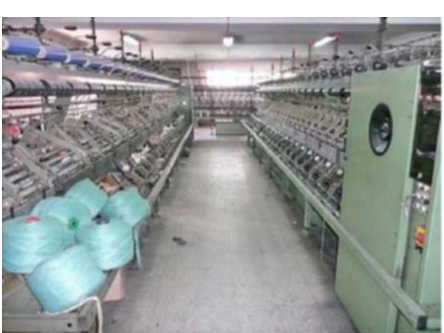
a) Tekstil büküm makinaları
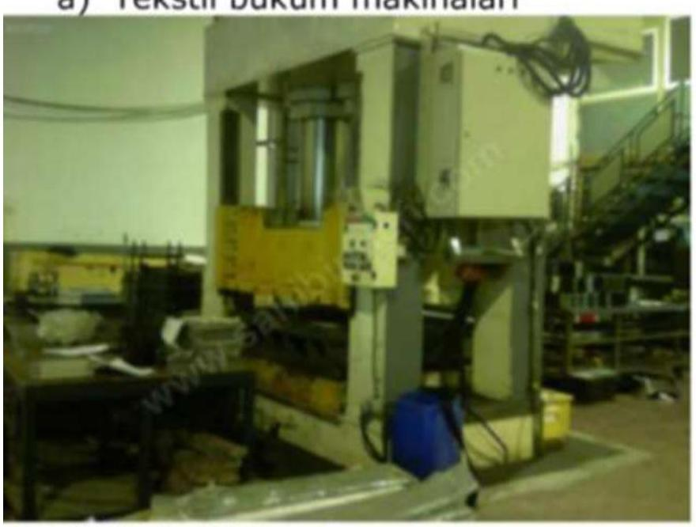
c) HidroliK pres
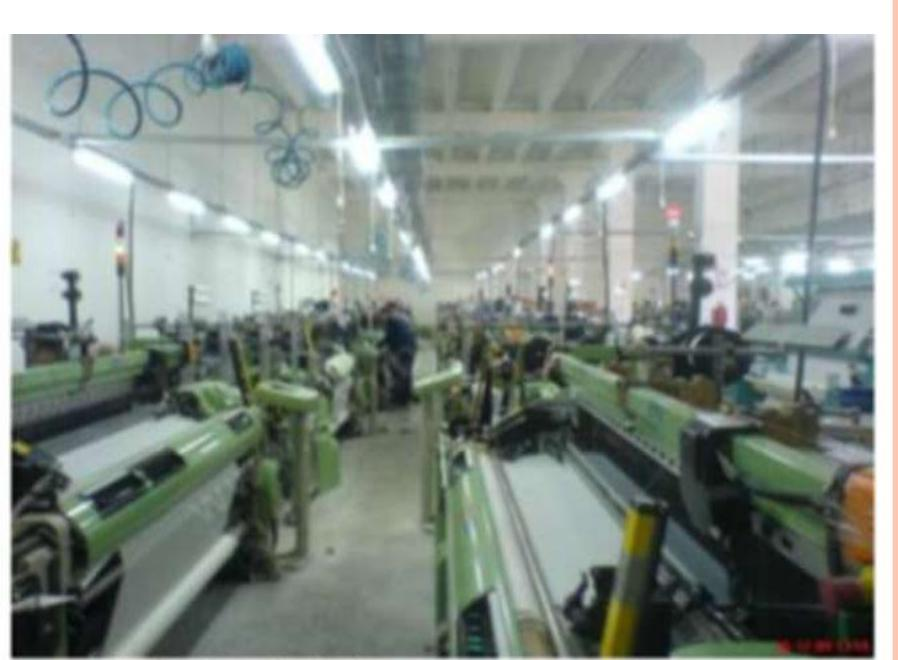
b) Tekstil dokuma makinaları
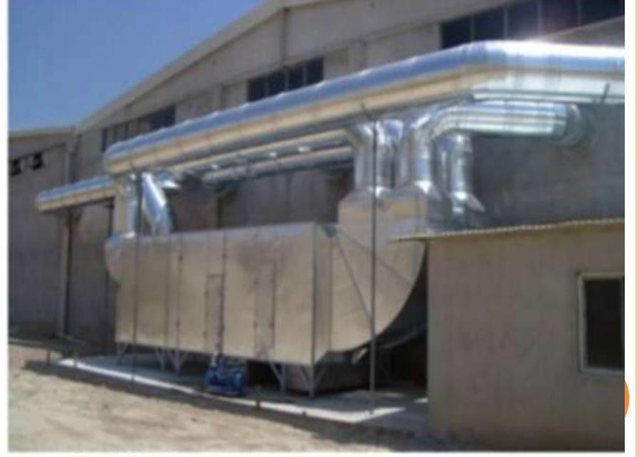
d) Klima santrali

| Ses Düzeyi (dB(A)) | Örnek Sesler                                                                                                                                                                                                             |
| :----------------- | :----------------------------------------------------------------------------------------------------------------------------------------------------------------------------------------------------------------------- |
| 0                  | İşitme eşiği (normal solunum)                                                                                                                                                                                            |
| 20                 | Sessiz bir orman                                                                                                                                                                                                         |
| 30                 | Fısıltı ile konuşma                                                                                                                                                                                                      |
| 40                 | Sessiz oda                                                                                                                                                                                                              |
| 50                 | Şehir içinde bir büro                                                                                                                                                                                                    |
| 60                 | Karşılıklı konuşma                                                                                                                                                                                                       |
| 70                 | Dikey matkap                                                                                                                                                                                                             |
| 80                 | Yüksek sesle konuşma                                                                                                                                                                                                     |
| 90                 | Kuvvetlice bağırma                                                                                                                                                                                                       |
| 100                | Dokuma salonları                                                                                                                                                                                                         |
| 110                | Havalı çekiç, Ağaç işleri                                                                                                                                                                                                |
| 120                | Bilyalı değirmen                                                                                                                                                                                                         |
| 130                | Uçakların yanı                                                                                                                                                                                                          |
| 140                | Ağrı eşiği                                                                                                                                                                                                              |

Gürültü, gürültü dozimetresi ile ölçülür. **Kişisel dozimetreler**, gürültü etkisindeki kişinin kulağına yakın yerleştirilen mikrofonlarla çalışma süresi boyunca gürültü seviyelerini kaydederek ortalamasını alır ve kişinin maruz kaldığı gürültüyü belirler. **Ortam dozimetreleri** ise genel ortamdaki ses şiddetini ölçmek için kullanılır.

>[!note] **En düşük maruziyet eylem değerleri:** 80 dB(A), **En yüksek maruziyet eylem değerleri:** 85 dB(A), **Maruziyet sınır değerleri:** 87 dB(A).

### Gürültü İle İlgili Dikkat Edilecek Hususlar

*   Maruziyet sınır değerleri uygulanırken, çalışanın kişisel kulak koruyucu donanımlarının etkisi dikkate alınır.
*   Maruziyet eylem değerlerinde kulak koruyucularının etkisi dikkate alınmaz.
*   **Maruziyet eylem değeri:** Aşıldığında, çalışanın gürültüye maruziyetinden kaynaklanan risklerin kontrol altına alınmasını gerektiren değerdir.
*   **Maruziyet sınır değeri:** Çalışanların bu değerin üzerinde bir gürültüye kesinlikle maruz kalmaması gereken değerdir.

### Gürültünün Sağlığa Etkileri

*   **Fiziksel etkiler:** Geçici, sürekli veya ani (tek seferde) işitme kaybı.
*   **Somatik etkiler:** Vücut etkinliklerindeki değişiklikler (kan basıncı artışı, dolaşım bozuklukları, takipne, taşikardi, ani refleksler).
*   **Psikolojik etkiler:** Davranış bozuklukları, öfkelenme, sıkılma, genel rahatsızlık hissi.
*   **Performans etkileri:** İş veriminin düşmesi, konsantrasyon bozukluğu, hareketlerin engellenmesi.

### İşitme Kaybına Neden Olan Faktörler

1.  Gürültüyü Meydana Getiren Sesin Şiddeti
2.  Gürültüyü Meydana Getiren Sesin Frekansı
3.  Gürültüden Etkilenme Süresi
4.  Gürültüye Karşı Kişisel Duyarlılık
5.  Gürültüye Maruz Kalan Kişinin Yaşı

| İşitme Yeteneği Kaybı (%) | 5 yıl sonra | 10 yıl sonra | 20 yıl sonra |
| :----------------------- | :---------- | :----------- | :----------- |
| 80 dB                    | 0           | 0            | 0            |
| 90 dB                    | 4           | 10           | 16           |
| 100 dB                   | 12          | 29           | 42           |
| 110 dB                   | 26          | 55           | 78           |

Çalışanların gürültüye maruziyeti 80 dB'i aştığında uygun Kişisel Koruyucu Donanım (KKD) kullanımı için hazır bulundurulur. Maruziyet 85 dB'e ulaştığında veya aştığında ise KKD'lerin kullanımı sağlanır ve denetlenir.

### Meslek Hastalığına Neden Olan Gürültü

Yönetmeliğe göre, gürültü zararlarının meslek hastalığı sayılabilmesi için; gürültülü işte en az 2 yıl çalışmak veya gürültü şiddeti sürekli olarak 85 dB'in üstünde olan işlerde en az 30 gün çalışmış olmak gerekir. Gürültü için yükümlülük süresi 6 ay olarak belirtilmiştir.

### Gürültüyü Önleme Teknikleri

**A) Gürültü Kaynağında Alınması Gereken Önlemler:**

*   Kullanılan makinelerin, gürültü düzeyi düşük makinelerle değiştirilmesi.
*   Gürültü düzeyi yüksek olan işlemlerin, daha az gürültü gerektiren işlemlerle değiştirilmesi.
*   Gürültü kaynağının ayrı bir bölmeye alınması.
*   İş ekipmanları için uygun bakım programlarının uygulanması.

**B) Gürültülü Ortamda Alınması Gereken Önlemler:**

*   Makinelerin yerleştirildiği zeminde gürültüye ve titreşime karşı yeterli önlemlerin alınması.
*   Gürültü kaynağı ile maruz kalan kişi arasına ses emici veya engelleyici malzeme konulması.
*   Gürültü kaynağı ile maruz kalan kişi arasındaki mesafenin artırılması.
*   Sesten geçebilecek ve yansıyabilecek duvar, tavan, taban gibi yüzeylerin ses emici malzemelerle kaplanması.

**C) Gürültüye Maruz Kalan Kişide Alınması Gereken Önlemler:**

*   Gürültüye karşı iyi izole edilmiş bir bölme içine alınması.
*   Yeterli dinlenme araları verilmesi ve çalışma süresinin kısaltılması.
*   Kişisel koruyucu donanımların kullanılması.
*   Gürültünün zararları hakkında bilgilendirilmesi ve eğitilmesi.

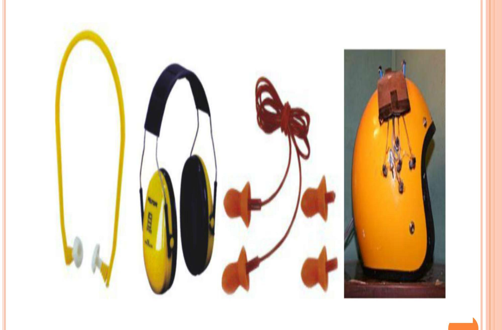

## 2. Aydınlatma

İş yerlerinde en çok ihmal edilen duyulardan biri görmedir. Çalışanların sağlığı ve güvenliği için uygun **aydınlatma** temel fiziksel koşullardan biridir. Doğru aydınlatma, göz sağlığını korur, kas-iskelet sistemi travmalarını ve iş kazalarını önler, olumlu psikolojik etki sağlar. Bu nedenle, yapılan işe uygun aydınlatma seviyelerinin sağlanması büyük önem taşır. Işık, insan gözüyle algılanabilen dalga boylarındaki elektromanyetik ışımanın bir biçimidir. Bir yüzeye düşen ışık miktarına **aydınlatma** denir ve birimi **lüks**'tür (lümen/metrekare). Lümen, birim zamanda yayılan ışık enerjisidir. Bu ölçümler için **lüksmetre** kullanılır.

### Watt, Lümen ve Lüks

**Watt** güç birimidir; lümen ise lambanın yaydığı ışık parlaklığını ifade eder. Watt, lambanın harcadığı gücü, lümen ise ürettiği ışığı gösterir. Aynı tip lambada yüksek watt genellikle daha yüksek lümen anlamına gelir. Lüks ise metrekare başına düşen lümendir.

İyi bir aydınlatma, görme keskinliğini artırır, iş kazalarını azaltır, işçilerin verimliliğini ve performansını yükseltir. Yetersiz aydınlatma ise verimliliği düşürür, morali bozar ve fiziksel sağlığı olumsuz etkiler.

**Aydınlatmanın Kalitesi İçin Dikkate Alınması Gereken Faktörler:**

*   Işığın şiddeti
*   Işığın rengi
*   Işığın yayılımı
*   Işığın yönü
*   Aydınlatılacak yüzeyin yapısı
*   Aydınlatılacak araç gerecin cinsi

### Aydınlatmanın Kalitesi

*   Göz kamaşmasını önlemek için ışık kaynakları görüş alanının dışında veya opak/yarı şeffaf malzemelerle kaplanmış olmalıdır.
*   Parlatılmış yüzeyler yerine mat yüzeyler tercih edilerek yansımalar azaltılmalıdır.
*   Makine, araç ve gereçlerin yüzeyleri parlak yerine mat ve uygun renklerde seçilmelidir.
*   Pencereler, kolonlar, tavanlar ve duvarlar açık renge boyanmalıdır.
*   Işık kaynakları işçilerin görüş açısının dışına yerleştirilmeli veya gölgelikler kullanılmalıdır.
*   Aydınlatma tekdüze ve sabit olmalıdır.
*   Çalışılan yüzeye düşen gölgelerden kaçınılmalıdır.
*   Aydınlatma düzeyi yeterli olmalı ve göz kamaşmasına neden olmamalıdır.
*   Kullanılan ışığın niteliği uygun olmalıdır (En iyi ışık beyaz ışık veya gün ışığıdır).

### Sağlık Etkileri

**Yetersiz Aydınlatma:** Gereğinden az, kötü veya yetersiz aydınlatma şu sorunlara yol açabilir:

*   Görme bulanıklığı
*   Göz ağrısı
*   Gözlerde yorgunluk
*   Kaşıntı, kızarıklık, yanma ve diğer tahriş belirtileri
*   Göz yaşarması veya kuruması
*   Gözlerin uyum ve algı yeteneğinin azalması
*   Renk algılamada sorunlar
*   Baş ağrısı

### Aydınlatmanın Ölçülmesi

Aydınlatma ölçümleri, **lüksmetre** ile anlık veya belirli bir süre boyunca ortalama değer olarak yapılabilir. Anlık ölçümler, o anki aydınlık düzeyini verirken, opiloskop bağlantılı ölçümlerle aydınlığın gerçek zamanlı değişimi izlenebilir.

İşçi Sağlığı ve İş Güvenliği Tüzüğüne göre aydınlatma seviyeleri:

*   Avlular, açık alanlar, dış yollar, geçitler vb.: En az 20 lüks
*   Kaba malzemelerin taşınması, aktarılması, depolanması ile geçit, koridor, yol ve merdivenler: En az 50 lüks
*   Kaba montaj, balya açma, hububat öğütme gibi işlerin yapıldığı yerler ile kazan dairesi, makine dairesi, asansör kabinleri, malzeme stok ambarları, soyunma/yıkanma yerleri, yemekhane ve tuvaletler: En az 100 lüks
*   Normal montaj, kaba işler yapılan tezgahlar, konserve ve kutulama gibi işlerin yapıldığı yerler: En az 200 lüks
*   Ayrıntıların yakından seçilebilmesi gereken işlerin yapıldığı yerler: En az 300 lüks
*   Koyu renkli dokuma, büro işleri gibi ince ve sürekli dikkat gerektiren işlerin yapıldığı yerler: En az 500 lüks
*   Hassas işlerin sürekli yapıldığı yerler: En az 1000 lüks

## 3. Titreşim

Titreşim, tıpkı ses dalgaları gibi, tekrarlayan ve belirli bir frekansa sahip mekanik enerjidir. Bir cismin ileri-geri gidip gelme hareketidir. Sesin havadan iletilmesine karşılık, titreşim vücudun sert kısımlarından vücuda girer. İletim ve etkileme derecesi, titreşimin frekans ve şiddetine bağlıdır.
*   **Titreşimin Frekansı:** Birim zamandaki titreşim sayısıdır (Birim: Hertz - Hz).
*   **Titreşimin Şiddeti:** Titreşim enerjisinin hareket yönüne dikey, birim alanda, birim zamandaki akım gücüdür (Birim: m/sn²).

Titreşim, araç gereç ve makinelerin dengesiz çalışması sonucu oluşan salınım hareketlerinden kaynaklanır. Titreşimi ölçen cihaza **Vibrasyon Detektörü** denir.

### Titreşim Şekilleri

1.  **El-Kol Titreşimi (Lokal Titreşim):** Genellikle el ile tutulan aletlerden kaynaklanır.
2.  **Bütün Vücut Titreşimi:** İş makineleri veya zemin kaynaklıdır ve tüm vücudu etkiler.

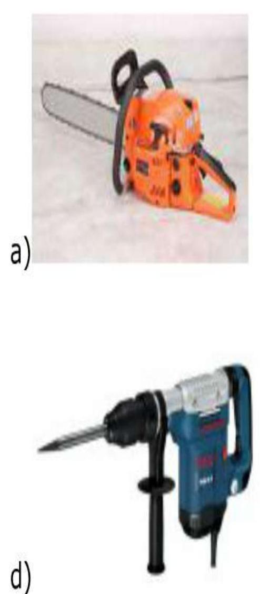

Şekil. Lokal titreşime neden olan bazı el aletleri (a-motorlu el testeresi, b, c-avuç içi zımparalar, d-darbeli matkap, e-kırıcı, f-el bileyici)

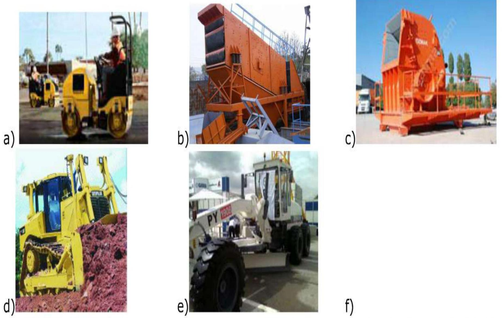

**Şekil.** Vücudun tamamında titreşime neden olan iş makinaları (a-Titreşimli silindir, b) Titreşimli elek, c-çeneli kırıcı, d-dozer, e-greyder)

### Titreşim Sınır Değerleri

*   **Maruziyet eylem değeri:** Aşıldığında, çalışanın titreşime maruziyetinden kaynaklanabilecek risklerin kontrol altına alınmasını gerektiren değerdir.
*   **Maruziyet sınır değeri:** Çalışanların bu değerin üzerinde bir titreşime kesinlikle maruz kalmaması gereken değerdir.

#### El-kol titreşimi için:

*   Sekiz saatlik çalışma süresi için günlük maruziyet sınır değeri: $5 \mathrm{~m} / \mathrm{sn}^{2}$
*   Sekiz saatlik çalışma süresi için günlük maruziyet eylem değeri: $2,5 \mathrm{~m} / \mathrm{sn}^{2}$

#### Bütün Vücut titreşimi için:

*   Sekiz saatlik çalışma süresi için günlük maruziyet sınır değeri: $1,15 \mathrm{~m} / \mathrm{sn}^{2}$
*   Sekiz saatlik çalışma süresi için günlük maruziyet eylem değeri: $0,5 \mathrm{~m} / \mathrm{sn}^{2}$

### Titreşime Bağlı Risklere Maruziyeti En Aza İndirmek İçin Yapılması Gerekenler

*   Mekanik titreşime maruziyeti azaltan daha iyi çalışma yöntemleri seçmek.
*   Mümkün olan en düşük düzeyde titreşim oluşturan, ergonomik tasarlanmış uygun iş ekipmanını seçmek.
*   Titreşimi azaltan oturma yerleri, el tutma yerleri gibi yardımcı ekipmanlar sağlamak.
*   İşyeri, işyeri sistemleri ve iş ekipmanları için uygun bakım programları uygulamak.
*   İşyerini ve çalışma ortamını uygun şekilde tasarlamak ve düzenlemek.
*   İş ekipmanını doğru ve güvenli kullanmaları için çalışanlara gerekli bilgi ve eğitimi vermek.
*   Maruziyet süresi ve düzeyini sınırlandırmak, yeterli dinlenme aralarıyla çalışma sürelerini düzenlemek.
*   Çalışana soğuktan ve nemden koruyacak giysi sağlamak.

### Titreşimin İnsan Üzerindeki Etkileri

Titreşimin etkileri şunlara bağlıdır:

*   Titreşimin frekansı
*   Titreşimin şiddeti
*   Titreşimin yönü
*   Titreşime maruz kalınan süre
*   Titreşime maruz kalınan bölge ve büyüklüğü
*   Çalışanın yaşı
*   Cinsiyeti
*   Kişisel duyarlılığı
*   Genel sağlık durumu

Titreşimden oluşan meslek hastalığının yükümlülük süresi 2 yıldır.

### Beyaz Parmak Hastalığı
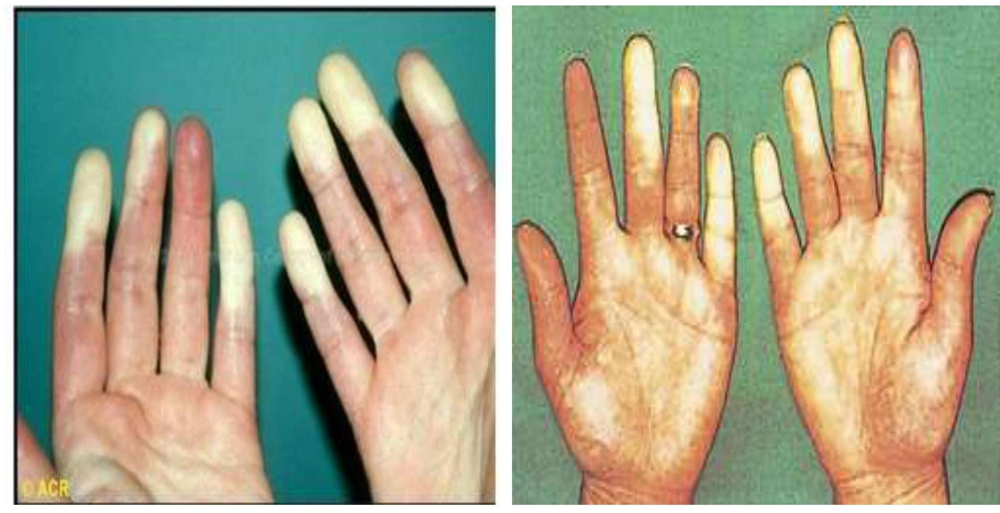

## 4. Radyasyon

Radyasyon, enerjinin elektromanyetik dalgalar veya parçacıklar şeklinde yayılmasıdır. Maddesel ortamlardan geçerken etkileşerek iyon çiftleri oluşturabilen X ışınları, gama ışınları gibi elektromanyetik ışınlar veya kinetik enerjisi olan yüklü parçacıklar (alfa, beta, nötron vb.) radyasyonu oluşturur. **Radyoaktivite**, kararsız nükleitlerin parçacık veya elektromanyetik ışıma yayımlayarak kütle yitirme özelliğidir. Uzay ve güneş kaynaklı doğal radyasyon tüm canlıları sürekli etkiler. **Becquerel (Bq)**, saniyede 1 parçalanma gösteren maddenin aktivitesidir.

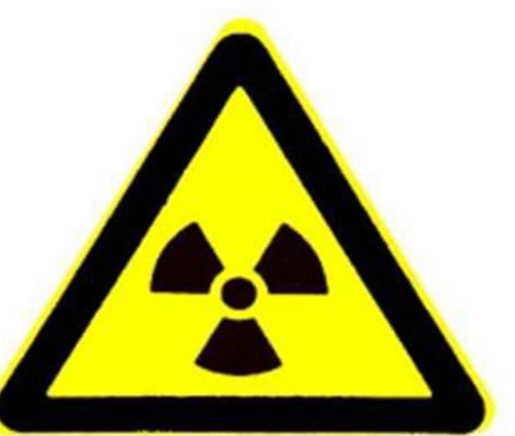

Yüksek dozda radyasyon insan sağlığı için zararlıdır. Vücuda derinlemesine işleyen ışınlar en tehlikeli olanlardır.

### Doğal Radyasyon Kaynakları

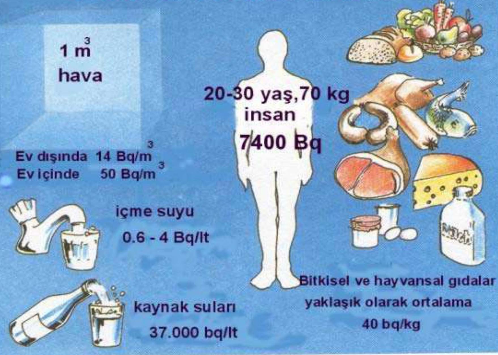

### Yapay Radyasyon

Işınlar iki ana gruba ayrılır:

1.  **İyonize Olmayan Işınlar:** Zararlı etkileri iyonize ışınlara göre çok daha azdır.
    *   Ultraviyole (mor ötesi) ışınları
    *   Kızılötesi (infrared) ışınlar
    *   Kısa Dalga Işınları (Mikro dalgalar, TV dalgaları, Radyo dalgaları)

2.  **İyonize Olan Işınlar:** Ortamla etkileşerek iyon çiftleri oluştururlar.
    *   Alfa Işınları
    *   Beta Işınları
    *   Gamma Işınları
    *   X Işınları
    *   Nötron Işınları
    *   Proton Işınları

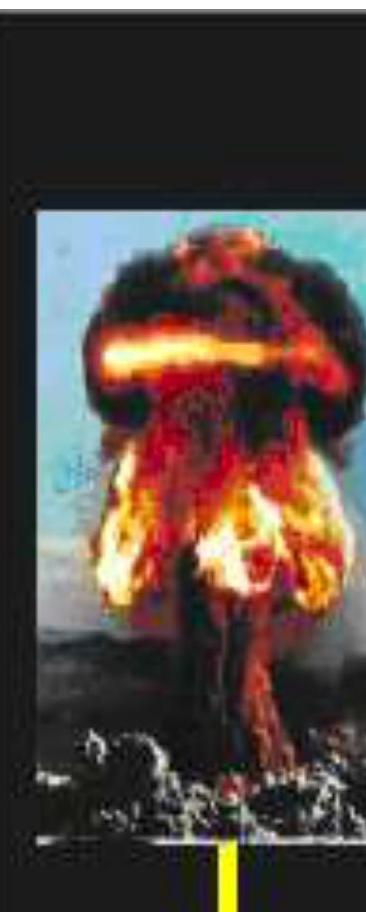
*Atom bombasının patlaması sırasında gama ışınları oluşur.*

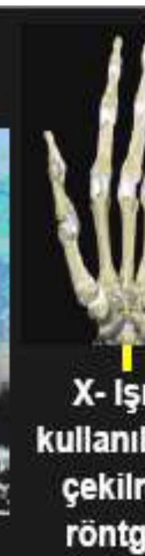
*Masa lambası görünür bölgede ışık yayar.*

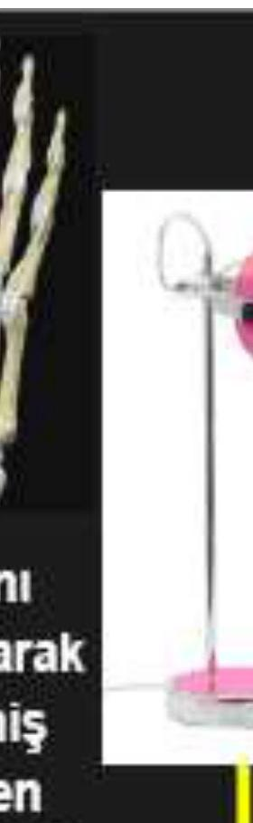
*Radyo dalgalarını yayan istasyon*

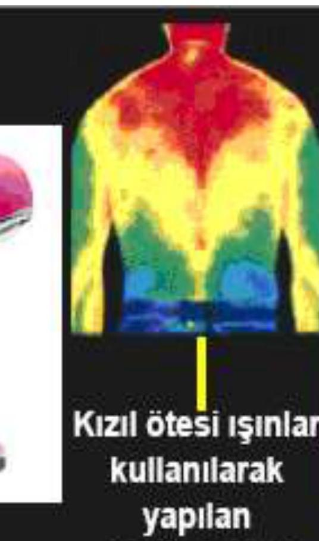

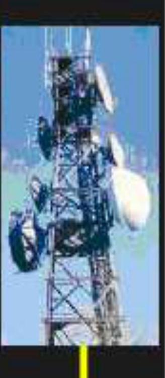

* **Ultraviyole Işınları:** Temel kaynağı güneş ve diğer yapay kaynaklardır (kaynak arkları, UV lambaları). Deri ve göz üzerinde olumsuz etkileri vardır (güneş yanığı, deri kanseri, göz sulanması, konjonktivit).
*   **Enfraruj Işınları:** Sıcak cisimlerden yayılır, ısı verirler. Derinin derin tabakalarına işlemezler, ancak aşırı maruziyet deri yanıklarına neden olabilir.
*   **Kızılötesi Işınlar:** Yapay olarak elde edilebildiği gibi güneş ışınlarında da bulunur. Vücutta ısı artışına ve deri yanıklarına, gözde katarakt gibi hastalıklara yol açabilir.
*   **Kısa Dalga Işınları:** Yüksek frekanslı akım kullanan elektronik cihazlarda ve radar sistemlerinde görülür. Uzun süre maruziyet organlarda ısı yükselmesine, katarakta neden olabilir.

**İyonize Olan Işınlar:** Ortamda doğrudan veya dolaylı iyon çiftleri oluştururlar.

*   **Alfa Işınları:** İnce bir kağıt veya cilt tarafından durdurulur.
*   **Beta Işınları:** İnce bir metal tabakası tarafından durdurulur.
*   **Gama Işınları:** Yüksek nüfuziyet özelliğine sahiptir; kurşun ve beton gibi yoğun malzemelerle durdurulur. Radyoaktif maddeler ve nükleer reaksiyonlar sonucu oluşur.
*   **X Işınları:** Röntgen cihazlarından yayılır. Gama ışınları gibi yoğun malzemelerle durdurulur.
*   **Nötron Işınları:** Parafin, beton, su gibi hidrojence zengin ortamlarda soğurulur.
*   **Proton Işınları**

Kaynak ile işçiler arasına uygun koruyucu paravanlar (zırhlar) konulmalıdır. Bu zırhlar, ışın türüne göre kurşun, beton veya plastik gibi malzemelerden yapılır.

### Radyasyonun Giriciliği

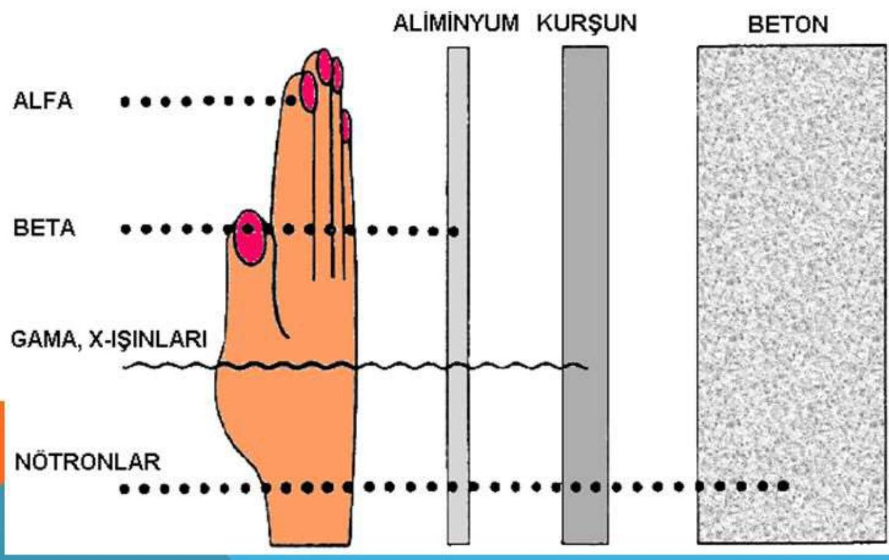

### Radyasyon Zararını Azaltmak İçin Bazı Malzemelerin Zırh Kalınlıkları

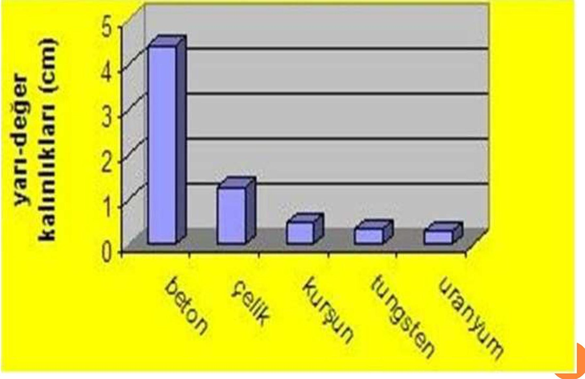

### Elektromanyetik Spektrum

| **Radyo** | **Mikrodal** | **Infrared** | **Görünür** | **Ultraviole** | **X-ışım** | **Gama ışımı** |
| :-------- | :----------- | :----------- | :---------- | :------------- | :--------- | :------------- |
| 10⁴       | 10⁵          | 10⁰          | 10⁴         | 10⁴            | 10⁴        | 10⁴            |
| Dalgaboyları cm olarak |              |              |             |                |            |                |

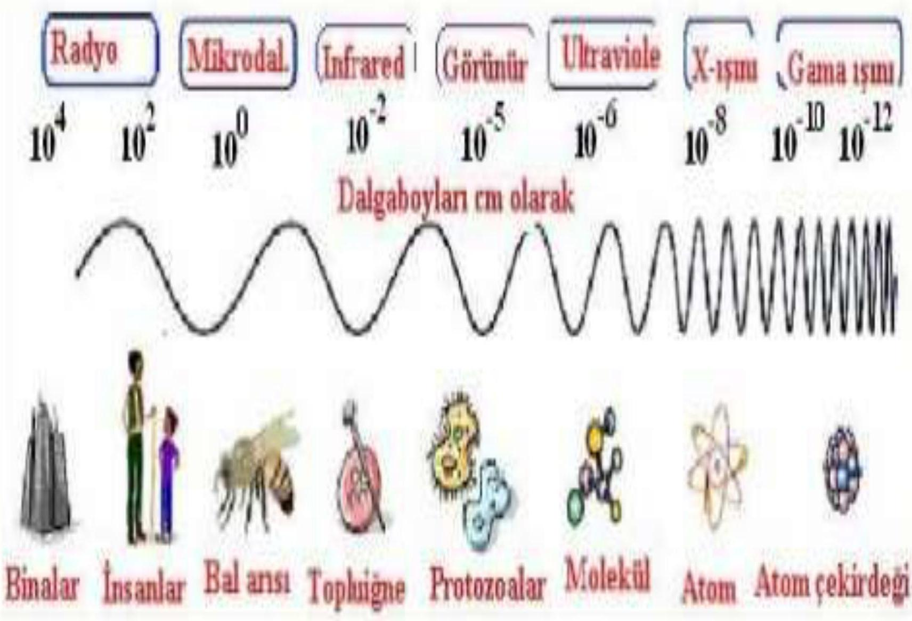

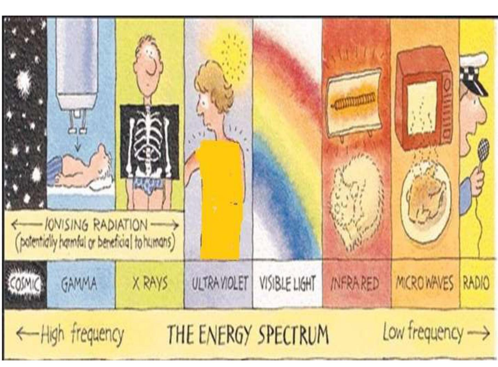

### FUNGING RADIATION (Potansiyel olarak zararlı veya faydalı)

*   GAMMA
*   X RAYS
*   ULTRAVIOLET
*   VISIBLE LIGHT
*   INFRARED
*   MICROWAVES
*   RADIO

### THE ENERGY SPECTRUM (High frequency)

*   (Burada spesifik enerji spektrumu bilgisi mevcut değildir)

### LOW-TRANEER (Low frequency)

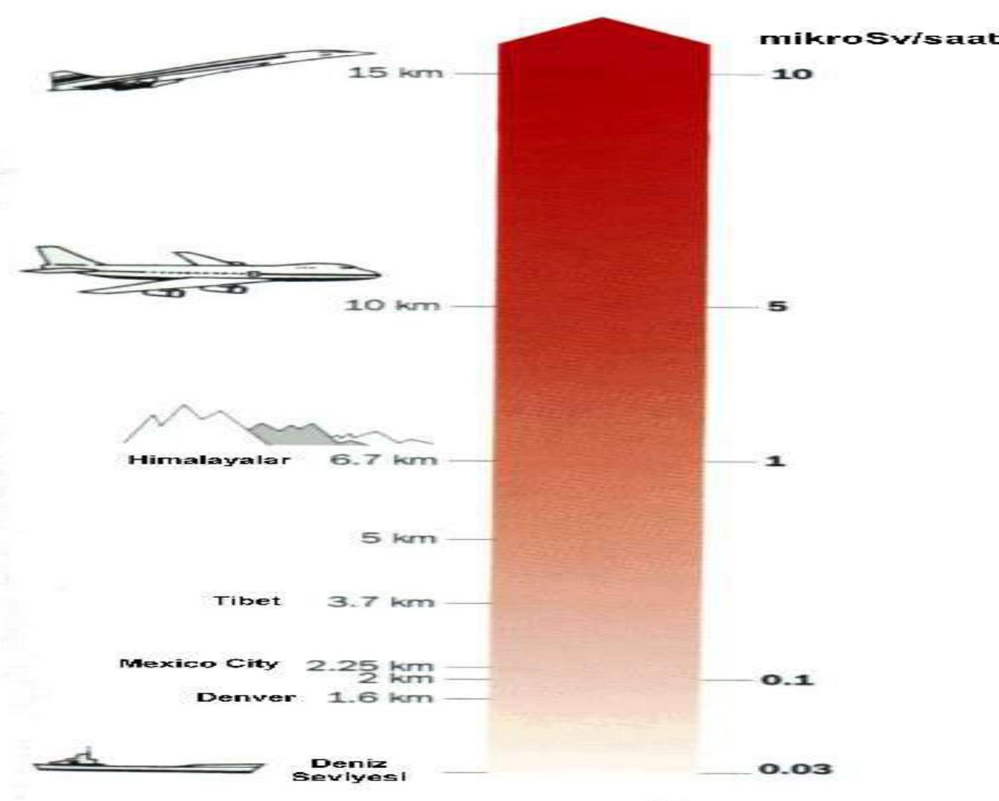

Dünya, uzaydan gelen yüksek enerjili parçacıklarla sürekli bombardıman altındadır; buna **kozmik radyasyon** denir. Yüksek rakımda yaşayanlar ve pilotlar bu radyasyona daha fazla maruz kalırlar.

### Sağlığa Etkileri

UV Radyasyonun etkileri arasında yanıklar, mutasyonlar, kromozom bölünmeleri, hücre bölünmesinde gecikmeler, dev hücre oluşumu, metabolizma ve protein sentezini etkileme yer alır. İyonlaşmaya yol açan radyasyonun insan vücudu üzerinde çeşitli etkileri vardır:

*   **Deri Üzerine (Radyodermit):** Uzun süreli maruziyette deri koyulaşır, kurur, kıllar dökülür, tırnaklar bozulur, kılcal damarlar genişler. İlerleyen vakalarda ağrılı yaralar ve deri kanserleri oluşabilir.
*   **Kan Bozuklukları:** Akyuvarlar azalabilir veya aşırı artabilir (lösemi), kansızlık ağırlaşabilir.
*   **Akciğer Kanseri:** Radyoaktif maden ocaklarında çalışanlarda görülebilir.
*   **Kemik Bozuklukları:** Kemiklerde erime, kemik kanseri meydana gelebilir.
*   **Göz Bozuklukları:** Katarakt, konjonktivit, göz kapağı kanseri yapabilir.

### Radyasyonun Ölçülmesi

*   Dıştan etki eden ışınlar, **global dozimetre** ile ölçülür.
*   İç kontaminasyon, toplam veya parsiyel beden spektrometresi ile ölçülür.
*   Işına maruz kalınan işlerde çalışanlar sürekli denetlenmeli ve hastalıkları halinde bu denetim sonuçlarından yararlanılmalıdır.

### Radyasyonun Denetimi

Radyasyonun işyerlerinde kullanımı ve denetlenmesi, **Atom Enerji Kurumu Başkanlığı** tarafından yürütülür.

Bilgisayarlı tomografi (BT) cihazları, normal röntgenlere göre yaklaşık 100 kat daha fazla radyasyon yayar. Beyin tomografisinde çekilen radyasyon miktarı, yaklaşık 400 akciğer filmine eşdeğerdir. Bu zararlı etkiler nedeniyle birçok Avrupa ülkesinde hasta başına 6 ay sınırlaması varken, Türkiye'de bu sınırın olmaması, hastaların aynı gün içinde birden fazla BT ve MR çektirmesine olanak tanımaktadır.

## 5. Basınç

Basıncın arttığı veya azaldığı işlerde çalışanlarda görülen bozukluklar ciddi boyutlara ulaşabilir. Basıncın hızla değişmesi sağlığı olumsuz etkiler. Yüksek basınç, özellikle dalgıçlarda ve su altında çalışanlarda görülür. Ülkemizde sünger avcılarının "vurgun yemek" olarak adlandırdığı felç hastalığı, basınç değişikliğine bağlı bir iş kazasıdır.

**Basınç:** Birim alana yapılan kuvvettir (Birim: Bar veya Newton/cm²). Kuvvetin uygulandığı her noktada bir basınç vardır. İş Sağlığı ve Güvenliği açısından basınç, normal hava basıncının (atmosfer basıncı) üzerinde veya altında olduğu iş yerlerindeki basınçtır. Normal şartlarda hava basıncı 76 cm civa basıncına eşittir.
Atmosfer basıncından daha yüksek veya daha düşük basınçlı yerlerde çalışan işçilerde:

*   Kalp, dolaşım ve solunum rahatsızlıkları görülebilir.
*   Normal organizma $4 \mathrm{~N} / \mathrm{cm}^{2}$ kadar basınç değişimini tolere edebilir.
*   Vücuttaki oksijenin kısmi basıncının düşmesi sonucu anoksemi, taşikardi görülebilir.

### Sağlığa Etkileri

#### Basınç Artışında Meydana Gelen Bozukluklar:

**a) Basınç Altına Girerken Olanlar:** Normal basınçtan yüksek basınca geçerken kulak uğultusu, yüzdeki sinüslerde ağrı olur. Ani basınç değişimi kulak bozukluklarına yol açabilir.

**b) Basınç Altında Çalışırken Olanlar:** Alkol sarhoşluğuna benzer bir durum oluşur. Hareketler düzensizleşir, güvenliği tehlikeye girer. Bu durum uyuklamaya ve hatta ölüme yol açabilir.

**c) Yüksek Basınç Kalkarken Olanlar (En Önemlileri):** Yüksek basınçtan hızla normal basınca geçiş, dalgıçlarda sakatlıklara ve ölümlere neden olan bozukluklara yol açar. Yüksek basınç altında havanın azotu dokularda çözünmüş halde bulunur. Basınç hızla kalktığında, azot gaz haline geçer ve çeşitli organlarda dolaşımı engelleyerek tıkanmalara neden olur. Sonuçları arasında kalp durması, akciğer ödemi, felç, şiddetli karın ağrıları, kaşıntı, deri altında şişlik, kemik ağrıları sayılabilir. Daha hafif vakalarda sadece kemik ve eklem yerlerinde ağrılar, hareket güçlüğü ve ağrı görülür. Kemik röntgeninde bozukluklar tespit edilebilir.

*   Düşük ve yüksek basıncın işçiler üzerindeki olumsuz etkileri bir meslek hastalığıdır.
*   Yüksek basınç altında çalışılan işyerlerinde dekompresyon odası bulunmalıdır.
*   Basınç değişikliği nedeniyle görülen akut durumlarda yükümlülük süresi 3 gün, diğer durumlarda ise 10 yıldır.

## 6. Termal Konfor

Termal konfor, ortam sıcaklığı, nemi, hava akım hızı ve radyan ısının çalışan için en uygun olduğu şartlardır.

1.  **Hava Sıcaklığı:** Konveksiyon, iletim ve ışınım yoluyla yayılır. Termometre ile ölçülür (santigrat, Fahrenheit, Kelvin).
    *   Normal insan vücut sıcaklığı $36,5-37^{\circ} \mathrm{C}$ arasındadır.
    *   **Yüksek Sıcaklık:** Vücut ısı regülasyonunun bozulmasıyla $41^{\circ} \mathrm{C}$'ye ulaşan vücut ısısı "ısı çarpması"na neden olur. Aşırı terlemeye bağlı "ısı krampları" oluşabilir.
    *   **Düşük Sıcaklık:** Uyuşukluk, uyku hali, hissizlik ve donma gibi olumsuz etkilere yol açar.
    *   İş güvenliği tüzüğüne göre işyerlerinde sıcaklık $15^{\circ} \mathrm{C}$'den az, $30^{\circ} \mathrm{C}$'den yüksek olmamalıdır.

2.  **Hava Nemi:** Higrometre ile ölçülür.
    *   **Mutlak Nem:** Havadaki su buharı miktarıdır.
    *   **Bağıl Nem:** Belirli bir sıcaklıkta, doymuş havadaki mutlak nemin yüzdesidir. İşçi sağlığı açısından önemlidir.
    *   Genel olarak bir işyerinde bağıl nemin %30-80 arasında olması istenir.

3.  **Hava Akım Hızı:** Anemometre ile ölçülür.
    *   Vücut ile çevre arasındaki ısı transferini etkiler.
    *   Hava akım hızı saniyede $0,5 \mathrm{~m} / \mathrm{sn}$'yi aşmamalıdır.
    *   İnsanların hissettiği sıcaklık, termometre ile ölçülen sıcaklıktan farklıdır; ortamdaki nem ve hava akım hızı bu "hissedilen sıcaklığı" etkiler.

4.  **Radyan Isı:** Isı kaynaklarından ışıma yoluyla yayılan ısıdır. Glob termometresi ile ölçülür. Çevredeki cisimlerden yayılan ısı enerjisidir. İşyerlerindeki sıcak yüzeylerden yayılan ısı radyasyona örnektir. Termal radyasyondan korunmanın temel yolu, çalışan ile kaynak arasına ısı geçirmeyen bir perde koymaktır.

Hava sıcaklığı, nemi ve akım hızının birlikte bir kişi üzerinde bıraktığı sıcaklık hissine **Efektif Sıcaklık (Hissedilen Sıcaklık)** denir.

**Termal Konfor Şartlarına Etki Eden Faktörler:**

*   Ortam sıcaklığı
*   Ortam nemi
*   Ortamdaki hava akım hızı
*   Yapılan işin niteliği
*   Çalışanın giyim durumu
*   Çalışanın yaşı ve cinsiyeti
*   Çalışanın beslenmesi
*   Çalışanın fiziki durumu
*   Çalışanın genel sağlık durumu

---

# Temel Formüller ve Hızlı Bilgiler

*   **Ses Şiddeti Artışı:** 1 dB artış, ses enerjisinde ~1.26 kat artış.
*   **Ses Şiddeti Değişimi:** 3 dB artış/azalma, ses şiddetinin iki katına çıkması/yarıya inmesi anlamına gelir.
*   **Aydınlatma Birimi:** Lüks (Lümen/metrekare).
*   **Titreşim Frekans Birimi:** Hertz (Hz).
*   **Titreşim Şiddet Birimi:** m/sn².
*   **El-Kol Titreşimi Günlük Sınır Değeri:** $5 \mathrm{~m} / \mathrm{sn}^{2}$
*   **El-Kol Titreşimi Günlük Eylem Değeri:** $2,5 \mathrm{~m} / \mathrm{sn}^{2}$
*   **Tüm Vücut Titreşimi Günlük Sınır Değeri:** $1,15 \mathrm{~m} / \mathrm{sn}^{2}$
*   **Tüm Vücut Titreşimi Günlük Eylem Değeri:** $0,5 \mathrm{~m} / \mathrm{sn}^{2}$
*   **Atmosfer Basıncı:** ~76 cm civa basıncı.
*   **Termal Konfor İçin İdeal Bağıl Nem:** %30 - %80.
*   **Termal Konfor İçin İdeal Hava Akım Hızı:** < $0,5 \mathrm{~m} / \mathrm{sn}$.
*   **İşyerinde İdeal Sıcaklık Aralığı:** 15°C - 30°C.

---

# Kaynaklar

Kaynak bulunamadı.
